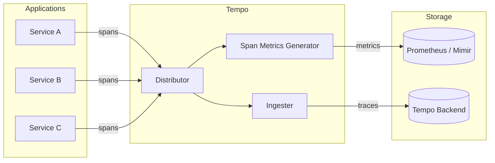
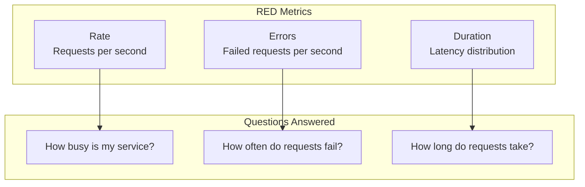

# How to Implement Tempo Span Metrics

Author: [nawazdhandala](https://github.com/nawazdhandala)

Tags: Tempo, Observability, Metrics, Performance

Description: Learn how to derive latency histograms, error rates, and RED metrics from distributed traces using Grafana Tempo's span metrics generator.

---

> Traces tell you *what happened* in a single request. Span metrics tell you *how your system is performing* across millions of requests.

Grafana Tempo's span metrics feature bridges the gap between traces and metrics by automatically generating RED (Rate, Errors, Duration) metrics from your span data. Instead of sampling a few traces and hoping you catch the slow ones, you get aggregate visibility into every request that flows through your system.

This guide walks through configuring span metrics in Tempo, extracting custom dimensions, building latency histograms, and setting up dashboards for production monitoring.

---

## Table of Contents

1. What Are Span Metrics?
2. Why Generate Metrics from Spans?
3. Architecture Overview
4. Configuring the Span Metrics Generator
5. Latency Histograms and Percentiles
6. Error Rate Tracking
7. Custom Dimension Extraction
8. RED Metrics in Practice
9. Querying Span Metrics in Prometheus/Grafana
10. Performance Considerations
11. Common Pitfalls
12. Putting It All Together

---

## 1. What Are Span Metrics?

Span metrics are aggregate statistics derived from distributed tracing spans. Instead of storing every individual span (which can be expensive at scale), you extract key measurements and store them as time-series metrics.

| Metric Type | What It Measures | Example |
|-------------|------------------|---------|
| Request Rate | How many requests per second | `traces_spanmetrics_calls_total` |
| Error Rate | Percentage of failed requests | `traces_spanmetrics_calls_total{status_code="STATUS_CODE_ERROR"}` |
| Duration | How long requests take (histogram) | `traces_spanmetrics_latency_bucket` |

These three measurements form the foundation of RED metrics, a widely adopted methodology for monitoring request-driven services.

---

## 2. Why Generate Metrics from Spans?

Traces and metrics serve different purposes:

| Traces | Metrics |
|--------|---------|
| High cardinality, detailed | Low cardinality, aggregated |
| Answer "why was this request slow?" | Answer "are requests getting slower?" |
| Sampled (often 1-10% in production) | 100% coverage |
| Expensive to store at scale | Cheap to store long-term |

Span metrics give you the best of both worlds:

- **100% coverage**: Every span contributes to the metric, even if the trace itself is sampled away.
- **Historical trends**: Track latency percentiles over weeks or months.
- **Alerting**: Set thresholds on p99 latency or error rate.
- **Correlation**: Jump from a metric spike directly to example traces.

---

## 3. Architecture Overview

Here is how span metrics flow from your application to your monitoring stack:



The span metrics generator sits in the ingestion path. As spans arrive, it:

1. Extracts dimensions (service name, operation, status code)
2. Updates histograms and counters
3. Pushes metrics to a Prometheus-compatible backend
4. Passes spans through to normal trace storage

This happens inline with minimal overhead.

---

## 4. Configuring the Span Metrics Generator

Enable span metrics in your Tempo configuration:

```yaml
# tempo.yaml - Span metrics generator configuration

# Enable the metrics generator component
metrics_generator:
  # Ring configuration for distributed deployments
  ring:
    kvstore:
      store: memberlist

  # Processor configuration
  processor:
    # Enable span metrics processing
    span_metrics:
      # Histogram bucket boundaries for latency (in seconds)
      # These buckets determine your percentile accuracy
      histogram_buckets: [0.002, 0.004, 0.008, 0.016, 0.032, 0.064, 0.128, 0.256, 0.512, 1.024, 2.048, 4.096, 8.192]

      # Dimensions to extract from spans
      # Each unique combination creates a separate time series
      dimensions:
        - service.name        # Which service handled the request
        - span.name           # Operation name (e.g., "GET /api/users")
        - span.kind           # SERVER, CLIENT, INTERNAL, etc.
        - status.code         # OK, ERROR, UNSET

      # Enable all three metric types
      enable_target_info: true

  # Storage configuration for generated metrics
  storage:
    path: /var/tempo/generator/wal

    # Remote write to Prometheus or Mimir
    remote_write:
      - url: http://prometheus:9090/api/v1/write
        send_exemplars: true  # Link metrics back to trace IDs

# Enable the generator in the module list
target: all
```

### Key Configuration Options

| Option | Purpose | Recommendation |
|--------|---------|----------------|
| `histogram_buckets` | Defines latency bucket boundaries | Start with powers of 2 in milliseconds |
| `dimensions` | Attributes to extract as labels | Keep cardinality low (under 10 dimensions) |
| `enable_target_info` | Adds service metadata | Enable for service discovery |
| `send_exemplars` | Links metrics to trace IDs | Enable for trace correlation |

---

## 5. Latency Histograms and Percentiles

Latency histograms are the heart of span metrics. They let you answer questions like:

- What is the p99 latency for my checkout service?
- How many requests took longer than 500ms?
- Is latency getting worse over time?

### How Histograms Work

Tempo counts how many spans fall into each duration bucket:

```
Bucket: 0-2ms    -> 1,234 spans
Bucket: 2-4ms    -> 5,678 spans
Bucket: 4-8ms    -> 3,456 spans
Bucket: 8-16ms   -> 2,345 spans
Bucket: 16-32ms  -> 1,234 spans
Bucket: 32-64ms  ->   567 spans
Bucket: 64-128ms ->   234 spans
Bucket: 128ms+   ->    89 spans
```

From this distribution, you can calculate any percentile.

### Choosing Bucket Boundaries

Your bucket boundaries determine percentile accuracy. Consider your SLO targets:

```yaml
# For services with sub-10ms SLOs (caches, in-memory lookups)
histogram_buckets: [0.001, 0.002, 0.004, 0.008, 0.016, 0.032, 0.064, 0.128]

# For typical web services (10ms - 1s range)
histogram_buckets: [0.005, 0.01, 0.025, 0.05, 0.1, 0.25, 0.5, 1, 2.5, 5, 10]

# For batch jobs or long-running operations
histogram_buckets: [0.1, 0.5, 1, 2, 5, 10, 30, 60, 120, 300]
```

### Querying Percentiles

Calculate p50, p90, p99 latency in PromQL:

```promql
# p99 latency for the checkout service
histogram_quantile(0.99,
  sum(rate(traces_spanmetrics_latency_bucket{service="checkout"}[5m])) by (le)
)

# p50 latency by operation
histogram_quantile(0.50,
  sum(rate(traces_spanmetrics_latency_bucket{service="api-gateway"}[5m])) by (le, span_name)
)

# Compare p99 across services
histogram_quantile(0.99,
  sum(rate(traces_spanmetrics_latency_bucket[5m])) by (le, service)
)
```

---

## 6. Error Rate Tracking

Span metrics automatically track error rates using the span status code. A span with `status_code=STATUS_CODE_ERROR` is counted as an error.

### Error Rate Queries

```promql
# Error rate as a percentage
sum(rate(traces_spanmetrics_calls_total{status_code="STATUS_CODE_ERROR"}[5m]))
/
sum(rate(traces_spanmetrics_calls_total[5m]))
* 100

# Error rate by service
sum by (service) (rate(traces_spanmetrics_calls_total{status_code="STATUS_CODE_ERROR"}[5m]))
/
sum by (service) (rate(traces_spanmetrics_calls_total[5m]))
* 100

# Error rate by endpoint
sum by (span_name) (rate(traces_spanmetrics_calls_total{
  service="api-gateway",
  status_code="STATUS_CODE_ERROR"
}[5m]))
/
sum by (span_name) (rate(traces_spanmetrics_calls_total{service="api-gateway"}[5m]))
* 100
```

### Setting Up Error Alerts

```yaml
# Prometheus alerting rule
groups:
  - name: span_metrics_alerts
    rules:
      # Alert when error rate exceeds 1%
      - alert: HighErrorRate
        expr: |
          (
            sum(rate(traces_spanmetrics_calls_total{status_code="STATUS_CODE_ERROR"}[5m])) by (service)
            /
            sum(rate(traces_spanmetrics_calls_total[5m])) by (service)
          ) > 0.01
        for: 5m
        labels:
          severity: warning
        annotations:
          summary: "High error rate on {{ $labels.service }}"
          description: "Error rate is {{ $value | humanizePercentage }} over the last 5 minutes"

      # Alert when p99 latency exceeds SLO
      - alert: HighLatency
        expr: |
          histogram_quantile(0.99,
            sum(rate(traces_spanmetrics_latency_bucket[5m])) by (le, service)
          ) > 1.0
        for: 5m
        labels:
          severity: warning
        annotations:
          summary: "High p99 latency on {{ $labels.service }}"
          description: "p99 latency is {{ $value | humanizeDuration }}"
```

---

## 7. Custom Dimension Extraction

Beyond the default dimensions, you can extract custom attributes from your spans to create more detailed metrics.

### Extracting Span Attributes

```yaml
# tempo.yaml
metrics_generator:
  processor:
    span_metrics:
      dimensions:
        # Standard dimensions
        - service.name
        - span.name
        - status.code

        # Custom dimensions from span attributes
        - http.method          # GET, POST, PUT, DELETE
        - http.status_code     # 200, 404, 500
        - http.route           # /api/users/{id}
        - db.system            # postgresql, redis, mongodb
        - messaging.system     # kafka, rabbitmq
        - deployment.environment  # production, staging

      # Dimension mapping for attribute renaming
      dimension_mappings:
        - name: http.target
          source_attributes:
            - http.route
            - http.url
```

### Cardinality Warning

Every unique combination of dimensions creates a new time series. Be careful with high-cardinality attributes:

| Dimension | Cardinality | Safe? |
|-----------|-------------|-------|
| `service.name` | ~10-100 | Yes |
| `http.method` | 5-10 | Yes |
| `http.route` | ~50-500 | Usually |
| `http.url` | Unbounded | No - use http.route instead |
| `user.id` | Unbounded | No - never use as dimension |
| `trace.id` | Unbounded | No - defeats the purpose |

### Using Intrinsic Dimensions

Tempo provides built-in intrinsic dimensions that do not require explicit configuration:

```yaml
# These are always available
intrinsic_dimensions:
  service: true      # From resource attributes
  span_name: true    # Operation name
  span_kind: true    # SERVER, CLIENT, etc.
  status_code: true  # OK, ERROR, UNSET
  status_message: false  # Usually too high cardinality
```

---

## 8. RED Metrics in Practice

RED stands for Rate, Errors, and Duration. These three metrics provide comprehensive visibility into any request-driven service.

### The RED Method



### Complete RED Dashboard Queries

```promql
# RATE: Requests per second by service
sum by (service) (rate(traces_spanmetrics_calls_total[5m]))

# ERRORS: Error rate percentage by service
100 * (
  sum by (service) (rate(traces_spanmetrics_calls_total{status_code="STATUS_CODE_ERROR"}[5m]))
  /
  sum by (service) (rate(traces_spanmetrics_calls_total[5m]))
)

# DURATION: p50, p90, p99 latency by service
# p50
histogram_quantile(0.50, sum by (le, service) (rate(traces_spanmetrics_latency_bucket[5m])))

# p90
histogram_quantile(0.90, sum by (le, service) (rate(traces_spanmetrics_latency_bucket[5m])))

# p99
histogram_quantile(0.99, sum by (le, service) (rate(traces_spanmetrics_latency_bucket[5m])))
```

### Service-Level Dashboard

Here is a complete Grafana dashboard JSON for RED metrics:

```json
{
  "panels": [
    {
      "title": "Request Rate",
      "type": "timeseries",
      "targets": [
        {
          "expr": "sum by (service) (rate(traces_spanmetrics_calls_total[5m]))",
          "legendFormat": "{{ service }}"
        }
      ]
    },
    {
      "title": "Error Rate %",
      "type": "timeseries",
      "targets": [
        {
          "expr": "100 * sum by (service) (rate(traces_spanmetrics_calls_total{status_code=\"STATUS_CODE_ERROR\"}[5m])) / sum by (service) (rate(traces_spanmetrics_calls_total[5m]))",
          "legendFormat": "{{ service }}"
        }
      ]
    },
    {
      "title": "Latency Percentiles",
      "type": "timeseries",
      "targets": [
        {
          "expr": "histogram_quantile(0.50, sum by (le) (rate(traces_spanmetrics_latency_bucket{service=\"$service\"}[5m])))",
          "legendFormat": "p50"
        },
        {
          "expr": "histogram_quantile(0.90, sum by (le) (rate(traces_spanmetrics_latency_bucket{service=\"$service\"}[5m])))",
          "legendFormat": "p90"
        },
        {
          "expr": "histogram_quantile(0.99, sum by (le) (rate(traces_spanmetrics_latency_bucket{service=\"$service\"}[5m])))",
          "legendFormat": "p99"
        }
      ]
    }
  ]
}
```

---

## 9. Querying Span Metrics in Prometheus/Grafana

### Metric Names

Tempo generates three primary metrics:

| Metric | Type | Description |
|--------|------|-------------|
| `traces_spanmetrics_calls_total` | Counter | Total number of spans |
| `traces_spanmetrics_latency_bucket` | Histogram | Duration distribution |
| `traces_spanmetrics_latency_sum` | Counter | Sum of all durations |
| `traces_spanmetrics_latency_count` | Counter | Count of observations |

### Advanced Queries

```promql
# Throughput trend (requests per minute, smoothed)
sum(rate(traces_spanmetrics_calls_total[5m])) * 60

# Apdex score (satisfied < 100ms, tolerating < 400ms)
(
  sum(rate(traces_spanmetrics_latency_bucket{le="0.1"}[5m]))
  +
  sum(rate(traces_spanmetrics_latency_bucket{le="0.4"}[5m]))
  -
  sum(rate(traces_spanmetrics_latency_bucket{le="0.1"}[5m]))
) / 2
/
sum(rate(traces_spanmetrics_latency_count[5m]))

# Latency increase vs last week
histogram_quantile(0.99, sum(rate(traces_spanmetrics_latency_bucket[5m])) by (le))
-
histogram_quantile(0.99, sum(rate(traces_spanmetrics_latency_bucket[5m] offset 1w)) by (le))

# Top 5 slowest endpoints
topk(5,
  histogram_quantile(0.99,
    sum by (le, span_name) (rate(traces_spanmetrics_latency_bucket[5m]))
  )
)
```

### Linking Metrics to Traces with Exemplars

When `send_exemplars` is enabled, each metric data point can include a trace ID. This enables clicking from a metric spike directly to an example trace.

```yaml
# Grafana datasource configuration
datasources:
  - name: Prometheus
    type: prometheus
    url: http://prometheus:9090
    jsonData:
      exemplarTraceIdDestinations:
        - name: traceID
          datasourceUid: tempo
          urlDisplayLabel: View Trace
```

---

## 10. Performance Considerations

Span metrics add processing overhead. Here is how to optimize for high-throughput environments.

### Memory and CPU

```yaml
metrics_generator:
  processor:
    span_metrics:
      # Reduce histogram buckets for lower memory usage
      histogram_buckets: [0.01, 0.05, 0.1, 0.5, 1, 5]

      # Limit dimensions to control cardinality
      dimensions:
        - service.name
        - span.name
        - status.code

  # Configure resource limits
  ring:
    instance_interface_names:
      - eth0
```

### Scaling the Generator

For high-volume deployments, run multiple generator instances:

```yaml
# Kubernetes deployment
apiVersion: apps/v1
kind: Deployment
metadata:
  name: tempo-metrics-generator
spec:
  replicas: 3  # Scale based on span volume
  template:
    spec:
      containers:
        - name: tempo
          args:
            - -target=metrics-generator
          resources:
            requests:
              memory: 2Gi
              cpu: 1000m
            limits:
              memory: 4Gi
              cpu: 2000m
```

### Cardinality Limits

Protect against cardinality explosions:

```yaml
metrics_generator:
  processor:
    span_metrics:
      # Maximum unique label combinations
      max_active_series: 100000

      # Drop dimensions if cardinality exceeds limit
      drop_high_cardinality_dimensions: true
```

---

## 11. Common Pitfalls

### Pitfall 1: High Cardinality Explosion

**Problem**: Using `http.url` instead of `http.route` creates millions of time series.

**Solution**: Always use parameterized routes:

```yaml
# Bad - unbounded cardinality
dimensions:
  - http.url  # /users/123, /users/456, /users/789...

# Good - bounded cardinality
dimensions:
  - http.route  # /users/{id}
```

### Pitfall 2: Missing Span Attributes

**Problem**: Dimensions reference attributes that do not exist on spans.

**Solution**: Verify attributes in your instrumentation:

```typescript
// Ensure attributes are set before span ends
span.setAttribute('http.route', '/api/users/{id}');
span.setAttribute('http.method', 'GET');
span.end();
```

### Pitfall 3: Histogram Bucket Mismatch

**Problem**: Buckets do not align with your latency distribution, making percentiles inaccurate.

**Solution**: Analyze your actual latency distribution first:

```promql
# See where most requests fall
histogram_quantile(0.50, sum(rate(traces_spanmetrics_latency_bucket[1h])) by (le))
histogram_quantile(0.90, sum(rate(traces_spanmetrics_latency_bucket[1h])) by (le))
histogram_quantile(0.99, sum(rate(traces_spanmetrics_latency_bucket[1h])) by (le))
```

### Pitfall 4: Not Enabling Exemplars

**Problem**: Metrics show a spike but you cannot find the offending traces.

**Solution**: Enable exemplars in both Tempo and Prometheus:

```yaml
# tempo.yaml
metrics_generator:
  storage:
    remote_write:
      - url: http://prometheus:9090/api/v1/write
        send_exemplars: true

# prometheus.yaml
global:
  scrape_interval: 15s
storage:
  exemplars:
    max_exemplars: 100000
```

---

## 12. Putting It All Together

Here is a complete production configuration:

```yaml
# tempo.yaml - Complete span metrics configuration

server:
  http_listen_port: 3200

distributor:
  receivers:
    otlp:
      protocols:
        grpc:
        http:

metrics_generator:
  ring:
    kvstore:
      store: memberlist

  processor:
    span_metrics:
      # Latency buckets covering 1ms to 10s
      histogram_buckets: [0.001, 0.005, 0.01, 0.025, 0.05, 0.1, 0.25, 0.5, 1, 2.5, 5, 10]

      # Core dimensions for RED metrics
      dimensions:
        - service.name
        - span.name
        - span.kind
        - status.code
        - http.method
        - http.route
        - http.status_code

      # Protect against cardinality issues
      enable_target_info: true
      max_active_series: 50000

  # Metrics storage and export
  storage:
    path: /var/tempo/generator/wal
    remote_write:
      - url: http://mimir:9009/api/v1/push
        send_exemplars: true
        headers:
          X-Scope-OrgID: tempo

ingester:
  lifecycler:
    ring:
      replication_factor: 3

storage:
  trace:
    backend: s3
    s3:
      bucket: tempo-traces
      endpoint: s3.amazonaws.com

querier:
  frontend_worker:
    frontend_address: tempo-query-frontend:9095

compactor:
  compaction:
    block_retention: 336h  # 14 days
```

### Verification Checklist

After deploying span metrics, verify everything works:

1. **Check metrics are being generated**:
   ```promql
   traces_spanmetrics_calls_total
   ```

2. **Verify dimensions are populated**:
   ```promql
   count by (service) (traces_spanmetrics_calls_total)
   ```

3. **Confirm histogram buckets**:
   ```promql
   traces_spanmetrics_latency_bucket
   ```

4. **Test exemplar links** (in Grafana, enable exemplars on a panel and click a data point)

5. **Monitor generator health**:
   ```promql
   tempo_metrics_generator_spans_received_total
   tempo_metrics_generator_spans_discarded_total
   ```

---

## Summary

| Goal | How Span Metrics Help |
|------|----------------------|
| Track latency trends | Histogram percentiles (p50, p90, p99) |
| Monitor error rates | Counter with status_code dimension |
| Measure throughput | Rate of calls_total counter |
| Alert on SLO breaches | Prometheus alerting rules |
| Debug production issues | Exemplar links to traces |
| Reduce observability costs | Aggregate instead of storing every span |

Span metrics transform your tracing data into actionable, alertable metrics without losing the ability to drill down into individual traces when needed. Start with basic RED metrics, add custom dimensions as requirements emerge, and keep cardinality in check.

---

*Running Tempo and want a unified view of traces and metrics? [OneUptime](https://oneuptime.com) provides native OpenTelemetry support with integrated alerting, status pages, and incident management.*

---

### Related Reading

- [What are Traces and Spans in OpenTelemetry](https://oneuptime.com/blog/post/2025-08-27-traces-and-spans-in-opentelemetry/view)
- [OpenTelemetry Collector: What It Is and When You Need It](https://oneuptime.com/blog/post/2025-09-18-what-is-opentelemetry-collector-and-why-use-one/view)
- [The Three Pillars of Observability: Logs, Metrics, and Traces](https://oneuptime.com/blog/post/2025-08-20-three-pillars-of-observability-logs-metrics-traces/view)
