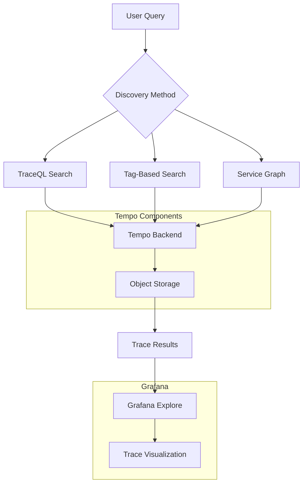
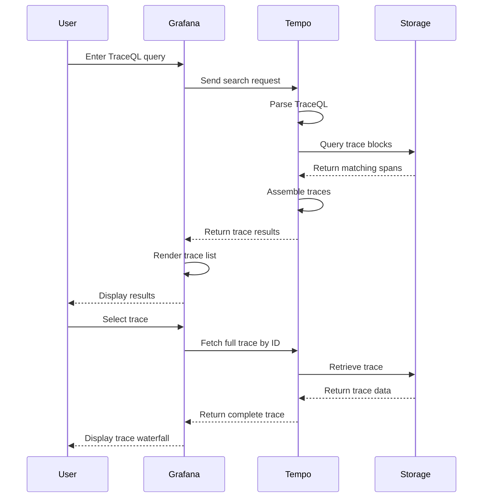
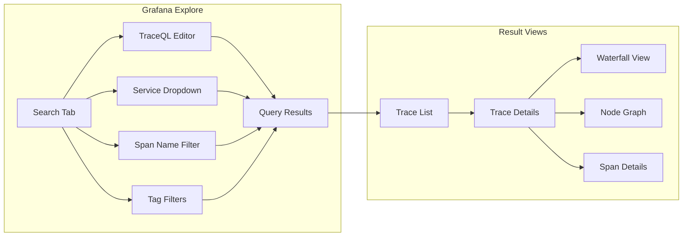

# How to Implement Tempo Trace Discovery

Author: [nawazdhandala](https://github.com/nawazdhandala)

Tags: Tempo, Observability, Tracing, Discovery

Description: Learn how to find and explore distributed traces in Grafana Tempo using TraceQL, tag-based search, and Grafana Explore integration.

---

Distributed tracing is essential for understanding how requests flow through microservices architectures. Grafana Tempo provides powerful trace discovery capabilities that help you find the exact traces you need without requiring expensive indexing of every field. This guide covers TraceQL query language, tag-based search, and integration with Grafana Explore.

## Understanding Tempo Trace Discovery

Tempo is a high-scale, cost-effective distributed tracing backend. Unlike traditional tracing systems that index all span attributes, Tempo stores traces in object storage and relies on trace IDs for retrieval. However, Tempo also provides several discovery mechanisms to help you find traces without knowing the trace ID upfront.



## TraceQL Query Language Basics

TraceQL is a query language designed specifically for searching traces. It allows you to select spans based on their attributes and then aggregate or filter the results.

### Basic Span Selection

The simplest TraceQL query selects spans matching specific criteria:

```traceql
// Find all spans from a specific service
{ resource.service.name = "checkout-service" }

// Find spans with a specific operation name
{ name = "HTTP GET" }

// Find spans with a specific status
{ status = error }
```

### Combining Conditions

You can combine multiple conditions using logical operators:

```traceql
// Find error spans in a specific service
{ resource.service.name = "payment-service" && status = error }

// Find spans matching either condition
{ name = "HTTP POST" || name = "HTTP PUT" }

// Find spans with duration greater than 500ms
{ resource.service.name = "api-gateway" && duration > 500ms }
```

### Attribute Filtering

TraceQL supports filtering on span attributes, resource attributes, and intrinsic fields:

```traceql
// Filter by span attribute
{ span.http.method = "POST" }

// Filter by resource attribute
{ resource.k8s.namespace.name = "production" }

// Filter by intrinsic fields (kind, status, duration, name)
{ kind = server && duration > 1s }
```

### Pipeline Operations

TraceQL supports pipeline operations for more complex queries:

```traceql
// Select spans and aggregate by count
{ resource.service.name = "order-service" } | count() > 10

// Find traces with spans matching multiple criteria
{ resource.service.name = "frontend" } >> { resource.service.name = "backend" }
```

## Search by Service, Span Name, and Attributes

### Service-Based Discovery

Finding traces by service name is one of the most common discovery patterns:

```traceql
// Find all traces involving the user-service
{ resource.service.name = "user-service" }

// Find traces where user-service calls database-service
{ resource.service.name = "user-service" } >> { resource.service.name = "database-service" }

// Find traces with slow database calls
{ resource.service.name = "database-service" && duration > 100ms }
```

### Span Name Discovery

Span names typically represent operations. Search by span name to find specific operations:

```traceql
// Find all database query spans
{ name =~ "SELECT.*" }

// Find HTTP endpoint spans
{ name = "HTTP GET /api/users" }

// Find gRPC method calls
{ name =~ "grpc.*" && span.rpc.method = "GetUser" }
```

### Attribute-Based Discovery

Custom attributes provide rich context for trace discovery:

```traceql
// Find traces for a specific user
{ span.user.id = "user-12345" }

// Find traces for a specific order
{ span.order.id = "order-67890" }

// Find traces with specific error types
{ span.error.type = "TimeoutException" }

// Find traces by deployment version
{ resource.service.version = "v2.1.0" }
```

## Trace Discovery Flow

The following diagram illustrates how trace discovery works in a typical observability stack:



## Tag-Based Search Configuration

To enable efficient tag-based search in Tempo, you need to configure which attributes should be indexed for search.

### Tempo Configuration

Configure the `metrics_generator` and `overrides` sections in your Tempo configuration:

```yaml
# tempo.yaml configuration for tag-based search

# Enable search on specific tags
search:
  # Maximum number of concurrent search jobs
  concurrent_jobs: 2000
  # Maximum number of results per search
  max_result_limit: 20

# Configure which tags to index for search
overrides:
  defaults:
    search:
      # Resource-level attributes to index
      resource_attributes:
        - service.name
        - service.namespace
        - service.version
        - k8s.namespace.name
        - k8s.pod.name
        - deployment.environment

      # Span-level attributes to index
      span_attributes:
        - http.method
        - http.status_code
        - http.url
        - db.system
        - db.statement
        - rpc.method
        - rpc.service
        - error.type

# Storage configuration for search
storage:
  trace:
    backend: s3
    s3:
      bucket: tempo-traces
      endpoint: s3.amazonaws.com

    # Block configuration affects search performance
    block:
      # Version 2 blocks support more efficient search
      version: vParquet3

    # Search configuration
    search:
      # Chunk size for search operations
      chunk_size_bytes: 1000000
      # Prefetch trace count
      prefetch_trace_count: 1000
```

### Helm Chart Configuration

When deploying Tempo with Helm, configure search in your values file:

```yaml
# values.yaml for Tempo Helm chart

tempo:
  searchEnabled: true

  # Configure search-specific settings
  search:
    concurrent_jobs: 2000
    max_result_limit: 20

  # Override configuration
  overrides:
    search:
      resource_attributes:
        - service.name
        - service.namespace
        - k8s.namespace.name
      span_attributes:
        - http.method
        - http.status_code
        - db.system

# Query frontend configuration
queryFrontend:
  search:
    # Duration for which search queries are cached
    query_result_cache_ttl: 5m
    # Maximum duration for search queries
    max_duration: 0
```

## Integration with Grafana Explore

Grafana Explore provides a powerful interface for discovering traces in Tempo.

### Setting Up the Tempo Data Source

Configure Tempo as a data source in Grafana:

```yaml
# grafana-datasources.yaml

apiVersion: 1

datasources:
  - name: Tempo
    type: tempo
    access: proxy
    url: http://tempo:3200

    jsonData:
      # Enable TraceQL search
      search:
        hide: false

      # Enable node graph visualization
      nodeGraph:
        enabled: true

      # Link to Loki for logs correlation
      tracesToLogs:
        datasourceUid: loki
        filterByTraceID: true
        filterBySpanID: true
        mapTagNamesEnabled: true
        mappedTags:
          - key: service.name
            value: service

      # Link to Prometheus for metrics correlation
      tracesToMetrics:
        datasourceUid: prometheus
        tags:
          - key: service.name
            value: service
        queries:
          - name: Request rate
            query: sum(rate(http_requests_total{$$__tags}[5m]))
          - name: Error rate
            query: sum(rate(http_requests_total{status="error",$$__tags}[5m]))

      # Service graph configuration
      serviceMap:
        datasourceUid: prometheus
```

### Using Grafana Explore for Trace Discovery

The Explore interface provides multiple ways to discover traces:



### Example Grafana Dashboard Panel

Create a dashboard panel that displays recent traces with errors:

```json
{
  "datasource": {
    "type": "tempo",
    "uid": "tempo"
  },
  "targets": [
    {
      "queryType": "traceql",
      "query": "{ status = error && duration > 500ms } | count() by (resource.service.name)",
      "limit": 20
    }
  ],
  "title": "Recent Error Traces by Service",
  "type": "table"
}
```

## Practical Code Examples

### Python Example: Instrumenting for Discoverable Traces

Add meaningful attributes to your spans for better discovery:

```python
# app.py - Flask application with OpenTelemetry instrumentation

from flask import Flask, request
from opentelemetry import trace
from opentelemetry.sdk.trace import TracerProvider
from opentelemetry.sdk.trace.export import BatchSpanProcessor
from opentelemetry.exporter.otlp.proto.grpc.trace_exporter import OTLPSpanExporter
from opentelemetry.sdk.resources import Resource
from opentelemetry.instrumentation.flask import FlaskInstrumentor

# Configure the tracer provider with resource attributes
# These attributes will be searchable in Tempo
resource = Resource.create({
    "service.name": "order-service",
    "service.version": "1.2.0",
    "deployment.environment": "production",
    "k8s.namespace.name": "orders"
})

# Initialize the tracer provider
provider = TracerProvider(resource=resource)

# Configure the OTLP exporter to send traces to Tempo
exporter = OTLPSpanExporter(
    endpoint="http://tempo:4317",
    insecure=True
)

# Add the batch processor for efficient trace export
provider.add_span_processor(BatchSpanProcessor(exporter))
trace.set_tracer_provider(provider)

# Get a tracer for this module
tracer = trace.get_tracer(__name__)

# Create the Flask application
app = Flask(__name__)

# Instrument Flask for automatic span creation
FlaskInstrumentor().instrument_app(app)


@app.route("/orders/<order_id>")
def get_order(order_id):
    # Get the current span
    current_span = trace.get_current_span()

    # Add custom attributes for trace discovery
    # These can be searched using TraceQL
    current_span.set_attribute("order.id", order_id)
    current_span.set_attribute("user.id", request.headers.get("X-User-ID", "unknown"))

    # Create a child span for database operations
    with tracer.start_as_current_span("fetch_order_from_db") as db_span:
        # Add database-specific attributes
        db_span.set_attribute("db.system", "postgresql")
        db_span.set_attribute("db.operation", "SELECT")
        db_span.set_attribute("db.statement", f"SELECT * FROM orders WHERE id = {order_id}")

        # Simulate database call
        order = fetch_order(order_id)

    return order


def fetch_order(order_id):
    # Database fetch logic here
    return {"id": order_id, "status": "completed"}


if __name__ == "__main__":
    app.run(host="0.0.0.0", port=8080)
```

### Go Example: Custom Span Attributes

```go
// main.go - Go service with OpenTelemetry instrumentation

package main

import (
	"context"
	"log"
	"net/http"

	"go.opentelemetry.io/otel"
	"go.opentelemetry.io/otel/attribute"
	"go.opentelemetry.io/otel/exporters/otlp/otlptrace/otlptracegrpc"
	"go.opentelemetry.io/otel/sdk/resource"
	sdktrace "go.opentelemetry.io/otel/sdk/trace"
	semconv "go.opentelemetry.io/otel/semconv/v1.17.0"
	"go.opentelemetry.io/otel/trace"
)

// Global tracer instance
var tracer trace.Tracer

// initTracer initializes the OpenTelemetry tracer
func initTracer() (*sdktrace.TracerProvider, error) {
	// Create the OTLP exporter for Tempo
	exporter, err := otlptracegrpc.New(
		context.Background(),
		otlptracegrpc.WithEndpoint("tempo:4317"),
		otlptracegrpc.WithInsecure(),
	)
	if err != nil {
		return nil, err
	}

	// Define resource attributes for service identification
	// These attributes enable service-based trace discovery
	res, err := resource.New(
		context.Background(),
		resource.WithAttributes(
			semconv.ServiceName("payment-service"),
			semconv.ServiceVersion("2.0.0"),
			attribute.String("deployment.environment", "production"),
			attribute.String("k8s.namespace.name", "payments"),
		),
	)
	if err != nil {
		return nil, err
	}

	// Create the tracer provider
	tp := sdktrace.NewTracerProvider(
		sdktrace.WithBatcher(exporter),
		sdktrace.WithResource(res),
	)

	otel.SetTracerProvider(tp)
	tracer = tp.Tracer("payment-service")

	return tp, nil
}

// processPayment handles payment processing with tracing
func processPayment(ctx context.Context, paymentID string, amount float64, userID string) error {
	// Start a new span for payment processing
	ctx, span := tracer.Start(ctx, "process_payment")
	defer span.End()

	// Add custom attributes for trace discovery
	// These can be searched using TraceQL queries like:
	// { span.payment.id = "pay-12345" }
	span.SetAttributes(
		attribute.String("payment.id", paymentID),
		attribute.Float64("payment.amount", amount),
		attribute.String("user.id", userID),
		attribute.String("payment.currency", "USD"),
	)

	// Validate the payment
	if err := validatePayment(ctx, paymentID, amount); err != nil {
		// Record error information for discovery
		span.SetAttributes(
			attribute.String("error.type", "ValidationError"),
			attribute.String("error.message", err.Error()),
		)
		span.RecordError(err)
		return err
	}

	// Process with payment gateway
	return processWithGateway(ctx, paymentID, amount)
}

// validatePayment validates payment details
func validatePayment(ctx context.Context, paymentID string, amount float64) error {
	_, span := tracer.Start(ctx, "validate_payment")
	defer span.End()

	span.SetAttributes(
		attribute.String("validation.type", "amount_check"),
		attribute.Bool("validation.passed", true),
	)

	return nil
}

// processWithGateway sends payment to external gateway
func processWithGateway(ctx context.Context, paymentID string, amount float64) error {
	_, span := tracer.Start(ctx, "gateway_request")
	defer span.End()

	span.SetAttributes(
		attribute.String("gateway.name", "stripe"),
		attribute.String("gateway.operation", "charge"),
	)

	return nil
}

func main() {
	// Initialize the tracer
	tp, err := initTracer()
	if err != nil {
		log.Fatalf("Failed to initialize tracer: %v", err)
	}
	defer tp.Shutdown(context.Background())

	// Set up HTTP handler
	http.HandleFunc("/payments", func(w http.ResponseWriter, r *http.Request) {
		ctx := r.Context()
		err := processPayment(ctx, "pay-12345", 99.99, "user-67890")
		if err != nil {
			http.Error(w, err.Error(), http.StatusInternalServerError)
			return
		}
		w.WriteHeader(http.StatusOK)
	})

	log.Fatal(http.ListenAndServe(":8080", nil))
}
```

### TraceQL Query Examples for Common Scenarios

```traceql
// Find slow API requests (more than 2 seconds)
{ resource.service.name = "api-gateway" && duration > 2s }

// Find failed payment transactions
{ resource.service.name = "payment-service" && status = error && span.payment.id != "" }

// Find traces for a specific user across all services
{ span.user.id = "user-67890" }

// Find database queries taking longer than expected
{ span.db.system = "postgresql" && duration > 100ms }

// Find traces where frontend calls backend with errors
{ resource.service.name = "frontend" } >> { resource.service.name = "backend" && status = error }

// Find high-value transactions
{ span.payment.amount > 1000 && resource.service.name = "payment-service" }

// Find traces in production environment
{ resource.deployment.environment = "production" }

// Find gRPC calls with specific methods
{ span.rpc.system = "grpc" && span.rpc.method = "ProcessOrder" }

// Find traces with retry attempts
{ span.retry.count > 0 }

// Find traces from a specific Kubernetes namespace
{ resource.k8s.namespace.name = "production" && status = error }
```

## Best Practices for Trace Discovery

1. **Use consistent attribute naming**: Follow OpenTelemetry semantic conventions for attribute names to ensure consistent discovery across services.

2. **Index high-cardinality attributes carefully**: Only index attributes that are frequently searched. High-cardinality attributes like user IDs should be indexed selectively.

3. **Add business context**: Include business-relevant attributes like order IDs, user IDs, and transaction types to enable business-focused trace discovery.

4. **Use resource attributes for service metadata**: Service name, version, and environment should be set as resource attributes, not span attributes.

5. **Configure appropriate retention**: Balance storage costs with discovery needs by configuring appropriate trace retention periods.

## Conclusion

Tempo provides powerful trace discovery capabilities through TraceQL, tag-based search, and Grafana integration. By properly instrumenting your applications with meaningful attributes and configuring Tempo for search, you can quickly find the traces you need to debug issues and understand system behavior. The combination of TraceQL query language and Grafana Explore provides a flexible and powerful interface for trace discovery in distributed systems.
