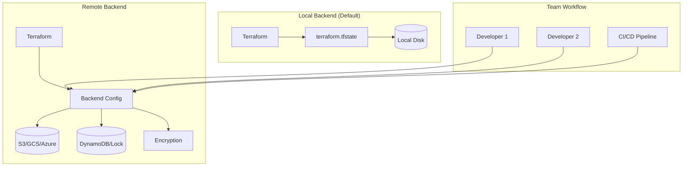
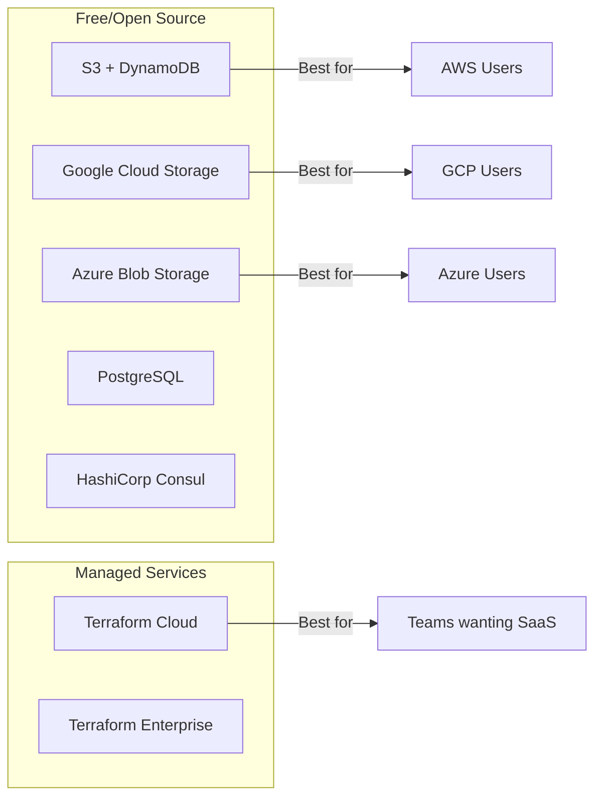
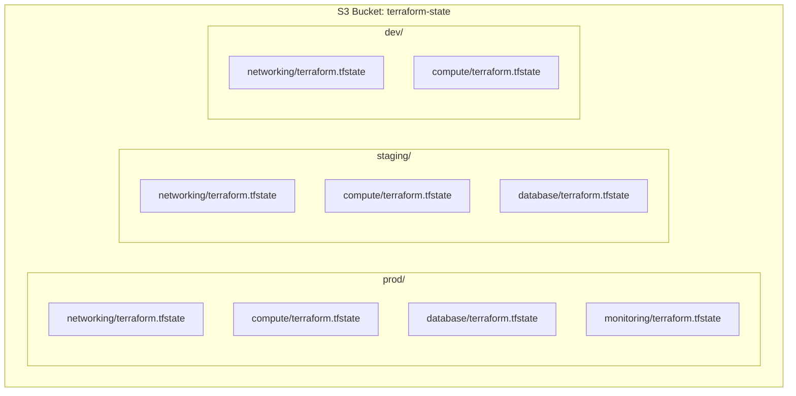
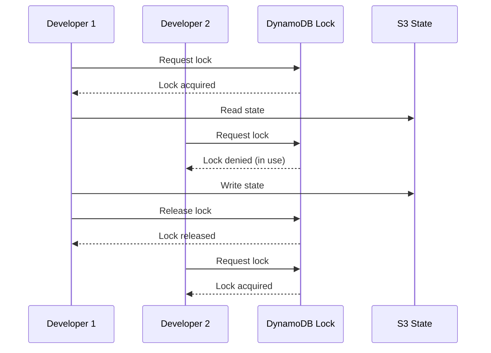

# How to Build Terraform Backend Configuration

Author: [nawazdhandala](https://github.com/nawazdhandala)

Tags: Terraform, IaC, Backend, State-Management

Description: Learn how to configure Terraform backends for secure, collaborative infrastructure state management across teams and environments.

---

Terraform state is the single source of truth for your infrastructure. By default, it lives in a local file, which works for learning but falls apart in team environments. Backend configuration solves this by storing state remotely with locking, encryption, and collaboration features.

## Understanding Terraform Backends

A backend determines where Terraform stores its state and how operations are executed. The right backend choice affects team collaboration, security, and disaster recovery.



## Why You Need Remote Backends

Local state files create several problems in production:

- **No locking**: Two engineers running `terraform apply` simultaneously corrupt state
- **No shared access**: State file on one laptop is invisible to the team
- **No encryption**: Secrets in state are stored in plain text
- **No versioning**: Accidental deletion means starting over

Remote backends solve all of these with built-in features for enterprise workflows.

## Backend Types Comparison



## S3 Backend Configuration

Amazon S3 with DynamoDB is the most popular backend for AWS users. S3 stores the state file while DynamoDB provides locking to prevent concurrent modifications.

### Create S3 Bucket and DynamoDB Table

First, create the infrastructure that will hold your state. This is a chicken-and-egg problem, so you typically create these resources manually or with a separate Terraform configuration.

```hcl
# bootstrap/main.tf - Run this first with local state
provider "aws" {
  region = "us-east-1"
}

resource "aws_s3_bucket" "terraform_state" {
  bucket = "my-company-terraform-state"

  lifecycle {
    prevent_destroy = true
  }
}

resource "aws_s3_bucket_versioning" "terraform_state" {
  bucket = aws_s3_bucket.terraform_state.id

  versioning_configuration {
    status = "Enabled"
  }
}

resource "aws_s3_bucket_server_side_encryption_configuration" "terraform_state" {
  bucket = aws_s3_bucket.terraform_state.id

  rule {
    apply_server_side_encryption_by_default {
      sse_algorithm = "aws:kms"
    }
  }
}

resource "aws_s3_bucket_public_access_block" "terraform_state" {
  bucket = aws_s3_bucket.terraform_state.id

  block_public_acls       = true
  block_public_policy     = true
  ignore_public_acls      = true
  restrict_public_buckets = true
}

resource "aws_dynamodb_table" "terraform_locks" {
  name         = "terraform-state-locks"
  billing_mode = "PAY_PER_REQUEST"
  hash_key     = "LockID"

  attribute {
    name = "LockID"
    type = "S"
  }
}

output "s3_bucket_name" {
  value = aws_s3_bucket.terraform_state.id
}

output "dynamodb_table_name" {
  value = aws_dynamodb_table.terraform_locks.name
}
```

### Configure the S3 Backend

After creating the S3 bucket and DynamoDB table, configure your main Terraform project to use them.

```hcl
# main.tf
terraform {
  required_version = ">= 1.0.0"

  backend "s3" {
    bucket         = "my-company-terraform-state"
    key            = "prod/infrastructure/terraform.tfstate"
    region         = "us-east-1"
    encrypt        = true
    dynamodb_table = "terraform-state-locks"
  }

  required_providers {
    aws = {
      source  = "hashicorp/aws"
      version = "~> 5.0"
    }
  }
}

provider "aws" {
  region = "us-east-1"
}
```

### Initialize with Backend Migration

If you have existing local state, migrate it to the remote backend.

```bash
# Initialize and migrate state
terraform init -migrate-state

# Verify state is accessible
terraform state list
```

## Google Cloud Storage Backend

For GCP users, Google Cloud Storage provides native backend support with built-in locking.

### Create GCS Bucket

```hcl
# bootstrap/main.tf
provider "google" {
  project = "my-project-id"
  region  = "us-central1"
}

resource "google_storage_bucket" "terraform_state" {
  name     = "my-company-terraform-state"
  location = "US"

  versioning {
    enabled = true
  }

  uniform_bucket_level_access = true

  lifecycle_rule {
    condition {
      num_newer_versions = 5
    }
    action {
      type = "Delete"
    }
  }
}
```

### Configure GCS Backend

GCS has built-in locking, so no separate lock table is needed.

```hcl
# main.tf
terraform {
  backend "gcs" {
    bucket = "my-company-terraform-state"
    prefix = "prod/infrastructure"
  }
}

provider "google" {
  project = "my-project-id"
  region  = "us-central1"
}
```

## Azure Blob Storage Backend

Azure users can use Blob Storage with native state locking support.

### Create Storage Account

```hcl
# bootstrap/main.tf
provider "azurerm" {
  features {}
}

resource "azurerm_resource_group" "terraform_state" {
  name     = "terraform-state-rg"
  location = "East US"
}

resource "azurerm_storage_account" "terraform_state" {
  name                     = "mycompanytfstate"
  resource_group_name      = azurerm_resource_group.terraform_state.name
  location                 = azurerm_resource_group.terraform_state.location
  account_tier             = "Standard"
  account_replication_type = "GRS"

  blob_properties {
    versioning_enabled = true
  }
}

resource "azurerm_storage_container" "terraform_state" {
  name                  = "tfstate"
  storage_account_name  = azurerm_storage_account.terraform_state.name
  container_access_type = "private"
}
```

### Configure Azure Backend

```hcl
# main.tf
terraform {
  backend "azurerm" {
    resource_group_name  = "terraform-state-rg"
    storage_account_name = "mycompanytfstate"
    container_name       = "tfstate"
    key                  = "prod/infrastructure/terraform.tfstate"
  }
}

provider "azurerm" {
  features {}
}
```

## Terraform Cloud Backend

Terraform Cloud provides a fully managed backend with additional features like policy enforcement, cost estimation, and a web UI.

```hcl
# main.tf
terraform {
  cloud {
    organization = "my-organization"

    workspaces {
      name = "prod-infrastructure"
    }
  }

  required_providers {
    aws = {
      source  = "hashicorp/aws"
      version = "~> 5.0"
    }
  }
}
```

Authenticate with Terraform Cloud before initializing.

```bash
# Login to Terraform Cloud
terraform login

# Initialize the workspace
terraform init
```

## Backend Configuration with Variables

Backend configuration does not support interpolation directly, but you can use partial configuration with `-backend-config` flags.

### Partial Configuration File

Create a backend configuration file for each environment.

```hcl
# backend-prod.hcl
bucket         = "my-company-terraform-state"
key            = "prod/infrastructure/terraform.tfstate"
region         = "us-east-1"
encrypt        = true
dynamodb_table = "terraform-state-locks"
```

```hcl
# backend-staging.hcl
bucket         = "my-company-terraform-state"
key            = "staging/infrastructure/terraform.tfstate"
region         = "us-east-1"
encrypt        = true
dynamodb_table = "terraform-state-locks"
```

### Initialize with Backend Config

```bash
# For production
terraform init -backend-config=backend-prod.hcl

# For staging
terraform init -backend-config=backend-staging.hcl
```

## State File Organization

Organize state files by environment and component to enable independent deployments and limit blast radius.



### Workspace-Based Organization

Terraform workspaces provide another way to manage multiple environments with a single configuration.

```hcl
# main.tf
terraform {
  backend "s3" {
    bucket         = "my-company-terraform-state"
    key            = "infrastructure/terraform.tfstate"
    region         = "us-east-1"
    encrypt        = true
    dynamodb_table = "terraform-state-locks"

    # Workspaces are stored in env:/ prefix
    workspace_key_prefix = "env"
  }
}

# Access current workspace name
locals {
  environment = terraform.workspace
}

resource "aws_instance" "web" {
  ami           = "ami-0c55b159cbfafe1f0"
  instance_type = local.environment == "prod" ? "t3.large" : "t3.micro"

  tags = {
    Environment = local.environment
  }
}
```

Manage workspaces with CLI commands.

```bash
# List workspaces
terraform workspace list

# Create new workspace
terraform workspace new staging

# Switch workspaces
terraform workspace select prod

# Show current workspace
terraform workspace show
```

## State Locking Deep Dive

State locking prevents concurrent operations that could corrupt state.



### Force Unlock

If a lock gets stuck due to a crash, you can force unlock it. Use this carefully as it can cause state corruption if someone is actually using the lock.

```bash
# View lock info
terraform force-unlock -help

# Force unlock with lock ID
terraform force-unlock LOCK_ID
```

## Backend Security Best Practices

### IAM Policy for S3 Backend

Restrict access to the state bucket with least-privilege IAM policies.

```json
{
  "Version": "2012-10-17",
  "Statement": [
    {
      "Effect": "Allow",
      "Action": [
        "s3:GetObject",
        "s3:PutObject",
        "s3:DeleteObject"
      ],
      "Resource": "arn:aws:s3:::my-company-terraform-state/*"
    },
    {
      "Effect": "Allow",
      "Action": [
        "s3:ListBucket"
      ],
      "Resource": "arn:aws:s3:::my-company-terraform-state"
    },
    {
      "Effect": "Allow",
      "Action": [
        "dynamodb:GetItem",
        "dynamodb:PutItem",
        "dynamodb:DeleteItem"
      ],
      "Resource": "arn:aws:dynamodb:us-east-1:*:table/terraform-state-locks"
    }
  ]
}
```

### Enable Bucket Logging

Track all access to your state bucket for security auditing.

```hcl
resource "aws_s3_bucket" "logs" {
  bucket = "my-company-terraform-state-logs"
}

resource "aws_s3_bucket_logging" "terraform_state" {
  bucket = aws_s3_bucket.terraform_state.id

  target_bucket = aws_s3_bucket.logs.id
  target_prefix = "state-access-logs/"
}
```

### KMS Encryption

Use a customer-managed KMS key for additional control over encryption.

```hcl
resource "aws_kms_key" "terraform_state" {
  description             = "KMS key for Terraform state encryption"
  deletion_window_in_days = 30
  enable_key_rotation     = true
}

resource "aws_s3_bucket_server_side_encryption_configuration" "terraform_state" {
  bucket = aws_s3_bucket.terraform_state.id

  rule {
    apply_server_side_encryption_by_default {
      kms_master_key_id = aws_kms_key.terraform_state.arn
      sse_algorithm     = "aws:kms"
    }
  }
}

# Update backend config to use KMS
terraform {
  backend "s3" {
    bucket         = "my-company-terraform-state"
    key            = "prod/terraform.tfstate"
    region         = "us-east-1"
    encrypt        = true
    kms_key_id     = "arn:aws:kms:us-east-1:123456789:key/your-key-id"
    dynamodb_table = "terraform-state-locks"
  }
}
```

## CI/CD Integration

### GitHub Actions Example

```yaml
name: Terraform

on:
  push:
    branches: [main]
  pull_request:
    branches: [main]

env:
  AWS_REGION: us-east-1

jobs:
  terraform:
    runs-on: ubuntu-latest

    permissions:
      id-token: write
      contents: read
      pull-requests: write

    steps:
      - uses: actions/checkout@v4

      - name: Configure AWS Credentials
        uses: aws-actions/configure-aws-credentials@v4
        with:
          role-to-assume: arn:aws:iam::123456789:role/terraform-github-actions
          aws-region: ${{ env.AWS_REGION }}

      - name: Setup Terraform
        uses: hashicorp/setup-terraform@v3
        with:
          terraform_version: 1.6.0

      - name: Terraform Init
        run: terraform init

      - name: Terraform Format Check
        run: terraform fmt -check

      - name: Terraform Plan
        run: terraform plan -out=tfplan

      - name: Terraform Apply
        if: github.ref == 'refs/heads/main' && github.event_name == 'push'
        run: terraform apply -auto-approve tfplan
```

### GitLab CI Example

```yaml
stages:
  - validate
  - plan
  - apply

variables:
  TF_ROOT: ${CI_PROJECT_DIR}

.terraform-init: &terraform-init
  image: hashicorp/terraform:1.6
  before_script:
    - cd ${TF_ROOT}
    - terraform init

validate:
  <<: *terraform-init
  stage: validate
  script:
    - terraform validate
    - terraform fmt -check

plan:
  <<: *terraform-init
  stage: plan
  script:
    - terraform plan -out=plan.tfplan
  artifacts:
    paths:
      - ${TF_ROOT}/plan.tfplan
    expire_in: 1 week

apply:
  <<: *terraform-init
  stage: apply
  script:
    - terraform apply -auto-approve plan.tfplan
  dependencies:
    - plan
  when: manual
  only:
    - main
```

## Troubleshooting Common Issues

### State Lock Timeout

If operations hang waiting for a lock, someone else may be running Terraform or a previous run crashed.

```bash
# Check who holds the lock (DynamoDB)
aws dynamodb scan --table-name terraform-state-locks

# Force unlock if safe
terraform force-unlock LOCK_ID
```

### Backend Initialization Errors

```bash
# Reconfigure backend
terraform init -reconfigure

# Migrate state to new backend
terraform init -migrate-state
```

### State File Corruption

```bash
# Pull state to local file
terraform state pull > terraform.tfstate.backup

# Push corrected state (use carefully)
terraform state push terraform.tfstate.backup
```

## Best Practices Summary

1. **Always use remote backends** for team environments
2. **Enable versioning** on state storage for recovery
3. **Enable encryption** for state at rest
4. **Use state locking** to prevent concurrent modifications
5. **Separate state by environment** and component
6. **Use least-privilege IAM** for backend access
7. **Enable access logging** for security audits
8. **Automate backend infrastructure** with a bootstrap configuration
9. **Test backend recovery** regularly
10. **Document your backend setup** for team onboarding

---

A well-configured Terraform backend is the foundation of reliable infrastructure as code. Invest time in setting it up correctly, and your team will have secure, collaborative state management that scales with your infrastructure. Start with the basics, add security layers as needed, and always test your disaster recovery procedures.
