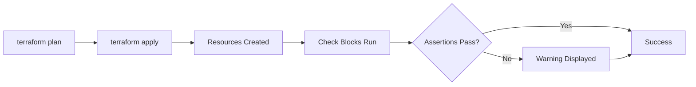
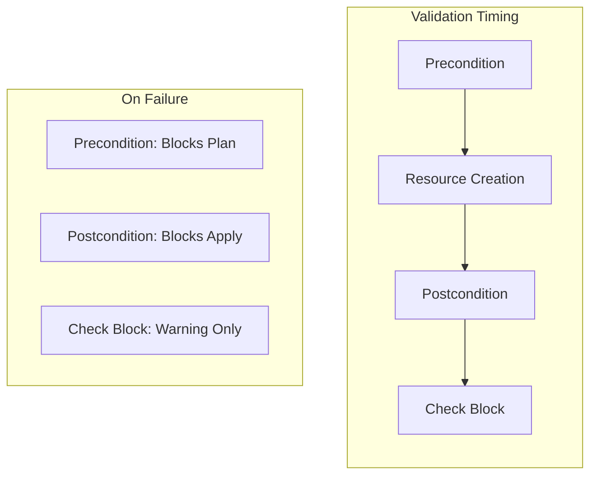

# How to Create Terraform Check Blocks

Author: [nawazdhandala](https://github.com/nawazdhandala)

Tags: Terraform, IaC, Validation, Checks

Description: Learn how to use Terraform check blocks to validate your infrastructure meets operational requirements after deployment.

---

Terraform check blocks are a powerful feature introduced in Terraform 1.5 that let you verify your infrastructure meets certain conditions after it has been deployed. Unlike preconditions and postconditions that halt deployment on failure, check blocks provide warnings without blocking your workflow.

## Understanding Check Blocks

Check blocks perform assertions against your infrastructure state. They run after `terraform apply` and report issues as warnings rather than errors. This makes them perfect for validating operational requirements that should not block deployment.



### When to Use Check Blocks

Check blocks are ideal for:
- Validating external dependencies exist
- Verifying DNS propagation
- Confirming certificates are valid
- Checking API endpoints respond correctly
- Ensuring cloud resources match expected configurations

## Basic Check Block Syntax

A check block contains one or more assertions that evaluate conditions against your infrastructure.

```hcl
check "website_health" {
  assert {
    condition     = data.http.website.status_code == 200
    error_message = "Website is not responding with 200 OK"
  }
}
```

### Check Block with Data Source

Check blocks can include their own scoped data sources. This data source only exists within the check block and does not affect your main configuration.

```hcl
check "api_health" {
  data "http" "api_endpoint" {
    url = "https://api.example.com/health"
  }

  assert {
    condition     = data.http.api_endpoint.status_code == 200
    error_message = "API health endpoint returned ${data.http.api_endpoint.status_code}"
  }
}
```

## Practical Examples

### Example 1: Validate SSL Certificate Expiry

This check verifies that your SSL certificate will not expire within the next 30 days.

```hcl
check "certificate_validity" {
  data "tls_certificate" "website" {
    url = "https://${aws_route53_record.website.fqdn}"
  }

  assert {
    condition = timecmp(
      plantimestamp(),
      timeadd(data.tls_certificate.website.certificates[0].not_after, "-720h")
    ) < 0
    error_message = "SSL certificate expires within 30 days"
  }
}
```

### Example 2: Verify DNS Propagation

After creating DNS records, verify they resolve correctly.

```hcl
resource "aws_route53_record" "app" {
  zone_id = aws_route53_zone.main.zone_id
  name    = "app.example.com"
  type    = "A"
  ttl     = 300
  records = [aws_instance.app.public_ip]
}

check "dns_resolution" {
  data "dns_a_record_set" "app" {
    host = aws_route53_record.app.fqdn
  }

  assert {
    condition     = contains(data.dns_a_record_set.app.addrs, aws_instance.app.public_ip)
    error_message = "DNS record does not resolve to expected IP address"
  }
}
```

### Example 3: Validate Load Balancer Health

Confirm your load balancer has healthy targets after deployment.

```hcl
resource "aws_lb" "main" {
  name               = "main-lb"
  internal           = false
  load_balancer_type = "application"
  subnets            = var.public_subnet_ids
}

resource "aws_lb_target_group" "app" {
  name     = "app-targets"
  port     = 80
  protocol = "HTTP"
  vpc_id   = var.vpc_id

  health_check {
    path                = "/health"
    healthy_threshold   = 2
    unhealthy_threshold = 10
  }
}

check "load_balancer_health" {
  data "aws_lb_target_group" "app" {
    arn = aws_lb_target_group.app.arn
  }

  assert {
    condition     = data.aws_lb_target_group.app.health_check[0].healthy_threshold <= 3
    error_message = "Target group health check threshold is too high"
  }
}
```

### Example 4: Verify S3 Bucket Configuration

Ensure your S3 bucket has the expected security settings.

```hcl
resource "aws_s3_bucket" "data" {
  bucket = "my-secure-data-bucket"
}

resource "aws_s3_bucket_versioning" "data" {
  bucket = aws_s3_bucket.data.id
  versioning_configuration {
    status = "Enabled"
  }
}

check "s3_security" {
  data "aws_s3_bucket" "data" {
    bucket = aws_s3_bucket.data.id
  }

  assert {
    condition     = !data.aws_s3_bucket.data.website_endpoint
    error_message = "S3 bucket should not have static website hosting enabled"
  }
}
```

### Example 5: Multiple Assertions in One Check

You can include multiple assertions in a single check block. All assertions are evaluated.

```hcl
check "kubernetes_cluster_health" {
  data "http" "k8s_api" {
    url = "https://${aws_eks_cluster.main.endpoint}/healthz"

    request_headers = {
      Authorization = "Bearer ${data.aws_eks_cluster_auth.main.token}"
    }
  }

  assert {
    condition     = data.http.k8s_api.status_code == 200
    error_message = "Kubernetes API is not healthy"
  }

  assert {
    condition     = can(jsondecode(data.http.k8s_api.response_body))
    error_message = "Kubernetes API returned invalid JSON"
  }
}
```

## Check Blocks vs Preconditions vs Postconditions

Understanding when to use each validation type is important for building robust infrastructure.



### Comparison Table

| Feature | Precondition | Postcondition | Check Block |
|---------|--------------|---------------|-------------|
| Runs during | Plan | Apply | Apply |
| On failure | Error (blocks) | Error (blocks) | Warning |
| Scope | Resource/Data | Resource/Data | Global |
| Can include data source | No | No | Yes |
| Use case | Input validation | Output validation | Operational validation |

### When to Use Each

**Preconditions** validate inputs before resources are created.

```hcl
resource "aws_instance" "app" {
  ami           = var.ami_id
  instance_type = var.instance_type

  lifecycle {
    precondition {
      condition     = can(regex("^ami-", var.ami_id))
      error_message = "AMI ID must start with 'ami-'"
    }
  }
}
```

**Postconditions** validate resource attributes immediately after creation.

```hcl
resource "aws_instance" "app" {
  ami           = var.ami_id
  instance_type = var.instance_type

  lifecycle {
    postcondition {
      condition     = self.public_ip != ""
      error_message = "Instance must have a public IP"
    }
  }
}
```

**Check blocks** validate operational state that may take time to converge.

```hcl
check "instance_reachable" {
  data "http" "app" {
    url = "http://${aws_instance.app.public_ip}/health"
  }

  assert {
    condition     = data.http.app.status_code == 200
    error_message = "Application is not reachable"
  }
}
```

## Advanced Patterns

### Pattern 1: Conditional Checks

Run checks only when certain conditions are met.

```hcl
check "production_ssl" {
  data "http" "website" {
    url = var.environment == "production" ? "https://${var.domain}" : "http://localhost"
  }

  assert {
    condition     = var.environment != "production" || data.http.website.status_code == 200
    error_message = "Production website is not accessible over HTTPS"
  }
}
```

### Pattern 2: Check with Timeout Handling

Handle cases where services take time to become available.

```hcl
check "service_ready" {
  data "http" "service" {
    url = "http://${aws_lb.main.dns_name}/ready"

    retry {
      attempts     = 5
      min_delay_ms = 1000
      max_delay_ms = 5000
    }
  }

  assert {
    condition     = data.http.service.status_code == 200
    error_message = "Service did not become ready within timeout"
  }
}
```

### Pattern 3: External Dependency Validation

Verify external services your infrastructure depends on.

```hcl
check "github_api_available" {
  data "http" "github" {
    url = "https://api.github.com/zen"
  }

  assert {
    condition     = data.http.github.status_code == 200
    error_message = "GitHub API is not reachable - CI/CD may be affected"
  }
}

check "docker_registry_available" {
  data "http" "registry" {
    url = "https://registry.example.com/v2/"
  }

  assert {
    condition     = data.http.registry.status_code == 200
    error_message = "Docker registry is not reachable"
  }
}
```

### Pattern 4: Cost and Resource Validation

Check that deployed resources match expected configurations.

```hcl
check "instance_sizing" {
  data "aws_instance" "app" {
    instance_id = aws_instance.app.id
  }

  assert {
    condition = contains(
      ["t3.micro", "t3.small", "t3.medium"],
      data.aws_instance.app.instance_type
    )
    error_message = "Instance type ${data.aws_instance.app.instance_type} is larger than approved sizes"
  }
}
```

## Best Practices

### 1. Use Descriptive Check Names

Name your checks clearly to make warning messages actionable.

```hcl
# Good
check "database_backup_encryption_enabled" { ... }

# Bad
check "db_check" { ... }
```

### 2. Write Helpful Error Messages

Include context that helps operators understand and fix issues.

```hcl
check "api_response_time" {
  assert {
    condition     = data.http.api.response_time_ms < 1000
    error_message = "API response time (${data.http.api.response_time_ms}ms) exceeds 1000ms threshold. Check application performance."
  }
}
```

### 3. Group Related Checks

Organize checks by domain or concern.

```hcl
# security_checks.tf
check "encryption_at_rest" { ... }
check "encryption_in_transit" { ... }
check "public_access_blocked" { ... }

# health_checks.tf
check "api_health" { ... }
check "database_health" { ... }
check "cache_health" { ... }
```

### 4. Consider Check Frequency

Remember that checks run on every apply. Avoid checks that:
- Make expensive API calls
- Take a long time to complete
- Have rate limits that may be exceeded

## Integration with CI/CD

Check blocks integrate naturally with CI/CD pipelines. Use the `-detailed-exitcode` flag to handle warnings appropriately.

```yaml
# GitHub Actions example
- name: Terraform Apply
  id: apply
  run: terraform apply -auto-approve -detailed-exitcode
  continue-on-error: true

- name: Check for Warnings
  if: steps.apply.outputs.exitcode == 0
  run: echo "Apply successful with no warnings"

- name: Handle Warnings
  if: steps.apply.outputs.exitcode == 2
  run: |
    echo "Apply successful but checks produced warnings"
    # Optionally notify team or create ticket
```

## Monitoring Check Results

For ongoing infrastructure validation, consider exporting check results to your monitoring system.

```hcl
check "monitoring_endpoint" {
  data "http" "metrics" {
    url = "http://${aws_instance.app.public_ip}:9090/metrics"
  }

  assert {
    condition     = data.http.metrics.status_code == 200
    error_message = "Prometheus metrics endpoint not responding"
  }
}
```

---

Terraform check blocks provide a non-blocking way to validate your infrastructure meets operational requirements. Use them to catch configuration drift, verify external dependencies, and ensure your deployed resources match expectations. Start with a few critical checks and expand coverage as you identify important validations for your infrastructure.
