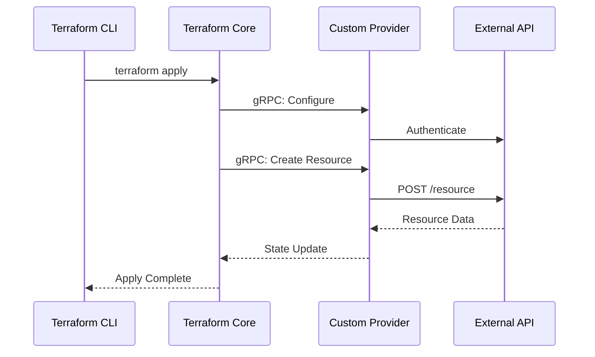

# How to Build Terraform Custom Providers

Author: [nawazdhandala](https://www.github.com/nawazdhandala)

Tags: Terraform, IaC, Go, DevOps, Infrastructure

Description: Create custom Terraform providers using the Plugin Framework to manage any API or service as infrastructure code with full CRUD operations.

---

Terraform has become the de facto standard for infrastructure as code, but what happens when you need to manage a resource that does not have an official provider? Maybe you are working with an internal API, a niche SaaS product, or a legacy system that needs IaC treatment. The answer is building your own custom provider.

In this guide, we will walk through creating a Terraform provider from scratch using the Terraform Plugin Framework. By the end, you will have a working provider that can create, read, update, and delete resources through any REST API.

## Understanding the Architecture

Before diving into code, let us understand how Terraform providers work under the hood.



Terraform communicates with providers via gRPC. The Plugin Framework abstracts away the protocol details, letting you focus on implementing your resource logic.

## Setting Up the Project

First, create a new Go module for your provider. The naming convention matters here since Terraform uses it to locate providers.

```go
// main.go
package main

import (
    "context"
    "flag"
    "log"

    "github.com/hashicorp/terraform-plugin-framework/providerserver"
    "terraform-provider-example/internal/provider"
)

// Version will be set during build using ldflags
var version string = "dev"

func main() {
    var debug bool

    // Enable debug mode for development and testing
    flag.BoolVar(&debug, "debug", false, "set to true to run the provider with support for debuggers")
    flag.Parse()

    opts := providerserver.ServeOpts{
        Address: "registry.terraform.io/example/example",
        Debug:   debug,
    }

    // Start the provider server
    err := providerserver.Serve(context.Background(), provider.New(version), opts)
    if err != nil {
        log.Fatal(err.Error())
    }
}
```

## Implementing the Provider

The provider struct holds configuration like API endpoints and authentication credentials. This is where you set up the client that all resources will use.

```go
// internal/provider/provider.go
package provider

import (
    "context"

    "github.com/hashicorp/terraform-plugin-framework/datasource"
    "github.com/hashicorp/terraform-plugin-framework/provider"
    "github.com/hashicorp/terraform-plugin-framework/provider/schema"
    "github.com/hashicorp/terraform-plugin-framework/resource"
    "github.com/hashicorp/terraform-plugin-framework/types"
)

// Ensure the implementation satisfies the expected interfaces
var _ provider.Provider = &ExampleProvider{}

// ExampleProvider defines the provider implementation
type ExampleProvider struct {
    version string
}

// ExampleProviderModel describes the provider data model
type ExampleProviderModel struct {
    Endpoint types.String `tfsdk:"endpoint"`
    ApiKey   types.String `tfsdk:"api_key"`
}

// New creates a new provider instance
func New(version string) func() provider.Provider {
    return func() provider.Provider {
        return &ExampleProvider{
            version: version,
        }
    }
}

// Metadata returns the provider type name
func (p *ExampleProvider) Metadata(ctx context.Context, req provider.MetadataRequest, resp *provider.MetadataResponse) {
    resp.TypeName = "example"
    resp.Version = p.version
}

// Schema defines the provider-level configuration schema
func (p *ExampleProvider) Schema(ctx context.Context, req provider.SchemaRequest, resp *provider.SchemaResponse) {
    resp.Schema = schema.Schema{
        Description: "Interact with Example API",
        Attributes: map[string]schema.Attribute{
            "endpoint": schema.StringAttribute{
                Description: "URI for the Example API. May also be set via EXAMPLE_ENDPOINT env var.",
                Optional:    true,
            },
            "api_key": schema.StringAttribute{
                Description: "API key for authentication. May also be set via EXAMPLE_API_KEY env var.",
                Optional:    true,
                Sensitive:   true,
            },
        },
    }
}

// Configure prepares an API client for data sources and resources
func (p *ExampleProvider) Configure(ctx context.Context, req provider.ConfigureRequest, resp *provider.ConfigureResponse) {
    var config ExampleProviderModel

    // Read configuration from the Terraform file
    resp.Diagnostics.Append(req.Config.Get(ctx, &config)...)
    if resp.Diagnostics.HasError() {
        return
    }

    // Create the API client and make it available to resources
    client := NewAPIClient(config.Endpoint.ValueString(), config.ApiKey.ValueString())
    resp.DataSourceData = client
    resp.ResourceData = client
}

// Resources defines the resources implemented in the provider
func (p *ExampleProvider) Resources(ctx context.Context) []func() resource.Resource {
    return []func() resource.Resource{
        NewItemResource,
    }
}

// DataSources defines the data sources implemented in the provider
func (p *ExampleProvider) DataSources(ctx context.Context) []func() datasource.DataSource {
    return []func() datasource.DataSource{}
}
```

## Building a Resource with Full CRUD

Now for the interesting part. Resources are where you define what Terraform manages. Each resource needs Create, Read, Update, and Delete methods.

```go
// internal/provider/item_resource.go
package provider

import (
    "context"
    "fmt"

    "github.com/hashicorp/terraform-plugin-framework/resource"
    "github.com/hashicorp/terraform-plugin-framework/resource/schema"
    "github.com/hashicorp/terraform-plugin-framework/resource/schema/planmodifier"
    "github.com/hashicorp/terraform-plugin-framework/resource/schema/stringplanmodifier"
    "github.com/hashicorp/terraform-plugin-framework/types"
)

// Ensure the implementation satisfies the expected interfaces
var _ resource.Resource = &ItemResource{}
var _ resource.ResourceWithImportState = &ItemResource{}

// ItemResource defines the resource implementation
type ItemResource struct {
    client *APIClient
}

// ItemResourceModel describes the resource data model
type ItemResourceModel struct {
    ID          types.String `tfsdk:"id"`
    Name        types.String `tfsdk:"name"`
    Description types.String `tfsdk:"description"`
    Tags        types.List   `tfsdk:"tags"`
}

// NewItemResource creates a new resource instance
func NewItemResource() resource.Resource {
    return &ItemResource{}
}

// Metadata returns the resource type name
func (r *ItemResource) Metadata(ctx context.Context, req resource.MetadataRequest, resp *resource.MetadataResponse) {
    resp.TypeName = req.ProviderTypeName + "_item"
}

// Schema defines the schema for the resource
func (r *ItemResource) Schema(ctx context.Context, req resource.SchemaRequest, resp *resource.SchemaResponse) {
    resp.Schema = schema.Schema{
        Description: "Manages an item in the Example service.",
        Attributes: map[string]schema.Attribute{
            "id": schema.StringAttribute{
                Description: "Unique identifier for the item.",
                Computed:    true,
                PlanModifiers: []planmodifier.String{
                    // Prevent replacement when ID changes externally
                    stringplanmodifier.UseStateForUnknown(),
                },
            },
            "name": schema.StringAttribute{
                Description: "Name of the item.",
                Required:    true,
            },
            "description": schema.StringAttribute{
                Description: "Description of the item.",
                Optional:    true,
            },
            "tags": schema.ListAttribute{
                Description: "Tags associated with the item.",
                Optional:    true,
                ElementType: types.StringType,
            },
        },
    }
}

// Configure adds the provider configured client to the resource
func (r *ItemResource) Configure(ctx context.Context, req resource.ConfigureRequest, resp *resource.ConfigureResponse) {
    if req.ProviderData == nil {
        return
    }

    client, ok := req.ProviderData.(*APIClient)
    if !ok {
        resp.Diagnostics.AddError(
            "Unexpected Resource Configure Type",
            fmt.Sprintf("Expected *APIClient, got: %T", req.ProviderData),
        )
        return
    }

    r.client = client
}

// Create creates the resource and sets the initial Terraform state
func (r *ItemResource) Create(ctx context.Context, req resource.CreateRequest, resp *resource.CreateResponse) {
    var plan ItemResourceModel

    // Read Terraform plan data into the model
    resp.Diagnostics.Append(req.Plan.Get(ctx, &plan)...)
    if resp.Diagnostics.HasError() {
        return
    }

    // Call the API to create the resource
    item, err := r.client.CreateItem(ctx, plan.Name.ValueString(), plan.Description.ValueString())
    if err != nil {
        resp.Diagnostics.AddError("Client Error", fmt.Sprintf("Unable to create item: %s", err))
        return
    }

    // Map response to model
    plan.ID = types.StringValue(item.ID)

    // Save data into Terraform state
    resp.Diagnostics.Append(resp.State.Set(ctx, &plan)...)
}

// Read refreshes the Terraform state with the latest data
func (r *ItemResource) Read(ctx context.Context, req resource.ReadRequest, resp *resource.ReadResponse) {
    var state ItemResourceModel

    // Read current state
    resp.Diagnostics.Append(req.State.Get(ctx, &state)...)
    if resp.Diagnostics.HasError() {
        return
    }

    // Get fresh data from API
    item, err := r.client.GetItem(ctx, state.ID.ValueString())
    if err != nil {
        resp.Diagnostics.AddError("Client Error", fmt.Sprintf("Unable to read item: %s", err))
        return
    }

    // Update state with fresh values
    state.Name = types.StringValue(item.Name)
    state.Description = types.StringValue(item.Description)

    resp.Diagnostics.Append(resp.State.Set(ctx, &state)...)
}

// Update updates the resource and sets the updated Terraform state
func (r *ItemResource) Update(ctx context.Context, req resource.UpdateRequest, resp *resource.UpdateResponse) {
    var plan ItemResourceModel

    // Read Terraform plan data
    resp.Diagnostics.Append(req.Plan.Get(ctx, &plan)...)
    if resp.Diagnostics.HasError() {
        return
    }

    // Call the API to update
    _, err := r.client.UpdateItem(ctx, plan.ID.ValueString(), plan.Name.ValueString(), plan.Description.ValueString())
    if err != nil {
        resp.Diagnostics.AddError("Client Error", fmt.Sprintf("Unable to update item: %s", err))
        return
    }

    resp.Diagnostics.Append(resp.State.Set(ctx, &plan)...)
}

// Delete deletes the resource and removes the Terraform state
func (r *ItemResource) Delete(ctx context.Context, req resource.DeleteRequest, resp *resource.DeleteResponse) {
    var state ItemResourceModel

    resp.Diagnostics.Append(req.State.Get(ctx, &state)...)
    if resp.Diagnostics.HasError() {
        return
    }

    // Call the API to delete
    err := r.client.DeleteItem(ctx, state.ID.ValueString())
    if err != nil {
        resp.Diagnostics.AddError("Client Error", fmt.Sprintf("Unable to delete item: %s", err))
        return
    }
}

// ImportState imports an existing resource into Terraform
func (r *ItemResource) ImportState(ctx context.Context, req resource.ImportStateRequest, resp *resource.ImportStateResponse) {
    resource.ImportStatePassthroughID(ctx, path.Root("id"), req, resp)
}
```

## The API Client

Here is a simple client implementation that your provider will use to communicate with the external service.

```go
// internal/provider/client.go
package provider

import (
    "bytes"
    "context"
    "encoding/json"
    "fmt"
    "net/http"
)

// APIClient handles communication with the external API
type APIClient struct {
    endpoint   string
    apiKey     string
    httpClient *http.Client
}

// Item represents the API resource
type Item struct {
    ID          string `json:"id"`
    Name        string `json:"name"`
    Description string `json:"description"`
}

// NewAPIClient creates a configured API client
func NewAPIClient(endpoint, apiKey string) *APIClient {
    return &APIClient{
        endpoint:   endpoint,
        apiKey:     apiKey,
        httpClient: &http.Client{},
    }
}

// CreateItem sends a POST request to create a new item
func (c *APIClient) CreateItem(ctx context.Context, name, description string) (*Item, error) {
    payload := map[string]string{
        "name":        name,
        "description": description,
    }
    body, _ := json.Marshal(payload)

    req, err := http.NewRequestWithContext(ctx, "POST", c.endpoint+"/items", bytes.NewBuffer(body))
    if err != nil {
        return nil, err
    }

    req.Header.Set("Authorization", "Bearer "+c.apiKey)
    req.Header.Set("Content-Type", "application/json")

    resp, err := c.httpClient.Do(req)
    if err != nil {
        return nil, err
    }
    defer resp.Body.Close()

    if resp.StatusCode != http.StatusCreated {
        return nil, fmt.Errorf("unexpected status: %d", resp.StatusCode)
    }

    var item Item
    if err := json.NewDecoder(resp.Body).Decode(&item); err != nil {
        return nil, err
    }

    return &item, nil
}

// GetItem, UpdateItem, and DeleteItem follow the same pattern...
```

## Testing Your Provider

Testing is crucial for providers. The Plugin Framework includes a testing package that spins up a real Terraform instance.

```go
// internal/provider/item_resource_test.go
package provider

import (
    "testing"

    "github.com/hashicorp/terraform-plugin-testing/helper/resource"
)

func TestAccItemResource(t *testing.T) {
    resource.Test(t, resource.TestCase{
        PreCheck:                 func() { testAccPreCheck(t) },
        ProtoV6ProviderFactories: testAccProtoV6ProviderFactories,
        Steps: []resource.TestStep{
            // Create and Read testing
            {
                Config: `
resource "example_item" "test" {
    name        = "test-item"
    description = "A test item"
}
`,
                Check: resource.ComposeAggregateTestCheckFunc(
                    resource.TestCheckResourceAttr("example_item.test", "name", "test-item"),
                    resource.TestCheckResourceAttrSet("example_item.test", "id"),
                ),
            },
            // Update testing
            {
                Config: `
resource "example_item" "test" {
    name        = "updated-item"
    description = "An updated item"
}
`,
                Check: resource.ComposeAggregateTestCheckFunc(
                    resource.TestCheckResourceAttr("example_item.test", "name", "updated-item"),
                ),
            },
            // Import testing
            {
                ResourceName:      "example_item.test",
                ImportState:       true,
                ImportStateVerify: true,
            },
        },
    })
}
```

## Building and Installing

To build and install your provider locally for testing, use these commands.

```bash
# Build the provider binary
go build -o terraform-provider-example

# Create the local plugin directory
mkdir -p ~/.terraform.d/plugins/registry.terraform.io/example/example/1.0.0/darwin_arm64

# Move the binary to the plugin directory
mv terraform-provider-example ~/.terraform.d/plugins/registry.terraform.io/example/example/1.0.0/darwin_arm64/
```

Then reference it in your Terraform configuration.

```hcl
terraform {
  required_providers {
    example = {
      source  = "registry.terraform.io/example/example"
      version = "1.0.0"
    }
  }
}

provider "example" {
  endpoint = "https://api.example.com"
  api_key  = var.example_api_key
}

resource "example_item" "my_item" {
  name        = "production-config"
  description = "Configuration for production environment"
}
```

## Next Steps

Once your provider works locally, consider publishing it to the Terraform Registry. You will need to sign the binary with GPG, set up GitHub Actions for releases, and follow HashiCorp's documentation requirements.

The Terraform Plugin Framework handles the complex parts of provider development. What remains is understanding your target API and mapping its concepts to Terraform resources. Start with a single resource, get the CRUD operations working, then expand from there.

Building custom providers opens up a world of possibilities. Any system with an API can become part of your infrastructure as code workflow. Whether it is internal tooling, legacy systems, or specialized SaaS products, Terraform can manage them all with a well-designed custom provider.
