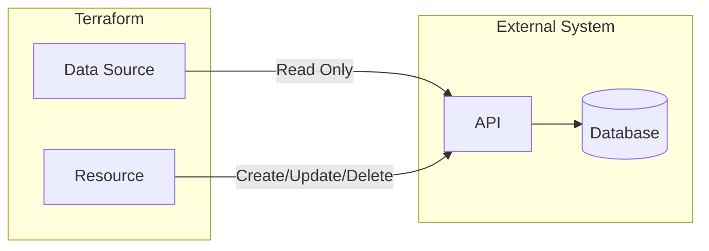
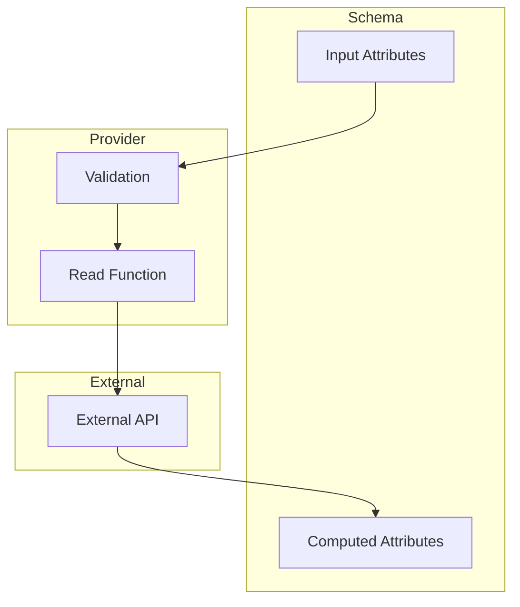

# How to Build Terraform Data Source Schemas

Author: [nawazdhandala](https://github.com/nawazdhandala)

Tags: Terraform, IaC, Provider-Development, Data-Sources

Description: Learn how to design and implement data source schemas for Terraform providers, enabling read-only access to external resources in your infrastructure as code workflows.

---

Data sources in Terraform allow you to fetch information from external systems without creating or modifying resources. When building a Terraform provider, designing data source schemas correctly ensures users can query existing infrastructure efficiently and reliably.

## Understanding Data Sources vs Resources

Before diving into schema design, it is important to understand the distinction between data sources and resources in Terraform.



| Component | Purpose | Operations |
|-----------|---------|------------|
| Resource | Manages lifecycle of infrastructure | Create, Read, Update, Delete |
| Data Source | Queries existing infrastructure | Read only |

Data sources are ideal when you need to reference existing resources that are managed outside of Terraform or in a different Terraform configuration.

## Schema Architecture

A Terraform data source schema consists of attributes that define what data the user can query and what data the provider returns.



### Schema Attribute Types

Terraform provides several attribute types for building schemas.

| Type | Go Type | Use Case |
|------|---------|----------|
| String | `types.String` | Text values, IDs, names |
| Number | `types.Number` | Numeric values with arbitrary precision |
| Int64 | `types.Int64` | Integer values |
| Float64 | `types.Float64` | Floating-point values |
| Bool | `types.Bool` | Boolean flags |
| List | `types.List` | Ordered collections |
| Set | `types.Set` | Unordered unique collections |
| Map | `types.Map` | Key-value pairs |
| Object | `types.Object` | Structured nested data |

## Setting Up the Provider Project

First, set up your Terraform provider development environment.

```bash
# Create project directory
mkdir terraform-provider-example && cd terraform-provider-example

# Initialize Go module
go mod init github.com/example/terraform-provider-example

# Install terraform-plugin-framework
go get github.com/hashicorp/terraform-plugin-framework
go get github.com/hashicorp/terraform-plugin-go
```

## Implementing a Basic Data Source

Here is a complete example of a data source that fetches server information.

### Define the Data Source Model

The model struct maps to the schema and holds the data.

```go
package provider

import (
    "context"

    "github.com/hashicorp/terraform-plugin-framework/datasource"
    "github.com/hashicorp/terraform-plugin-framework/datasource/schema"
    "github.com/hashicorp/terraform-plugin-framework/types"
)

// ServerDataSourceModel describes the data source data model
type ServerDataSourceModel struct {
    ID          types.String `tfsdk:"id"`
    Name        types.String `tfsdk:"name"`
    IPAddress   types.String `tfsdk:"ip_address"`
    Status      types.String `tfsdk:"status"`
    Region      types.String `tfsdk:"region"`
    CPU         types.Int64  `tfsdk:"cpu"`
    MemoryGB    types.Int64  `tfsdk:"memory_gb"`
    Tags        types.Map    `tfsdk:"tags"`
    CreatedAt   types.String `tfsdk:"created_at"`
}
```

### Create the Data Source Structure

The data source struct implements the required interfaces.

```go
// ServerDataSource defines the data source implementation
type ServerDataSource struct {
    client *APIClient
}

// Ensure the implementation satisfies the expected interfaces
var (
    _ datasource.DataSource              = &ServerDataSource{}
    _ datasource.DataSourceWithConfigure = &ServerDataSource{}
)

// NewServerDataSource creates a new data source instance
func NewServerDataSource() datasource.DataSource {
    return &ServerDataSource{}
}

// Metadata returns the data source type name
func (d *ServerDataSource) Metadata(ctx context.Context, req datasource.MetadataRequest, resp *datasource.MetadataResponse) {
    resp.TypeName = req.ProviderTypeName + "_server"
}
```

### Define the Schema

The schema defines what attributes are available and their properties.

```go
// Schema defines the schema for the data source
func (d *ServerDataSource) Schema(ctx context.Context, req datasource.SchemaRequest, resp *datasource.SchemaResponse) {
    resp.Schema = schema.Schema{
        Description: "Fetches information about an existing server.",

        Attributes: map[string]schema.Attribute{
            // Required input attribute - user must provide this
            "id": schema.StringAttribute{
                Description: "The unique identifier of the server to look up.",
                Required:    true,
            },

            // Computed attributes - provider fills these in
            "name": schema.StringAttribute{
                Description: "The display name of the server.",
                Computed:    true,
            },
            "ip_address": schema.StringAttribute{
                Description: "The public IP address of the server.",
                Computed:    true,
            },
            "status": schema.StringAttribute{
                Description: "Current status of the server (running, stopped, pending).",
                Computed:    true,
            },
            "region": schema.StringAttribute{
                Description: "The region where the server is deployed.",
                Computed:    true,
            },
            "cpu": schema.Int64Attribute{
                Description: "Number of CPU cores allocated.",
                Computed:    true,
            },
            "memory_gb": schema.Int64Attribute{
                Description: "Amount of memory in gigabytes.",
                Computed:    true,
            },
            "tags": schema.MapAttribute{
                Description: "Key-value tags associated with the server.",
                Computed:    true,
                ElementType: types.StringType,
            },
            "created_at": schema.StringAttribute{
                Description: "Timestamp when the server was created.",
                Computed:    true,
            },
        },
    }
}
```

### Implement the Configure Method

The configure method receives the provider client.

```go
// Configure adds the provider configured client to the data source
func (d *ServerDataSource) Configure(ctx context.Context, req datasource.ConfigureRequest, resp *datasource.ConfigureResponse) {
    if req.ProviderData == nil {
        return
    }

    client, ok := req.ProviderData.(*APIClient)
    if !ok {
        resp.Diagnostics.AddError(
            "Unexpected Data Source Configure Type",
            "Expected *APIClient, got: "+fmt.Sprintf("%T", req.ProviderData),
        )
        return
    }

    d.client = client
}
```

### Implement the Read Method

The read method fetches data from the external API and populates the model.

```go
// Read refreshes the Terraform state with the latest data
func (d *ServerDataSource) Read(ctx context.Context, req datasource.ReadRequest, resp *datasource.ReadResponse) {
    var state ServerDataSourceModel

    // Read configuration from Terraform
    resp.Diagnostics.Append(req.Config.Get(ctx, &state)...)
    if resp.Diagnostics.HasError() {
        return
    }

    // Fetch server data from API
    server, err := d.client.GetServer(ctx, state.ID.ValueString())
    if err != nil {
        resp.Diagnostics.AddError(
            "Unable to Read Server",
            "Could not read server ID "+state.ID.ValueString()+": "+err.Error(),
        )
        return
    }

    // Map API response to model
    state.Name = types.StringValue(server.Name)
    state.IPAddress = types.StringValue(server.IPAddress)
    state.Status = types.StringValue(server.Status)
    state.Region = types.StringValue(server.Region)
    state.CPU = types.Int64Value(server.CPU)
    state.MemoryGB = types.Int64Value(server.MemoryGB)
    state.CreatedAt = types.StringValue(server.CreatedAt.Format(time.RFC3339))

    // Convert tags map
    tags, diags := types.MapValueFrom(ctx, types.StringType, server.Tags)
    resp.Diagnostics.Append(diags...)
    if resp.Diagnostics.HasError() {
        return
    }
    state.Tags = tags

    // Save data into Terraform state
    resp.Diagnostics.Append(resp.State.Set(ctx, &state)...)
}
```

## Advanced Schema Patterns

### Nested Object Attributes

For complex data structures, use nested object attributes.

```go
func (d *ServerDataSource) Schema(ctx context.Context, req datasource.SchemaRequest, resp *datasource.SchemaResponse) {
    resp.Schema = schema.Schema{
        Description: "Fetches server information including network configuration.",

        Attributes: map[string]schema.Attribute{
            "id": schema.StringAttribute{
                Required: true,
            },
            "name": schema.StringAttribute{
                Computed: true,
            },

            // Single nested object
            "network_config": schema.SingleNestedAttribute{
                Description: "Network configuration for the server.",
                Computed:    true,
                Attributes: map[string]schema.Attribute{
                    "vpc_id": schema.StringAttribute{
                        Description: "VPC identifier.",
                        Computed:    true,
                    },
                    "subnet_id": schema.StringAttribute{
                        Description: "Subnet identifier.",
                        Computed:    true,
                    },
                    "private_ip": schema.StringAttribute{
                        Description: "Private IP address.",
                        Computed:    true,
                    },
                    "security_groups": schema.ListAttribute{
                        Description: "List of security group IDs.",
                        Computed:    true,
                        ElementType: types.StringType,
                    },
                },
            },
        },
    }
}
```

The corresponding model for nested attributes.

```go
type NetworkConfigModel struct {
    VPCID          types.String `tfsdk:"vpc_id"`
    SubnetID       types.String `tfsdk:"subnet_id"`
    PrivateIP      types.String `tfsdk:"private_ip"`
    SecurityGroups types.List   `tfsdk:"security_groups"`
}

type ServerWithNetworkModel struct {
    ID            types.String       `tfsdk:"id"`
    Name          types.String       `tfsdk:"name"`
    NetworkConfig *NetworkConfigModel `tfsdk:"network_config"`
}
```

### List of Nested Objects

When returning multiple items with structured data.

```go
"volumes": schema.ListNestedAttribute{
    Description: "Attached storage volumes.",
    Computed:    true,
    NestedObject: schema.NestedAttributeObject{
        Attributes: map[string]schema.Attribute{
            "volume_id": schema.StringAttribute{
                Description: "Volume identifier.",
                Computed:    true,
            },
            "size_gb": schema.Int64Attribute{
                Description: "Volume size in gigabytes.",
                Computed:    true,
            },
            "mount_path": schema.StringAttribute{
                Description: "Mount path on the server.",
                Computed:    true,
            },
            "encrypted": schema.BoolAttribute{
                Description: "Whether the volume is encrypted.",
                Computed:    true,
            },
        },
    },
},
```

### Optional Filter Attributes

Allow users to filter data source results with optional attributes.

```go
"filters": schema.SingleNestedAttribute{
    Description: "Optional filters to narrow down results.",
    Optional:    true,
    Attributes: map[string]schema.Attribute{
        "status": schema.StringAttribute{
            Description: "Filter by server status.",
            Optional:    true,
        },
        "region": schema.StringAttribute{
            Description: "Filter by region.",
            Optional:    true,
        },
        "tag_key": schema.StringAttribute{
            Description: "Filter by tag key.",
            Optional:    true,
        },
        "tag_value": schema.StringAttribute{
            Description: "Filter by tag value.",
            Optional:    true,
        },
    },
},
```

## Adding Validation

Schema validation ensures users provide valid input.

### Built-in Validators

Use the validators package for common validation patterns.

```go
import (
    "github.com/hashicorp/terraform-plugin-framework-validators/stringvalidator"
    "github.com/hashicorp/terraform-plugin-framework-validators/int64validator"
    "github.com/hashicorp/terraform-plugin-framework/schema/validator"
)

"region": schema.StringAttribute{
    Description: "The region to query.",
    Required:    true,
    Validators: []validator.String{
        stringvalidator.OneOf("us-east-1", "us-west-2", "eu-west-1", "ap-southeast-1"),
    },
},

"limit": schema.Int64Attribute{
    Description: "Maximum number of results to return.",
    Optional:    true,
    Validators: []validator.Int64{
        int64validator.Between(1, 100),
    },
},

"id": schema.StringAttribute{
    Description: "Server ID in UUID format.",
    Required:    true,
    Validators: []validator.String{
        stringvalidator.RegexMatches(
            regexp.MustCompile(`^[0-9a-f]{8}-[0-9a-f]{4}-[0-9a-f]{4}-[0-9a-f]{4}-[0-9a-f]{12}$`),
            "must be a valid UUID",
        ),
    },
},
```

### Custom Validators

Create custom validators for domain-specific validation.

```go
type serverIDValidator struct{}

func (v serverIDValidator) Description(ctx context.Context) string {
    return "value must be a valid server ID starting with 'srv-'"
}

func (v serverIDValidator) MarkdownDescription(ctx context.Context) string {
    return v.Description(ctx)
}

func (v serverIDValidator) ValidateString(ctx context.Context, req validator.StringRequest, resp *validator.StringResponse) {
    if req.ConfigValue.IsNull() || req.ConfigValue.IsUnknown() {
        return
    }

    value := req.ConfigValue.ValueString()
    if !strings.HasPrefix(value, "srv-") {
        resp.Diagnostics.AddAttributeError(
            req.Path,
            "Invalid Server ID",
            "Server ID must start with 'srv-', got: "+value,
        )
    }
}

// Usage in schema
"id": schema.StringAttribute{
    Required: true,
    Validators: []validator.String{
        serverIDValidator{},
    },
},
```

## Building a Collection Data Source

Data sources that return multiple items follow a similar pattern.

```go
// ServersDataSourceModel describes the data source for listing servers
type ServersDataSourceModel struct {
    Region  types.String        `tfsdk:"region"`
    Status  types.String        `tfsdk:"status"`
    Servers []ServerItemModel   `tfsdk:"servers"`
}

type ServerItemModel struct {
    ID        types.String `tfsdk:"id"`
    Name      types.String `tfsdk:"name"`
    IPAddress types.String `tfsdk:"ip_address"`
    Status    types.String `tfsdk:"status"`
}

func (d *ServersDataSource) Schema(ctx context.Context, req datasource.SchemaRequest, resp *datasource.SchemaResponse) {
    resp.Schema = schema.Schema{
        Description: "Lists all servers matching the specified criteria.",

        Attributes: map[string]schema.Attribute{
            // Filter inputs
            "region": schema.StringAttribute{
                Description: "Filter servers by region.",
                Optional:    true,
            },
            "status": schema.StringAttribute{
                Description: "Filter servers by status.",
                Optional:    true,
            },

            // Result list
            "servers": schema.ListNestedAttribute{
                Description: "List of servers matching the criteria.",
                Computed:    true,
                NestedObject: schema.NestedAttributeObject{
                    Attributes: map[string]schema.Attribute{
                        "id": schema.StringAttribute{
                            Computed: true,
                        },
                        "name": schema.StringAttribute{
                            Computed: true,
                        },
                        "ip_address": schema.StringAttribute{
                            Computed: true,
                        },
                        "status": schema.StringAttribute{
                            Computed: true,
                        },
                    },
                },
            },
        },
    }
}
```

## Registering Data Sources with the Provider

Register your data sources in the provider.

```go
// provider.go
package provider

import (
    "context"

    "github.com/hashicorp/terraform-plugin-framework/datasource"
    "github.com/hashicorp/terraform-plugin-framework/provider"
    "github.com/hashicorp/terraform-plugin-framework/provider/schema"
    "github.com/hashicorp/terraform-plugin-framework/resource"
)

type ExampleProvider struct {
    version string
}

func (p *ExampleProvider) DataSources(ctx context.Context) []func() datasource.DataSource {
    return []func() datasource.DataSource{
        NewServerDataSource,
        NewServersDataSource,
        NewNetworkDataSource,
        NewRegionDataSource,
    }
}

func (p *ExampleProvider) Resources(ctx context.Context) []func() resource.Resource {
    return []func() resource.Resource{
        // Resources defined here
    }
}
```

## Testing Data Sources

Write acceptance tests to verify data source behavior.

```go
package provider

import (
    "testing"

    "github.com/hashicorp/terraform-plugin-testing/helper/resource"
)

func TestAccServerDataSource(t *testing.T) {
    resource.Test(t, resource.TestCase{
        PreCheck:                 func() { testAccPreCheck(t) },
        ProtoV6ProviderFactories: testAccProtoV6ProviderFactories,
        Steps: []resource.TestStep{
            {
                Config: testAccServerDataSourceConfig,
                Check: resource.ComposeAggregateTestCheckFunc(
                    resource.TestCheckResourceAttr("data.example_server.test", "name", "test-server"),
                    resource.TestCheckResourceAttr("data.example_server.test", "status", "running"),
                    resource.TestCheckResourceAttrSet("data.example_server.test", "ip_address"),
                    resource.TestCheckResourceAttrSet("data.example_server.test", "created_at"),
                ),
            },
        },
    })
}

const testAccServerDataSourceConfig = `
data "example_server" "test" {
  id = "srv-12345"
}
`
```

## Using the Data Source

Here is how users consume your data source in Terraform configurations.

```hcl
# Query a single server by ID
data "example_server" "web" {
  id = "srv-abc123"
}

# Use data in other resources
resource "example_dns_record" "web" {
  name    = "web.example.com"
  type    = "A"
  value   = data.example_server.web.ip_address
}

# Query multiple servers with filters
data "example_servers" "production" {
  region = "us-east-1"
  status = "running"
}

# Output the results
output "production_server_ids" {
  value = data.example_servers.production.servers[*].id
}
```

## Best Practices

Following these guidelines will help you build reliable and user-friendly data sources.

1. **Use descriptive attribute names** - Choose names that clearly indicate what data the attribute contains
2. **Provide comprehensive descriptions** - Help users understand each attribute without consulting external documentation
3. **Validate input early** - Use validators to catch invalid input before making API calls
4. **Handle errors gracefully** - Return clear error messages that help users understand what went wrong
5. **Use appropriate attribute types** - Choose the type that best represents the data semantically
6. **Document all attributes** - Include descriptions for both required and computed attributes
7. **Support filtering** - For collection data sources, allow users to narrow down results
8. **Test thoroughly** - Write acceptance tests that cover both success and error cases

---

Building well-designed data source schemas is essential for creating Terraform providers that integrate smoothly with existing infrastructure. By following the patterns and practices outlined in this guide, you can create data sources that are intuitive to use and reliable in production. Start with simple schemas, validate input carefully, and expand complexity only when needed.
