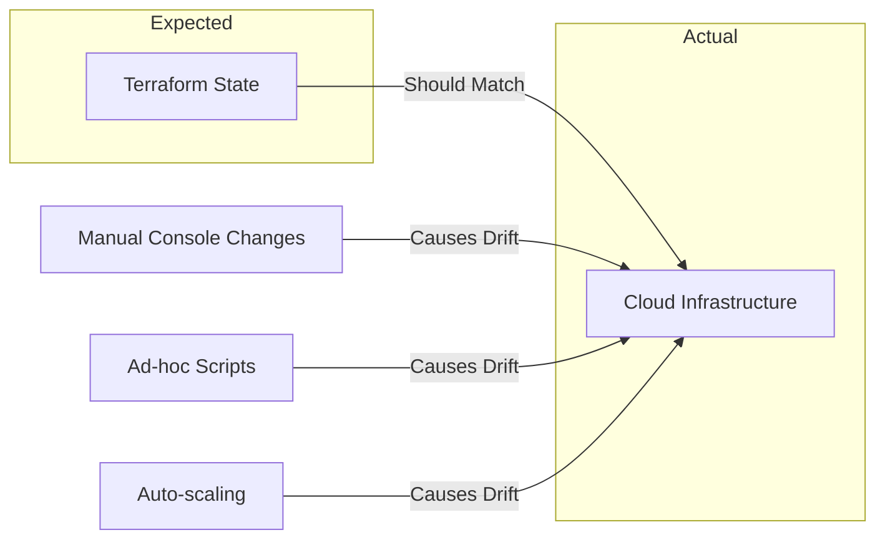
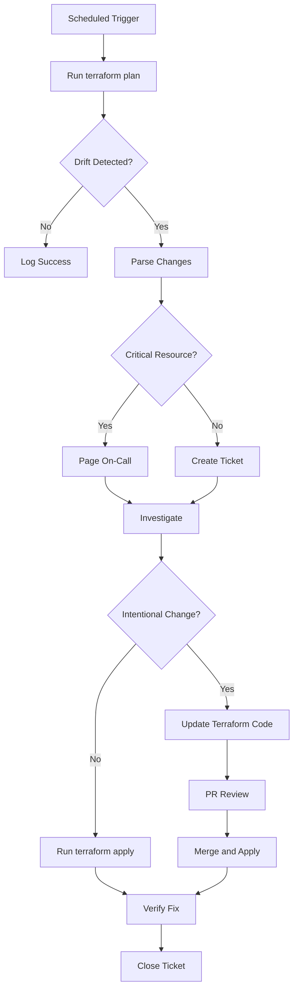

# How to Implement Terraform Drift Detection

Author: [nawazdhandala](https://github.com/nawazdhandala)

Tags: Terraform, Drift Detection, Infrastructure, Compliance

Description: A practical guide to detecting and managing infrastructure drift in Terraform, including scheduled checks, alerting strategies, and automated remediation.

---

Your Terraform state says you have 3 replicas. Your actual infrastructure has 5. Someone clicked around in the AWS console at 2 AM during an incident and forgot to update Terraform. This is drift, and it will bite you eventually.

## What Is Infrastructure Drift?

Infrastructure drift occurs when your actual infrastructure diverges from what Terraform believes it should be. Common causes include:

- Manual changes through cloud consoles
- Emergency fixes during incidents
- Scripts running outside Terraform
- Other automation tools modifying resources
- Cloud provider auto-scaling or updates



## The Basic Drift Detection Command

At its core, drift detection is just `terraform plan`:

```bash
terraform plan -detailed-exitcode
```

Exit codes:
- `0` - No changes, infrastructure matches state
- `1` - Error running plan
- `2` - Changes detected (drift exists)

This exit code is what makes automation possible.

## Setting Up Scheduled Drift Checks

### Using GitHub Actions

```yaml
name: Terraform Drift Detection

on:
  schedule:
    # Run every 6 hours
    - cron: '0 */6 * * *'
  workflow_dispatch:

jobs:
  drift-detection:
    runs-on: ubuntu-latest
    strategy:
      matrix:
        environment: [production, staging]

    steps:
      - uses: actions/checkout@v4

      - name: Setup Terraform
        uses: hashicorp/setup-terraform@v3
        with:
          terraform_version: 1.7.0

      - name: Configure AWS Credentials
        uses: aws-actions/configure-aws-credentials@v4
        with:
          aws-access-key-id: ${{ secrets.AWS_ACCESS_KEY_ID }}
          aws-secret-access-key: ${{ secrets.AWS_SECRET_ACCESS_KEY }}
          aws-region: us-east-1

      - name: Terraform Init
        run: terraform init
        working-directory: ./environments/${{ matrix.environment }}

      - name: Terraform Plan
        id: plan
        run: |
          terraform plan -detailed-exitcode -out=tfplan 2>&1 | tee plan_output.txt
          echo "exitcode=${PIPESTATUS[0]}" >> $GITHUB_OUTPUT
        working-directory: ./environments/${{ matrix.environment }}
        continue-on-error: true

      - name: Check for Drift
        if: steps.plan.outputs.exitcode == '2'
        run: |
          echo "::warning::Drift detected in ${{ matrix.environment }} environment"
          cat plan_output.txt
        working-directory: ./environments/${{ matrix.environment }}

      - name: Send Slack Alert on Drift
        if: steps.plan.outputs.exitcode == '2'
        uses: slackapi/slack-github-action@v1.26.0
        with:
          payload: |
            {
              "text": "Infrastructure Drift Detected",
              "blocks": [
                {
                  "type": "section",
                  "text": {
                    "type": "mrkdwn",
                    "text": "*Drift detected in ${{ matrix.environment }}*\nRun: ${{ github.server_url }}/${{ github.repository }}/actions/runs/${{ github.run_id }}"
                  }
                }
              ]
            }
        env:
          SLACK_WEBHOOK_URL: ${{ secrets.SLACK_WEBHOOK_URL }}
```

### Using GitLab CI

```yaml
stages:
  - drift-check

.drift_template: &drift_template
  image: hashicorp/terraform:1.7.0
  before_script:
    - terraform init
  script:
    - |
      terraform plan -detailed-exitcode -out=tfplan 2>&1 | tee plan_output.txt
      EXIT_CODE=$?
      if [ $EXIT_CODE -eq 2 ]; then
        echo "DRIFT DETECTED"
        # Send notification
        curl -X POST -H 'Content-type: application/json' \
          --data "{\"text\":\"Drift detected in ${CI_ENVIRONMENT_NAME}\"}" \
          $SLACK_WEBHOOK_URL
      fi
      exit $EXIT_CODE
  allow_failure: true
  artifacts:
    paths:
      - plan_output.txt
    when: always

drift:production:
  <<: *drift_template
  rules:
    - if: $CI_PIPELINE_SOURCE == "schedule"
  environment:
    name: production
  variables:
    TF_VAR_environment: production

drift:staging:
  <<: *drift_template
  rules:
    - if: $CI_PIPELINE_SOURCE == "schedule"
  environment:
    name: staging
  variables:
    TF_VAR_environment: staging
```

## Drift Detection Workflow

Here is a complete workflow for handling drift from detection to resolution:



## Building a Drift Detection Script

For more control, build a custom detection script:

```bash
#!/bin/bash
# drift-check.sh

set -e

ENVIRONMENTS=("production" "staging" "development")
SLACK_WEBHOOK="${SLACK_WEBHOOK_URL}"
CRITICAL_RESOURCES=("aws_security_group" "aws_iam_policy" "aws_kms_key")

check_drift() {
    local env=$1
    local dir="./environments/${env}"

    echo "Checking drift in ${env}..."

    cd "${dir}"
    terraform init -backend=true -input=false > /dev/null 2>&1

    # Run plan and capture output
    if ! terraform plan -detailed-exitcode -out=tfplan > plan_output.txt 2>&1; then
        local exit_code=$?

        if [ $exit_code -eq 2 ]; then
            echo "Drift detected in ${env}"

            # Check for critical resources
            local is_critical=false
            for resource in "${CRITICAL_RESOURCES[@]}"; do
                if grep -q "${resource}" plan_output.txt; then
                    is_critical=true
                    break
                fi
            done

            # Send appropriate alert
            if [ "$is_critical" = true ]; then
                send_critical_alert "${env}"
            else
                send_drift_alert "${env}"
            fi

            return 2
        else
            echo "Error running plan in ${env}"
            return 1
        fi
    fi

    echo "No drift in ${env}"
    return 0
}

send_drift_alert() {
    local env=$1

    curl -X POST -H 'Content-type: application/json' \
        --data "{
            \"text\": \"Infrastructure Drift Detected\",
            \"attachments\": [{
                \"color\": \"warning\",
                \"title\": \"Drift in ${env}\",
                \"text\": \"Run terraform plan to see changes\",
                \"footer\": \"Drift Detection\"
            }]
        }" \
        "${SLACK_WEBHOOK}"
}

send_critical_alert() {
    local env=$1

    curl -X POST -H 'Content-type: application/json' \
        --data "{
            \"text\": \"CRITICAL: Security-Related Drift Detected\",
            \"attachments\": [{
                \"color\": \"danger\",
                \"title\": \"Critical drift in ${env}\",
                \"text\": \"Security groups, IAM, or KMS resources have drifted\",
                \"footer\": \"Drift Detection - IMMEDIATE ACTION REQUIRED\"
            }]
        }" \
        "${SLACK_WEBHOOK}"
}

# Main execution
drift_found=false
for env in "${ENVIRONMENTS[@]}"; do
    if ! check_drift "${env}"; then
        drift_found=true
    fi
done

if [ "$drift_found" = true ]; then
    exit 2
fi
```

## Using Terraform Cloud for Drift Detection

Terraform Cloud has built-in drift detection. Enable it in your workspace:

```hcl
# In your Terraform Cloud workspace settings
resource "tfe_workspace" "production" {
  name         = "production"
  organization = "my-org"

  # Enable drift detection
  assessments_enabled = true

  # Run assessments on a schedule
  # (configured in TFC UI or API)
}
```

Or use the API:

```bash
curl \
  --header "Authorization: Bearer $TFC_TOKEN" \
  --header "Content-Type: application/vnd.api+json" \
  --request PATCH \
  --data '{
    "data": {
      "type": "workspaces",
      "attributes": {
        "assessments-enabled": true
      }
    }
  }' \
  "https://app.terraform.io/api/v2/workspaces/${WORKSPACE_ID}"
```

## Alerting Strategies

### Severity-Based Routing

Not all drift is equal. Route alerts based on resource types:

```yaml
# alert-config.yaml
severity_rules:
  critical:
    resources:
      - aws_security_group
      - aws_iam_role
      - aws_iam_policy
      - aws_kms_key
      - google_project_iam_member
    channels:
      - pagerduty
      - slack-critical

  high:
    resources:
      - aws_rds_instance
      - aws_elasticache_cluster
      - google_sql_database_instance
    channels:
      - slack-infrastructure

  medium:
    resources:
      - aws_instance
      - aws_autoscaling_group
      - google_compute_instance
    channels:
      - slack-infrastructure

  low:
    resources:
      - aws_cloudwatch_log_group
      - aws_sns_topic
    channels:
      - email-weekly-digest
```

### Python Alert Router

```python
#!/usr/bin/env python3
# drift_alert_router.py

import json
import re
import subprocess
import requests
from dataclasses import dataclass
from typing import List, Dict

@dataclass
class DriftedResource:
    resource_type: str
    resource_name: str
    action: str  # create, update, delete

def parse_plan_output(plan_file: str) -> List[DriftedResource]:
    """Parse terraform plan JSON output."""
    result = subprocess.run(
        ["terraform", "show", "-json", plan_file],
        capture_output=True,
        text=True
    )

    plan_data = json.loads(result.stdout)
    drifted = []

    for change in plan_data.get("resource_changes", []):
        actions = change.get("change", {}).get("actions", [])
        if actions != ["no-op"]:
            drifted.append(DriftedResource(
                resource_type=change["type"],
                resource_name=change["name"],
                action=actions[0] if len(actions) == 1 else "update"
            ))

    return drifted

def get_severity(resource: DriftedResource, config: Dict) -> str:
    """Determine severity based on resource type."""
    for severity, rules in config["severity_rules"].items():
        if resource.resource_type in rules["resources"]:
            return severity
    return "low"

def send_alert(severity: str, resources: List[DriftedResource], config: Dict):
    """Send alerts to appropriate channels."""
    channels = config["severity_rules"][severity]["channels"]

    message = format_message(severity, resources)

    for channel in channels:
        if channel.startswith("slack"):
            send_slack(channel, message, config)
        elif channel == "pagerduty":
            send_pagerduty(message, config)
        elif channel.startswith("email"):
            queue_email(message, config)

def format_message(severity: str, resources: List[DriftedResource]) -> str:
    """Format drift message."""
    lines = [f"Infrastructure Drift Detected - Severity: {severity.upper()}"]
    lines.append("")

    for r in resources:
        lines.append(f"  {r.action}: {r.resource_type}.{r.resource_name}")

    return "\n".join(lines)

def send_slack(channel: str, message: str, config: Dict):
    """Send Slack notification."""
    webhook_url = config["slack_webhooks"].get(channel)
    if webhook_url:
        requests.post(webhook_url, json={"text": message})

def send_pagerduty(message: str, config: Dict):
    """Create PagerDuty incident."""
    requests.post(
        "https://events.pagerduty.com/v2/enqueue",
        json={
            "routing_key": config["pagerduty_key"],
            "event_action": "trigger",
            "payload": {
                "summary": "Critical Infrastructure Drift",
                "severity": "critical",
                "source": "terraform-drift-detection",
                "custom_details": {"message": message}
            }
        }
    )

def main():
    import yaml

    with open("alert-config.yaml") as f:
        config = yaml.safe_load(f)

    drifted = parse_plan_output("tfplan")

    if not drifted:
        print("No drift detected")
        return

    # Group by severity
    by_severity: Dict[str, List[DriftedResource]] = {}
    for resource in drifted:
        severity = get_severity(resource, config)
        by_severity.setdefault(severity, []).append(resource)

    # Send alerts for each severity level
    for severity, resources in by_severity.items():
        send_alert(severity, resources, config)

if __name__ == "__main__":
    main()
```

## Remediation Strategies

Once you detect drift, you have three options:

### Option 1: Apply Terraform to Fix Drift

If the drift was unintentional, apply Terraform to restore the desired state:

```bash
# Review the plan first
terraform plan

# Apply to fix drift
terraform apply
```

### Option 2: Import Current State

If the manual change was intentional and should be kept:

```bash
# Update your Terraform code to match reality
# Then import or refresh

terraform apply -refresh-only
```

### Option 3: Hybrid Approach with State Surgery

Sometimes you need to selectively accept some changes:

```bash
# Remove resource from state (Terraform will no longer manage it)
terraform state rm aws_instance.temp_debug_server

# Or import a manually created resource
terraform import aws_s3_bucket.new_bucket my-bucket-name
```

## Automated Remediation Pipeline

For non-critical resources, you can automate the fix:

```yaml
name: Auto-Remediate Drift

on:
  workflow_run:
    workflows: ["Terraform Drift Detection"]
    types: [completed]

jobs:
  auto-fix:
    if: ${{ github.event.workflow_run.conclusion == 'failure' }}
    runs-on: ubuntu-latest
    environment:
      name: auto-remediation
      url: ${{ steps.pr.outputs.url }}

    steps:
      - uses: actions/checkout@v4

      - name: Download Plan
        uses: actions/download-artifact@v4
        with:
          name: terraform-plan
          run-id: ${{ github.event.workflow_run.id }}

      - name: Check if Auto-Remediable
        id: check
        run: |
          # Only auto-fix certain resource types
          SAFE_RESOURCES="aws_cloudwatch|aws_sns|aws_sqs"
          if grep -E "${SAFE_RESOURCES}" plan_output.txt; then
            echo "auto_fix=true" >> $GITHUB_OUTPUT
          else
            echo "auto_fix=false" >> $GITHUB_OUTPUT
          fi

      - name: Create Fix Branch
        if: steps.check.outputs.auto_fix == 'true'
        run: |
          git checkout -b fix/drift-$(date +%Y%m%d-%H%M%S)

      - name: Apply Fix
        if: steps.check.outputs.auto_fix == 'true'
        run: |
          terraform apply -auto-approve tfplan

      - name: Update State
        if: steps.check.outputs.auto_fix == 'true'
        run: |
          git add terraform.tfstate
          git commit -m "fix: auto-remediate infrastructure drift"
          git push origin HEAD

      - name: Create PR
        if: steps.check.outputs.auto_fix == 'true'
        id: pr
        run: |
          gh pr create \
            --title "Auto-fix: Infrastructure Drift Remediation" \
            --body "Automated fix for detected drift. Please review changes." \
            --base main
```

## Preventing Drift

Detection is good. Prevention is better.

### Lock Down Console Access

```hcl
# Deny manual changes to Terraform-managed resources
resource "aws_iam_policy" "deny_manual_changes" {
  name = "deny-terraform-resource-changes"

  policy = jsonencode({
    Version = "2012-10-17"
    Statement = [
      {
        Effect = "Deny"
        Action = [
          "ec2:ModifyInstanceAttribute",
          "ec2:AuthorizeSecurityGroupIngress",
          "ec2:RevokeSecurityGroupIngress"
        ]
        Resource = "*"
        Condition = {
          StringNotEquals = {
            "aws:PrincipalTag/terraform" = "true"
          }
        }
      }
    ]
  })
}
```

### Use Resource Tags

```hcl
# Tag all Terraform-managed resources
locals {
  common_tags = {
    ManagedBy   = "terraform"
    Environment = var.environment
    Repository  = "github.com/myorg/infrastructure"
  }
}

resource "aws_instance" "example" {
  ami           = var.ami_id
  instance_type = var.instance_type

  tags = merge(local.common_tags, {
    Name = "example-instance"
  })
}
```

### Implement Change Freeze Windows

```python
# In your CI/CD pipeline
import datetime

def check_change_freeze():
    now = datetime.datetime.utcnow()

    # No changes on weekends
    if now.weekday() >= 5:
        return False, "Weekend change freeze"

    # No changes during business hours in production
    if 9 <= now.hour <= 17:
        return False, "Business hours change freeze for production"

    return True, "Changes allowed"
```

## Monitoring Drift Metrics

Track drift over time to identify patterns:

```python
# drift_metrics.py
from prometheus_client import Counter, Gauge, push_to_gateway

drift_detected = Counter(
    'terraform_drift_detected_total',
    'Total drift events detected',
    ['environment', 'severity']
)

drift_resources = Gauge(
    'terraform_drift_resources',
    'Number of drifted resources',
    ['environment']
)

time_since_last_drift = Gauge(
    'terraform_time_since_last_drift_seconds',
    'Seconds since last drift detected',
    ['environment']
)

def record_drift(environment: str, severity: str, resource_count: int):
    drift_detected.labels(environment=environment, severity=severity).inc()
    drift_resources.labels(environment=environment).set(resource_count)

    push_to_gateway(
        'prometheus-pushgateway:9091',
        job='terraform_drift_detection',
        registry=None
    )
```

## Best Practices Summary

1. **Run drift detection frequently** - Every 4-6 hours minimum for production
2. **Categorize resources by criticality** - Security resources need immediate attention
3. **Automate where safe** - Auto-fix low-risk resources, alert for high-risk
4. **Track metrics** - Understand drift patterns over time
5. **Prevent when possible** - IAM policies and change freezes reduce drift
6. **Document exceptions** - When manual changes are necessary, document them
7. **Review regularly** - Weekly review of all detected drift

---

Drift detection is not optional for production infrastructure. Set up scheduled checks, configure appropriate alerting, and establish clear remediation procedures. The goal is not zero drift, but fast detection and resolution when it happens.
