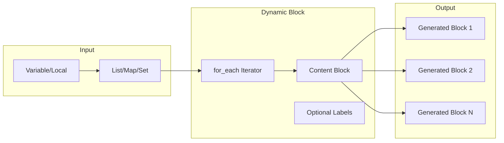
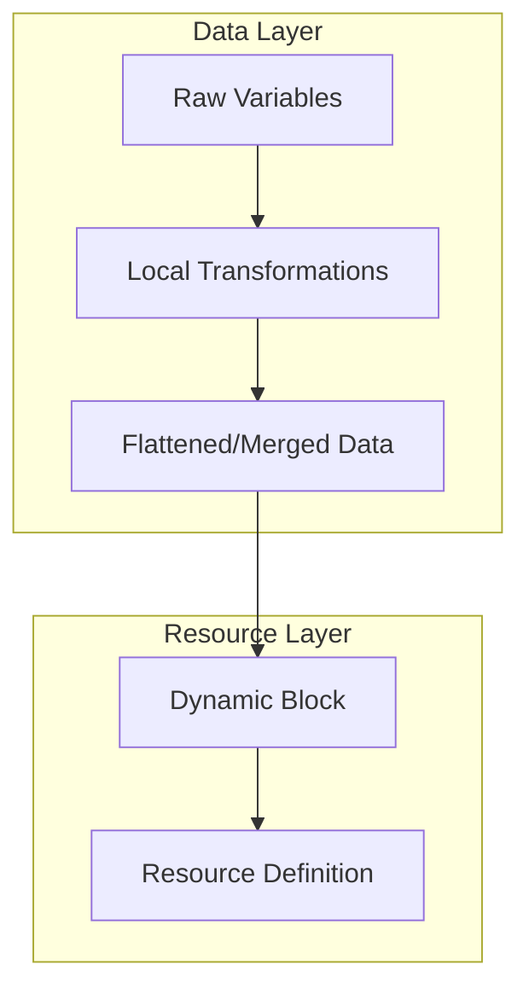
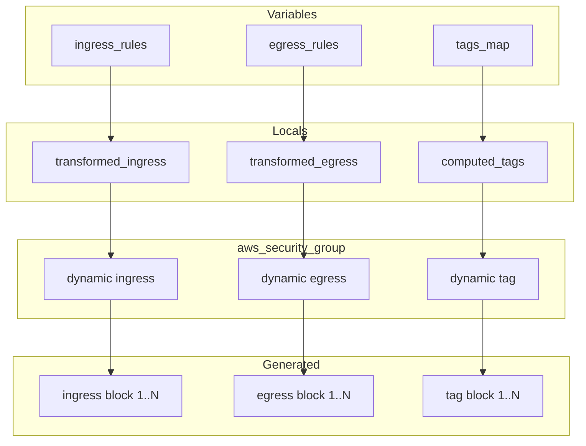

# How to Build Terraform Dynamic Blocks Advanced

Author: [nawazdhandala](https://github.com/nawazdhandala)

Tags: Terraform, IaC, Dynamic-Blocks, HCL

Description: Master advanced Terraform dynamic blocks to create flexible, reusable, and DRY infrastructure configurations with nested iterations, conditionals, and complex data transformations.

---

Dynamic blocks in Terraform transform static infrastructure code into flexible, data-driven configurations. While basic dynamic blocks handle simple iterations, advanced patterns unlock powerful capabilities for managing complex cloud resources at scale.

## Understanding Dynamic Block Architecture

Dynamic blocks generate nested configuration blocks from collections. They replace repetitive code with programmatic generation, making your Terraform modules more maintainable and adaptable.



## Basic Dynamic Block Syntax

Before diving into advanced patterns, here is the foundational syntax.

The `for_each` argument accepts a collection. The `content` block defines the structure generated for each element. The iterator name (defaulting to the block name) provides access to current element values.

```hcl
resource "aws_security_group" "example" {
  name        = "dynamic-sg"
  description = "Security group with dynamic rules"
  vpc_id      = var.vpc_id

  dynamic "ingress" {
    for_each = var.ingress_rules
    content {
      from_port   = ingress.value.from_port
      to_port     = ingress.value.to_port
      protocol    = ingress.value.protocol
      cidr_blocks = ingress.value.cidr_blocks
      description = ingress.value.description
    }
  }
}
```

## Advanced Pattern 1: Nested Dynamic Blocks

Real-world resources often contain multiple levels of nested blocks. You can nest dynamic blocks to handle complex hierarchical structures.

This example creates an AWS WAF rule with nested statements. Each rule contains multiple conditions, and each condition may have multiple match patterns.

```hcl
variable "waf_rules" {
  type = list(object({
    name     = string
    priority = number
    action   = string
    conditions = list(object({
      type     = string
      field    = string
      patterns = list(string)
    }))
  }))
  default = [
    {
      name     = "BlockBadBots"
      priority = 1
      action   = "block"
      conditions = [
        {
          type     = "regex"
          field    = "user-agent"
          patterns = ["BadBot", "EvilCrawler", "MaliciousScript"]
        }
      ]
    },
    {
      name     = "AllowTrustedIPs"
      priority = 2
      action   = "allow"
      conditions = [
        {
          type     = "ip-match"
          field    = "source-ip"
          patterns = ["10.0.0.0/8", "172.16.0.0/12"]
        }
      ]
    }
  ]
}

resource "aws_wafv2_rule_group" "example" {
  name     = "advanced-rules"
  scope    = "REGIONAL"
  capacity = 100

  dynamic "rule" {
    for_each = var.waf_rules
    content {
      name     = rule.value.name
      priority = rule.value.priority

      action {
        dynamic "allow" {
          for_each = rule.value.action == "allow" ? [1] : []
          content {}
        }
        dynamic "block" {
          for_each = rule.value.action == "block" ? [1] : []
          content {}
        }
      }

      statement {
        dynamic "or_statement" {
          for_each = length(rule.value.conditions) > 1 ? [1] : []
          content {
            dynamic "statement" {
              for_each = rule.value.conditions
              content {
                regex_pattern_set_reference_statement {
                  arn = aws_wafv2_regex_pattern_set.patterns[statement.value.field].arn
                  field_to_match {
                    dynamic "single_header" {
                      for_each = statement.value.field == "user-agent" ? [1] : []
                      content {
                        name = "user-agent"
                      }
                    }
                  }
                  text_transformation {
                    priority = 0
                    type     = "NONE"
                  }
                }
              }
            }
          }
        }
      }

      visibility_config {
        cloudwatch_metrics_enabled = true
        metric_name                = rule.value.name
        sampled_requests_enabled   = true
      }
    }
  }

  visibility_config {
    cloudwatch_metrics_enabled = true
    metric_name                = "advanced-rules"
    sampled_requests_enabled   = true
  }
}
```

## Advanced Pattern 2: Conditional Dynamic Blocks

Dynamic blocks can be conditionally included or excluded using the ternary operator with empty collections. This pattern creates optional configuration sections.

The `for_each` evaluates to an empty list when the condition is false, causing the entire block to be omitted from the generated configuration.

```hcl
variable "enable_logging" {
  type    = bool
  default = true
}

variable "logging_config" {
  type = object({
    bucket        = string
    prefix        = string
    include_cookies = bool
  })
  default = {
    bucket          = "my-logs-bucket"
    prefix          = "cdn-logs/"
    include_cookies = false
  }
}

variable "custom_error_responses" {
  type = list(object({
    error_code         = number
    response_code      = number
    response_page_path = string
    caching_min_ttl    = number
  }))
  default = []
}

resource "aws_cloudfront_distribution" "example" {
  enabled = true

  origin {
    domain_name = var.origin_domain
    origin_id   = "primary"
  }

  default_cache_behavior {
    allowed_methods        = ["GET", "HEAD"]
    cached_methods         = ["GET", "HEAD"]
    target_origin_id       = "primary"
    viewer_protocol_policy = "redirect-to-https"

    forwarded_values {
      query_string = false
      cookies {
        forward = "none"
      }
    }
  }

  # Conditional logging block
  dynamic "logging_config" {
    for_each = var.enable_logging ? [var.logging_config] : []
    content {
      bucket          = logging_config.value.bucket
      prefix          = logging_config.value.prefix
      include_cookies = logging_config.value.include_cookies
    }
  }

  # Conditional custom error responses
  dynamic "custom_error_response" {
    for_each = var.custom_error_responses
    content {
      error_code            = custom_error_response.value.error_code
      response_code         = custom_error_response.value.response_code
      response_page_path    = custom_error_response.value.response_page_path
      error_caching_min_ttl = custom_error_response.value.caching_min_ttl
    }
  }

  restrictions {
    geo_restriction {
      restriction_type = "none"
    }
  }

  viewer_certificate {
    cloudfront_default_certificate = true
  }
}
```

## Advanced Pattern 3: Dynamic Blocks with Complex Transformations

You can transform data before feeding it to dynamic blocks using locals. This pattern separates data transformation from resource definition.



This example transforms a hierarchical service definition into flattened IAM policy statements.

```hcl
variable "services" {
  type = map(object({
    actions = list(string)
    resources = list(string)
    conditions = optional(map(object({
      test     = string
      variable = string
      values   = list(string)
    })), {})
  }))
  default = {
    s3 = {
      actions   = ["s3:GetObject", "s3:PutObject", "s3:ListBucket"]
      resources = ["arn:aws:s3:::my-bucket", "arn:aws:s3:::my-bucket/*"]
      conditions = {
        ip_restriction = {
          test     = "IpAddress"
          variable = "aws:SourceIp"
          values   = ["10.0.0.0/8"]
        }
      }
    }
    dynamodb = {
      actions   = ["dynamodb:GetItem", "dynamodb:PutItem", "dynamodb:Query"]
      resources = ["arn:aws:dynamodb:*:*:table/my-table"]
      conditions = {}
    }
    sqs = {
      actions   = ["sqs:SendMessage", "sqs:ReceiveMessage"]
      resources = ["arn:aws:sqs:*:*:my-queue"]
      conditions = {
        ssl_only = {
          test     = "Bool"
          variable = "aws:SecureTransport"
          values   = ["true"]
        }
      }
    }
  }
}

locals {
  # Transform the map into a list with service names included
  policy_statements = [
    for service_name, config in var.services : {
      sid       = "Allow${title(service_name)}Access"
      actions   = config.actions
      resources = config.resources
      conditions = [
        for cond_name, cond in config.conditions : {
          test     = cond.test
          variable = cond.variable
          values   = cond.values
        }
      ]
    }
  ]
}

data "aws_iam_policy_document" "advanced" {
  dynamic "statement" {
    for_each = local.policy_statements
    content {
      sid       = statement.value.sid
      effect    = "Allow"
      actions   = statement.value.actions
      resources = statement.value.resources

      dynamic "condition" {
        for_each = statement.value.conditions
        content {
          test     = condition.value.test
          variable = condition.value.variable
          values   = condition.value.values
        }
      }
    }
  }
}

resource "aws_iam_policy" "advanced" {
  name   = "advanced-service-policy"
  policy = data.aws_iam_policy_document.advanced.json
}
```

## Advanced Pattern 4: Using Iterator Aliases

When working with nested dynamic blocks, iterator aliases prevent naming conflicts and improve readability. The `iterator` argument assigns a custom name to the current element.

```hcl
variable "route_tables" {
  type = map(object({
    routes = list(object({
      cidr_block     = string
      gateway_id     = optional(string)
      nat_gateway_id = optional(string)
      transit_gateway_id = optional(string)
    }))
    tags = map(string)
  }))
  default = {
    public = {
      routes = [
        { cidr_block = "0.0.0.0/0", gateway_id = "igw-123" }
      ]
      tags = { tier = "public" }
    }
    private = {
      routes = [
        { cidr_block = "0.0.0.0/0", nat_gateway_id = "nat-456" },
        { cidr_block = "10.0.0.0/8", transit_gateway_id = "tgw-789" }
      ]
      tags = { tier = "private" }
    }
  }
}

resource "aws_route_table" "example" {
  for_each = var.route_tables
  vpc_id   = var.vpc_id

  dynamic "route" {
    for_each = each.value.routes
    iterator = rt_route  # Custom iterator name
    content {
      cidr_block         = rt_route.value.cidr_block
      gateway_id         = rt_route.value.gateway_id
      nat_gateway_id     = rt_route.value.nat_gateway_id
      transit_gateway_id = rt_route.value.transit_gateway_id
    }
  }

  dynamic "tags" {
    for_each = merge(each.value.tags, { Name = each.key })
    iterator = tag_item  # Different iterator for tags
    content {
      key   = tag_item.key
      value = tag_item.value
    }
  }
}
```

## Advanced Pattern 5: Multi-Dimensional Iterations

Some scenarios require iterating over combinations of multiple collections. Use `setproduct` or nested `for` expressions to generate these combinations.

```hcl
variable "environments" {
  type    = list(string)
  default = ["dev", "staging", "prod"]
}

variable "services" {
  type = list(object({
    name = string
    port = number
    health_check_path = string
  }))
  default = [
    { name = "api", port = 8080, health_check_path = "/health" },
    { name = "web", port = 3000, health_check_path = "/" },
    { name = "worker", port = 9000, health_check_path = "/ready" }
  ]
}

locals {
  # Generate all environment-service combinations
  service_configs = flatten([
    for env in var.environments : [
      for svc in var.services : {
        key               = "${env}-${svc.name}"
        environment       = env
        service_name      = svc.name
        port              = svc.port
        health_check_path = svc.health_check_path
        replicas          = env == "prod" ? 3 : 1
        cpu               = env == "prod" ? 512 : 256
        memory            = env == "prod" ? 1024 : 512
      }
    ]
  ])

  # Convert to map for for_each
  service_map = { for config in local.service_configs : config.key => config }
}

resource "aws_ecs_service" "services" {
  for_each = local.service_map

  name            = each.value.key
  cluster         = aws_ecs_cluster.clusters[each.value.environment].id
  task_definition = aws_ecs_task_definition.tasks[each.key].arn
  desired_count   = each.value.replicas

  dynamic "load_balancer" {
    for_each = each.value.service_name != "worker" ? [1] : []
    content {
      target_group_arn = aws_lb_target_group.targets[each.key].arn
      container_name   = each.value.service_name
      container_port   = each.value.port
    }
  }

  dynamic "capacity_provider_strategy" {
    for_each = each.value.environment == "prod" ? [
      { provider = "FARGATE", weight = 1, base = 1 },
      { provider = "FARGATE_SPOT", weight = 4, base = 0 }
    ] : [
      { provider = "FARGATE_SPOT", weight = 1, base = 0 }
    ]
    content {
      capacity_provider = capacity_provider_strategy.value.provider
      weight            = capacity_provider_strategy.value.weight
      base              = capacity_provider_strategy.value.base
    }
  }
}
```

## Advanced Pattern 6: Dynamic Blocks with Type Polymorphism

Some resources have mutually exclusive block types. Use conditional dynamic blocks to implement polymorphic behavior based on input configuration.

```hcl
variable "notification_targets" {
  type = list(object({
    name = string
    type = string  # "email", "sqs", "lambda", or "sns"
    config = any
  }))
  default = [
    {
      name = "ops-email"
      type = "email"
      config = {
        addresses = ["ops@example.com", "alerts@example.com"]
      }
    },
    {
      name = "event-queue"
      type = "sqs"
      config = {
        queue_arn = "arn:aws:sqs:us-east-1:123456789:events"
      }
    },
    {
      name = "processor"
      type = "lambda"
      config = {
        function_arn = "arn:aws:lambda:us-east-1:123456789:function:processor"
      }
    }
  ]
}

resource "aws_cloudwatch_event_rule" "example" {
  name        = "capture-events"
  description = "Capture application events"

  event_pattern = jsonencode({
    source = ["my.application"]
  })
}

resource "aws_cloudwatch_event_target" "targets" {
  for_each = { for t in var.notification_targets : t.name => t }

  rule      = aws_cloudwatch_event_rule.example.name
  target_id = each.key

  # Polymorphic ARN assignment
  arn = lookup({
    email  = aws_sns_topic.email_notifications.arn
    sqs    = each.value.config.queue_arn
    lambda = each.value.config.function_arn
    sns    = each.value.config.topic_arn
  }, each.value.type, null)

  # SQS-specific configuration
  dynamic "sqs_target" {
    for_each = each.value.type == "sqs" ? [each.value.config] : []
    content {
      message_group_id = lookup(sqs_target.value, "message_group_id", null)
    }
  }

  # Input transformation for Lambda
  dynamic "input_transformer" {
    for_each = each.value.type == "lambda" ? [1] : []
    content {
      input_paths = {
        source     = "$.source"
        detail     = "$.detail"
        time       = "$.time"
        account    = "$.account"
      }
      input_template = <<-EOF
        {
          "source": <source>,
          "detail": <detail>,
          "timestamp": <time>,
          "account": <account>
        }
      EOF
    }
  }
}
```

## Advanced Pattern 7: Validation with Dynamic Blocks

Combine dynamic blocks with validation blocks to enforce complex constraints on input variables.

```hcl
variable "security_rules" {
  type = list(object({
    name        = string
    direction   = string
    protocol    = string
    port_range  = object({
      min = number
      max = number
    })
    source      = string
    priority    = number
  }))

  validation {
    condition = alltrue([
      for rule in var.security_rules :
        contains(["inbound", "outbound"], rule.direction)
    ])
    error_message = "Direction must be 'inbound' or 'outbound'."
  }

  validation {
    condition = alltrue([
      for rule in var.security_rules :
        rule.port_range.min <= rule.port_range.max
    ])
    error_message = "Port range min must be less than or equal to max."
  }

  validation {
    condition = length(var.security_rules) == length(distinct([
      for rule in var.security_rules : rule.priority
    ]))
    error_message = "All rules must have unique priorities."
  }

  default = [
    {
      name       = "allow-https"
      direction  = "inbound"
      protocol   = "tcp"
      port_range = { min = 443, max = 443 }
      source     = "0.0.0.0/0"
      priority   = 100
    },
    {
      name       = "allow-ssh"
      direction  = "inbound"
      protocol   = "tcp"
      port_range = { min = 22, max = 22 }
      source     = "10.0.0.0/8"
      priority   = 200
    }
  ]
}

resource "azurerm_network_security_group" "example" {
  name                = "validated-nsg"
  location            = var.location
  resource_group_name = var.resource_group_name

  dynamic "security_rule" {
    for_each = var.security_rules
    content {
      name                       = security_rule.value.name
      priority                   = security_rule.value.priority
      direction                  = title(security_rule.value.direction)
      access                     = "Allow"
      protocol                   = title(security_rule.value.protocol)
      source_port_range          = "*"
      destination_port_range     = security_rule.value.port_range.min == security_rule.value.port_range.max ? tostring(security_rule.value.port_range.min) : "${security_rule.value.port_range.min}-${security_rule.value.port_range.max}"
      source_address_prefix      = security_rule.value.source
      destination_address_prefix = "*"
    }
  }
}
```

## Dynamic Block Flow for Complex Resources

This diagram illustrates how multiple dynamic blocks interact within a single resource definition.



## Performance Considerations

Dynamic blocks execute during the plan phase. Consider these optimizations.

First, minimize complex computations within dynamic block content. Pre-compute values in locals.

Second, avoid deeply nested dynamic blocks when flattening data structures would suffice.

Third, use `for_each` with maps rather than lists for stable resource addressing.

```hcl
# Avoid: Nested computation in dynamic block
dynamic "setting" {
  for_each = var.settings
  content {
    name  = setting.key
    # Avoid complex expressions here
    value = complex_function(setting.value, other_data)
  }
}

# Better: Pre-compute in locals
locals {
  processed_settings = {
    for k, v in var.settings : k => complex_function(v, other_data)
  }
}

dynamic "setting" {
  for_each = local.processed_settings
  content {
    name  = setting.key
    value = setting.value
  }
}
```

## Debugging Dynamic Blocks

When dynamic blocks produce unexpected results, use these techniques to debug.

Output the intermediate data structures to verify transformations.

```hcl
output "debug_policy_statements" {
  value = local.policy_statements
}

output "debug_service_map" {
  value = local.service_map
}
```

Use `terraform console` to test expressions interactively.

```bash
$ terraform console
> var.services
> local.service_configs
> [for env in var.environments : [for svc in var.services : "${env}-${svc.name}"]]
```

## Best Practices Summary

1. **Use locals for transformations** - Keep dynamic block content simple
2. **Name iterators explicitly** - Especially in nested blocks
3. **Validate inputs** - Catch errors before plan execution
4. **Document complex patterns** - Future maintainers will thank you
5. **Test with varied inputs** - Edge cases reveal bugs
6. **Prefer maps over lists** - Stable resource addressing
7. **Avoid over-nesting** - Flatten when possible

---

Dynamic blocks transform Terraform from configuration files into a powerful infrastructure programming language. Master these advanced patterns to build flexible, maintainable modules that adapt to your organization's evolving needs. Start with simple patterns, gradually introduce complexity, and always prioritize readability over cleverness.
