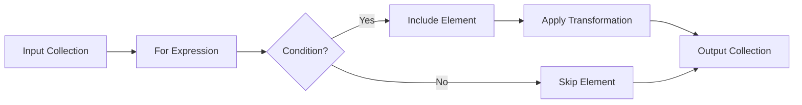
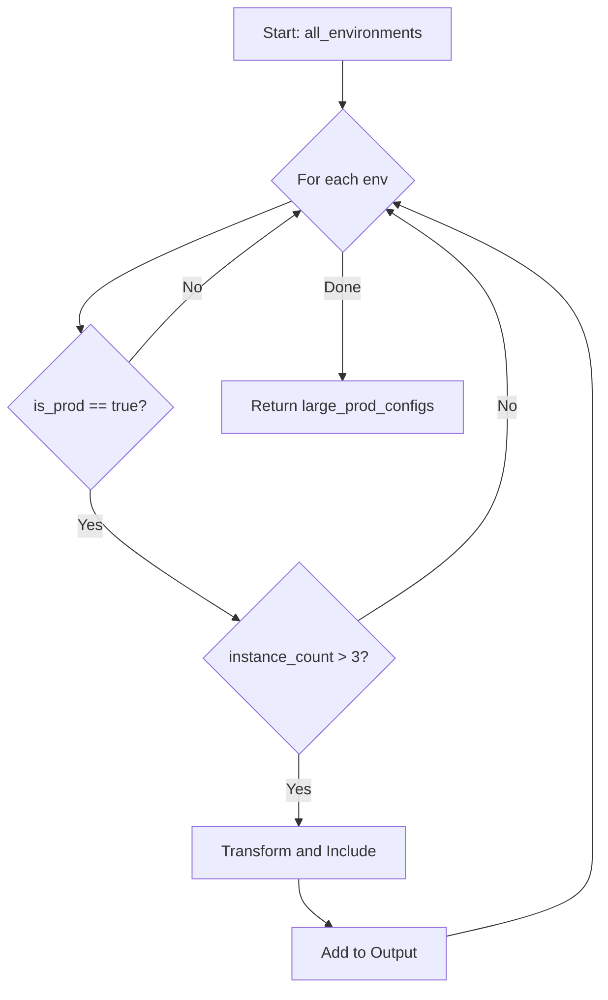

# How to Implement Terraform For Expressions

Author: [nawazdhandala](https://github.com/nawazdhandala)

Tags: Terraform, IaC, Expressions, HCL

Description: Learn how to use Terraform for expressions to transform and filter collections, create dynamic resource configurations, and write cleaner Infrastructure as Code.

---

Terraform for expressions are one of the most powerful features in HCL (HashiCorp Configuration Language) for working with collections. They allow you to transform lists and maps, filter data, and create dynamic configurations that would otherwise require repetitive code blocks.

This guide walks through for expressions from the basics to advanced patterns you can use in production infrastructure code.

---

## Table of Contents

1. What Are For Expressions?
2. Basic Syntax and Structure
3. Transforming Lists
4. Transforming Maps
5. Filtering with Conditionals
6. Nested For Expressions
7. Grouping Results
8. Practical Examples
9. Common Patterns and Best Practices
10. Troubleshooting Common Errors

---

## 1. What Are For Expressions?

A for expression in Terraform lets you iterate over a collection (list, set, map, or object) and produce a new collection by applying a transformation to each element.

Think of them as similar to list comprehensions in Python or map/filter functions in JavaScript.

| Concept | Description |
|---------|-------------|
| For Expression | A construct that iterates over a collection and produces a new collection |
| Input Collection | The list, set, map, or object you iterate over |
| Output Collection | The resulting list or map after transformation |
| Iterator Variable | The temporary variable representing each element during iteration |
| Condition | Optional filter that includes/excludes elements |

---

## 2. Basic Syntax and Structure

The general syntax for a for expression depends on whether you want to produce a list or a map.

For expressions that produce a list use square brackets:

```hcl
[for item in collection : transformation]
```

For expressions that produce a map use curly braces:

```hcl
{for item in collection : key_expression => value_expression}
```

Here is a diagram showing how for expressions process collections:



---

## 3. Transforming Lists

The most common use case is transforming one list into another. The following example converts a list of names to uppercase:

```hcl
variable "environments" {
  type    = list(string)
  default = ["dev", "staging", "prod"]
}

locals {
  uppercase_envs = [for env in var.environments : upper(env)]
}

# Result: ["DEV", "STAGING", "PROD"]
```

You can also access the index of each element by using a two-variable form:

```hcl
variable "servers" {
  type    = list(string)
  default = ["web", "api", "worker"]
}

locals {
  server_names = [for idx, name in var.servers : "${name}-${idx}"]
}

# Result: ["web-0", "api-1", "worker-2"]
```

This example creates resource names with sequential numbering, which is useful for naming conventions:

```hcl
variable "availability_zones" {
  type    = list(string)
  default = ["us-east-1a", "us-east-1b", "us-east-1c"]
}

locals {
  subnet_configs = [
    for idx, az in var.availability_zones : {
      name              = "subnet-${idx}"
      availability_zone = az
      cidr_block        = "10.0.${idx}.0/24"
    }
  ]
}
```

---

## 4. Transforming Maps

When iterating over maps, you get access to both the key and value. The following example transforms a map of instance types into a list of configuration objects:

```hcl
variable "instance_types" {
  type = map(string)
  default = {
    web    = "t3.medium"
    api    = "t3.large"
    worker = "t3.xlarge"
  }
}

locals {
  instance_configs = [
    for name, type in var.instance_types : {
      name          = name
      instance_type = type
      tags = {
        Name = name
        Type = type
      }
    }
  ]
}
```

To produce a map from a map (key transformation), use curly braces:

```hcl
variable "services" {
  type = map(object({
    port    = number
    enabled = bool
  }))
  default = {
    nginx = { port = 80, enabled = true }
    redis = { port = 6379, enabled = true }
    mysql = { port = 3306, enabled = false }
  }
}

locals {
  # Create a map of service names to their ports
  service_ports = {
    for name, config in var.services : name => config.port
  }
}

# Result: { nginx = 80, redis = 6379, mysql = 3306 }
```

---

## 5. Filtering with Conditionals

Add an if clause at the end of a for expression to filter elements. This example filters a list to include only production environments:

```hcl
variable "all_environments" {
  type = list(object({
    name        = string
    is_prod     = bool
    instance_count = number
  }))
  default = [
    { name = "dev", is_prod = false, instance_count = 1 },
    { name = "staging", is_prod = false, instance_count = 2 },
    { name = "prod-us", is_prod = true, instance_count = 5 },
    { name = "prod-eu", is_prod = true, instance_count = 3 }
  ]
}

locals {
  prod_environments = [
    for env in var.all_environments : env.name
    if env.is_prod
  ]
}

# Result: ["prod-us", "prod-eu"]
```

You can combine transformation and filtering:

```hcl
locals {
  large_prod_configs = [
    for env in var.all_environments : {
      name  = upper(env.name)
      count = env.instance_count * 2
    }
    if env.is_prod && env.instance_count > 3
  ]
}

# Result: [{ name = "PROD-US", count = 10 }]
```

The filtering flow works as follows:



---

## 6. Nested For Expressions

For more complex transformations, you can nest for expressions. This example creates a flattened list from a nested structure:

```hcl
variable "regions" {
  type = map(list(string))
  default = {
    us = ["us-east-1", "us-west-2"]
    eu = ["eu-west-1", "eu-central-1"]
  }
}

locals {
  all_zones = flatten([
    for region, zones in var.regions : [
      for zone in zones : {
        region = region
        zone   = zone
      }
    ]
  ])
}

# Result:
# [
#   { region = "us", zone = "us-east-1" },
#   { region = "us", zone = "us-west-2" },
#   { region = "eu", zone = "eu-west-1" },
#   { region = "eu", zone = "eu-central-1" }
# ]
```

This pattern is useful for creating resources across multiple dimensions:

```hcl
variable "applications" {
  type    = list(string)
  default = ["frontend", "backend", "worker"]
}

variable "environments" {
  type    = list(string)
  default = ["dev", "staging", "prod"]
}

locals {
  app_env_matrix = flatten([
    for app in var.applications : [
      for env in var.environments : {
        app = app
        env = env
        name = "${app}-${env}"
      }
    ]
  ])
}

# Creates 9 combinations: frontend-dev, frontend-staging, frontend-prod, etc.
```

---

## 7. Grouping Results

Use the ellipsis operator (...) to group values by key when creating maps. This is helpful when multiple items share the same key:

```hcl
variable "users" {
  type = list(object({
    name = string
    team = string
    role = string
  }))
  default = [
    { name = "alice", team = "platform", role = "admin" },
    { name = "bob", team = "platform", role = "developer" },
    { name = "carol", team = "security", role = "admin" },
    { name = "david", team = "security", role = "viewer" }
  ]
}

locals {
  users_by_team = {
    for user in var.users : user.team => user.name...
  }
}

# Result:
# {
#   platform = ["alice", "bob"]
#   security = ["carol", "david"]
# }
```

Without the ellipsis, Terraform would error on duplicate keys. The ellipsis tells Terraform to collect all values for each key into a list.

---

## 8. Practical Examples

### Creating Multiple AWS S3 Buckets

This example creates S3 buckets for each environment with consistent naming:

```hcl
variable "bucket_configs" {
  type = map(object({
    versioning = bool
    logging    = bool
  }))
  default = {
    logs    = { versioning = false, logging = false }
    backups = { versioning = true, logging = true }
    assets  = { versioning = true, logging = false }
  }
}

resource "aws_s3_bucket" "buckets" {
  for_each = var.bucket_configs

  bucket = "mycompany-${each.key}-${terraform.workspace}"

  tags = {
    Name        = each.key
    Environment = terraform.workspace
    Versioning  = each.value.versioning ? "enabled" : "disabled"
  }
}

resource "aws_s3_bucket_versioning" "versioning" {
  for_each = {
    for name, config in var.bucket_configs : name => config
    if config.versioning
  }

  bucket = aws_s3_bucket.buckets[each.key].id

  versioning_configuration {
    status = "Enabled"
  }
}
```

### Creating Security Group Rules from a List

This example dynamically creates ingress rules:

```hcl
variable "allowed_ports" {
  type = list(object({
    port        = number
    protocol    = string
    cidr_blocks = list(string)
    description = string
  }))
  default = [
    { port = 22, protocol = "tcp", cidr_blocks = ["10.0.0.0/8"], description = "SSH" },
    { port = 443, protocol = "tcp", cidr_blocks = ["0.0.0.0/0"], description = "HTTPS" },
    { port = 80, protocol = "tcp", cidr_blocks = ["0.0.0.0/0"], description = "HTTP" }
  ]
}

resource "aws_security_group" "main" {
  name        = "main-sg"
  description = "Main security group"
  vpc_id      = var.vpc_id

  dynamic "ingress" {
    for_each = var.allowed_ports
    content {
      from_port   = ingress.value.port
      to_port     = ingress.value.port
      protocol    = ingress.value.protocol
      cidr_blocks = ingress.value.cidr_blocks
      description = ingress.value.description
    }
  }

  egress {
    from_port   = 0
    to_port     = 0
    protocol    = "-1"
    cidr_blocks = ["0.0.0.0/0"]
  }
}
```

### Building a Map of DNS Records

This example creates Route53 records for multiple services:

```hcl
variable "services" {
  type = map(object({
    subdomain = string
    target    = string
    type      = string
    ttl       = number
  }))
  default = {
    api = {
      subdomain = "api"
      target    = "10.0.1.100"
      type      = "A"
      ttl       = 300
    }
    www = {
      subdomain = "www"
      target    = "cdn.example.com"
      type      = "CNAME"
      ttl       = 3600
    }
  }
}

locals {
  dns_records = {
    for name, service in var.services : "${service.subdomain}.${var.domain}" => {
      name    = service.subdomain
      type    = service.type
      ttl     = service.ttl
      records = service.type == "A" ? [service.target] : null
      alias   = service.type == "CNAME" ? service.target : null
    }
  }
}

resource "aws_route53_record" "records" {
  for_each = local.dns_records

  zone_id = var.zone_id
  name    = each.value.name
  type    = each.value.type
  ttl     = each.value.ttl
  records = each.value.records != null ? each.value.records : [each.value.alias]
}
```

---

## 9. Common Patterns and Best Practices

### Pattern: Convert List to Map for for_each

Since for_each requires a map or set, convert lists using a for expression:

```hcl
variable "server_names" {
  type    = list(string)
  default = ["web-1", "web-2", "api-1"]
}

resource "aws_instance" "servers" {
  for_each = { for name in var.server_names : name => name }

  ami           = var.ami_id
  instance_type = "t3.medium"

  tags = {
    Name = each.key
  }
}
```

### Pattern: Merge and Transform Multiple Sources

Combine data from multiple variables:

```hcl
variable "base_tags" {
  type = map(string)
  default = {
    Project = "myproject"
    Team    = "platform"
  }
}

variable "environment" {
  type    = string
  default = "production"
}

locals {
  all_tags = merge(
    var.base_tags,
    {
      for key, value in var.base_tags : "prefix-${key}" => value
    },
    {
      Environment = var.environment
      ManagedBy   = "terraform"
    }
  )
}
```

### Best Practices

1. Keep expressions readable by breaking complex transformations into multiple locals
2. Use meaningful iterator variable names instead of single letters
3. Add comments for complex filter conditions
4. Test expressions with terraform console before using in resources
5. Prefer for_each over count for resources that may be added or removed

---

## 10. Troubleshooting Common Errors

### Error: Duplicate Key in Map

This occurs when a for expression produces duplicate keys:

```hcl
# This will error if any services share the same port
locals {
  # BAD: May have duplicate keys
  ports_to_services = {
    for name, config in var.services : config.port => name
  }

  # GOOD: Use grouping with ellipsis
  ports_to_services = {
    for name, config in var.services : config.port => name...
  }
}
```

### Error: Invalid for_each Argument

The for_each meta-argument requires a map or set of strings:

```hcl
# BAD: for_each with a list
resource "aws_instance" "servers" {
  for_each = var.server_list  # Error if server_list is a list
}

# GOOD: Convert list to set
resource "aws_instance" "servers" {
  for_each = toset(var.server_list)
}

# GOOD: Convert list to map
resource "aws_instance" "servers" {
  for_each = { for s in var.server_list : s.name => s }
}
```

### Error: Cannot Use Conditional in For Expression Key

The key expression cannot be conditional, but the whole entry can be filtered:

```hcl
# BAD: Conditional in key position
locals {
  mapping = {
    for item in var.items : (item.enabled ? item.name : null) => item
  }
}

# GOOD: Filter first, then create key
locals {
  mapping = {
    for item in var.items : item.name => item
    if item.enabled
  }
}
```

---

## Summary

| Use Case | Syntax Pattern |
|----------|----------------|
| Transform list | `[for x in list : transform(x)]` |
| Transform map to list | `[for k, v in map : transform(k, v)]` |
| Transform map to map | `{for k, v in map : new_key => new_value}` |
| Filter elements | `[for x in list : x if condition]` |
| Group by key | `{for x in list : x.key => x.value...}` |
| Flatten nested | `flatten([for x in outer : [for y in inner : ...]])` |
| List to map for for_each | `{for x in list : x.id => x}` |

For expressions are essential for writing clean, maintainable Terraform code. They eliminate repetition, make configurations more dynamic, and allow you to express complex transformations declaratively.

---

*Need to monitor your Terraform-managed infrastructure? [OneUptime](https://oneuptime.com) provides comprehensive observability for your cloud resources, with support for alerts, status pages, and incident management.*

---

**Related Reading:**

- [Introducing the OneUptime Terraform Provider](https://oneuptime.com/blog/post/2025-07-01-introducing-terraform-provider-for-oneuptime/view)
- [What is Site Reliability Engineering](https://oneuptime.com/blog/post/2025-11-28-what-is-site-reliability-engineering/view)
- [SRE Best Practices](https://oneuptime.com/blog/post/2025-11-28-sre-best-practices/view)
