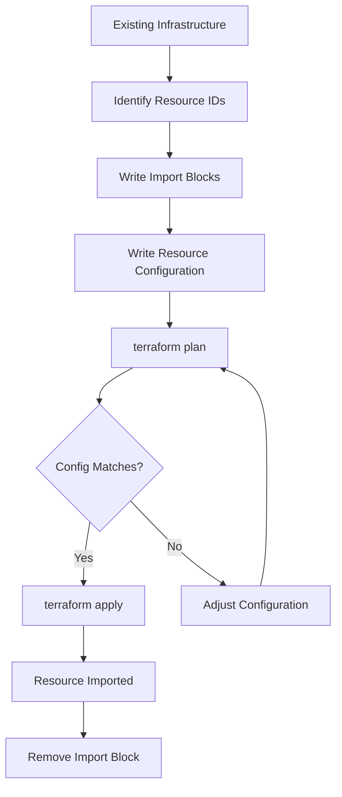
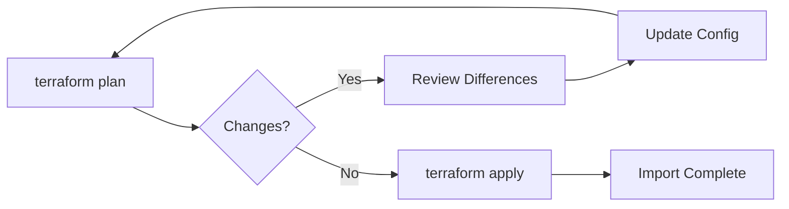
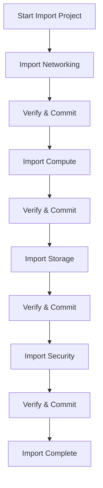
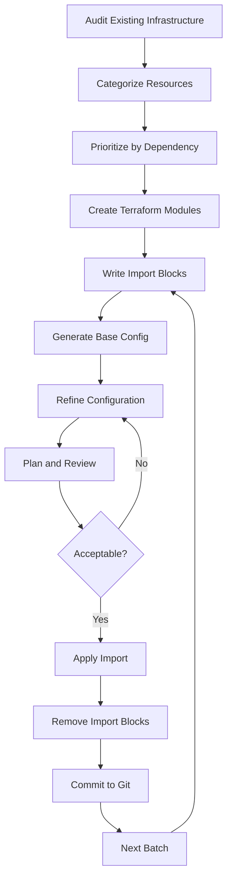

# How to Implement Terraform Import Blocks

Author: [nawazdhandala](https://github.com/nawazdhandala)

Tags: Terraform, IaC, Import, Infrastructure

Description: Learn how to use Terraform import blocks to bring existing infrastructure under Terraform management declaratively.

---

Managing existing infrastructure with Terraform has traditionally required imperative `terraform import` commands. Terraform 1.5 introduced import blocks, a declarative way to import resources directly in your configuration files. This approach is more repeatable, reviewable, and fits naturally into GitOps workflows.

## The Problem with Traditional Imports

Before import blocks, bringing existing resources into Terraform required running commands like this:

```bash
terraform import aws_instance.web i-1234567890abcdef0
```

This approach has several drawbacks:

- Commands must be run manually and in sequence
- No audit trail in version control
- Difficult to reproduce across environments
- Team members cannot review imports in pull requests
- Easy to forget or mistype resource addresses

## How Import Blocks Work

Import blocks let you declare imports directly in your Terraform configuration. When you run `terraform plan` or `terraform apply`, Terraform reads these blocks and imports the specified resources.



## Basic Syntax

The import block has a straightforward structure. You specify the target resource address and the ID of the existing resource.

```hcl
import {
  to = aws_instance.web
  id = "i-1234567890abcdef0"
}

resource "aws_instance" "web" {
  ami           = "ami-0c55b159cbfafe1f0"
  instance_type = "t3.micro"

  tags = {
    Name = "web-server"
  }
}
```

The `to` argument specifies the resource address in your Terraform configuration. The `id` argument is the provider-specific identifier of the existing resource.

## Step-by-Step Implementation

### Step 1: Identify Resources to Import

First, gather the IDs of resources you want to import. Each provider uses different ID formats.

```bash
# AWS EC2 instances use instance IDs
aws ec2 describe-instances --query 'Reservations[].Instances[].InstanceId'

# Azure resources use full resource IDs
az vm list --query '[].id'

# GCP uses project/zone/name format
gcloud compute instances list --format="value(name,zone)"
```

### Step 2: Create Import Blocks

Create a dedicated file for your imports. This makes it easy to track and remove them later.

```hcl
# imports.tf

import {
  to = aws_vpc.main
  id = "vpc-0a1b2c3d4e5f6g7h8"
}

import {
  to = aws_subnet.public[0]
  id = "subnet-0a1b2c3d4e5f6g7h8"
}

import {
  to = aws_subnet.public[1]
  id = "subnet-1a2b3c4d5e6f7g8h9"
}

import {
  to = aws_security_group.web
  id = "sg-0a1b2c3d4e5f6g7h8"
}
```

### Step 3: Write Matching Resource Configurations

Your resource configurations must match the actual state of the imported resources. Start with a minimal configuration and iterate.

```hcl
# vpc.tf

resource "aws_vpc" "main" {
  cidr_block           = "10.0.0.0/16"
  enable_dns_hostnames = true
  enable_dns_support   = true

  tags = {
    Name = "main-vpc"
  }
}

resource "aws_subnet" "public" {
  count                   = 2
  vpc_id                  = aws_vpc.main.id
  cidr_block              = cidrsubnet(aws_vpc.main.cidr_block, 8, count.index)
  map_public_ip_on_launch = true
  availability_zone       = data.aws_availability_zones.available.names[count.index]

  tags = {
    Name = "public-subnet-${count.index}"
  }
}

resource "aws_security_group" "web" {
  name        = "web-sg"
  description = "Security group for web servers"
  vpc_id      = aws_vpc.main.id

  ingress {
    from_port   = 443
    to_port     = 443
    protocol    = "tcp"
    cidr_blocks = ["0.0.0.0/0"]
  }

  egress {
    from_port   = 0
    to_port     = 0
    protocol    = "-1"
    cidr_blocks = ["0.0.0.0/0"]
  }
}
```

### Step 4: Run Plan and Iterate

Run `terraform plan` to see if your configuration matches the existing resources.

```bash
terraform plan
```

The plan output shows what changes Terraform would make. If the configuration does not match, you will see proposed changes. Adjust your configuration until the plan shows no changes (or only acceptable changes).



### Step 5: Apply and Clean Up

Once your plan looks correct, apply the changes.

```bash
terraform apply
```

After successful import, remove the import blocks from your configuration. They are only needed for the initial import.

```bash
# Remove imports.tf or delete the import blocks
rm imports.tf
```

## Generating Configuration Automatically

Terraform 1.5+ can generate configuration for imported resources. This saves time when importing complex resources.

Use the `-generate-config-out` flag to create a configuration file.

```bash
terraform plan -generate-config-out=generated.tf
```

This creates a file with resource configurations that match the imported resources.

```hcl
# generated.tf (auto-generated)

resource "aws_instance" "web" {
  ami                         = "ami-0c55b159cbfafe1f0"
  instance_type               = "t3.micro"
  subnet_id                   = "subnet-0a1b2c3d4e5f6g7h8"
  vpc_security_group_ids      = ["sg-0a1b2c3d4e5f6g7h8"]
  associate_public_ip_address = true

  root_block_device {
    volume_size = 20
    volume_type = "gp3"
  }

  tags = {
    Name = "web-server"
  }
}
```

Review and refactor the generated configuration before committing it to version control.

## Using For Each with Imports

Import blocks work well with `for_each` resources. You need to specify the full resource address including the key.

```hcl
locals {
  instances = {
    web    = "i-0a1b2c3d4e5f6g7h8"
    api    = "i-1a2b3c4d5e6f7g8h9"
    worker = "i-2a3b4c5d6e7f8g9h0"
  }
}

import {
  for_each = local.instances
  to       = aws_instance.server[each.key]
  id       = each.value
}

resource "aws_instance" "server" {
  for_each      = local.instances
  ami           = "ami-0c55b159cbfafe1f0"
  instance_type = "t3.micro"

  tags = {
    Name = each.key
  }
}
```

## Importing Modules

You can import resources into modules by specifying the full module path.

```hcl
import {
  to = module.vpc.aws_vpc.this[0]
  id = "vpc-0a1b2c3d4e5f6g7h8"
}

import {
  to = module.vpc.aws_subnet.public[0]
  id = "subnet-0a1b2c3d4e5f6g7h8"
}

module "vpc" {
  source  = "terraform-aws-modules/vpc/aws"
  version = "5.0.0"

  name = "main-vpc"
  cidr = "10.0.0.0/16"

  azs             = ["us-east-1a", "us-east-1b"]
  public_subnets  = ["10.0.1.0/24", "10.0.2.0/24"]
  private_subnets = ["10.0.101.0/24", "10.0.102.0/24"]
}
```

## Provider-Specific ID Formats

Different providers use different ID formats. Here are common examples.

### AWS

```hcl
# EC2 Instance
import {
  to = aws_instance.web
  id = "i-1234567890abcdef0"
}

# S3 Bucket
import {
  to = aws_s3_bucket.data
  id = "my-bucket-name"
}

# IAM Role
import {
  to = aws_iam_role.app
  id = "my-role-name"
}

# RDS Instance
import {
  to = aws_db_instance.main
  id = "my-database-identifier"
}
```

### Azure

```hcl
# Virtual Machine
import {
  to = azurerm_virtual_machine.web
  id = "/subscriptions/00000000-0000-0000-0000-000000000000/resourceGroups/mygroup/providers/Microsoft.Compute/virtualMachines/myvm"
}

# Storage Account
import {
  to = azurerm_storage_account.data
  id = "/subscriptions/00000000-0000-0000-0000-000000000000/resourceGroups/mygroup/providers/Microsoft.Storage/storageAccounts/mystorageaccount"
}
```

### Google Cloud

```hcl
# Compute Instance
import {
  to = google_compute_instance.web
  id = "projects/my-project/zones/us-central1-a/instances/my-instance"
}

# Cloud SQL Instance
import {
  to = google_sql_database_instance.main
  id = "my-project/my-instance"
}
```

## Best Practices

### Organize Imports in Dedicated Files

Keep import blocks separate from your main configuration.

```
project/
  main.tf
  variables.tf
  outputs.tf
  imports.tf      # Temporary file for imports
```

### Use Descriptive Comments

Document why resources are being imported.

```hcl
# imports.tf

# Importing legacy VPC created manually in 2022
# Ticket: INFRA-1234
import {
  to = aws_vpc.legacy
  id = "vpc-0a1b2c3d4e5f6g7h8"
}
```

### Import in Batches

For large environments, import resources in logical batches.



### Use Data Sources for Dependencies

When imported resources reference other resources, use data sources initially.

```hcl
# Use data source for the VPC until it is also imported
data "aws_vpc" "existing" {
  id = "vpc-0a1b2c3d4e5f6g7h8"
}

resource "aws_subnet" "imported" {
  vpc_id     = data.aws_vpc.existing.id
  cidr_block = "10.0.1.0/24"
}
```

After importing the VPC, refactor to use resource references.

### Validate State After Import

After importing, verify the state file contains the expected data.

```bash
terraform state show aws_instance.web
terraform state list
```

## Common Pitfalls

### Mismatched Configuration

The most common issue is configuration that does not match the imported resource. Use `terraform plan` to identify differences and adjust your configuration.

### Missing Required Arguments

Some providers require arguments that are not visible in the console. Check provider documentation for required and optional arguments.

### Incorrect Resource Addresses

For indexed resources, use the correct index format.

```hcl
# List-style (count)
import {
  to = aws_subnet.public[0]
  id = "subnet-abc123"
}

# Map-style (for_each)
import {
  to = aws_subnet.public["us-east-1a"]
  id = "subnet-abc123"
}
```

### Importing into Wrong State

Ensure you are working with the correct Terraform workspace and backend.

```bash
terraform workspace show
terraform state list
```

## Migration Strategy

When migrating existing infrastructure to Terraform, follow this workflow.



## Conclusion

Terraform import blocks transform infrastructure migration from an error-prone manual process to a declarative, reviewable workflow. By keeping imports in configuration files, you gain version control, collaboration, and repeatability.

Start with a small batch of resources, iterate until your configuration matches, then expand to cover your entire infrastructure. The investment in proper imports pays off with maintainable, drift-free infrastructure.

---

*Need help monitoring your Terraform-managed infrastructure? [OneUptime](https://oneuptime.com) provides comprehensive observability for your entire stack, including infrastructure health, performance metrics, and incident management.*
