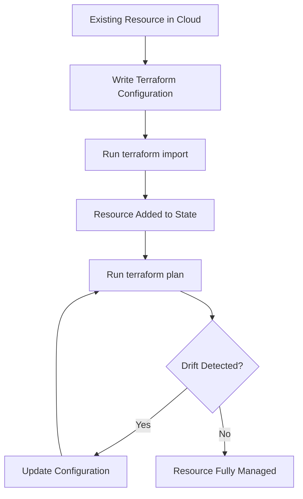
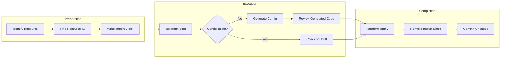
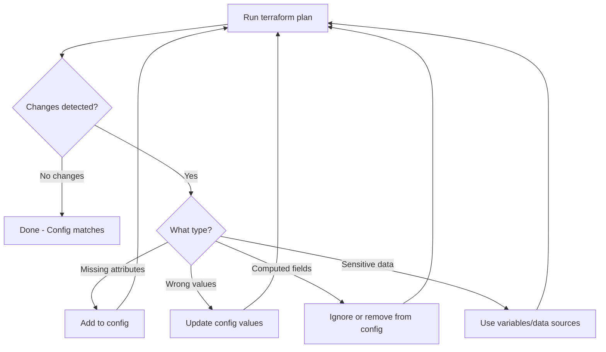

# How to Implement Terraform Import Support

Author: [nawazdhandala](https://github.com/nawazdhandala)

Tags: Terraform, Infrastructure, Import, IaC

Description: A practical guide to implementing and using Terraform import to bring existing infrastructure under code management.

---

Terraform import lets you bring existing infrastructure into Terraform management without recreating resources. This is essential when you have manually created resources or are migrating from another IaC tool.

## Why Import Matters

Most teams don't start with Terraform from day one. You likely have:

- Manually created cloud resources from the console
- Legacy infrastructure from scripts or other tools
- Resources created by other teams before standardization
- Emergency fixes that bypassed the normal workflow

Import bridges the gap between what exists and what Terraform knows about.

## The Import Workflow



The workflow has three phases:
1. **Prepare** - Write configuration that matches the existing resource
2. **Import** - Link the resource to Terraform state
3. **Reconcile** - Fix any configuration drift until plan shows no changes

## Method 1: terraform import Command

The classic approach uses the CLI command:

```bash
terraform import <resource_address> <resource_id>
```

### Importing an AWS EC2 Instance

First, write the resource block:

```hcl
resource "aws_instance" "web_server" {
  ami           = "ami-0c55b159cbfafe1f0"
  instance_type = "t3.medium"

  tags = {
    Name = "production-web"
  }
}
```

Then run the import:

```bash
terraform import aws_instance.web_server i-1234567890abcdef0
```

### Importing an AWS S3 Bucket

```hcl
resource "aws_s3_bucket" "data" {
  bucket = "my-company-data-bucket"
}
```

```bash
terraform import aws_s3_bucket.data my-company-data-bucket
```

### Importing Resources in Modules

For resources inside modules, use the full path:

```bash
terraform import module.vpc.aws_vpc.main vpc-abc123
terraform import 'module.servers["web"].aws_instance.this' i-def456
```

Note the quotes around addresses with special characters.

## Method 2: Import Blocks (Terraform 1.5+)

Terraform 1.5 introduced import blocks, which are declarative and can be version controlled:

```hcl
import {
  to = aws_instance.web_server
  id = "i-1234567890abcdef0"
}

resource "aws_instance" "web_server" {
  ami           = "ami-0c55b159cbfafe1f0"
  instance_type = "t3.medium"

  tags = {
    Name = "production-web"
  }
}
```

Run `terraform plan` to see what will be imported:

```bash
terraform plan
```

Output shows:

```
aws_instance.web_server: Preparing import... [id=i-1234567890abcdef0]
aws_instance.web_server: Refreshing state... [id=i-1234567890abcdef0]

Terraform will perform the following actions:

  # aws_instance.web_server will be imported
    resource "aws_instance" "web_server" {
        ami                          = "ami-0c55b159cbfafe1f0"
        instance_type                = "t3.medium"
        ...
    }

Plan: 1 to import, 0 to add, 0 to change, 0 to destroy.
```

Apply to complete the import:

```bash
terraform apply
```

### Import Block Advantages

- **Version controlled** - Import intentions live in your repo
- **Reviewable** - Team members can review imports in PRs
- **Repeatable** - Run in CI/CD pipelines
- **Generated config** - Can auto-generate resource blocks

## Generating Configuration Automatically

Terraform 1.5+ can generate configuration during import:

```hcl
import {
  to = aws_instance.web_server
  id = "i-1234567890abcdef0"
}
```

Run with the generate flag:

```bash
terraform plan -generate-config-out=generated.tf
```

This creates `generated.tf` with the full resource configuration:

```hcl
resource "aws_instance" "web_server" {
  ami                                  = "ami-0c55b159cbfafe1f0"
  associate_public_ip_address          = true
  availability_zone                    = "us-east-1a"
  disable_api_stop                     = false
  disable_api_termination              = false
  ebs_optimized                        = true
  get_password_data                    = false
  hibernation                          = false
  instance_initiated_shutdown_behavior = "stop"
  instance_type                        = "t3.medium"
  monitoring                           = false
  # ... all other attributes
}
```

Review and clean up the generated code, removing computed attributes you don't need to manage.

## Import Workflow Diagram



## State Management After Import

### Viewing Imported State

After import, inspect the state:

```bash
terraform state show aws_instance.web_server
```

Output:

```
# aws_instance.web_server:
resource "aws_instance" "web_server" {
    ami                          = "ami-0c55b159cbfafe1f0"
    arn                          = "arn:aws:ec2:us-east-1:123456789:instance/i-1234567890abcdef0"
    instance_state               = "running"
    instance_type                = "t3.medium"
    ...
}
```

### Moving Resources in State

Sometimes you need to reorganize after import:

```bash
# Rename a resource
terraform state mv aws_instance.web_server aws_instance.production_web

# Move into a module
terraform state mv aws_instance.web_server module.compute.aws_instance.web
```

### Removing from State (Without Destroying)

If you need to stop managing a resource:

```bash
terraform state rm aws_instance.web_server
```

The resource continues to exist but Terraform no longer tracks it.

## Handling Drift After Import

Import rarely results in a clean plan. You will see drift between your configuration and the actual resource.

### Common Drift Scenarios



### Example: Fixing Configuration Drift

Initial plan after import shows:

```
  # aws_instance.web_server will be updated in-place
  ~ resource "aws_instance" "web_server" {
      ~ instance_type = "t3.medium" -> "t2.micro"  # wrong in config
        tags = {
          ~ "Environment" = "production" -> null   # missing tag
        }
    }
```

Fix by updating the configuration:

```hcl
resource "aws_instance" "web_server" {
  ami           = "ami-0c55b159cbfafe1f0"
  instance_type = "t3.medium"  # Fixed

  tags = {
    Name        = "production-web"
    Environment = "production"  # Added
  }
}
```

### Ignoring Computed Attributes

Some attributes are computed and will always show drift:

```hcl
resource "aws_instance" "web_server" {
  ami           = "ami-0c55b159cbfafe1f0"
  instance_type = "t3.medium"

  lifecycle {
    ignore_changes = [
      # Ignore changes to these computed/external attributes
      user_data,
      user_data_base64,
    ]
  }
}
```

## Bulk Import Strategy

For importing many resources, use a systematic approach:

### Step 1: List Resources to Import

```bash
# AWS CLI example
aws ec2 describe-instances \
  --filters "Name=tag:Environment,Values=production" \
  --query 'Reservations[].Instances[].[InstanceId,Tags[?Key==`Name`].Value|[0]]' \
  --output text > instances.txt
```

### Step 2: Generate Import Blocks

```bash
while read id name; do
  cat << EOF >> imports.tf
import {
  to = aws_instance.${name}
  id = "${id}"
}

EOF
done < instances.txt
```

### Step 3: Generate Configuration

```bash
terraform plan -generate-config-out=generated_resources.tf
```

### Step 4: Review and Apply

Review the generated code, clean it up, then:

```bash
terraform apply
```

### Step 5: Clean Up Import Blocks

After successful import, remove the import blocks from your code. They've served their purpose.

## Implementing Import in a Terraform Provider

If you're building a Terraform provider, here's how to add import support:

### Resource Import Function

```go
func resourceMyResource() *schema.Resource {
    return &schema.Resource{
        Create: resourceMyResourceCreate,
        Read:   resourceMyResourceRead,
        Update: resourceMyResourceUpdate,
        Delete: resourceMyResourceDelete,

        Importer: &schema.ResourceImporter{
            StateContext: resourceMyResourceImport,
        },

        Schema: map[string]*schema.Schema{
            "name": {
                Type:     schema.TypeString,
                Required: true,
            },
            // ... other fields
        },
    }
}

func resourceMyResourceImport(ctx context.Context, d *schema.ResourceData, meta interface{}) ([]*schema.ResourceData, error) {
    // The import ID is available via d.Id()
    id := d.Id()

    // Parse the ID if it's composite
    // e.g., "project_id/resource_id"
    parts := strings.Split(id, "/")
    if len(parts) != 2 {
        return nil, fmt.Errorf("invalid import ID format, expected 'project_id/resource_id'")
    }

    projectID := parts[0]
    resourceID := parts[1]

    // Set the parsed values
    d.Set("project_id", projectID)
    d.SetId(resourceID)

    // The Read function will be called automatically after this
    // to populate the rest of the state

    return []*schema.ResourceData{d}, nil
}
```

### Composite Import IDs

For resources with multiple identifiers:

```go
func resourceMyResourceImport(ctx context.Context, d *schema.ResourceData, meta interface{}) ([]*schema.ResourceData, error) {
    // Expected format: "project_id/region/resource_name"
    idParts := strings.SplitN(d.Id(), "/", 3)

    if len(idParts) != 3 {
        return nil, fmt.Errorf(
            "unexpected import ID format: %s. Expected: project_id/region/resource_name",
            d.Id(),
        )
    }

    d.Set("project_id", idParts[0])
    d.Set("region", idParts[1])
    d.Set("name", idParts[2])

    // Construct the actual resource ID for API calls
    d.SetId(fmt.Sprintf("%s-%s", idParts[0], idParts[2]))

    return []*schema.ResourceData{d}, nil
}
```

Document the import ID format:

```bash
terraform import mycloud_resource.example "project-123/us-east-1/my-resource"
```

## Best Practices

### 1. Import to a Separate State First

Test imports in isolation:

```bash
# Create a temporary directory
mkdir import-test && cd import-test

# Initialize with same providers
terraform init

# Test the import
terraform import aws_instance.test i-1234567890abcdef0
terraform state show aws_instance.test

# Once verified, import to production state
```

### 2. Use Workspaces for Staged Imports

```bash
terraform workspace new import-staging
terraform import aws_instance.web_server i-1234567890abcdef0
terraform plan  # Verify clean
terraform workspace select default
terraform import aws_instance.web_server i-1234567890abcdef0
```

### 3. Document Import Commands

Keep a record in your repo:

```markdown
# Import Commands

## VPC Resources
terraform import module.vpc.aws_vpc.main vpc-abc123
terraform import module.vpc.aws_subnet.public[0] subnet-def456

## EC2 Instances
terraform import aws_instance.web_server i-1234567890abcdef0
```

### 4. Verify Before and After

```bash
# Before import
terraform state list | wc -l  # Count resources

# After import
terraform state list | wc -l  # Should increase
terraform plan               # Should show no changes
```

### 5. Handle Sensitive Values

After import, sensitive values won't be in your configuration:

```hcl
resource "aws_db_instance" "main" {
  # ... other config

  # These should come from variables, not hardcoded
  username = var.db_username
  password = var.db_password
}
```

## Troubleshooting Import Issues

### Resource Not Found

```
Error: Cannot import non-existent remote object
```

Verify the resource ID and that you have the correct credentials/region.

### Resource Already Managed

```
Error: Resource already managed by Terraform
```

The resource is already in state. Use `terraform state rm` first if you need to reimport.

### Invalid Resource Address

```
Error: Invalid target address
```

Check for typos in the resource address. Module paths need proper syntax:

```bash
# Wrong
terraform import module.vpc.aws_vpc i-123

# Right
terraform import module.vpc.aws_vpc.main vpc-123
```

### Provider Configuration Missing

```
Error: Provider configuration not present
```

Ensure the provider is configured before importing:

```hcl
provider "aws" {
  region = "us-east-1"
}
```

---

Import is the bridge between manual infrastructure and managed infrastructure. Start with critical resources, import incrementally, and always verify with `terraform plan` before moving on. Once everything is imported and your plan shows no changes, you've successfully brought your infrastructure under code control.
