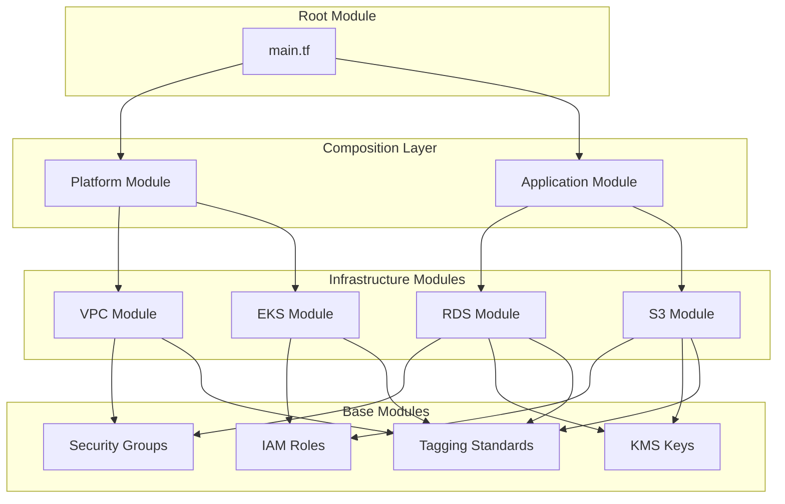
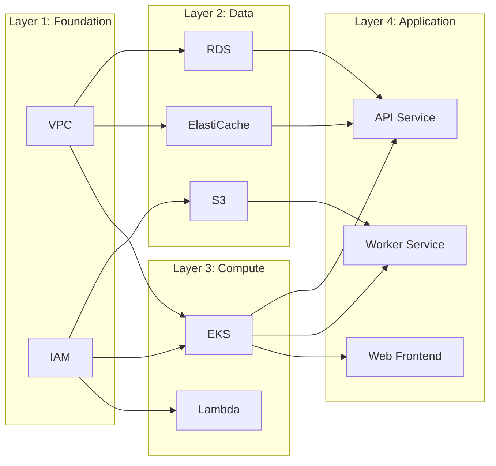
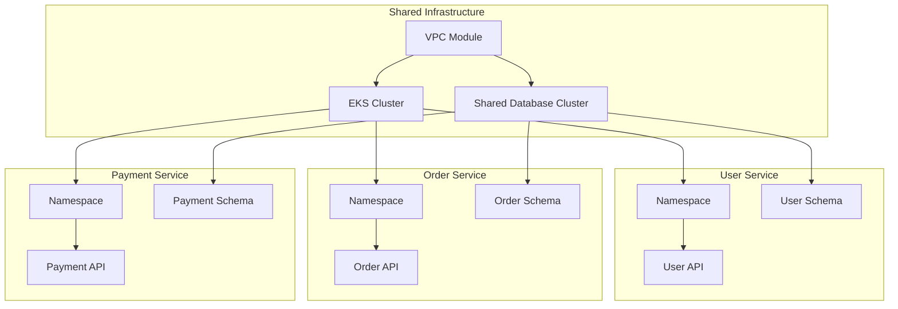
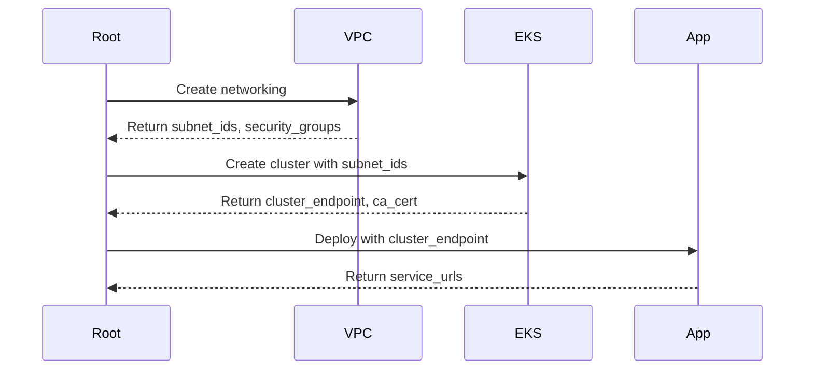
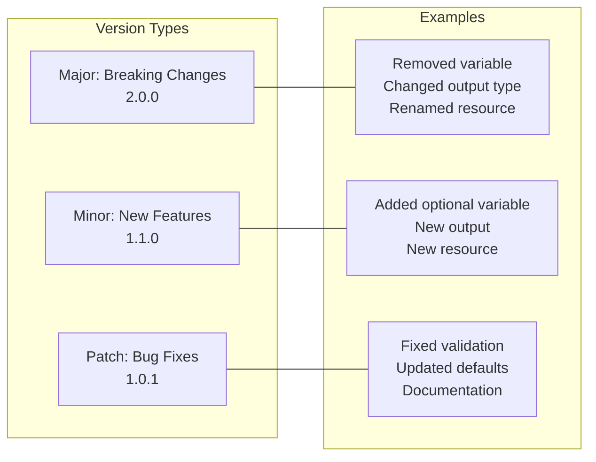

# How to Create Terraform Module Composition

Author: [nawazdhandala](https://github.com/nawazdhandala)

Tags: Terraform, Modules, IaC, Architecture

Description: A comprehensive guide to creating composable Terraform modules that scale with your infrastructure. Learn module design patterns, composition strategies, dependency management, and best practices for building maintainable Infrastructure as Code.

Terraform module composition is the practice of combining smaller, focused modules into larger, more complex infrastructure deployments. Instead of building monolithic modules that handle everything, you create reusable building blocks that can be assembled in different ways to meet various infrastructure requirements. This approach leads to more maintainable, testable, and scalable Infrastructure as Code.

## Why Module Composition Matters

As your infrastructure grows, maintaining large Terraform configurations becomes increasingly difficult. Module composition addresses several critical challenges:

- **Reusability**: Write once, use everywhere. A well-designed VPC module can be used across development, staging, and production environments.
- **Maintainability**: Smaller modules are easier to understand, test, and update.
- **Team Collaboration**: Different teams can own different modules while composing them together.
- **Consistency**: Enforce organizational standards through shared modules.
- **Flexibility**: Compose modules differently for different use cases without duplicating code.

## Module Composition Architecture

Understanding how modules interact is essential for effective composition. Here is a visual representation of a typical module composition architecture:



This layered approach ensures clear separation of concerns and enables teams to work independently on different components.

## Designing Composable Modules

### The Single Responsibility Principle

Each module should do one thing well. Instead of creating a module that provisions an entire application stack, break it down into focused components.

**Anti-pattern: Monolithic Module**

```hcl
# This module does too much
module "application" {
  source = "./modules/monolithic-app"

  # VPC settings
  vpc_cidr = "10.0.0.0/16"

  # Database settings
  db_instance_class = "db.t3.medium"
  db_name           = "myapp"

  # Kubernetes settings
  cluster_version = "1.28"
  node_count      = 3

  # Application settings
  app_image       = "myapp:latest"
  replicas        = 3
}
```

**Better: Composed Modules**

```hcl
# Networking layer
module "vpc" {
  source = "./modules/vpc"

  cidr_block          = "10.0.0.0/16"
  availability_zones  = ["us-east-1a", "us-east-1b", "us-east-1c"]
  environment         = var.environment
}

# Database layer
module "database" {
  source = "./modules/rds"

  instance_class      = "db.t3.medium"
  database_name       = "myapp"
  subnet_ids          = module.vpc.private_subnet_ids
  security_group_ids  = [module.vpc.database_security_group_id]
}

# Compute layer
module "kubernetes" {
  source = "./modules/eks"

  cluster_version     = "1.28"
  subnet_ids          = module.vpc.private_subnet_ids
  node_count          = 3
}

# Application layer
module "application" {
  source = "./modules/k8s-app"

  cluster_endpoint    = module.kubernetes.cluster_endpoint
  image               = "myapp:latest"
  replicas            = 3
  database_url        = module.database.connection_string
}
```

### Module Interface Design

Well-designed module interfaces make composition intuitive. Think of inputs as contracts and outputs as capabilities.

```hcl
# modules/vpc/variables.tf
variable "cidr_block" {
  description = "The CIDR block for the VPC"
  type        = string

  validation {
    condition     = can(cidrhost(var.cidr_block, 0))
    error_message = "Must be a valid CIDR block."
  }
}

variable "availability_zones" {
  description = "List of availability zones for subnet distribution"
  type        = list(string)

  validation {
    condition     = length(var.availability_zones) >= 2
    error_message = "At least 2 availability zones required for high availability."
  }
}

variable "enable_nat_gateway" {
  description = "Enable NAT Gateway for private subnet internet access"
  type        = bool
  default     = true
}

variable "tags" {
  description = "Tags to apply to all resources"
  type        = map(string)
  default     = {}
}
```

```hcl
# modules/vpc/outputs.tf
output "vpc_id" {
  description = "The ID of the VPC"
  value       = aws_vpc.main.id
}

output "public_subnet_ids" {
  description = "List of public subnet IDs"
  value       = aws_subnet.public[*].id
}

output "private_subnet_ids" {
  description = "List of private subnet IDs"
  value       = aws_subnet.private[*].id
}

output "database_subnet_ids" {
  description = "List of database subnet IDs"
  value       = aws_subnet.database[*].id
}

output "nat_gateway_ips" {
  description = "List of NAT Gateway public IPs"
  value       = aws_nat_gateway.main[*].public_ip
}
```

## Composition Patterns

### Pattern 1: Layered Composition

Layered composition organizes modules into tiers, where each layer builds on the one below it.



Implementation:

```hcl
# environments/production/main.tf

# Layer 1: Foundation
module "foundation" {
  source = "../../modules/foundation"

  environment = "production"
  region      = "us-east-1"
}

# Layer 2: Data stores
module "data_layer" {
  source = "../../modules/data-layer"

  vpc_id              = module.foundation.vpc_id
  private_subnet_ids  = module.foundation.private_subnet_ids
  kms_key_arn         = module.foundation.kms_key_arn

  # Database configuration
  rds_config = {
    instance_class    = "db.r6g.xlarge"
    allocated_storage = 100
    multi_az          = true
  }

  # Cache configuration
  redis_config = {
    node_type       = "cache.r6g.large"
    num_cache_nodes = 3
  }
}

# Layer 3: Compute
module "compute_layer" {
  source = "../../modules/compute-layer"

  vpc_id             = module.foundation.vpc_id
  private_subnet_ids = module.foundation.private_subnet_ids

  eks_config = {
    cluster_version = "1.28"
    node_groups = {
      general = {
        instance_types = ["m6i.xlarge"]
        min_size       = 3
        max_size       = 10
        desired_size   = 5
      }
    }
  }
}

# Layer 4: Applications
module "applications" {
  source = "../../modules/applications"

  cluster_endpoint     = module.compute_layer.eks_cluster_endpoint
  cluster_ca_cert      = module.compute_layer.eks_cluster_ca_certificate

  database_url         = module.data_layer.rds_connection_string
  redis_url            = module.data_layer.redis_endpoint

  applications = {
    api = {
      image    = "myorg/api:v2.1.0"
      replicas = 3
      cpu      = "500m"
      memory   = "1Gi"
    }
    worker = {
      image    = "myorg/worker:v2.1.0"
      replicas = 2
      cpu      = "1000m"
      memory   = "2Gi"
    }
  }
}
```

### Pattern 2: Service-Oriented Composition

This pattern treats each service or bounded context as a composition unit.



Implementation:

```hcl
# modules/microservice/main.tf
variable "service_name" {
  description = "Name of the microservice"
  type        = string
}

variable "cluster_config" {
  description = "Kubernetes cluster configuration"
  type = object({
    endpoint    = string
    ca_cert     = string
    token       = string
  })
}

variable "database_config" {
  description = "Database cluster configuration"
  type = object({
    host     = string
    port     = number
    username = string
    password = string
  })
}

variable "service_config" {
  description = "Service deployment configuration"
  type = object({
    image    = string
    replicas = number
    cpu      = string
    memory   = string
    port     = number
  })
}

# Create dedicated namespace
resource "kubernetes_namespace" "service" {
  metadata {
    name = var.service_name
    labels = {
      service = var.service_name
    }
  }
}

# Create dedicated database schema
resource "postgresql_schema" "service" {
  name     = var.service_name
  database = "services"
  owner    = var.service_name
}

# Deploy the service
resource "kubernetes_deployment" "service" {
  metadata {
    name      = var.service_name
    namespace = kubernetes_namespace.service.metadata[0].name
  }

  spec {
    replicas = var.service_config.replicas

    selector {
      match_labels = {
        app = var.service_name
      }
    }

    template {
      metadata {
        labels = {
          app = var.service_name
        }
      }

      spec {
        container {
          name  = var.service_name
          image = var.service_config.image

          resources {
            requests = {
              cpu    = var.service_config.cpu
              memory = var.service_config.memory
            }
            limits = {
              cpu    = var.service_config.cpu
              memory = var.service_config.memory
            }
          }

          env {
            name  = "DATABASE_URL"
            value = "postgresql://${var.database_config.username}:${var.database_config.password}@${var.database_config.host}:${var.database_config.port}/${var.service_name}"
          }

          port {
            container_port = var.service_config.port
          }
        }
      }
    }
  }
}
```

Using the microservice module:

```hcl
# main.tf
locals {
  services = {
    users = {
      image    = "myorg/user-service:v1.2.0"
      replicas = 3
      cpu      = "500m"
      memory   = "512Mi"
      port     = 8080
    }
    orders = {
      image    = "myorg/order-service:v2.0.1"
      replicas = 5
      cpu      = "1000m"
      memory   = "1Gi"
      port     = 8080
    }
    payments = {
      image    = "myorg/payment-service:v1.5.0"
      replicas = 3
      cpu      = "500m"
      memory   = "512Mi"
      port     = 8080
    }
  }
}

module "services" {
  source   = "./modules/microservice"
  for_each = local.services

  service_name = each.key

  cluster_config = {
    endpoint = module.eks.cluster_endpoint
    ca_cert  = module.eks.cluster_ca_certificate
    token    = data.aws_eks_cluster_auth.cluster.token
  }

  database_config = {
    host     = module.rds.endpoint
    port     = 5432
    username = each.key
    password = random_password.db_passwords[each.key].result
  }

  service_config = each.value
}
```

### Pattern 3: Feature Toggle Composition

Enable or disable features through composition rather than conditionals scattered throughout your code.

```hcl
# modules/platform/variables.tf
variable "features" {
  description = "Feature flags for platform capabilities"
  type = object({
    monitoring      = optional(bool, true)
    logging         = optional(bool, true)
    service_mesh    = optional(bool, false)
    secrets_manager = optional(bool, true)
    backup          = optional(bool, true)
  })
  default = {}
}

# modules/platform/main.tf
module "monitoring" {
  source = "../monitoring"
  count  = var.features.monitoring ? 1 : 0

  cluster_endpoint = module.eks.cluster_endpoint
  namespace        = "monitoring"
}

module "logging" {
  source = "../logging"
  count  = var.features.logging ? 1 : 0

  cluster_endpoint = module.eks.cluster_endpoint
  log_retention    = 30
}

module "service_mesh" {
  source = "../istio"
  count  = var.features.service_mesh ? 1 : 0

  cluster_endpoint = module.eks.cluster_endpoint
}

module "secrets" {
  source = "../secrets-manager"
  count  = var.features.secrets_manager ? 1 : 0

  cluster_endpoint = module.eks.cluster_endpoint
  kms_key_arn      = module.kms.key_arn
}

module "backup" {
  source = "../velero"
  count  = var.features.backup ? 1 : 0

  cluster_endpoint = module.eks.cluster_endpoint
  backup_bucket    = module.s3.backup_bucket_name
}
```

Usage:

```hcl
# Development environment - minimal features
module "dev_platform" {
  source = "./modules/platform"

  environment = "development"

  features = {
    monitoring      = true
    logging         = true
    service_mesh    = false
    secrets_manager = false
    backup          = false
  }
}

# Production environment - all features
module "prod_platform" {
  source = "./modules/platform"

  environment = "production"

  features = {
    monitoring      = true
    logging         = true
    service_mesh    = true
    secrets_manager = true
    backup          = true
  }
}
```

## Managing Module Dependencies

### Explicit Dependencies with Outputs

Always pass dependencies through module outputs rather than relying on implicit resource references.



```hcl
# The VPC module exposes what it creates
module "vpc" {
  source = "./modules/vpc"
  cidr_block = "10.0.0.0/16"
}

# EKS explicitly receives VPC outputs
module "eks" {
  source = "./modules/eks"

  # Explicit dependency through variables
  vpc_id     = module.vpc.vpc_id
  subnet_ids = module.vpc.private_subnet_ids

  # This creates an implicit dependency - EKS waits for VPC
}

# Application explicitly receives EKS outputs
module "app" {
  source = "./modules/k8s-app"

  cluster_endpoint = module.eks.cluster_endpoint
  cluster_ca_cert  = module.eks.cluster_ca_certificate

  # Explicit dependency on database too
  database_url = module.rds.connection_string
}
```

### Handling Circular Dependencies

Sometimes modules need information from each other. Break cycles by using data sources or splitting resources.

```hcl
# Anti-pattern: Circular dependency
# Module A needs output from Module B
# Module B needs output from Module A

# Solution: Extract shared resources
module "shared" {
  source = "./modules/shared"
  # Creates security groups, IAM roles, etc.
}

module "module_a" {
  source = "./modules/a"

  security_group_id = module.shared.security_group_a_id
  iam_role_arn      = module.shared.role_a_arn
}

module "module_b" {
  source = "./modules/b"

  security_group_id = module.shared.security_group_b_id
  iam_role_arn      = module.shared.role_b_arn

  # Now can reference module_a outputs safely
  module_a_endpoint = module.module_a.endpoint
}
```

## Testing Composed Modules

### Unit Testing Individual Modules

Test each module in isolation before composing them.

```hcl
# test/vpc_test.go (using Terratest)
package test

import (
    "testing"
    "github.com/gruntwork-io/terratest/modules/terraform"
    "github.com/stretchr/testify/assert"
)

func TestVpcModule(t *testing.T) {
    terraformOptions := terraform.WithDefaultRetryableErrors(t, &terraform.Options{
        TerraformDir: "../modules/vpc",
        Vars: map[string]interface{}{
            "cidr_block":         "10.0.0.0/16",
            "availability_zones": []string{"us-east-1a", "us-east-1b"},
            "environment":        "test",
        },
    })

    defer terraform.Destroy(t, terraformOptions)
    terraform.InitAndApply(t, terraformOptions)

    vpcId := terraform.Output(t, terraformOptions, "vpc_id")
    assert.NotEmpty(t, vpcId)

    publicSubnets := terraform.OutputList(t, terraformOptions, "public_subnet_ids")
    assert.Equal(t, 2, len(publicSubnets))
}
```

### Integration Testing Composed Modules

Test how modules work together.

```hcl
# test/integration/platform_test.tftest.hcl
run "create_platform" {
  command = apply

  variables {
    environment = "test"
    features = {
      monitoring = true
      logging    = true
    }
  }

  assert {
    condition     = module.vpc.vpc_id != ""
    error_message = "VPC should be created"
  }

  assert {
    condition     = module.eks.cluster_status == "ACTIVE"
    error_message = "EKS cluster should be active"
  }

  assert {
    condition     = length(module.monitoring) == 1
    error_message = "Monitoring should be enabled"
  }
}

run "verify_connectivity" {
  command = apply

  module {
    source = "./tests/connectivity"
  }

  variables {
    cluster_endpoint = run.create_platform.eks_cluster_endpoint
    database_host    = run.create_platform.rds_endpoint
  }

  assert {
    condition     = output.cluster_accessible == true
    error_message = "Cluster should be accessible"
  }

  assert {
    condition     = output.database_accessible == true
    error_message = "Database should be accessible"
  }
}
```

## Module Versioning Strategy

### Semantic Versioning for Modules

Use semantic versioning to communicate changes in module interfaces.



### Version Constraints in Composition

```hcl
# Specify version constraints when composing modules
module "vpc" {
  source  = "git::https://github.com/myorg/terraform-modules.git//vpc?ref=v2.1.0"
}

module "eks" {
  source  = "git::https://github.com/myorg/terraform-modules.git//eks?ref=v3.0.0"
}

# Or using a private registry
module "vpc" {
  source  = "app.terraform.io/myorg/vpc/aws"
  version = "~> 2.1"  # Allows 2.1.x but not 2.2.0
}

module "eks" {
  source  = "app.terraform.io/myorg/eks/aws"
  version = ">= 3.0, < 4.0"  # Allows any 3.x version
}
```

## Best Practices for Module Composition

### 1. Design for Composition from the Start

Think about how your module will be used with others before writing code.

```hcl
# Good: Flexible outputs that enable composition
output "vpc_id" {
  value = aws_vpc.main.id
}

output "vpc_cidr" {
  value = aws_vpc.main.cidr_block
}

output "private_subnet_ids" {
  value = aws_subnet.private[*].id
}

output "private_subnet_cidrs" {
  value = aws_subnet.private[*].cidr_block
}

output "private_route_table_ids" {
  value = aws_route_table.private[*].id
}

# Consumers can use what they need
```

### 2. Use Consistent Naming Conventions

```hcl
# Standard variable naming
variable "vpc_id" {}           # Resource reference
variable "enable_logging" {}   # Boolean toggle
variable "log_retention_days" {} # Numeric configuration
variable "tags" {}             # Map of tags

# Standard output naming
output "id" {}                 # Primary resource ID
output "arn" {}                # Resource ARN
output "endpoint" {}           # Connection endpoint
output "security_group_ids" {} # List of security groups
```

### 3. Document Module Interfaces

```hcl
# modules/eks/README.md
/**
 * # EKS Module
 *
 * Creates an Amazon EKS cluster with managed node groups.
 *
 * ## Usage
 *
 * ```hcl
 * module "eks" {
 *   source = "./modules/eks"
 *
 *   cluster_name    = "my-cluster"
 *   cluster_version = "1.28"
 *   vpc_id          = module.vpc.vpc_id
 *   subnet_ids      = module.vpc.private_subnet_ids
 * }
 * ```
 *
 * ## Requirements
 *
 * - VPC with private subnets
 * - At least 2 availability zones
 *
 * ## Outputs
 *
 * This module outputs cluster connection details for use
 * with application deployment modules.
 */
```

### 4. Handle Defaults Thoughtfully

```hcl
# Provide sensible defaults but allow override
variable "node_groups" {
  description = "Configuration for EKS node groups"
  type = map(object({
    instance_types = list(string)
    min_size       = number
    max_size       = number
    desired_size   = number
    disk_size      = optional(number, 50)
    labels         = optional(map(string), {})
    taints = optional(list(object({
      key    = string
      value  = string
      effect = string
    })), [])
  }))

  default = {
    default = {
      instance_types = ["t3.medium"]
      min_size       = 1
      max_size       = 3
      desired_size   = 2
    }
  }
}
```

### 5. Implement Proper Error Handling

```hcl
# Validate inputs early
variable "environment" {
  description = "Deployment environment"
  type        = string

  validation {
    condition     = contains(["development", "staging", "production"], var.environment)
    error_message = "Environment must be development, staging, or production."
  }
}

# Use preconditions for runtime checks
resource "aws_instance" "app" {
  ami           = var.ami_id
  instance_type = var.instance_type
  subnet_id     = var.subnet_id

  lifecycle {
    precondition {
      condition     = data.aws_ami.selected.architecture == "x86_64"
      error_message = "The selected AMI must use x86_64 architecture."
    }
  }
}

# Use postconditions to verify results
resource "aws_eks_cluster" "main" {
  name     = var.cluster_name
  role_arn = aws_iam_role.cluster.arn
  version  = var.cluster_version

  vpc_config {
    subnet_ids = var.subnet_ids
  }

  lifecycle {
    postcondition {
      condition     = self.status == "ACTIVE"
      error_message = "EKS cluster failed to reach ACTIVE status."
    }
  }
}
```

## Real-World Example: Complete Platform Composition

Here is a complete example showing how all these concepts come together:

```hcl
# environments/production/main.tf

terraform {
  required_version = ">= 1.5.0"

  required_providers {
    aws = {
      source  = "hashicorp/aws"
      version = "~> 5.0"
    }
    kubernetes = {
      source  = "hashicorp/kubernetes"
      version = "~> 2.23"
    }
  }

  backend "s3" {
    bucket         = "myorg-terraform-state"
    key            = "production/platform.tfstate"
    region         = "us-east-1"
    dynamodb_table = "terraform-locks"
    encrypt        = true
  }
}

locals {
  environment = "production"
  region      = "us-east-1"

  common_tags = {
    Environment = local.environment
    ManagedBy   = "terraform"
    Project     = "platform"
  }
}

# Foundation Layer
module "foundation" {
  source = "../../modules/foundation"

  environment        = local.environment
  region             = local.region
  vpc_cidr           = "10.0.0.0/16"
  availability_zones = ["us-east-1a", "us-east-1b", "us-east-1c"]

  tags = local.common_tags
}

# Data Layer
module "data" {
  source = "../../modules/data-layer"

  environment = local.environment
  vpc_id      = module.foundation.vpc_id
  subnet_ids  = module.foundation.database_subnet_ids
  kms_key_arn = module.foundation.kms_key_arn

  rds_config = {
    instance_class     = "db.r6g.xlarge"
    allocated_storage  = 100
    engine_version     = "15.4"
    multi_az           = true
    backup_retention   = 30
  }

  redis_config = {
    node_type                  = "cache.r6g.large"
    num_cache_clusters         = 3
    automatic_failover_enabled = true
  }

  tags = local.common_tags
}

# Compute Layer
module "compute" {
  source = "../../modules/compute-layer"

  environment = local.environment
  vpc_id      = module.foundation.vpc_id
  subnet_ids  = module.foundation.private_subnet_ids

  eks_config = {
    cluster_version = "1.28"

    node_groups = {
      general = {
        instance_types = ["m6i.xlarge"]
        min_size       = 3
        max_size       = 20
        desired_size   = 5
        labels = {
          workload = "general"
        }
      }
      memory_optimized = {
        instance_types = ["r6i.xlarge"]
        min_size       = 2
        max_size       = 10
        desired_size   = 3
        labels = {
          workload = "memory-intensive"
        }
        taints = [{
          key    = "workload"
          value  = "memory-intensive"
          effect = "NoSchedule"
        }]
      }
    }
  }

  tags = local.common_tags
}

# Platform Services Layer
module "platform_services" {
  source = "../../modules/platform-services"

  cluster_endpoint = module.compute.eks_cluster_endpoint
  cluster_ca_cert  = module.compute.eks_cluster_ca_certificate
  oidc_provider    = module.compute.eks_oidc_provider

  features = {
    monitoring = {
      enabled         = true
      retention_days  = 30
      alertmanager    = true
    }
    logging = {
      enabled        = true
      retention_days = 14
    }
    service_mesh = {
      enabled = true
      mtls    = true
    }
    ingress = {
      enabled     = true
      class       = "nginx"
      ssl_enabled = true
    }
  }

  tags = local.common_tags
}

# Application Layer
module "applications" {
  source   = "../../modules/application"
  for_each = var.applications

  name             = each.key
  cluster_endpoint = module.compute.eks_cluster_endpoint
  cluster_ca_cert  = module.compute.eks_cluster_ca_certificate

  config = {
    image    = each.value.image
    replicas = each.value.replicas

    resources = {
      cpu    = each.value.cpu
      memory = each.value.memory
    }

    environment = merge(
      {
        DATABASE_URL = module.data.rds_connection_string
        REDIS_URL    = module.data.redis_endpoint
      },
      each.value.environment
    )

    ingress = each.value.ingress
  }

  tags = local.common_tags

  depends_on = [module.platform_services]
}

# Outputs for downstream consumers
output "vpc_id" {
  description = "VPC ID for the platform"
  value       = module.foundation.vpc_id
}

output "eks_cluster_endpoint" {
  description = "EKS cluster endpoint"
  value       = module.compute.eks_cluster_endpoint
}

output "application_endpoints" {
  description = "Application ingress endpoints"
  value = {
    for name, app in module.applications : name => app.ingress_endpoint
  }
}
```

## Conclusion

Terraform module composition is a powerful technique for building maintainable, scalable infrastructure. By following these patterns and best practices, you can:

- **Reduce complexity** by breaking down infrastructure into manageable pieces
- **Increase reusability** across environments and projects
- **Improve collaboration** by enabling teams to own specific modules
- **Ensure consistency** through standardized, tested building blocks
- **Enable flexibility** by composing modules differently for different needs

Start small with well-defined module boundaries, document your interfaces clearly, and iterate based on how your infrastructure evolves. The investment in proper module composition pays dividends as your infrastructure grows in complexity and scale.

---

*Looking to implement Infrastructure as Code for your observability stack? Check out the [OneUptime Terraform Provider](https://registry.terraform.io/providers/oneuptime/oneuptime) to manage your monitoring infrastructure using the same module composition patterns discussed in this article.*

**Related Reading:**

- [Introducing the OneUptime Terraform Provider](https://oneuptime.com/blog/post/introducing-terraform-provider-for-oneuptime/view)
- [The Five Stages of SRE Maturity](https://oneuptime.com/blog/post/the-five-stages-of-sre-maturity/view)
- [SRE Best Practices](https://oneuptime.com/blog/post/sre-best-practices/view)
