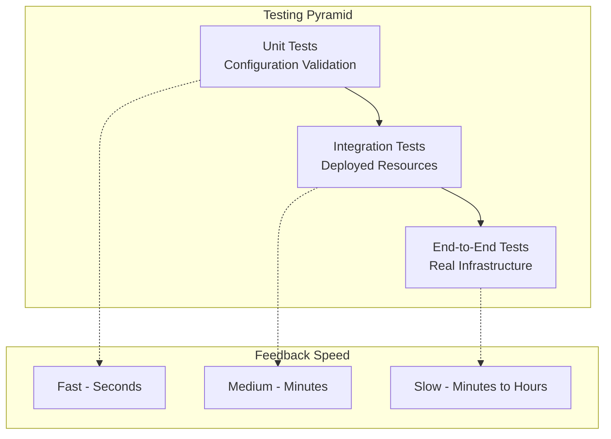
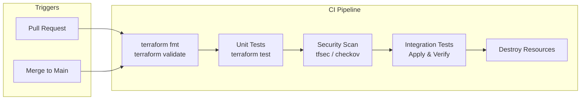

# How to Build Terraform Module Testing

Author: [nawazdhandala](https://github.com/nawazdhandala)

Tags: Terraform, Testing, Modules, IaC

Description: A practical guide to testing Terraform modules using the native test framework and Terratest, covering unit tests, integration tests, and test fixtures.

---

Testing infrastructure code is often overlooked, but untested Terraform modules can cause outages and configuration drift. This guide walks through building a testing strategy for your Terraform modules using both the native Terraform test framework and Terratest.

## Why Test Terraform Modules?

Terraform modules grow in complexity over time. Without tests, you risk:

- Breaking changes when updating provider versions
- Regression bugs in module logic
- Configuration drift between environments
- Unexpected resource deletions or modifications

A solid testing strategy catches these issues before they hit production.

## Testing Pyramid for Terraform



## Project Structure

Before diving into tests, organize your module with a standard structure:

```
modules/
└── aws-vpc/
    ├── main.tf
    ├── variables.tf
    ├── outputs.tf
    ├── versions.tf
    ├── README.md
    ├── tests/
    │   ├── setup/
    │   │   └── main.tf
    │   ├── unit_tests.tftest.hcl
    │   └── integration_tests.tftest.hcl
    └── examples/
        └── complete/
            ├── main.tf
            └── terraform.tfvars
```

## Native Terraform Test Framework

Terraform 1.6+ includes a built-in test framework. Tests use the `.tftest.hcl` extension and run with `terraform test`.

### Basic Test Structure

Create `tests/unit_tests.tftest.hcl`:

```hcl
# tests/unit_tests.tftest.hcl

# Variables for testing
variables {
  vpc_name   = "test-vpc"
  cidr_block = "10.0.0.0/16"
  azs        = ["us-east-1a", "us-east-1b"]
}

# Test that plan succeeds with valid inputs
run "valid_vpc_configuration" {
  command = plan

  assert {
    condition     = aws_vpc.main.cidr_block == "10.0.0.0/16"
    error_message = "VPC CIDR block does not match expected value"
  }

  assert {
    condition     = aws_vpc.main.tags["Name"] == "test-vpc"
    error_message = "VPC name tag does not match expected value"
  }
}

# Test that subnet count matches AZ count
run "subnet_count_matches_azs" {
  command = plan

  assert {
    condition     = length(aws_subnet.private) == 2
    error_message = "Private subnet count should match number of AZs"
  }

  assert {
    condition     = length(aws_subnet.public) == 2
    error_message = "Public subnet count should match number of AZs"
  }
}
```

### Testing Variable Validation

Test that your variable validations work correctly:

```hcl
# tests/validation_tests.tftest.hcl

# Test invalid CIDR block is rejected
run "invalid_cidr_rejected" {
  command = plan

  variables {
    vpc_name   = "test-vpc"
    cidr_block = "invalid-cidr"
    azs        = ["us-east-1a"]
  }

  expect_failures = [
    var.cidr_block,
  ]
}

# Test empty VPC name is rejected
run "empty_name_rejected" {
  command = plan

  variables {
    vpc_name   = ""
    cidr_block = "10.0.0.0/16"
    azs        = ["us-east-1a"]
  }

  expect_failures = [
    var.vpc_name,
  ]
}

# Test minimum AZ requirement
run "minimum_az_requirement" {
  command = plan

  variables {
    vpc_name   = "test-vpc"
    cidr_block = "10.0.0.0/16"
    azs        = []
  }

  expect_failures = [
    var.azs,
  ]
}
```

### Using Test Fixtures (Setup Modules)

For tests that need supporting resources, use setup modules:

```hcl
# tests/setup/main.tf

terraform {
  required_providers {
    aws = {
      source  = "hashicorp/aws"
      version = "~> 5.0"
    }
  }
}

provider "aws" {
  region = "us-east-1"
}

# Create resources needed by tests
resource "aws_kms_key" "test" {
  description             = "Test KMS key for VPC flow logs"
  deletion_window_in_days = 7
}

output "kms_key_arn" {
  value = aws_kms_key.test.arn
}
```

Reference the setup in your tests:

```hcl
# tests/integration_tests.tftest.hcl

run "setup" {
  module {
    source = "./tests/setup"
  }
}

run "vpc_with_encryption" {
  command = apply

  variables {
    vpc_name           = "encrypted-vpc"
    cidr_block         = "10.0.0.0/16"
    azs                = ["us-east-1a", "us-east-1b"]
    flow_log_kms_key   = run.setup.kms_key_arn
  }

  assert {
    condition     = aws_flow_log.main.log_destination != null
    error_message = "Flow log should be configured"
  }
}
```

### Running Native Tests

```bash
# Run all tests
terraform test

# Run specific test file
terraform test -filter=tests/unit_tests.tftest.hcl

# Verbose output
terraform test -verbose

# Run tests with specific variables file
terraform test -var-file=testing.tfvars
```

## Testing Pipeline



## Terratest for Advanced Testing

Terratest is a Go library that provides more flexibility for complex testing scenarios. It is particularly useful when you need to verify actual deployed infrastructure.

### Setting Up Terratest

Create a Go module for your tests:

```bash
cd modules/aws-vpc/test
go mod init github.com/myorg/terraform-modules/modules/aws-vpc/test
go get github.com/gruntwork-io/terratest/modules/terraform
go get github.com/stretchr/testify/assert
```

### Basic Terratest Example

```go
// test/vpc_test.go
package test

import (
    "testing"

    "github.com/gruntwork-io/terratest/modules/terraform"
    "github.com/stretchr/testify/assert"
)

func TestVpcCreation(t *testing.T) {
    t.Parallel()

    terraformOptions := terraform.WithDefaultRetryableErrors(t, &terraform.Options{
        TerraformDir: "../examples/complete",
        Vars: map[string]interface{}{
            "vpc_name":   "terratest-vpc",
            "cidr_block": "10.0.0.0/16",
            "azs":        []string{"us-east-1a", "us-east-1b"},
        },
    })

    // Clean up resources after test
    defer terraform.Destroy(t, terraformOptions)

    // Deploy the infrastructure
    terraform.InitAndApply(t, terraformOptions)

    // Get outputs
    vpcId := terraform.Output(t, terraformOptions, "vpc_id")
    privateSubnetIds := terraform.OutputList(t, terraformOptions, "private_subnet_ids")
    publicSubnetIds := terraform.OutputList(t, terraformOptions, "public_subnet_ids")

    // Verify outputs
    assert.NotEmpty(t, vpcId)
    assert.Equal(t, 2, len(privateSubnetIds))
    assert.Equal(t, 2, len(publicSubnetIds))
}
```

### Testing with AWS SDK

Verify resources using AWS APIs:

```go
// test/vpc_integration_test.go
package test

import (
    "testing"

    "github.com/aws/aws-sdk-go/aws"
    "github.com/aws/aws-sdk-go/aws/session"
    "github.com/aws/aws-sdk-go/service/ec2"
    "github.com/gruntwork-io/terratest/modules/terraform"
    "github.com/stretchr/testify/assert"
    "github.com/stretchr/testify/require"
)

func TestVpcConfiguration(t *testing.T) {
    t.Parallel()

    terraformOptions := terraform.WithDefaultRetryableErrors(t, &terraform.Options{
        TerraformDir: "../examples/complete",
        Vars: map[string]interface{}{
            "vpc_name":         "integration-test-vpc",
            "cidr_block":       "10.0.0.0/16",
            "azs":              []string{"us-east-1a", "us-east-1b"},
            "enable_dns_hostnames": true,
            "enable_nat_gateway":   true,
        },
    })

    defer terraform.Destroy(t, terraformOptions)
    terraform.InitAndApply(t, terraformOptions)

    vpcId := terraform.Output(t, terraformOptions, "vpc_id")

    // Create AWS session
    sess, err := session.NewSession(&aws.Config{
        Region: aws.String("us-east-1"),
    })
    require.NoError(t, err)

    ec2Client := ec2.New(sess)

    // Verify VPC attributes
    vpcOutput, err := ec2Client.DescribeVpcs(&ec2.DescribeVpcsInput{
        VpcIds: []*string{aws.String(vpcId)},
    })
    require.NoError(t, err)
    require.Len(t, vpcOutput.Vpcs, 1)

    vpc := vpcOutput.Vpcs[0]
    assert.Equal(t, "10.0.0.0/16", *vpc.CidrBlock)
    assert.True(t, *vpc.EnableDnsHostnames)
    assert.True(t, *vpc.EnableDnsSupport)

    // Verify NAT Gateway exists
    natOutput, err := ec2Client.DescribeNatGateways(&ec2.DescribeNatGatewaysInput{
        Filter: []*ec2.Filter{
            {
                Name:   aws.String("vpc-id"),
                Values: []*string{aws.String(vpcId)},
            },
            {
                Name:   aws.String("state"),
                Values: []*string{aws.String("available")},
            },
        },
    })
    require.NoError(t, err)
    assert.GreaterOrEqual(t, len(natOutput.NatGateways), 1)
}
```

### Testing Module Upgrades

Test that module upgrades do not cause unexpected changes:

```go
// test/upgrade_test.go
package test

import (
    "testing"

    "github.com/gruntwork-io/terratest/modules/terraform"
    "github.com/stretchr/testify/assert"
)

func TestModuleUpgrade(t *testing.T) {
    t.Parallel()

    terraformOptions := terraform.WithDefaultRetryableErrors(t, &terraform.Options{
        TerraformDir: "../examples/complete",
        Vars: map[string]interface{}{
            "vpc_name":   "upgrade-test-vpc",
            "cidr_block": "10.0.0.0/16",
            "azs":        []string{"us-east-1a"},
        },
    })

    defer terraform.Destroy(t, terraformOptions)

    // Initial apply
    terraform.InitAndApply(t, terraformOptions)

    // Run plan again - should show no changes
    exitCode := terraform.PlanExitCode(t, terraformOptions)

    // Exit code 0 = no changes, 2 = changes present
    assert.Equal(t, 0, exitCode, "Re-running plan should show no changes (idempotency check)")
}
```

### Table-Driven Tests

Test multiple configurations efficiently:

```go
// test/vpc_variants_test.go
package test

import (
    "fmt"
    "testing"

    "github.com/gruntwork-io/terratest/modules/terraform"
    "github.com/stretchr/testify/assert"
)

func TestVpcVariants(t *testing.T) {
    t.Parallel()

    testCases := []struct {
        name           string
        cidrBlock      string
        azCount        int
        enableNat      bool
        expectedSubnets int
    }{
        {"single-az", "10.0.0.0/16", 1, false, 2},
        {"multi-az", "10.1.0.0/16", 3, false, 6},
        {"with-nat", "10.2.0.0/16", 2, true, 4},
    }

    for _, tc := range testCases {
        tc := tc // capture range variable

        t.Run(tc.name, func(t *testing.T) {
            t.Parallel()

            azs := make([]string, tc.azCount)
            for i := 0; i < tc.azCount; i++ {
                azs[i] = fmt.Sprintf("us-east-1%c", 'a'+i)
            }

            terraformOptions := terraform.WithDefaultRetryableErrors(t, &terraform.Options{
                TerraformDir: "../examples/complete",
                Vars: map[string]interface{}{
                    "vpc_name":           fmt.Sprintf("test-%s", tc.name),
                    "cidr_block":         tc.cidrBlock,
                    "azs":                azs,
                    "enable_nat_gateway": tc.enableNat,
                },
            })

            defer terraform.Destroy(t, terraformOptions)
            terraform.InitAndApply(t, terraformOptions)

            allSubnets := terraform.OutputList(t, terraformOptions, "all_subnet_ids")
            assert.Equal(t, tc.expectedSubnets, len(allSubnets))
        })
    }
}
```

### Running Terratest

```bash
# Run all tests
go test -v -timeout 30m

# Run specific test
go test -v -timeout 30m -run TestVpcCreation

# Run tests in parallel (default)
go test -v -timeout 30m -parallel 4

# Skip destroy for debugging
SKIP_terraform_destroy=true go test -v -timeout 30m
```

## CI/CD Integration

### GitHub Actions Workflow

```yaml
# .github/workflows/terraform-test.yml
name: Terraform Module Tests

on:
  pull_request:
    paths:
      - 'modules/**'
  push:
    branches:
      - main
    paths:
      - 'modules/**'

jobs:
  lint:
    runs-on: ubuntu-latest
    steps:
      - uses: actions/checkout@v4

      - name: Setup Terraform
        uses: hashicorp/setup-terraform@v3
        with:
          terraform_version: 1.7.0

      - name: Terraform Format Check
        run: terraform fmt -check -recursive modules/

      - name: Terraform Validate
        run: |
          for dir in modules/*/; do
            echo "Validating $dir"
            terraform -chdir="$dir" init -backend=false
            terraform -chdir="$dir" validate
          done

  unit-tests:
    runs-on: ubuntu-latest
    needs: lint
    steps:
      - uses: actions/checkout@v4

      - name: Setup Terraform
        uses: hashicorp/setup-terraform@v3
        with:
          terraform_version: 1.7.0

      - name: Run Unit Tests
        run: |
          for dir in modules/*/; do
            if [ -d "${dir}tests" ]; then
              echo "Testing $dir"
              terraform -chdir="$dir" init -backend=false
              terraform -chdir="$dir" test
            fi
          done

  security-scan:
    runs-on: ubuntu-latest
    needs: lint
    steps:
      - uses: actions/checkout@v4

      - name: Run tfsec
        uses: aquasecurity/tfsec-action@v1.0.0
        with:
          working_directory: modules/

      - name: Run Checkov
        uses: bridgecrewio/checkov-action@v12
        with:
          directory: modules/
          framework: terraform

  integration-tests:
    runs-on: ubuntu-latest
    needs: [unit-tests, security-scan]
    if: github.event_name == 'push' && github.ref == 'refs/heads/main'
    steps:
      - uses: actions/checkout@v4

      - name: Configure AWS Credentials
        uses: aws-actions/configure-aws-credentials@v4
        with:
          aws-access-key-id: ${{ secrets.AWS_ACCESS_KEY_ID }}
          aws-secret-access-key: ${{ secrets.AWS_SECRET_ACCESS_KEY }}
          aws-region: us-east-1

      - name: Setup Go
        uses: actions/setup-go@v5
        with:
          go-version: '1.21'

      - name: Setup Terraform
        uses: hashicorp/setup-terraform@v3
        with:
          terraform_version: 1.7.0
          terraform_wrapper: false

      - name: Run Integration Tests
        run: |
          cd modules/aws-vpc/test
          go test -v -timeout 60m
```

## Best Practices

### 1. Use Unique Resource Names

Prevent naming collisions in shared test accounts:

```go
import "github.com/gruntwork-io/terratest/modules/random"

uniqueId := random.UniqueId()
vpcName := fmt.Sprintf("test-vpc-%s", uniqueId)
```

### 2. Implement Proper Cleanup

Always destroy resources, even on test failure:

```go
defer terraform.Destroy(t, terraformOptions)
```

### 3. Use Timeouts Appropriately

Some resources take time to provision:

```go
import "github.com/gruntwork-io/terratest/modules/retry"

retry.DoWithRetry(t, "Wait for NAT Gateway", 10, 30*time.Second, func() (string, error) {
    // Check NAT Gateway status
    return "", nil
})
```

### 4. Isolate Test Environments

Use separate AWS accounts or regions for testing:

```hcl
provider "aws" {
  region = "us-west-2"  # Different from production

  default_tags {
    tags = {
      Environment = "test"
      ManagedBy   = "terratest"
    }
  }
}
```

### 5. Test Edge Cases

Do not just test the happy path:

```hcl
# Test behavior with maximum values
run "max_az_configuration" {
  command = plan

  variables {
    vpc_name   = "max-az-vpc"
    cidr_block = "10.0.0.0/16"
    azs        = ["us-east-1a", "us-east-1b", "us-east-1c", "us-east-1d", "us-east-1e", "us-east-1f"]
  }

  assert {
    condition     = length(aws_subnet.private) == 6
    error_message = "Should support up to 6 AZs"
  }
}
```

### 6. Document Test Requirements

Add a test README explaining prerequisites:

```markdown
# Test Requirements

## AWS Credentials
Tests require AWS credentials with permissions to create:
- VPCs and subnets
- Internet Gateways
- NAT Gateways
- Route tables

## Environment Variables
- `AWS_ACCESS_KEY_ID`
- `AWS_SECRET_ACCESS_KEY`
- `AWS_REGION` (defaults to us-east-1)

## Running Tests
```bash
go test -v -timeout 60m
```
```

## Comparing Test Approaches

| Feature | Native Terraform Test | Terratest |
|---------|----------------------|-----------|
| Setup Required | None | Go environment |
| Language | HCL | Go |
| AWS API Access | No | Yes |
| Custom Assertions | Limited | Full flexibility |
| Parallel Execution | Built-in | Built-in |
| CI Integration | Simple | Requires Go |
| Best For | Validation, simple checks | Complex integration tests |

## Conclusion

Testing Terraform modules requires a layered approach. Use native Terraform tests for quick validation and configuration checks. Add Terratest when you need to verify actual deployed infrastructure or require complex test logic. Integrate both into your CI/CD pipeline to catch issues early.

Start with unit tests that run in seconds, then add integration tests for critical modules. The investment in testing pays off when you can update modules with confidence.

---

**Related Reading:**

- [Introducing the OneUptime Terraform Provider: Infrastructure as Code for Complete Observability](https://oneuptime.com/blog/post/2025-07-01-introducing-terraform-provider-for-oneuptime/view)
- [Kubernetes and GitOps with ArgoCD](https://oneuptime.com/blog/post/2026-01-06-kubernetes-gitops-argocd/view)
- [SRE Best Practices](https://oneuptime.com/blog/post/2025-11-28-sre-best-practices/view)
