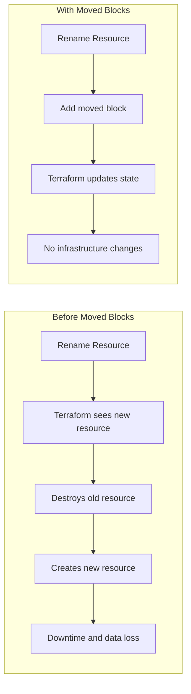
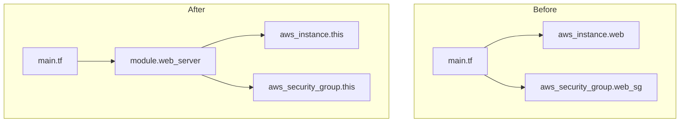
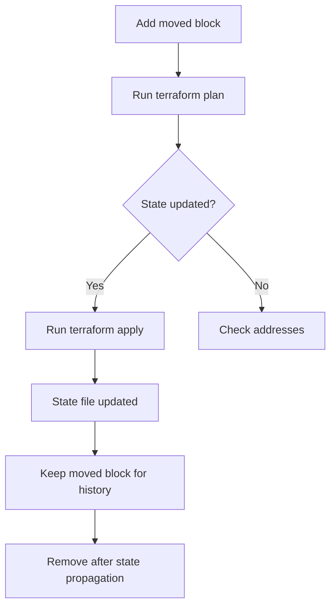
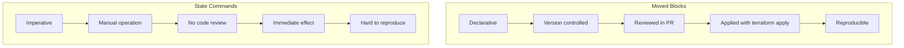

# How to Build Terraform Moved Blocks

Author: [nawazdhandala](https://github.com/nawazdhandala)

Tags: Terraform, IaC, Refactoring, State

Description: Learn how to use Terraform moved blocks to safely rename and reorganize resources without destroying and recreating infrastructure.

---

Refactoring Terraform code used to be terrifying. Rename a resource, and Terraform wants to destroy the old one and create a new one. Move a resource into a module, and you face the same problem. Terraform moved blocks solve this by telling Terraform that a resource has been relocated, not replaced. This guide covers everything you need to know about moved blocks.

## What Are Moved Blocks?



A moved block declares that a resource has been renamed or relocated. Terraform reads this declaration and updates the state file accordingly, without modifying actual infrastructure.

## Basic Syntax

The moved block has a simple structure. Specify the old address and the new address.

```hcl
moved {
  from = aws_instance.old_name
  to   = aws_instance.new_name
}
```

When Terraform runs, it finds the resource at `aws_instance.old_name` in the state file and updates the address to `aws_instance.new_name`. The EC2 instance remains untouched.

## Renaming a Resource

This is the most common use case. You have a poorly named resource and want to fix it.

Before the rename, your configuration looks like this.

```hcl
resource "aws_s3_bucket" "bucket" {
  bucket = "my-application-data"
}
```

You want to rename it to something more descriptive.

```hcl
resource "aws_s3_bucket" "application_data" {
  bucket = "my-application-data"
}

moved {
  from = aws_s3_bucket.bucket
  to   = aws_s3_bucket.application_data
}
```

Run `terraform plan` and Terraform shows that it will update the state, not recreate the bucket.

```bash
Terraform will perform the following actions:

  # aws_s3_bucket.bucket has moved to aws_s3_bucket.application_data
    resource "aws_s3_bucket" "application_data" {
        id     = "my-application-data"
        bucket = "my-application-data"
        # (other attributes unchanged)
    }

Plan: 0 to add, 0 to change, 0 to destroy.
```

## Moving Resources Into Modules

Moving resources into modules is where moved blocks really shine. This operation used to require manual state manipulation with `terraform state mv`.



Start with resources in your root module.

```hcl
# main.tf (before)
resource "aws_instance" "web" {
  ami           = "ami-0c55b159cbfafe1f0"
  instance_type = "t3.micro"
}

resource "aws_security_group" "web_sg" {
  name = "web-server-sg"
}
```

Create a module and move the resources.

```hcl
# modules/web_server/main.tf
resource "aws_instance" "this" {
  ami           = var.ami_id
  instance_type = var.instance_type
}

resource "aws_security_group" "this" {
  name = var.sg_name
}
```

Update your root module to use the new module and add moved blocks.

```hcl
# main.tf (after)
module "web_server" {
  source = "./modules/web_server"

  ami_id        = "ami-0c55b159cbfafe1f0"
  instance_type = "t3.micro"
  sg_name       = "web-server-sg"
}

moved {
  from = aws_instance.web
  to   = module.web_server.aws_instance.this
}

moved {
  from = aws_security_group.web_sg
  to   = module.web_server.aws_security_group.this
}
```

## Moving Resources Out of Modules

The reverse operation works the same way.

```hcl
# Moving from module back to root
moved {
  from = module.database.aws_rds_cluster.this
  to   = aws_rds_cluster.production
}
```

## Moving Between Modules

You can move resources from one module to another.

```hcl
moved {
  from = module.old_module.aws_instance.server
  to   = module.new_module.aws_instance.server
}
```

## Handling Count and For Each

When resources use `count` or `for_each`, you need to specify the index or key.

### Moving Indexed Resources

Moving a specific instance from a counted resource.

```hcl
moved {
  from = aws_instance.web[0]
  to   = aws_instance.web_primary
}

moved {
  from = aws_instance.web[1]
  to   = aws_instance.web_secondary
}
```

### Converting Count to For Each

This is a common refactoring pattern. Convert from count-based indexing to meaningful keys.

Before the refactor.

```hcl
resource "aws_subnet" "private" {
  count             = 3
  vpc_id            = aws_vpc.main.id
  cidr_block        = cidrsubnet(var.vpc_cidr, 8, count.index)
  availability_zone = data.aws_availability_zones.available.names[count.index]
}
```

After the refactor with for_each.

```hcl
locals {
  availability_zones = {
    "us-east-1a" = 0
    "us-east-1b" = 1
    "us-east-1c" = 2
  }
}

resource "aws_subnet" "private" {
  for_each          = local.availability_zones
  vpc_id            = aws_vpc.main.id
  cidr_block        = cidrsubnet(var.vpc_cidr, 8, each.value)
  availability_zone = each.key
}

moved {
  from = aws_subnet.private[0]
  to   = aws_subnet.private["us-east-1a"]
}

moved {
  from = aws_subnet.private[1]
  to   = aws_subnet.private["us-east-1b"]
}

moved {
  from = aws_subnet.private[2]
  to   = aws_subnet.private["us-east-1c"]
}
```

## Moved Blocks Lifecycle



Moved blocks serve as documentation even after they have been applied. Keep them in your codebase for a few release cycles so that all state files across environments get updated. Then remove them to keep your configuration clean.

## Chaining Moved Blocks

Terraform supports chaining moved blocks. If you rename a resource multiple times, you can declare the full history.

```hcl
# First rename
moved {
  from = aws_instance.server
  to   = aws_instance.web_server
}

# Second rename
moved {
  from = aws_instance.web_server
  to   = aws_instance.application_server
}
```

Terraform follows the chain and correctly maps `aws_instance.server` to `aws_instance.application_server`.

## Moving Module Instances

When a module uses `count` or `for_each`, you can move entire module instances.

```hcl
moved {
  from = module.vpc[0]
  to   = module.vpc["production"]
}
```

All resources within the module instance are moved together.

## Common Patterns

### Splitting a Monolith

Break a large configuration into smaller modules.

```hcl
# Move networking resources
moved {
  from = aws_vpc.main
  to   = module.networking.aws_vpc.this
}

moved {
  from = aws_subnet.public
  to   = module.networking.aws_subnet.public
}

# Move compute resources
moved {
  from = aws_instance.app
  to   = module.compute.aws_instance.app
}

moved {
  from = aws_autoscaling_group.app
  to   = module.compute.aws_autoscaling_group.this
}

# Move database resources
moved {
  from = aws_rds_instance.main
  to   = module.database.aws_rds_instance.this
}
```

### Standardizing Resource Names

Enforce naming conventions across your codebase.

```hcl
moved {
  from = aws_iam_role.LambdaExecutionRole
  to   = aws_iam_role.lambda_execution
}

moved {
  from = aws_lambda_function.MyFunction
  to   = aws_lambda_function.processor
}
```

### Reorganizing by Environment

Move from flat structure to environment-specific modules.

```hcl
moved {
  from = aws_instance.prod_web
  to   = module.production.aws_instance.web
}

moved {
  from = aws_instance.staging_web
  to   = module.staging.aws_instance.web
}
```

## Validation and Safety

Terraform validates moved blocks before applying changes.

### Address Validation

Terraform checks that the `from` address exists in state and the `to` address matches your configuration.

```bash
Error: Moved object still exists

  on main.tf line 15:
  15: moved {
  16:   from = aws_instance.old
  17:   to   = aws_instance.new
  18: }

The resource aws_instance.old is still declared in configuration.
Remove it before using a moved block.
```

### Cycle Detection

Terraform detects circular moves.

```hcl
# This will fail
moved {
  from = aws_instance.a
  to   = aws_instance.b
}

moved {
  from = aws_instance.b
  to   = aws_instance.a
}
```

### Duplicate Detection

Terraform ensures each resource has exactly one move path.

```hcl
# This will fail - cannot move to same destination
moved {
  from = aws_instance.old_a
  to   = aws_instance.new
}

moved {
  from = aws_instance.old_b
  to   = aws_instance.new
}
```

## Best Practices

### Always Run Plan First

Before applying, verify that Terraform shows the expected state changes and no infrastructure modifications.

```bash
terraform plan -out=tfplan
# Review the plan carefully
terraform apply tfplan
```

### Test in Non-Production First

Apply moved blocks to development or staging environments before production. Verify that applications still function correctly.

### Keep Moved Blocks Temporarily

Do not remove moved blocks immediately after applying. Keep them until all workspaces and environments have been updated.

```hcl
# TODO: Remove after 2026-03-01 when all environments updated
moved {
  from = aws_instance.web
  to   = aws_instance.application
}
```

### Document the Refactor

Add comments explaining why resources were moved.

```hcl
# Moved to new module structure for better organization
# See ADR-0042 for details
moved {
  from = aws_rds_instance.main
  to   = module.database.aws_rds_instance.primary
}
```

### Version Control the Changes

Commit moved blocks in the same PR as the resource changes. This creates a clear history of the refactoring.

## Troubleshooting

### Resource Not Found in State

If Terraform cannot find the source address, check your state file.

```bash
terraform state list | grep aws_instance
```

### State File Locked

Ensure no other Terraform operations are running.

```bash
terraform force-unlock <lock-id>
```

### Module Path Syntax

Module paths use dots, not slashes.

```hcl
# Correct
moved {
  from = module.vpc.aws_subnet.private
  to   = module.networking.aws_subnet.private
}

# Incorrect
moved {
  from = module/vpc/aws_subnet.private
  to   = module/networking/aws_subnet.private
}
```

## Comparison with State Commands



Moved blocks are declarative and tracked in version control. State commands like `terraform state mv` are imperative and operate directly on state. Prefer moved blocks for all refactoring operations.

| Aspect | Moved Blocks | State Commands |
|--------|--------------|----------------|
| Version controlled | Yes | No |
| Code review | Yes | No |
| Reproducible | Yes | No |
| Works across workspaces | Yes | Per workspace |
| Terraform version | 1.1+ | All versions |

## Requirements

Moved blocks require Terraform 1.1 or later. Check your version.

```bash
terraform version
```

Upgrade if necessary.

```bash
# macOS
brew upgrade terraform

# Linux
sudo apt-get update && sudo apt-get install terraform
```

---

Terraform moved blocks transform infrastructure refactoring from a risky manual process into a safe, reviewable operation. Rename resources, reorganize modules, and clean up technical debt without fear of destroying production infrastructure. Start using moved blocks today and make your Terraform codebase maintainable.
