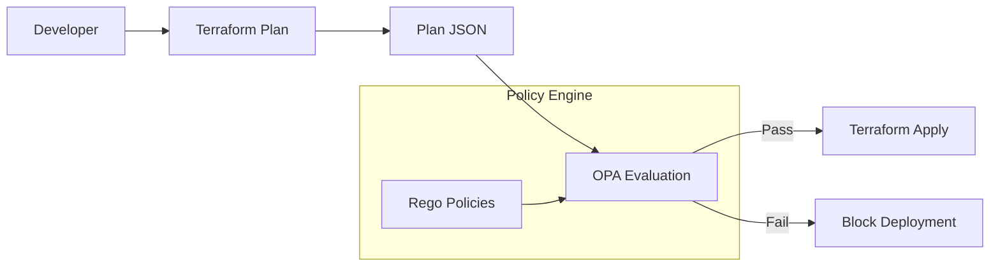
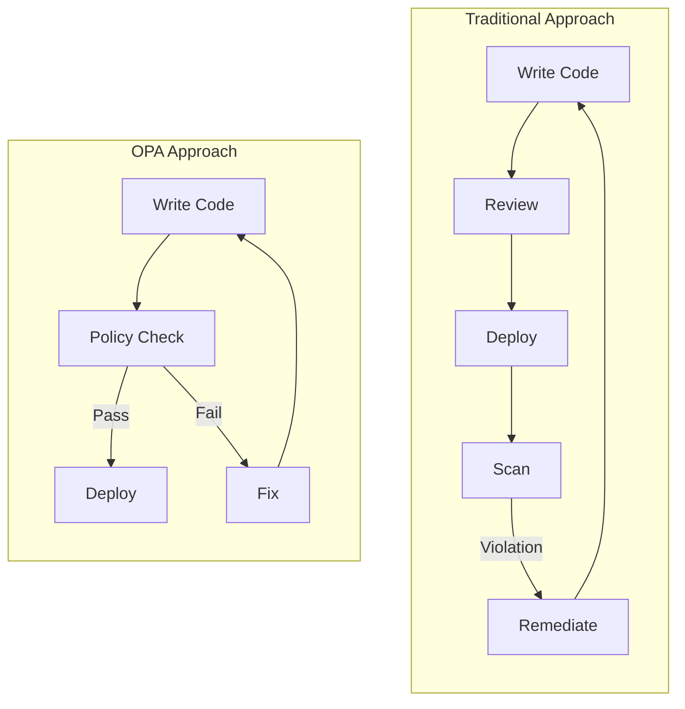
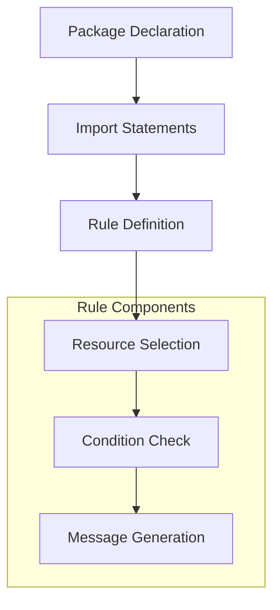
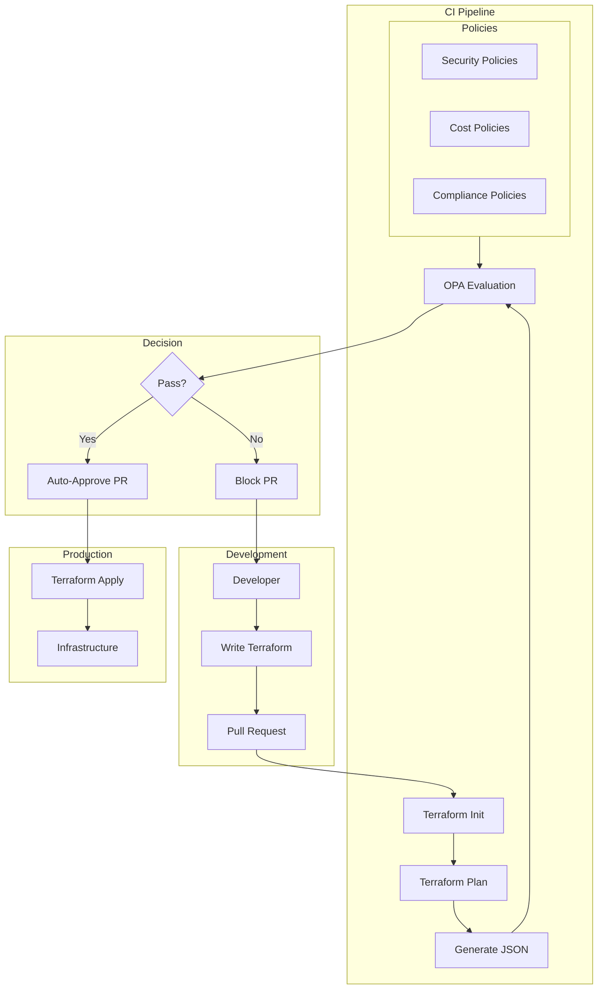

# How to Build Terraform OPA Integration

Author: [nawazdhandala](https://github.com/nawazdhandala)

Tags: Terraform, OPA, Policy, Compliance

Description: A comprehensive guide to integrating Open Policy Agent (OPA) with Terraform for policy-as-code. Learn how to enforce security, compliance, and cost controls on your infrastructure before it gets deployed.

---

Infrastructure as Code (IaC) transformed how we manage infrastructure. But with great power comes great responsibility. Without proper guardrails, teams can accidentally deploy insecure resources, overspend on cloud costs, or violate compliance requirements. This is where Open Policy Agent (OPA) comes in.

## What Is OPA?

Open Policy Agent is a general-purpose policy engine that lets you write policies as code. When combined with Terraform, OPA evaluates your infrastructure plans before they are applied, catching policy violations before resources are created.



## Why Integrate OPA with Terraform?

Traditional approaches to infrastructure governance rely on manual reviews or post-deployment scanning. Both have significant drawbacks:

- **Manual reviews** are slow and error-prone
- **Post-deployment scanning** catches violations after the damage is done
- **Native Terraform validations** are limited in scope

OPA provides pre-deployment policy enforcement, catching issues at the earliest possible stage.



## Setting Up the Integration

### Prerequisites

Install the required tools:

```bash
# Install Terraform
brew install terraform

# Install OPA
brew install opa

# Verify installations
terraform version
opa version
```

### Project Structure

Organize your project for maintainability:

```
terraform-opa-project/
├── terraform/
│   ├── main.tf
│   ├── variables.tf
│   ├── outputs.tf
│   └── providers.tf
├── policies/
│   ├── security.rego
│   ├── cost.rego
│   ├── compliance.rego
│   └── test/
│       ├── security_test.rego
│       └── cost_test.rego
├── scripts/
│   └── validate.sh
└── .github/
    └── workflows/
        └── terraform.yml
```

## Writing Your First Rego Policy

Rego is OPA's policy language. Let's start with a simple policy that prevents public S3 buckets.

### Policy: Deny Public S3 Buckets

Create `policies/security.rego`:

```rego
package terraform.security

import future.keywords.in
import future.keywords.if
import future.keywords.contains

# Deny S3 buckets with public ACLs
deny contains msg if {
    resource := input.resource_changes[_]
    resource.type == "aws_s3_bucket_acl"
    resource.change.after.acl == "public-read"
    msg := sprintf("S3 bucket '%s' cannot have public-read ACL", [resource.address])
}

deny contains msg if {
    resource := input.resource_changes[_]
    resource.type == "aws_s3_bucket_acl"
    resource.change.after.acl == "public-read-write"
    msg := sprintf("S3 bucket '%s' cannot have public-read-write ACL", [resource.address])
}

# Deny S3 buckets without encryption
deny contains msg if {
    resource := input.resource_changes[_]
    resource.type == "aws_s3_bucket"
    actions := resource.change.actions
    "create" in actions

    # Check if there is no corresponding encryption configuration
    not has_encryption(resource.address)
    msg := sprintf("S3 bucket '%s' must have server-side encryption enabled", [resource.address])
}

has_encryption(bucket_address) if {
    resource := input.resource_changes[_]
    resource.type == "aws_s3_bucket_server_side_encryption_configuration"
    contains(resource.address, bucket_address)
}
```

### Understanding the Policy Structure

Let's break down what each part does:



- **Package**: Namespaces your policies
- **Imports**: Enable modern Rego syntax
- **deny contains msg if**: Creates a set of violation messages
- **input.resource_changes**: Accesses Terraform plan data
- **sprintf**: Formats violation messages with context

## Generating Terraform Plan JSON

OPA evaluates policies against a JSON representation of your Terraform plan.

### Basic Workflow

```bash
# Initialize Terraform
terraform init

# Generate plan file
terraform plan -out=tfplan

# Convert to JSON
terraform show -json tfplan > tfplan.json

# Evaluate policies
opa eval \
  --format pretty \
  --data policies/ \
  --input tfplan.json \
  "data.terraform.security.deny"
```

### Automation Script

Create `scripts/validate.sh`:

```bash
#!/bin/bash
set -e

TERRAFORM_DIR="${1:-.}"
POLICY_DIR="${2:-./policies}"

echo "Running Terraform plan..."
cd "$TERRAFORM_DIR"
terraform init -backend=false
terraform plan -out=tfplan

echo "Converting plan to JSON..."
terraform show -json tfplan > tfplan.json

echo "Evaluating policies..."
VIOLATIONS=$(opa eval \
  --format json \
  --data "$POLICY_DIR" \
  --input tfplan.json \
  "data.terraform.security.deny" | jq '.result[0].expressions[0].value')

if [ "$VIOLATIONS" != "[]" ] && [ "$VIOLATIONS" != "null" ]; then
    echo "Policy violations found:"
    echo "$VIOLATIONS" | jq -r '.[]'
    exit 1
fi

echo "All policies passed!"
rm tfplan tfplan.json
```

## Advanced Policy Patterns

### Cost Control Policies

Prevent expensive resource configurations:

```rego
package terraform.cost

import future.keywords.in
import future.keywords.if
import future.keywords.contains

# Define allowed instance types
allowed_instance_types := {
    "t3.micro",
    "t3.small",
    "t3.medium",
    "t3.large"
}

# Deny expensive EC2 instance types
deny contains msg if {
    resource := input.resource_changes[_]
    resource.type == "aws_instance"
    "create" in resource.change.actions

    instance_type := resource.change.after.instance_type
    not instance_type in allowed_instance_types

    msg := sprintf(
        "EC2 instance '%s' uses '%s'. Allowed types: %v",
        [resource.address, instance_type, allowed_instance_types]
    )
}

# Deny RDS instances larger than db.t3.large
deny contains msg if {
    resource := input.resource_changes[_]
    resource.type == "aws_db_instance"
    "create" in resource.change.actions

    instance_class := resource.change.after.instance_class
    is_expensive_rds(instance_class)

    msg := sprintf(
        "RDS instance '%s' uses expensive class '%s'. Use db.t3.* instead.",
        [resource.address, instance_class]
    )
}

is_expensive_rds(class) if {
    startswith(class, "db.r5")
}

is_expensive_rds(class) if {
    startswith(class, "db.r6")
}

is_expensive_rds(class) if {
    startswith(class, "db.m5")
}

# Warn about resources without cost allocation tags
warn contains msg if {
    resource := input.resource_changes[_]
    "create" in resource.change.actions

    tags := object.get(resource.change.after, "tags", {})
    not tags.CostCenter

    msg := sprintf(
        "Resource '%s' should have a 'CostCenter' tag for cost tracking",
        [resource.address]
    )
}
```

### Compliance Policies

Enforce organizational standards:

```rego
package terraform.compliance

import future.keywords.in
import future.keywords.if
import future.keywords.contains

# Required tags for all resources
required_tags := {"Environment", "Owner", "Project"}

# Deny resources without required tags
deny contains msg if {
    resource := input.resource_changes[_]
    "create" in resource.change.actions

    # Check if resource supports tags
    resource.change.after.tags != null

    tags := object.keys(resource.change.after.tags)
    missing := required_tags - {tag | tag := tags[_]}
    count(missing) > 0

    msg := sprintf(
        "Resource '%s' missing required tags: %v",
        [resource.address, missing]
    )
}

# Deny resources in non-approved regions
approved_regions := {"us-east-1", "us-west-2", "eu-west-1"}

deny contains msg if {
    resource := input.resource_changes[_]
    "create" in resource.change.actions

    # Get provider config
    provider := input.configuration.provider_config[_]
    provider.name == "aws"
    region := provider.expressions.region.constant_value

    not region in approved_regions

    msg := sprintf(
        "Resources must be deployed in approved regions: %v. Found: %s",
        [approved_regions, region]
    )
}

# Enforce naming conventions
deny contains msg if {
    resource := input.resource_changes[_]
    resource.type == "aws_instance"
    "create" in resource.change.actions

    name := resource.change.after.tags.Name
    not regex.match(`^[a-z]+-[a-z]+-[0-9]+$`, name)

    msg := sprintf(
        "EC2 instance '%s' has invalid name '%s'. Must match pattern: env-app-number",
        [resource.address, name]
    )
}
```

### Network Security Policies

Prevent insecure network configurations:

```rego
package terraform.network

import future.keywords.in
import future.keywords.if
import future.keywords.contains

# Deny security groups with unrestricted ingress
deny contains msg if {
    resource := input.resource_changes[_]
    resource.type == "aws_security_group_rule"
    "create" in resource.change.actions

    rule := resource.change.after
    rule.type == "ingress"
    cidr_blocks := rule.cidr_blocks
    "0.0.0.0/0" in cidr_blocks

    # Allow only specific ports from anywhere
    allowed_public_ports := {80, 443}
    not rule.from_port in allowed_public_ports

    msg := sprintf(
        "Security group rule '%s' allows unrestricted access on port %d. Only ports %v allowed from 0.0.0.0/0",
        [resource.address, rule.from_port, allowed_public_ports]
    )
}

# Deny SSH from anywhere
deny contains msg if {
    resource := input.resource_changes[_]
    resource.type == "aws_security_group_rule"
    "create" in resource.change.actions

    rule := resource.change.after
    rule.type == "ingress"
    rule.from_port <= 22
    rule.to_port >= 22
    "0.0.0.0/0" in rule.cidr_blocks

    msg := sprintf(
        "Security group '%s' allows SSH (port 22) from anywhere. Restrict to specific CIDRs.",
        [resource.address]
    )
}

# Deny public subnets without explicit approval
deny contains msg if {
    resource := input.resource_changes[_]
    resource.type == "aws_subnet"
    "create" in resource.change.actions

    resource.change.after.map_public_ip_on_launch == true
    tags := object.get(resource.change.after, "tags", {})
    not tags.PublicSubnetApproved

    msg := sprintf(
        "Subnet '%s' auto-assigns public IPs. Add tag 'PublicSubnetApproved=true' if intentional.",
        [resource.address]
    )
}
```

## Testing Your Policies

Always test policies before deploying them.

### Unit Tests for Rego

Create `policies/test/security_test.rego`:

```rego
package terraform.security_test

import data.terraform.security

# Test: Public S3 bucket should be denied
test_deny_public_s3_bucket if {
    result := security.deny with input as {
        "resource_changes": [{
            "address": "aws_s3_bucket_acl.test",
            "type": "aws_s3_bucket_acl",
            "change": {
                "actions": ["create"],
                "after": {
                    "acl": "public-read"
                }
            }
        }]
    }
    count(result) > 0
}

# Test: Private S3 bucket should be allowed
test_allow_private_s3_bucket if {
    result := security.deny with input as {
        "resource_changes": [{
            "address": "aws_s3_bucket_acl.test",
            "type": "aws_s3_bucket_acl",
            "change": {
                "actions": ["create"],
                "after": {
                    "acl": "private"
                }
            }
        }]
    }
    count(result) == 0
}
```

### Running Tests

```bash
# Run all tests
opa test policies/ -v

# Run with coverage
opa test policies/ --coverage --format=json
```

## CI/CD Integration

### GitHub Actions Workflow

Create `.github/workflows/terraform.yml`:

```yaml
name: Terraform Policy Check

on:
  pull_request:
    paths:
      - 'terraform/**'
      - 'policies/**'

jobs:
  policy-check:
    runs-on: ubuntu-latest
    steps:
      - uses: actions/checkout@v4

      - name: Setup Terraform
        uses: hashicorp/setup-terraform@v3
        with:
          terraform_version: 1.6.0

      - name: Setup OPA
        uses: open-policy-agent/setup-opa@v2
        with:
          version: latest

      - name: Test Policies
        run: opa test policies/ -v

      - name: Terraform Init
        working-directory: terraform
        run: terraform init -backend=false

      - name: Terraform Plan
        working-directory: terraform
        run: |
          terraform plan -out=tfplan
          terraform show -json tfplan > tfplan.json

      - name: Evaluate Policies
        run: |
          RESULT=$(opa eval \
            --format json \
            --data policies/ \
            --input terraform/tfplan.json \
            "data.terraform")

          # Check for denies
          DENIES=$(echo "$RESULT" | jq '[.. | .deny? // empty | select(length > 0)] | flatten')

          if [ "$DENIES" != "[]" ]; then
            echo "Policy violations found:"
            echo "$DENIES" | jq -r '.[]'
            exit 1
          fi

          # Show warnings
          WARNS=$(echo "$RESULT" | jq '[.. | .warn? // empty | select(length > 0)] | flatten')
          if [ "$WARNS" != "[]" ]; then
            echo "Warnings:"
            echo "$WARNS" | jq -r '.[]'
          fi

          echo "All policies passed!"
```

### GitLab CI Pipeline

```yaml
stages:
  - validate
  - plan
  - policy
  - apply

variables:
  TF_ROOT: ${CI_PROJECT_DIR}/terraform
  POLICY_DIR: ${CI_PROJECT_DIR}/policies

policy-test:
  stage: validate
  image: openpolicyagent/opa:latest
  script:
    - opa test ${POLICY_DIR}/ -v

terraform-plan:
  stage: plan
  image: hashicorp/terraform:1.6
  script:
    - cd ${TF_ROOT}
    - terraform init -backend=false
    - terraform plan -out=tfplan
    - terraform show -json tfplan > tfplan.json
  artifacts:
    paths:
      - ${TF_ROOT}/tfplan.json

policy-check:
  stage: policy
  image: openpolicyagent/opa:latest
  dependencies:
    - terraform-plan
  script:
    - |
      VIOLATIONS=$(opa eval \
        --format json \
        --data ${POLICY_DIR}/ \
        --input ${TF_ROOT}/tfplan.json \
        "data.terraform.security.deny" | jq '.result[0].expressions[0].value')

      if [ "$VIOLATIONS" != "[]" ] && [ "$VIOLATIONS" != "null" ]; then
        echo "Policy violations:"
        echo "$VIOLATIONS" | jq -r '.[]'
        exit 1
      fi
```

## Using Conftest as an Alternative

Conftest is a utility built on OPA specifically for testing configuration files.

### Installation

```bash
# macOS
brew install conftest

# Linux
LATEST_VERSION=$(curl -s https://api.github.com/repos/open-policy-agent/conftest/releases/latest | jq -r .tag_name | sed 's/v//')
curl -L "https://github.com/open-policy-agent/conftest/releases/download/v${LATEST_VERSION}/conftest_${LATEST_VERSION}_Linux_x86_64.tar.gz" | tar xz
sudo mv conftest /usr/local/bin/
```

### Using Conftest

```bash
# Generate plan JSON
terraform plan -out=tfplan
terraform show -json tfplan > tfplan.json

# Run policies with Conftest
conftest test tfplan.json --policy policies/

# Output formats
conftest test tfplan.json -o json
conftest test tfplan.json -o tap
conftest test tfplan.json -o table
```

### Conftest-Specific Features

Conftest adds some conveniences over raw OPA:

```rego
package main

# Conftest looks for deny, warn, and violation rules automatically
deny[msg] {
    resource := input.resource_changes[_]
    resource.type == "aws_s3_bucket"
    resource.change.after.versioning[0].enabled != true
    msg := sprintf("S3 bucket '%s' must have versioning enabled", [resource.address])
}

warn[msg] {
    resource := input.resource_changes[_]
    resource.type == "aws_instance"
    not resource.change.after.monitoring
    msg := sprintf("EC2 instance '%s' should have detailed monitoring enabled", [resource.address])
}

# Exceptions - allow specific violations
exception[rules] {
    input.resource_changes[_].address == "aws_s3_bucket.legacy_bucket"
    rules := ["versioning_required"]
}
```

## Real-World Architecture

Here's how OPA fits into a complete Terraform workflow:



## Best Practices

### 1. Organize Policies by Domain

```
policies/
├── security/
│   ├── encryption.rego
│   ├── network.rego
│   └── iam.rego
├── cost/
│   ├── instance-types.rego
│   └── storage.rego
├── compliance/
│   ├── tags.rego
│   └── regions.rego
└── lib/
    └── helpers.rego
```

### 2. Create Reusable Helper Functions

```rego
package terraform.lib

import future.keywords.in
import future.keywords.if

# Check if a resource is being created
is_create(resource) if {
    "create" in resource.change.actions
}

# Check if a resource is being updated
is_update(resource) if {
    "update" in resource.change.actions
}

# Get resource by type
resources_by_type(type) := [resource |
    resource := input.resource_changes[_]
    resource.type == type
]

# Check if tag exists
has_tag(resource, tag_name) if {
    resource.change.after.tags[tag_name]
}
```

### 3. Use Data Files for Configuration

Create `policies/data.json`:

```json
{
  "allowed_regions": ["us-east-1", "us-west-2"],
  "allowed_instance_types": ["t3.micro", "t3.small", "t3.medium"],
  "required_tags": ["Environment", "Owner", "Project"],
  "cost_center_codes": ["TECH-001", "TECH-002", "INFRA-001"]
}
```

Reference in policies:

```rego
package terraform.compliance

import data.allowed_regions
import data.required_tags

deny contains msg if {
    # Use imported data
    region := input.configuration.provider_config.aws.expressions.region.constant_value
    not region in allowed_regions
    msg := sprintf("Region '%s' not in allowed list", [region])
}
```

### 4. Implement Policy Versioning

Track policy versions alongside your Terraform code:

```rego
package terraform.metadata

# Policy version for tracking
version := "1.2.0"

# Policy effective date
effective_date := "2026-01-30"

# Changelog
changes := {
    "1.2.0": "Added cost center tag validation",
    "1.1.0": "Added region restrictions",
    "1.0.0": "Initial security policies"
}
```

## Debugging Policies

### Print Debugging

```rego
package terraform.debug

import future.keywords.in
import future.keywords.if

deny contains msg if {
    resource := input.resource_changes[_]

    # Debug: Print resource details
    print("Checking resource:", resource.address)
    print("Resource type:", resource.type)
    print("Actions:", resource.change.actions)

    resource.type == "aws_instance"
    print("Instance type:", resource.change.after.instance_type)

    # Actual rule logic
    resource.change.after.instance_type == "t2.micro"
    msg := "t2.micro not allowed, use t3.micro"
}
```

### Interactive Debugging

```bash
# Start OPA REPL with your data
opa run policies/ terraform/tfplan.json

# In the REPL
> input.resource_changes[0]
> data.terraform.security.deny
> trace data.terraform.security.deny
```

## Handling Exceptions

Sometimes you need to allow specific violations:

```rego
package terraform.security

import future.keywords.in
import future.keywords.if
import future.keywords.contains

# Exception list - resources that can bypass certain rules
exceptions := {
    "aws_s3_bucket.public_website": ["public_access"],
    "aws_instance.bastion": ["public_ip"]
}

deny contains msg if {
    resource := input.resource_changes[_]
    resource.type == "aws_s3_bucket_acl"
    resource.change.after.acl == "public-read"

    # Check for exception
    not has_exception(resource.address, "public_access")

    msg := sprintf("S3 bucket '%s' cannot have public-read ACL", [resource.address])
}

has_exception(address, rule) if {
    rules := exceptions[address]
    rule in rules
}
```

## Conclusion

Integrating OPA with Terraform provides a powerful policy-as-code framework that catches issues before they reach production. Key takeaways:

1. **Shift Left**: Catch violations during planning, not after deployment
2. **Automate**: Integrate policy checks into CI/CD pipelines
3. **Test Policies**: Treat policies as code with proper testing
4. **Iterate**: Start with critical policies and expand over time
5. **Document**: Make policies understandable for the team

Start with security fundamentals like encryption and network access, then expand to cost controls and compliance requirements. The investment in policy-as-code pays dividends in reduced incidents and faster, safer deployments.

---

*Want to monitor your Terraform-managed infrastructure? [OneUptime](https://oneuptime.com) provides comprehensive observability for your cloud resources, including alerts when infrastructure drifts from your expected state.*

**Related Reading:**

- [Introducing the OneUptime Terraform Provider: Infrastructure as Code for Complete Observability](https://oneuptime.com/blog/post/2025-07-01-introducing-terraform-provider-for-oneuptime/view)
- [How to Implement GitOps with ArgoCD in Kubernetes](https://oneuptime.com/blog/post/2026-01-06-kubernetes-gitops-argocd/view)
- [The Five Stages of SRE Maturity](https://oneuptime.com/blog/post/2025-09-01-the-five-stages-of-sre-maturity/view)
