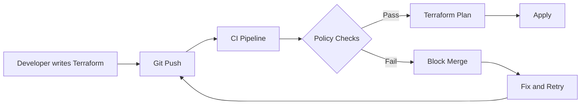
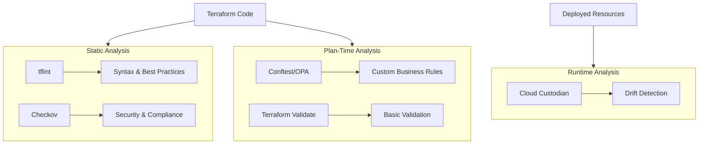
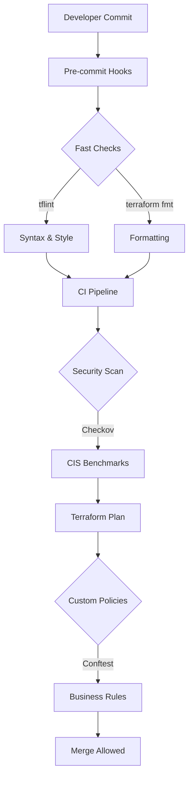

# How to Implement Terraform Policy as Code

Author: [nawazdhandala](https://github.com/nawazdhandala)

Tags: Terraform, Policy, Compliance, Security

Description: A comprehensive guide to implementing policy as code for Terraform using open-source tools like OPA, Conftest, Checkov, and tflint. Learn to automate security, compliance, and best practice enforcement in your infrastructure pipelines.

---

Infrastructure as Code (IaC) transformed how teams provision cloud resources. But without guardrails, Terraform configurations can drift into non-compliant, insecure, or costly states. Policy as Code brings the same rigor to governance that Terraform brought to infrastructure: automated, versioned, and testable rules that run in CI/CD pipelines.

This guide covers open-source policy tools that work with any Terraform setup, whether you use Terraform Cloud, open-source Terraform, or OpenTofu.

## Why Policy as Code for Terraform

Manual code reviews catch some issues but cannot scale. A reviewer might miss that an S3 bucket lacks encryption or that an EC2 instance uses an oversized instance type. Policy as Code solves this by automating checks.



### Benefits

- **Consistency**: Same rules apply to every change
- **Speed**: Automated checks run in seconds
- **Auditability**: Policy violations are logged and tracked
- **Shift Left**: Catch issues before they reach production
- **Documentation**: Policies serve as executable documentation of requirements

## The Policy as Code Landscape

Several tools address different aspects of Terraform policy enforcement.



| Tool | Focus | Input | Best For |
|------|-------|-------|----------|
| tflint | Best practices | HCL files | Syntax, provider-specific rules |
| Checkov | Security scanning | HCL files, plan JSON | CIS benchmarks, compliance |
| Conftest/OPA | Custom policies | Plan JSON | Business logic, custom rules |
| Terrascan | Security | HCL files | Security scanning |

## Getting Started with tflint

tflint is the fastest way to add policy checks. It catches common mistakes and enforces naming conventions.

### Installation

```bash
# macOS
brew install tflint

# Linux
curl -s https://raw.githubusercontent.com/terraform-linters/tflint/master/install_linux.sh | bash

# Docker
docker run --rm -v $(pwd):/data -t ghcr.io/terraform-linters/tflint
```

### Basic Configuration

Create `.tflint.hcl` in your Terraform directory:

```hcl
# .tflint.hcl
config {
  format = "compact"
  plugin_dir = "~/.tflint.d/plugins"

  call_module_type = "local"
  force = false
  disabled_by_default = false
}

# AWS-specific rules
plugin "aws" {
  enabled = true
  version = "0.31.0"
  source  = "github.com/terraform-linters/tflint-ruleset-aws"
}

# Naming conventions
rule "terraform_naming_convention" {
  enabled = true
  format  = "snake_case"
}

# Require descriptions for variables
rule "terraform_documented_variables" {
  enabled = true
}

# Require descriptions for outputs
rule "terraform_documented_outputs" {
  enabled = true
}

# Enforce standard module structure
rule "terraform_standard_module_structure" {
  enabled = true
}
```

### AWS-Specific Rules

tflint catches provider-specific issues that generic tools miss:

```hcl
# .tflint.hcl - AWS rules
plugin "aws" {
  enabled = true
  version = "0.31.0"
  source  = "github.com/terraform-linters/tflint-ruleset-aws"

  # Deep checking validates against AWS API
  deep_check = true
}

# Catch invalid instance types
rule "aws_instance_invalid_type" {
  enabled = true
}

# Catch invalid AMI IDs
rule "aws_instance_invalid_ami" {
  enabled = true
}

# Warn about previous generation instances
rule "aws_instance_previous_type" {
  enabled = true
}

# Require encryption
rule "aws_db_instance_default_parameter_group" {
  enabled = true
}
```

### Custom Rules

Write custom rules in Go or use the built-in rule types:

```hcl
# Block specific resource types
rule "terraform_required_providers" {
  enabled = true
}

# Enforce variable types
rule "terraform_typed_variables" {
  enabled = true
}
```

### Running tflint

```bash
# Initialize plugins
tflint --init

# Run on current directory
tflint

# Run recursively
tflint --recursive

# Output as JSON for CI
tflint --format json

# Fix auto-fixable issues
tflint --fix
```

## Security Scanning with Checkov

Checkov scans Terraform for security misconfigurations against hundreds of built-in policies.

### Installation

```bash
# pip
pip install checkov

# Homebrew
brew install checkov

# Docker
docker run -t -v $(pwd):/tf bridgecrew/checkov -d /tf
```

### Running Checkov

```bash
# Scan Terraform files
checkov -d .

# Scan specific file
checkov -f main.tf

# Scan Terraform plan
terraform plan -out=plan.tfplan
terraform show -json plan.tfplan > plan.json
checkov -f plan.json

# Output formats
checkov -d . --output cli
checkov -d . --output json
checkov -d . --output sarif  # GitHub Security tab
```

### Understanding Checkov Output

```
Passed checks: 42, Failed checks: 3, Skipped checks: 0

Check: CKV_AWS_19: "Ensure the S3 bucket has server-side-encryption enabled"
    FAILED for resource: aws_s3_bucket.data
    File: /storage.tf:1-10
    Guide: https://docs.bridgecrew.io/docs/s3_14-data-encrypted-at-rest

Check: CKV_AWS_21: "Ensure the S3 bucket has versioning enabled"
    FAILED for resource: aws_s3_bucket.data
    File: /storage.tf:1-10
```

### Configuration File

Create `.checkov.yaml` for project settings:

```yaml
# .checkov.yaml
directory:
  - "."
external-checks-dir:
  - "./custom_checks"
skip-check:
  - CKV_AWS_18  # Skip access logging check
  - CKV_AWS_52  # Skip MFA delete check
soft-fail-on:
  - CKV_AWS_145  # Warn but don't fail on this check
framework:
  - terraform
output:
  - cli
  - json
```

### Custom Checkov Policies

Write custom policies in Python or YAML:

```yaml
# custom_checks/require_team_tag.yaml
metadata:
  id: "CUSTOM_AWS_1"
  name: "Ensure all resources have a Team tag"
  category: "CONVENTION"
  guideline: "All resources must have a Team tag for cost allocation"
scope:
  provider: aws
definition:
  and:
    - cond_type: attribute
      resource_types:
        - aws_instance
        - aws_s3_bucket
        - aws_db_instance
      attribute: tags.Team
      operator: exists
```

Python custom check:

```python
# custom_checks/require_encryption.py
from checkov.terraform.checks.resource.base_resource_check import BaseResourceCheck
from checkov.common.models.enums import CheckResult, CheckCategories

class S3BucketKMSEncryption(BaseResourceCheck):
    def __init__(self):
        name = "Ensure S3 bucket uses KMS encryption"
        id = "CUSTOM_AWS_2"
        supported_resources = ["aws_s3_bucket_server_side_encryption_configuration"]
        categories = [CheckCategories.ENCRYPTION]
        super().__init__(name=name, id=id, categories=categories,
                        supported_resources=supported_resources)

    def scan_resource_conf(self, conf):
        rules = conf.get("rule", [{}])
        for rule in rules:
            apply_config = rule.get("apply_server_side_encryption_by_default", [{}])
            for config in apply_config:
                if config.get("sse_algorithm") == ["aws:kms"]:
                    return CheckResult.PASSED
        return CheckResult.FAILED

check = S3BucketKMSEncryption()
```

### Inline Skip Comments

Skip specific checks with comments:

```hcl
resource "aws_s3_bucket" "logs" {
  #checkov:skip=CKV_AWS_18:Access logging not required for log bucket
  #checkov:skip=CKV_AWS_21:Versioning adds cost for ephemeral logs

  bucket = "my-log-bucket"
}
```

## Custom Policies with OPA and Conftest

Open Policy Agent (OPA) with Conftest enables complex custom policies using the Rego language.

### Installation

```bash
# Conftest
brew install conftest

# Or download
curl -L -o conftest.tar.gz \
  https://github.com/open-policy-agent/conftest/releases/download/v0.50.0/conftest_0.50.0_Darwin_arm64.tar.gz
tar xzf conftest.tar.gz
mv conftest /usr/local/bin/
```

### Project Structure

```
terraform/
  main.tf
  variables.tf
  policy/
    terraform.rego
    tags.rego
    security.rego
```

### Basic Rego Policy

```rego
# policy/terraform.rego
package main

import future.keywords.in
import future.keywords.contains
import future.keywords.if

# Deny resources without required tags
deny contains msg if {
    resource := input.resource_changes[_]
    resource.type == "aws_instance"
    not has_required_tags(resource.change.after.tags)
    msg := sprintf("EC2 instance '%s' missing required tags", [resource.address])
}

has_required_tags(tags) if {
    tags.Environment
    tags.Owner
    tags.Project
}

# Deny public S3 buckets
deny contains msg if {
    resource := input.resource_changes[_]
    resource.type == "aws_s3_bucket_acl"
    acl := resource.change.after.acl
    acl in ["public-read", "public-read-write"]
    msg := sprintf("S3 bucket '%s' has public ACL: %s", [resource.address, acl])
}
```

### Running Conftest

```bash
# Generate plan JSON
terraform plan -out=plan.tfplan
terraform show -json plan.tfplan > plan.json

# Run policies
conftest test plan.json

# Specify policy directory
conftest test plan.json --policy policy/

# Output formats
conftest test plan.json --output table
conftest test plan.json --output json
conftest test plan.json --output tap
```

### Advanced Rego Policies

```rego
# policy/security.rego
package main

import future.keywords.in
import future.keywords.contains
import future.keywords.if

# Block overly permissive security groups
deny contains msg if {
    resource := input.resource_changes[_]
    resource.type == "aws_security_group_rule"
    resource.change.after.type == "ingress"
    resource.change.after.cidr_blocks[_] == "0.0.0.0/0"
    resource.change.after.from_port <= 22
    resource.change.after.to_port >= 22
    msg := sprintf("Security group '%s' allows SSH from 0.0.0.0/0", [resource.address])
}

# Require encryption for RDS
deny contains msg if {
    resource := input.resource_changes[_]
    resource.type == "aws_db_instance"
    not resource.change.after.storage_encrypted
    msg := sprintf("RDS instance '%s' must have storage encryption enabled", [resource.address])
}

# Block unencrypted EBS volumes
deny contains msg if {
    resource := input.resource_changes[_]
    resource.type == "aws_ebs_volume"
    not resource.change.after.encrypted
    msg := sprintf("EBS volume '%s' must be encrypted", [resource.address])
}

# Require HTTPS for ALB listeners
deny contains msg if {
    resource := input.resource_changes[_]
    resource.type == "aws_lb_listener"
    resource.change.after.protocol == "HTTP"
    resource.change.after.port == 80

    # Check if there's no redirect action
    actions := resource.change.after.default_action
    not has_redirect(actions)
    msg := sprintf("ALB listener '%s' should redirect HTTP to HTTPS", [resource.address])
}

has_redirect(actions) if {
    action := actions[_]
    action.type == "redirect"
    action.redirect[_].protocol == "HTTPS"
}
```

### Cost Control Policies

```rego
# policy/cost.rego
package main

import future.keywords.in
import future.keywords.contains
import future.keywords.if

# Define allowed instance types per environment
allowed_instance_types := {
    "production": ["t3.medium", "t3.large", "t3.xlarge", "m5.large", "m5.xlarge"],
    "staging": ["t3.micro", "t3.small", "t3.medium"],
    "development": ["t3.micro", "t3.small"]
}

# Default to development if no environment tag
default_environment := "development"

# Block expensive instance types in non-production
deny contains msg if {
    resource := input.resource_changes[_]
    resource.type == "aws_instance"
    resource.change.actions[_] in ["create", "update"]

    instance_type := resource.change.after.instance_type
    env := get_environment(resource.change.after.tags)
    allowed := allowed_instance_types[env]

    not instance_type in allowed
    msg := sprintf(
        "Instance '%s' uses type '%s' which is not allowed in '%s' environment. Allowed: %v",
        [resource.address, instance_type, env, allowed]
    )
}

get_environment(tags) := env if {
    env := tags.Environment
} else := default_environment

# Limit number of instances per plan
deny contains msg if {
    instances := [r | r := input.resource_changes[_]; r.type == "aws_instance"; r.change.actions[_] == "create"]
    count(instances) > 10
    msg := sprintf("Plan creates %d instances, maximum allowed is 10", [count(instances)])
}

# Block expensive database instances
expensive_db_classes := ["db.r5.4xlarge", "db.r5.8xlarge", "db.r5.12xlarge", "db.r5.16xlarge", "db.r5.24xlarge"]

deny contains msg if {
    resource := input.resource_changes[_]
    resource.type == "aws_db_instance"
    resource.change.after.instance_class in expensive_db_classes

    env := get_environment(resource.change.after.tags)
    env != "production"

    msg := sprintf(
        "RDS instance '%s' uses expensive class '%s' in non-production environment",
        [resource.address, resource.change.after.instance_class]
    )
}
```

### Compliance Policies

```rego
# policy/compliance.rego
package main

import future.keywords.in
import future.keywords.contains
import future.keywords.if

# PCI-DSS: Ensure encryption at rest
deny contains msg if {
    resource := input.resource_changes[_]
    resource.type in ["aws_s3_bucket", "aws_ebs_volume", "aws_rds_cluster", "aws_db_instance"]
    is_pci_resource(resource)
    not is_encrypted(resource)
    msg := sprintf("PCI resource '%s' must have encryption at rest", [resource.address])
}

is_pci_resource(resource) if {
    resource.change.after.tags.Compliance == "PCI"
}

is_encrypted(resource) if {
    resource.type == "aws_ebs_volume"
    resource.change.after.encrypted == true
}

is_encrypted(resource) if {
    resource.type == "aws_db_instance"
    resource.change.after.storage_encrypted == true
}

# HIPAA: Require VPC for databases
deny contains msg if {
    resource := input.resource_changes[_]
    resource.type == "aws_db_instance"
    resource.change.after.tags.Compliance == "HIPAA"
    resource.change.after.publicly_accessible == true
    msg := sprintf("HIPAA database '%s' cannot be publicly accessible", [resource.address])
}

# SOC2: Require logging
deny contains msg if {
    resource := input.resource_changes[_]
    resource.type == "aws_s3_bucket"
    resource.change.after.tags.Compliance == "SOC2"

    # Check for logging configuration
    bucket_name := resource.change.after.bucket
    not has_logging_config(bucket_name)
    msg := sprintf("SOC2 bucket '%s' must have access logging enabled", [resource.address])
}

has_logging_config(bucket_name) if {
    logging := input.resource_changes[_]
    logging.type == "aws_s3_bucket_logging"
    logging.change.after.bucket == bucket_name
}
```

### Warnings vs Denials

```rego
# policy/warnings.rego
package main

import future.keywords.in
import future.keywords.contains
import future.keywords.if

# Warnings do not block but are reported
warn contains msg if {
    resource := input.resource_changes[_]
    resource.type == "aws_instance"
    resource.change.after.instance_type == "t2.micro"
    msg := sprintf("Consider using t3.micro instead of t2.micro for '%s' (better performance)", [resource.address])
}

warn contains msg if {
    resource := input.resource_changes[_]
    resource.type == "aws_s3_bucket"
    not resource.change.after.tags.CostCenter
    msg := sprintf("S3 bucket '%s' missing CostCenter tag for billing", [resource.address])
}
```

## CI/CD Integration

### GitHub Actions

```yaml
# .github/workflows/terraform-policy.yml
name: Terraform Policy Check

on:
  pull_request:
    paths:
      - '**.tf'
      - 'policy/**'

jobs:
  policy-check:
    runs-on: ubuntu-latest
    steps:
      - uses: actions/checkout@v4

      - name: Setup Terraform
        uses: hashicorp/setup-terraform@v3
        with:
          terraform_version: 1.7.0
          terraform_wrapper: false

      - name: Setup tflint
        uses: terraform-linters/setup-tflint@v4
        with:
          tflint_version: v0.50.0

      - name: Install Checkov
        run: pip install checkov

      - name: Install Conftest
        run: |
          curl -L -o conftest.tar.gz https://github.com/open-policy-agent/conftest/releases/download/v0.50.0/conftest_0.50.0_Linux_x86_64.tar.gz
          tar xzf conftest.tar.gz
          sudo mv conftest /usr/local/bin/

      - name: Terraform Init
        run: terraform init

      - name: tflint
        run: |
          tflint --init
          tflint --format compact

      - name: Checkov
        run: checkov -d . --output sarif --output-file checkov.sarif
        continue-on-error: true

      - name: Upload Checkov SARIF
        uses: github/codeql-action/upload-sarif@v3
        with:
          sarif_file: checkov.sarif

      - name: Terraform Plan
        run: |
          terraform plan -out=plan.tfplan
          terraform show -json plan.tfplan > plan.json
        env:
          AWS_ACCESS_KEY_ID: ${{ secrets.AWS_ACCESS_KEY_ID }}
          AWS_SECRET_ACCESS_KEY: ${{ secrets.AWS_SECRET_ACCESS_KEY }}

      - name: Conftest
        run: conftest test plan.json --policy policy/
```

### GitLab CI

```yaml
# .gitlab-ci.yml
stages:
  - validate
  - plan
  - policy

variables:
  TF_VERSION: "1.7.0"

tflint:
  stage: validate
  image: ghcr.io/terraform-linters/tflint:v0.50.0
  script:
    - tflint --init
    - tflint --recursive --format compact
  rules:
    - changes:
        - "**/*.tf"

checkov:
  stage: validate
  image: bridgecrew/checkov:latest
  script:
    - checkov -d . --output cli --output junitxml --output-file-path console,checkov.xml
  artifacts:
    reports:
      junit: checkov.xml
  rules:
    - changes:
        - "**/*.tf"

terraform-plan:
  stage: plan
  image: hashicorp/terraform:$TF_VERSION
  script:
    - terraform init
    - terraform plan -out=plan.tfplan
    - terraform show -json plan.tfplan > plan.json
  artifacts:
    paths:
      - plan.json
      - plan.tfplan
  rules:
    - changes:
        - "**/*.tf"

conftest:
  stage: policy
  image: openpolicyagent/conftest:latest
  dependencies:
    - terraform-plan
  script:
    - conftest test plan.json --policy policy/ --output table
  rules:
    - changes:
        - "**/*.tf"
        - "policy/**"
```

### Pre-commit Hooks

```yaml
# .pre-commit-config.yaml
repos:
  - repo: https://github.com/antonbabenko/pre-commit-terraform
    rev: v1.88.0
    hooks:
      - id: terraform_fmt
      - id: terraform_validate
      - id: terraform_tflint
        args:
          - --args=--config=.tflint.hcl
      - id: terraform_checkov
        args:
          - --args=--quiet
          - --args=--compact

  - repo: https://github.com/open-policy-agent/conftest
    rev: v0.50.0
    hooks:
      - id: conftest-verify
```

Install hooks:

```bash
pip install pre-commit
pre-commit install
```

## Testing Policies

### Testing Rego Policies

Create test files alongside policies:

```rego
# policy/terraform_test.rego
package main

import future.keywords.in

# Test: Instance with all required tags should pass
test_instance_with_tags {
    result := deny with input as {
        "resource_changes": [{
            "address": "aws_instance.web",
            "type": "aws_instance",
            "change": {
                "actions": ["create"],
                "after": {
                    "instance_type": "t3.micro",
                    "tags": {
                        "Environment": "production",
                        "Owner": "platform-team",
                        "Project": "web-app"
                    }
                }
            }
        }]
    }
    count(result) == 0
}

# Test: Instance without tags should fail
test_instance_without_tags {
    result := deny with input as {
        "resource_changes": [{
            "address": "aws_instance.web",
            "type": "aws_instance",
            "change": {
                "actions": ["create"],
                "after": {
                    "instance_type": "t3.micro",
                    "tags": {}
                }
            }
        }]
    }
    count(result) > 0
}

# Test: Public S3 bucket should fail
test_public_s3_bucket {
    result := deny with input as {
        "resource_changes": [{
            "address": "aws_s3_bucket_acl.public",
            "type": "aws_s3_bucket_acl",
            "change": {
                "actions": ["create"],
                "after": {
                    "acl": "public-read"
                }
            }
        }]
    }
    count(result) > 0
}
```

Run tests:

```bash
# Run all tests
conftest verify --policy policy/

# Verbose output
conftest verify --policy policy/ --trace
```

### Testing with Example Plans

Create example Terraform and plans for testing:

```bash
# test/fixtures/
mkdir -p test/fixtures/passing test/fixtures/failing

# Generate test plans
cd test/fixtures/passing
terraform init && terraform plan -out=plan.tfplan
terraform show -json plan.tfplan > ../../../test/passing-plan.json

cd ../failing
terraform init && terraform plan -out=plan.tfplan
terraform show -json plan.tfplan > ../../../test/failing-plan.json

# Run against test data
conftest test test/passing-plan.json --policy policy/
conftest test test/failing-plan.json --policy policy/
```

## Best Practices

### 1. Layer Your Policies



### 2. Start Permissive, Then Tighten

```rego
# Start with warnings
warn contains msg if {
    # Your condition
    msg := "Consider fixing this"
}

# Graduate to deny when teams are ready
deny contains msg if {
    # Same condition
    msg := "This must be fixed"
}
```

### 3. Provide Clear Error Messages

```rego
# Bad
deny contains msg if {
    resource := input.resource_changes[_]
    resource.type == "aws_instance"
    not resource.change.after.tags.Environment
    msg := "Tag missing"
}

# Good
deny contains msg if {
    resource := input.resource_changes[_]
    resource.type == "aws_instance"
    not resource.change.after.tags.Environment
    msg := sprintf(
        "EC2 instance '%s' in %s is missing required 'Environment' tag. Add: tags = { Environment = \"production|staging|development\" }",
        [resource.address, resource.module_address]
    )
}
```

### 4. Version and Review Policies

```
policies/
  CHANGELOG.md
  README.md
  v1/
    terraform.rego
    security.rego
  v2/
    terraform.rego
    security.rego
    cost.rego
```

### 5. Document Policy Decisions

```rego
# policy/terraform.rego

# POLICY: require-encryption
# RATIONALE: All data at rest must be encrypted per security policy SEC-001
# EXCEPTIONS: None - this is a hard requirement
# OWNER: security-team@company.com
deny contains msg if {
    # ... policy implementation
}
```

## Troubleshooting

### Conftest Not Finding Violations

```bash
# Debug with trace
conftest test plan.json --policy policy/ --trace

# Check input structure
conftest parse plan.json

# Verify policy syntax
opa check policy/
```

### tflint Plugin Issues

```bash
# Clear plugin cache
rm -rf ~/.tflint.d/plugins

# Reinstall
tflint --init

# Check plugin version compatibility
tflint --version
```

### Checkov False Positives

```hcl
# Skip specific check with reason
resource "aws_s3_bucket" "logs" {
  #checkov:skip=CKV_AWS_18:Intentionally public for CDN origin
  bucket = "cdn-origin-bucket"
}
```

```yaml
# Or skip globally in .checkov.yaml
skip-check:
  - CKV_AWS_18
```

---

Policy as Code transforms infrastructure governance from a bottleneck into an enabler. Start with tflint for quick wins, add Checkov for security baselines, and implement Conftest when you need custom business logic. The investment in automation pays off every time a misconfiguration is caught before it reaches production.

Run policies in CI/CD pipelines, provide clear feedback to developers, and iterate on your policy library as requirements evolve. Your future self debugging a security incident will thank you.
