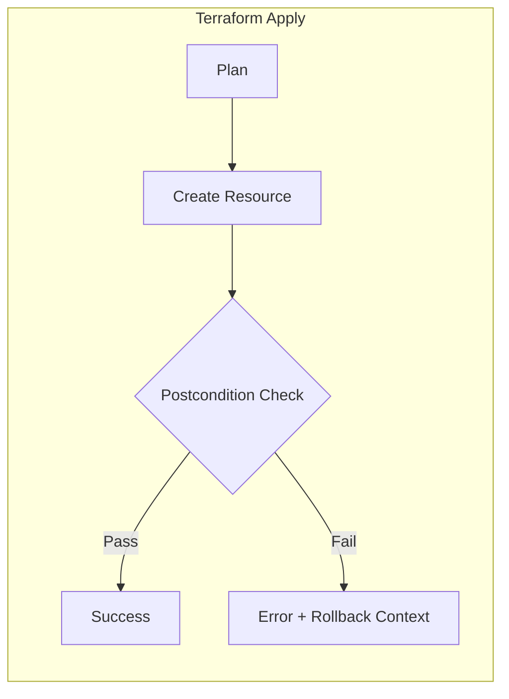
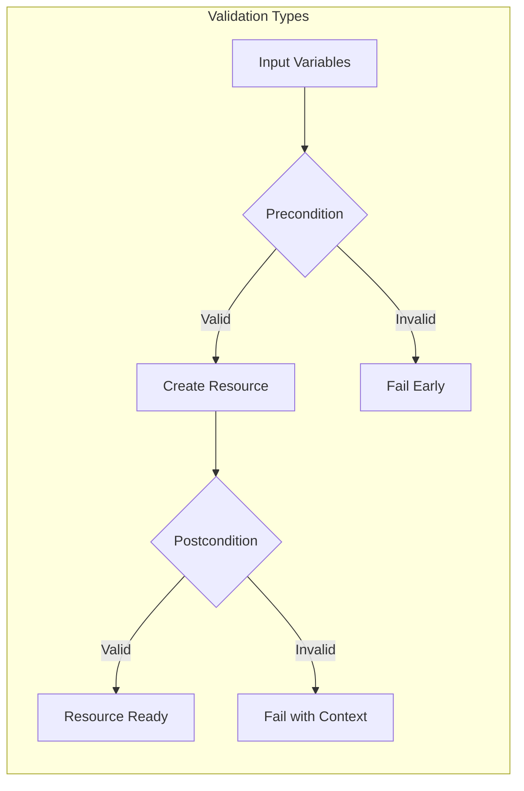
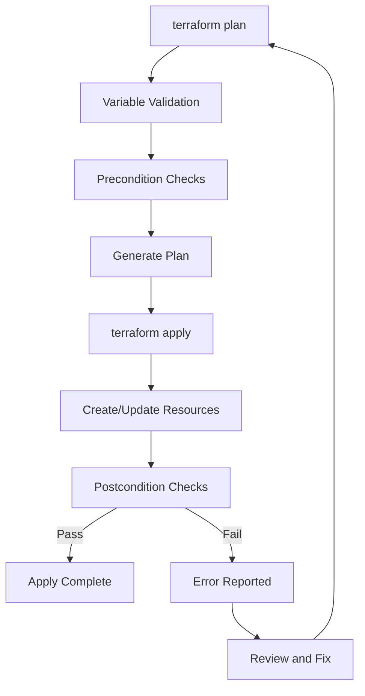

# How to Create Terraform Postconditions

Author: [nawazdhandala](https://github.com/nawazdhandala)

Tags: Terraform, IaC, Validation, Postconditions

Description: Learn how to use Terraform postconditions to validate resource state after creation and catch infrastructure misconfigurations early.

---

Terraform postconditions let you validate that resources are in the expected state after they are created or updated. Unlike preconditions that check inputs before creation, postconditions verify the actual result. This is your safety net for catching misconfigurations that might otherwise slip through unnoticed.

## Understanding Postconditions

Postconditions are validation checks that run after Terraform creates or updates a resource. They use the `lifecycle` block with a `postcondition` sub-block.



### When to Use Postconditions

Postconditions are ideal when you need to verify:
- Resource attributes that are only known after creation
- Provider-side defaults match your expectations
- Computed values fall within acceptable ranges
- Dependencies between resource attributes

## Basic Postcondition Syntax

Here is the basic structure of a postcondition block. The `condition` must evaluate to true for the apply to succeed.

```hcl
resource "aws_instance" "web" {
  ami           = "ami-0c55b159cbfafe1f0"
  instance_type = "t3.micro"

  lifecycle {
    postcondition {
      condition     = self.public_ip != ""
      error_message = "EC2 instance must have a public IP address assigned."
    }
  }
}
```

The `self` keyword refers to the resource being validated. You can access any attribute of the resource after it has been created.

## Practical Examples

### Validating EC2 Instance State

This postcondition ensures the EC2 instance is running after creation. The instance state is only available after AWS provisions it.

```hcl
resource "aws_instance" "app_server" {
  ami           = var.ami_id
  instance_type = var.instance_type
  subnet_id     = var.subnet_id

  tags = {
    Name = "app-server"
  }

  lifecycle {
    postcondition {
      condition     = self.instance_state == "running"
      error_message = "Instance failed to reach running state. Current state: ${self.instance_state}"
    }

    postcondition {
      condition     = self.private_ip != null
      error_message = "Instance must have a private IP address."
    }
  }
}
```

### Validating S3 Bucket Encryption

When creating S3 buckets, you want to ensure encryption is actually enabled. This postcondition verifies the server-side encryption configuration.

```hcl
resource "aws_s3_bucket" "data" {
  bucket = "my-secure-data-bucket"
}

resource "aws_s3_bucket_server_side_encryption_configuration" "data" {
  bucket = aws_s3_bucket.data.id

  rule {
    apply_server_side_encryption_by_default {
      sse_algorithm = "aws:kms"
    }
  }

  lifecycle {
    postcondition {
      condition     = self.rule[0].apply_server_side_encryption_by_default[0].sse_algorithm == "aws:kms"
      error_message = "Bucket must use KMS encryption, not AES256."
    }
  }
}
```

### Validating RDS Instance Configuration

Database instances have many settings that might be modified by the provider. Postconditions ensure critical settings are correct.

```hcl
resource "aws_db_instance" "primary" {
  identifier           = "production-db"
  engine               = "postgres"
  engine_version       = "15.4"
  instance_class       = "db.r6g.large"
  allocated_storage    = 100
  storage_encrypted    = true
  multi_az             = true
  deletion_protection  = true

  lifecycle {
    postcondition {
      condition     = self.storage_encrypted == true
      error_message = "Database storage must be encrypted."
    }

    postcondition {
      condition     = self.multi_az == true
      error_message = "Production database must be Multi-AZ for high availability."
    }

    postcondition {
      condition     = self.deletion_protection == true
      error_message = "Deletion protection must be enabled on production databases."
    }

    postcondition {
      condition     = self.backup_retention_period >= 7
      error_message = "Backup retention must be at least 7 days. Current: ${self.backup_retention_period}"
    }
  }
}
```

### Validating Kubernetes Resources

When using the Kubernetes provider, postconditions can verify that resources are properly configured.

```hcl
resource "kubernetes_deployment" "app" {
  metadata {
    name      = "my-app"
    namespace = "production"
  }

  spec {
    replicas = 3

    selector {
      match_labels = {
        app = "my-app"
      }
    }

    template {
      metadata {
        labels = {
          app = "my-app"
        }
      }

      spec {
        container {
          name  = "app"
          image = "my-app:v1.2.3"

          resources {
            limits = {
              cpu    = "500m"
              memory = "512Mi"
            }
            requests = {
              cpu    = "250m"
              memory = "256Mi"
            }
          }
        }
      }
    }
  }

  lifecycle {
    postcondition {
      condition     = self.spec[0].replicas >= 2
      error_message = "Production deployments must have at least 2 replicas."
    }
  }
}
```

## Postconditions in Data Sources

Data sources also support postconditions. This is useful for validating that fetched data meets your expectations.

```hcl
data "aws_ami" "ubuntu" {
  most_recent = true
  owners      = ["099720109477"]  # Canonical

  filter {
    name   = "name"
    values = ["ubuntu/images/hvm-ssd/ubuntu-jammy-22.04-amd64-server-*"]
  }

  lifecycle {
    postcondition {
      condition     = self.architecture == "x86_64"
      error_message = "AMI must be x86_64 architecture."
    }

    postcondition {
      condition     = self.root_device_type == "ebs"
      error_message = "AMI must use EBS root device."
    }
  }
}
```

## Output Postconditions

Outputs can have preconditions to validate values before they are exposed.

```hcl
output "api_endpoint" {
  value = aws_lb.api.dns_name

  precondition {
    condition     = aws_lb.api.dns_name != ""
    error_message = "Load balancer DNS name must not be empty."
  }
}
```

## Postconditions vs Preconditions

Understanding when to use each validation type is important.



Use this table to decide which validation type fits your use case.

| Validation Type | When to Use | Example |
|----------------|-------------|---------|
| Variable Validation | Validate input values | Instance type must be in allowed list |
| Precondition | Check assumptions before create | AMI must exist in region |
| Postcondition | Verify resource state after create | Instance must be running |

## Complex Postcondition Patterns

### Multiple Conditions with Logic

You can combine multiple checks in a single condition using logical operators.

```hcl
resource "aws_security_group" "web" {
  name        = "web-sg"
  description = "Security group for web servers"
  vpc_id      = var.vpc_id

  ingress {
    from_port   = 443
    to_port     = 443
    protocol    = "tcp"
    cidr_blocks = ["0.0.0.0/0"]
  }

  lifecycle {
    postcondition {
      condition = alltrue([
        length(self.ingress) > 0,
        self.vpc_id != null,
        self.name != ""
      ])
      error_message = "Security group must have ingress rules, VPC ID, and name."
    }
  }
}
```

### Validating List and Map Attributes

When resources have list or map attributes, you can use Terraform functions to validate them.

```hcl
resource "aws_iam_role" "lambda" {
  name               = "lambda-execution-role"
  assume_role_policy = data.aws_iam_policy_document.lambda_assume.json

  lifecycle {
    postcondition {
      condition     = can(jsondecode(self.assume_role_policy))
      error_message = "Assume role policy must be valid JSON."
    }
  }
}

resource "aws_iam_role_policy_attachment" "lambda_basic" {
  role       = aws_iam_role.lambda.name
  policy_arn = "arn:aws:iam::aws:policy/service-role/AWSLambdaBasicExecutionRole"
}
```

### Cross-Resource Validation

While postconditions check the current resource, you can reference other resources to ensure consistency.

```hcl
resource "aws_subnet" "private" {
  vpc_id            = aws_vpc.main.id
  cidr_block        = "10.0.1.0/24"
  availability_zone = "us-east-1a"

  lifecycle {
    postcondition {
      condition     = cidrsubnet(aws_vpc.main.cidr_block, 8, 1) == self.cidr_block
      error_message = "Subnet CIDR must be within VPC CIDR range."
    }
  }
}
```

## Error Messages Best Practices

Good error messages make debugging faster. Include the actual value when possible.

```hcl
resource "aws_autoscaling_group" "app" {
  name                = "app-asg"
  min_size            = 2
  max_size            = 10
  desired_capacity    = 3
  vpc_zone_identifier = var.subnet_ids

  launch_template {
    id      = aws_launch_template.app.id
    version = "$Latest"
  }

  lifecycle {
    postcondition {
      condition     = self.min_size >= 2
      error_message = "Minimum size must be at least 2 for high availability. Current: ${self.min_size}"
    }

    postcondition {
      condition     = self.max_size <= 20
      error_message = "Maximum size exceeds cost threshold. Current: ${self.max_size}, Limit: 20"
    }

    postcondition {
      condition     = self.desired_capacity >= self.min_size && self.desired_capacity <= self.max_size
      error_message = "Desired capacity (${self.desired_capacity}) must be between min (${self.min_size}) and max (${self.max_size})."
    }
  }
}
```

## Postconditions in Modules

When building reusable modules, postconditions help enforce contracts with module consumers.

```hcl
# modules/secure-bucket/main.tf
resource "aws_s3_bucket" "this" {
  bucket = var.bucket_name
}

resource "aws_s3_bucket_versioning" "this" {
  bucket = aws_s3_bucket.this.id
  versioning_configuration {
    status = "Enabled"
  }

  lifecycle {
    postcondition {
      condition     = self.versioning_configuration[0].status == "Enabled"
      error_message = "Bucket versioning must be enabled for compliance."
    }
  }
}

resource "aws_s3_bucket_public_access_block" "this" {
  bucket = aws_s3_bucket.this.id

  block_public_acls       = true
  block_public_policy     = true
  ignore_public_acls      = true
  restrict_public_buckets = true

  lifecycle {
    postcondition {
      condition = alltrue([
        self.block_public_acls,
        self.block_public_policy,
        self.ignore_public_acls,
        self.restrict_public_buckets
      ])
      error_message = "All public access blocks must be enabled."
    }
  }
}
```

## Terraform Workflow with Postconditions

Here is how postconditions fit into the overall Terraform workflow.



## Testing Postconditions

You can test postconditions without affecting real infrastructure using `terraform plan` with mock data or using Terraform test framework.

```hcl
# tests/s3_bucket.tftest.hcl
run "bucket_encryption_test" {
  command = plan

  variables {
    bucket_name = "test-bucket-123"
  }

  assert {
    condition     = aws_s3_bucket_server_side_encryption_configuration.data.rule[0].apply_server_side_encryption_by_default[0].sse_algorithm == "aws:kms"
    error_message = "Encryption algorithm mismatch"
  }
}
```

## Common Mistakes to Avoid

1. **Using postconditions for input validation** - Use variable validation or preconditions instead.

2. **Checking attributes that do not exist** - Make sure the attribute is available after resource creation.

3. **Overly complex conditions** - Break complex logic into multiple postconditions for clarity.

4. **Missing error context** - Always include the actual value in error messages.

5. **Ignoring null values** - Use `!= null` checks before accessing nested attributes.

```hcl
# Bad - might fail if tags is null
postcondition {
  condition     = self.tags["Environment"] == "production"
  error_message = "Environment tag must be production."
}

# Good - handles null safely
postcondition {
  condition     = self.tags != null && lookup(self.tags, "Environment", "") == "production"
  error_message = "Environment tag must be production."
}
```

## Checklist for Implementing Postconditions

- [ ] Identify computed attributes that need validation
- [ ] Write clear, actionable error messages
- [ ] Include actual values in error messages for debugging
- [ ] Handle null values gracefully
- [ ] Test postconditions with `terraform plan` first
- [ ] Document why each postcondition exists
- [ ] Use postconditions in modules to enforce contracts
- [ ] Review postconditions during code review

---

Postconditions are a powerful tool for catching infrastructure issues at apply time rather than discovering them later in production. Start by adding them to your most critical resources - databases, security groups, and encryption configurations. Your future self will thank you when a misconfiguration is caught before it causes an incident.
