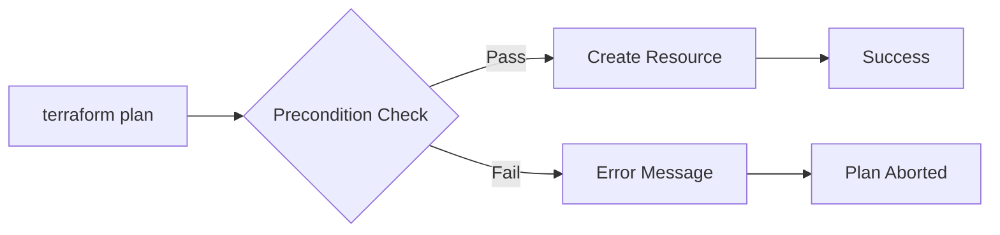
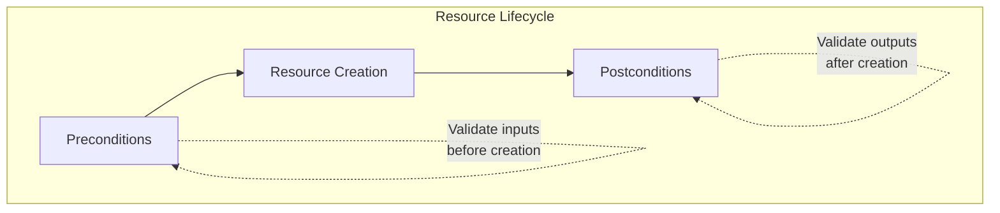
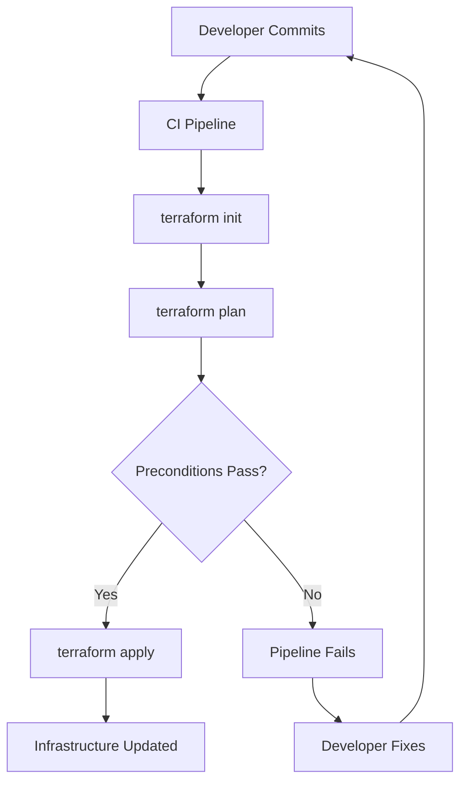

# How to Implement Terraform Preconditions

Author: [nawazdhandala](https://github.com/nawazdhandala)

Tags: Terraform, IaC, Validation, Preconditions

Description: Learn how to use Terraform preconditions to validate infrastructure assumptions before resources are created, preventing costly misconfigurations.

---

Terraform preconditions let you validate assumptions about your infrastructure before resources are created. Instead of discovering misconfigurations after deployment, you catch them during the plan phase. This saves time, prevents outages, and enforces organizational policies as code.

## What Are Preconditions?

Preconditions are validation blocks that run before Terraform creates or updates a resource. If the condition evaluates to false, Terraform fails the plan with your custom error message.



Preconditions differ from variable validation in a key way: they have access to other resources and data sources, not just the variable being validated.

## Basic Syntax

Preconditions live inside a `lifecycle` block within a resource or data source.

```hcl
resource "aws_instance" "web" {
  ami           = var.ami_id
  instance_type = var.instance_type

  lifecycle {
    precondition {
      condition     = var.instance_type != "t2.micro"
      error_message = "Production instances must use t2.small or larger."
    }
  }
}
```

## Preconditions vs Postconditions

Terraform offers both preconditions and postconditions. Understanding when to use each is important.



| Type | When It Runs | Use Case |
|------|--------------|----------|
| Precondition | Before resource creation | Validate inputs and assumptions |
| Postcondition | After resource creation | Verify resource was created correctly |

## Practical Examples

### Example 1: Validate AMI Region

Ensure an AMI exists in the target region before launching an instance.

```hcl
data "aws_ami" "ubuntu" {
  most_recent = true
  owners      = ["099720109477"]

  filter {
    name   = "name"
    values = ["ubuntu/images/hvm-ssd/ubuntu-jammy-22.04-amd64-server-*"]
  }
}

resource "aws_instance" "web" {
  ami           = data.aws_ami.ubuntu.id
  instance_type = var.instance_type

  lifecycle {
    precondition {
      condition     = data.aws_ami.ubuntu.architecture == "x86_64"
      error_message = "AMI must be x86_64 architecture for this instance type."
    }
  }
}
```

### Example 2: Enforce Environment-Specific Instance Types

Different environments require different resource sizes.

```hcl
variable "environment" {
  type = string
}

variable "instance_type" {
  type = string
}

locals {
  allowed_prod_types = ["m5.large", "m5.xlarge", "m5.2xlarge"]
  allowed_dev_types  = ["t3.micro", "t3.small", "t3.medium"]
}

resource "aws_instance" "app" {
  ami           = var.ami_id
  instance_type = var.instance_type

  lifecycle {
    precondition {
      condition = (
        var.environment == "production"
        ? contains(local.allowed_prod_types, var.instance_type)
        : contains(local.allowed_dev_types, var.instance_type)
      )
      error_message = "Instance type ${var.instance_type} is not allowed for ${var.environment} environment."
    }
  }
}
```

### Example 3: Validate Subnet Availability

Ensure a subnet has enough available IPs before deploying.

```hcl
data "aws_subnet" "selected" {
  id = var.subnet_id
}

resource "aws_instance" "cluster" {
  count         = var.instance_count
  ami           = var.ami_id
  instance_type = var.instance_type
  subnet_id     = var.subnet_id

  lifecycle {
    precondition {
      condition     = data.aws_subnet.selected.available_ip_address_count >= var.instance_count
      error_message = "Subnet ${var.subnet_id} only has ${data.aws_subnet.selected.available_ip_address_count} available IPs, but ${var.instance_count} are required."
    }
  }
}
```

### Example 4: Cross-Resource Validation

Validate that related resources are compatible.

```hcl
data "aws_vpc" "selected" {
  id = var.vpc_id
}

data "aws_subnet" "selected" {
  id = var.subnet_id
}

resource "aws_instance" "app" {
  ami           = var.ami_id
  instance_type = var.instance_type
  subnet_id     = var.subnet_id

  lifecycle {
    precondition {
      condition     = data.aws_subnet.selected.vpc_id == var.vpc_id
      error_message = "Subnet ${var.subnet_id} is not in VPC ${var.vpc_id}."
    }

    precondition {
      condition     = data.aws_vpc.selected.enable_dns_hostnames == true
      error_message = "VPC must have DNS hostnames enabled for this deployment."
    }
  }
}
```

### Example 5: Kubernetes Namespace Validation

Ensure a namespace exists before deploying resources to it.

```hcl
data "kubernetes_namespace" "target" {
  metadata {
    name = var.namespace
  }
}

resource "kubernetes_deployment" "app" {
  metadata {
    name      = "my-app"
    namespace = var.namespace
  }

  lifecycle {
    precondition {
      condition     = data.kubernetes_namespace.target.metadata[0].name == var.namespace
      error_message = "Namespace ${var.namespace} does not exist in the cluster."
    }
  }

  spec {
    replicas = var.replicas

    selector {
      match_labels = {
        app = "my-app"
      }
    }

    template {
      metadata {
        labels = {
          app = "my-app"
        }
      }

      spec {
        container {
          name  = "app"
          image = var.image
        }
      }
    }
  }
}
```

### Example 6: SSL Certificate Expiration Check

Prevent deployments if an SSL certificate is expiring soon.

```hcl
data "aws_acm_certificate" "cert" {
  domain   = var.domain_name
  statuses = ["ISSUED"]
}

resource "aws_lb_listener" "https" {
  load_balancer_arn = aws_lb.main.arn
  port              = 443
  protocol          = "HTTPS"
  certificate_arn   = data.aws_acm_certificate.cert.arn

  lifecycle {
    precondition {
      condition     = timecmp(data.aws_acm_certificate.cert.not_after, timeadd(timestamp(), "720h")) > 0
      error_message = "SSL certificate for ${var.domain_name} expires within 30 days. Renew before deploying."
    }
  }

  default_action {
    type             = "forward"
    target_group_arn = aws_lb_target_group.main.arn
  }
}
```

## Using Preconditions with Modules

Preconditions work inside modules to enforce usage contracts.

```hcl
# modules/web-server/main.tf
variable "instance_type" {
  type = string
}

variable "environment" {
  type = string
}

variable "min_cpu" {
  type    = number
  default = 2
}

data "aws_ec2_instance_type" "selected" {
  instance_type = var.instance_type
}

resource "aws_instance" "web" {
  ami           = var.ami_id
  instance_type = var.instance_type

  lifecycle {
    precondition {
      condition     = data.aws_ec2_instance_type.selected.default_vcpus >= var.min_cpu
      error_message = "Instance type ${var.instance_type} has ${data.aws_ec2_instance_type.selected.default_vcpus} vCPUs but minimum ${var.min_cpu} required."
    }

    precondition {
      condition     = var.environment != "production" || data.aws_ec2_instance_type.selected.memory_size >= 8192
      error_message = "Production instances require at least 8GB of memory."
    }
  }
}
```

## Combining Multiple Preconditions

You can add multiple precondition blocks to a single resource. All must pass for the resource to be created.

```hcl
resource "aws_db_instance" "main" {
  identifier        = var.db_identifier
  engine            = "postgres"
  engine_version    = var.engine_version
  instance_class    = var.instance_class
  allocated_storage = var.storage_size

  lifecycle {
    precondition {
      condition     = var.storage_size >= 100
      error_message = "Database storage must be at least 100GB."
    }

    precondition {
      condition     = can(regex("^db\\.(m5|r5)", var.instance_class))
      error_message = "Only m5 or r5 instance classes are approved for databases."
    }

    precondition {
      condition     = tonumber(split(".", var.engine_version)[0]) >= 14
      error_message = "PostgreSQL version must be 14 or higher."
    }
  }
}
```

## Workflow Integration



Preconditions integrate naturally with CI/CD pipelines. Failed preconditions cause `terraform plan` to exit with a non-zero status, stopping the pipeline before any changes are made.

## Best Practices

### Write Clear Error Messages

Bad:
```hcl
error_message = "Invalid configuration."
```

Good:
```hcl
error_message = "Instance type ${var.instance_type} has ${data.aws_ec2_instance_type.selected.default_vcpus} vCPUs but the application requires at least 4. Use m5.xlarge or larger."
```

### Use Data Sources for Dynamic Validation

Preconditions become powerful when combined with data sources that fetch real-time information about your infrastructure.

```hcl
data "aws_caller_identity" "current" {}
data "aws_region" "current" {}

resource "aws_s3_bucket" "sensitive" {
  bucket = var.bucket_name

  lifecycle {
    precondition {
      condition     = data.aws_region.current.name == "us-east-1"
      error_message = "Sensitive buckets must be created in us-east-1 for compliance."
    }
  }
}
```

### Group Related Validations

Keep related preconditions together and use comments to explain why each check exists.

```hcl
resource "aws_instance" "app" {
  ami           = var.ami_id
  instance_type = var.instance_type

  lifecycle {
    # Security requirements
    precondition {
      condition     = var.enable_monitoring == true
      error_message = "Detailed monitoring is required by security policy."
    }

    # Cost controls
    precondition {
      condition     = !can(regex("^(m5|r5)\\.(4|8|12|16|24)xlarge$", var.instance_type))
      error_message = "Instance types larger than 2xlarge require approval from the cost management team."
    }

    # Operational requirements
    precondition {
      condition     = length(var.tags) > 0
      error_message = "At least one tag is required for resource tracking."
    }
  }
}
```

## Common Patterns

| Pattern | Use Case |
|---------|----------|
| Region validation | Ensure resources deploy to approved regions |
| Size constraints | Enforce minimum or maximum resource sizes |
| Naming conventions | Validate resource names match standards |
| Tag requirements | Ensure required tags are present |
| Network validation | Verify subnets, CIDRs, and connectivity |
| Version checks | Enforce minimum software versions |
| Capacity checks | Verify quotas and available resources |

## Summary

Terraform preconditions shift validation left in your infrastructure workflow. Instead of discovering problems during apply or after deployment, you catch them during the plan phase. This approach:

- Reduces failed deployments
- Enforces organizational policies
- Provides clear error messages for operators
- Integrates seamlessly with CI/CD pipelines

Start with simple preconditions for your most common failure modes, then expand as you identify new patterns. Your future self will thank you when a precondition catches a misconfiguration at 2 AM instead of letting it reach production.

---

*Want to monitor your Terraform-managed infrastructure? [OneUptime](https://oneuptime.com) provides comprehensive observability for your entire stack, from the resources Terraform creates to the applications running on them.*
