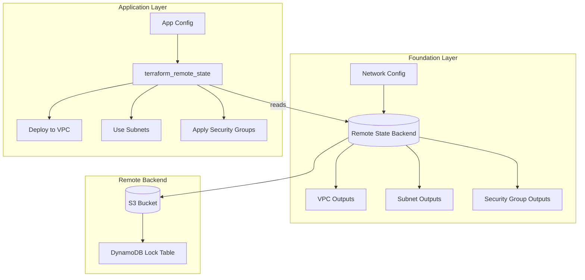
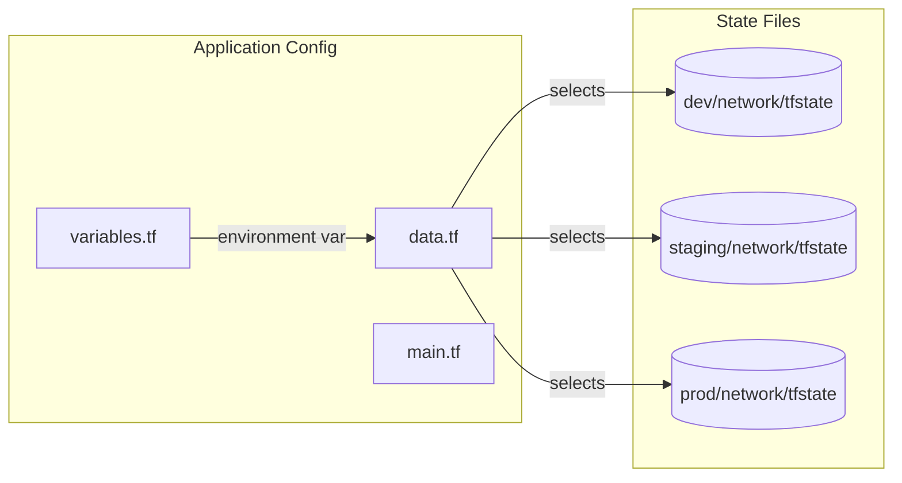
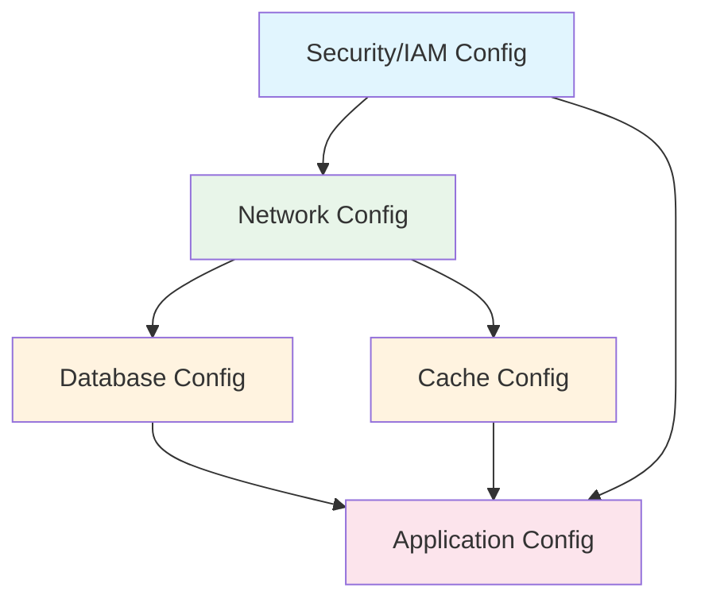
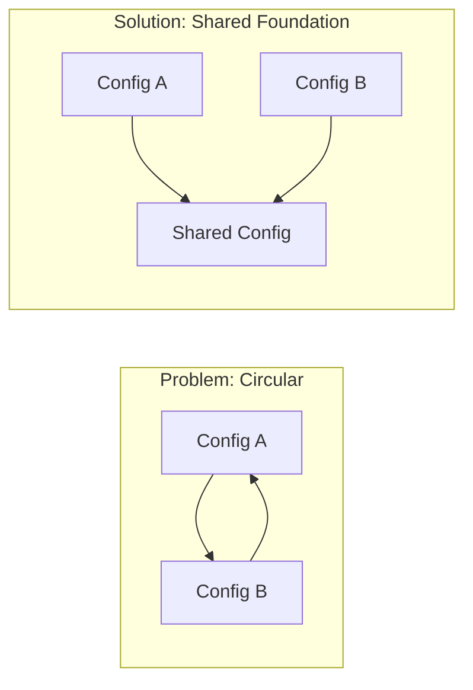

# How to Implement Terraform Remote State Data

Author: [nawazdhandala](https://github.com/nawazdhandala)

Tags: Terraform, IaC, State-Management, Remote-State

Description: Learn how to implement Terraform remote state data sources to share infrastructure outputs across configurations and teams.

Managing infrastructure at scale requires sharing state between different Terraform configurations. The `terraform_remote_state` data source enables you to access outputs from other Terraform state files, creating a powerful pattern for modular infrastructure management. This guide walks you through implementing remote state data sources effectively.

## Why Use Remote State Data?

When your infrastructure grows beyond a single Terraform configuration, you need a way to reference resources created by other configurations. Remote state data sources solve this problem by allowing read-only access to another configuration's state file.

Common use cases include:

- **Networking foundations**: VPC and subnet IDs shared across multiple applications
- **Security resources**: IAM roles, security groups, and certificates used by multiple services
- **Shared services**: Database endpoints, cache clusters, and message queues
- **Environment separation**: Production and staging configurations referencing common infrastructure

## Architecture Overview

The following diagram illustrates how remote state data flows between Terraform configurations:



## Setting Up the Remote Backend

Before you can share state between configurations, you need a centralized backend. AWS S3 with DynamoDB locking is a popular choice for production environments.

First, create the S3 bucket and DynamoDB table for state storage:

```hcl
# backend-setup/main.tf
provider "aws" {
  region = "us-east-1"
}

resource "aws_s3_bucket" "terraform_state" {
  bucket = "my-company-terraform-state"

  lifecycle {
    prevent_destroy = true
  }
}

resource "aws_s3_bucket_versioning" "terraform_state" {
  bucket = aws_s3_bucket.terraform_state.id
  versioning_configuration {
    status = "Enabled"
  }
}

resource "aws_s3_bucket_server_side_encryption_configuration" "terraform_state" {
  bucket = aws_s3_bucket.terraform_state.id

  rule {
    apply_server_side_encryption_by_default {
      sse_algorithm = "aws:kms"
    }
  }
}

resource "aws_dynamodb_table" "terraform_locks" {
  name         = "terraform-state-locks"
  billing_mode = "PAY_PER_REQUEST"
  hash_key     = "LockID"

  attribute {
    name = "LockID"
    type = "S"
  }
}
```

## Creating the Foundation Configuration

The foundation configuration creates shared infrastructure and exposes key attributes through outputs. These outputs become available to other configurations via remote state.

Configure the backend for your network foundation:

```hcl
# foundation/backend.tf
terraform {
  backend "s3" {
    bucket         = "my-company-terraform-state"
    key            = "foundation/network/terraform.tfstate"
    region         = "us-east-1"
    encrypt        = true
    dynamodb_table = "terraform-state-locks"
  }
}
```

Define the shared network resources and their outputs:

```hcl
# foundation/main.tf
provider "aws" {
  region = var.region
}

resource "aws_vpc" "main" {
  cidr_block           = var.vpc_cidr
  enable_dns_hostnames = true
  enable_dns_support   = true

  tags = {
    Name        = "${var.environment}-vpc"
    Environment = var.environment
    ManagedBy   = "terraform"
  }
}

resource "aws_subnet" "private" {
  count             = length(var.private_subnet_cidrs)
  vpc_id            = aws_vpc.main.id
  cidr_block        = var.private_subnet_cidrs[count.index]
  availability_zone = var.availability_zones[count.index]

  tags = {
    Name        = "${var.environment}-private-${count.index + 1}"
    Environment = var.environment
    Type        = "private"
  }
}

resource "aws_subnet" "public" {
  count                   = length(var.public_subnet_cidrs)
  vpc_id                  = aws_vpc.main.id
  cidr_block              = var.public_subnet_cidrs[count.index]
  availability_zone       = var.availability_zones[count.index]
  map_public_ip_on_launch = true

  tags = {
    Name        = "${var.environment}-public-${count.index + 1}"
    Environment = var.environment
    Type        = "public"
  }
}

resource "aws_security_group" "common" {
  name_prefix = "${var.environment}-common-"
  vpc_id      = aws_vpc.main.id
  description = "Common security group for internal communication"

  ingress {
    from_port   = 0
    to_port     = 0
    protocol    = "-1"
    cidr_blocks = [var.vpc_cidr]
    description = "Allow all internal traffic"
  }

  egress {
    from_port   = 0
    to_port     = 0
    protocol    = "-1"
    cidr_blocks = ["0.0.0.0/0"]
    description = "Allow all outbound traffic"
  }

  tags = {
    Name        = "${var.environment}-common-sg"
    Environment = var.environment
  }
}
```

Define outputs that other configurations will consume:

```hcl
# foundation/outputs.tf
output "vpc_id" {
  description = "The ID of the VPC"
  value       = aws_vpc.main.id
}

output "vpc_cidr" {
  description = "The CIDR block of the VPC"
  value       = aws_vpc.main.cidr_block
}

output "private_subnet_ids" {
  description = "List of private subnet IDs"
  value       = aws_subnet.private[*].id
}

output "public_subnet_ids" {
  description = "List of public subnet IDs"
  value       = aws_subnet.public[*].id
}

output "common_security_group_id" {
  description = "ID of the common security group"
  value       = aws_security_group.common.id
}

output "availability_zones" {
  description = "List of availability zones used"
  value       = var.availability_zones
}

output "environment" {
  description = "The environment name"
  value       = var.environment
}
```

## Consuming Remote State in Application Configurations

Now create an application configuration that references the foundation infrastructure. The `terraform_remote_state` data source retrieves outputs from the foundation state.

Configure the application backend and remote state data source:

```hcl
# application/backend.tf
terraform {
  backend "s3" {
    bucket         = "my-company-terraform-state"
    key            = "applications/web-service/terraform.tfstate"
    region         = "us-east-1"
    encrypt        = true
    dynamodb_table = "terraform-state-locks"
  }
}

# application/data.tf
data "terraform_remote_state" "foundation" {
  backend = "s3"

  config = {
    bucket = "my-company-terraform-state"
    key    = "foundation/network/terraform.tfstate"
    region = "us-east-1"
  }
}
```

Use the remote state outputs to deploy application resources:

```hcl
# application/main.tf
provider "aws" {
  region = "us-east-1"
}

locals {
  vpc_id             = data.terraform_remote_state.foundation.outputs.vpc_id
  private_subnet_ids = data.terraform_remote_state.foundation.outputs.private_subnet_ids
  common_sg_id       = data.terraform_remote_state.foundation.outputs.common_security_group_id
  environment        = data.terraform_remote_state.foundation.outputs.environment
}

resource "aws_security_group" "web" {
  name_prefix = "${local.environment}-web-"
  vpc_id      = local.vpc_id
  description = "Security group for web service"

  ingress {
    from_port       = 443
    to_port         = 443
    protocol        = "tcp"
    cidr_blocks     = ["0.0.0.0/0"]
    description     = "HTTPS from anywhere"
  }

  ingress {
    from_port       = 80
    to_port         = 80
    protocol        = "tcp"
    cidr_blocks     = ["0.0.0.0/0"]
    description     = "HTTP from anywhere"
  }

  egress {
    from_port   = 0
    to_port     = 0
    protocol    = "-1"
    cidr_blocks = ["0.0.0.0/0"]
  }

  tags = {
    Name        = "${local.environment}-web-sg"
    Environment = local.environment
  }
}

resource "aws_lb" "web" {
  name               = "${local.environment}-web-alb"
  internal           = false
  load_balancer_type = "application"
  security_groups    = [aws_security_group.web.id, local.common_sg_id]
  subnets            = data.terraform_remote_state.foundation.outputs.public_subnet_ids

  tags = {
    Name        = "${local.environment}-web-alb"
    Environment = local.environment
  }
}

resource "aws_ecs_cluster" "web" {
  name = "${local.environment}-web-cluster"

  setting {
    name  = "containerInsights"
    value = "enabled"
  }

  tags = {
    Name        = "${local.environment}-web-cluster"
    Environment = local.environment
  }
}

resource "aws_ecs_service" "web" {
  name            = "${local.environment}-web-service"
  cluster         = aws_ecs_cluster.web.id
  task_definition = aws_ecs_task_definition.web.arn
  desired_count   = var.desired_count
  launch_type     = "FARGATE"

  network_configuration {
    subnets          = local.private_subnet_ids
    security_groups  = [aws_security_group.web.id, local.common_sg_id]
    assign_public_ip = false
  }

  load_balancer {
    target_group_arn = aws_lb_target_group.web.arn
    container_name   = "web"
    container_port   = 8080
  }
}
```

## Multi-Environment Pattern

For organizations managing multiple environments, you can parameterize the remote state configuration. This pattern allows the same application code to reference different foundation states based on the target environment.



Create a variable-driven remote state configuration:

```hcl
# application/variables.tf
variable "environment" {
  description = "Environment name (dev, staging, prod)"
  type        = string
}

variable "state_bucket" {
  description = "S3 bucket for Terraform state"
  type        = string
  default     = "my-company-terraform-state"
}

variable "state_region" {
  description = "AWS region for state bucket"
  type        = string
  default     = "us-east-1"
}

# application/data.tf
data "terraform_remote_state" "foundation" {
  backend = "s3"

  config = {
    bucket = var.state_bucket
    key    = "${var.environment}/network/terraform.tfstate"
    region = var.state_region
  }
}
```

Deploy to different environments using tfvars files:

```hcl
# environments/dev.tfvars
environment   = "dev"
desired_count = 1

# environments/staging.tfvars
environment   = "staging"
desired_count = 2

# environments/prod.tfvars
environment   = "prod"
desired_count = 4
```

Apply the configuration for a specific environment:

```bash
# Deploy to development
terraform apply -var-file=environments/dev.tfvars

# Deploy to production
terraform apply -var-file=environments/prod.tfvars
```

## Working with Multiple Remote States

Complex infrastructures often require data from multiple remote state files. You can define multiple `terraform_remote_state` data sources to combine outputs from different configurations.

```hcl
# application/data.tf
data "terraform_remote_state" "network" {
  backend = "s3"
  config = {
    bucket = var.state_bucket
    key    = "${var.environment}/network/terraform.tfstate"
    region = var.state_region
  }
}

data "terraform_remote_state" "database" {
  backend = "s3"
  config = {
    bucket = var.state_bucket
    key    = "${var.environment}/database/terraform.tfstate"
    region = var.state_region
  }
}

data "terraform_remote_state" "security" {
  backend = "s3"
  config = {
    bucket = var.state_bucket
    key    = "shared/security/terraform.tfstate"
    region = var.state_region
  }
}

locals {
  # Network outputs
  vpc_id             = data.terraform_remote_state.network.outputs.vpc_id
  private_subnet_ids = data.terraform_remote_state.network.outputs.private_subnet_ids

  # Database outputs
  db_endpoint        = data.terraform_remote_state.database.outputs.db_endpoint
  db_port            = data.terraform_remote_state.database.outputs.db_port
  db_security_group  = data.terraform_remote_state.database.outputs.security_group_id

  # Security outputs (shared across environments)
  kms_key_arn        = data.terraform_remote_state.security.outputs.kms_key_arn
  ssl_certificate    = data.terraform_remote_state.security.outputs.ssl_certificate_arn
}
```

## State Dependency Flow

Understanding the dependency flow helps prevent circular references and ensures proper deployment order:



## Handling Missing or Invalid State

When the remote state might not exist or could be temporarily unavailable, implement defensive patterns:

```hcl
# application/data.tf
data "terraform_remote_state" "optional_feature" {
  backend = "s3"
  config = {
    bucket = var.state_bucket
    key    = "${var.environment}/optional-feature/terraform.tfstate"
    region = var.state_region
  }

  defaults = {
    feature_enabled = false
    feature_endpoint = ""
  }
}

# application/main.tf
locals {
  # Use default if state doesn't exist or output is missing
  feature_enabled  = try(data.terraform_remote_state.optional_feature.outputs.feature_enabled, false)
  feature_endpoint = try(data.terraform_remote_state.optional_feature.outputs.feature_endpoint, "")
}

resource "aws_ssm_parameter" "feature_config" {
  count = local.feature_enabled ? 1 : 0

  name  = "/${var.environment}/app/feature-endpoint"
  type  = "String"
  value = local.feature_endpoint
}
```

## Best Practices

Following these practices ensures reliable and maintainable remote state configurations:

### 1. Organize State Files Logically

Structure your state file paths to reflect your infrastructure hierarchy:

```
terraform-state/
  shared/
    security/terraform.tfstate
    dns/terraform.tfstate
  dev/
    network/terraform.tfstate
    database/terraform.tfstate
    applications/
      web/terraform.tfstate
      api/terraform.tfstate
  prod/
    network/terraform.tfstate
    database/terraform.tfstate
    applications/
      web/terraform.tfstate
      api/terraform.tfstate
```

### 2. Minimize Output Surface Area

Only expose outputs that other configurations genuinely need. This reduces coupling and simplifies maintenance:

```hcl
# Good: Specific, intentional outputs
output "vpc_id" {
  value = aws_vpc.main.id
}

output "private_subnet_ids" {
  value = aws_subnet.private[*].id
}

# Avoid: Exposing entire resources
# output "vpc" {
#   value = aws_vpc.main
# }
```

### 3. Use Consistent Naming

Establish naming conventions for state file keys and output names:

```hcl
# Consistent output naming pattern
output "vpc_id" { }
output "vpc_cidr" { }
output "private_subnet_ids" { }
output "public_subnet_ids" { }
output "nat_gateway_ids" { }
```

### 4. Document Dependencies

Add comments documenting which configurations consume your outputs:

```hcl
# Consumed by:
# - applications/web-service
# - applications/api-service
# - databases/primary
output "private_subnet_ids" {
  description = "Private subnet IDs for application deployments"
  value       = aws_subnet.private[*].id
}
```

### 5. Version Your State Schema

When making breaking changes to outputs, communicate with consuming teams and coordinate migrations:

```hcl
# Deprecated: Use private_subnet_ids instead
# Removal planned for Q2 2026
output "app_subnet_ids" {
  description = "DEPRECATED: Use private_subnet_ids"
  value       = aws_subnet.private[*].id
}

# New standardized output
output "private_subnet_ids" {
  description = "Private subnet IDs for application deployments"
  value       = aws_subnet.private[*].id
}
```

## Troubleshooting Common Issues

### State File Not Found

If you encounter "Unable to find remote state" errors, verify:

1. The state file exists at the specified key
2. Your AWS credentials have read access to the bucket
3. The bucket name and region are correct

```bash
# Verify state file exists
aws s3 ls s3://my-company-terraform-state/foundation/network/

# Check bucket policy
aws s3api get-bucket-policy --bucket my-company-terraform-state
```

### Output Not Available

When an expected output is missing:

1. Confirm the output is defined in the source configuration
2. Verify the source configuration has been applied
3. Check for typos in the output name

```bash
# List outputs from a state file
terraform state pull | jq '.outputs'
```

### Circular Dependencies

If configurations have circular dependencies, refactor to break the cycle:



## Conclusion

Terraform remote state data sources provide a robust mechanism for sharing infrastructure state across configurations. By organizing your state files logically, exposing intentional outputs, and following defensive coding patterns, you can build maintainable, scalable infrastructure that supports team collaboration and environment consistency.

Start with a clear state file hierarchy, establish naming conventions early, and document the dependencies between your configurations. As your infrastructure grows, these practices will keep your Terraform codebase manageable and your deployments reliable.

---

*Need help monitoring your Terraform-provisioned infrastructure? [OneUptime](https://oneuptime.com) provides comprehensive observability for your cloud resources, with a native [Terraform provider](https://registry.terraform.io/providers/oneuptime/oneuptime) to manage your monitoring as code.*
