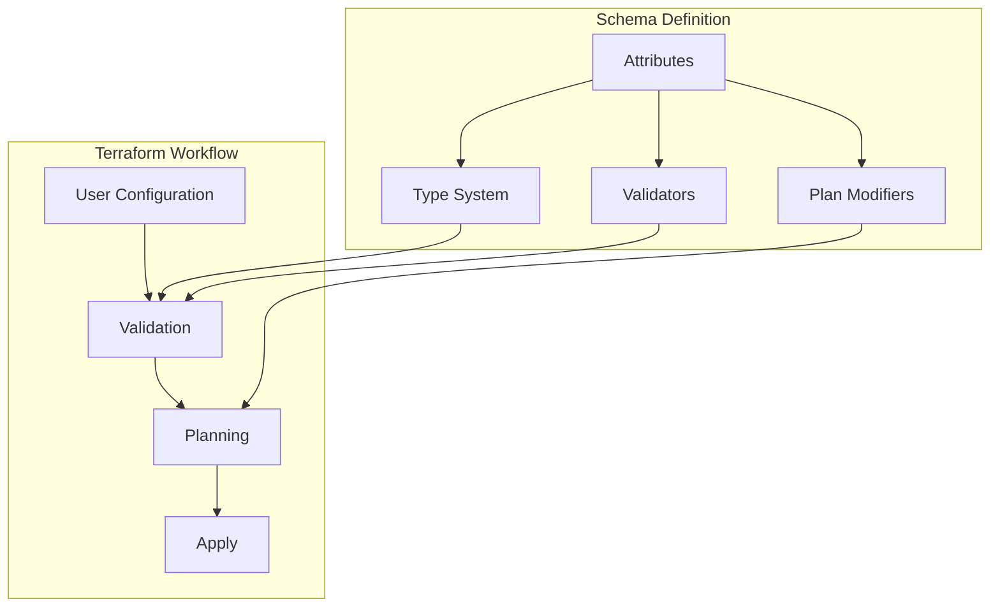
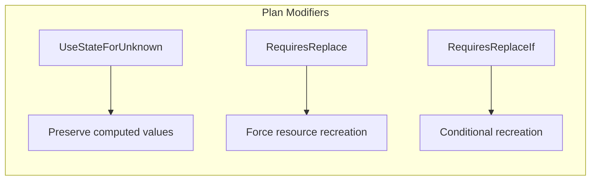

# How to Create Terraform Resource Schemas

Author: [nawazdhandala](https://github.com/nawazdhandala)

Tags: Terraform, IaC, Go, DevOps

Description: A practical guide to building custom Terraform provider resource schemas using the Terraform Plugin Framework, covering schema types, attributes, validators, and real-world implementation patterns.

---

Terraform providers allow you to manage any API or service through infrastructure as code. The foundation of every provider is the resource schema, which defines what configuration options users can specify and how Terraform validates and processes those inputs.

## Understanding Resource Schemas

A resource schema defines the structure of a Terraform resource. It tells Terraform what attributes exist, their types, which are required or optional, and how to validate user input.



### Schema Components

| Component | Purpose |
|-----------|---------|
| Attributes | Define configuration fields users can set |
| Nested Attributes | Group related fields into objects or lists |
| Validators | Enforce constraints on attribute values |
| Plan Modifiers | Control how changes are detected and planned |
| Descriptions | Document attributes for users and generated docs |

## Setting Up a Provider Project

Before creating schemas, set up your provider project structure.

### Project Initialization

```bash
# Create project directory
mkdir terraform-provider-example && cd terraform-provider-example

# Initialize Go module
go mod init github.com/example/terraform-provider-example

# Install the Terraform Plugin Framework
go get github.com/hashicorp/terraform-plugin-framework
go get github.com/hashicorp/terraform-plugin-go
```

### Project Structure

```
terraform-provider-example/
├── internal/
│   └── provider/
│       ├── provider.go
│       ├── server_resource.go
│       └── server_resource_test.go
├── main.go
├── go.mod
└── go.sum
```

## Creating Your First Resource Schema

Let's build a schema for a hypothetical "server" resource that manages virtual machines.

### Basic Schema Structure

The following code defines a resource schema with common attribute types. Each attribute specifies its type, whether it's required or optional, and documentation for users.

```go
package provider

import (
    "context"

    "github.com/hashicorp/terraform-plugin-framework/resource"
    "github.com/hashicorp/terraform-plugin-framework/resource/schema"
    "github.com/hashicorp/terraform-plugin-framework/resource/schema/planmodifier"
    "github.com/hashicorp/terraform-plugin-framework/resource/schema/stringplanmodifier"
    "github.com/hashicorp/terraform-plugin-framework/types"
)

// serverResource implements the resource.Resource interface
type serverResource struct {
    // client would typically hold your API client
    client *APIClient
}

// Ensure the implementation satisfies the expected interfaces
var (
    _ resource.Resource              = &serverResource{}
    _ resource.ResourceWithConfigure = &serverResource{}
)

// NewServerResource creates a new resource instance
func NewServerResource() resource.Resource {
    return &serverResource{}
}

// Metadata returns the resource type name
func (r *serverResource) Metadata(_ context.Context, req resource.MetadataRequest, resp *resource.MetadataResponse) {
    resp.TypeName = req.ProviderTypeName + "_server"
}

// Schema defines the structure of the resource configuration
func (r *serverResource) Schema(_ context.Context, _ resource.SchemaRequest, resp *resource.SchemaResponse) {
    resp.Schema = schema.Schema{
        // This description appears in generated documentation
        Description: "Manages a virtual server instance.",

        Attributes: map[string]schema.Attribute{
            // ID is computed by the API and used for imports
            "id": schema.StringAttribute{
                Description: "Unique identifier for the server.",
                Computed:    true,
                PlanModifiers: []planmodifier.String{
                    stringplanmodifier.UseStateForUnknown(),
                },
            },

            // Required string attribute
            "name": schema.StringAttribute{
                Description: "Name of the server. Must be unique within the project.",
                Required:    true,
            },

            // Required string with specific allowed values
            "region": schema.StringAttribute{
                Description: "Region where the server will be deployed.",
                Required:    true,
                PlanModifiers: []planmodifier.String{
                    // Changing region requires recreating the resource
                    stringplanmodifier.RequiresReplace(),
                },
            },

            // Optional string with default value
            "size": schema.StringAttribute{
                Description: "Server size/type. Defaults to 'small'.",
                Optional:    true,
                Computed:    true,
            },

            // Optional integer
            "cpu_cores": schema.Int64Attribute{
                Description: "Number of CPU cores allocated to the server.",
                Optional:    true,
                Computed:    true,
            },

            // Optional boolean
            "ipv6_enabled": schema.BoolAttribute{
                Description: "Enable IPv6 networking for this server.",
                Optional:    true,
            },

            // Computed attributes are set by the API
            "ip_address": schema.StringAttribute{
                Description: "Public IPv4 address assigned to the server.",
                Computed:    true,
            },

            "created_at": schema.StringAttribute{
                Description: "Timestamp when the server was created.",
                Computed:    true,
            },
        },
    }
}
```

## Working with Attribute Types

The Terraform Plugin Framework provides various attribute types for different data structures.

### Primitive Types

These are the basic building blocks for schema attributes. Each type maps to a corresponding Go type in your resource model.

```go
// String attributes for text values
"hostname": schema.StringAttribute{
    Description: "Server hostname.",
    Required:    true,
},

// Integer attributes for whole numbers
"memory_mb": schema.Int64Attribute{
    Description: "Memory allocation in megabytes.",
    Required:    true,
},

// Float attributes for decimal numbers
"price_per_hour": schema.Float64Attribute{
    Description: "Hourly cost of the server.",
    Computed:    true,
},

// Boolean attributes for true/false values
"monitoring_enabled": schema.BoolAttribute{
    Description: "Enable monitoring for this server.",
    Optional:    true,
},
```

### Collection Types

Collections allow users to specify multiple values. Lists maintain order, sets do not allow duplicates, and maps provide key-value pairs.

```go
// List of strings for ordered collections
"tags": schema.ListAttribute{
    Description: "List of tags to apply to the server.",
    Optional:    true,
    ElementType: types.StringType,
},

// Set of strings for unique unordered collections
"security_groups": schema.SetAttribute{
    Description: "Security groups to attach to the server.",
    Optional:    true,
    ElementType: types.StringType,
},

// Map of strings for key-value pairs
"labels": schema.MapAttribute{
    Description: "Labels to apply to the server as key-value pairs.",
    Optional:    true,
    ElementType: types.StringType,
},
```

### Nested Attributes

Nested attributes group related fields together. Single nested attributes represent a single object, while list nested attributes represent a collection of objects.

```go
// Single nested attribute for a structured object
"network_config": schema.SingleNestedAttribute{
    Description: "Network configuration for the server.",
    Optional:    true,
    Attributes: map[string]schema.Attribute{
        "vpc_id": schema.StringAttribute{
            Description: "VPC ID to place the server in.",
            Required:    true,
        },
        "subnet_id": schema.StringAttribute{
            Description: "Subnet ID within the VPC.",
            Required:    true,
        },
        "private_ip": schema.StringAttribute{
            Description: "Private IP address to assign.",
            Optional:    true,
            Computed:    true,
        },
    },
},

// List nested attribute for multiple structured objects
"volumes": schema.ListNestedAttribute{
    Description: "Block storage volumes to attach.",
    Optional:    true,
    NestedObject: schema.NestedAttributeObject{
        Attributes: map[string]schema.Attribute{
            "name": schema.StringAttribute{
                Description: "Name of the volume.",
                Required:    true,
            },
            "size_gb": schema.Int64Attribute{
                Description: "Size of the volume in gigabytes.",
                Required:    true,
            },
            "type": schema.StringAttribute{
                Description: "Volume type (ssd or hdd).",
                Optional:    true,
            },
            "mount_path": schema.StringAttribute{
                Description: "Mount path on the server.",
                Required:    true,
            },
        },
    },
},
```

## Adding Validators

Validators ensure users provide valid configuration values before Terraform attempts to create or update resources.

### Built-in Validators

The Plugin Framework includes validators for common patterns. Import them from the appropriate validator package for your attribute type.

```go
import (
    "github.com/hashicorp/terraform-plugin-framework-validators/int64validator"
    "github.com/hashicorp/terraform-plugin-framework-validators/stringvalidator"
    "github.com/hashicorp/terraform-plugin-framework/schema/validator"
)

// String validation examples
"name": schema.StringAttribute{
    Description: "Server name. Must be 3-64 characters.",
    Required:    true,
    Validators: []validator.String{
        // Enforce length constraints
        stringvalidator.LengthBetween(3, 64),
        // Require matching a regex pattern
        stringvalidator.RegexMatches(
            regexp.MustCompile(`^[a-z][a-z0-9-]*[a-z0-9]$`),
            "must start with a letter, contain only lowercase letters, numbers, and hyphens, and end with a letter or number",
        ),
    },
},

// Enum validation with allowed values
"size": schema.StringAttribute{
    Description: "Server size.",
    Required:    true,
    Validators: []validator.String{
        stringvalidator.OneOf("small", "medium", "large", "xlarge"),
    },
},

// Integer validation with range
"cpu_cores": schema.Int64Attribute{
    Description: "Number of CPU cores (1-32).",
    Required:    true,
    Validators: []validator.Int64{
        int64validator.Between(1, 32),
    },
},

// Integer validation with specific values
"memory_gb": schema.Int64Attribute{
    Description: "Memory in GB. Must be a power of 2.",
    Required:    true,
    Validators: []validator.Int64{
        int64validator.OneOf(1, 2, 4, 8, 16, 32, 64),
    },
},
```

### Custom Validators

For complex validation logic, create custom validators by implementing the validator interface.

```go
package validators

import (
    "context"
    "fmt"
    "net"

    "github.com/hashicorp/terraform-plugin-framework/schema/validator"
)

// ipAddressValidator validates that a string is a valid IP address
type ipAddressValidator struct{}

// Description returns the validator description for documentation
func (v ipAddressValidator) Description(_ context.Context) string {
    return "value must be a valid IPv4 or IPv6 address"
}

// MarkdownDescription returns the markdown description for documentation
func (v ipAddressValidator) MarkdownDescription(ctx context.Context) string {
    return v.Description(ctx)
}

// ValidateString performs the validation
func (v ipAddressValidator) ValidateString(ctx context.Context, req validator.StringRequest, resp *validator.StringResponse) {
    // Skip validation if the value is unknown or null
    if req.ConfigValue.IsUnknown() || req.ConfigValue.IsNull() {
        return
    }

    value := req.ConfigValue.ValueString()

    if net.ParseIP(value) == nil {
        resp.Diagnostics.AddAttributeError(
            req.Path,
            "Invalid IP Address",
            fmt.Sprintf("The value %q is not a valid IP address.", value),
        )
    }
}

// IPAddress returns a new IP address validator
func IPAddress() validator.String {
    return ipAddressValidator{}
}
```

Use the custom validator in your schema.

```go
"allowed_ip": schema.StringAttribute{
    Description: "IP address allowed to access the server.",
    Optional:    true,
    Validators: []validator.String{
        validators.IPAddress(),
    },
},
```

## Plan Modifiers

Plan modifiers control how Terraform detects and plans changes to resources.



### Common Plan Modifiers

Plan modifiers tell Terraform how to handle attribute values during planning. UseStateForUnknown preserves computed values, while RequiresReplace forces resource recreation when the value changes.

```go
import (
    "github.com/hashicorp/terraform-plugin-framework/resource/schema/boolplanmodifier"
    "github.com/hashicorp/terraform-plugin-framework/resource/schema/int64planmodifier"
    "github.com/hashicorp/terraform-plugin-framework/resource/schema/planmodifier"
    "github.com/hashicorp/terraform-plugin-framework/resource/schema/stringplanmodifier"
)

// Preserve computed value across applies
"id": schema.StringAttribute{
    Computed: true,
    PlanModifiers: []planmodifier.String{
        stringplanmodifier.UseStateForUnknown(),
    },
},

// Force replacement when attribute changes
"region": schema.StringAttribute{
    Required: true,
    PlanModifiers: []planmodifier.String{
        stringplanmodifier.RequiresReplace(),
    },
},

// Conditional replacement based on logic
"image_id": schema.StringAttribute{
    Required: true,
    PlanModifiers: []planmodifier.String{
        stringplanmodifier.RequiresReplaceIf(
            func(ctx context.Context, req planmodifier.StringRequest, resp *stringplanmodifier.RequiresReplaceIfFuncResponse) {
                // Only require replace if changing to a different OS family
                resp.RequiresReplace = isDifferentOSFamily(req.StateValue, req.PlanValue)
            },
            "Changing to a different OS family requires replacement.",
            "Changing to a different OS family requires replacement.",
        ),
    },
},
```

### Custom Plan Modifiers

Create custom plan modifiers for complex planning logic, such as setting default values from other attributes.

```go
package planmodifiers

import (
    "context"
    "fmt"

    "github.com/hashicorp/terraform-plugin-framework/resource/schema/planmodifier"
    "github.com/hashicorp/terraform-plugin-framework/types"
)

// defaultFromAttribute sets a default value from another attribute
type defaultFromAttribute struct {
    attributeName string
}

func (m defaultFromAttribute) Description(_ context.Context) string {
    return fmt.Sprintf("defaults to the value of %s if not set", m.attributeName)
}

func (m defaultFromAttribute) MarkdownDescription(ctx context.Context) string {
    return m.Description(ctx)
}

func (m defaultFromAttribute) PlanModifyString(ctx context.Context, req planmodifier.StringRequest, resp *planmodifier.StringResponse) {
    // If the value is already set, do nothing
    if !req.PlanValue.IsUnknown() && !req.PlanValue.IsNull() {
        return
    }

    // Get the value from the other attribute
    var sourceValue types.String
    diags := req.Plan.GetAttribute(ctx, path.Root(m.attributeName), &sourceValue)
    resp.Diagnostics.Append(diags...)
    if resp.Diagnostics.HasError() {
        return
    }

    if !sourceValue.IsNull() && !sourceValue.IsUnknown() {
        resp.PlanValue = sourceValue
    }
}

// DefaultFromAttribute returns a plan modifier that sets a default from another attribute
func DefaultFromAttribute(attributeName string) planmodifier.String {
    return defaultFromAttribute{attributeName: attributeName}
}
```

## Defining the Resource Model

The resource model is a Go struct that mirrors your schema. Terraform uses this struct to read and write configuration values.

```go
package provider

import "github.com/hashicorp/terraform-plugin-framework/types"

// serverResourceModel maps the resource schema to a Go struct
type serverResourceModel struct {
    // Matches the "id" attribute in the schema
    ID types.String `tfsdk:"id"`

    // Matches the "name" attribute
    Name types.String `tfsdk:"name"`

    // Matches the "region" attribute
    Region types.String `tfsdk:"region"`

    // Matches the "size" attribute
    Size types.String `tfsdk:"size"`

    // Matches the "cpu_cores" attribute
    CPUCores types.Int64 `tfsdk:"cpu_cores"`

    // Matches the "ipv6_enabled" attribute
    IPv6Enabled types.Bool `tfsdk:"ipv6_enabled"`

    // Matches the "ip_address" attribute
    IPAddress types.String `tfsdk:"ip_address"`

    // Matches the "created_at" attribute
    CreatedAt types.String `tfsdk:"created_at"`

    // Matches the "tags" list attribute
    Tags types.List `tfsdk:"tags"`

    // Matches the "labels" map attribute
    Labels types.Map `tfsdk:"labels"`

    // Matches the "network_config" nested attribute
    NetworkConfig *networkConfigModel `tfsdk:"network_config"`

    // Matches the "volumes" list nested attribute
    Volumes []volumeModel `tfsdk:"volumes"`
}

// networkConfigModel maps the nested network_config attribute
type networkConfigModel struct {
    VPCID     types.String `tfsdk:"vpc_id"`
    SubnetID  types.String `tfsdk:"subnet_id"`
    PrivateIP types.String `tfsdk:"private_ip"`
}

// volumeModel maps each item in the volumes list
type volumeModel struct {
    Name      types.String `tfsdk:"name"`
    SizeGB    types.Int64  `tfsdk:"size_gb"`
    Type      types.String `tfsdk:"type"`
    MountPath types.String `tfsdk:"mount_path"`
}
```

## Implementing CRUD Operations

With the schema and model defined, implement the CRUD operations that interact with your API.

```go
package provider

import (
    "context"
    "fmt"

    "github.com/hashicorp/terraform-plugin-framework/resource"
    "github.com/hashicorp/terraform-plugin-framework/types"
)

// Create implements resource.Resource
func (r *serverResource) Create(ctx context.Context, req resource.CreateRequest, resp *resource.CreateResponse) {
    // Read the planned configuration into our model
    var plan serverResourceModel
    diags := req.Plan.Get(ctx, &plan)
    resp.Diagnostics.Append(diags...)
    if resp.Diagnostics.HasError() {
        return
    }

    // Build the API request from the model
    createReq := &CreateServerRequest{
        Name:        plan.Name.ValueString(),
        Region:      plan.Region.ValueString(),
        Size:        plan.Size.ValueString(),
        IPv6Enabled: plan.IPv6Enabled.ValueBool(),
    }

    // Call your API
    server, err := r.client.CreateServer(ctx, createReq)
    if err != nil {
        resp.Diagnostics.AddError(
            "Error creating server",
            fmt.Sprintf("Could not create server: %s", err),
        )
        return
    }

    // Map the API response back to the model
    plan.ID = types.StringValue(server.ID)
    plan.IPAddress = types.StringValue(server.IPAddress)
    plan.CreatedAt = types.StringValue(server.CreatedAt)

    // Set computed values that have defaults
    if plan.Size.IsUnknown() {
        plan.Size = types.StringValue(server.Size)
    }
    if plan.CPUCores.IsUnknown() {
        plan.CPUCores = types.Int64Value(server.CPUCores)
    }

    // Save the state
    diags = resp.State.Set(ctx, plan)
    resp.Diagnostics.Append(diags...)
}

// Read implements resource.Resource
func (r *serverResource) Read(ctx context.Context, req resource.ReadRequest, resp *resource.ReadResponse) {
    // Read current state
    var state serverResourceModel
    diags := req.State.Get(ctx, &state)
    resp.Diagnostics.Append(diags...)
    if resp.Diagnostics.HasError() {
        return
    }

    // Fetch current state from API
    server, err := r.client.GetServer(ctx, state.ID.ValueString())
    if err != nil {
        resp.Diagnostics.AddError(
            "Error reading server",
            fmt.Sprintf("Could not read server %s: %s", state.ID.ValueString(), err),
        )
        return
    }

    // Update model with current values
    state.Name = types.StringValue(server.Name)
    state.Region = types.StringValue(server.Region)
    state.Size = types.StringValue(server.Size)
    state.CPUCores = types.Int64Value(server.CPUCores)
    state.IPAddress = types.StringValue(server.IPAddress)
    state.CreatedAt = types.StringValue(server.CreatedAt)

    // Save updated state
    diags = resp.State.Set(ctx, state)
    resp.Diagnostics.Append(diags...)
}

// Update implements resource.Resource
func (r *serverResource) Update(ctx context.Context, req resource.UpdateRequest, resp *resource.UpdateResponse) {
    // Read planned changes
    var plan serverResourceModel
    diags := req.Plan.Get(ctx, &plan)
    resp.Diagnostics.Append(diags...)
    if resp.Diagnostics.HasError() {
        return
    }

    // Build update request
    updateReq := &UpdateServerRequest{
        Name:        plan.Name.ValueString(),
        Size:        plan.Size.ValueString(),
        IPv6Enabled: plan.IPv6Enabled.ValueBool(),
    }

    // Call your API
    server, err := r.client.UpdateServer(ctx, plan.ID.ValueString(), updateReq)
    if err != nil {
        resp.Diagnostics.AddError(
            "Error updating server",
            fmt.Sprintf("Could not update server %s: %s", plan.ID.ValueString(), err),
        )
        return
    }

    // Update computed fields
    plan.IPAddress = types.StringValue(server.IPAddress)
    plan.CPUCores = types.Int64Value(server.CPUCores)

    // Save state
    diags = resp.State.Set(ctx, plan)
    resp.Diagnostics.Append(diags...)
}

// Delete implements resource.Resource
func (r *serverResource) Delete(ctx context.Context, req resource.DeleteRequest, resp *resource.DeleteResponse) {
    // Read current state
    var state serverResourceModel
    diags := req.State.Get(ctx, &state)
    resp.Diagnostics.Append(diags...)
    if resp.Diagnostics.HasError() {
        return
    }

    // Delete via API
    err := r.client.DeleteServer(ctx, state.ID.ValueString())
    if err != nil {
        resp.Diagnostics.AddError(
            "Error deleting server",
            fmt.Sprintf("Could not delete server %s: %s", state.ID.ValueString(), err),
        )
        return
    }
}
```

## Complete Schema Example

Here is a complete schema bringing together all the concepts. This example shows a production-ready resource schema with validation, plan modifiers, and nested attributes.

```go
func (r *serverResource) Schema(_ context.Context, _ resource.SchemaRequest, resp *resource.SchemaResponse) {
    resp.Schema = schema.Schema{
        Description: "Manages a virtual server instance with networking and storage.",

        Attributes: map[string]schema.Attribute{
            "id": schema.StringAttribute{
                Description: "Unique identifier for the server.",
                Computed:    true,
                PlanModifiers: []planmodifier.String{
                    stringplanmodifier.UseStateForUnknown(),
                },
            },

            "name": schema.StringAttribute{
                Description: "Name of the server. Must be 3-64 characters, lowercase alphanumeric with hyphens.",
                Required:    true,
                Validators: []validator.String{
                    stringvalidator.LengthBetween(3, 64),
                    stringvalidator.RegexMatches(
                        regexp.MustCompile(`^[a-z][a-z0-9-]*[a-z0-9]$`),
                        "must start with a letter and contain only lowercase letters, numbers, and hyphens",
                    ),
                },
            },

            "region": schema.StringAttribute{
                Description: "Region where the server will be deployed. Cannot be changed after creation.",
                Required:    true,
                Validators: []validator.String{
                    stringvalidator.OneOf("us-east-1", "us-west-2", "eu-west-1", "ap-southeast-1"),
                },
                PlanModifiers: []planmodifier.String{
                    stringplanmodifier.RequiresReplace(),
                },
            },

            "size": schema.StringAttribute{
                Description: "Server size. Defaults to 'small'.",
                Optional:    true,
                Computed:    true,
                Validators: []validator.String{
                    stringvalidator.OneOf("small", "medium", "large", "xlarge"),
                },
            },

            "cpu_cores": schema.Int64Attribute{
                Description: "Number of CPU cores (1-32).",
                Optional:    true,
                Computed:    true,
                Validators: []validator.Int64{
                    int64validator.Between(1, 32),
                },
            },

            "memory_gb": schema.Int64Attribute{
                Description: "Memory in gigabytes. Must be a power of 2 between 1 and 64.",
                Optional:    true,
                Computed:    true,
                Validators: []validator.Int64{
                    int64validator.OneOf(1, 2, 4, 8, 16, 32, 64),
                },
            },

            "ipv6_enabled": schema.BoolAttribute{
                Description: "Enable IPv6 networking.",
                Optional:    true,
            },

            "tags": schema.ListAttribute{
                Description: "Tags to apply to the server.",
                Optional:    true,
                ElementType: types.StringType,
            },

            "labels": schema.MapAttribute{
                Description: "Labels as key-value pairs.",
                Optional:    true,
                ElementType: types.StringType,
            },

            "network_config": schema.SingleNestedAttribute{
                Description: "Network configuration for the server.",
                Optional:    true,
                Attributes: map[string]schema.Attribute{
                    "vpc_id": schema.StringAttribute{
                        Description: "VPC ID to place the server in.",
                        Required:    true,
                    },
                    "subnet_id": schema.StringAttribute{
                        Description: "Subnet ID within the VPC.",
                        Required:    true,
                    },
                    "private_ip": schema.StringAttribute{
                        Description: "Private IP address. Auto-assigned if not specified.",
                        Optional:    true,
                        Computed:    true,
                        Validators: []validator.String{
                            validators.IPAddress(),
                        },
                    },
                    "security_group_ids": schema.SetAttribute{
                        Description: "Security groups to attach.",
                        Optional:    true,
                        ElementType: types.StringType,
                    },
                },
            },

            "volumes": schema.ListNestedAttribute{
                Description: "Block storage volumes to attach.",
                Optional:    true,
                NestedObject: schema.NestedAttributeObject{
                    Attributes: map[string]schema.Attribute{
                        "name": schema.StringAttribute{
                            Description: "Volume name.",
                            Required:    true,
                            Validators: []validator.String{
                                stringvalidator.LengthBetween(1, 64),
                            },
                        },
                        "size_gb": schema.Int64Attribute{
                            Description: "Volume size in gigabytes (10-1000).",
                            Required:    true,
                            Validators: []validator.Int64{
                                int64validator.Between(10, 1000),
                            },
                        },
                        "type": schema.StringAttribute{
                            Description: "Volume type.",
                            Optional:    true,
                            Validators: []validator.String{
                                stringvalidator.OneOf("ssd", "hdd"),
                            },
                        },
                        "mount_path": schema.StringAttribute{
                            Description: "Mount path on the server.",
                            Required:    true,
                            Validators: []validator.String{
                                stringvalidator.RegexMatches(
                                    regexp.MustCompile(`^/[a-zA-Z0-9/_-]+$`),
                                    "must be an absolute path",
                                ),
                            },
                        },
                    },
                },
            },

            // Computed attributes
            "ip_address": schema.StringAttribute{
                Description: "Public IPv4 address.",
                Computed:    true,
            },

            "status": schema.StringAttribute{
                Description: "Current server status.",
                Computed:    true,
            },

            "created_at": schema.StringAttribute{
                Description: "Creation timestamp.",
                Computed:    true,
            },
        },
    }
}
```

## Testing Your Schema

Write tests to verify your schema behaves correctly. The Terraform Plugin Testing framework makes it easy to test resource configuration.

```go
package provider

import (
    "testing"

    "github.com/hashicorp/terraform-plugin-testing/helper/resource"
)

func TestAccServerResource_basic(t *testing.T) {
    resource.Test(t, resource.TestCase{
        PreCheck:                 func() { testAccPreCheck(t) },
        ProtoV6ProviderFactories: testAccProtoV6ProviderFactories,
        Steps: []resource.TestStep{
            // Create and verify
            {
                Config: `
                    resource "example_server" "test" {
                        name   = "test-server"
                        region = "us-east-1"
                        size   = "small"

                        tags = ["web", "production"]

                        labels = {
                            environment = "prod"
                            team        = "platform"
                        }
                    }
                `,
                Check: resource.ComposeAggregateTestCheckFunc(
                    resource.TestCheckResourceAttr("example_server.test", "name", "test-server"),
                    resource.TestCheckResourceAttr("example_server.test", "region", "us-east-1"),
                    resource.TestCheckResourceAttr("example_server.test", "size", "small"),
                    resource.TestCheckResourceAttrSet("example_server.test", "id"),
                    resource.TestCheckResourceAttrSet("example_server.test", "ip_address"),
                ),
            },
            // Update and verify
            {
                Config: `
                    resource "example_server" "test" {
                        name   = "test-server-updated"
                        region = "us-east-1"
                        size   = "medium"

                        tags = ["web", "production", "updated"]
                    }
                `,
                Check: resource.ComposeAggregateTestCheckFunc(
                    resource.TestCheckResourceAttr("example_server.test", "name", "test-server-updated"),
                    resource.TestCheckResourceAttr("example_server.test", "size", "medium"),
                ),
            },
            // Import state
            {
                ResourceName:      "example_server.test",
                ImportState:       true,
                ImportStateVerify: true,
            },
        },
    })
}

func TestAccServerResource_validation(t *testing.T) {
    resource.Test(t, resource.TestCase{
        PreCheck:                 func() { testAccPreCheck(t) },
        ProtoV6ProviderFactories: testAccProtoV6ProviderFactories,
        Steps: []resource.TestStep{
            // Test invalid name
            {
                Config: `
                    resource "example_server" "test" {
                        name   = "AB"  # Too short
                        region = "us-east-1"
                    }
                `,
                ExpectError: regexp.MustCompile(`string length must be between 3 and 64`),
            },
            // Test invalid region
            {
                Config: `
                    resource "example_server" "test" {
                        name   = "test-server"
                        region = "invalid-region"
                    }
                `,
                ExpectError: regexp.MustCompile(`value must be one of`),
            },
        },
    })
}
```

## Best Practices

1. **Use descriptive names** for attributes that match what users expect from your API documentation.

2. **Mark immutable fields** with RequiresReplace so users understand what changes trigger resource recreation.

3. **Validate early** with validators to provide clear error messages before Terraform attempts API calls.

4. **Document everything** with Description fields that appear in generated documentation and IDE hints.

5. **Use Optional + Computed** for fields with server-side defaults so users can override them or accept defaults.

6. **Group related fields** in nested attributes to improve configuration readability.

7. **Test thoroughly** with acceptance tests covering create, update, delete, and import operations.

---

Resource schemas are the foundation of Terraform providers. A well-designed schema makes your provider intuitive to use, catches configuration errors early, and provides clear documentation. Start with the basic attribute types, add validation progressively, and use plan modifiers to handle complex state management scenarios.
