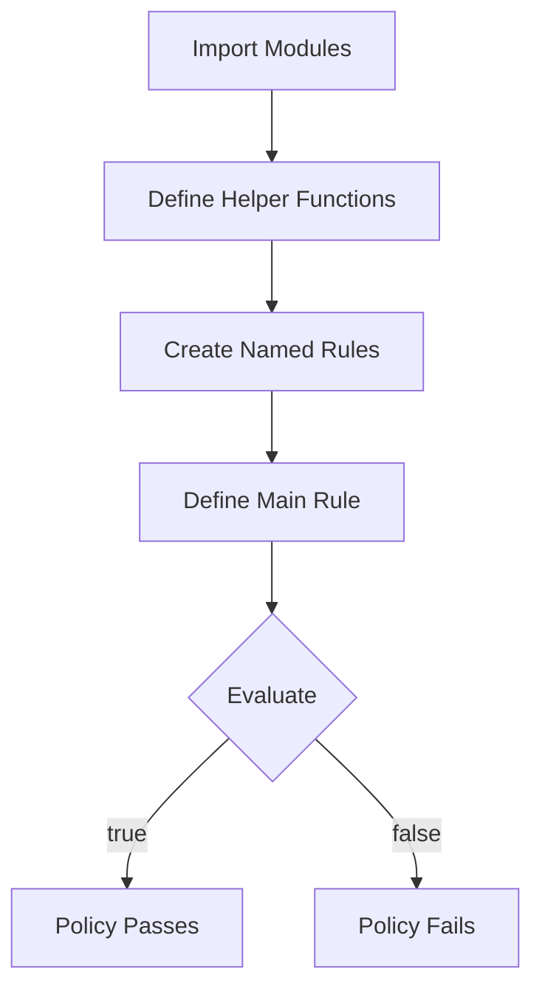
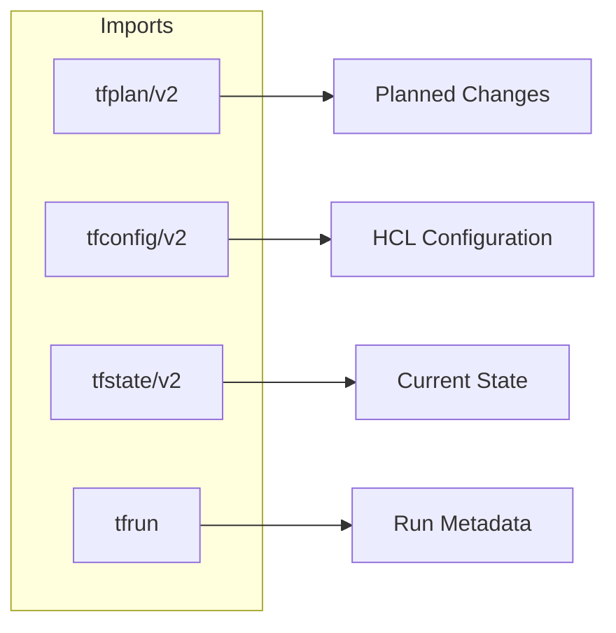
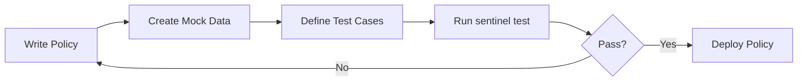
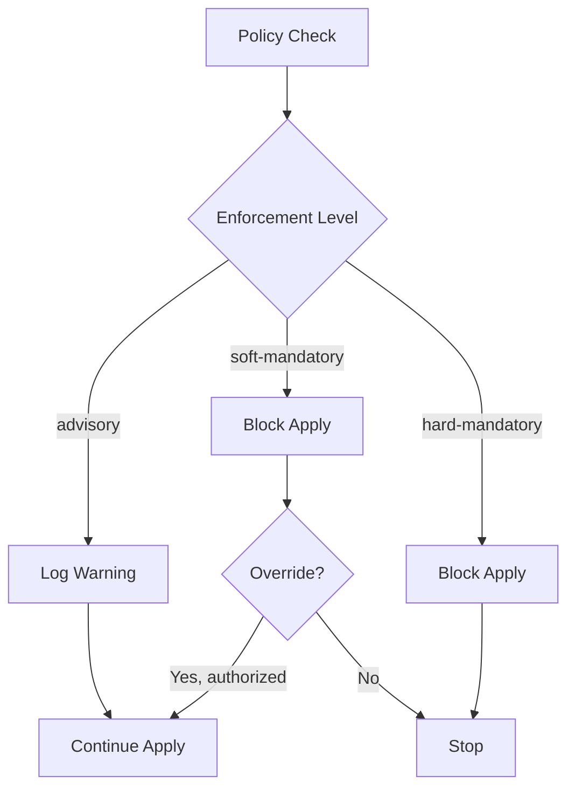
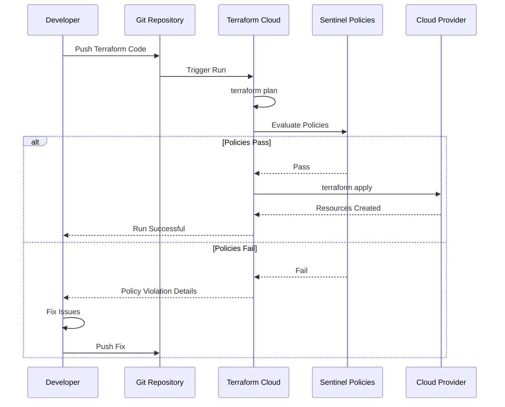

# How to Create Terraform Sentinel Policies

Author: [nawazdhandala](https://github.com/nawazdhandala)

Tags: Terraform, Sentinel, Policy, Compliance

Description: Learn how to create Terraform Sentinel policies from scratch, including policy structure, imports, testing strategies, and deployment to Terraform Cloud for automated infrastructure governance.

---

Sentinel policies let you define guardrails that every Terraform run must pass before applying changes. This guide walks through creating policies step by step, from basic syntax to advanced patterns, with practical examples you can adapt for your organization.

## Understanding Sentinel Policy Structure

Every Sentinel policy follows a consistent structure: imports, helper functions, rules, and a main rule that determines pass or fail.



Here is a minimal policy:

```hcl
# imports
import "tfplan/v2" as tfplan

# helper function
get_resources = func(type) {
    return filter tfplan.resource_changes as _, rc {
        rc.type is type and
        rc.mode is "managed"
    }
}

# named rule
instances_are_tagged = rule {
    all get_resources("aws_instance") as _, instance {
        instance.change.after.tags is not null
    }
}

# main rule
main = rule {
    instances_are_tagged
}
```

## Available Imports

Sentinel provides several imports to access Terraform data. Each import serves a different purpose.



### tfplan/v2 - Planned Changes

Access what Terraform plans to do:

```hcl
import "tfplan/v2" as tfplan

# Access all resource changes
for tfplan.resource_changes as address, rc {
    print(address)              # e.g., "aws_instance.web"
    print(rc.type)              # e.g., "aws_instance"
    print(rc.change.actions)    # e.g., ["create"], ["update"], ["delete"]
    print(rc.change.after)      # Planned attribute values
}

# Access output changes
for tfplan.output_changes as name, oc {
    print(name)
    print(oc.change.after)
}
```

### tfconfig/v2 - Configuration

Access the raw Terraform configuration:

```hcl
import "tfconfig/v2" as tfconfig

# Access resources in configuration
for tfconfig.resources as address, r {
    print(r.type)
    print(r.name)
    print(r.config)   # Raw HCL values
}

# Access variables
for tfconfig.variables as name, v {
    print(name)
    print(v.default)
    print(v.description)
}

# Access modules
for tfconfig.module_calls as name, m {
    print(m.source)
    print(m.version)
}
```

### tfstate/v2 - Current State

Access existing infrastructure state:

```hcl
import "tfstate/v2" as tfstate

# Access current resources
for tfstate.resources as address, r {
    print(r.type)
    print(r.values)   # Current attribute values
}
```

### tfrun - Run Metadata

Access information about the current Terraform run:

```hcl
import "tfrun"

# Workspace information
print(tfrun.workspace.name)
print(tfrun.workspace.auto_apply)

# Organization
print(tfrun.organization.name)

# Cost estimation (if enabled)
if tfrun.cost_estimation.prior_monthly_cost is not null {
    print(tfrun.cost_estimation.proposed_monthly_cost)
    print(tfrun.cost_estimation.delta_monthly_cost)
}
```

## Writing Your First Policy

Let us create a policy that requires all AWS instances to use approved AMIs.

```hcl
# restrict-ami.sentinel
import "tfplan/v2" as tfplan

# Approved AMIs by region
approved_amis = {
    "us-east-1": [
        "ami-0c55b159cbfafe1f0",
        "ami-0d5eff06f840b45e9",
    ],
    "us-west-2": [
        "ami-0cf6f5c8a62fa5da6",
        "ami-0892d3c7ee96c0bf7",
    ],
}

# Get EC2 instances being created or updated
get_ec2_instances = func() {
    return filter tfplan.resource_changes as _, rc {
        rc.type is "aws_instance" and
        rc.mode is "managed" and
        rc.change.actions contains "create" or
        rc.change.actions contains "update"
    }
}

# Validate an instance uses approved AMI
validate_ami = func(instance) {
    # Get the planned AMI
    ami = instance.change.after.ami

    # Get the provider region from the resource address
    # In practice, you might pass region differently
    provider_alias = instance.provider_name else "aws"

    # Check all regions for now (simplified)
    for approved_amis as region, amis {
        if ami in amis {
            return true
        }
    }

    return false
}

# Main rule
main = rule {
    all get_ec2_instances() as _, instance {
        validate_ami(instance)
    }
}
```

## Creating Reusable Functions

Functions make policies more readable and maintainable. Here is a pattern for creating a library of common functions.

```hcl
# common-functions.sentinel
# This file can be imported by other policies

# Filter resources by type with action filtering
filter_resources = func(type, actions) {
    return filter tfplan.resource_changes as _, rc {
        rc.type is type and
        rc.mode is "managed" and
        any rc.change.actions as action {
            action in actions
        }
    }
}

# Check if a value exists and is not empty
value_exists = func(value) {
    return value is not null and
           value is not undefined and
           length(value) > 0
}

# Get tag value with default
get_tag = func(tags, key, default_value) {
    if tags is null or tags is undefined {
        return default_value
    }
    return tags[key] else default_value
}

# Check for required tags
has_required_tags = func(resource, required) {
    tags = resource.change.after.tags else {}

    for required as tag {
        if tags[tag] is null or tags[tag] is undefined {
            return false
        }
    }

    return true
}
```

Use the functions in a policy:

```hcl
# require-tags.sentinel
import "tfplan/v2" as tfplan

# Required tags for all resources
required_tags = ["Environment", "Owner", "CostCenter"]

# Resource types that support tags
taggable_types = [
    "aws_instance",
    "aws_s3_bucket",
    "aws_rds_cluster",
    "aws_lambda_function",
]

# Filter for taggable resources
get_taggable_resources = func() {
    resources = []

    for taggable_types as type {
        filtered = filter tfplan.resource_changes as _, rc {
            rc.type is type and
            rc.mode is "managed" and
            rc.change.actions is not ["delete"]
        }

        for filtered as _, r {
            append(resources, r)
        }
    }

    return resources
}

# Check tags
has_required_tags = func(resource) {
    tags = resource.change.after.tags else {}

    missing = []
    for required_tags as tag {
        if tags[tag] is null or tags[tag] is undefined or tags[tag] is "" {
            append(missing, tag)
        }
    }

    if length(missing) > 0 {
        print("Resource", resource.address, "missing tags:", missing)
        return false
    }

    return true
}

# Main rule
main = rule {
    all get_taggable_resources() as _, resource {
        has_required_tags(resource)
    }
}
```

## Building Complex Conditions

Sentinel supports boolean logic and conditional evaluation.

```hcl
# network-security.sentinel
import "tfplan/v2" as tfplan

# Get security groups
get_security_groups = func() {
    return filter tfplan.resource_changes as _, rc {
        rc.type is "aws_security_group" and
        rc.mode is "managed" and
        rc.change.actions is not ["delete"]
    }
}

# Check for overly permissive ingress rules
check_ingress_rules = func(sg) {
    ingress = sg.change.after.ingress else []

    for ingress as rule {
        cidr_blocks = rule.cidr_blocks else []

        for cidr_blocks as cidr {
            # Block 0.0.0.0/0 on sensitive ports
            if cidr is "0.0.0.0/0" {
                from_port = rule.from_port else 0
                to_port = rule.to_port else 65535

                # SSH
                if from_port <= 22 and to_port >= 22 {
                    print("Security group", sg.address, "allows SSH from 0.0.0.0/0")
                    return false
                }

                # RDP
                if from_port <= 3389 and to_port >= 3389 {
                    print("Security group", sg.address, "allows RDP from 0.0.0.0/0")
                    return false
                }

                # Database ports
                sensitive_ports = [3306, 5432, 1433, 27017, 6379]
                for sensitive_ports as port {
                    if from_port <= port and to_port >= port {
                        print("Security group", sg.address, "allows port", port, "from 0.0.0.0/0")
                        return false
                    }
                }
            }
        }
    }

    return true
}

main = rule {
    all get_security_groups() as _, sg {
        check_ingress_rules(sg)
    }
}
```

## Testing Policies

Testing is crucial for policy development. Sentinel includes a testing framework.



### Directory Structure

```
policies/
├── sentinel.hcl
├── restrict-ami.sentinel
├── require-tags.sentinel
└── test/
    ├── restrict-ami/
    │   ├── pass.hcl
    │   ├── fail-invalid-ami.hcl
    │   └── mock-tfplan-pass.sentinel
    └── require-tags/
        ├── pass.hcl
        ├── fail-missing-tags.hcl
        └── mock-tfplan-pass.sentinel
```

### Creating Mock Data

Mock data simulates Terraform plan output:

```hcl
# test/require-tags/mock-tfplan-pass.sentinel
resource_changes = {
    "aws_instance.web": {
        "address": "aws_instance.web",
        "type": "aws_instance",
        "mode": "managed",
        "provider_name": "registry.terraform.io/hashicorp/aws",
        "change": {
            "actions": ["create"],
            "before": null,
            "after": {
                "ami": "ami-0c55b159cbfafe1f0",
                "instance_type": "t3.micro",
                "tags": {
                    "Environment": "production",
                    "Owner": "platform-team",
                    "CostCenter": "engineering"
                }
            }
        }
    }
}

output_changes = {}
```

Create mock data for failing cases:

```hcl
# test/require-tags/mock-tfplan-fail.sentinel
resource_changes = {
    "aws_instance.web": {
        "address": "aws_instance.web",
        "type": "aws_instance",
        "mode": "managed",
        "provider_name": "registry.terraform.io/hashicorp/aws",
        "change": {
            "actions": ["create"],
            "before": null,
            "after": {
                "ami": "ami-0c55b159cbfafe1f0",
                "instance_type": "t3.micro",
                "tags": {
                    "Name": "web-server"
                }
            }
        }
    }
}

output_changes = {}
```

### Writing Test Cases

Test for passing:

```hcl
# test/require-tags/pass.hcl
mock "tfplan/v2" {
    module {
        source = "mock-tfplan-pass.sentinel"
    }
}

test {
    rules = {
        main = true
    }
}
```

Test for failing:

```hcl
# test/require-tags/fail-missing-tags.hcl
mock "tfplan/v2" {
    module {
        source = "mock-tfplan-fail.sentinel"
    }
}

test {
    rules = {
        main = false
    }
}
```

### Running Tests

Install the Sentinel CLI and run tests:

```bash
# Install Sentinel CLI (macOS)
brew install sentinel

# Run all tests
sentinel test

# Run specific test
sentinel test -run require-tags

# Verbose output
sentinel test -verbose
```

## Configuring Policy Sets

Policy sets group related policies and define their enforcement levels.

```hcl
# sentinel.hcl
policy "require-tags" {
    source            = "./require-tags.sentinel"
    enforcement_level = "hard-mandatory"
}

policy "restrict-ami" {
    source            = "./restrict-ami.sentinel"
    enforcement_level = "soft-mandatory"
}

policy "network-security" {
    source            = "./network-security.sentinel"
    enforcement_level = "hard-mandatory"
}
```

### Enforcement Levels Explained



| Level | Behavior |
|-------|----------|
| advisory | Logs result but never blocks |
| soft-mandatory | Blocks unless overridden by authorized user |
| hard-mandatory | Always blocks on failure, no override |

### Parameterized Policies

Pass parameters to make policies configurable:

```hcl
# sentinel.hcl
policy "restrict-instance-types" {
    source            = "./restrict-instance-types.sentinel"
    enforcement_level = "hard-mandatory"

    params = {
        allowed_types = ["t3.micro", "t3.small", "t3.medium"]
        max_instances = 5
    }
}
```

Access parameters in the policy:

```hcl
# restrict-instance-types.sentinel
import "tfplan/v2" as tfplan

# Parameters with defaults
param allowed_types default ["t3.micro"]
param max_instances default 10

get_instances = func() {
    return filter tfplan.resource_changes as _, rc {
        rc.type is "aws_instance" and
        rc.mode is "managed" and
        rc.change.actions is not ["delete"]
    }
}

# Check instance type
valid_type = rule {
    all get_instances() as _, instance {
        instance.change.after.instance_type in allowed_types
    }
}

# Check count
within_limit = rule {
    length(get_instances()) <= max_instances
}

main = rule {
    valid_type and within_limit
}
```

## Deploying to Terraform Cloud

### Creating a Policy Set via UI

1. Navigate to Settings then Policy Sets
2. Click Create Policy Set
3. Connect to your VCS repository containing policies
4. Select workspaces to apply policies to
5. Save the policy set

### Creating via API

```bash
# Create policy set
curl \
  --header "Authorization: Bearer $TFC_TOKEN" \
  --header "Content-Type: application/vnd.api+json" \
  --request POST \
  --data @payload.json \
  https://app.terraform.io/api/v2/organizations/my-org/policy-sets
```

Payload:

```json
{
  "data": {
    "type": "policy-sets",
    "attributes": {
      "name": "infrastructure-policies",
      "description": "Core infrastructure governance policies",
      "global": false,
      "policies-path": "policies/"
    },
    "relationships": {
      "vcs-repo": {
        "data": {
          "branch": "main",
          "identifier": "my-org/sentinel-policies",
          "oauth-token-id": "ot-xxxxx"
        }
      },
      "workspaces": {
        "data": [
          { "id": "ws-xxxxx", "type": "workspaces" }
        ]
      }
    }
  }
}
```

### Using Terraform to Manage Policy Sets

```hcl
# policy-management.tf
terraform {
  required_providers {
    tfe = {
      source  = "hashicorp/tfe"
      version = "~> 0.50"
    }
  }
}

resource "tfe_policy_set" "infrastructure" {
  name         = "infrastructure-policies"
  description  = "Core infrastructure governance"
  organization = var.organization
  kind         = "sentinel"

  vcs_repo {
    identifier         = "my-org/sentinel-policies"
    branch            = "main"
    oauth_token_id    = var.oauth_token_id
  }

  workspace_ids = [
    tfe_workspace.production.id,
    tfe_workspace.staging.id,
  ]
}

resource "tfe_policy_set_parameter" "max_instances" {
  policy_set_id = tfe_policy_set.infrastructure.id
  key           = "max_instances"
  value         = "20"
  sensitive     = false
}
```

## Advanced Policy Patterns

### Cost Control Policy

```hcl
# cost-control.sentinel
import "tfplan/v2" as tfplan
import "tfrun"
import "decimal"

# Maximum allowed monthly cost increase
param max_monthly_increase default 1000

# Check cost estimation
cost_within_limit = rule when tfrun.cost_estimation.prior_monthly_cost is not null {
    delta = decimal.new(tfrun.cost_estimation.delta_monthly_cost)
    max = decimal.new(max_monthly_increase)

    delta.less_than_or_equals(max)
}

# If no cost estimation, pass by default
main = rule {
    cost_within_limit else true
}
```

### Module Version Policy

```hcl
# module-versions.sentinel
import "tfconfig/v2" as tfconfig
import "strings"

# Approved module sources
approved_sources = [
    "app.terraform.io/my-org/",
    "registry.terraform.io/hashicorp/",
]

# Check all module calls
check_module_sources = func() {
    violations = []

    for tfconfig.module_calls as name, m {
        source = m.source
        approved = false

        for approved_sources as prefix {
            if strings.has_prefix(source, prefix) {
                approved = true
                break
            }
        }

        if not approved {
            append(violations, {
                "name": name,
                "source": source,
            })
        }
    }

    return violations
}

main = rule {
    violations = check_module_sources()

    if length(violations) > 0 {
        print("Unapproved module sources:")
        for violations as v {
            print("  -", v.name, ":", v.source)
        }
    }

    length(violations) is 0
}
```

### Workspace-Specific Rules

```hcl
# workspace-rules.sentinel
import "tfplan/v2" as tfplan
import "tfrun"

# Production workspaces require stricter rules
is_production = func() {
    workspace = tfrun.workspace.name
    return workspace contains "prod" or workspace contains "production"
}

# Get deletion operations
get_deletions = func() {
    return filter tfplan.resource_changes as _, rc {
        rc.change.actions contains "delete"
    }
}

# Block mass deletions in production
no_mass_deletions = rule when is_production() {
    deletions = get_deletions()
    count = length(deletions)

    if count > 5 {
        print("Blocking deletion of", count, "resources in production")
        print("Maximum allowed: 5")
        false
    } else {
        true
    }
}

main = rule {
    no_mass_deletions
}
```

## Debugging Policies

### Using Print Statements

```hcl
import "tfplan/v2" as tfplan

# Debug: Print all resources
debug_resources = func() {
    for tfplan.resource_changes as address, rc {
        print("Resource:", address)
        print("  Type:", rc.type)
        print("  Actions:", rc.change.actions)
        print("  After:", rc.change.after)
    }
}

main = rule {
    # Uncomment for debugging
    # debug_resources()

    true
}
```

### Sentinel CLI Debugging

```bash
# Evaluate policy with trace output
sentinel apply -trace require-tags.sentinel

# Test with verbose output
sentinel test -verbose

# Format policy files
sentinel fmt require-tags.sentinel
```

## Common Patterns Reference

### Pattern: Require Encryption at Rest

```hcl
import "tfplan/v2" as tfplan

# EBS volumes must be encrypted
ebs_encrypted = rule {
    all filter tfplan.resource_changes as _, rc {
        rc.type is "aws_ebs_volume" and
        rc.change.actions is not ["delete"]
    } as _, volume {
        volume.change.after.encrypted is true
    }
}

# RDS instances must be encrypted
rds_encrypted = rule {
    all filter tfplan.resource_changes as _, rc {
        rc.type is "aws_db_instance" and
        rc.change.actions is not ["delete"]
    } as _, db {
        db.change.after.storage_encrypted is true
    }
}

main = rule {
    ebs_encrypted and rds_encrypted
}
```

### Pattern: Enforce Naming Conventions

```hcl
import "tfplan/v2" as tfplan
import "strings"

# Naming pattern: {env}-{app}-{resource}
validate_name = func(name) {
    parts = strings.split(name, "-")
    return length(parts) >= 3
}

# Check EC2 instance names
check_instance_names = rule {
    all filter tfplan.resource_changes as _, rc {
        rc.type is "aws_instance" and
        rc.change.actions is not ["delete"]
    } as _, instance {
        tags = instance.change.after.tags else {}
        name = tags["Name"] else ""
        validate_name(name)
    }
}

main = rule {
    check_instance_names
}
```

### Pattern: Restrict Regions

```hcl
import "tfplan/v2" as tfplan

allowed_regions = ["us-east-1", "us-west-2", "eu-west-1"]

# Check provider regions
check_regions = rule {
    all tfplan.resource_changes as _, rc {
        # Extract region from provider config
        provider = rc.provider_name
        region = rc.change.after.region else null

        region is null or region in allowed_regions
    }
}

main = rule {
    check_regions
}
```

## Workflow Integration



---

Creating effective Sentinel policies requires understanding both the Terraform plan structure and your organization's governance requirements. Start with simple policies like tagging requirements, then expand to cover security, cost, and compliance concerns. Test thoroughly before deploying to production workspaces, and use enforcement levels strategically to give teams time to adapt to new policies. With well-designed policies, you can automate infrastructure governance while maintaining developer velocity.
