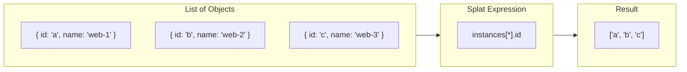
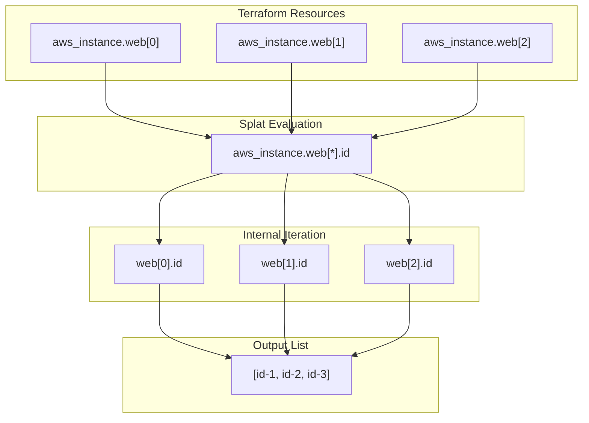

# How to Create Terraform Splat Expressions

Author: [nawazdhandala](https://github.com/nawazdhandala)

Tags: Terraform, IaC, Expressions, HCL

Description: Learn how to use Terraform splat expressions to efficiently extract and transform data from lists and resources in your infrastructure code.

---

Terraform splat expressions are one of the most powerful yet underutilized features in HCL. They let you extract attributes from lists of objects in a single, elegant expression. Instead of writing verbose loops, you can pull exactly what you need with concise syntax.

## What Are Splat Expressions?

Splat expressions use the `[*]` operator to iterate over all elements in a list and extract a specific attribute from each element. Think of them as a shorthand for "give me this attribute from every item in this list."



## Two Types of Splat Expressions

Terraform supports two splat syntaxes, each with specific use cases.

### The Full Splat (`[*]`)

The full splat expression works with any list or set and is the most flexible option.

```hcl
# Given a list of EC2 instances
resource "aws_instance" "web" {
  count = 3
  ami           = "ami-0c55b159cbfafe1f0"
  instance_type = "t3.micro"

  tags = {
    Name = "web-server-${count.index}"
  }
}

# Extract all instance IDs using full splat
output "instance_ids" {
  value = aws_instance.web[*].id
}

# Extract all private IPs
output "private_ips" {
  value = aws_instance.web[*].private_ip
}

# Extract all public DNS names
output "public_dns" {
  value = aws_instance.web[*].public_dns
}
```

### The Legacy Splat (`.*`)

The legacy splat expression is an older syntax that still works but has limitations.

```hcl
# Legacy syntax - still supported but less flexible
output "instance_ids_legacy" {
  value = aws_instance.web.*.id
}
```

The key difference is that `[*]` works with any value type (it treats non-list values as single-element lists), while `.*` only works with lists and will error on non-list values.

## Practical Examples

### Extracting Data from Multiple Resources

When you create multiple resources with `count`, splat expressions let you reference all instances at once.

```hcl
# Create multiple security groups
resource "aws_security_group" "app" {
  count       = 3
  name        = "app-sg-${count.index}"
  description = "Security group for app tier ${count.index}"
  vpc_id      = aws_vpc.main.id
}

# Create instances and attach all security groups
resource "aws_instance" "app" {
  ami                    = "ami-0c55b159cbfafe1f0"
  instance_type          = "t3.micro"
  vpc_security_group_ids = aws_security_group.app[*].id
}
```

### Working with for_each Resources

Splat expressions work differently with `for_each`. Since `for_each` creates a map, you need to convert it to a list first using `values()`.

```hcl
# Create subnets with for_each
resource "aws_subnet" "private" {
  for_each = {
    "us-east-1a" = "10.0.1.0/24"
    "us-east-1b" = "10.0.2.0/24"
    "us-east-1c" = "10.0.3.0/24"
  }

  vpc_id            = aws_vpc.main.id
  cidr_block        = each.value
  availability_zone = each.key
}

# Extract all subnet IDs
output "subnet_ids" {
  value = values(aws_subnet.private)[*].id
}
```

### Nested Attribute Access

Splat expressions can navigate nested structures to extract deeply embedded values.

```hcl
# Data source returning multiple objects
data "aws_availability_zones" "available" {
  state = "available"
}

# Extract zone names
output "az_names" {
  value = data.aws_availability_zones.available.names
}

# Create subnets in each AZ
resource "aws_subnet" "public" {
  count             = length(data.aws_availability_zones.available.names)
  vpc_id            = aws_vpc.main.id
  cidr_block        = cidrsubnet(aws_vpc.main.cidr_block, 8, count.index)
  availability_zone = data.aws_availability_zones.available.names[count.index]
}

# Get all subnet CIDRs using splat
output "subnet_cidrs" {
  value = aws_subnet.public[*].cidr_block
}
```

## Combining Splats with Other Expressions

### Splat with Conditional Logic

Filter results by combining splats with conditional expressions.

```hcl
variable "instances" {
  default = [
    { name = "web-1", type = "t3.micro", production = true },
    { name = "web-2", type = "t3.small", production = false },
    { name = "web-3", type = "t3.micro", production = true }
  ]
}

# Get names of production instances only
output "production_names" {
  value = [for i in var.instances : i.name if i.production]
}
```

### Splat with flatten()

When dealing with nested lists, combine splat with `flatten()` to get a single list.

```hcl
resource "aws_instance" "cluster" {
  count = 2
  ami           = "ami-0c55b159cbfafe1f0"
  instance_type = "t3.micro"
}

resource "aws_ebs_volume" "data" {
  count             = 2
  availability_zone = aws_instance.cluster[count.index].availability_zone
  size              = 100
}

# Flatten multiple resource outputs
locals {
  all_resource_ids = flatten([
    aws_instance.cluster[*].id,
    aws_ebs_volume.data[*].id
  ])
}

output "all_ids" {
  value = local.all_resource_ids
}
```

### Splat with zipmap()

Create maps from parallel lists using splat expressions and `zipmap()`.

```hcl
resource "aws_instance" "web" {
  count         = 3
  ami           = "ami-0c55b159cbfafe1f0"
  instance_type = "t3.micro"

  tags = {
    Name = "web-${count.index}"
  }
}

# Create a map of instance name to ID
output "instance_name_to_id" {
  value = zipmap(
    aws_instance.web[*].tags.Name,
    aws_instance.web[*].id
  )
}
```

## Real-World Use Cases

### Load Balancer Target Registration

Register multiple instances with a load balancer using splat expressions.

```hcl
resource "aws_instance" "app" {
  count         = var.instance_count
  ami           = var.ami_id
  instance_type = var.instance_type
  subnet_id     = element(var.subnet_ids, count.index)
}

resource "aws_lb_target_group" "app" {
  name     = "app-tg"
  port     = 80
  protocol = "HTTP"
  vpc_id   = var.vpc_id
}

resource "aws_lb_target_group_attachment" "app" {
  count            = var.instance_count
  target_group_arn = aws_lb_target_group.app.arn
  target_id        = aws_instance.app[count.index].id
  port             = 80
}

output "registered_targets" {
  value = aws_instance.app[*].private_ip
}
```

### DNS Record Creation

Create DNS records for all instances in a cluster.

```hcl
resource "aws_instance" "db" {
  count         = 3
  ami           = var.db_ami
  instance_type = "r5.large"
}

resource "aws_route53_record" "db" {
  count   = 3
  zone_id = var.zone_id
  name    = "db-${count.index}.internal.example.com"
  type    = "A"
  ttl     = 300
  records = [aws_instance.db[count.index].private_ip]
}

# Output all DNS names
output "db_endpoints" {
  value = aws_route53_record.db[*].fqdn
}
```

### Module Output Aggregation

When a module creates multiple resources, use splat to aggregate outputs.

```hcl
# modules/web-cluster/main.tf
resource "aws_instance" "web" {
  count         = var.cluster_size
  ami           = var.ami_id
  instance_type = var.instance_type
}

output "instance_ids" {
  value = aws_instance.web[*].id
}

output "private_ips" {
  value = aws_instance.web[*].private_ip
}

# Root module
module "web_cluster" {
  source        = "./modules/web-cluster"
  cluster_size  = 5
  ami_id        = "ami-0c55b159cbfafe1f0"
  instance_type = "t3.micro"
}

output "all_web_ips" {
  value = module.web_cluster.private_ips
}
```

## Splat Expression Flow

This diagram illustrates how splat expressions process data through the evaluation pipeline.



## Common Mistakes and How to Avoid Them

### Mistake 1: Using Splat on a Single Resource

Splat expressions on a single resource (without `count` or `for_each`) return a single-element list, not the value directly.

```hcl
# Wrong - this returns a list with one element
resource "aws_instance" "single" {
  ami           = "ami-0c55b159cbfafe1f0"
  instance_type = "t3.micro"
}

output "single_id" {
  # This returns ["i-12345"], not "i-12345"
  value = aws_instance.single[*].id
}

# Correct - access the attribute directly
output "single_id_correct" {
  value = aws_instance.single.id
}
```

### Mistake 2: Forgetting values() with for_each

When using `for_each`, you must convert the map to a list before using splat.

```hcl
resource "aws_subnet" "example" {
  for_each = var.subnet_config
  # ... configuration
}

# Wrong - for_each creates a map, not a list
output "subnet_ids_wrong" {
  value = aws_subnet.example[*].id  # Error!
}

# Correct - convert to list first
output "subnet_ids_correct" {
  value = values(aws_subnet.example)[*].id
}
```

### Mistake 3: Nested Splat Confusion

When working with nested structures, be explicit about what you are extracting.

```hcl
variable "servers" {
  default = [
    {
      name = "web"
      ips  = ["10.0.0.1", "10.0.0.2"]
    },
    {
      name = "api"
      ips  = ["10.0.1.1", "10.0.1.2"]
    }
  ]
}

# This gives you a list of lists
output "all_ip_lists" {
  value = var.servers[*].ips
  # Result: [["10.0.0.1", "10.0.0.2"], ["10.0.1.1", "10.0.1.2"]]
}

# Use flatten to get a single list
output "all_ips_flat" {
  value = flatten(var.servers[*].ips)
  # Result: ["10.0.0.1", "10.0.0.2", "10.0.1.1", "10.0.1.2"]
}
```

## Splat vs For Expressions

While splat expressions are concise, `for` expressions offer more flexibility.

```hcl
resource "aws_instance" "web" {
  count         = 3
  ami           = "ami-0c55b159cbfafe1f0"
  instance_type = "t3.micro"
}

# Splat - simple attribute extraction
output "ids_splat" {
  value = aws_instance.web[*].id
}

# For - equivalent result
output "ids_for" {
  value = [for i in aws_instance.web : i.id]
}

# For - with transformation (not possible with splat)
output "ids_upper" {
  value = [for i in aws_instance.web : upper(i.id)]
}

# For - with filtering (not possible with splat)
output "micro_ids" {
  value = [for i in aws_instance.web : i.id if i.instance_type == "t3.micro"]
}
```

Use splat when you need simple attribute extraction. Use `for` when you need filtering, transformation, or complex logic.

## Performance Considerations

Splat expressions are evaluated during the plan phase and do not impact runtime performance. However, they can affect plan readability when dealing with large resource sets.

```hcl
# For very large sets, consider limiting output
output "first_10_ids" {
  value = slice(aws_instance.web[*].id, 0, min(10, length(aws_instance.web)))
}
```

## Best Practices Summary

- Use `[*]` (full splat) instead of `.*` (legacy splat) for consistency
- Always use `values()` before applying splat to `for_each` resources
- Combine with `flatten()` when extracting nested lists
- Use `for` expressions when you need filtering or transformation
- Document complex splat expressions with comments
- Test splat outputs with `terraform console` before applying

---

Splat expressions transform verbose iteration into elegant one-liners. Master them, and your Terraform code becomes cleaner, more maintainable, and easier to understand. Start with simple extractions and gradually incorporate them into more complex patterns as you build confidence.
