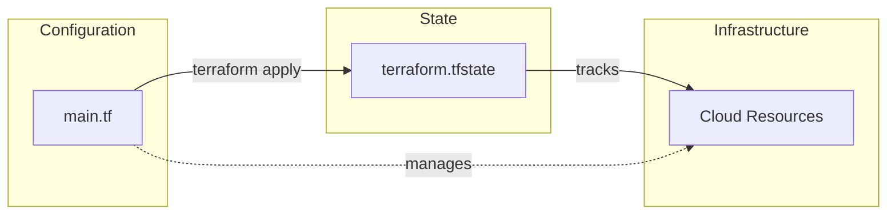
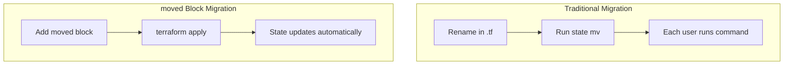
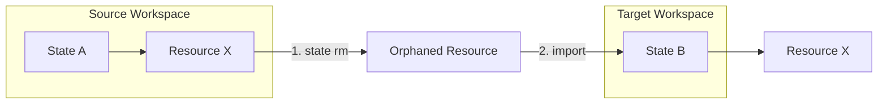
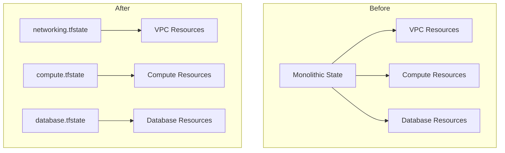
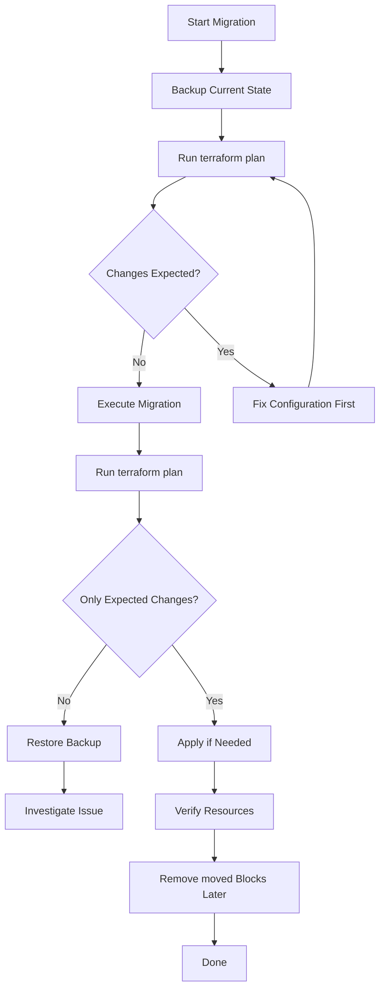

# How to Create Terraform State Migration

Author: [nawazdhandala](https://github.com/nawazdhandala)

Tags: Terraform, State, Migration, Infrastructure

Description: A practical guide to migrating Terraform state using state commands, moved blocks, and cross-workspace strategies.

---

Terraform state is the source of truth for your infrastructure. When you refactor modules, rename resources, or consolidate workspaces, you need to migrate state without destroying and recreating resources. This guide covers the essential techniques for safe state migration.

## Understanding Terraform State

Terraform state maps your configuration to real infrastructure. Every resource in your `.tf` files has a corresponding entry in the state file that tracks its current attributes and metadata.



When you rename a resource in configuration without migrating state, Terraform sees two separate things: a resource to destroy (old name) and a resource to create (new name). State migration tells Terraform that the renamed resource is the same as the original.

## State Manipulation Commands

### terraform state mv

The `terraform state mv` command moves resources within state. Use it when renaming resources or moving them between modules.

#### Renaming a Resource

```hcl
# Before: resource named "web"
resource "aws_instance" "web" {
  ami           = "ami-0c55b159cbfafe1f0"
  instance_type = "t3.micro"
}

# After: renamed to "application"
resource "aws_instance" "application" {
  ami           = "ami-0c55b159cbfafe1f0"
  instance_type = "t3.micro"
}
```

```bash
# Migrate state to match the new name
terraform state mv aws_instance.web aws_instance.application

# Verify the move
terraform state list | grep aws_instance
```

#### Moving Resources Between Modules

```bash
# Move resource into a module
terraform state mv aws_instance.web module.compute.aws_instance.web

# Move resource out of a module
terraform state mv module.compute.aws_instance.web aws_instance.web

# Move between modules
terraform state mv module.old.aws_instance.web module.new.aws_instance.web
```

#### Moving Indexed Resources

```bash
# Move from count to for_each
terraform state mv 'aws_instance.web[0]' 'aws_instance.web["primary"]'
terraform state mv 'aws_instance.web[1]' 'aws_instance.web["secondary"]'

# Move specific index
terraform state mv 'aws_instance.web[2]' 'module.failover.aws_instance.web'
```

### terraform state rm

The `terraform state rm` command removes resources from state without destroying them. Use this when you want Terraform to stop managing a resource or when importing it elsewhere.

```bash
# Remove a single resource
terraform state rm aws_instance.web

# Remove a module and all its resources
terraform state rm module.legacy

# Remove indexed resource
terraform state rm 'aws_instance.web[0]'
```

After removal, the resource still exists in your cloud provider but Terraform no longer tracks it. You can reimport it later or let another Terraform configuration manage it.

#### Common Use Cases for state rm

1. **Transferring ownership** to another team's Terraform workspace
2. **Excluding resources** that will be managed manually
3. **Cleaning up** after failed partial applies
4. **Preparing for import** into a different state

### terraform state pull and push

For advanced migrations, you can directly manipulate the state file:

```bash
# Download current state
terraform state pull > state_backup.json

# Edit state (carefully!)
# Then upload modified state
terraform state push state_modified.json
```

## Using moved Blocks (Terraform 1.1+)

The `moved` block is the preferred method for state migration in modern Terraform. It declares the migration in configuration, making it visible in version control and shareable across teams.



### Basic moved Block

```hcl
# Rename a resource
moved {
  from = aws_instance.web
  to   = aws_instance.application
}

resource "aws_instance" "application" {
  ami           = "ami-0c55b159cbfafe1f0"
  instance_type = "t3.micro"
}
```

### Moving Into Modules

```hcl
# main.tf
moved {
  from = aws_instance.web
  to   = module.compute.aws_instance.web
}

module "compute" {
  source = "./modules/compute"
}

# modules/compute/main.tf
resource "aws_instance" "web" {
  ami           = var.ami_id
  instance_type = var.instance_type
}
```

### Chaining moved Blocks

You can chain multiple moves for complex refactoring:

```hcl
# First rename happened in v1.2
moved {
  from = aws_instance.server
  to   = aws_instance.web
}

# Second rename in v1.5
moved {
  from = aws_instance.web
  to   = aws_instance.application
}

# Current configuration
resource "aws_instance" "application" {
  ami           = "ami-0c55b159cbfafe1f0"
  instance_type = "t3.micro"
}
```

### Converting count to for_each

```hcl
# Old configuration used count
# resource "aws_instance" "web" {
#   count = 3
#   ...
# }

# New configuration uses for_each
moved {
  from = aws_instance.web[0]
  to   = aws_instance.web["primary"]
}

moved {
  from = aws_instance.web[1]
  to   = aws_instance.web["secondary"]
}

moved {
  from = aws_instance.web[2]
  to   = aws_instance.web["tertiary"]
}

resource "aws_instance" "web" {
  for_each = toset(["primary", "secondary", "tertiary"])

  ami           = "ami-0c55b159cbfafe1f0"
  instance_type = "t3.micro"

  tags = {
    Name = "web-${each.key}"
  }
}
```

## Cross-Workspace Migration

Moving resources between Terraform workspaces or state files requires a careful process.



### Step-by-Step Cross-Workspace Migration

#### 1. Document the Resource

```bash
# In source workspace
cd /path/to/source-workspace

# Get resource details for import
terraform state show aws_instance.web

# Output includes the resource ID needed for import
# aws_instance.web:
# resource "aws_instance" "web" {
#     id = "i-0abc123def456"
#     ...
# }
```

#### 2. Remove from Source

```bash
# Remove from source state
terraform state rm aws_instance.web

# Verify removal
terraform state list | grep aws_instance
```

#### 3. Import to Target

```bash
# In target workspace
cd /path/to/target-workspace

# First add the resource configuration
# Then import using the ID from step 1
terraform import aws_instance.web i-0abc123def456

# Verify import
terraform plan
# Should show no changes if configuration matches
```

### Bulk Cross-Workspace Migration

For migrating multiple resources:

```bash
#!/bin/bash
# migrate-resources.sh

SOURCE_DIR="/path/to/source"
TARGET_DIR="/path/to/target"

# Resources to migrate
RESOURCES=(
    "aws_instance.web:i-0abc123def456"
    "aws_instance.api:i-0def789ghi012"
    "aws_db_instance.main:mydb-instance"
)

# Remove from source
cd "$SOURCE_DIR"
for resource in "${RESOURCES[@]}"; do
    name="${resource%%:*}"
    echo "Removing $name from source state..."
    terraform state rm "$name"
done

# Import to target
cd "$TARGET_DIR"
for resource in "${RESOURCES[@]}"; do
    name="${resource%%:*}"
    id="${resource##*:}"
    echo "Importing $name to target state..."
    terraform import "$name" "$id"
done

echo "Migration complete. Run terraform plan in both directories to verify."
```

## Refactoring Strategies

### Module Extraction

When extracting resources into a reusable module:

```hcl
# Before: flat structure
# resource "aws_vpc" "main" { ... }
# resource "aws_subnet" "public" { ... }
# resource "aws_subnet" "private" { ... }

# After: modular structure
moved {
  from = aws_vpc.main
  to   = module.networking.aws_vpc.main
}

moved {
  from = aws_subnet.public
  to   = module.networking.aws_subnet.public
}

moved {
  from = aws_subnet.private
  to   = module.networking.aws_subnet.private
}

module "networking" {
  source = "./modules/networking"

  vpc_cidr = "10.0.0.0/16"
}
```

### Resource Type Changes

Sometimes you need to change resource types (e.g., upgrading from `aws_instance` to `aws_launch_template`). This requires destroy and recreate since Terraform cannot migrate between different resource types.

```hcl
# Option 1: Import the new resource manually
# 1. Create new resource in cloud console
# 2. Add configuration and import
# 3. Remove old resource from state

# Option 2: Use lifecycle to control order
resource "aws_launch_template" "web" {
  name_prefix   = "web-"
  image_id      = "ami-0c55b159cbfafe1f0"
  instance_type = "t3.micro"
}

resource "aws_instance" "web" {
  # Will be destroyed after launch template exists
  lifecycle {
    create_before_destroy = false
  }
}
```

### Splitting State Files

When a single state file becomes too large:



```bash
# Create separate directories for each layer
mkdir -p terraform/{networking,compute,database}

# For each layer, migrate resources
# Networking
cd terraform/networking
terraform init
terraform import aws_vpc.main vpc-0abc123
terraform import aws_subnet.public subnet-0def456

# Compute
cd ../compute
terraform init
terraform import aws_instance.web i-0ghi789

# Database
cd ../database
terraform init
terraform import aws_db_instance.main mydb
```

## State Locking and Safety

### Always Use Remote State with Locking

```hcl
terraform {
  backend "s3" {
    bucket         = "my-terraform-state"
    key            = "prod/terraform.tfstate"
    region         = "us-west-2"
    dynamodb_table = "terraform-locks"
    encrypt        = true
  }
}
```

### Pre-Migration Checklist

1. **Backup state**
   ```bash
   terraform state pull > backup-$(date +%Y%m%d-%H%M%S).json
   ```

2. **Check for pending changes**
   ```bash
   terraform plan
   # Should show no changes before migration
   ```

3. **Acquire lock manually for complex migrations**
   ```bash
   # With S3 backend, check DynamoDB for locks
   aws dynamodb scan --table-name terraform-locks
   ```

4. **Test in non-production first**

### Recovering from Failed Migrations

```bash
# If state becomes corrupted, restore from backup
terraform state push backup-20260130-143022.json

# Force unlock if lock is stuck
terraform force-unlock LOCK_ID

# Refresh state to sync with reality
terraform refresh
```

## Migration Workflow



## Best Practices

1. **Use moved blocks over CLI commands** when possible. They are declarative, version-controlled, and apply automatically for all team members.

2. **Keep moved blocks temporarily**. Remove them after all state files have been updated (typically after a few weeks or a release cycle).

3. **Never edit state files directly** unless absolutely necessary. Use the state subcommands or moved blocks.

4. **Always run plan before and after migration** to verify no unintended changes.

5. **Document migrations** in commit messages and changelogs. Future maintainers will appreciate knowing why resources were moved.

6. **Test migrations in staging** before production. Clone your state and run the migration in isolation.

7. **Use data sources for cross-state references** instead of hardcoding IDs:
   ```hcl
   # In compute workspace
   data "terraform_remote_state" "networking" {
     backend = "s3"
     config = {
       bucket = "my-terraform-state"
       key    = "networking/terraform.tfstate"
       region = "us-west-2"
     }
   }

   resource "aws_instance" "web" {
     subnet_id = data.terraform_remote_state.networking.outputs.public_subnet_id
   }
   ```

8. **Plan migrations during maintenance windows** for production infrastructure. Even with no expected changes, surprises happen.

---

Terraform state migration is a critical skill for maintaining infrastructure as code. Whether you are renaming resources, extracting modules, or splitting monolithic configurations, the techniques in this guide will help you refactor safely. Start with moved blocks for simple renames, use state commands for cross-workspace migrations, and always maintain backups.
