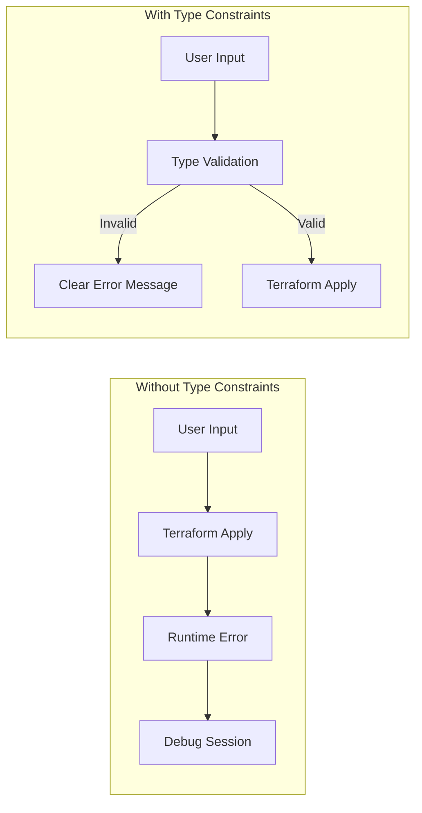
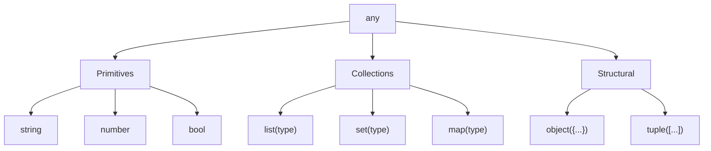

# How to Build Terraform Type Constraints

Author: [nawazdhandala](https://github.com/nawazdhandala)

Tags: Terraform, IaC, Types, Validation

Description: Learn how to use Terraform type constraints to validate variable inputs, catch errors early, and build more reliable infrastructure code.

---

Terraform's type system is one of its most underrated features. Type constraints let you define exactly what shape your input variables should have, catching configuration errors before they become runtime failures. This guide shows you how to build effective type constraints from simple primitives to complex nested structures.

## Why Type Constraints Matter

Without type constraints, Terraform accepts any input and tries to coerce it into what it needs. This leads to confusing errors deep in your configuration. Type constraints fail fast with clear messages.



## Primitive Types

Terraform supports three primitive types: string, number, and bool.

### String Type

String is the most common type. Use it for names, IDs, and text values.

```hcl
variable "environment" {
  type        = string
  description = "Deployment environment (dev, staging, prod)"
  default     = "dev"
}

variable "project_name" {
  type        = string
  description = "Name of the project"
  # No default - required input
}
```

### Number Type

Number handles both integers and floating-point values.

```hcl
variable "instance_count" {
  type        = number
  description = "Number of instances to create"
  default     = 1
}

variable "cpu_threshold" {
  type        = number
  description = "CPU utilization threshold for scaling (0.0 to 1.0)"
  default     = 0.75
}
```

### Bool Type

Bool is for true/false flags.

```hcl
variable "enable_monitoring" {
  type        = bool
  description = "Enable CloudWatch monitoring"
  default     = true
}

variable "create_dns_record" {
  type        = bool
  description = "Whether to create a Route53 DNS record"
  default     = false
}
```

## Collection Types

Collections hold multiple values of the same type.

### List Type

Lists are ordered sequences. Use `list(type)` syntax.

```hcl
variable "availability_zones" {
  type        = list(string)
  description = "List of availability zones"
  default     = ["us-east-1a", "us-east-1b", "us-east-1c"]
}

variable "port_mappings" {
  type        = list(number)
  description = "List of ports to expose"
  default     = [80, 443, 8080]
}
```

### Set Type

Sets are unordered collections with unique values.

```hcl
variable "allowed_cidrs" {
  type        = set(string)
  description = "Set of CIDR blocks allowed to access the resource"
  default     = ["10.0.0.0/8", "172.16.0.0/12"]
}
```

### Map Type

Maps are key-value pairs where all values share the same type.

```hcl
variable "tags" {
  type        = map(string)
  description = "Resource tags"
  default = {
    Environment = "production"
    Team        = "platform"
    ManagedBy   = "terraform"
  }
}

variable "instance_types" {
  type        = map(string)
  description = "Instance type per environment"
  default = {
    dev     = "t3.micro"
    staging = "t3.small"
    prod    = "t3.medium"
  }
}
```

## Object Types

Objects define structured data with named attributes, each with its own type.

### Basic Object

```hcl
variable "database_config" {
  type = object({
    engine         = string
    engine_version = string
    instance_class = string
    allocated_storage = number
    multi_az       = bool
  })

  description = "RDS database configuration"

  default = {
    engine            = "postgres"
    engine_version    = "15.4"
    instance_class    = "db.t3.medium"
    allocated_storage = 100
    multi_az          = true
  }
}
```

### Object with Optional Attributes

Terraform 1.3+ supports optional attributes with defaults.

```hcl
variable "server_config" {
  type = object({
    name          = string
    instance_type = string
    volume_size   = optional(number, 50)
    monitoring    = optional(bool, true)
    tags          = optional(map(string), {})
  })

  description = "Server configuration with sensible defaults"
}
```

When you call this module, you only need to provide required attributes.

```hcl
module "web_server" {
  source = "./modules/server"

  server_config = {
    name          = "web-prod-01"
    instance_type = "t3.large"
    # volume_size defaults to 50
    # monitoring defaults to true
    # tags defaults to {}
  }
}
```

## Tuple Types

Tuples are fixed-length sequences where each element can have a different type.

```hcl
variable "cidr_config" {
  type        = tuple([string, number])
  description = "CIDR block and prefix length"
  default     = ["10.0.0.0", 16]
}

variable "scaling_rule" {
  type        = tuple([string, number, number])
  description = "Metric name, threshold, and cooldown period"
  default     = ["CPUUtilization", 80, 300]
}
```

## Nested Complex Types

Real-world configurations often require nested structures.

### List of Objects

```hcl
variable "security_group_rules" {
  type = list(object({
    description = string
    from_port   = number
    to_port     = number
    protocol    = string
    cidr_blocks = list(string)
  }))

  description = "Security group ingress rules"

  default = [
    {
      description = "HTTPS from anywhere"
      from_port   = 443
      to_port     = 443
      protocol    = "tcp"
      cidr_blocks = ["0.0.0.0/0"]
    },
    {
      description = "SSH from VPN"
      from_port   = 22
      to_port     = 22
      protocol    = "tcp"
      cidr_blocks = ["10.0.0.0/8"]
    }
  ]
}
```

### Map of Objects

```hcl
variable "services" {
  type = map(object({
    port        = number
    protocol    = string
    health_path = string
    replicas    = number
  }))

  description = "Service definitions"

  default = {
    api = {
      port        = 8080
      protocol    = "http"
      health_path = "/health"
      replicas    = 3
    }
    worker = {
      port        = 9090
      protocol    = "grpc"
      health_path = "/grpc.health.v1.Health/Check"
      replicas    = 2
    }
  }
}
```

### Deeply Nested Structures

```hcl
variable "application_config" {
  type = object({
    name        = string
    environment = string

    compute = object({
      instance_type = string
      min_instances = number
      max_instances = number
    })

    database = object({
      engine       = string
      storage_gb   = number
      backup = object({
        enabled         = bool
        retention_days  = number
        window          = string
      })
    })

    networking = object({
      vpc_cidr     = string
      public_subnets  = list(string)
      private_subnets = list(string)
    })
  })

  description = "Complete application infrastructure configuration"
}
```

## Type Constraint Hierarchy

Understanding how types relate helps you choose the right constraint.



## The `any` Type

Use `any` when you need maximum flexibility, but use it sparingly.

```hcl
variable "custom_tags" {
  type        = any
  description = "Custom tags - accepts any structure"
  default     = null
}
```

Better approach: be specific about what you accept.

```hcl
variable "custom_config" {
  type        = map(any)
  description = "Custom configuration - must be a map"
  default     = {}
}
```

## Combining Type Constraints with Validation

Type constraints check structure. Validation blocks check values.

```hcl
variable "environment" {
  type        = string
  description = "Deployment environment"

  validation {
    condition     = contains(["dev", "staging", "prod"], var.environment)
    error_message = "Environment must be dev, staging, or prod."
  }
}

variable "instance_count" {
  type        = number
  description = "Number of instances"

  validation {
    condition     = var.instance_count >= 1 && var.instance_count <= 10
    error_message = "Instance count must be between 1 and 10."
  }
}

variable "cidr_block" {
  type        = string
  description = "VPC CIDR block"

  validation {
    condition     = can(cidrhost(var.cidr_block, 0))
    error_message = "Must be a valid CIDR block."
  }
}
```

### Multiple Validation Rules

```hcl
variable "bucket_name" {
  type        = string
  description = "S3 bucket name"

  validation {
    condition     = length(var.bucket_name) >= 3 && length(var.bucket_name) <= 63
    error_message = "Bucket name must be between 3 and 63 characters."
  }

  validation {
    condition     = can(regex("^[a-z0-9][a-z0-9.-]*[a-z0-9]$", var.bucket_name))
    error_message = "Bucket name must start and end with lowercase letter or number."
  }

  validation {
    condition     = !can(regex("\\.\\.|-\\.", var.bucket_name))
    error_message = "Bucket name cannot contain consecutive periods or period-hyphen."
  }
}
```

## Practical Example: EKS Cluster Module

Here is a complete example showing type constraints in a real module.

```hcl
variable "cluster_config" {
  type = object({
    name    = string
    version = optional(string, "1.28")

    vpc = object({
      id              = string
      subnet_ids      = list(string)
      security_groups = optional(list(string), [])
    })

    node_groups = map(object({
      instance_types = list(string)
      desired_size   = number
      min_size       = number
      max_size       = number
      disk_size      = optional(number, 100)
      labels         = optional(map(string), {})
      taints = optional(list(object({
        key    = string
        value  = string
        effect = string
      })), [])
    }))

    addons = optional(object({
      vpc_cni    = optional(bool, true)
      coredns    = optional(bool, true)
      kube_proxy = optional(bool, true)
    }), {})

    logging = optional(object({
      enabled    = optional(bool, true)
      log_types  = optional(list(string), ["api", "audit", "authenticator"])
      retention  = optional(number, 30)
    }), {})
  })

  description = "EKS cluster configuration"

  validation {
    condition     = can(regex("^[a-zA-Z][a-zA-Z0-9-]*$", var.cluster_config.name))
    error_message = "Cluster name must start with a letter and contain only alphanumeric characters and hyphens."
  }

  validation {
    condition     = length(var.cluster_config.vpc.subnet_ids) >= 2
    error_message = "At least 2 subnets required for high availability."
  }
}
```

Usage of this module:

```hcl
module "eks" {
  source = "./modules/eks"

  cluster_config = {
    name = "production-cluster"

    vpc = {
      id         = "vpc-abc123"
      subnet_ids = ["subnet-1", "subnet-2", "subnet-3"]
    }

    node_groups = {
      general = {
        instance_types = ["t3.large", "t3.xlarge"]
        desired_size   = 3
        min_size       = 2
        max_size       = 10
        labels = {
          workload = "general"
        }
      }
      compute = {
        instance_types = ["c5.2xlarge"]
        desired_size   = 2
        min_size       = 0
        max_size       = 20
        disk_size      = 200
        taints = [
          {
            key    = "dedicated"
            value  = "compute"
            effect = "NoSchedule"
          }
        ]
      }
    }

    logging = {
      retention = 90
    }
  }
}
```

## Common Patterns and Best Practices

### Pattern 1: Feature Flags

```hcl
variable "features" {
  type = object({
    enable_cdn         = optional(bool, false)
    enable_waf         = optional(bool, false)
    enable_monitoring  = optional(bool, true)
    enable_logging     = optional(bool, true)
  })

  default = {}
}
```

### Pattern 2: Environment-Specific Defaults

```hcl
variable "environment_configs" {
  type = map(object({
    instance_type   = string
    instance_count  = number
    enable_ha       = bool
  }))

  default = {
    dev = {
      instance_type  = "t3.micro"
      instance_count = 1
      enable_ha      = false
    }
    staging = {
      instance_type  = "t3.small"
      instance_count = 2
      enable_ha      = false
    }
    prod = {
      instance_type  = "t3.medium"
      instance_count = 3
      enable_ha      = true
    }
  }
}
```

### Pattern 3: Conditional Required Fields

```hcl
variable "database_config" {
  type = object({
    create_new     = bool
    existing_id    = optional(string)
    new_config     = optional(object({
      engine       = string
      storage_gb   = number
    }))
  })

  validation {
    condition = (
      var.database_config.create_new && var.database_config.new_config != null
    ) || (
      !var.database_config.create_new && var.database_config.existing_id != null
    )
    error_message = "Provide new_config when create_new is true, or existing_id when false."
  }
}
```

## Debugging Type Errors

When Terraform reports type errors, check these common issues.

**Missing required attribute**
```
Error: Invalid value for variable

The given value is not valid for variable "config": attribute "name" is required.
```

Fix: Add the missing attribute or mark it as optional.

**Wrong type**
```
Error: Invalid value for variable

The given value is not valid for variable "count": a number is required.
```

Fix: Check that you are passing the correct type. Strings like "3" will not work where a number is expected.

**Extra attributes in object**
```
Error: Invalid value for variable

Unexpected attribute "extra_field" for variable "config".
```

Fix: Remove the extra field or add it to the type definition.

## Type Constraint Checklist

- [ ] Use specific types over `any` whenever possible
- [ ] Mark optional fields with `optional()` and provide defaults
- [ ] Add validation blocks for value constraints
- [ ] Document complex types with meaningful descriptions
- [ ] Test type constraints with invalid inputs
- [ ] Use nested objects to group related configuration
- [ ] Keep deeply nested structures manageable (max 3-4 levels)

---

Type constraints are your first line of defense against configuration errors. They document what your module expects, catch mistakes early, and make your Terraform code self-describing. Start with primitives, progress to objects, and add validation blocks for complete input verification.
