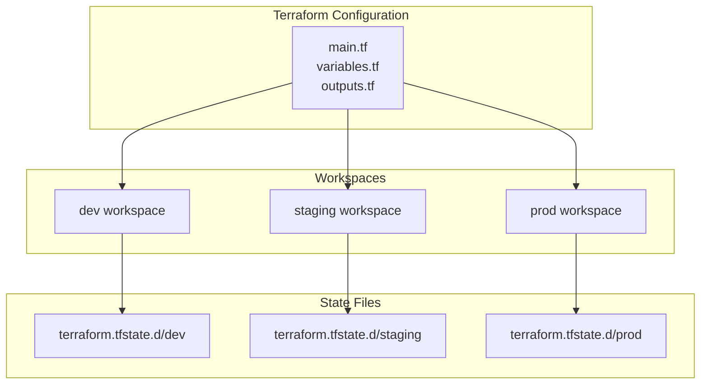
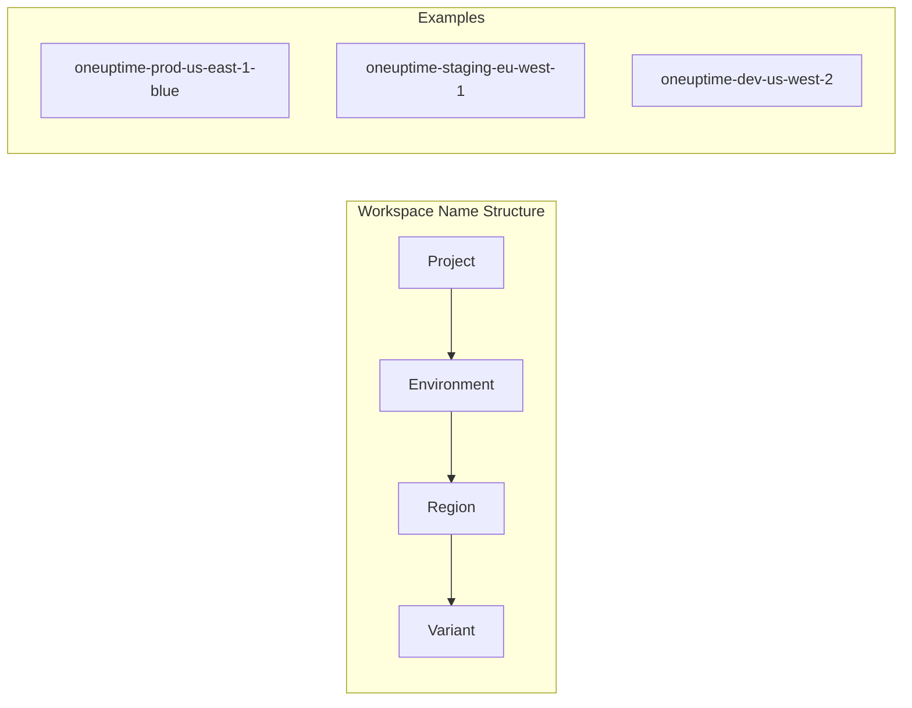
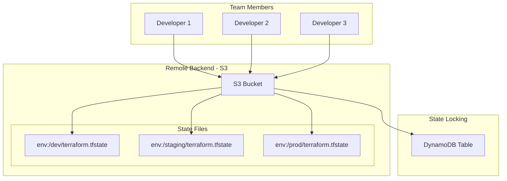
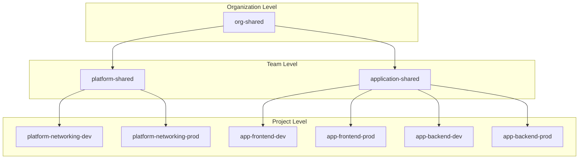
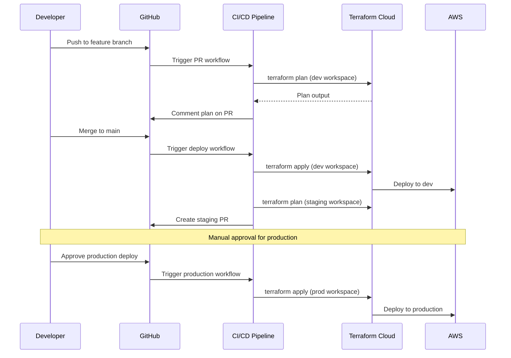
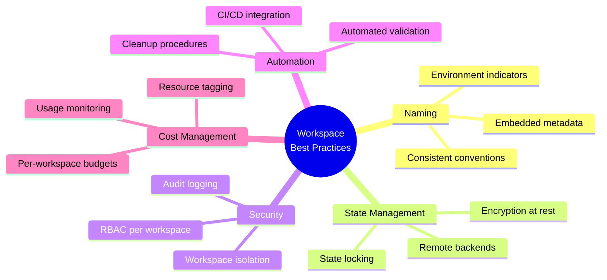

# How to Build Terraform Workspace Patterns

Author: [nawazdhandala](https://github.com/nawazdhandala)

Tags: Terraform, Workspaces, IaC, Multi-Environment

Description: A comprehensive guide to building effective Terraform workspace patterns for managing multi-environment infrastructure. Learn proven architectural patterns, workspace isolation strategies, and production-ready implementations for scaling your IaC practice.

Terraform workspaces are a powerful feature that allows you to manage multiple distinct sets of infrastructure resources with the same configuration. However, using workspaces effectively requires thoughtful patterns and architecture. In this guide, we will explore battle-tested workspace patterns that scale from small teams to enterprise deployments.

## Understanding Terraform Workspaces

Before diving into patterns, let us understand what workspaces provide. A Terraform workspace is an isolated state environment that shares the same configuration but maintains separate state files.



Each workspace maintains its own state, allowing you to deploy the same infrastructure definition to different environments without conflicts.

## Pattern 1: Environment-Based Workspace Pattern

The most common pattern uses workspaces to represent deployment environments. This pattern works well when your environments share the same infrastructure topology but differ in scale or configuration.

### Directory Structure

```
terraform/
    main.tf
    variables.tf
    outputs.tf
    providers.tf
    environments/
        dev.tfvars
        staging.tfvars
        prod.tfvars
```

### Implementation

```hcl
# variables.tf
variable "environment" {
  description = "Deployment environment"
  type        = string
}

variable "instance_count" {
  description = "Number of instances to deploy"
  type        = number
}

variable "instance_type" {
  description = "EC2 instance type"
  type        = string
}

variable "enable_monitoring" {
  description = "Enable detailed monitoring"
  type        = bool
  default     = false
}

# main.tf
locals {
  # Derive environment from workspace if not explicitly set
  env = var.environment != "" ? var.environment : terraform.workspace

  # Common tags applied to all resources
  common_tags = {
    Environment = local.env
    ManagedBy   = "terraform"
    Workspace   = terraform.workspace
  }
}

resource "aws_instance" "app" {
  count         = var.instance_count
  ami           = data.aws_ami.amazon_linux.id
  instance_type = var.instance_type

  monitoring = var.enable_monitoring

  tags = merge(local.common_tags, {
    Name = "${local.env}-app-${count.index + 1}"
  })
}

resource "aws_security_group" "app" {
  name        = "${local.env}-app-sg"
  description = "Security group for ${local.env} application servers"
  vpc_id      = var.vpc_id

  tags = local.common_tags
}
```

### Environment-Specific Variables

```hcl
# environments/dev.tfvars
environment       = "dev"
instance_count    = 1
instance_type     = "t3.small"
enable_monitoring = false

# environments/staging.tfvars
environment       = "staging"
instance_count    = 2
instance_type     = "t3.medium"
enable_monitoring = true

# environments/prod.tfvars
environment       = "prod"
instance_count    = 4
instance_type     = "t3.large"
enable_monitoring = true
```

### Usage Commands

```bash
# Initialize and select workspace
terraform init
terraform workspace new dev
terraform workspace select dev

# Apply with environment-specific variables
terraform apply -var-file=environments/dev.tfvars

# Switch to production
terraform workspace select prod
terraform apply -var-file=environments/prod.tfvars
```

## Pattern 2: Workspace Naming Convention Pattern

A structured naming convention helps teams understand and manage workspaces at scale. This pattern embeds metadata into workspace names.



### Implementation

```hcl
# workspace_parser.tf
locals {
  # Parse workspace name: project-environment-region[-variant]
  workspace_parts = split("-", terraform.workspace)

  # Extract components with defaults
  project     = local.workspace_parts[0]
  environment = length(local.workspace_parts) > 1 ? local.workspace_parts[1] : "dev"
  region      = length(local.workspace_parts) > 2 ? local.workspace_parts[2] : "us-east-1"
  variant     = length(local.workspace_parts) > 3 ? local.workspace_parts[3] : ""

  # Determine if this is a production environment
  is_production = contains(["prod", "production"], local.environment)

  # Build resource prefix
  resource_prefix = local.variant != "" ? "${local.project}-${local.environment}-${local.variant}" : "${local.project}-${local.environment}"
}

# Configure provider based on parsed region
provider "aws" {
  region = local.region

  default_tags {
    tags = {
      Project     = local.project
      Environment = local.environment
      Region      = local.region
      Workspace   = terraform.workspace
    }
  }
}

# Example usage in resources
resource "aws_s3_bucket" "data" {
  bucket = "${local.resource_prefix}-data-${random_id.bucket_suffix.hex}"

  # Apply stricter settings for production
  dynamic "versioning" {
    for_each = local.is_production ? [1] : []
    content {
      enabled = true
    }
  }
}

resource "random_id" "bucket_suffix" {
  byte_length = 4
}
```

### Workspace Management Script

```bash
#!/bin/bash
# workspace-manager.sh

PROJECT="oneuptime"
ENVIRONMENTS=("dev" "staging" "prod")
REGIONS=("us-east-1" "eu-west-1" "ap-southeast-1")

create_workspaces() {
    for env in "${ENVIRONMENTS[@]}"; do
        for region in "${REGIONS[@]}"; do
            workspace_name="${PROJECT}-${env}-${region}"
            echo "Creating workspace: ${workspace_name}"
            terraform workspace new "${workspace_name}" 2>/dev/null || \
                echo "Workspace ${workspace_name} already exists"
        done
    done
}

list_workspaces() {
    terraform workspace list | grep "^[* ]" | sed 's/^[* ]*//'
}

select_workspace() {
    local env=$1
    local region=$2
    local workspace_name="${PROJECT}-${env}-${region}"
    terraform workspace select "${workspace_name}"
}

case "$1" in
    create)
        create_workspaces
        ;;
    list)
        list_workspaces
        ;;
    select)
        select_workspace "$2" "$3"
        ;;
    *)
        echo "Usage: $0 {create|list|select <env> <region>}"
        exit 1
        ;;
esac
```

## Pattern 3: Workspace with Remote State Pattern

For team collaboration, combining workspaces with remote state backends is essential. This pattern ensures state isolation while enabling collaboration.



### Backend Configuration

```hcl
# backend.tf
terraform {
  backend "s3" {
    bucket         = "company-terraform-state"
    key            = "infrastructure/terraform.tfstate"
    region         = "us-east-1"
    encrypt        = true
    dynamodb_table = "terraform-state-lock"

    # Workspaces will create state files at:
    # infrastructure/env:/workspace-name/terraform.tfstate
  }
}
```

### Backend Bootstrap Module

```hcl
# bootstrap/main.tf - Run once to create backend infrastructure

provider "aws" {
  region = "us-east-1"
}

resource "aws_s3_bucket" "terraform_state" {
  bucket = "company-terraform-state"

  tags = {
    Name        = "Terraform State Bucket"
    Environment = "shared"
  }
}

resource "aws_s3_bucket_versioning" "terraform_state" {
  bucket = aws_s3_bucket.terraform_state.id
  versioning_configuration {
    status = "Enabled"
  }
}

resource "aws_s3_bucket_server_side_encryption_configuration" "terraform_state" {
  bucket = aws_s3_bucket.terraform_state.id

  rule {
    apply_server_side_encryption_by_default {
      sse_algorithm = "aws:kms"
    }
  }
}

resource "aws_s3_bucket_public_access_block" "terraform_state" {
  bucket = aws_s3_bucket.terraform_state.id

  block_public_acls       = true
  block_public_policy     = true
  ignore_public_acls      = true
  restrict_public_buckets = true
}

resource "aws_dynamodb_table" "terraform_lock" {
  name         = "terraform-state-lock"
  billing_mode = "PAY_PER_REQUEST"
  hash_key     = "LockID"

  attribute {
    name = "LockID"
    type = "S"
  }

  tags = {
    Name        = "Terraform State Lock Table"
    Environment = "shared"
  }
}

output "state_bucket_name" {
  value = aws_s3_bucket.terraform_state.id
}

output "lock_table_name" {
  value = aws_dynamodb_table.terraform_lock.name
}
```

## Pattern 4: Workspace Hierarchy Pattern

For complex organizations, a hierarchical workspace pattern provides clear separation between teams, projects, and environments.



### Data Source Cross-Reference

```hcl
# Use data sources to reference resources from other workspaces

# Reference shared VPC from platform workspace
data "terraform_remote_state" "networking" {
  backend = "s3"

  config = {
    bucket = "company-terraform-state"
    key    = "env:/platform-networking-${local.environment}/terraform.tfstate"
    region = "us-east-1"
  }
}

# Use outputs from the networking state
resource "aws_instance" "app" {
  ami           = data.aws_ami.amazon_linux.id
  instance_type = var.instance_type

  # Reference VPC and subnet from shared networking workspace
  subnet_id              = data.terraform_remote_state.networking.outputs.private_subnet_ids[0]
  vpc_security_group_ids = [data.terraform_remote_state.networking.outputs.app_security_group_id]

  tags = {
    Name = "${local.environment}-app-server"
  }
}
```

## Pattern 5: Workspace Validation Pattern

Implementing validation ensures workspaces are used correctly and prevents configuration drift between environments.

```hcl
# validation.tf

variable "allowed_environments" {
  description = "List of valid environment names"
  type        = list(string)
  default     = ["dev", "staging", "prod"]
}

variable "environment" {
  description = "Deployment environment"
  type        = string

  validation {
    condition     = contains(["dev", "staging", "prod"], var.environment)
    error_message = "Environment must be one of: dev, staging, prod."
  }
}

# Validate workspace matches the environment variable
locals {
  workspace_environment = element(split("-", terraform.workspace), length(split("-", terraform.workspace)) - 1)

  # This will cause a plan-time error if there is a mismatch
  validate_workspace_env = (
    local.workspace_environment == var.environment
    ? true
    : tobool("ERROR: Workspace '${terraform.workspace}' does not match environment '${var.environment}'")
  )
}

# Environment-specific resource constraints
locals {
  # Define constraints per environment
  environment_constraints = {
    dev = {
      max_instances     = 2
      allowed_types     = ["t3.micro", "t3.small"]
      deletion_protect  = false
    }
    staging = {
      max_instances     = 4
      allowed_types     = ["t3.small", "t3.medium"]
      deletion_protect  = false
    }
    prod = {
      max_instances     = 20
      allowed_types     = ["t3.medium", "t3.large", "t3.xlarge"]
      deletion_protect  = true
    }
  }

  current_constraints = local.environment_constraints[var.environment]
}

# Validate instance count
variable "instance_count" {
  description = "Number of instances"
  type        = number
}

resource "null_resource" "validate_instance_count" {
  count = var.instance_count > local.current_constraints.max_instances ? (
    tobool("ERROR: Instance count ${var.instance_count} exceeds maximum ${local.current_constraints.max_instances} for ${var.environment}")
  ) : 0
}

# Validate instance type
variable "instance_type" {
  description = "EC2 instance type"
  type        = string
}

resource "null_resource" "validate_instance_type" {
  count = contains(local.current_constraints.allowed_types, var.instance_type) ? 0 : (
    tobool("ERROR: Instance type ${var.instance_type} not allowed in ${var.environment}")
  )
}
```

## Pattern 6: CI/CD Integration Pattern

Integrating workspaces with CI/CD pipelines enables automated, controlled deployments across environments.



### GitHub Actions Workflow

```yaml
# .github/workflows/terraform.yml
name: Terraform Workspace Deployment

on:
  push:
    branches: [main]
  pull_request:
    branches: [main]

env:
  TF_VERSION: "1.6.0"
  AWS_REGION: "us-east-1"

jobs:
  plan:
    name: Plan - ${{ matrix.environment }}
    runs-on: ubuntu-latest
    strategy:
      matrix:
        environment: [dev, staging, prod]
      fail-fast: false

    steps:
      - name: Checkout
        uses: actions/checkout@v4

      - name: Setup Terraform
        uses: hashicorp/setup-terraform@v3
        with:
          terraform_version: ${{ env.TF_VERSION }}

      - name: Configure AWS Credentials
        uses: aws-actions/configure-aws-credentials@v4
        with:
          aws-access-key-id: ${{ secrets.AWS_ACCESS_KEY_ID }}
          aws-secret-access-key: ${{ secrets.AWS_SECRET_ACCESS_KEY }}
          aws-region: ${{ env.AWS_REGION }}

      - name: Terraform Init
        run: terraform init

      - name: Select Workspace
        run: |
          terraform workspace select ${{ matrix.environment }} || \
          terraform workspace new ${{ matrix.environment }}

      - name: Terraform Plan
        id: plan
        run: |
          terraform plan \
            -var-file=environments/${{ matrix.environment }}.tfvars \
            -out=${{ matrix.environment }}.tfplan \
            -no-color
        continue-on-error: true

      - name: Upload Plan
        uses: actions/upload-artifact@v4
        with:
          name: tfplan-${{ matrix.environment }}
          path: ${{ matrix.environment }}.tfplan

      - name: Comment PR
        if: github.event_name == 'pull_request'
        uses: actions/github-script@v7
        with:
          script: |
            const output = `#### Terraform Plan - ${{ matrix.environment }}
            \`\`\`
            ${{ steps.plan.outputs.stdout }}
            \`\`\`
            `;
            github.rest.issues.createComment({
              issue_number: context.issue.number,
              owner: context.repo.owner,
              repo: context.repo.repo,
              body: output
            });

  apply-dev:
    name: Apply - dev
    needs: plan
    if: github.ref == 'refs/heads/main' && github.event_name == 'push'
    runs-on: ubuntu-latest
    environment: dev

    steps:
      - name: Checkout
        uses: actions/checkout@v4

      - name: Setup Terraform
        uses: hashicorp/setup-terraform@v3
        with:
          terraform_version: ${{ env.TF_VERSION }}

      - name: Configure AWS Credentials
        uses: aws-actions/configure-aws-credentials@v4
        with:
          aws-access-key-id: ${{ secrets.AWS_ACCESS_KEY_ID }}
          aws-secret-access-key: ${{ secrets.AWS_SECRET_ACCESS_KEY }}
          aws-region: ${{ env.AWS_REGION }}

      - name: Terraform Init
        run: terraform init

      - name: Select Workspace
        run: terraform workspace select dev

      - name: Download Plan
        uses: actions/download-artifact@v4
        with:
          name: tfplan-dev

      - name: Terraform Apply
        run: terraform apply -auto-approve dev.tfplan

  apply-staging:
    name: Apply - staging
    needs: apply-dev
    runs-on: ubuntu-latest
    environment: staging

    steps:
      - name: Checkout
        uses: actions/checkout@v4

      - name: Setup Terraform
        uses: hashicorp/setup-terraform@v3
        with:
          terraform_version: ${{ env.TF_VERSION }}

      - name: Configure AWS Credentials
        uses: aws-actions/configure-aws-credentials@v4
        with:
          aws-access-key-id: ${{ secrets.AWS_ACCESS_KEY_ID }}
          aws-secret-access-key: ${{ secrets.AWS_SECRET_ACCESS_KEY }}
          aws-region: ${{ env.AWS_REGION }}

      - name: Terraform Init
        run: terraform init

      - name: Select Workspace
        run: terraform workspace select staging

      - name: Terraform Apply
        run: |
          terraform apply \
            -var-file=environments/staging.tfvars \
            -auto-approve

  apply-prod:
    name: Apply - prod
    needs: apply-staging
    runs-on: ubuntu-latest
    environment: production

    steps:
      - name: Checkout
        uses: actions/checkout@v4

      - name: Setup Terraform
        uses: hashicorp/setup-terraform@v3
        with:
          terraform_version: ${{ env.TF_VERSION }}

      - name: Configure AWS Credentials
        uses: aws-actions/configure-aws-credentials@v4
        with:
          aws-access-key-id: ${{ secrets.AWS_ACCESS_KEY_ID }}
          aws-secret-access-key: ${{ secrets.AWS_SECRET_ACCESS_KEY }}
          aws-region: ${{ env.AWS_REGION }}

      - name: Terraform Init
        run: terraform init

      - name: Select Workspace
        run: terraform workspace select prod

      - name: Terraform Apply
        run: |
          terraform apply \
            -var-file=environments/prod.tfvars \
            -auto-approve
```

## Pattern 7: Workspace Cost Management Pattern

Tracking costs per workspace helps organizations understand spending across environments and projects.

```hcl
# cost_tags.tf

locals {
  # Mandatory cost allocation tags
  cost_tags = {
    Workspace   = terraform.workspace
    Environment = var.environment
    Project     = var.project_name
    CostCenter  = var.cost_center
    Owner       = var.team_email

    # Auto-generated tags for cost tracking
    TerraformManaged = "true"
    CreatedAt        = timestamp()
  }
}

# Apply cost tags to all resources via provider default_tags
provider "aws" {
  region = var.aws_region

  default_tags {
    tags = local.cost_tags
  }
}

# Budget alert per workspace
resource "aws_budgets_budget" "workspace_budget" {
  name              = "budget-${terraform.workspace}"
  budget_type       = "COST"
  limit_amount      = var.monthly_budget_limit
  limit_unit        = "USD"
  time_unit         = "MONTHLY"
  time_period_start = "2024-01-01_00:00"

  cost_filter {
    name   = "TagKeyValue"
    values = ["user:Workspace$${terraform.workspace}"]
  }

  notification {
    comparison_operator        = "GREATER_THAN"
    threshold                  = 80
    threshold_type             = "PERCENTAGE"
    notification_type          = "FORECASTED"
    subscriber_email_addresses = [var.team_email]
  }

  notification {
    comparison_operator        = "GREATER_THAN"
    threshold                  = 100
    threshold_type             = "PERCENTAGE"
    notification_type          = "ACTUAL"
    subscriber_email_addresses = [var.team_email, var.finance_email]
  }
}
```

## Pattern 8: Workspace Cleanup Pattern

Managing workspace lifecycle includes proper cleanup procedures for temporary or decommissioned workspaces.

```bash
#!/bin/bash
# workspace-cleanup.sh

set -e

WORKSPACE=$1
DRY_RUN=${2:-true}

if [ -z "$WORKSPACE" ]; then
    echo "Usage: $0 <workspace-name> [dry-run:true|false]"
    exit 1
fi

# Safety check - prevent accidental production deletion
if [[ "$WORKSPACE" == *"prod"* ]]; then
    echo "ERROR: Cannot delete production workspace"
    exit 1
fi

echo "=== Workspace Cleanup: $WORKSPACE ==="
echo "Dry run: $DRY_RUN"

# Select the workspace
terraform workspace select "$WORKSPACE"

# Show what will be destroyed
echo "=== Resources to be destroyed ==="
terraform plan -destroy -out=destroy.tfplan

if [ "$DRY_RUN" == "false" ]; then
    echo "=== Destroying resources ==="
    terraform apply destroy.tfplan

    echo "=== Switching to default workspace ==="
    terraform workspace select default

    echo "=== Deleting workspace ==="
    terraform workspace delete "$WORKSPACE"

    echo "=== Cleanup complete ==="
else
    echo "=== Dry run complete - no changes made ==="
    echo "Run with 'false' as second argument to actually perform cleanup"
fi
```

### Automated Cleanup for Stale Workspaces

```hcl
# cleanup_check.tf - Add to all workspace configurations

# Track when resources were last modified
resource "aws_ssm_parameter" "workspace_last_modified" {
  name        = "/terraform/workspaces/${terraform.workspace}/last_modified"
  type        = "String"
  value       = timestamp()
  description = "Last modification timestamp for workspace ${terraform.workspace}"

  lifecycle {
    ignore_changes = [value]
  }

  tags = {
    Workspace = terraform.workspace
  }
}

# Output workspace metadata for cleanup automation
output "workspace_metadata" {
  value = {
    workspace_name = terraform.workspace
    environment    = var.environment
    is_ephemeral   = var.is_ephemeral_environment
    ttl_hours      = var.workspace_ttl_hours
  }
}
```

## Best Practices Summary



### Key Recommendations

1. **Use consistent naming conventions** - Embed environment, region, and project information in workspace names for clarity.

2. **Implement remote state** - Always use remote backends with state locking for team collaboration.

3. **Separate configuration from state** - Use variable files per environment rather than hardcoding values.

4. **Add validation** - Implement checks to ensure workspace names match expected environments.

5. **Automate deployments** - Integrate workspaces with CI/CD pipelines for controlled, repeatable deployments.

6. **Track costs** - Apply consistent tags for cost allocation across workspaces.

7. **Plan for cleanup** - Implement procedures for safely removing workspaces and their resources.

8. **Document patterns** - Maintain clear documentation of your workspace strategy for team members.

## When Not to Use Workspaces

Workspaces are not always the right choice. Consider alternatives when:

- **Environments have significantly different infrastructure** - Use separate root modules instead.
- **You need strong isolation between environments** - Use separate AWS accounts or state files.
- **Teams work independently on different components** - Use module composition with separate states.
- **You require different provider configurations per environment** - Provider configurations cannot vary by workspace.

## Conclusion

Terraform workspaces provide a powerful mechanism for managing multi-environment infrastructure when used with proper patterns. By implementing consistent naming conventions, remote state management, validation, and CI/CD integration, you can build a scalable IaC practice that grows with your organization.

Start with the environment-based pattern for simple use cases, and evolve to more sophisticated patterns like workspace hierarchies as your needs grow. Remember that the goal is not complexity for its own sake, but rather clarity, safety, and efficiency in managing your infrastructure.

---

*Need help monitoring your multi-environment infrastructure? [OneUptime](https://oneuptime.com) provides comprehensive observability across all your environments, with support for Infrastructure as Code through our [Terraform provider](https://registry.terraform.io/providers/oneuptime/oneuptime).*

**Related Reading:**

- [Introducing the OneUptime Terraform Provider](https://oneuptime.com/blog/post/introducing-terraform-provider-for-oneuptime/view)
- [How to Structure Terraform Workspaces Properly](https://oneuptime.com/blog/post/terraform-workspaces-structure/view)
- [How to Use Terraform Workspaces for Environments](https://oneuptime.com/blog/post/terraform-workspaces-environments/view)
