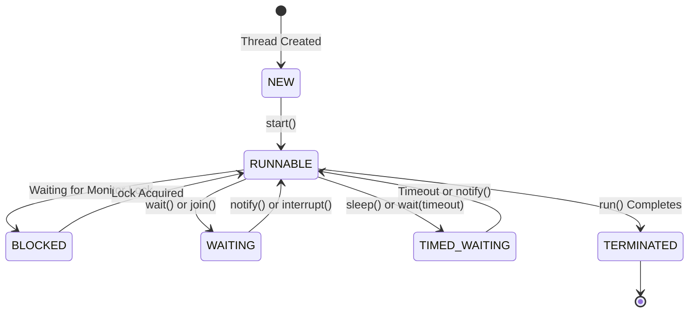
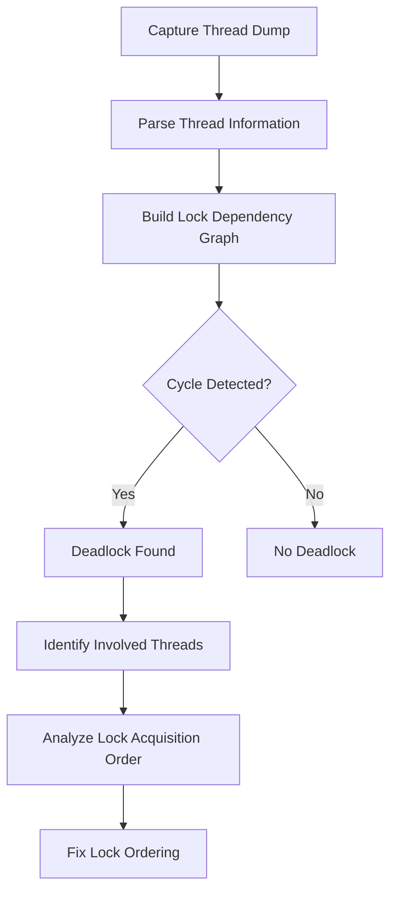
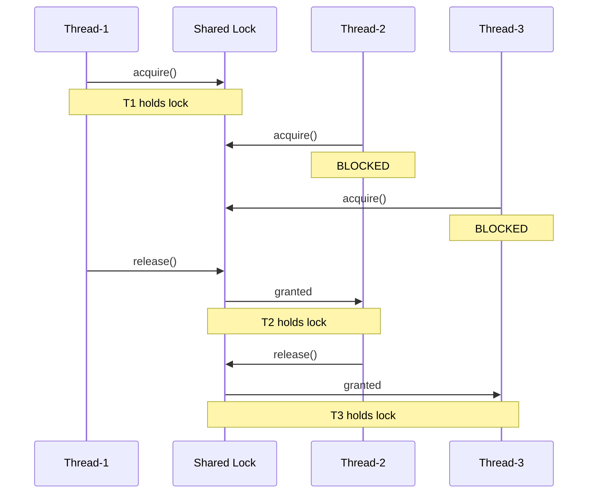
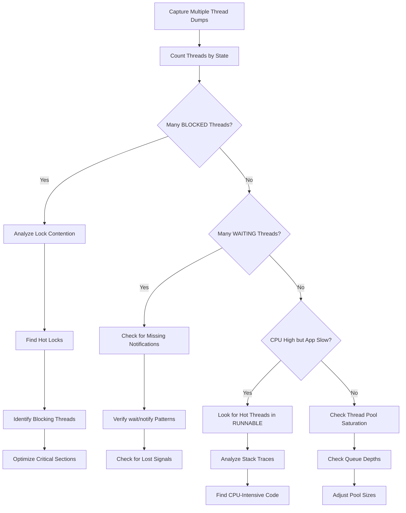

# How to Implement Thread Dump Analysis

Author: [nawazdhandala](https://github.com/nawazdhandala)

Tags: Performance, Threading, Debugging, Analysis

Description: Learn how to capture and analyze thread dumps to debug concurrency issues, detect deadlocks, and resolve lock contention in your applications.

---

## Introduction

Thread dump analysis is one of the most powerful techniques for debugging concurrency issues in multi-threaded applications. When your application hangs, becomes unresponsive, or exhibits strange behavior under load, thread dumps provide a snapshot of what every thread is doing at that moment. This guide will walk you through capturing thread dumps, understanding thread states, detecting deadlocks, and analyzing lock contention.

## Thread Dump Capture Methods

### Method 1: Using jstack (Java)

The `jstack` utility is the most common way to capture thread dumps from a running Java process.

```bash
# Find the process ID of your Java application
jps -l

# Capture a thread dump
jstack <pid> > thread_dump.txt

# Capture multiple dumps with timestamps (useful for trend analysis)
for i in {1..5}; do
    echo "=== Dump $i at $(date) ===" >> thread_dumps.txt
    jstack <pid> >> thread_dumps.txt
    sleep 5
done
```

### Method 2: Using kill -3 (SIGQUIT)

On Unix-like systems, sending SIGQUIT to a Java process will print a thread dump to standard output.

```bash
# Send SIGQUIT signal to the Java process
kill -3 <pid>

# The thread dump will appear in the application's stdout/stderr
# Check your application logs or console output
```

### Method 3: Programmatic Thread Dump (Java)

You can capture thread dumps programmatically within your application.

```java
import java.lang.management.ManagementFactory;
import java.lang.management.ThreadInfo;
import java.lang.management.ThreadMXBean;

public class ThreadDumpCapture {

    /**
     * Captures a complete thread dump including lock information.
     * This method is useful for integrating thread dump capture
     * into monitoring systems or diagnostic endpoints.
     */
    public static String captureThreadDump() {
        StringBuilder dump = new StringBuilder();
        ThreadMXBean threadMXBean = ManagementFactory.getThreadMXBean();

        // Get all thread info with lock details
        ThreadInfo[] threadInfos = threadMXBean.dumpAllThreads(
            true,  // lockedMonitors: include locked monitors
            true   // lockedSynchronizers: include locked synchronizers
        );

        dump.append("Thread Dump at: ").append(System.currentTimeMillis()).append("\n\n");

        for (ThreadInfo threadInfo : threadInfos) {
            dump.append(formatThreadInfo(threadInfo));
            dump.append("\n");
        }

        return dump.toString();
    }

    /**
     * Formats a single thread's information including its stack trace.
     */
    private static String formatThreadInfo(ThreadInfo info) {
        StringBuilder sb = new StringBuilder();

        // Thread header with name, ID, and state
        sb.append(String.format("\"%s\" #%d daemon=%s priority=%d state=%s%n",
            info.getThreadName(),
            info.getThreadId(),
            info.isDaemon(),
            info.getPriority(),
            info.getThreadState()));

        // Lock information if thread is blocked
        if (info.getLockName() != null) {
            sb.append(String.format("    waiting on %s%n", info.getLockName()));
        }
        if (info.getLockOwnerName() != null) {
            sb.append(String.format("    owned by \"%s\" #%d%n",
                info.getLockOwnerName(),
                info.getLockOwnerId()));
        }

        // Stack trace
        for (StackTraceElement element : info.getStackTrace()) {
            sb.append(String.format("        at %s%n", element));
        }

        return sb.toString();
    }
}
```

### Method 4: Using JMX (Remote Capture)

For remote applications, you can use JMX to capture thread dumps.

```java
import javax.management.MBeanServerConnection;
import javax.management.ObjectName;
import javax.management.remote.JMXConnector;
import javax.management.remote.JMXConnectorFactory;
import javax.management.remote.JMXServiceURL;
import java.lang.management.ThreadInfo;

public class RemoteThreadDump {

    /**
     * Connects to a remote JVM and captures a thread dump via JMX.
     * Requires JMX remote access to be enabled on the target JVM.
     */
    public static void captureRemoteThreadDump(String host, int port) throws Exception {
        String url = String.format("service:jmx:rmi:///jndi/rmi://%s:%d/jmxrmi", host, port);
        JMXServiceURL serviceUrl = new JMXServiceURL(url);

        try (JMXConnector connector = JMXConnectorFactory.connect(serviceUrl)) {
            MBeanServerConnection connection = connector.getMBeanServerConnection();

            ObjectName threadMXBeanName = new ObjectName("java.lang:type=Threading");

            // Invoke dumpAllThreads operation
            Object[] params = {true, true};
            String[] signature = {"boolean", "boolean"};

            ThreadInfo[] threadInfos = (ThreadInfo[]) connection.invoke(
                threadMXBeanName,
                "dumpAllThreads",
                params,
                signature
            );

            for (ThreadInfo info : threadInfos) {
                System.out.println(info);
            }
        }
    }
}
```

## Understanding Thread States

Thread states provide crucial information about what a thread is doing. Here are the main states you will encounter:

### Thread State Diagram



### Thread State Reference

| State | Description | Common Causes |
|-------|-------------|---------------|
| NEW | Thread created but not started | Just instantiated, start() not called |
| RUNNABLE | Executing or ready to execute | Normal execution, may be waiting for CPU |
| BLOCKED | Waiting to acquire a monitor lock | synchronized block/method contention |
| WAITING | Waiting indefinitely for another thread | Object.wait(), Thread.join(), LockSupport.park() |
| TIMED_WAITING | Waiting with a timeout | Thread.sleep(), Object.wait(timeout) |
| TERMINATED | Completed execution | run() method finished or exception thrown |

### Analyzing Thread States in Practice

```java
/**
 * Demonstrates different thread states and how to identify them
 * in a thread dump. Run this code and capture a thread dump
 * to see each state in action.
 */
public class ThreadStateDemo {

    private static final Object lock1 = new Object();
    private static final Object lock2 = new Object();

    public static void main(String[] args) throws InterruptedException {

        // Thread in BLOCKED state - waiting for a lock
        Thread blockedThread = new Thread(() -> {
            synchronized (lock1) {
                // This thread holds lock1 and will block others
                try {
                    Thread.sleep(60000);
                } catch (InterruptedException e) {
                    Thread.currentThread().interrupt();
                }
            }
        }, "HoldingLock-Thread");

        Thread waitingForLock = new Thread(() -> {
            synchronized (lock1) {
                // This thread will be BLOCKED waiting for lock1
                System.out.println("Acquired lock1");
            }
        }, "Blocked-Thread");

        // Thread in WAITING state - using Object.wait()
        Thread waitingThread = new Thread(() -> {
            synchronized (lock2) {
                try {
                    lock2.wait();  // WAITING state
                } catch (InterruptedException e) {
                    Thread.currentThread().interrupt();
                }
            }
        }, "Waiting-Thread");

        // Thread in TIMED_WAITING state - using Thread.sleep()
        Thread timedWaitingThread = new Thread(() -> {
            try {
                Thread.sleep(60000);  // TIMED_WAITING state
            } catch (InterruptedException e) {
                Thread.currentThread().interrupt();
            }
        }, "TimedWaiting-Thread");

        // Start all threads
        blockedThread.start();
        Thread.sleep(100);  // Give time for blockedThread to acquire lock
        waitingForLock.start();
        waitingThread.start();
        timedWaitingThread.start();

        System.out.println("Threads started. Capture thread dump now with: jstack " +
            ProcessHandle.current().pid());

        // Keep main thread alive
        Thread.sleep(60000);
    }
}
```

## Deadlock Detection

Deadlocks occur when two or more threads are waiting for each other to release locks, creating a circular dependency. Thread dumps are excellent for detecting deadlocks.

### Deadlock Detection Flow



### Example: Creating and Detecting a Deadlock

```java
import java.lang.management.ManagementFactory;
import java.lang.management.ThreadMXBean;

/**
 * Demonstrates a classic deadlock scenario and how to detect it
 * programmatically using ThreadMXBean.
 */
public class DeadlockDemo {

    private static final Object resourceA = new Object();
    private static final Object resourceB = new Object();

    public static void main(String[] args) throws InterruptedException {

        // Thread 1: Acquires resourceA, then tries to acquire resourceB
        Thread thread1 = new Thread(() -> {
            synchronized (resourceA) {
                System.out.println("Thread1: Holding resourceA");

                try {
                    Thread.sleep(100);  // Simulate some work
                } catch (InterruptedException e) {
                    Thread.currentThread().interrupt();
                }

                System.out.println("Thread1: Waiting for resourceB");
                synchronized (resourceB) {
                    System.out.println("Thread1: Holding both resources");
                }
            }
        }, "Thread-Acquires-A-Then-B");

        // Thread 2: Acquires resourceB, then tries to acquire resourceA
        // This creates a deadlock because the lock order is reversed
        Thread thread2 = new Thread(() -> {
            synchronized (resourceB) {
                System.out.println("Thread2: Holding resourceB");

                try {
                    Thread.sleep(100);  // Simulate some work
                } catch (InterruptedException e) {
                    Thread.currentThread().interrupt();
                }

                System.out.println("Thread2: Waiting for resourceA");
                synchronized (resourceA) {
                    System.out.println("Thread2: Holding both resources");
                }
            }
        }, "Thread-Acquires-B-Then-A");

        thread1.start();
        thread2.start();

        // Wait a moment for deadlock to occur
        Thread.sleep(500);

        // Detect deadlock programmatically
        detectDeadlock();
    }

    /**
     * Uses ThreadMXBean to detect deadlocked threads.
     * This is the same mechanism that jstack uses to report deadlocks.
     */
    public static void detectDeadlock() {
        ThreadMXBean threadMXBean = ManagementFactory.getThreadMXBean();

        // Find threads that are in deadlock waiting to acquire object monitors
        long[] deadlockedThreadIds = threadMXBean.findDeadlockedThreads();

        if (deadlockedThreadIds != null) {
            System.out.println("\n*** DEADLOCK DETECTED ***\n");

            java.lang.management.ThreadInfo[] threadInfos =
                threadMXBean.getThreadInfo(deadlockedThreadIds, true, true);

            for (java.lang.management.ThreadInfo info : threadInfos) {
                System.out.println("Deadlocked thread: " + info.getThreadName());
                System.out.println("  State: " + info.getThreadState());
                System.out.println("  Waiting on: " + info.getLockName());
                System.out.println("  Held by: " + info.getLockOwnerName());
                System.out.println("  Stack trace:");
                for (StackTraceElement element : info.getStackTrace()) {
                    System.out.println("    at " + element);
                }
                System.out.println();
            }
        } else {
            System.out.println("No deadlock detected");
        }
    }
}
```

### What a Deadlock Looks Like in a Thread Dump

When you capture a thread dump with jstack, deadlocks are clearly reported:

```
Found one Java-level deadlock:
=============================
"Thread-Acquires-A-Then-B":
  waiting to lock monitor 0x00007f9a3c006208 (object 0x00000000d6e567c8, a java.lang.Object),
  which is held by "Thread-Acquires-B-Then-A"
"Thread-Acquires-B-Then-A":
  waiting to lock monitor 0x00007f9a3c003d58 (object 0x00000000d6e567b8, a java.lang.Object),
  which is held by "Thread-Acquires-A-Then-B"

Java stack information for the threads listed above:
===================================================
"Thread-Acquires-A-Then-B":
        at DeadlockDemo.lambda$main$0(DeadlockDemo.java:23)
        - waiting to lock <0x00000000d6e567c8> (a java.lang.Object)
        - locked <0x00000000d6e567b8> (a java.lang.Object)
        at DeadlockDemo$$Lambda$1/0x0000000800000a00.run(Unknown Source)
        at java.lang.Thread.run(Thread.java:833)
```

## Lock Contention Analysis

Lock contention occurs when multiple threads compete for the same lock, causing performance degradation. Analyzing thread dumps helps identify hot locks and contention patterns.

### Lock Contention Visualization



### Lock Contention Analyzer

```java
import java.lang.management.ManagementFactory;
import java.lang.management.ThreadInfo;
import java.lang.management.ThreadMXBean;
import java.util.HashMap;
import java.util.Map;
import java.util.concurrent.ConcurrentHashMap;

/**
 * Analyzes thread dumps to identify lock contention hotspots.
 * Tracks which locks have the most threads waiting and
 * which threads are blocking others most frequently.
 */
public class LockContentionAnalyzer {

    /**
     * Represents statistics about a lock's contention level.
     */
    static class LockStats {
        String lockName;
        int waitingThreadCount;
        String currentHolder;

        @Override
        public String toString() {
            return String.format("Lock: %s, Waiting: %d, Held by: %s",
                lockName, waitingThreadCount, currentHolder);
        }
    }

    /**
     * Analyzes current thread states to find contended locks.
     * Returns a map of lock names to their contention statistics.
     */
    public static Map<String, LockStats> analyzeLockContention() {
        ThreadMXBean threadMXBean = ManagementFactory.getThreadMXBean();
        ThreadInfo[] allThreads = threadMXBean.dumpAllThreads(true, true);

        // Track how many threads are waiting on each lock
        Map<String, LockStats> lockStatsMap = new HashMap<>();

        for (ThreadInfo thread : allThreads) {
            // Check if this thread is blocked waiting for a lock
            if (thread.getThreadState() == Thread.State.BLOCKED) {
                String lockName = thread.getLockName();

                if (lockName != null) {
                    LockStats stats = lockStatsMap.computeIfAbsent(
                        lockName,
                        k -> new LockStats()
                    );
                    stats.lockName = lockName;
                    stats.waitingThreadCount++;
                    stats.currentHolder = thread.getLockOwnerName();
                }
            }
        }

        return lockStatsMap;
    }

    /**
     * Finds threads that are blocking the most other threads.
     * These are "hot" threads that may need optimization.
     */
    public static Map<String, Integer> findBlockingThreads() {
        ThreadMXBean threadMXBean = ManagementFactory.getThreadMXBean();
        ThreadInfo[] allThreads = threadMXBean.dumpAllThreads(true, true);

        // Count how many threads each thread is blocking
        Map<String, Integer> blockingCount = new HashMap<>();

        for (ThreadInfo thread : allThreads) {
            if (thread.getThreadState() == Thread.State.BLOCKED) {
                String blocker = thread.getLockOwnerName();
                if (blocker != null) {
                    blockingCount.merge(blocker, 1, Integer::sum);
                }
            }
        }

        return blockingCount;
    }

    /**
     * Generates a contention report suitable for logging or alerting.
     */
    public static String generateContentionReport() {
        StringBuilder report = new StringBuilder();
        report.append("=== Lock Contention Report ===\n\n");

        Map<String, LockStats> lockStats = analyzeLockContention();
        Map<String, Integer> blockingThreads = findBlockingThreads();

        if (lockStats.isEmpty()) {
            report.append("No lock contention detected.\n");
        } else {
            report.append("Contended Locks:\n");
            lockStats.values().stream()
                .sorted((a, b) -> b.waitingThreadCount - a.waitingThreadCount)
                .forEach(stats -> report.append("  ").append(stats).append("\n"));
        }

        report.append("\nBlocking Threads:\n");
        if (blockingThreads.isEmpty()) {
            report.append("  No threads are blocking others.\n");
        } else {
            blockingThreads.entrySet().stream()
                .sorted((a, b) -> b.getValue() - a.getValue())
                .forEach(entry ->
                    report.append(String.format("  %s is blocking %d thread(s)%n",
                        entry.getKey(), entry.getValue())));
        }

        return report.toString();
    }
}
```

### Reducing Lock Contention

```java
import java.util.concurrent.locks.ReadWriteLock;
import java.util.concurrent.locks.ReentrantReadWriteLock;
import java.util.concurrent.ConcurrentHashMap;

/**
 * Demonstrates techniques for reducing lock contention
 * in high-throughput applications.
 */
public class LockContentionSolutions {

    // Problem: Single lock for all operations
    private final Object singleLock = new Object();
    private int counter = 0;

    // Solution 1: Use finer-grained locks (lock striping)
    private final Object[] stripedLocks = new Object[16];
    private final int[] stripedCounters = new int[16];

    public LockContentionSolutions() {
        for (int i = 0; i < stripedLocks.length; i++) {
            stripedLocks[i] = new Object();
        }
    }

    /**
     * Bad: All threads contend for a single lock.
     * In a thread dump, you will see many threads BLOCKED
     * waiting for this single lock.
     */
    public void incrementBad() {
        synchronized (singleLock) {
            counter++;
        }
    }

    /**
     * Better: Distribute contention across multiple locks.
     * Different threads can operate on different stripes simultaneously.
     */
    public void incrementBetter(int key) {
        int stripe = Math.abs(key % stripedLocks.length);
        synchronized (stripedLocks[stripe]) {
            stripedCounters[stripe]++;
        }
    }

    // Solution 2: Use ReadWriteLock for read-heavy workloads
    private final ReadWriteLock rwLock = new ReentrantReadWriteLock();
    private volatile String sharedData = "";

    /**
     * Multiple readers can proceed concurrently.
     * In a thread dump, you will see multiple threads
     * holding the read lock simultaneously.
     */
    public String readData() {
        rwLock.readLock().lock();
        try {
            return sharedData;
        } finally {
            rwLock.readLock().unlock();
        }
    }

    /**
     * Writers get exclusive access, but this is less frequent.
     */
    public void writeData(String data) {
        rwLock.writeLock().lock();
        try {
            sharedData = data;
        } finally {
            rwLock.writeLock().unlock();
        }
    }

    // Solution 3: Use lock-free data structures
    private final ConcurrentHashMap<String, Integer> lockFreeMap =
        new ConcurrentHashMap<>();

    /**
     * ConcurrentHashMap uses internal striping and CAS operations.
     * You will rarely see threads BLOCKED on this in thread dumps.
     */
    public void updateLockFree(String key) {
        lockFreeMap.merge(key, 1, Integer::sum);
    }
}
```

## Thread Dump Analysis Checklist

When analyzing thread dumps, follow this systematic approach:



### Summary of Key Indicators

| Symptom | Thread Dump Pattern | Likely Cause | Solution |
|---------|---------------------|--------------|----------|
| Application hangs | Threads in BLOCKED state | Deadlock | Fix lock ordering |
| Slow response | Many BLOCKED threads on same lock | Lock contention | Reduce lock scope, use striping |
| High CPU, slow app | Threads in RUNNABLE with same stack | Busy loop or inefficient code | Optimize the hot path |
| Requests timing out | Thread pool threads all WAITING | Pool exhaustion | Increase pool size, fix slow tasks |
| Memory growing | Many threads created | Thread leak | Ensure threads terminate |

## Conclusion

Thread dump analysis is an essential skill for debugging concurrent applications. By understanding thread states, recognizing patterns of deadlocks and lock contention, and using the right tools to capture and analyze dumps, you can quickly diagnose and resolve complex threading issues. Remember to capture multiple thread dumps over time to identify trends and intermittent issues that might not appear in a single snapshot.
