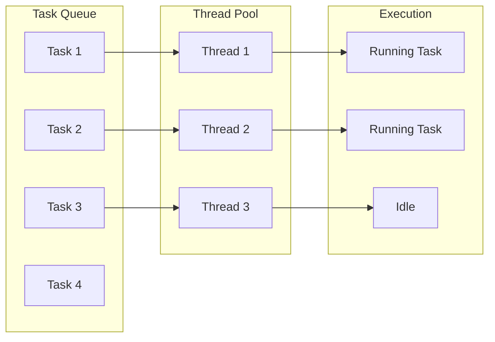
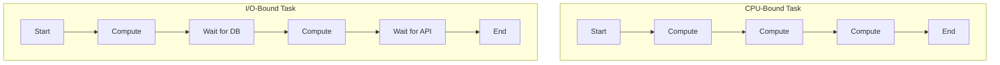
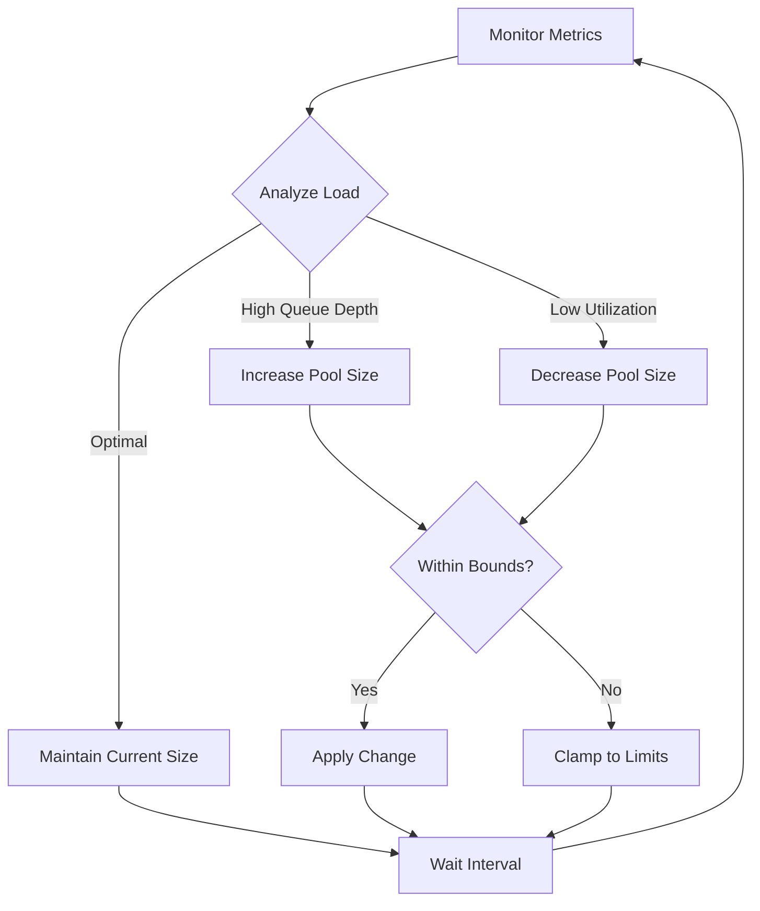
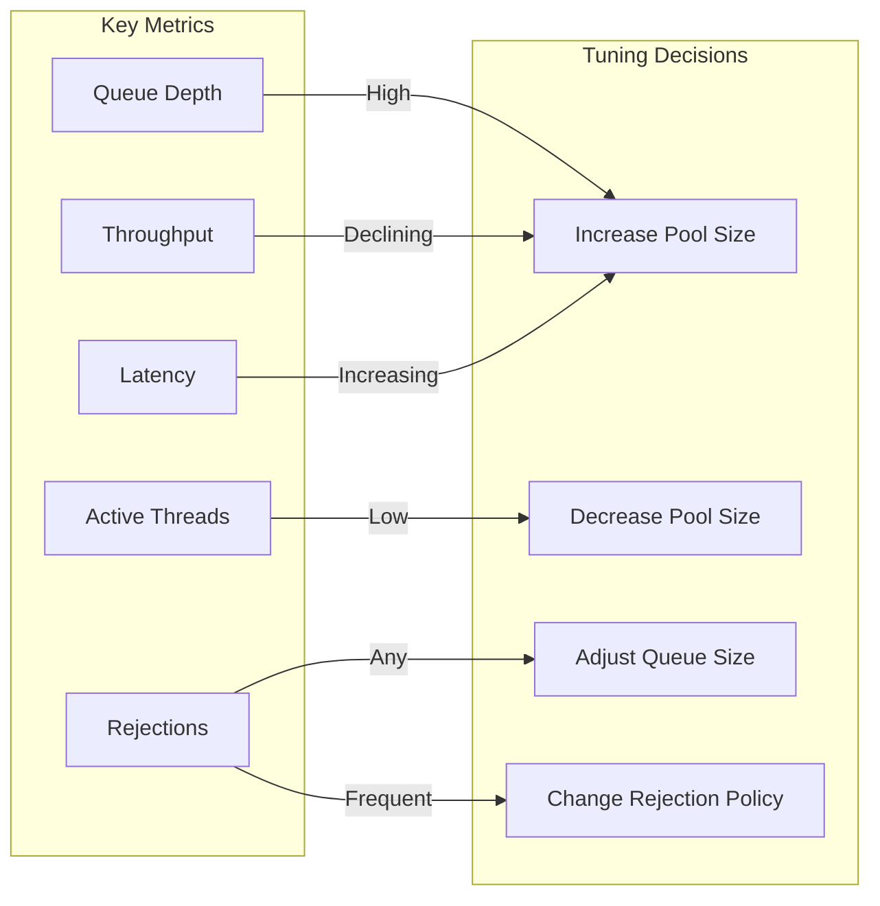

# How to Implement Thread Pool Sizing

Author: [nawazdhandala](https://github.com/nawazdhandala)

Tags: Performance, Threading, Concurrency, Optimization

Description: Learn how to calculate and configure optimal thread pool sizes for maximum application performance and resource efficiency.

---

Thread pool sizing is one of the most critical yet often overlooked aspects of building high-performance concurrent applications. Choose a pool that is too small and you leave resources idle while requests queue up. Choose one that is too large and you waste memory, increase context switching overhead, and potentially degrade performance. This guide will walk you through the science and practice of sizing thread pools correctly.

## Understanding Thread Pools

A thread pool is a collection of pre-initialized threads that stand ready to execute tasks. Instead of creating a new thread for each task (which is expensive), tasks are submitted to the pool and executed by available threads.



## The Fundamental Formulas

### CPU-Bound Workloads

For tasks that spend most of their time performing computations:

```
Optimal Pool Size = Number of CPUs + 1
```

The extra thread accounts for occasional page faults or brief pauses. Adding more threads beyond this point causes context switching overhead that actually slows execution.

**Example calculation:**
- 8 CPU cores available
- Optimal pool size = 8 + 1 = 9 threads

### I/O-Bound Workloads

For tasks that spend significant time waiting for external resources (database queries, API calls, file operations):

```
Optimal Pool Size = Number of CPUs * Target CPU Utilization * (1 + Wait Time / Compute Time)
```

Where:
- **Number of CPUs**: Available processor cores
- **Target CPU Utilization**: Desired CPU usage (0 to 1, typically 0.8 to 0.9)
- **Wait Time**: Average time spent waiting for I/O
- **Compute Time**: Average time spent performing computation

**Example calculation:**
- 8 CPU cores
- Target 80% CPU utilization
- Tasks wait 200ms for I/O and compute for 50ms
- Optimal pool size = 8 * 0.8 * (1 + 200/50) = 8 * 0.8 * 5 = 32 threads

### Little's Law Approach

An alternative formula based on queuing theory:

```
Optimal Pool Size = Throughput * Latency
```

Where:
- **Throughput**: Desired requests per second
- **Latency**: Average time to process one request

**Example calculation:**
- Target throughput: 1000 requests/second
- Average latency: 50ms (0.05 seconds)
- Optimal pool size = 1000 * 0.05 = 50 threads

## CPU-Bound vs I/O-Bound Workloads

Understanding your workload type is essential for proper sizing.



### CPU-Bound Characteristics

- Heavy mathematical computations
- Image or video processing
- Data compression or encryption
- Sorting large datasets
- Machine learning inference

**Code Example (Java):**

```java
// CPU-bound thread pool configuration
// For CPU-intensive work, keep pool size close to CPU count
public class CpuBoundPoolConfig {

    public static ExecutorService createCpuBoundPool() {
        // Get the number of available processors
        int cpuCores = Runtime.getRuntime().availableProcessors();

        // Add 1 to handle occasional blocking (page faults, etc.)
        int poolSize = cpuCores + 1;

        // Use fixed pool since CPU-bound tasks have predictable resource needs
        return Executors.newFixedThreadPool(poolSize, new ThreadFactory() {
            private int counter = 0;

            @Override
            public Thread newThread(Runnable r) {
                Thread thread = new Thread(r);
                thread.setName("cpu-worker-" + counter++);
                // Set high priority for compute-intensive work
                thread.setPriority(Thread.NORM_PRIORITY + 1);
                return thread;
            }
        });
    }
}
```

### I/O-Bound Characteristics

- Database queries
- HTTP API calls
- File system operations
- Network communication
- Message queue interactions

**Code Example (Java):**

```java
// I/O-bound thread pool configuration
// For I/O-intensive work, use larger pool to keep CPU busy during waits
public class IoBoundPoolConfig {

    public static ExecutorService createIoBoundPool() {
        int cpuCores = Runtime.getRuntime().availableProcessors();

        // Estimate wait-to-compute ratio based on profiling
        // In this example: tasks wait 200ms, compute 50ms (ratio = 4)
        double waitComputeRatio = 4.0;

        // Target 80% CPU utilization to leave headroom
        double targetUtilization = 0.8;

        // Apply the formula: CPUs * utilization * (1 + W/C)
        int poolSize = (int) (cpuCores * targetUtilization * (1 + waitComputeRatio));

        // Use ThreadPoolExecutor for more control
        return new ThreadPoolExecutor(
            poolSize,                          // core pool size
            poolSize * 2,                      // maximum pool size for bursts
            60L, TimeUnit.SECONDS,             // idle thread timeout
            new LinkedBlockingQueue<>(1000),   // bounded queue prevents memory issues
            new ThreadFactory() {
                private int counter = 0;

                @Override
                public Thread newThread(Runnable r) {
                    Thread thread = new Thread(r);
                    thread.setName("io-worker-" + counter++);
                    return thread;
                }
            },
            new ThreadPoolExecutor.CallerRunsPolicy()  // backpressure strategy
        );
    }
}
```

## Dynamic Pool Sizing

Static pool sizes work well for predictable workloads, but many applications face variable load patterns. Dynamic sizing adjusts pool capacity based on current conditions.



**Code Example (Python):**

```python
import threading
import time
from concurrent.futures import ThreadPoolExecutor
from dataclasses import dataclass
from typing import Callable
import os

@dataclass
class PoolMetrics:
    """Holds current thread pool metrics for analysis."""
    active_threads: int
    queue_depth: int
    completed_tasks: int
    avg_task_duration_ms: float

class DynamicThreadPool:
    """
    A thread pool that automatically adjusts its size based on workload.
    Monitors queue depth and thread utilization to make scaling decisions.
    """

    def __init__(
        self,
        min_threads: int = 2,
        max_threads: int = None,
        target_queue_depth: int = 10,
        adjustment_interval_seconds: float = 5.0
    ):
        # Default max to 4x CPU count for I/O-bound work
        self.min_threads = min_threads
        self.max_threads = max_threads or os.cpu_count() * 4
        self.target_queue_depth = target_queue_depth
        self.adjustment_interval = adjustment_interval_seconds

        # Start at minimum size
        self.current_size = min_threads
        self._executor = ThreadPoolExecutor(max_workers=self.current_size)

        # Metrics tracking
        self._pending_tasks = 0
        self._completed_tasks = 0
        self._total_duration_ms = 0.0
        self._lock = threading.Lock()

        # Start the monitoring thread
        self._running = True
        self._monitor_thread = threading.Thread(
            target=self._monitor_and_adjust,
            daemon=True
        )
        self._monitor_thread.start()

    def submit(self, fn: Callable, *args, **kwargs):
        """Submit a task to the pool with metrics tracking."""
        with self._lock:
            self._pending_tasks += 1

        def wrapped_task():
            start = time.time()
            try:
                return fn(*args, **kwargs)
            finally:
                duration_ms = (time.time() - start) * 1000
                with self._lock:
                    self._pending_tasks -= 1
                    self._completed_tasks += 1
                    self._total_duration_ms += duration_ms

        return self._executor.submit(wrapped_task)

    def _get_metrics(self) -> PoolMetrics:
        """Collect current pool metrics."""
        with self._lock:
            avg_duration = (
                self._total_duration_ms / self._completed_tasks
                if self._completed_tasks > 0 else 0
            )
            return PoolMetrics(
                active_threads=self.current_size,
                queue_depth=self._pending_tasks,
                completed_tasks=self._completed_tasks,
                avg_task_duration_ms=avg_duration
            )

    def _monitor_and_adjust(self):
        """Background thread that monitors metrics and adjusts pool size."""
        while self._running:
            time.sleep(self.adjustment_interval)
            metrics = self._get_metrics()

            # Calculate new size based on queue depth
            if metrics.queue_depth > self.target_queue_depth * 2:
                # Queue is backing up, increase threads
                new_size = min(self.current_size + 2, self.max_threads)
            elif metrics.queue_depth > self.target_queue_depth:
                # Queue is growing, add one thread
                new_size = min(self.current_size + 1, self.max_threads)
            elif metrics.queue_depth < self.target_queue_depth // 2:
                # Queue is mostly empty, reduce threads
                new_size = max(self.current_size - 1, self.min_threads)
            else:
                # Queue depth is acceptable, no change
                new_size = self.current_size

            # Apply change if needed
            if new_size != self.current_size:
                self._resize_pool(new_size)

    def _resize_pool(self, new_size: int):
        """Resize the thread pool to the new size."""
        # ThreadPoolExecutor allows changing max_workers
        self._executor._max_workers = new_size
        self.current_size = new_size
        print(f"Pool resized to {new_size} threads")

    def shutdown(self, wait: bool = True):
        """Shutdown the pool and monitoring thread."""
        self._running = False
        self._executor.shutdown(wait=wait)
```

## Monitoring and Tuning

Effective thread pool management requires continuous monitoring. Key metrics to track include:

### Essential Metrics

1. **Queue Depth**: Number of tasks waiting for execution
2. **Active Thread Count**: Threads currently executing tasks
3. **Task Throughput**: Tasks completed per second
4. **Task Latency**: Time from submission to completion
5. **Rejection Count**: Tasks rejected due to full queue
6. **Thread Utilization**: Percentage of time threads are active



### Monitoring Implementation (Java with Micrometer)

```java
import io.micrometer.core.instrument.MeterRegistry;
import io.micrometer.core.instrument.Timer;
import io.micrometer.core.instrument.binder.jvm.ExecutorServiceMetrics;

import java.util.concurrent.*;

public class MonitoredThreadPool {

    private final ThreadPoolExecutor executor;
    private final MeterRegistry registry;
    private final Timer taskTimer;

    public MonitoredThreadPool(MeterRegistry registry, String poolName) {
        this.registry = registry;

        // Create the thread pool with specific configuration
        this.executor = new ThreadPoolExecutor(
            10,                                    // core size
            50,                                    // max size
            60L, TimeUnit.SECONDS,                 // keep-alive
            new LinkedBlockingQueue<>(1000),       // work queue
            new NamedThreadFactory(poolName),
            new ThreadPoolExecutor.AbortPolicy()   // rejection policy
        );

        // Register executor metrics with Micrometer
        // This automatically tracks queue size, active threads, etc.
        ExecutorServiceMetrics.monitor(
            registry,
            executor,
            poolName
        );

        // Create a timer for task duration tracking
        this.taskTimer = Timer.builder(poolName + ".task.duration")
            .description("Time taken to execute tasks")
            .register(registry);

        // Custom gauge for queue depth percentage
        registry.gauge(
            poolName + ".queue.utilization",
            executor,
            e -> {
                BlockingQueue<Runnable> queue = e.getQueue();
                if (queue instanceof LinkedBlockingQueue) {
                    int remaining = ((LinkedBlockingQueue<?>) queue).remainingCapacity();
                    int total = queue.size() + remaining;
                    return (double) queue.size() / total;
                }
                return 0.0;
            }
        );
    }

    public Future<?> submit(Runnable task) {
        // Wrap task to measure execution time
        Runnable timedTask = () -> {
            Timer.Sample sample = Timer.start(registry);
            try {
                task.run();
            } finally {
                sample.stop(taskTimer);
            }
        };

        return executor.submit(timedTask);
    }

    public <T> Future<T> submit(Callable<T> task) {
        // Wrap callable to measure execution time
        Callable<T> timedTask = () -> {
            Timer.Sample sample = Timer.start(registry);
            try {
                return task.call();
            } finally {
                sample.stop(taskTimer);
            }
        };

        return executor.submit(timedTask);
    }

    // Helper class for naming threads
    private static class NamedThreadFactory implements ThreadFactory {
        private final String namePrefix;
        private int counter = 0;

        NamedThreadFactory(String poolName) {
            this.namePrefix = poolName + "-worker-";
        }

        @Override
        public Thread newThread(Runnable r) {
            Thread thread = new Thread(r);
            thread.setName(namePrefix + counter++);
            thread.setDaemon(false);
            return thread;
        }
    }
}
```

### Tuning Guidelines

| Symptom | Possible Cause | Solution |
|---------|----------------|----------|
| High queue depth, low CPU | Pool too small for I/O work | Increase pool size |
| High CPU, slow throughput | Too many threads causing contention | Decrease pool size |
| Frequent rejections | Pool and queue both saturated | Increase queue or pool size |
| Memory pressure | Too many threads | Reduce max pool size |
| Inconsistent latency | Pool size fluctuating | Set core = max for stability |

## Practical Considerations

### Separate Pools for Different Workloads

Never mix CPU-bound and I/O-bound tasks in the same pool. I/O-bound pools need many threads, which would cause excessive context switching for CPU-bound work.

```java
public class ApplicationPools {

    // Pool for CPU-intensive operations like data processing
    private static final ExecutorService cpuPool = Executors.newFixedThreadPool(
        Runtime.getRuntime().availableProcessors() + 1
    );

    // Pool for database operations
    private static final ExecutorService dbPool = new ThreadPoolExecutor(
        20, 50, 60L, TimeUnit.SECONDS,
        new LinkedBlockingQueue<>(500)
    );

    // Pool for external API calls
    private static final ExecutorService apiPool = new ThreadPoolExecutor(
        30, 100, 60L, TimeUnit.SECONDS,
        new LinkedBlockingQueue<>(1000)
    );

    public static ExecutorService getCpuPool() { return cpuPool; }
    public static ExecutorService getDbPool() { return dbPool; }
    public static ExecutorService getApiPool() { return apiPool; }
}
```

### Connection Pool Alignment

When your thread pool makes database calls, align thread pool size with connection pool size. Having more threads than connections means threads wait for connections, wasting resources.

```java
// Match thread pool to connection pool
int connectionPoolSize = 20;  // from HikariCP or similar

ExecutorService dbPool = Executors.newFixedThreadPool(connectionPoolSize);
```

### Graceful Shutdown

Always implement graceful shutdown to complete in-flight tasks:

```java
public void shutdownGracefully(ExecutorService pool, int timeoutSeconds) {
    // Stop accepting new tasks
    pool.shutdown();

    try {
        // Wait for existing tasks to complete
        if (!pool.awaitTermination(timeoutSeconds, TimeUnit.SECONDS)) {
            // Force shutdown if tasks did not complete in time
            List<Runnable> pending = pool.shutdownNow();
            System.err.println("Forced shutdown, " + pending.size() + " tasks not executed");

            // Wait again for tasks to respond to cancellation
            if (!pool.awaitTermination(timeoutSeconds, TimeUnit.SECONDS)) {
                System.err.println("Pool did not terminate cleanly");
            }
        }
    } catch (InterruptedException e) {
        // Re-cancel if current thread was interrupted
        pool.shutdownNow();
        Thread.currentThread().interrupt();
    }
}
```

## Summary

Optimal thread pool sizing requires understanding your workload characteristics:

1. **For CPU-bound work**: Use `CPU cores + 1` threads
2. **For I/O-bound work**: Use `CPUs * utilization * (1 + wait/compute)` threads
3. **Separate pools** for different workload types
4. **Monitor continuously** and adjust based on metrics
5. **Consider dynamic sizing** for variable workloads
6. **Align with other resource pools** like database connections

Start with calculated values, measure actual performance, and tune iteratively. The formulas provide a starting point, but real-world performance depends on your specific application characteristics.
