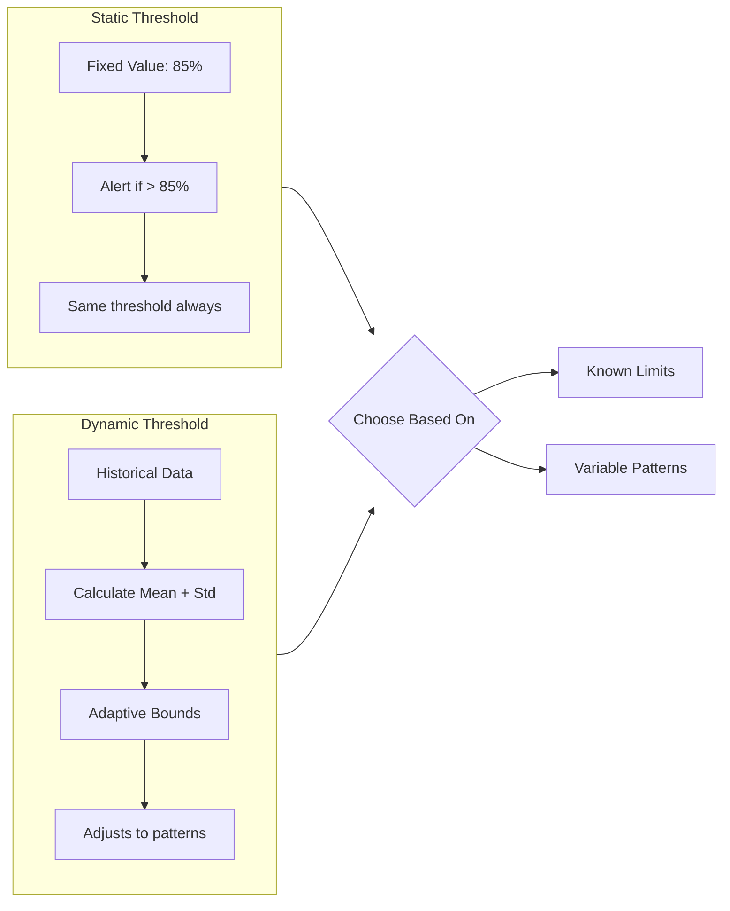
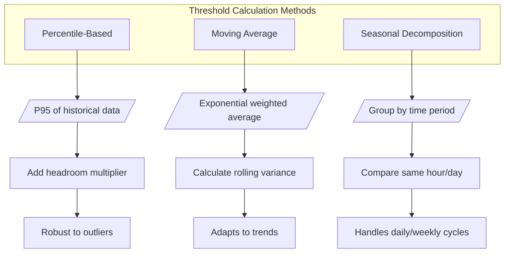
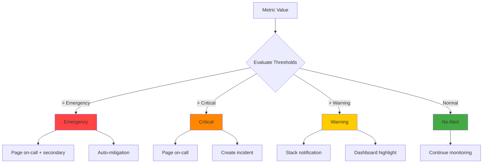
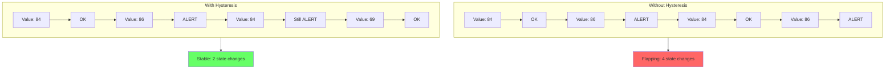
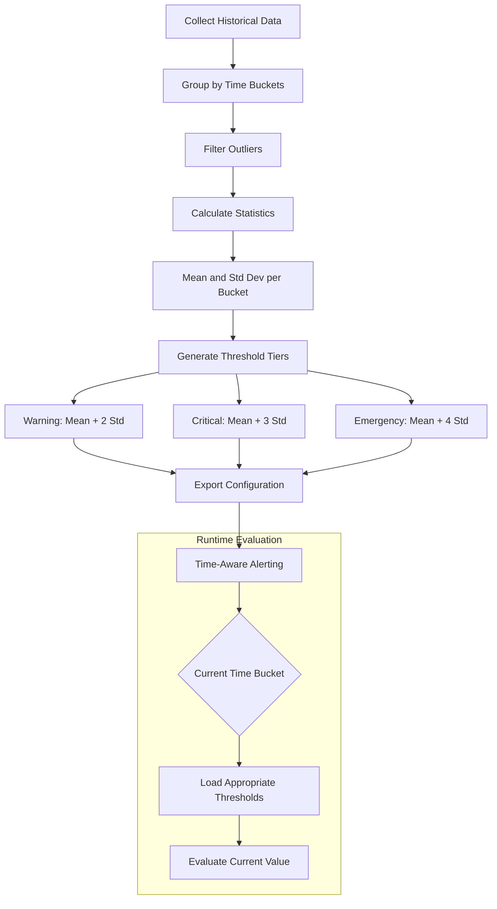

# How to Create Threshold Alerting

Author: [nawazdhandala](https://github.com/nawazdhandala)

Tags: Alerting, Monitoring, SRE, Thresholds

Description: Learn how to implement effective threshold-based alerting for proactive incident detection.

---

Threshold alerting is the foundation of every monitoring system. When a metric crosses a predefined boundary, an alert fires. Simple in concept, but getting it right requires understanding the nuances of threshold design, calculation methods, and anti-flapping techniques.

This guide walks through the essential patterns for building threshold alerts that catch real problems without drowning your team in noise.

---

## Static vs Dynamic Thresholds

The first decision you face is whether to use fixed values or let the system calculate boundaries from historical data.

### Static Thresholds

Static thresholds are explicit values you define based on known limits or SLA requirements.

```yaml
# Static threshold configuration
alert:
  name: high_cpu_usage
  metric: system.cpu.utilization
  condition: ">"
  threshold: 85
  duration: 5m
  severity: warning
```

**When to use static thresholds:**

- Known hard limits (disk full at 100%, memory exhausted)
- SLA-driven targets (latency must stay under 200ms)
- Capacity boundaries (connection pool max is 100)
- Compliance requirements (transactions must complete within X seconds)

**Advantages:**

- Predictable and easy to understand
- No warm-up period required
- Clear documentation for audits

**Disadvantages:**

- Requires manual tuning per service
- Cannot adapt to seasonal traffic patterns
- Often set too loose (missed incidents) or too tight (alert fatigue)

### Dynamic Thresholds

Dynamic thresholds calculate boundaries based on historical behavior, typically using statistical methods.

```python
import numpy as np
from datetime import datetime, timedelta

class DynamicThreshold:
    def __init__(self, lookback_days=14, num_std=3):
        self.lookback_days = lookback_days
        self.num_std = num_std

    def calculate_bounds(self, historical_data):
        """
        Calculate upper and lower bounds using mean + standard deviations.
        """
        mean = np.mean(historical_data)
        std = np.std(historical_data)

        upper_bound = mean + (self.num_std * std)
        lower_bound = mean - (self.num_std * std)

        return {
            "mean": mean,
            "std": std,
            "upper_bound": max(0, upper_bound),  # Prevent negative for metrics like latency
            "lower_bound": max(0, lower_bound)
        }

    def is_anomalous(self, current_value, bounds):
        """
        Check if current value falls outside calculated bounds.
        """
        return current_value > bounds["upper_bound"] or current_value < bounds["lower_bound"]

# Example usage
threshold_calculator = DynamicThreshold(lookback_days=14, num_std=2.5)
historical_latency = [45, 52, 48, 55, 47, 51, 49, 53, 46, 50]  # milliseconds
bounds = threshold_calculator.calculate_bounds(historical_latency)

print(f"Normal range: {bounds['lower_bound']:.1f}ms - {bounds['upper_bound']:.1f}ms")
# Output: Normal range: 40.2ms - 59.8ms
```

**When to use dynamic thresholds:**

- Traffic patterns vary by time of day or week
- New services without established baselines
- Metrics with natural drift over time
- Detecting anomalies rather than specific limits

The following diagram illustrates how static and dynamic thresholds compare when monitoring a metric over time:



---

## Threshold Calculation Methods

Beyond simple mean and standard deviation, several calculation methods suit different scenarios.

### Percentile-Based Thresholds

Percentiles are robust against outliers and represent what users actually experience.

```python
import numpy as np

def percentile_threshold(data, percentile=95, headroom=1.2):
    """
    Calculate threshold based on historical percentile with headroom.

    Args:
        data: Historical metric values
        percentile: Which percentile to use as baseline (e.g., 95)
        headroom: Multiplier for acceptable deviation (e.g., 1.2 = 20% above)

    Returns:
        Threshold value
    """
    baseline = np.percentile(data, percentile)
    threshold = baseline * headroom
    return threshold

# Calculate P95 latency threshold with 20% headroom
latency_samples = [12, 15, 18, 22, 25, 28, 35, 42, 55, 120]  # ms
threshold = percentile_threshold(latency_samples, percentile=95, headroom=1.2)
print(f"Alert threshold: {threshold:.1f}ms")
# Output: Alert threshold: 103.2ms
```

### Moving Average with Bands

Exponential moving averages smooth out noise while remaining responsive to trends.

```python
class MovingAverageThreshold:
    def __init__(self, alpha=0.3, band_multiplier=2.0):
        """
        Args:
            alpha: Smoothing factor (0-1). Higher = more responsive to recent data
            band_multiplier: How many MADs (median absolute deviations) for bounds
        """
        self.alpha = alpha
        self.band_multiplier = band_multiplier
        self.ema = None
        self.emv = None  # Exponential moving variance

    def update(self, value):
        """
        Update EMA and variance with new data point.
        """
        if self.ema is None:
            self.ema = value
            self.emv = 0
        else:
            diff = value - self.ema
            self.ema = self.ema + self.alpha * diff
            self.emv = (1 - self.alpha) * (self.emv + self.alpha * diff * diff)

        std = self.emv ** 0.5
        return {
            "ema": self.ema,
            "upper_bound": self.ema + (self.band_multiplier * std),
            "lower_bound": self.ema - (self.band_multiplier * std)
        }

# Simulate real-time threshold updates
tracker = MovingAverageThreshold(alpha=0.2, band_multiplier=2.5)
incoming_values = [100, 102, 98, 105, 101, 150, 103, 99]  # Spike at position 5

for i, val in enumerate(incoming_values):
    bounds = tracker.update(val)
    status = "ALERT" if val > bounds["upper_bound"] else "OK"
    print(f"Value: {val}, Upper Bound: {bounds['upper_bound']:.1f}, Status: {status}")
```

### Seasonal Decomposition

For metrics with daily or weekly patterns, compare against the same time window from previous periods.

```python
from collections import defaultdict
import statistics

class SeasonalThreshold:
    def __init__(self, season_length=24, num_seasons=7, num_std=2):
        """
        Args:
            season_length: Hours in one cycle (24 for daily patterns)
            num_seasons: How many past seasons to consider (7 = one week)
            num_std: Standard deviations for threshold
        """
        self.season_length = season_length
        self.num_seasons = num_seasons
        self.num_std = num_std
        self.history = defaultdict(list)  # hour -> list of values

    def add_observation(self, hour, value):
        """Store observation and maintain rolling window."""
        self.history[hour].append(value)
        # Keep only num_seasons worth of data
        if len(self.history[hour]) > self.num_seasons:
            self.history[hour].pop(0)

    def get_threshold(self, hour):
        """Calculate threshold for specific hour based on historical data."""
        if len(self.history[hour]) < 2:
            return None  # Not enough data

        mean = statistics.mean(self.history[hour])
        std = statistics.stdev(self.history[hour])

        return {
            "expected": mean,
            "upper_bound": mean + (self.num_std * std),
            "lower_bound": mean - (self.num_std * std)
        }

# Example: Traffic monitoring with hourly patterns
seasonal = SeasonalThreshold(season_length=24, num_seasons=7, num_std=2)

# Load historical data (requests per minute at 9 AM over past 7 days)
historical_9am = [1200, 1150, 1180, 1220, 1190, 1160, 1175]
for val in historical_9am:
    seasonal.add_observation(hour=9, value=val)

# Get threshold for 9 AM
threshold = seasonal.get_threshold(hour=9)
print(f"9 AM - Expected: {threshold['expected']:.0f} req/min")
print(f"9 AM - Alert if outside: {threshold['lower_bound']:.0f} - {threshold['upper_bound']:.0f}")
```

The following diagram shows how different threshold calculation methods work:



---

## Multi-Threshold Configurations

Real-world alerting rarely uses a single threshold. Layered thresholds provide graduated responses.

### Severity Tiers

```yaml
# Multi-threshold alert configuration
alerts:
  - name: api_latency_warning
    metric: api.request.duration.p99
    condition: ">"
    threshold: 200  # ms
    duration: 5m
    severity: warning
    actions:
      - log_to_dashboard
      - notify_slack_channel

  - name: api_latency_critical
    metric: api.request.duration.p99
    condition: ">"
    threshold: 500  # ms
    duration: 2m
    severity: critical
    actions:
      - page_on_call
      - create_incident

  - name: api_latency_emergency
    metric: api.request.duration.p99
    condition: ">"
    threshold: 2000  # ms
    duration: 30s
    severity: emergency
    actions:
      - page_on_call
      - page_secondary
      - trigger_automated_mitigation
```

### Compound Conditions

Combine multiple metrics to reduce false positives.

```python
class CompoundAlert:
    def __init__(self, name, conditions, require_all=True):
        """
        Args:
            name: Alert name
            conditions: List of condition dicts with metric, operator, threshold
            require_all: If True, all conditions must be true. If False, any.
        """
        self.name = name
        self.conditions = conditions
        self.require_all = require_all

    def evaluate(self, current_metrics):
        """
        Evaluate all conditions against current metric values.

        Args:
            current_metrics: Dict of metric_name -> current_value

        Returns:
            Tuple of (should_alert: bool, triggered_conditions: list)
        """
        triggered = []

        for condition in self.conditions:
            metric = condition["metric"]
            operator = condition["operator"]
            threshold = condition["threshold"]

            if metric not in current_metrics:
                continue

            value = current_metrics[metric]
            is_triggered = self._check_condition(value, operator, threshold)

            if is_triggered:
                triggered.append({
                    "metric": metric,
                    "value": value,
                    "threshold": threshold,
                    "operator": operator
                })

        if self.require_all:
            should_alert = len(triggered) == len(self.conditions)
        else:
            should_alert = len(triggered) > 0

        return should_alert, triggered

    def _check_condition(self, value, operator, threshold):
        operators = {
            ">": lambda v, t: v > t,
            ">=": lambda v, t: v >= t,
            "<": lambda v, t: v < t,
            "<=": lambda v, t: v <= t,
            "==": lambda v, t: v == t,
        }
        return operators[operator](value, threshold)

# Alert only when BOTH high latency AND high error rate
degraded_service_alert = CompoundAlert(
    name="service_degradation",
    conditions=[
        {"metric": "latency_p99_ms", "operator": ">", "threshold": 500},
        {"metric": "error_rate_percent", "operator": ">", "threshold": 5},
    ],
    require_all=True
)

# Test evaluation
current = {"latency_p99_ms": 650, "error_rate_percent": 8}
should_alert, triggered = degraded_service_alert.evaluate(current)
print(f"Alert: {should_alert}, Conditions met: {len(triggered)}")
# Output: Alert: True, Conditions met: 2
```

The following diagram illustrates multi-threshold severity levels:



---

## Hysteresis to Prevent Flapping

When metrics hover around a threshold, alerts can rapidly fire and clear, creating noise. Hysteresis introduces separate thresholds for entering and exiting alert states.

```python
class HysteresisThreshold:
    def __init__(self, enter_threshold, exit_threshold, min_duration_seconds=60):
        """
        Args:
            enter_threshold: Value that triggers alert entry
            exit_threshold: Value that clears the alert (must be lower for upper-bound alerts)
            min_duration_seconds: Minimum time in alert state before allowing clear
        """
        if exit_threshold >= enter_threshold:
            raise ValueError("Exit threshold must be lower than enter threshold for upper-bound alerts")

        self.enter_threshold = enter_threshold
        self.exit_threshold = exit_threshold
        self.min_duration = min_duration_seconds
        self.in_alert = False
        self.alert_start_time = None

    def evaluate(self, value, current_time):
        """
        Evaluate metric value with hysteresis.

        Returns:
            Tuple of (state_changed: bool, current_state: str)
        """
        previous_state = self.in_alert

        if not self.in_alert:
            # Not currently alerting - check if we should enter alert state
            if value >= self.enter_threshold:
                self.in_alert = True
                self.alert_start_time = current_time
        else:
            # Currently alerting - check if we should exit
            time_in_alert = current_time - self.alert_start_time

            if value <= self.exit_threshold and time_in_alert >= self.min_duration:
                self.in_alert = False
                self.alert_start_time = None

        state_changed = previous_state != self.in_alert
        current_state = "ALERTING" if self.in_alert else "OK"

        return state_changed, current_state

# Example: CPU alert with hysteresis
# Enter alert at 85%, only clear when below 70%
cpu_alert = HysteresisThreshold(
    enter_threshold=85,
    exit_threshold=70,
    min_duration_seconds=120  # Must be alerting for 2 min before clearing
)

# Simulate fluctuating CPU
import time
readings = [
    (80, 0),    # Below enter, no alert
    (86, 10),   # Above enter, alert starts
    (82, 20),   # Below enter but above exit, still alerting
    (75, 30),   # Below exit but min duration not met
    (72, 150),  # Below exit and min duration met, clears
]

for cpu, timestamp in readings:
    changed, state = cpu_alert.evaluate(cpu, timestamp)
    change_text = "(changed)" if changed else ""
    print(f"Time {timestamp}s: CPU={cpu}%, State={state} {change_text}")
```

Output:
```
Time 0s: CPU=80%, State=OK
Time 10s: CPU=86%, State=ALERTING (changed)
Time 20s: CPU=82%, State=ALERTING
Time 30s: CPU=75%, State=ALERTING
Time 150s: CPU=72%, State=OK (changed)
```

The following diagram shows how hysteresis prevents alert flapping:



### Deadband Configuration

For percentage-based hysteresis, use a deadband approach:

```yaml
# Hysteresis as percentage deadband
alert:
  name: memory_pressure
  metric: system.memory.utilization
  enter_threshold: 90
  deadband_percent: 15  # Must drop 15% below enter to clear
  # Effective exit_threshold = 90 - (90 * 0.15) = 76.5%
  min_duration: 3m
  severity: warning
```

---

## Severity-Based Thresholds

Different metrics warrant different severity mappings. Here is a framework for consistent severity assignment:

```python
from enum import Enum
from dataclasses import dataclass
from typing import Optional

class Severity(Enum):
    INFO = 1
    WARNING = 2
    CRITICAL = 3
    EMERGENCY = 4

@dataclass
class ThresholdTier:
    value: float
    severity: Severity
    duration_seconds: int
    description: str

class SeverityBasedAlert:
    def __init__(self, metric_name: str, tiers: list[ThresholdTier], direction: str = "above"):
        """
        Args:
            metric_name: Name of the metric being monitored
            tiers: List of ThresholdTier objects, ordered by severity
            direction: "above" for alerting when value exceeds threshold,
                      "below" for alerting when value drops below threshold
        """
        self.metric_name = metric_name
        self.tiers = sorted(tiers, key=lambda t: t.severity.value, reverse=True)
        self.direction = direction
        self.current_severity: Optional[Severity] = None
        self.duration_tracker = {}

    def evaluate(self, value: float) -> tuple[Optional[Severity], str]:
        """
        Determine the appropriate severity level for the current value.

        Returns:
            Tuple of (severity level or None, description)
        """
        for tier in self.tiers:
            threshold_crossed = (
                value >= tier.value if self.direction == "above"
                else value <= tier.value
            )

            if threshold_crossed:
                return tier.severity, tier.description

        return None, "Within normal range"

# Example: Disk space alert with severity tiers
disk_alert = SeverityBasedAlert(
    metric_name="disk.utilization",
    direction="above",
    tiers=[
        ThresholdTier(
            value=95,
            severity=Severity.EMERGENCY,
            duration_seconds=0,
            description="Disk nearly full - immediate action required"
        ),
        ThresholdTier(
            value=90,
            severity=Severity.CRITICAL,
            duration_seconds=60,
            description="Disk space critical - clean up or expand"
        ),
        ThresholdTier(
            value=80,
            severity=Severity.WARNING,
            duration_seconds=300,
            description="Disk space elevated - plan capacity"
        ),
        ThresholdTier(
            value=70,
            severity=Severity.INFO,
            duration_seconds=3600,
            description="Disk usage trending up"
        ),
    ]
)

# Test different utilization levels
for utilization in [65, 75, 85, 92, 97]:
    severity, description = disk_alert.evaluate(utilization)
    sev_name = severity.name if severity else "OK"
    print(f"Disk at {utilization}%: {sev_name} - {description}")
```

### Severity Matrix

Use this matrix as a starting point for common infrastructure metrics:

| Metric | Info | Warning | Critical | Emergency |
|--------|------|---------|----------|-----------|
| CPU Utilization | 60% | 75% | 90% | 98% |
| Memory Utilization | 70% | 80% | 90% | 95% |
| Disk Utilization | 70% | 80% | 90% | 95% |
| Error Rate | 0.5% | 2% | 5% | 10% |
| Latency P99 | 1.5x baseline | 2x baseline | 5x baseline | 10x baseline |
| Queue Depth | 2x normal | 5x normal | 10x normal | 20x normal |

---

## Baseline-Derived Thresholds

The most robust thresholds derive from actual system behavior. Here is how to build an automated baseline system:

```python
import numpy as np
from datetime import datetime, timedelta
from collections import defaultdict
import json

class BaselineBuilder:
    def __init__(self,
                 metric_name: str,
                 baseline_period_days: int = 14,
                 granularity_minutes: int = 15,
                 exclude_anomalies: bool = True):
        """
        Build thresholds from historical baseline data.

        Args:
            metric_name: Name of the metric
            baseline_period_days: How many days of history to analyze
            granularity_minutes: Time bucket size for seasonal patterns
            exclude_anomalies: Whether to filter outliers from baseline
        """
        self.metric_name = metric_name
        self.baseline_period_days = baseline_period_days
        self.granularity_minutes = granularity_minutes
        self.exclude_anomalies = exclude_anomalies
        self.time_buckets = defaultdict(list)

    def add_data_point(self, timestamp: datetime, value: float):
        """Add a historical data point to the baseline."""
        bucket = self._get_time_bucket(timestamp)
        self.time_buckets[bucket].append(value)

    def _get_time_bucket(self, timestamp: datetime) -> str:
        """Convert timestamp to time bucket key (day_of_week + time_of_day)."""
        day_of_week = timestamp.weekday()
        minutes_since_midnight = timestamp.hour * 60 + timestamp.minute
        bucket_index = minutes_since_midnight // self.granularity_minutes
        return f"{day_of_week}_{bucket_index}"

    def _filter_outliers(self, values: list, num_std: float = 3) -> list:
        """Remove values outside num_std standard deviations."""
        if len(values) < 3:
            return values

        mean = np.mean(values)
        std = np.std(values)

        if std == 0:
            return values

        return [v for v in values if abs(v - mean) <= num_std * std]

    def calculate_thresholds(self,
                            warning_std: float = 2,
                            critical_std: float = 3,
                            emergency_std: float = 4) -> dict:
        """
        Calculate thresholds for each time bucket.

        Returns:
            Dictionary with bucket keys and threshold objects
        """
        thresholds = {}

        for bucket, values in self.time_buckets.items():
            if len(values) < 5:
                continue  # Not enough data for reliable baseline

            if self.exclude_anomalies:
                values = self._filter_outliers(values)

            mean = np.mean(values)
            std = np.std(values)

            thresholds[bucket] = {
                "baseline_mean": round(mean, 2),
                "baseline_std": round(std, 2),
                "sample_count": len(values),
                "thresholds": {
                    "warning": {
                        "upper": round(mean + warning_std * std, 2),
                        "lower": round(max(0, mean - warning_std * std), 2)
                    },
                    "critical": {
                        "upper": round(mean + critical_std * std, 2),
                        "lower": round(max(0, mean - critical_std * std), 2)
                    },
                    "emergency": {
                        "upper": round(mean + emergency_std * std, 2),
                        "lower": round(max(0, mean - emergency_std * std), 2)
                    }
                }
            }

        return thresholds

    def get_current_threshold(self, current_time: datetime) -> dict:
        """Get the appropriate threshold for the current time."""
        bucket = self._get_time_bucket(current_time)
        thresholds = self.calculate_thresholds()
        return thresholds.get(bucket)

    def export_config(self, output_path: str):
        """Export thresholds as configuration file."""
        config = {
            "metric_name": self.metric_name,
            "baseline_period_days": self.baseline_period_days,
            "granularity_minutes": self.granularity_minutes,
            "generated_at": datetime.now().isoformat(),
            "thresholds_by_bucket": self.calculate_thresholds()
        }

        with open(output_path, 'w') as f:
            json.dump(config, f, indent=2)

        return config

# Example usage
baseline = BaselineBuilder(
    metric_name="api.request.duration_ms",
    baseline_period_days=14,
    granularity_minutes=30
)

# Simulate adding two weeks of historical data
import random
base_latency = {
    0: 50, 1: 45, 2: 45, 3: 40, 4: 40,  # Mon-Fri morning
    5: 35, 6: 35  # Weekend
}

for day_offset in range(14):
    for hour in range(24):
        timestamp = datetime.now() - timedelta(days=day_offset, hours=hour)
        day = timestamp.weekday()

        # Simulate daily pattern: higher latency during business hours
        if 9 <= hour <= 17:
            base = base_latency.get(day, 50) * 1.5
        else:
            base = base_latency.get(day, 50)

        # Add some noise
        value = base + random.gauss(0, 5)
        baseline.add_data_point(timestamp, value)

# Calculate and display thresholds for current time
current_thresholds = baseline.get_current_threshold(datetime.now())
if current_thresholds:
    print(f"Current baseline: {current_thresholds['baseline_mean']}ms")
    print(f"Warning threshold: {current_thresholds['thresholds']['warning']['upper']}ms")
    print(f"Critical threshold: {current_thresholds['thresholds']['critical']['upper']}ms")
```

The following diagram shows the baseline threshold derivation process:



---

## Putting It All Together

Here is a complete threshold alerting system that combines all the concepts:

```python
from dataclasses import dataclass, field
from datetime import datetime
from enum import Enum
from typing import Optional, Callable
import json

class AlertState(Enum):
    OK = "ok"
    PENDING = "pending"
    ALERTING = "alerting"
    RECOVERING = "recovering"

@dataclass
class AlertConfig:
    name: str
    metric: str
    threshold_type: str  # "static", "dynamic", "baseline"
    thresholds: dict
    hysteresis: dict = field(default_factory=lambda: {"deadband_percent": 10, "min_duration": 60})
    evaluation_interval: int = 30
    severity_tiers: list = field(default_factory=list)

class ThresholdAlertEngine:
    def __init__(self):
        self.alerts = {}
        self.alert_states = {}
        self.baseline_data = {}

    def register_alert(self, config: AlertConfig):
        """Register a new alert configuration."""
        self.alerts[config.name] = config
        self.alert_states[config.name] = {
            "state": AlertState.OK,
            "triggered_at": None,
            "last_value": None,
            "current_severity": None
        }

    def evaluate_metric(self, metric_name: str, value: float, timestamp: datetime) -> list:
        """
        Evaluate a metric value against all registered alerts.

        Returns:
            List of alert events (state changes, notifications)
        """
        events = []

        for alert_name, config in self.alerts.items():
            if config.metric != metric_name:
                continue

            event = self._evaluate_alert(alert_name, config, value, timestamp)
            if event:
                events.append(event)

        return events

    def _evaluate_alert(self, alert_name: str, config: AlertConfig,
                       value: float, timestamp: datetime) -> Optional[dict]:
        """Evaluate a single alert."""
        state = self.alert_states[alert_name]
        previous_state = state["state"]

        # Get threshold based on type
        threshold = self._get_effective_threshold(config, timestamp)
        if not threshold:
            return None

        # Determine severity
        severity = self._determine_severity(value, threshold, config.severity_tiers)

        # Apply hysteresis
        new_state = self._apply_hysteresis(
            current_state=previous_state,
            value=value,
            threshold=threshold,
            hysteresis_config=config.hysteresis,
            triggered_at=state["triggered_at"],
            current_time=timestamp
        )

        # Update state
        state["state"] = new_state
        state["last_value"] = value
        state["current_severity"] = severity

        if new_state == AlertState.ALERTING and previous_state != AlertState.ALERTING:
            state["triggered_at"] = timestamp
        elif new_state == AlertState.OK:
            state["triggered_at"] = None

        # Return event if state changed
        if new_state != previous_state:
            return {
                "alert_name": alert_name,
                "metric": config.metric,
                "timestamp": timestamp.isoformat(),
                "previous_state": previous_state.value,
                "new_state": new_state.value,
                "value": value,
                "threshold": threshold,
                "severity": severity.name if severity else None
            }

        return None

    def _get_effective_threshold(self, config: AlertConfig, timestamp: datetime) -> Optional[float]:
        """Get the threshold value based on alert type."""
        if config.threshold_type == "static":
            return config.thresholds.get("value")

        elif config.threshold_type == "dynamic":
            # Would integrate with baseline builder
            return config.thresholds.get("calculated_upper")

        elif config.threshold_type == "baseline":
            # Time-based lookup
            bucket = self._get_time_bucket(timestamp, config.thresholds.get("granularity", 30))
            bucket_thresholds = config.thresholds.get("by_bucket", {})
            return bucket_thresholds.get(bucket, {}).get("warning_upper")

        return None

    def _get_time_bucket(self, timestamp: datetime, granularity: int) -> str:
        """Generate time bucket key."""
        day_of_week = timestamp.weekday()
        bucket_index = (timestamp.hour * 60 + timestamp.minute) // granularity
        return f"{day_of_week}_{bucket_index}"

    def _determine_severity(self, value: float, threshold: float,
                           severity_tiers: list) -> Optional[Severity]:
        """Determine severity level based on value."""
        if not severity_tiers:
            return Severity.WARNING if value >= threshold else None

        for tier in sorted(severity_tiers, key=lambda t: t["threshold"], reverse=True):
            if value >= tier["threshold"]:
                return Severity[tier["severity"]]

        return None

    def _apply_hysteresis(self, current_state: AlertState, value: float,
                         threshold: float, hysteresis_config: dict,
                         triggered_at: Optional[datetime],
                         current_time: datetime) -> AlertState:
        """Apply hysteresis logic to prevent flapping."""
        deadband = hysteresis_config.get("deadband_percent", 10)
        min_duration = hysteresis_config.get("min_duration", 60)

        exit_threshold = threshold * (1 - deadband / 100)

        if current_state == AlertState.OK:
            if value >= threshold:
                return AlertState.ALERTING
            return AlertState.OK

        elif current_state == AlertState.ALERTING:
            if value < exit_threshold:
                if triggered_at:
                    duration = (current_time - triggered_at).total_seconds()
                    if duration >= min_duration:
                        return AlertState.RECOVERING
                return AlertState.ALERTING
            return AlertState.ALERTING

        elif current_state == AlertState.RECOVERING:
            if value >= threshold:
                return AlertState.ALERTING
            return AlertState.OK

        return current_state

    def get_alert_status(self) -> dict:
        """Get current status of all alerts."""
        return {
            name: {
                "state": state["state"].value,
                "severity": state["current_severity"].name if state["current_severity"] else None,
                "last_value": state["last_value"],
                "triggered_at": state["triggered_at"].isoformat() if state["triggered_at"] else None
            }
            for name, state in self.alert_states.items()
        }

# Example usage
engine = ThresholdAlertEngine()

# Register a CPU alert with all features
cpu_config = AlertConfig(
    name="high_cpu_usage",
    metric="system.cpu.utilization",
    threshold_type="static",
    thresholds={"value": 80},
    hysteresis={"deadband_percent": 15, "min_duration": 120},
    severity_tiers=[
        {"threshold": 95, "severity": "EMERGENCY"},
        {"threshold": 90, "severity": "CRITICAL"},
        {"threshold": 80, "severity": "WARNING"},
    ]
)

engine.register_alert(cpu_config)

# Simulate metric evaluation
test_values = [75, 82, 85, 78, 72, 65, 88, 92, 96, 70]
for i, cpu in enumerate(test_values):
    timestamp = datetime.now()
    events = engine.evaluate_metric("system.cpu.utilization", cpu, timestamp)

    for event in events:
        print(f"[{event['timestamp']}] {event['alert_name']}: "
              f"{event['previous_state']} -> {event['new_state']} "
              f"(value: {event['value']}, severity: {event['severity']})")

print("\nFinal Alert Status:")
print(json.dumps(engine.get_alert_status(), indent=2))
```

---

## Best Practices Checklist

When implementing threshold alerting, keep these principles in mind:

1. **Start with static thresholds** for well-understood metrics with known limits
2. **Use dynamic thresholds** for metrics that vary naturally over time
3. **Implement hysteresis** to prevent alert flapping (10-20% deadband is typical)
4. **Layer severity tiers** to enable graduated response
5. **Derive baselines from real data** when possible
6. **Set minimum alert durations** to filter transient spikes
7. **Combine conditions** (high latency AND high errors) to reduce false positives
8. **Review and tune regularly** - thresholds that never fire or always fire need adjustment
9. **Document the "why"** for each threshold value
10. **Test your alerts** - synthetic load testing validates threshold accuracy

---

## Summary

Effective threshold alerting balances sensitivity with noise reduction. The key patterns covered:

- **Static thresholds** for known limits and SLA targets
- **Dynamic thresholds** using statistical methods for adaptive boundaries
- **Multi-threshold configurations** with severity tiers for graduated response
- **Hysteresis** to prevent flapping when metrics oscillate near boundaries
- **Baseline-derived thresholds** that learn from historical behavior

The goal is not just to detect problems, but to detect the right problems at the right time with enough context for rapid response. Well-designed thresholds turn raw metrics into actionable signals that keep your systems reliable.
