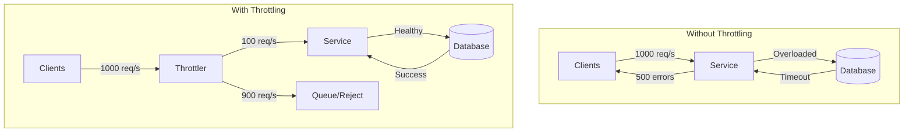
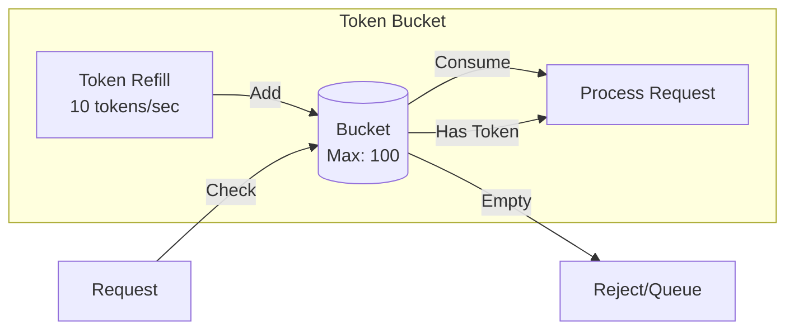
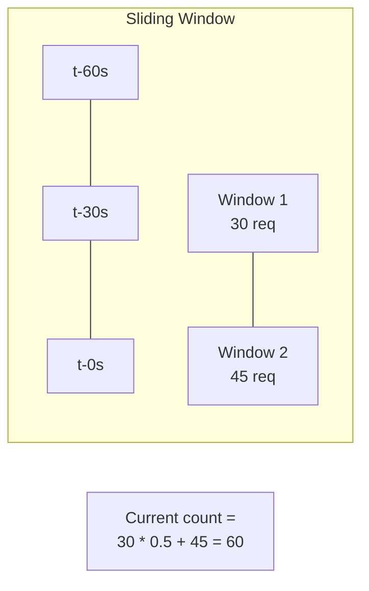
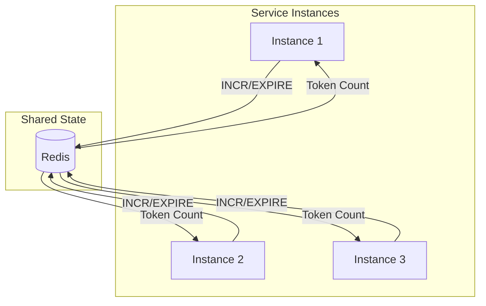
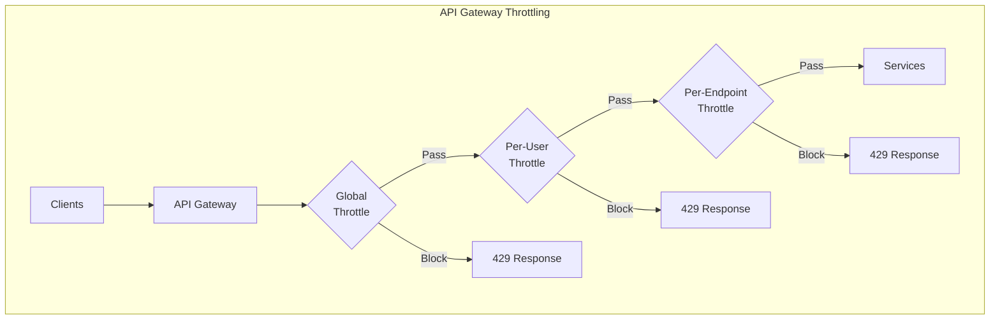
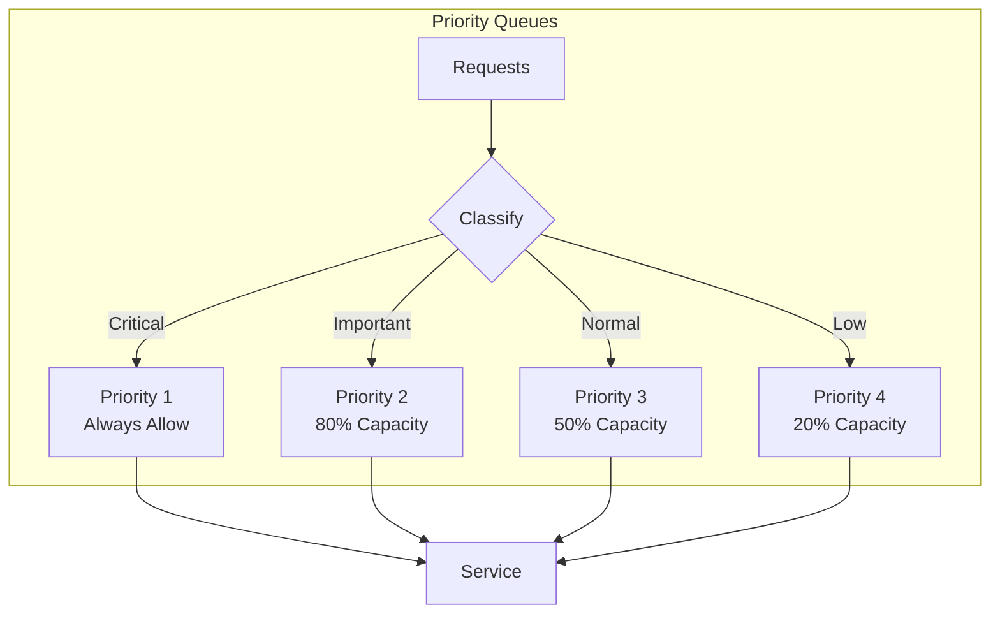
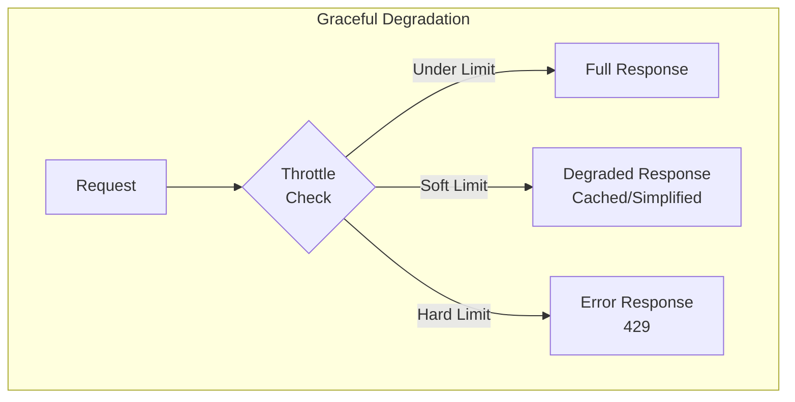

# How to Create Throttling Implementation in Microservices

Author: [nawazdhandala](https://www.github.com/nawazdhandala)

Tags: Microservices, Throttling, Rate Limiting, API Gateway, Distributed Systems, Node.js, Go, Redis, Resilience

Description: Learn how to implement production-ready throttling in microservices using token bucket, sliding window, and distributed rate limiting patterns with practical code examples.

---

Throttling protects your microservices from being overwhelmed by too many requests. Unlike rate limiting (which typically blocks excess requests), throttling controls the flow of requests to maintain system stability. This guide covers practical throttling implementations you can deploy today.

## Why Throttling Matters in Microservices

In a microservices architecture, a single overloaded service can cascade failures across your entire system. Throttling acts as a pressure valve that maintains service health.



## Token Bucket Algorithm

The token bucket is the most common throttling algorithm. Tokens are added to a bucket at a fixed rate. Each request consumes a token. When the bucket is empty, requests are delayed or rejected.



The following Go implementation provides a thread-safe token bucket that can be used across multiple goroutines. It uses a mutex to protect shared state and calculates tokens based on elapsed time.

```go
package throttle

import (
    "sync"
    "time"
)

// TokenBucket implements the token bucket algorithm for throttling
type TokenBucket struct {
    mu sync.Mutex

    // Configuration
    capacity   float64       // Maximum tokens the bucket can hold
    refillRate float64       // Tokens added per second

    // State
    tokens     float64       // Current token count
    lastRefill time.Time     // Last time tokens were added
}

// NewTokenBucket creates a new token bucket throttler
// capacity: maximum burst size
// refillRate: sustained requests per second
func NewTokenBucket(capacity, refillRate float64) *TokenBucket {
    return &TokenBucket{
        capacity:   capacity,
        refillRate: refillRate,
        tokens:     capacity, // Start with full bucket
        lastRefill: time.Now(),
    }
}

// Allow checks if a request should be allowed
// Returns true if allowed, false if throttled
func (tb *TokenBucket) Allow() bool {
    tb.mu.Lock()
    defer tb.mu.Unlock()

    tb.refill()

    if tb.tokens >= 1 {
        tb.tokens--
        return true
    }

    return false
}

// AllowN checks if n requests can be made
// Useful for batch operations
func (tb *TokenBucket) AllowN(n float64) bool {
    tb.mu.Lock()
    defer tb.mu.Unlock()

    tb.refill()

    if tb.tokens >= n {
        tb.tokens -= n
        return true
    }

    return false
}

// refill adds tokens based on elapsed time
// Must be called with mutex held
func (tb *TokenBucket) refill() {
    now := time.Now()
    elapsed := now.Sub(tb.lastRefill).Seconds()

    // Calculate tokens to add based on elapsed time
    tokensToAdd := elapsed * tb.refillRate

    // Add tokens but do not exceed capacity
    tb.tokens = min(tb.capacity, tb.tokens+tokensToAdd)
    tb.lastRefill = now
}

// WaitTime returns how long to wait for a token to become available
func (tb *TokenBucket) WaitTime() time.Duration {
    tb.mu.Lock()
    defer tb.mu.Unlock()

    tb.refill()

    if tb.tokens >= 1 {
        return 0
    }

    // Calculate time until one token is available
    tokensNeeded := 1 - tb.tokens
    waitSeconds := tokensNeeded / tb.refillRate

    return time.Duration(waitSeconds * float64(time.Second))
}

func min(a, b float64) float64 {
    if a < b {
        return a
    }
    return b
}
```

Here is a Node.js implementation of the same algorithm. This version uses class syntax and can be integrated into Express middleware.

```typescript
// Token bucket implementation in TypeScript for Node.js applications
class TokenBucket {
    private capacity: number;
    private refillRate: number;
    private tokens: number;
    private lastRefill: number;

    constructor(capacity: number, refillRate: number) {
        this.capacity = capacity;
        this.refillRate = refillRate;
        this.tokens = capacity;
        this.lastRefill = Date.now();
    }

    // Refill tokens based on elapsed time since last check
    private refill(): void {
        const now = Date.now();
        const elapsedSeconds = (now - this.lastRefill) / 1000;

        const tokensToAdd = elapsedSeconds * this.refillRate;
        this.tokens = Math.min(this.capacity, this.tokens + tokensToAdd);
        this.lastRefill = now;
    }

    // Check if a request should be allowed
    allow(): boolean {
        this.refill();

        if (this.tokens >= 1) {
            this.tokens -= 1;
            return true;
        }

        return false;
    }

    // Get remaining tokens (useful for rate limit headers)
    getRemaining(): number {
        this.refill();
        return Math.floor(this.tokens);
    }

    // Calculate wait time in milliseconds until a token is available
    getWaitTime(): number {
        this.refill();

        if (this.tokens >= 1) {
            return 0;
        }

        const tokensNeeded = 1 - this.tokens;
        return Math.ceil((tokensNeeded / this.refillRate) * 1000);
    }
}

// Express middleware using the token bucket
import { Request, Response, NextFunction } from 'express';

// Store buckets per client (keyed by IP or API key)
const buckets = new Map<string, TokenBucket>();

function getClientKey(req: Request): string {
    // Use API key if available, otherwise fall back to IP
    return req.headers['x-api-key'] as string ||
           req.ip ||
           'unknown';
}

export function throttleMiddleware(
    capacity: number,
    refillRate: number
) {
    return (req: Request, res: Response, next: NextFunction) => {
        const clientKey = getClientKey(req);

        // Get or create bucket for this client
        let bucket = buckets.get(clientKey);
        if (!bucket) {
            bucket = new TokenBucket(capacity, refillRate);
            buckets.set(clientKey, bucket);
        }

        // Add rate limit headers
        res.setHeader('X-RateLimit-Limit', capacity);
        res.setHeader('X-RateLimit-Remaining', bucket.getRemaining());

        if (bucket.allow()) {
            next();
        } else {
            const waitTime = bucket.getWaitTime();
            res.setHeader('Retry-After', Math.ceil(waitTime / 1000));
            res.status(429).json({
                error: 'Too Many Requests',
                retryAfter: waitTime,
                message: `Rate limit exceeded. Try again in ${waitTime}ms`
            });
        }
    };
}
```

## Sliding Window Algorithm

The sliding window algorithm provides smoother throttling than fixed windows by considering requests from a rolling time period.



The sliding window log implementation tracks individual request timestamps. While more memory-intensive than the counter approach, it provides precise throttling.

```go
package throttle

import (
    "sync"
    "time"
)

// SlidingWindowLog implements sliding window throttling using timestamps
type SlidingWindowLog struct {
    mu sync.Mutex

    // Configuration
    windowSize time.Duration
    maxRequests int

    // Store request timestamps
    timestamps []time.Time
}

// NewSlidingWindowLog creates a new sliding window throttler
func NewSlidingWindowLog(windowSize time.Duration, maxRequests int) *SlidingWindowLog {
    return &SlidingWindowLog{
        windowSize:  windowSize,
        maxRequests: maxRequests,
        timestamps:  make([]time.Time, 0, maxRequests),
    }
}

// Allow checks if a request should be allowed
func (sw *SlidingWindowLog) Allow() bool {
    sw.mu.Lock()
    defer sw.mu.Unlock()

    now := time.Now()
    windowStart := now.Add(-sw.windowSize)

    // Remove timestamps outside the window
    sw.cleanup(windowStart)

    // Check if under limit
    if len(sw.timestamps) < sw.maxRequests {
        sw.timestamps = append(sw.timestamps, now)
        return true
    }

    return false
}

// cleanup removes old timestamps
func (sw *SlidingWindowLog) cleanup(windowStart time.Time) {
    // Find first timestamp within window
    validIndex := 0
    for i, ts := range sw.timestamps {
        if ts.After(windowStart) {
            validIndex = i
            break
        }
        if i == len(sw.timestamps)-1 {
            validIndex = len(sw.timestamps)
        }
    }

    // Remove old entries
    if validIndex > 0 {
        sw.timestamps = sw.timestamps[validIndex:]
    }
}

// GetCount returns current request count in window
func (sw *SlidingWindowLog) GetCount() int {
    sw.mu.Lock()
    defer sw.mu.Unlock()

    windowStart := time.Now().Add(-sw.windowSize)
    sw.cleanup(windowStart)

    return len(sw.timestamps)
}
```

The sliding window counter approach uses less memory by storing counts instead of individual timestamps. It interpolates between two adjacent windows.

```go
package throttle

import (
    "sync"
    "time"
)

// SlidingWindowCounter uses counters instead of individual timestamps
// More memory efficient for high-throughput scenarios
type SlidingWindowCounter struct {
    mu sync.Mutex

    // Configuration
    windowSize  time.Duration
    maxRequests int

    // State: two adjacent windows
    currentWindow     int
    previousWindow    int
    currentWindowStart time.Time
}

// NewSlidingWindowCounter creates a new counter-based sliding window
func NewSlidingWindowCounter(windowSize time.Duration, maxRequests int) *SlidingWindowCounter {
    return &SlidingWindowCounter{
        windowSize:        windowSize,
        maxRequests:       maxRequests,
        currentWindowStart: time.Now().Truncate(windowSize),
    }
}

// Allow checks if a request should be allowed
func (sw *SlidingWindowCounter) Allow() bool {
    sw.mu.Lock()
    defer sw.mu.Unlock()

    now := time.Now()
    sw.advanceWindow(now)

    // Calculate weighted count using linear interpolation
    // This smooths the transition between windows
    windowProgress := float64(now.Sub(sw.currentWindowStart)) / float64(sw.windowSize)
    weightedCount := float64(sw.previousWindow)*(1-windowProgress) + float64(sw.currentWindow)

    if int(weightedCount) < sw.maxRequests {
        sw.currentWindow++
        return true
    }

    return false
}

// advanceWindow moves to new windows as time passes
func (sw *SlidingWindowCounter) advanceWindow(now time.Time) {
    windowStart := now.Truncate(sw.windowSize)

    // Check if we have moved to a new window
    windowsElapsed := int(windowStart.Sub(sw.currentWindowStart) / sw.windowSize)

    if windowsElapsed >= 2 {
        // More than one window has passed, reset both
        sw.previousWindow = 0
        sw.currentWindow = 0
    } else if windowsElapsed == 1 {
        // Moved to next window
        sw.previousWindow = sw.currentWindow
        sw.currentWindow = 0
    }

    sw.currentWindowStart = windowStart
}
```

## Distributed Throttling with Redis

For microservices, throttling state must be shared across instances. Redis provides the consistency and performance needed for distributed throttling.



This Redis-based implementation uses Lua scripts to ensure atomic operations. The script handles both the token bucket logic and expiration in a single round trip.

```go
package throttle

import (
    "context"
    "time"

    "github.com/redis/go-redis/v9"
)

// RedisThrottler implements distributed throttling using Redis
type RedisThrottler struct {
    client     *redis.Client
    keyPrefix  string
    capacity   float64
    refillRate float64
}

// NewRedisThrottler creates a new Redis-based throttler
func NewRedisThrottler(client *redis.Client, keyPrefix string, capacity, refillRate float64) *RedisThrottler {
    return &RedisThrottler{
        client:     client,
        keyPrefix:  keyPrefix,
        capacity:   capacity,
        refillRate: refillRate,
    }
}

// Lua script for atomic token bucket operations
// This ensures consistency across distributed instances
var tokenBucketScript = redis.NewScript(`
    local key = KEYS[1]
    local capacity = tonumber(ARGV[1])
    local refill_rate = tonumber(ARGV[2])
    local now = tonumber(ARGV[3])
    local requested = tonumber(ARGV[4])

    -- Get current state
    local bucket = redis.call('HMGET', key, 'tokens', 'last_refill')
    local tokens = tonumber(bucket[1]) or capacity
    local last_refill = tonumber(bucket[2]) or now

    -- Calculate tokens to add based on time elapsed
    local elapsed = now - last_refill
    local tokens_to_add = elapsed * refill_rate
    tokens = math.min(capacity, tokens + tokens_to_add)

    -- Check if request can be allowed
    local allowed = 0
    if tokens >= requested then
        tokens = tokens - requested
        allowed = 1
    end

    -- Save state with TTL based on time to refill
    local ttl = math.ceil(capacity / refill_rate) + 1
    redis.call('HMSET', key, 'tokens', tokens, 'last_refill', now)
    redis.call('EXPIRE', key, ttl)

    return {allowed, tokens}
`)

// Allow checks if a request should be allowed for the given key
func (rt *RedisThrottler) Allow(ctx context.Context, key string) (bool, error) {
    return rt.AllowN(ctx, key, 1)
}

// AllowN checks if n requests can be made
func (rt *RedisThrottler) AllowN(ctx context.Context, key string, n int) (bool, error) {
    fullKey := rt.keyPrefix + ":" + key
    now := float64(time.Now().UnixNano()) / 1e9 // Convert to seconds with decimals

    result, err := tokenBucketScript.Run(ctx, rt.client, []string{fullKey},
        rt.capacity,
        rt.refillRate,
        now,
        n,
    ).Slice()

    if err != nil {
        return false, err
    }

    allowed := result[0].(int64) == 1
    return allowed, nil
}

// GetTokens returns the current token count for a key
func (rt *RedisThrottler) GetTokens(ctx context.Context, key string) (float64, error) {
    fullKey := rt.keyPrefix + ":" + key

    result, err := rt.client.HGet(ctx, fullKey, "tokens").Float64()
    if err == redis.Nil {
        return rt.capacity, nil
    }
    return result, err
}
```

Here is the equivalent Node.js implementation using ioredis.

```typescript
import Redis from 'ioredis';

// Redis-based distributed throttler for Node.js
class RedisThrottler {
    private redis: Redis;
    private keyPrefix: string;
    private capacity: number;
    private refillRate: number;

    // Lua script for atomic token bucket operations
    // Using EVALSHA for better performance after initial load
    private static luaScript = `
        local key = KEYS[1]
        local capacity = tonumber(ARGV[1])
        local refill_rate = tonumber(ARGV[2])
        local now = tonumber(ARGV[3])
        local requested = tonumber(ARGV[4])

        local bucket = redis.call('HMGET', key, 'tokens', 'last_refill')
        local tokens = tonumber(bucket[1]) or capacity
        local last_refill = tonumber(bucket[2]) or now

        local elapsed = now - last_refill
        local tokens_to_add = elapsed * refill_rate
        tokens = math.min(capacity, tokens + tokens_to_add)

        local allowed = 0
        if tokens >= requested then
            tokens = tokens - requested
            allowed = 1
        end

        local ttl = math.ceil(capacity / refill_rate) + 1
        redis.call('HMSET', key, 'tokens', tokens, 'last_refill', now)
        redis.call('EXPIRE', key, ttl)

        return {allowed, tokens}
    `;

    constructor(
        redis: Redis,
        keyPrefix: string,
        capacity: number,
        refillRate: number
    ) {
        this.redis = redis;
        this.keyPrefix = keyPrefix;
        this.capacity = capacity;
        this.refillRate = refillRate;

        // Define the command for cleaner usage
        this.redis.defineCommand('tokenBucket', {
            numberOfKeys: 1,
            lua: RedisThrottler.luaScript
        });
    }

    async allow(key: string, n: number = 1): Promise<boolean> {
        const fullKey = `${this.keyPrefix}:${key}`;
        const now = Date.now() / 1000; // Convert to seconds

        const result = await (this.redis as any).tokenBucket(
            fullKey,
            this.capacity,
            this.refillRate,
            now,
            n
        );

        return result[0] === 1;
    }

    async getRemaining(key: string): Promise<number> {
        const fullKey = `${this.keyPrefix}:${key}`;
        const tokens = await this.redis.hget(fullKey, 'tokens');

        return tokens ? Math.floor(parseFloat(tokens)) : this.capacity;
    }
}

// Usage with Express
import express from 'express';

const app = express();
const redis = new Redis(process.env.REDIS_URL);
const throttler = new RedisThrottler(redis, 'api:throttle', 100, 10);

app.use(async (req, res, next) => {
    const clientKey = req.headers['x-api-key'] as string || req.ip;

    const allowed = await throttler.allow(clientKey);
    const remaining = await throttler.getRemaining(clientKey);

    res.setHeader('X-RateLimit-Remaining', remaining);

    if (allowed) {
        next();
    } else {
        res.status(429).json({ error: 'Rate limit exceeded' });
    }
});
```

## API Gateway Throttling

Implement throttling at the API gateway level to protect all downstream services with a single configuration.



This implementation shows a multi-layer throttling approach for an API gateway. Each layer has different limits and keys.

```go
package gateway

import (
    "context"
    "net/http"
    "strings"
)

// ThrottleConfig defines throttling rules
type ThrottleConfig struct {
    // Global limits apply to all traffic
    GlobalRPS     float64
    GlobalBurst   float64

    // Per-user limits
    UserRPS       float64
    UserBurst     float64

    // Per-endpoint limits (path prefix to config)
    EndpointLimits map[string]EndpointConfig
}

// EndpointConfig defines per-endpoint throttling
type EndpointConfig struct {
    RPS   float64
    Burst float64
}

// GatewayThrottler implements multi-layer throttling
type GatewayThrottler struct {
    config    ThrottleConfig
    global    *RedisThrottler
    users     *RedisThrottler
    endpoints map[string]*RedisThrottler
}

// NewGatewayThrottler creates a gateway throttler
func NewGatewayThrottler(client *redis.Client, config ThrottleConfig) *GatewayThrottler {
    gt := &GatewayThrottler{
        config:    config,
        global:    NewRedisThrottler(client, "throttle:global", config.GlobalBurst, config.GlobalRPS),
        users:     NewRedisThrottler(client, "throttle:user", config.UserBurst, config.UserRPS),
        endpoints: make(map[string]*RedisThrottler),
    }

    // Create throttlers for each endpoint
    for path, epConfig := range config.EndpointLimits {
        prefix := "throttle:endpoint:" + strings.ReplaceAll(path, "/", "_")
        gt.endpoints[path] = NewRedisThrottler(client, prefix, epConfig.Burst, epConfig.RPS)
    }

    return gt
}

// ThrottleResult contains the result of a throttle check
type ThrottleResult struct {
    Allowed    bool
    Layer      string // Which layer blocked the request
    RetryAfter int    // Seconds to wait before retry
}

// Check evaluates all throttle layers
func (gt *GatewayThrottler) Check(ctx context.Context, userID, path string) ThrottleResult {
    // Layer 1: Global throttle
    if allowed, _ := gt.global.Allow(ctx, "all"); !allowed {
        return ThrottleResult{
            Allowed:    false,
            Layer:      "global",
            RetryAfter: 1,
        }
    }

    // Layer 2: Per-user throttle
    if userID != "" {
        if allowed, _ := gt.users.Allow(ctx, userID); !allowed {
            return ThrottleResult{
                Allowed:    false,
                Layer:      "user",
                RetryAfter: 5,
            }
        }
    }

    // Layer 3: Per-endpoint throttle
    for prefix, throttler := range gt.endpoints {
        if strings.HasPrefix(path, prefix) {
            key := userID + ":" + prefix
            if allowed, _ := throttler.Allow(ctx, key); !allowed {
                return ThrottleResult{
                    Allowed:    false,
                    Layer:      "endpoint:" + prefix,
                    RetryAfter: 10,
                }
            }
            break
        }
    }

    return ThrottleResult{Allowed: true}
}

// Middleware creates an HTTP middleware
func (gt *GatewayThrottler) Middleware(next http.Handler) http.Handler {
    return http.HandlerFunc(func(w http.ResponseWriter, r *http.Request) {
        userID := r.Header.Get("X-User-ID")
        path := r.URL.Path

        result := gt.Check(r.Context(), userID, path)

        if !result.Allowed {
            w.Header().Set("Retry-After", fmt.Sprintf("%d", result.RetryAfter))
            w.Header().Set("X-Throttle-Layer", result.Layer)
            http.Error(w, "Too Many Requests", http.StatusTooManyRequests)
            return
        }

        next.ServeHTTP(w, r)
    })
}
```

## Priority-Based Throttling

Not all requests are equal. Priority-based throttling ensures critical requests get through even under load.



This implementation reserves capacity for higher priority requests by allocating different token bucket sizes.

```go
package throttle

import (
    "context"
    "sync"
)

// Priority levels for requests
type Priority int

const (
    PriorityCritical Priority = iota // Health checks, admin operations
    PriorityHigh                      // Paid users, important operations
    PriorityNormal                    // Regular users
    PriorityLow                       // Background jobs, bulk operations
)

// PriorityThrottler implements priority-based throttling
type PriorityThrottler struct {
    mu sync.RWMutex

    // Total capacity
    totalCapacity float64
    refillRate    float64

    // Capacity allocation per priority (percentage)
    // Critical: 100%, High: 80%, Normal: 50%, Low: 20%
    allocations map[Priority]float64

    // Separate buckets per priority
    buckets map[Priority]*TokenBucket
}

// NewPriorityThrottler creates a priority-based throttler
func NewPriorityThrottler(totalCapacity, refillRate float64) *PriorityThrottler {
    allocations := map[Priority]float64{
        PriorityCritical: 1.0,  // Can use 100% of capacity
        PriorityHigh:     0.8,  // Can use 80% of capacity
        PriorityNormal:   0.5,  // Can use 50% of capacity
        PriorityLow:      0.2,  // Can use 20% of capacity
    }

    buckets := make(map[Priority]*TokenBucket)
    for priority, allocation := range allocations {
        buckets[priority] = NewTokenBucket(
            totalCapacity*allocation,
            refillRate*allocation,
        )
    }

    return &PriorityThrottler{
        totalCapacity: totalCapacity,
        refillRate:    refillRate,
        allocations:   allocations,
        buckets:       buckets,
    }
}

// Allow checks if a request with given priority should be allowed
func (pt *PriorityThrottler) Allow(priority Priority) bool {
    pt.mu.RLock()
    bucket, exists := pt.buckets[priority]
    pt.mu.RUnlock()

    if !exists {
        return false
    }

    return bucket.Allow()
}

// GetPriorityFromRequest determines priority from request context
func GetPriorityFromRequest(ctx context.Context, headers map[string]string) Priority {
    // Check for priority header
    if p, ok := headers["X-Priority"]; ok {
        switch p {
        case "critical":
            return PriorityCritical
        case "high":
            return PriorityHigh
        case "low":
            return PriorityLow
        }
    }

    // Check for API key tier
    if tier, ok := headers["X-API-Tier"]; ok {
        switch tier {
        case "enterprise":
            return PriorityHigh
        case "free":
            return PriorityLow
        }
    }

    return PriorityNormal
}
```

## Graceful Degradation with Throttling

When throttling kicks in, provide degraded service instead of complete rejection.



This implementation shows how to provide different response quality based on throttling pressure.

```go
package throttle

import (
    "context"
)

// DegradationLevel indicates the level of service degradation
type DegradationLevel int

const (
    DegradationNone    DegradationLevel = iota // Full service
    DegradationLight                            // Skip non-essential features
    DegradationMedium                           // Use cached data
    DegradationHeavy                            // Return minimal response
    DegradationReject                           // Reject request
)

// GracefulThrottler implements throttling with graceful degradation
type GracefulThrottler struct {
    // Thresholds as percentage of capacity used
    lightThreshold  float64 // Start light degradation
    mediumThreshold float64 // Start medium degradation
    heavyThreshold  float64 // Start heavy degradation
    rejectThreshold float64 // Start rejecting

    bucket *TokenBucket
}

// NewGracefulThrottler creates a throttler with degradation levels
func NewGracefulThrottler(capacity, refillRate float64) *GracefulThrottler {
    return &GracefulThrottler{
        lightThreshold:  0.6, // 60% capacity used
        mediumThreshold: 0.75,
        heavyThreshold:  0.9,
        rejectThreshold: 1.0,
        bucket:          NewTokenBucket(capacity, refillRate),
    }
}

// Check returns the degradation level for the current load
func (gt *GracefulThrottler) Check() DegradationLevel {
    // Calculate current usage
    remaining := float64(gt.bucket.getRemaining())
    capacity := gt.bucket.capacity
    usage := 1 - (remaining / capacity)

    switch {
    case usage >= gt.rejectThreshold:
        return DegradationReject
    case usage >= gt.heavyThreshold:
        return DegradationHeavy
    case usage >= gt.mediumThreshold:
        return DegradationMedium
    case usage >= gt.lightThreshold:
        return DegradationLight
    default:
        return DegradationNone
    }
}

// Example service using graceful degradation
type ProductService struct {
    throttler *GracefulThrottler
    cache     Cache
    db        Database
}

func (s *ProductService) GetProduct(ctx context.Context, id string) (*Product, error) {
    level := s.throttler.Check()

    switch level {
    case DegradationReject:
        return nil, ErrServiceOverloaded

    case DegradationHeavy:
        // Return only essential fields from cache
        return s.cache.GetMinimalProduct(ctx, id)

    case DegradationMedium:
        // Return cached data even if stale
        product, err := s.cache.GetProduct(ctx, id)
        if err == nil {
            return product, nil
        }
        // Fall through to database only if not in cache
        return s.db.GetProduct(ctx, id)

    case DegradationLight:
        // Skip expensive operations like recommendations
        product, err := s.db.GetProduct(ctx, id)
        if err != nil {
            return nil, err
        }
        // Do not load recommendations
        product.Recommendations = nil
        return product, nil

    default:
        // Full service: load from DB with all features
        product, err := s.db.GetProduct(ctx, id)
        if err != nil {
            return nil, err
        }
        product.Recommendations, _ = s.loadRecommendations(ctx, id)
        return product, nil
    }
}
```

## Monitoring Throttling

Track throttling metrics to understand system behavior and tune limits.

```yaml
# Prometheus metrics for throttling
# Add these to your service metrics

# Counter: Total requests by throttle decision
- name: throttle_requests_total
  type: counter
  labels:
    - service
    - endpoint
    - decision  # allowed, throttled, degraded
    - priority

# Gauge: Current token bucket level
- name: throttle_bucket_tokens
  type: gauge
  labels:
    - service
    - bucket_name

# Histogram: Wait time for throttled requests
- name: throttle_wait_seconds
  type: histogram
  labels:
    - service
    - endpoint
  buckets: [0.001, 0.005, 0.01, 0.05, 0.1, 0.5, 1, 5]
```

This Go code shows how to instrument your throttler with Prometheus metrics.

```go
package throttle

import (
    "github.com/prometheus/client_golang/prometheus"
    "github.com/prometheus/client_golang/prometheus/promauto"
)

var (
    throttleRequests = promauto.NewCounterVec(prometheus.CounterOpts{
        Name: "throttle_requests_total",
        Help: "Total throttle decisions",
    }, []string{"service", "endpoint", "decision"})

    throttleBucketTokens = promauto.NewGaugeVec(prometheus.GaugeOpts{
        Name: "throttle_bucket_tokens",
        Help: "Current tokens in bucket",
    }, []string{"service", "bucket"})

    throttleWaitTime = promauto.NewHistogramVec(prometheus.HistogramOpts{
        Name:    "throttle_wait_seconds",
        Help:    "Time requests waited due to throttling",
        Buckets: []float64{0.001, 0.005, 0.01, 0.05, 0.1, 0.5, 1, 5},
    }, []string{"service", "endpoint"})
)

// InstrumentedThrottler wraps a throttler with metrics
type InstrumentedThrottler struct {
    throttler   Throttler
    serviceName string
}

func (it *InstrumentedThrottler) Allow(endpoint string) bool {
    allowed := it.throttler.Allow()

    decision := "allowed"
    if !allowed {
        decision = "throttled"
    }

    throttleRequests.WithLabelValues(
        it.serviceName,
        endpoint,
        decision,
    ).Inc()

    return allowed
}
```

Set up alerts to detect throttling issues before they affect users.

```yaml
# Alerting rules for throttling
groups:
  - name: throttling_alerts
    rules:
      # High throttle rate indicates capacity issues
      - alert: HighThrottleRate
        expr: |
          sum(rate(throttle_requests_total{decision="throttled"}[5m])) by (service)
          / sum(rate(throttle_requests_total[5m])) by (service) > 0.1
        for: 5m
        labels:
          severity: warning
        annotations:
          summary: "High throttle rate for {{ $labels.service }}"
          description: "{{ $value | humanizePercentage }} of requests are being throttled"

      # Sustained throttling needs attention
      - alert: SustainedThrottling
        expr: |
          sum(rate(throttle_requests_total{decision="throttled"}[30m])) by (service) > 100
        for: 30m
        labels:
          severity: critical
        annotations:
          summary: "Sustained throttling for {{ $labels.service }}"

      # Token bucket running low
      - alert: LowThrottleBucket
        expr: |
          throttle_bucket_tokens / throttle_bucket_capacity < 0.1
        for: 5m
        labels:
          severity: warning
        annotations:
          summary: "Throttle bucket nearly empty for {{ $labels.bucket }}"
```

## Best Practices

1. **Start with conservative limits** and increase based on observed capacity
2. **Use distributed throttling** (Redis) when running multiple service instances
3. **Implement graceful degradation** instead of hard rejections when possible
4. **Add priority levels** to ensure critical operations always succeed
5. **Monitor throttle rates** and alert on sustained throttling
6. **Return proper headers** (Retry-After, X-RateLimit-Remaining) for client cooperation
7. **Test throttling behavior** under load before production deployment
8. **Document your limits** so API consumers know what to expect
9. **Use exponential backoff** in clients when they receive 429 responses
10. **Consider business context** when setting limits (paid vs free tiers)

## Conclusion

Throttling is essential for building resilient microservices. The token bucket algorithm provides a good balance of simplicity and effectiveness. For production deployments, use Redis-based distributed throttling to maintain consistency across instances. Combine throttling with priority queues and graceful degradation to maximize user experience even under heavy load.

Start with simple throttling at the API gateway level, then add service-specific throttling as you identify bottlenecks. Monitor your throttle rates continuously and adjust limits based on actual usage patterns.
