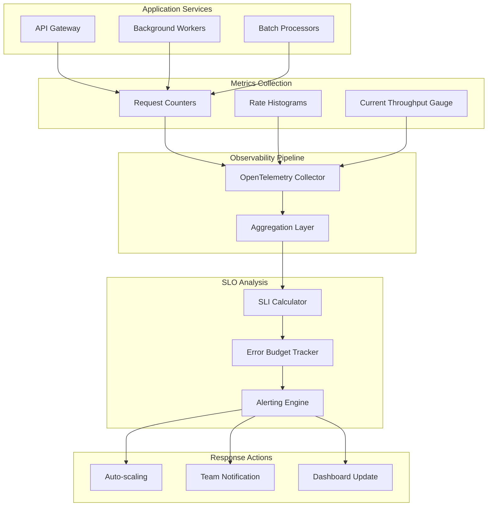

# How to Implement Throughput SLOs

Author: [nawazdhandala](https://github.com/nawazdhandala)

Tags: SRE, SLO, Throughput, Capacity

Description: Learn how to define and implement throughput SLOs to ensure your systems can handle expected load while maintaining reliability.

---

## What is a Throughput SLI?

A Throughput Service Level Indicator (SLI) measures how many units of work your system processes within a given time window. Unlike latency or availability SLIs that focus on quality of individual requests, throughput SLIs focus on quantity and capacity.

Throughput SLIs answer the question: "Is my system processing enough work to meet business demands?"

Common throughput SLI examples include:

- Requests processed per second
- Orders completed per minute
- Messages delivered per hour
- Jobs executed per day
- Data records ingested per second

The formula for a throughput SLI is straightforward:

```
Throughput SLI = Actual Throughput / Target Throughput
```

For example, if your target is 1,000 requests per second and you process 950, your throughput SLI is 95%.

---

## Rate-Based vs Count-Based Metrics

When implementing throughput SLOs, you have two fundamental approaches: rate-based and count-based metrics. Each serves different use cases.

### Rate-Based Metrics

Rate-based metrics measure throughput as a velocity over time. They answer "how fast" your system processes work.

**Best for:**
- Real-time services with continuous traffic
- APIs and web services
- Stream processing systems
- Load balancing decisions

**Example:** Requests per second (RPS), events per minute

```python
# Rate-based throughput calculation
# Measures instantaneous processing velocity

import time
from collections import deque

class RateBasedThroughputTracker:
    def __init__(self, window_seconds=60):
        # Use a sliding window to track recent requests
        self.window_seconds = window_seconds
        self.timestamps = deque()

    def record_request(self):
        # Record timestamp of each processed request
        current_time = time.time()
        self.timestamps.append(current_time)
        # Remove timestamps outside the window
        self._cleanup_old_timestamps(current_time)

    def _cleanup_old_timestamps(self, current_time):
        # Keep only timestamps within our measurement window
        cutoff = current_time - self.window_seconds
        while self.timestamps and self.timestamps[0] < cutoff:
            self.timestamps.popleft()

    def get_rate_per_second(self):
        # Calculate current throughput rate
        current_time = time.time()
        self._cleanup_old_timestamps(current_time)
        if not self.timestamps:
            return 0.0
        # Requests in window divided by window size
        return len(self.timestamps) / self.window_seconds

    def check_slo(self, target_rps):
        # Check if we meet our throughput SLO target
        current_rate = self.get_rate_per_second()
        sli_ratio = current_rate / target_rps if target_rps > 0 else 0
        return {
            "current_rate": current_rate,
            "target_rate": target_rps,
            "sli_ratio": sli_ratio,
            "meets_slo": sli_ratio >= 1.0
        }
```

### Count-Based Metrics

Count-based metrics measure total work completed over a fixed period. They answer "how much" your system has processed.

**Best for:**
- Batch processing systems
- Daily or weekly business metrics
- Compliance and reporting requirements
- Capacity planning

**Example:** Orders processed per day, reports generated per week

```python
# Count-based throughput calculation
# Measures total work completed in a period

from datetime import datetime, timedelta
from typing import Dict

class CountBasedThroughputTracker:
    def __init__(self):
        # Store counts by period (daily buckets)
        self.daily_counts: Dict[str, int] = {}

    def record_completion(self, timestamp=None):
        # Record a completed unit of work
        if timestamp is None:
            timestamp = datetime.now()
        # Use date as the bucket key
        date_key = timestamp.strftime("%Y-%m-%d")
        self.daily_counts[date_key] = self.daily_counts.get(date_key, 0) + 1

    def get_count_for_date(self, date):
        # Get total completions for a specific date
        date_key = date.strftime("%Y-%m-%d")
        return self.daily_counts.get(date_key, 0)

    def get_count_for_period(self, start_date, end_date):
        # Sum completions across a date range
        total = 0
        current = start_date
        while current <= end_date:
            total += self.get_count_for_date(current)
            current += timedelta(days=1)
        return total

    def check_daily_slo(self, date, target_count):
        # Check if daily throughput meets SLO target
        actual_count = self.get_count_for_date(date)
        sli_ratio = actual_count / target_count if target_count > 0 else 0
        return {
            "date": date.strftime("%Y-%m-%d"),
            "actual_count": actual_count,
            "target_count": target_count,
            "sli_ratio": sli_ratio,
            "meets_slo": actual_count >= target_count
        }
```

### Choosing the Right Approach

| Factor | Rate-Based | Count-Based |
|--------|-----------|-------------|
| Time sensitivity | High (real-time) | Low (periodic) |
| Alerting speed | Immediate | Delayed |
| Variance tolerance | Low | Higher |
| Best for | APIs, streaming | Batch, reports |

---

## Throughput Measurement Architecture

The following diagram illustrates how throughput metrics flow through a typical observability pipeline:



This architecture ensures that throughput data is collected at the source, aggregated for analysis, and used to drive both automated responses and human decision-making.

---

## Capacity Planning with Throughput SLOs

Throughput SLOs are essential for capacity planning. They help you answer critical questions about your infrastructure needs.

### Setting Throughput Targets

Start by understanding your business requirements:

1. **Baseline measurement:** What is your current throughput?
2. **Growth projection:** How will traffic grow over time?
3. **Peak patterns:** What are your traffic spikes?
4. **Business requirements:** What throughput must you sustain?

```python
# Capacity planning calculator based on throughput SLOs

class CapacityPlanner:
    def __init__(self, baseline_throughput, growth_rate_monthly):
        # Store baseline metrics and expected growth
        self.baseline_throughput = baseline_throughput
        self.growth_rate = growth_rate_monthly

    def project_throughput(self, months_ahead):
        # Project required throughput for future date
        # Compound growth formula
        projected = self.baseline_throughput * ((1 + self.growth_rate) ** months_ahead)
        return projected

    def calculate_capacity_needed(self, target_throughput, throughput_per_instance):
        # Determine how many instances needed to meet target
        # Add 20% headroom for safety margin
        safety_margin = 1.2
        raw_instances = target_throughput / throughput_per_instance
        return int(raw_instances * safety_margin) + 1

    def generate_capacity_plan(self, months_to_plan, throughput_per_instance):
        # Generate a capacity plan for the planning horizon
        plan = []
        for month in range(1, months_to_plan + 1):
            projected = self.project_throughput(month)
            instances = self.calculate_capacity_needed(
                projected,
                throughput_per_instance
            )
            plan.append({
                "month": month,
                "projected_throughput": round(projected, 2),
                "instances_needed": instances
            })
        return plan


# Example usage
planner = CapacityPlanner(
    baseline_throughput=1000,  # 1000 RPS today
    growth_rate_monthly=0.10   # 10% monthly growth
)

# Plan for the next 6 months
capacity_plan = planner.generate_capacity_plan(
    months_to_plan=6,
    throughput_per_instance=200  # Each instance handles 200 RPS
)

for entry in capacity_plan:
    print(f"Month {entry['month']}: "
          f"{entry['projected_throughput']} RPS, "
          f"{entry['instances_needed']} instances needed")
```

### Throughput SLO Tiers

Define different throughput objectives for different scenarios:

| Tier | Throughput Target | Use Case |
|------|------------------|----------|
| Critical | 99.9% of target | Payment processing |
| Standard | 99% of target | API requests |
| Best effort | 95% of target | Background jobs |

---

## Error Budget for Throughput Violations

Error budgets for throughput work differently than availability error budgets. Instead of measuring downtime, you measure periods where throughput fell below target.

### Calculating Throughput Error Budget

```python
# Throughput error budget calculator

from datetime import datetime, timedelta
from typing import List, Tuple

class ThroughputErrorBudget:
    def __init__(self, slo_target_percentage, measurement_period_days):
        # SLO target: percentage of time we must meet throughput target
        # Example: 99% means we can miss target 1% of the time
        self.slo_target = slo_target_percentage
        self.period_days = measurement_period_days
        # Store measurements as (timestamp, met_target) tuples
        self.measurements: List[Tuple[datetime, bool]] = []

    def record_measurement(self, timestamp, actual_throughput, target_throughput):
        # Record whether throughput target was met at this measurement point
        met_target = actual_throughput >= target_throughput
        self.measurements.append((timestamp, met_target))
        # Clean old measurements outside our period
        self._cleanup_old_measurements()

    def _cleanup_old_measurements(self):
        # Remove measurements older than our tracking period
        cutoff = datetime.now() - timedelta(days=self.period_days)
        self.measurements = [
            (ts, met) for ts, met in self.measurements
            if ts > cutoff
        ]

    def calculate_budget_status(self):
        # Calculate current error budget consumption
        if not self.measurements:
            return {
                "total_measurements": 0,
                "measurements_meeting_target": 0,
                "current_sli": 100.0,
                "error_budget_total": 100 - self.slo_target,
                "error_budget_consumed": 0,
                "error_budget_remaining": 100 - self.slo_target
            }

        total = len(self.measurements)
        met_target = sum(1 for _, met in self.measurements if met)
        current_sli = (met_target / total) * 100

        # Error budget is the allowed percentage of missed targets
        error_budget_total = 100 - self.slo_target
        error_budget_consumed = max(0, self.slo_target - current_sli)
        error_budget_remaining = max(0, error_budget_total - error_budget_consumed)

        return {
            "total_measurements": total,
            "measurements_meeting_target": met_target,
            "current_sli": round(current_sli, 2),
            "error_budget_total": error_budget_total,
            "error_budget_consumed": round(error_budget_consumed, 2),
            "error_budget_remaining": round(error_budget_remaining, 2)
        }

    def should_alert(self, alert_threshold_remaining=25):
        # Alert if error budget is running low
        status = self.calculate_budget_status()
        budget_percent_remaining = (
            status["error_budget_remaining"] / status["error_budget_total"] * 100
            if status["error_budget_total"] > 0 else 100
        )
        return budget_percent_remaining < alert_threshold_remaining


# Example: 99% throughput SLO over 30 days
budget_tracker = ThroughputErrorBudget(
    slo_target_percentage=99.0,
    measurement_period_days=30
)

# Simulate some measurements (in practice, these come from your monitoring)
now = datetime.now()
for i in range(100):
    # 97 measurements meet target, 3 do not
    meets_target = i < 97
    actual = 1000 if meets_target else 800
    budget_tracker.record_measurement(
        timestamp=now - timedelta(hours=i),
        actual_throughput=actual,
        target_throughput=1000
    )

status = budget_tracker.calculate_budget_status()
print(f"Current SLI: {status['current_sli']}%")
print(f"Error budget remaining: {status['error_budget_remaining']}%")
print(f"Should alert: {budget_tracker.should_alert()}")
```

### Burn Rate Alerts for Throughput

Burn rate measures how fast you are consuming your error budget:

```python
# Throughput burn rate calculator

class ThroughputBurnRate:
    def __init__(self, slo_window_days, slo_target_percentage):
        self.slo_window_days = slo_window_days
        self.slo_target = slo_target_percentage
        # Allowed error rate (e.g., 1% for 99% SLO)
        self.allowed_error_rate = (100 - slo_target_percentage) / 100

    def calculate_burn_rate(self, recent_error_rate, window_hours):
        # Burn rate = actual error rate / allowed error rate
        # Burn rate of 1 means consuming budget at expected pace
        # Burn rate of 2 means consuming budget 2x faster
        if self.allowed_error_rate == 0:
            return float('inf') if recent_error_rate > 0 else 0

        burn_rate = recent_error_rate / self.allowed_error_rate
        return round(burn_rate, 2)

    def time_to_exhaustion_hours(self, burn_rate, budget_remaining_percentage):
        # How long until error budget is exhausted at current burn rate
        if burn_rate <= 0:
            return float('inf')

        total_budget_hours = self.slo_window_days * 24 * self.allowed_error_rate
        remaining_hours = total_budget_hours * (budget_remaining_percentage / 100)

        return round(remaining_hours / burn_rate, 1)

    def get_alert_severity(self, burn_rate):
        # Determine alert severity based on burn rate
        if burn_rate >= 14.4:
            # Will exhaust monthly budget in 2 hours
            return "critical"
        elif burn_rate >= 6:
            # Will exhaust monthly budget in 5 hours
            return "high"
        elif burn_rate >= 3:
            # Will exhaust monthly budget in 10 hours
            return "medium"
        elif burn_rate >= 1:
            # Consuming budget faster than sustainable
            return "low"
        else:
            return "none"


# Example usage
burn_calculator = ThroughputBurnRate(
    slo_window_days=30,
    slo_target_percentage=99.0
)

# Recent measurements show 5% of requests missed throughput target
recent_error_rate = 0.05
burn_rate = burn_calculator.calculate_burn_rate(recent_error_rate, window_hours=1)
severity = burn_calculator.get_alert_severity(burn_rate)
time_to_exhaust = burn_calculator.time_to_exhaustion_hours(burn_rate, 80)

print(f"Current burn rate: {burn_rate}x")
print(f"Alert severity: {severity}")
print(f"Time to budget exhaustion: {time_to_exhaust} hours")
```

---

## Putting It All Together

Here is a complete example that ties together throughput SLI measurement, SLO tracking, and error budget management:

```python
# Complete throughput SLO implementation

import time
from datetime import datetime
from dataclasses import dataclass
from typing import Optional

@dataclass
class ThroughputSLOConfig:
    """Configuration for a throughput SLO"""
    name: str
    target_throughput: float       # Target requests per second
    slo_percentage: float          # SLO target (e.g., 99.0 for 99%)
    measurement_window_seconds: int # Window for rate calculation
    slo_window_days: int           # SLO evaluation period


class ThroughputSLO:
    def __init__(self, config: ThroughputSLOConfig):
        self.config = config
        self.request_timestamps = []
        self.sli_measurements = []  # (timestamp, sli_value) pairs

    def record_request(self):
        """Call this for each processed request"""
        self.request_timestamps.append(time.time())
        self._cleanup_old_requests()

    def _cleanup_old_requests(self):
        """Remove requests outside measurement window"""
        cutoff = time.time() - self.config.measurement_window_seconds
        self.request_timestamps = [
            ts for ts in self.request_timestamps if ts > cutoff
        ]

    def get_current_throughput(self):
        """Calculate current throughput rate"""
        self._cleanup_old_requests()
        if not self.request_timestamps:
            return 0.0
        return len(self.request_timestamps) / self.config.measurement_window_seconds

    def get_current_sli(self):
        """Calculate current SLI (0-100)"""
        current = self.get_current_throughput()
        target = self.config.target_throughput
        # SLI is capped at 100% even if we exceed target
        return min(100.0, (current / target) * 100) if target > 0 else 0

    def record_sli_measurement(self):
        """Record current SLI for error budget tracking"""
        sli = self.get_current_sli()
        self.sli_measurements.append((datetime.now(), sli))
        # Keep only measurements within SLO window
        self._cleanup_old_sli_measurements()
        return sli

    def _cleanup_old_sli_measurements(self):
        """Remove SLI measurements outside SLO window"""
        from datetime import timedelta
        cutoff = datetime.now() - timedelta(days=self.config.slo_window_days)
        self.sli_measurements = [
            (ts, sli) for ts, sli in self.sli_measurements if ts > cutoff
        ]

    def get_error_budget_status(self):
        """Calculate error budget consumption"""
        if not self.sli_measurements:
            return {
                "slo_met": True,
                "budget_remaining_percent": 100.0,
                "current_compliance": 100.0
            }

        # Count measurements meeting SLO (SLI >= 100 means target met)
        total = len(self.sli_measurements)
        meeting_target = sum(1 for _, sli in self.sli_measurements if sli >= 100)
        current_compliance = (meeting_target / total) * 100

        # Calculate budget
        allowed_misses = 100 - self.config.slo_percentage
        actual_misses = 100 - current_compliance
        budget_consumed = min(100, (actual_misses / allowed_misses) * 100) if allowed_misses > 0 else 100

        return {
            "slo_met": current_compliance >= self.config.slo_percentage,
            "budget_remaining_percent": max(0, 100 - budget_consumed),
            "current_compliance": round(current_compliance, 2),
            "target_compliance": self.config.slo_percentage
        }

    def get_status_report(self):
        """Generate a complete status report"""
        current_throughput = self.get_current_throughput()
        current_sli = self.get_current_sli()
        budget_status = self.get_error_budget_status()

        return {
            "slo_name": self.config.name,
            "current_throughput": round(current_throughput, 2),
            "target_throughput": self.config.target_throughput,
            "current_sli_percent": round(current_sli, 2),
            "meets_target": current_sli >= 100,
            "error_budget": budget_status
        }


# Example: Create and use a throughput SLO
config = ThroughputSLOConfig(
    name="API Gateway Throughput",
    target_throughput=1000.0,   # 1000 RPS target
    slo_percentage=99.0,        # Must meet target 99% of time
    measurement_window_seconds=60,
    slo_window_days=30
)

slo = ThroughputSLO(config)

# Simulate request processing
for _ in range(950):  # Simulate 950 requests in measurement window
    slo.record_request()

# Check status
status = slo.get_status_report()
print(f"SLO: {status['slo_name']}")
print(f"Current throughput: {status['current_throughput']} RPS")
print(f"Target: {status['target_throughput']} RPS")
print(f"SLI: {status['current_sli_percent']}%")
print(f"Meets target: {status['meets_target']}")
print(f"Error budget remaining: {status['error_budget']['budget_remaining_percent']}%")
```

---

## Key Takeaways

1. **Throughput SLIs measure capacity, not quality.** They complement availability and latency SLIs to give a complete reliability picture.

2. **Choose rate-based metrics for real-time systems** and count-based metrics for batch or periodic workloads.

3. **Use throughput SLOs for capacity planning.** They help you predict when you need to scale and how much capacity to add.

4. **Track error budgets for throughput** just like you would for availability. Set burn rate alerts to catch problems early.

5. **Integrate throughput monitoring into your observability pipeline.** Use OpenTelemetry for instrumentation and feed data into your SLO tracking system.

Throughput SLOs bridge the gap between business requirements and technical capacity. By implementing them properly, you ensure your systems can handle expected load while maintaining the reliability your users depend on.

**Related Reading:**

- [18 SRE Metrics Worth Tracking](https://oneuptime.com/blog/post/2025-11-28-sre-metrics-to-track/view)
- [The Five Stages of SRE Maturity](https://oneuptime.com/blog/post/2025-09-01-the-five-stages-of-sre-maturity/view)
- [What is Site Reliability Engineering?](https://oneuptime.com/blog/post/2025-11-28-what-is-site-reliability-engineering/view)
