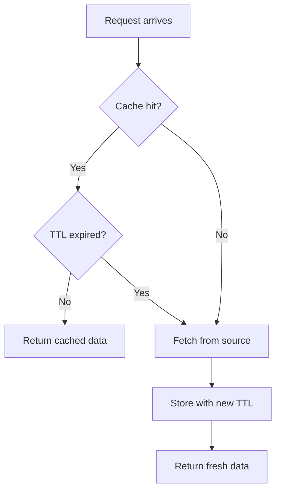
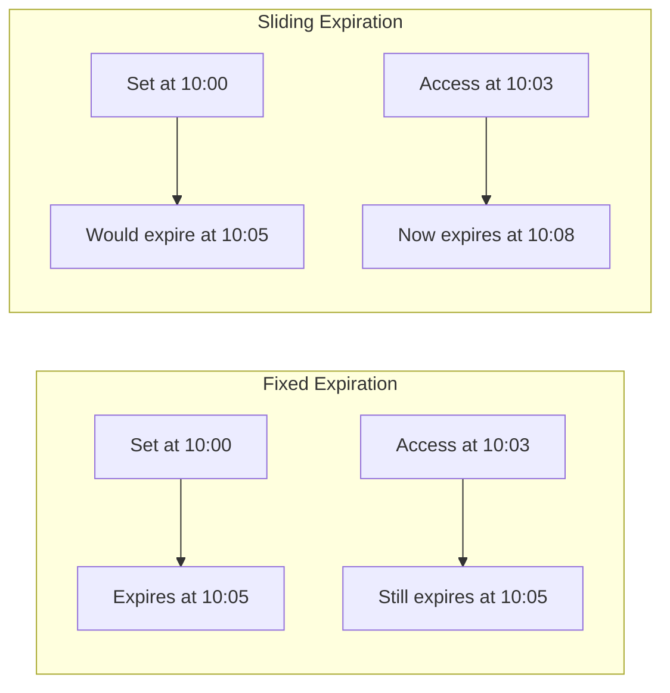

# How to Implement Time-Based Invalidation

Author: [nawazdhandala](https://github.com/nawazdhandala)

Tags: Caching, TTL, Invalidation, Performance

Description: Learn to implement time-based cache invalidation using TTL and expiration strategies.

---

Caching is one of the most effective ways to reduce latency and database load. But caches that never expire become stale, and stale data causes subtle bugs that are hard to track down. Time-based invalidation solves this by automatically expiring cached entries after a defined period. This post covers practical patterns for implementing TTL (Time To Live) strategies in your applications.

## Why Time-Based Invalidation?

When data changes infrequently or when perfect consistency is not required, time-based invalidation offers a simple and predictable approach. Instead of tracking every mutation and invalidating caches manually, you set an expiration time and let the cache handle cleanup.

Common use cases include:

| Use Case | Typical TTL | Why It Works |
| --- | --- | --- |
| User session data | 15-30 minutes | Sessions timeout naturally |
| API rate limit counters | 1 minute | Counters reset on fixed windows |
| Product catalog | 5-15 minutes | Catalog changes are infrequent |
| DNS records | 300 seconds | TTL is part of the DNS protocol |
| Configuration settings | 60 seconds | Config changes can tolerate brief staleness |

The trade-off is simple: shorter TTLs mean fresher data but more cache misses. Longer TTLs mean better hit rates but potentially stale responses.

## How TTL-Based Caching Works

The flow for TTL-based caching follows a straightforward pattern. When a request comes in, the system checks the cache first. If the item exists and has not expired, it returns the cached value. Otherwise, it fetches fresh data, stores it with a new TTL, and returns that.



This pattern keeps your code simple. You do not need to track individual mutations or build complex dependency graphs between cached items.

## Basic TTL Implementation in Redis

Redis provides native TTL support through the `SETEX` command and the `EX` option. Here is a TypeScript example that wraps Redis operations with TTL handling.

```typescript
import Redis from "ioredis";

const redis = new Redis();

// Cache configuration with sensible defaults
const DEFAULT_TTL_SECONDS = 300; // 5 minutes

interface CacheOptions {
  ttl?: number; // TTL in seconds
}

// Store a value with automatic expiration
async function setWithTTL(
  key: string,
  value: unknown,
  options: CacheOptions = {}
): Promise<void> {
  const ttl = options.ttl ?? DEFAULT_TTL_SECONDS;
  const serialized = JSON.stringify(value);

  // SETEX sets the value and expiration atomically
  await redis.setex(key, ttl, serialized);
}

// Retrieve a value, returning null if expired or missing
async function getFromCache<T>(key: string): Promise<T | null> {
  const value = await redis.get(key);

  if (value === null) {
    return null; // Cache miss or expired
  }

  return JSON.parse(value) as T;
}

// Check remaining TTL for debugging or refresh decisions
async function getRemainingTTL(key: string): Promise<number> {
  const ttl = await redis.ttl(key);
  // Returns -2 if key doesn't exist, -1 if no expiry set
  return ttl;
}
```

The `SETEX` command is atomic, which means the value and expiration are set together. This prevents race conditions where a value might be stored without its TTL.

## Cache-Aside Pattern with TTL

The cache-aside pattern is the most common approach for adding caching to existing code. The application manages both the cache and the database, checking the cache first and falling back to the database on misses.

```typescript
interface User {
  id: string;
  email: string;
  name: string;
}

// Cache-aside with TTL: check cache first, fall back to database
async function getUserById(userId: string): Promise<User | null> {
  const cacheKey = `user:${userId}`;

  // Step 1: Try the cache
  const cached = await getFromCache<User>(cacheKey);
  if (cached !== null) {
    return cached;
  }

  // Step 2: Cache miss - fetch from database
  const user = await database.query<User>(
    "SELECT id, email, name FROM users WHERE id = $1",
    [userId]
  );

  if (user === null) {
    return null;
  }

  // Step 3: Populate cache for next request
  await setWithTTL(cacheKey, user, { ttl: 600 }); // 10 minute TTL

  return user;
}
```

This pattern works well because cache misses are self-healing. When data expires, the next request automatically refreshes it.

## Sliding vs Fixed Expiration

There are two main approaches to TTL expiration, and choosing the right one depends on your access patterns.



**Fixed expiration** keeps the original TTL regardless of access. This works best for data that should refresh on a predictable schedule, like configuration or catalog data.

**Sliding expiration** resets the TTL on every access. This works best for session data or frequently accessed items where you want to keep hot data in cache longer.

Here is how to implement sliding expiration in Redis.

```typescript
// Sliding expiration: reset TTL on every read
async function getWithSlidingTTL<T>(
  key: string,
  ttlSeconds: number
): Promise<T | null> {
  const value = await redis.get(key);

  if (value === null) {
    return null;
  }

  // Reset the TTL since item was accessed
  await redis.expire(key, ttlSeconds);

  return JSON.parse(value) as T;
}
```

For session management, sliding expiration keeps active users logged in while expiring inactive sessions.

## Stale-While-Revalidate Pattern

Sometimes you want the speed of cached data but also want to trigger a background refresh when data is getting old. The stale-while-revalidate pattern returns cached data immediately while refreshing in the background.

```typescript
interface CachedItem<T> {
  data: T;
  cachedAt: number; // Unix timestamp in milliseconds
}

const STALE_THRESHOLD_MS = 60_000; // Consider stale after 1 minute
const MAX_AGE_MS = 300_000; // Hard expiry at 5 minutes

async function getWithStaleWhileRevalidate<T>(
  key: string,
  fetchFn: () => Promise<T>
): Promise<T> {
  const cached = await getFromCache<CachedItem<T>>(key);
  const now = Date.now();

  // No cache entry - must fetch synchronously
  if (cached === null) {
    const fresh = await fetchFn();
    await setWithTTL(key, { data: fresh, cachedAt: now }, { ttl: 300 });
    return fresh;
  }

  const age = now - cached.cachedAt;

  // Data is stale but usable - return it and refresh in background
  if (age > STALE_THRESHOLD_MS && age < MAX_AGE_MS) {
    // Fire and forget the refresh
    refreshInBackground(key, fetchFn);
    return cached.data;
  }

  // Data is fresh - return it directly
  return cached.data;
}

async function refreshInBackground<T>(
  key: string,
  fetchFn: () => Promise<T>
): Promise<void> {
  try {
    const fresh = await fetchFn();
    await setWithTTL(key, { data: fresh, cachedAt: Date.now() }, { ttl: 300 });
  } catch (error) {
    // Log but don't throw - background refresh failures are acceptable
    console.error(`Background refresh failed for ${key}:`, error);
  }
}
```

This pattern gives you the best of both worlds: fast responses for users and fresh data in the cache.

## In-Memory TTL Cache for Node.js

For high-frequency lookups where Redis round-trips add too much latency, an in-memory cache with TTL support works well. Here is a minimal implementation.

```typescript
interface CacheEntry<T> {
  value: T;
  expiresAt: number;
}

class MemoryCache {
  private store = new Map<string, CacheEntry<unknown>>();
  private cleanupInterval: NodeJS.Timeout;

  constructor(cleanupIntervalMs = 60_000) {
    // Periodic cleanup of expired entries to prevent memory leaks
    this.cleanupInterval = setInterval(() => {
      this.evictExpired();
    }, cleanupIntervalMs);
  }

  set<T>(key: string, value: T, ttlMs: number): void {
    this.store.set(key, {
      value,
      expiresAt: Date.now() + ttlMs,
    });
  }

  get<T>(key: string): T | undefined {
    const entry = this.store.get(key);

    if (!entry) {
      return undefined;
    }

    // Check if entry has expired
    if (Date.now() > entry.expiresAt) {
      this.store.delete(key);
      return undefined;
    }

    return entry.value as T;
  }

  private evictExpired(): void {
    const now = Date.now();
    for (const [key, entry] of this.store) {
      if (now > entry.expiresAt) {
        this.store.delete(key);
      }
    }
  }

  destroy(): void {
    clearInterval(this.cleanupInterval);
    this.store.clear();
  }
}
```

In-memory caches are fast but do not survive restarts and are not shared across instances. Use them for truly hot data that can be regenerated quickly.

## Choosing the Right TTL

Selecting TTL values requires balancing freshness against performance. Here are guidelines based on data characteristics.

| Data Type | Recommended TTL | Reasoning |
| --- | --- | --- |
| Static assets | 1 day to 1 year | Content-addressable URLs allow long caching |
| User preferences | 5-15 minutes | Changes are rare, eventual consistency is fine |
| Real-time metrics | 5-30 seconds | Must reflect recent state |
| Authentication tokens | Match token expiry | Security requires precise expiration |
| Search results | 1-5 minutes | Results change but not second-by-second |

Start with conservative (shorter) TTLs and increase them based on observed cache hit rates and staleness complaints. Monitor your cache hit ratio to find the sweet spot.

## Monitoring TTL Behavior

Track these metrics to understand whether your TTL settings are working.

```typescript
// Instrument cache operations for observability
async function getWithMetrics<T>(key: string): Promise<T | null> {
  const start = performance.now();
  const value = await getFromCache<T>(key);
  const duration = performance.now() - start;

  // Emit metrics for your observability platform
  metrics.histogram("cache.latency_ms", duration, { operation: "get" });
  metrics.increment("cache.requests", 1, {
    result: value !== null ? "hit" : "miss",
  });

  return value;
}
```

Watch for these signals that your TTL needs adjustment:

- **Hit rate below 80%**: TTL might be too short, or cache size is too small
- **Frequent stale data complaints**: TTL is too long for the data's change frequency
- **Spiky database load**: Many entries expiring simultaneously (consider jittering TTLs)

---

Time-based invalidation is not the only caching strategy, but it is often the simplest one that works. Set a TTL, let entries expire naturally, and let cache misses self-heal by fetching fresh data. For most applications, this approach delivers the performance benefits of caching without the complexity of tracking every data mutation.
