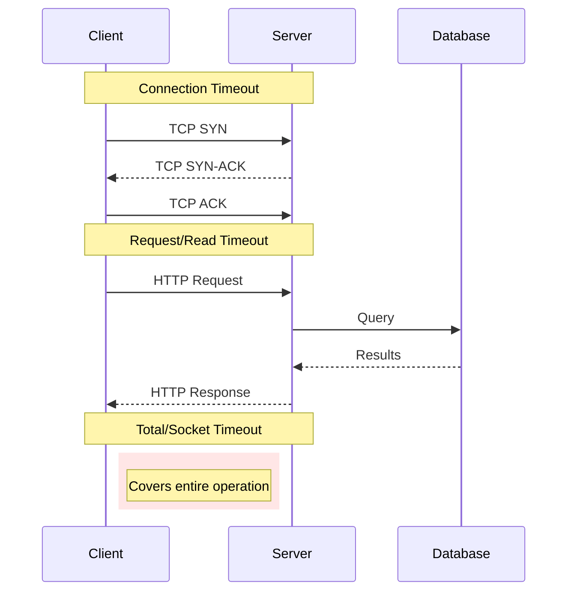
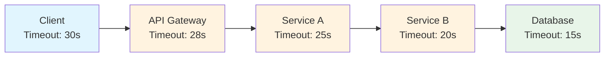
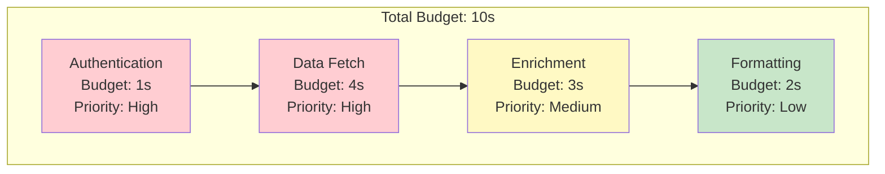

# How to Build Timeout Pattern Implementation

Author: [nawazdhandala](https://github.com/nawazdhandala)

Tags: Microservices, Resilience, Patterns, Timeout

Description: Learn to implement timeout patterns that prevent cascading failures and improve system resilience in distributed architectures.

---

Timeouts are your first line of defense against cascading failures. Without proper timeout handling, a single slow service can bring down your entire system as threads pile up waiting for responses that never come. This guide covers timeout patterns that make distributed systems resilient.

## Why Timeouts Matter

When a downstream service becomes slow or unresponsive, your service continues to hold resources (threads, connections, memory) waiting for a response. Without timeouts, these resources accumulate until your service exhausts its capacity and fails. Timeouts release resources quickly and allow your system to degrade gracefully.

| Without Timeouts | With Timeouts |
|------------------|---------------|
| Thread pool exhaustion | Bounded resource usage |
| Memory leaks from pending requests | Predictable memory consumption |
| Cascade failures spread upstream | Failures isolated to affected paths |
| Unbounded latency | Consistent response times |

## Types of Timeouts

Understanding the different timeout types helps you configure each correctly for your use case.



### Connection Timeout

The connection timeout limits how long to wait when establishing a TCP connection. This typically fails fast because either the server is reachable or not. A short connection timeout (1-5 seconds) prevents wasting time on unreachable hosts.

```javascript
// Connection timeout: Time to establish TCP connection
// Keep this short (1-5 seconds) since connection either works quickly or not
const https = require('https');

const agent = new https.Agent({
  // Maximum time to establish connection (milliseconds)
  timeout: 3000,

  // Keep connections alive for reuse
  keepAlive: true,
  keepAliveMsecs: 30000,

  // Limit concurrent sockets per host
  maxSockets: 50,
});

async function fetchWithConnectionTimeout(url) {
  return new Promise((resolve, reject) => {
    const request = https.get(url, { agent }, (response) => {
      let data = '';
      response.on('data', chunk => data += chunk);
      response.on('end', () => resolve(data));
    });

    // Handle connection timeout specifically
    request.on('timeout', () => {
      request.destroy();
      reject(new Error('Connection timeout: Server unreachable'));
    });

    request.on('error', reject);
  });
}
```

### Read Timeout (Socket Timeout)

The read timeout limits how long to wait for data after the connection is established. This protects against slow responses where the server accepted the connection but takes too long to respond. Set this based on expected response times plus buffer.

```javascript
// Read timeout: Time to receive response data after connection
// Set based on expected response time + reasonable buffer
async function fetchWithReadTimeout(url, readTimeoutMs = 10000) {
  return new Promise((resolve, reject) => {
    const request = https.get(url, (response) => {
      // Set read timeout after connection is established
      response.setTimeout(readTimeoutMs, () => {
        request.destroy();
        reject(new Error(`Read timeout: No data received in ${readTimeoutMs}ms`));
      });

      let data = '';
      response.on('data', chunk => data += chunk);
      response.on('end', () => resolve(data));
    });

    request.on('error', reject);
  });
}
```

### Total Request Timeout

The total timeout covers the entire operation from start to finish, including connection, request, and response. This is your safety net that guarantees bounded latency regardless of where delays occur.

```javascript
// Total timeout: Covers entire operation from start to finish
// This is your safety net for bounded latency
async function fetchWithTotalTimeout(url, options = {}) {
  const {
    connectionTimeout = 3000,
    readTimeout = 10000,
    totalTimeout = 15000,
  } = options;

  const controller = new AbortController();
  const { signal } = controller;

  // Total timeout aborts entire operation
  const timeoutId = setTimeout(() => {
    controller.abort();
  }, totalTimeout);

  try {
    const response = await fetch(url, {
      signal,
      // Note: fetch API doesn't have separate connection/read timeouts
      // Use http/https module for granular control
    });

    clearTimeout(timeoutId);
    return await response.json();
  } catch (error) {
    clearTimeout(timeoutId);

    if (error.name === 'AbortError') {
      throw new Error(`Total timeout: Operation exceeded ${totalTimeout}ms`);
    }
    throw error;
  }
}
```

## Comprehensive Timeout Configuration

This class provides granular control over all timeout phases. Use separate timeouts for connection and read to quickly detect unreachable hosts while still allowing time for slow but progressing responses.

```javascript
// Production-ready HTTP client with granular timeout control
// Separates connection, read, and total timeouts for precise control
const http = require('http');
const https = require('https');

class TimeoutHttpClient {
  constructor(options = {}) {
    // Connection timeout: How long to wait for TCP handshake
    this.connectionTimeout = options.connectionTimeout || 3000;

    // Read timeout: How long to wait for data chunks
    this.readTimeout = options.readTimeout || 10000;

    // Total timeout: Maximum time for entire operation
    this.totalTimeout = options.totalTimeout || 30000;

    // Idle timeout: Close connection after inactivity
    this.idleTimeout = options.idleTimeout || 60000;

    this.agent = new https.Agent({
      keepAlive: true,
      timeout: this.connectionTimeout,
      maxSockets: options.maxSockets || 100,
    });
  }

  async request(url, options = {}) {
    const parsedUrl = new URL(url);
    const protocol = parsedUrl.protocol === 'https:' ? https : http;

    return new Promise((resolve, reject) => {
      const startTime = Date.now();
      let connectionEstablished = false;

      // Total timeout timer
      const totalTimer = setTimeout(() => {
        request.destroy();
        const elapsed = Date.now() - startTime;
        reject(new Error(
          `Total timeout: Operation took ${elapsed}ms, limit is ${this.totalTimeout}ms`
        ));
      }, this.totalTimeout);

      const request = protocol.request(url, {
        ...options,
        agent: this.agent,
        timeout: this.connectionTimeout,
      }, (response) => {
        connectionEstablished = true;

        // Set read timeout for response data
        response.setTimeout(this.readTimeout, () => {
          request.destroy();
          clearTimeout(totalTimer);
          reject(new Error(
            `Read timeout: No data received in ${this.readTimeout}ms`
          ));
        });

        let data = '';

        response.on('data', (chunk) => {
          data += chunk;
          // Reset read timeout on each chunk received
          response.setTimeout(this.readTimeout);
        });

        response.on('end', () => {
          clearTimeout(totalTimer);
          resolve({
            status: response.statusCode,
            headers: response.headers,
            data: data,
            timing: {
              total: Date.now() - startTime,
            },
          });
        });
      });

      // Connection timeout handling
      request.on('timeout', () => {
        request.destroy();
        clearTimeout(totalTimer);

        if (!connectionEstablished) {
          reject(new Error(
            `Connection timeout: Could not connect in ${this.connectionTimeout}ms`
          ));
        }
      });

      request.on('error', (error) => {
        clearTimeout(totalTimer);
        reject(error);
      });

      // Send request body if present
      if (options.body) {
        request.write(options.body);
      }
      request.end();
    });
  }
}

// Usage
const client = new TimeoutHttpClient({
  connectionTimeout: 3000,   // 3 seconds to connect
  readTimeout: 10000,        // 10 seconds between data chunks
  totalTimeout: 30000,       // 30 seconds maximum
});

const response = await client.request('https://api.example.com/data');
```

## Timeout Propagation in Distributed Systems

In microservices, a request often passes through multiple services. The remaining timeout must propagate downstream so services know how much time they have. Without propagation, downstream services may start work they cannot complete.



```javascript
// Deadline propagation ensures downstream services know remaining time
// Pass deadline through headers so each service can calculate its timeout
class DeadlinePropagation {
  constructor(options = {}) {
    this.headerName = options.headerName || 'X-Request-Deadline';
    this.bufferMs = options.bufferMs || 100; // Reserve time for response processing
  }

  // Calculate deadline from incoming request
  getDeadline(req) {
    const deadlineHeader = req.headers[this.headerName.toLowerCase()];

    if (deadlineHeader) {
      // Parse ISO timestamp from header
      return new Date(deadlineHeader).getTime();
    }

    // No deadline set, use default timeout
    return Date.now() + 30000;
  }

  // Calculate remaining time for downstream calls
  getRemainingTime(req) {
    const deadline = this.getDeadline(req);
    const remaining = deadline - Date.now() - this.bufferMs;
    return Math.max(0, remaining);
  }

  // Create headers for downstream request
  createDownstreamHeaders(req, additionalBuffer = 0) {
    const remaining = this.getRemainingTime(req) - additionalBuffer;

    if (remaining <= 0) {
      throw new Error('Deadline exceeded before downstream call');
    }

    return {
      [this.headerName]: new Date(Date.now() + remaining).toISOString(),
    };
  }

  // Middleware to check deadline on request arrival
  middleware() {
    return (req, res, next) => {
      const remaining = this.getRemainingTime(req);

      // Attach to request for handlers to use
      req.deadline = this.getDeadline(req);
      req.remainingTime = remaining;

      if (remaining <= 0) {
        return res.status(504).json({
          error: 'Gateway Timeout',
          message: 'Request deadline exceeded',
        });
      }

      // Set response timeout
      res.setTimeout(remaining, () => {
        res.status(504).json({
          error: 'Gateway Timeout',
          message: 'Request processing exceeded deadline',
        });
      });

      next();
    };
  }
}

// Usage in Express application
const express = require('express');
const app = express();
const deadlines = new DeadlinePropagation();

app.use(deadlines.middleware());

app.get('/api/data', async (req, res) => {
  // Check remaining time before expensive operation
  if (req.remainingTime < 5000) {
    return res.status(503).json({
      error: 'Insufficient time for operation',
    });
  }

  // Pass deadline to downstream service
  const downstreamHeaders = deadlines.createDownstreamHeaders(req, 2000);

  const response = await fetch('http://downstream-service/data', {
    headers: downstreamHeaders,
    signal: AbortSignal.timeout(req.remainingTime - 1000),
  });

  res.json(await response.json());
});
```

## Adaptive Timeout Strategies

Static timeouts often miss the mark: too short and you get false failures, too long and you waste resources on doomed requests. Adaptive timeouts adjust based on observed latency, giving you optimal values that track real service behavior.

```javascript
// Adaptive timeout calculates optimal values from observed latency
// Uses percentile-based approach: p99 latency + buffer = timeout
class AdaptiveTimeout {
  constructor(options = {}) {
    // Target percentile for timeout calculation
    this.percentile = options.percentile || 99;

    // Minimum and maximum bounds
    this.minTimeout = options.minTimeout || 1000;
    this.maxTimeout = options.maxTimeout || 60000;

    // Buffer added to percentile value
    this.bufferPercent = options.bufferPercent || 20;

    // Rolling window for latency samples
    this.windowSize = options.windowSize || 1000;
    this.latencies = [];

    // Current calculated timeout
    this.currentTimeout = options.initialTimeout || 5000;

    // Recalculate interval
    this.recalculateInterval = options.recalculateInterval || 10000;
    this.lastRecalculation = 0;
  }

  // Record a latency observation
  recordLatency(latencyMs) {
    this.latencies.push(latencyMs);

    // Trim to window size
    if (this.latencies.length > this.windowSize) {
      this.latencies.shift();
    }

    // Recalculate if enough time has passed
    if (Date.now() - this.lastRecalculation > this.recalculateInterval) {
      this.recalculate();
    }
  }

  // Calculate new timeout based on latency distribution
  recalculate() {
    if (this.latencies.length < 10) {
      return; // Not enough samples
    }

    // Sort latencies to calculate percentile
    const sorted = [...this.latencies].sort((a, b) => a - b);
    const index = Math.ceil((this.percentile / 100) * sorted.length) - 1;
    const percentileValue = sorted[index];

    // Add buffer to percentile
    const withBuffer = percentileValue * (1 + this.bufferPercent / 100);

    // Apply bounds
    this.currentTimeout = Math.min(
      this.maxTimeout,
      Math.max(this.minTimeout, withBuffer)
    );

    this.lastRecalculation = Date.now();

    console.log(
      `Adaptive timeout recalculated: p${this.percentile}=${percentileValue}ms, ` +
      `timeout=${Math.round(this.currentTimeout)}ms`
    );
  }

  // Get current timeout value
  getTimeout() {
    return Math.round(this.currentTimeout);
  }

  // Execute with adaptive timeout
  async execute(fn) {
    const timeout = this.getTimeout();
    const startTime = Date.now();

    try {
      const result = await Promise.race([
        fn(),
        new Promise((_, reject) =>
          setTimeout(() => reject(new Error('Adaptive timeout exceeded')), timeout)
        ),
      ]);

      // Record successful latency
      this.recordLatency(Date.now() - startTime);
      return result;
    } catch (error) {
      // Record timeout as max latency for calculation
      if (error.message === 'Adaptive timeout exceeded') {
        this.recordLatency(timeout);
      }
      throw error;
    }
  }
}

// Usage
const adaptiveTimeout = new AdaptiveTimeout({
  percentile: 99,
  minTimeout: 1000,
  maxTimeout: 30000,
  bufferPercent: 25,
});

// Timeout automatically adjusts based on observed latency
const data = await adaptiveTimeout.execute(async () => {
  return await fetchExternalService();
});
```

## Timeout Budget Distribution

When a request involves multiple sequential operations, distribute the total timeout budget wisely. Critical operations should get more time, and the distribution should account for typical latency patterns.



```javascript
// Distribute timeout budget across multiple operations
// Higher priority operations get larger share of remaining time
class TimeoutBudget {
  constructor(totalBudgetMs) {
    this.totalBudget = totalBudgetMs;
    this.startTime = Date.now();
    this.operations = [];
  }

  // Register operations with their priorities
  addOperation(name, priority = 'medium', minTime = 100) {
    this.operations.push({ name, priority, minTime });
    return this;
  }

  // Calculate timeout for a specific operation
  getTimeout(operationName) {
    const elapsed = Date.now() - this.startTime;
    const remaining = this.totalBudget - elapsed;

    if (remaining <= 0) {
      throw new Error('Budget exhausted');
    }

    const operation = this.operations.find(op => op.name === operationName);
    if (!operation) {
      throw new Error(`Unknown operation: ${operationName}`);
    }

    // Calculate weighted share based on priority
    const priorityWeights = { high: 3, medium: 2, low: 1 };
    const totalWeight = this.operations.reduce(
      (sum, op) => sum + priorityWeights[op.priority],
      0
    );

    const operationWeight = priorityWeights[operation.priority];
    const share = (operationWeight / totalWeight) * remaining;

    return Math.max(operation.minTime, Math.round(share));
  }

  // Check remaining budget
  getRemainingBudget() {
    return Math.max(0, this.totalBudget - (Date.now() - this.startTime));
  }

  // Execute operation with budgeted timeout
  async executeOperation(name, fn) {
    const timeout = this.getTimeout(name);
    const operationStart = Date.now();

    try {
      const result = await Promise.race([
        fn(),
        new Promise((_, reject) =>
          setTimeout(() => reject(new Error(`${name} exceeded budget`)), timeout)
        ),
      ]);

      console.log(
        `Operation ${name} completed in ${Date.now() - operationStart}ms ` +
        `(budget: ${timeout}ms)`
      );

      return result;
    } catch (error) {
      console.log(
        `Operation ${name} failed after ${Date.now() - operationStart}ms: ` +
        `${error.message}`
      );
      throw error;
    }
  }
}

// Usage
async function handleRequest(req) {
  const budget = new TimeoutBudget(10000) // 10 second total budget
    .addOperation('auth', 'high', 500)
    .addOperation('fetchUser', 'high', 1000)
    .addOperation('fetchPreferences', 'medium', 500)
    .addOperation('enrichData', 'low', 200);

  // Each operation gets appropriate share of remaining time
  const authResult = await budget.executeOperation('auth', () =>
    authenticate(req.headers.authorization)
  );

  const user = await budget.executeOperation('fetchUser', () =>
    userService.getUser(authResult.userId)
  );

  const preferences = await budget.executeOperation('fetchPreferences', () =>
    prefService.getPreferences(user.id)
  );

  const enriched = await budget.executeOperation('enrichData', () =>
    enrichUser(user, preferences)
  );

  return enriched;
}
```

## Timeout Handling with Fallbacks

When timeouts occur, graceful degradation provides better user experience than hard failures. Implement fallback strategies that return cached data, default values, or partial results.

```javascript
// Timeout handler with fallback strategies
// Returns degraded but useful response instead of failing
class TimeoutWithFallback {
  constructor(options = {}) {
    this.timeout = options.timeout || 5000;
    this.cache = options.cache || new Map();
    this.cacheTtl = options.cacheTtl || 300000; // 5 minutes
  }

  async execute(key, primaryFn, options = {}) {
    const {
      fallbackFn = null,
      defaultValue = null,
      useCache = true,
    } = options;

    try {
      // Try primary function with timeout
      const result = await Promise.race([
        primaryFn(),
        new Promise((_, reject) =>
          setTimeout(() => reject(new Error('Timeout')), this.timeout)
        ),
      ]);

      // Cache successful result
      if (useCache && key) {
        this.cache.set(key, {
          data: result,
          timestamp: Date.now(),
        });
      }

      return { data: result, source: 'primary' };
    } catch (error) {
      console.log(`Primary failed: ${error.message}, trying fallbacks...`);

      // Try cache first
      if (useCache && key) {
        const cached = this.cache.get(key);
        if (cached && Date.now() - cached.timestamp < this.cacheTtl) {
          console.log('Returning cached data');
          return { data: cached.data, source: 'cache', stale: false };
        }

        // Return stale cache if available
        if (cached) {
          console.log('Returning stale cached data');
          return { data: cached.data, source: 'cache', stale: true };
        }
      }

      // Try fallback function
      if (fallbackFn) {
        try {
          const fallbackResult = await fallbackFn();
          console.log('Returning fallback result');
          return { data: fallbackResult, source: 'fallback' };
        } catch (fallbackError) {
          console.log(`Fallback also failed: ${fallbackError.message}`);
        }
      }

      // Return default value
      if (defaultValue !== null) {
        console.log('Returning default value');
        return { data: defaultValue, source: 'default' };
      }

      // No fallback available, rethrow original error
      throw error;
    }
  }
}

// Usage
const handler = new TimeoutWithFallback({
  timeout: 3000,
  cacheTtl: 60000,
});

app.get('/api/product/:id', async (req, res) => {
  const result = await handler.execute(
    `product:${req.params.id}`,

    // Primary: fetch from database
    async () => await productService.getProduct(req.params.id),

    {
      // Fallback: fetch from read replica
      fallbackFn: async () => await readReplica.getProduct(req.params.id),

      // Default: return minimal product info
      defaultValue: {
        id: req.params.id,
        name: 'Product temporarily unavailable',
        available: false,
      },
    }
  );

  // Include source in response headers for debugging
  res.set('X-Data-Source', result.source);
  if (result.stale) {
    res.set('X-Data-Stale', 'true');
  }

  res.json(result.data);
});
```

## Timeout Metrics and Monitoring

Track timeout occurrences to identify slow dependencies and optimize timeout values. These metrics help you understand if timeouts are too aggressive (high timeout rate) or too lenient (high latency but few timeouts).

```javascript
// Prometheus metrics for timeout observability
// Track: timeout rates, latency distribution, and fallback usage
const prometheus = require('prom-client');

const timeoutTotal = new prometheus.Counter({
  name: 'request_timeout_total',
  help: 'Total number of timeouts',
  labelNames: ['operation', 'timeout_type'],
});

const requestDuration = new prometheus.Histogram({
  name: 'request_duration_seconds',
  help: 'Request duration in seconds',
  labelNames: ['operation', 'result'],
  buckets: [0.1, 0.25, 0.5, 1, 2.5, 5, 10, 30],
});

const fallbackUsage = new prometheus.Counter({
  name: 'fallback_usage_total',
  help: 'Number of times fallback was used',
  labelNames: ['operation', 'fallback_type'],
});

class InstrumentedTimeout {
  constructor(operationName, options = {}) {
    this.operationName = operationName;
    this.connectionTimeout = options.connectionTimeout || 3000;
    this.readTimeout = options.readTimeout || 10000;
    this.totalTimeout = options.totalTimeout || 15000;
  }

  async execute(fn, fallbackFn = null) {
    const startTime = Date.now();

    try {
      const result = await Promise.race([
        fn(),
        new Promise((_, reject) =>
          setTimeout(() => reject(new Error('total_timeout')), this.totalTimeout)
        ),
      ]);

      requestDuration.observe(
        { operation: this.operationName, result: 'success' },
        (Date.now() - startTime) / 1000
      );

      return result;
    } catch (error) {
      const duration = (Date.now() - startTime) / 1000;

      // Categorize timeout type
      if (error.message.includes('timeout')) {
        const timeoutType = error.message.includes('connection')
          ? 'connection'
          : error.message.includes('read')
          ? 'read'
          : 'total';

        timeoutTotal.inc({
          operation: this.operationName,
          timeout_type: timeoutType,
        });
      }

      requestDuration.observe(
        { operation: this.operationName, result: 'timeout' },
        duration
      );

      // Try fallback
      if (fallbackFn) {
        try {
          const fallbackResult = await fallbackFn();
          fallbackUsage.inc({
            operation: this.operationName,
            fallback_type: 'function',
          });
          return fallbackResult;
        } catch (fallbackError) {
          fallbackUsage.inc({
            operation: this.operationName,
            fallback_type: 'failed',
          });
        }
      }

      throw error;
    }
  }
}

// Dashboard query examples for Grafana:
// Timeout rate: rate(request_timeout_total[5m])
// P99 latency: histogram_quantile(0.99, rate(request_duration_seconds_bucket[5m]))
// Fallback rate: rate(fallback_usage_total[5m]) / rate(request_duration_seconds_count[5m])
```

## Best Practices Summary

| Practice | Recommendation |
|----------|----------------|
| **Connection timeout** | 1-5 seconds; fail fast on unreachable hosts |
| **Read timeout** | Based on p99 latency + 20% buffer |
| **Total timeout** | Connection + read + processing buffer |
| **Deadline propagation** | Always pass remaining time to downstream services |
| **Adaptive timeouts** | Adjust based on observed latency distribution |
| **Fallbacks** | Cache, defaults, or degraded responses on timeout |
| **Monitoring** | Track timeout rates and latency percentiles |

## Common Pitfalls

1. **Same timeout for all operations**: Different operations have different latency profiles. A database query timeout should differ from an external API timeout.

2. **No timeout propagation**: Downstream services start work they cannot complete because they do not know the deadline.

3. **Too aggressive timeouts**: High timeout rates indicate values are too low. Use p99 latency plus buffer.

4. **No fallback strategy**: Timeouts should trigger graceful degradation, not hard failures.

5. **Missing metrics**: Without observability, you cannot tune timeouts effectively.

Proper timeout implementation transforms cascading failures into isolated, recoverable events. Start with conservative values, instrument everything, and adjust based on real latency data.
