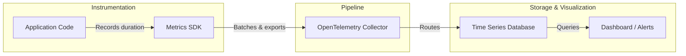
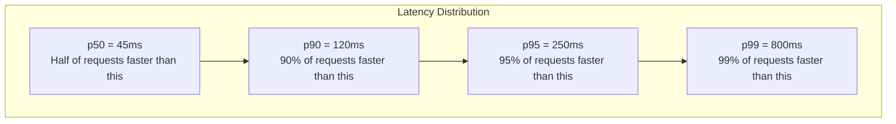
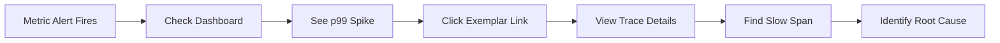

# How to Create Timing Metrics

Author: [nawazdhandala](https://github.com/nawazdhandala)

Tags: Metrics, Timing, Latency, Performance

Description: Learn to create timing metrics for measuring operation durations and latencies.

---

When your application starts slowing down, the first question is always: "Where is the time going?" Timing metrics give you the answer. They measure how long operations take, reveal latency patterns, and help you understand where performance bottlenecks live.

This guide walks through the practical steps of creating timing metrics: what to measure, how to instrument your code, and how to interpret the results.

## What Are Timing Metrics?

Timing metrics capture the duration of operations in your system. Unlike counters that track "how many," timing metrics track "how long." They answer questions like:

- How long does a database query take?
- What is the response time of an API endpoint?
- How much time does a background job consume?

The most common forms of timing metrics are histograms and summaries. Histograms bucket durations into ranges, while summaries calculate percentiles on the client side. For most use cases, histograms are preferred because they allow flexible aggregation after collection.

## The Anatomy of a Timing Metric

A timing metric typically includes:

| Component | Purpose | Example |
|-----------|---------|---------|
| Name | Identifies what you are measuring | `http_request_duration_seconds` |
| Labels/Attributes | Add context for filtering | `method=GET`, `route=/api/users` |
| Value | The duration itself | `0.042` (42 milliseconds) |
| Unit | Standardizes interpretation | seconds (preferred) or milliseconds |
| Timestamp | When the measurement occurred | `2026-01-30T10:15:30Z` |

Always use seconds as your unit. This is the OpenTelemetry and Prometheus convention. It keeps dashboards consistent and math simple.

## How Timing Metrics Flow Through Your System



Your application records durations using an SDK. The SDK batches these measurements and exports them to a collector. The collector routes data to your time series database (like Prometheus, ClickHouse, or OneUptime). Finally, dashboards and alerting systems query the stored data.

## Setting Up Timing Metrics in Node.js

First, install the required packages:

```bash
npm install @opentelemetry/api \
            @opentelemetry/sdk-node \
            @opentelemetry/sdk-metrics \
            @opentelemetry/exporter-metrics-otlp-http
```

Create a metrics setup file:

```typescript
// metrics.ts
import { MeterProvider, PeriodicExportingMetricReader } from '@opentelemetry/sdk-metrics';
import { OTLPMetricExporter } from '@opentelemetry/exporter-metrics-otlp-http';
import { Resource } from '@opentelemetry/resources';
import { SemanticResourceAttributes } from '@opentelemetry/semantic-conventions';

// Configure the exporter to send metrics to your backend
const exporter = new OTLPMetricExporter({
  url: process.env.OTLP_METRICS_ENDPOINT || 'https://oneuptime.com/otlp/v1/metrics',
  headers: { 'x-oneuptime-token': process.env.ONEUPTIME_TOKEN || '' },
});

// Create a meter provider with periodic export
const meterProvider = new MeterProvider({
  resource: new Resource({
    [SemanticResourceAttributes.SERVICE_NAME]: 'order-service',
    [SemanticResourceAttributes.SERVICE_VERSION]: '1.0.0',
  }),
});

// Export metrics every 60 seconds
meterProvider.addMetricReader(
  new PeriodicExportingMetricReader({
    exporter,
    exportIntervalMillis: 60000,
  })
);

// Get a meter instance for creating instruments
export const meter = meterProvider.getMeter('order-service-metrics');
```

## Creating a Histogram for Request Duration

Histograms are the right choice for timing metrics. They let you compute percentiles (p50, p95, p99) after the fact, which is critical for understanding latency distributions.

```typescript
// timing-instruments.ts
import { meter } from './metrics';

// Create a histogram for HTTP request durations
// Bucket boundaries define the ranges for grouping measurements
const httpDurationHistogram = meter.createHistogram('http_request_duration_seconds', {
  description: 'Duration of HTTP requests in seconds',
  unit: 's',
  // Explicit bucket boundaries for latency distribution
  // These cover typical web request durations: 5ms to 10s
  advice: {
    explicitBucketBoundaries: [0.005, 0.01, 0.025, 0.05, 0.1, 0.25, 0.5, 1, 2.5, 5, 10],
  },
});

// Helper function to record request duration
export function recordHttpDuration(
  durationSeconds: number,
  method: string,
  route: string,
  statusCode: number
): void {
  httpDurationHistogram.record(durationSeconds, {
    'http.method': method,
    'http.route': route,
    'http.status_code': statusCode,
  });
}
```

## Measuring Duration in Practice

The key to accurate timing is measuring at the right boundaries. Wrap the operation you want to measure, record the start time, execute the work, then calculate the elapsed duration.

```typescript
// middleware.ts
import { recordHttpDuration } from './timing-instruments';

// Express middleware that times every request
export function timingMiddleware(req: any, res: any, next: any): void {
  const startTime = process.hrtime.bigint(); // High-resolution timer

  // Hook into response finish event
  res.on('finish', () => {
    const endTime = process.hrtime.bigint();
    // Convert nanoseconds to seconds
    const durationSeconds = Number(endTime - startTime) / 1e9;

    recordHttpDuration(
      durationSeconds,
      req.method,
      req.route?.path || req.path, // Use route pattern, not actual path
      res.statusCode
    );
  });

  next();
}
```

Important: Use the route pattern (`/users/:id`) not the actual path (`/users/12345`). This keeps cardinality low. High cardinality labels explode your storage costs and slow down queries.

## Timing Database Operations

Database queries are often the source of latency issues. Here is how to instrument them:

```typescript
// db-timing.ts
import { meter } from './metrics';

const dbQueryHistogram = meter.createHistogram('db_query_duration_seconds', {
  description: 'Duration of database queries in seconds',
  unit: 's',
  advice: {
    explicitBucketBoundaries: [0.001, 0.005, 0.01, 0.025, 0.05, 0.1, 0.25, 0.5, 1],
  },
});

// Wrapper function for timed database queries
export async function timedQuery<T>(
  operation: string,
  table: string,
  queryFn: () => Promise<T>
): Promise<T> {
  const startTime = process.hrtime.bigint();

  try {
    const result = await queryFn();
    return result;
  } finally {
    const durationSeconds = Number(process.hrtime.bigint() - startTime) / 1e9;
    dbQueryHistogram.record(durationSeconds, {
      'db.operation': operation, // SELECT, INSERT, UPDATE, DELETE
      'db.table': table,
    });
  }
}

// Usage example
async function getUser(userId: string) {
  return timedQuery('SELECT', 'users', async () => {
    // Your actual database call here
    return await db.query('SELECT * FROM users WHERE id = $1', [userId]);
  });
}
```

## Timing External API Calls

External dependencies are another common latency source. Measure them separately so you can distinguish between your code being slow versus a third-party service being slow.

```typescript
// external-timing.ts
import { meter } from './metrics';

const externalCallHistogram = meter.createHistogram('external_api_duration_seconds', {
  description: 'Duration of external API calls in seconds',
  unit: 's',
  advice: {
    explicitBucketBoundaries: [0.05, 0.1, 0.25, 0.5, 1, 2.5, 5, 10, 30],
  },
});

export async function timedExternalCall<T>(
  service: string,
  operation: string,
  callFn: () => Promise<T>
): Promise<T> {
  const startTime = process.hrtime.bigint();
  let success = true;

  try {
    return await callFn();
  } catch (error) {
    success = false;
    throw error;
  } finally {
    const durationSeconds = Number(process.hrtime.bigint() - startTime) / 1e9;
    externalCallHistogram.record(durationSeconds, {
      'external.service': service,
      'external.operation': operation,
      'external.success': String(success),
    });
  }
}
```

## Understanding Percentiles

Raw averages hide problems. If your average response time is 100ms but your p99 is 5 seconds, one in a hundred users is having a terrible experience. Percentiles reveal the full picture.



When setting SLOs (Service Level Objectives), focus on p95 or p99. These capture the tail latency that affects your most unlucky users.

## Choosing Histogram Bucket Boundaries

Bucket boundaries determine the resolution of your percentile calculations. Choose boundaries that make sense for the operation you are measuring:

| Operation Type | Suggested Boundaries (seconds) |
|----------------|-------------------------------|
| Fast in-memory operations | 0.0001, 0.0005, 0.001, 0.005, 0.01 |
| Database queries | 0.001, 0.005, 0.01, 0.025, 0.05, 0.1, 0.25, 0.5, 1 |
| HTTP requests | 0.005, 0.01, 0.025, 0.05, 0.1, 0.25, 0.5, 1, 2.5, 5, 10 |
| External API calls | 0.05, 0.1, 0.25, 0.5, 1, 2.5, 5, 10, 30 |
| Background jobs | 1, 5, 10, 30, 60, 120, 300, 600 |

Too few buckets means imprecise percentiles. Too many buckets means wasted storage. Aim for 10 to 15 buckets that span your expected range.

## Common Mistakes to Avoid

**1. Measuring the wrong thing.** Measure wall-clock time from the user's perspective, not just CPU time.

**2. High cardinality labels.** Never use user IDs, request IDs, or timestamps as label values. Stick to bounded sets like HTTP methods, route patterns, and status code classes.

**3. Forgetting error cases.** Always record timing even when operations fail. Slow failures are still slow.

**4. Inconsistent units.** Pick seconds and stick with it everywhere. Mixing milliseconds and seconds leads to dashboard confusion.

**5. Not setting bucket boundaries.** Default boundaries rarely match your workload. Configure them explicitly.

## Alerting on Timing Metrics

Once you have timing data, set up alerts for latency regressions:

```yaml
# Example alert rule (Prometheus format)
groups:
  - name: latency-alerts
    rules:
      - alert: HighP99Latency
        expr: histogram_quantile(0.99, rate(http_request_duration_seconds_bucket[5m])) > 1
        for: 5m
        labels:
          severity: warning
        annotations:
          summary: "p99 latency above 1 second for 5 minutes"
```

Alert on percentiles, not averages. A p99 alert catches problems that affect a meaningful portion of users, while average alerts can miss localized slowdowns.

## Correlating Timing Metrics with Traces

Timing metrics tell you something is slow. Traces tell you why. Use exemplars to link metrics to specific trace examples:



When you record a timing metric, also record the trace ID as an exemplar. This lets you jump from "something is slow" directly to "here is an example of a slow request."

## Summary

Timing metrics are essential for understanding application performance. Here is what to remember:

- Use histograms for timing data so you can calculate percentiles after collection
- Always use seconds as the unit
- Keep label cardinality low by using patterns instead of specific values
- Set explicit bucket boundaries that match your expected latency range
- Alert on p95 or p99, not averages
- Correlate with traces for root cause analysis

Start by instrumenting your HTTP endpoints and database queries. These two sources account for most latency issues. Once you have visibility there, expand to external services and background jobs.

With good timing metrics in place, the next time someone asks "why is it slow?", you will have the data to answer.

---

**Related Reading:**

- [What Are Metrics in OpenTelemetry](https://oneuptime.com/blog/post/2025-08-26-what-are-metrics-in-opentelemetry/view)
- [18 SRE Metrics Worth Tracking](https://oneuptime.com/blog/post/2025-11-28-sre-metrics-to-track/view)
- [Traces and Spans in OpenTelemetry](https://oneuptime.com/blog/post/2025-08-27-traces-and-spans-in-opentelemetry/view)
