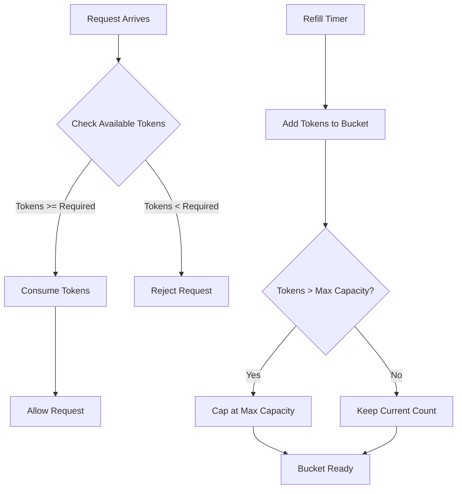
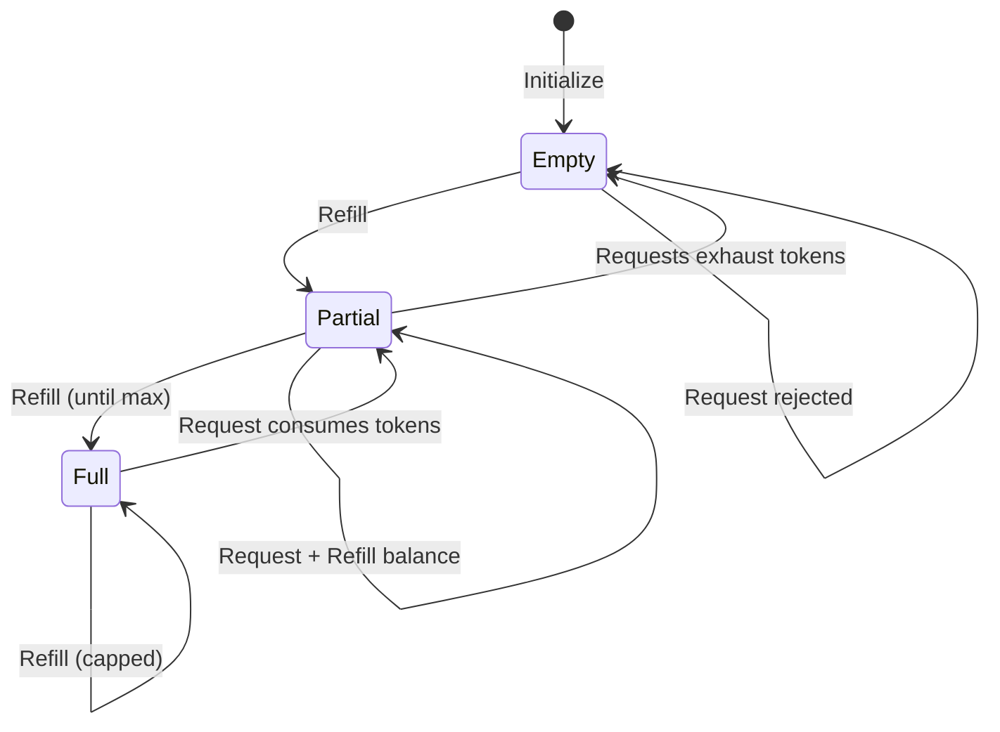
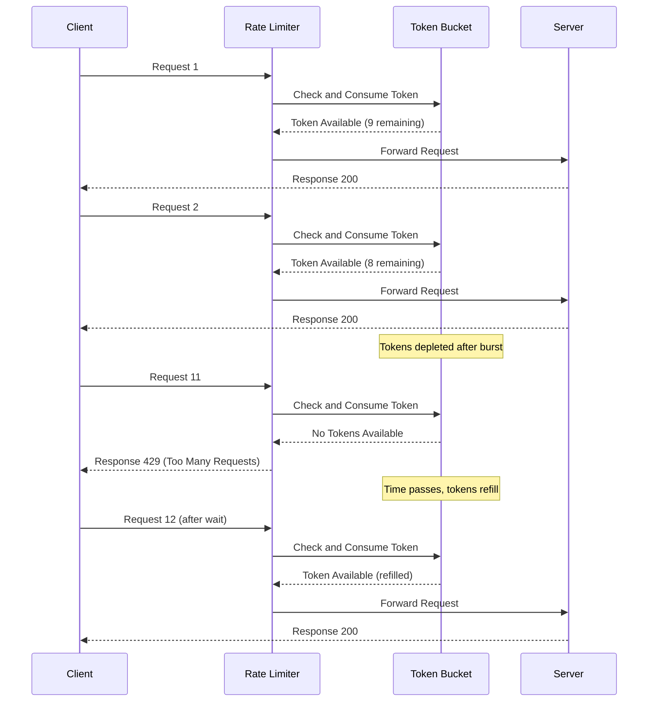
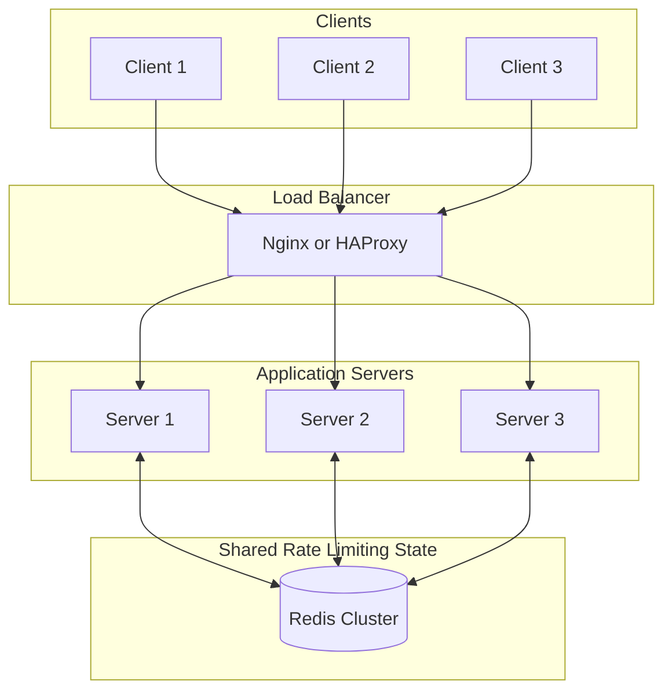
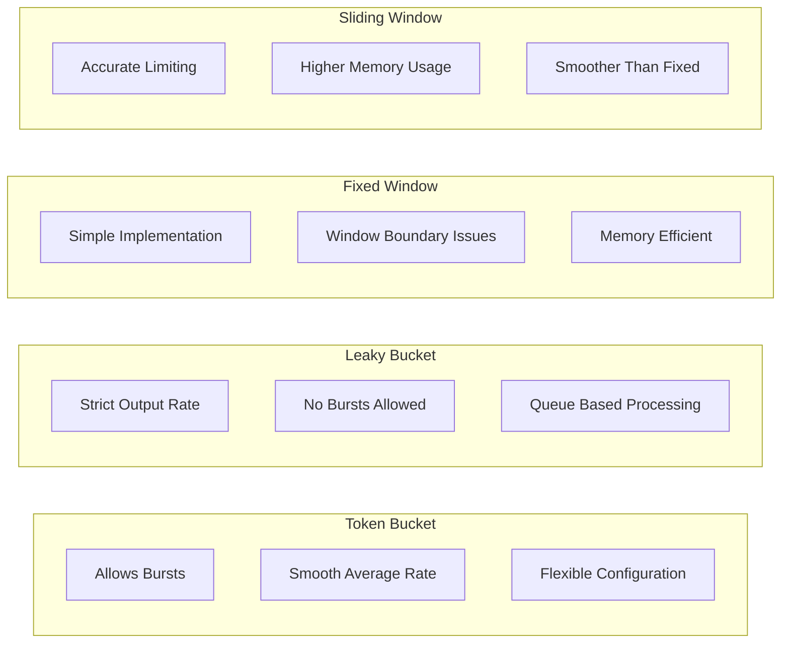

# How to Build Token Bucket Implementation

Author: [nawazdhandala](https://github.com/nawazdhandala)

Tags: Rate Limiting, API Gateway, Algorithms, Backend

Description: Learn how to implement the token bucket algorithm for flexible rate limiting with burst support.

---

Rate limiting is essential for protecting APIs from abuse, ensuring fair usage, and maintaining system stability. Among various rate limiting algorithms, the **token bucket** stands out for its flexibility in handling burst traffic while maintaining a steady average rate. In this guide, we will walk through how to implement a token bucket algorithm from scratch, covering the core concepts and providing both in-memory and Redis-based implementations.

## What is the Token Bucket Algorithm?

The token bucket algorithm works like a bucket that holds tokens. Each token represents permission to make one request. Here is how it operates:

1. The bucket has a maximum capacity (bucket size)
2. Tokens are added to the bucket at a fixed rate (refill rate)
3. When a request arrives, it consumes one or more tokens
4. If enough tokens are available, the request proceeds
5. If not enough tokens exist, the request is rejected or queued

This design naturally allows for **burst traffic** since the bucket can accumulate tokens up to its maximum capacity during idle periods.

## Token Bucket Flow Diagram



## Core Concepts

### Bucket Size (Capacity)

The bucket size determines the maximum number of tokens that can be stored. This directly controls the **burst capacity** of your rate limiter. A larger bucket allows more requests to be processed in quick succession.

For example, if your bucket size is 100 and you have been idle for a while, you can immediately process 100 requests in a burst before being limited.

### Token Refill Rate

The refill rate specifies how many tokens are added to the bucket per time unit. This controls the **sustained rate** at which requests can be processed over time.

For instance, a refill rate of 10 tokens per second means your API can sustainably handle 10 requests per second on average, regardless of burst patterns.

### Burst Handling

When the bucket is full, incoming requests can consume tokens immediately, enabling burst traffic. As tokens deplete, the rate naturally throttles to match the refill rate. This makes token bucket ideal for APIs that need to handle occasional traffic spikes.

The burst capacity equals the bucket size. If you have a bucket of 100 tokens with a refill rate of 10 tokens per second:

- **Burst scenario**: Process up to 100 requests instantly
- **Sustained scenario**: After burst, process 10 requests per second
- **Recovery**: An empty bucket refills to full in 10 seconds

## Token Bucket State Diagram



## In-Memory Implementation (TypeScript)

Let us start with a simple in-memory implementation that demonstrates the core algorithm.

```typescript
// TokenBucket class implementing the token bucket rate limiting algorithm
// This provides a simple, efficient way to limit request rates with burst support
class TokenBucket {
    // Maximum number of tokens the bucket can hold
    // This determines the burst capacity of the rate limiter
    private capacity: number;

    // Current number of tokens available in the bucket
    // Decreases when requests consume tokens, increases during refill
    private tokens: number;

    // Number of tokens added per second
    // This determines the sustained request rate over time
    private refillRate: number;

    // Timestamp of the last refill operation
    // Used to calculate how many tokens to add since last check
    private lastRefillTime: number;

    constructor(capacity: number, refillRate: number) {
        // Set the maximum bucket capacity (burst size)
        this.capacity = capacity;

        // Start with a full bucket to allow initial burst
        // This is a common pattern to avoid penalizing new clients
        this.tokens = capacity;

        // Store the refill rate (tokens added per second)
        this.refillRate = refillRate;

        // Record the initialization time for refill calculations
        this.lastRefillTime = Date.now();
    }

    // Refill tokens based on elapsed time since last refill
    // This method is called lazily before each consume operation
    // Using lazy refill avoids the need for background timers
    private refill(): void {
        const now = Date.now();

        // Calculate time elapsed in seconds since last refill
        const elapsedSeconds = (now - this.lastRefillTime) / 1000;

        // Calculate how many tokens to add based on elapsed time
        // tokens = time_elapsed * refill_rate
        const tokensToAdd = elapsedSeconds * this.refillRate;

        // Add tokens but cap at maximum capacity to prevent overflow
        // This ensures burst capacity never exceeds the configured limit
        this.tokens = Math.min(this.capacity, this.tokens + tokensToAdd);

        // Update the last refill timestamp for next calculation
        this.lastRefillTime = now;
    }

    // Attempt to consume tokens for a request
    // Returns true if request is allowed, false if rejected
    // tokensRequired parameter allows different costs for different operations
    consume(tokensRequired: number = 1): boolean {
        // First, refill tokens based on elapsed time
        // This ensures we have the most up-to-date token count
        this.refill();

        // Check if we have enough tokens for this request
        if (this.tokens >= tokensRequired) {
            // Deduct the required tokens from the bucket
            this.tokens -= tokensRequired;
            return true; // Request allowed
        }

        // Not enough tokens available, request must be rejected
        return false; // Request rejected
    }

    // Get current token count (useful for monitoring and debugging)
    // Also useful for including in rate limit headers
    getTokenCount(): number {
        // Refill first to get accurate count reflecting current time
        this.refill();
        return this.tokens;
    }

    // Get time in milliseconds until a specific number of tokens will be available
    // Useful for setting the Retry-After header in 429 responses
    getWaitTime(tokensRequired: number = 1): number {
        // Refill first to get accurate state
        this.refill();

        // If we already have enough tokens, no wait needed
        if (this.tokens >= tokensRequired) {
            return 0;
        }

        // Calculate how many more tokens we need
        const tokensNeeded = tokensRequired - this.tokens;

        // Calculate time to accumulate those tokens at our refill rate
        // wait_time = tokens_needed / refill_rate
        const waitTimeSeconds = tokensNeeded / this.refillRate;

        // Return wait time in milliseconds, rounded up
        return Math.ceil(waitTimeSeconds * 1000);
    }

    // Get the bucket capacity (useful for rate limit headers)
    getCapacity(): number {
        return this.capacity;
    }
}

// Usage example demonstrating the token bucket behavior
const bucket = new TokenBucket(
    10,  // Maximum 10 tokens (burst capacity)
    2    // Refill 2 tokens per second (sustained rate)
);

// Simulate handling incoming requests
function handleRequest(requestId: number): void {
    if (bucket.consume(1)) {
        console.log(`Request ${requestId}: ALLOWED (${bucket.getTokenCount().toFixed(2)} tokens remaining)`);
    } else {
        const waitTime = bucket.getWaitTime(1);
        console.log(`Request ${requestId}: REJECTED (retry after ${waitTime}ms)`);
    }
}

// Process 15 rapid requests to see burst behavior
// First 10 will succeed (burst), remaining 5 will be rejected
for (let i = 1; i <= 15; i++) {
    handleRequest(i);
}
```

## Request Processing Timeline



## Multi-Client Rate Limiter

In real applications, you need separate buckets for different clients (by IP, API key, or user ID). This implementation manages buckets per identifier.

```typescript
// Configuration interface for the multi-client rate limiter
interface RateLimiterConfig {
    // Maximum tokens per bucket (burst capacity)
    capacity: number;
    // Tokens added per second (sustained rate)
    refillRate: number;
    // How often to clean up idle buckets (milliseconds)
    cleanupIntervalMs?: number;
}

// Result interface for consume operations
interface ConsumeResult {
    // Whether the request was allowed
    allowed: boolean;
    // Remaining tokens after this request
    remaining: number;
    // Seconds to wait before retrying (0 if allowed)
    retryAfter: number;
}

// Bucket state stored per client
interface BucketState {
    // Current token count
    tokens: number;
    // Last refill timestamp
    lastRefillTime: number;
}

class MultiClientTokenBucket {
    private capacity: number;
    private refillRate: number;
    // Map of client identifier to their bucket state
    private buckets: Map<string, BucketState>;
    // Cleanup interval handle for garbage collection
    private cleanupInterval: NodeJS.Timeout;

    constructor(config: RateLimiterConfig) {
        this.capacity = config.capacity;
        this.refillRate = config.refillRate;
        this.buckets = new Map();

        // Start periodic cleanup to remove idle buckets
        // This prevents memory leaks from abandoned clients
        this.cleanupInterval = setInterval(
            () => this.cleanup(),
            config.cleanupIntervalMs || 60000
        );
    }

    // Get or create a bucket for a specific client
    // New clients start with a full bucket
    private getBucket(identifier: string): BucketState {
        if (!this.buckets.has(identifier)) {
            this.buckets.set(identifier, {
                tokens: this.capacity,
                lastRefillTime: Date.now()
            });
        }
        return this.buckets.get(identifier)!;
    }

    // Refill tokens for a specific bucket based on elapsed time
    private refillBucket(bucket: BucketState): void {
        const now = Date.now();
        const elapsedSeconds = (now - bucket.lastRefillTime) / 1000;
        const tokensToAdd = elapsedSeconds * this.refillRate;

        // Add tokens but cap at capacity
        bucket.tokens = Math.min(this.capacity, bucket.tokens + tokensToAdd);
        bucket.lastRefillTime = now;
    }

    // Attempt to consume tokens for a specific client
    consume(identifier: string, tokensRequired: number = 1): ConsumeResult {
        const bucket = this.getBucket(identifier);
        this.refillBucket(bucket);

        if (bucket.tokens >= tokensRequired) {
            // Sufficient tokens available
            bucket.tokens -= tokensRequired;
            return {
                allowed: true,
                remaining: Math.floor(bucket.tokens),
                retryAfter: 0
            };
        }

        // Calculate wait time for the client
        const tokensNeeded = tokensRequired - bucket.tokens;
        const waitSeconds = Math.ceil(tokensNeeded / this.refillRate);

        return {
            allowed: false,
            remaining: 0,
            retryAfter: waitSeconds
        };
    }

    // Remove buckets that have been idle (fully refilled and unused)
    // This prevents memory growth from one-time visitors
    private cleanup(): void {
        const now = Date.now();
        // Remove buckets idle for more than 1 hour
        const maxIdleMs = 3600000;

        for (const [identifier, bucket] of this.buckets) {
            // Check if bucket is full and has been idle
            if (bucket.tokens >= this.capacity &&
                now - bucket.lastRefillTime > maxIdleMs) {
                this.buckets.delete(identifier);
            }
        }
    }

    // Get current bucket count (useful for monitoring)
    getBucketCount(): number {
        return this.buckets.size;
    }

    // Clean up resources when shutting down
    destroy(): void {
        clearInterval(this.cleanupInterval);
        this.buckets.clear();
    }
}
```

## Express Middleware Implementation

Here is how to integrate the token bucket into an Express application with proper headers and error responses.

```typescript
import express, { Request, Response, NextFunction } from 'express';

// Create rate limiting middleware with configurable options
function createRateLimiter(config: {
    capacity: number;
    refillRate: number;
    // Function to extract client identifier from request
    keyGenerator?: (req: Request) => string;
    // Function to determine if request should skip rate limiting
    skip?: (req: Request) => boolean;
}) {
    // Initialize the multi-client rate limiter
    const limiter = new MultiClientTokenBucket({
        capacity: config.capacity,
        refillRate: config.refillRate
    });

    // Default key generator uses IP address
    const getKey = config.keyGenerator || ((req: Request) => {
        return req.ip || req.socket.remoteAddress || 'unknown';
    });

    // Default skip function does not skip any requests
    const shouldSkip = config.skip || (() => false);

    return (req: Request, res: Response, next: NextFunction): void => {
        // Check if this request should bypass rate limiting
        // Useful for health checks, internal services, etc.
        if (shouldSkip(req)) {
            next();
            return;
        }

        // Generate unique key for this client
        const key = getKey(req);

        // Try to consume a token
        const result = limiter.consume(key, 1);

        // Set standard rate limit headers
        // These help clients understand their quota
        res.setHeader('X-RateLimit-Limit', config.capacity.toString());
        res.setHeader('X-RateLimit-Remaining', result.remaining.toString());
        res.setHeader('X-RateLimit-Reset',
            Math.ceil(Date.now() / 1000 + (config.capacity / config.refillRate)).toString()
        );

        if (result.allowed) {
            // Request allowed, proceed to next middleware
            next();
        } else {
            // Request rejected, return 429 status with helpful information
            res.setHeader('Retry-After', result.retryAfter.toString());
            res.status(429).json({
                error: 'Too Many Requests',
                message: 'Rate limit exceeded. Please try again later.',
                retryAfter: result.retryAfter
            });
        }
    };
}

// Example Express application with rate limiting
const app = express();

// Apply global rate limiting to all API routes
// Allow burst of 100 requests, sustain 10 per second
app.use('/api', createRateLimiter({
    capacity: 100,
    refillRate: 10,
    keyGenerator: (req) => req.ip || 'unknown'
}));

// Stricter limits for authentication endpoints to prevent brute force
app.use('/api/auth', createRateLimiter({
    capacity: 5,          // Only 5 attempts allowed in burst
    refillRate: 0.1,      // 1 attempt every 10 seconds
    keyGenerator: (req) => `auth:${req.ip}`
}));

// Sample protected endpoint
app.get('/api/resource', (req: Request, res: Response) => {
    res.json({ message: 'Success!', timestamp: new Date().toISOString() });
});

// Health check endpoint (bypasses rate limiting)
app.get('/health', (req: Request, res: Response) => {
    res.json({ status: 'healthy' });
});

app.listen(3000, () => {
    console.log('Server running on port 3000');
});
```

## Redis-Based Distributed Implementation

For distributed systems where multiple servers need to share rate limiting state, Redis provides an excellent solution. Using Lua scripts ensures atomic operations across the check-and-consume sequence.

```typescript
import Redis from 'ioredis';

// Configuration interface for the Redis-based rate limiter
interface RedisTokenBucketConfig {
    // Maximum tokens the bucket can hold (burst capacity)
    capacity: number;

    // Tokens added per second (sustained rate)
    refillRate: number;

    // Key prefix for Redis storage to avoid collisions
    keyPrefix: string;

    // TTL for Redis keys in seconds (prevents orphaned keys)
    keyTTL: number;
}

class RedisTokenBucket {
    private redis: Redis;
    private config: RedisTokenBucketConfig;

    constructor(redis: Redis, config: RedisTokenBucketConfig) {
        this.redis = redis;
        this.config = config;
    }

    // Generate Redis key for a specific identifier (user ID, IP address, API key)
    private getKey(identifier: string): string {
        return `${this.config.keyPrefix}:${identifier}`;
    }

    // Lua script for atomic token bucket operations
    // Using Lua ensures atomicity in distributed environments
    // This script runs entirely on Redis, preventing race conditions
    // between multiple application servers
    private readonly luaScript = `
        -- KEYS[1]: The bucket key in Redis
        -- ARGV[1]: Bucket capacity (maximum tokens)
        -- ARGV[2]: Refill rate (tokens per second)
        -- ARGV[3]: Tokens required for this request
        -- ARGV[4]: Current timestamp in milliseconds
        -- ARGV[5]: Key TTL in seconds for automatic cleanup

        local key = KEYS[1]
        local capacity = tonumber(ARGV[1])
        local refillRate = tonumber(ARGV[2])
        local tokensRequired = tonumber(ARGV[3])
        local now = tonumber(ARGV[4])
        local keyTTL = tonumber(ARGV[5])

        -- Retrieve current bucket state from Redis
        -- Returns nil values if bucket does not exist yet
        local bucket = redis.call('HMGET', key, 'tokens', 'lastRefill')
        local tokens = tonumber(bucket[1])
        local lastRefill = tonumber(bucket[2])

        -- Initialize bucket if it does not exist yet
        -- New clients start with a full bucket
        if tokens == nil then
            tokens = capacity
            lastRefill = now
        end

        -- Calculate tokens to add based on time elapsed since last refill
        -- This implements the "lazy refill" pattern
        local elapsed = (now - lastRefill) / 1000
        local tokensToAdd = elapsed * refillRate

        -- Add new tokens but cap at maximum capacity
        tokens = math.min(capacity, tokens + tokensToAdd)

        -- Prepare response variables
        local allowed = 0
        local remaining = tokens
        local waitTime = 0

        -- Check if request can be fulfilled
        if tokens >= tokensRequired then
            -- Sufficient tokens: consume and allow request
            tokens = tokens - tokensRequired
            allowed = 1
            remaining = tokens
        else
            -- Insufficient tokens: calculate wait time for retry
            local tokensNeeded = tokensRequired - tokens
            waitTime = math.ceil((tokensNeeded / refillRate) * 1000)
        end

        -- Persist updated bucket state to Redis
        redis.call('HMSET', key, 'tokens', tokens, 'lastRefill', now)

        -- Set TTL to automatically clean up idle buckets
        -- This prevents Redis memory from growing indefinitely
        redis.call('EXPIRE', key, keyTTL)

        -- Return: allowed (0 or 1), remaining tokens, wait time in milliseconds
        return {allowed, remaining, waitTime}
    `;

    // Attempt to consume tokens for a given identifier
    // Returns whether request is allowed, remaining tokens, and wait time if rejected
    async consume(identifier: string, tokensRequired: number = 1): Promise<{
        allowed: boolean;
        remaining: number;
        waitTime: number;
    }> {
        const key = this.getKey(identifier);
        const now = Date.now();

        // Execute Lua script atomically on Redis
        // The eval command runs the entire script as a single operation
        const result = await this.redis.eval(
            this.luaScript,
            1,                          // Number of keys
            key,                        // KEYS[1]
            this.config.capacity,       // ARGV[1]
            this.config.refillRate,     // ARGV[2]
            tokensRequired,             // ARGV[3]
            now,                        // ARGV[4]
            this.config.keyTTL          // ARGV[5]
        ) as number[];

        return {
            allowed: result[0] === 1,
            remaining: result[1],
            waitTime: result[2]
        };
    }

    // Get current bucket status without consuming tokens
    // Useful for monitoring dashboards and debugging
    async getStatus(identifier: string): Promise<{
        tokens: number;
        capacity: number;
    }> {
        const key = this.getKey(identifier);
        const bucket = await this.redis.hmget(key, 'tokens', 'lastRefill');

        let tokens = parseFloat(bucket[0] || String(this.config.capacity));
        const lastRefill = parseFloat(bucket[1] || String(Date.now()));

        // Calculate current tokens including refill since last check
        const elapsed = (Date.now() - lastRefill) / 1000;
        const tokensToAdd = elapsed * this.config.refillRate;
        tokens = Math.min(this.config.capacity, tokens + tokensToAdd);

        return {
            tokens: Math.floor(tokens),
            capacity: this.config.capacity
        };
    }

    // Reset the bucket for an identifier
    // Useful for testing, admin actions, or after account upgrades
    async reset(identifier: string): Promise<void> {
        const key = this.getKey(identifier);
        await this.redis.del(key);
    }
}
```

## Complete Express Application with Redis

Here is a production-ready Express application using the Redis-based token bucket.

```typescript
import express, { Request, Response, NextFunction } from 'express';
import Redis from 'ioredis';

// Initialize Redis connection with retry strategy
const redis = new Redis({
    host: process.env.REDIS_HOST || 'localhost',
    port: parseInt(process.env.REDIS_PORT || '6379'),
    password: process.env.REDIS_PASSWORD,
    // Retry strategy for resilience during Redis outages
    retryStrategy: (times: number) => {
        // Exponential backoff with max delay of 2 seconds
        const delay = Math.min(times * 50, 2000);
        return delay;
    }
});

// Create rate limiter instance with configuration
const rateLimiter = new RedisTokenBucket(redis, {
    capacity: 100,      // Allow burst of 100 requests
    refillRate: 10,     // Sustain 10 requests per second
    keyPrefix: 'ratelimit',
    keyTTL: 3600        // Keys expire after 1 hour of inactivity
});

// Rate limiting middleware with proper error handling
async function rateLimitMiddleware(
    req: Request,
    res: Response,
    next: NextFunction
): Promise<void> {
    // Use IP address as identifier
    // Could also use user ID, API key, or combination
    const identifier = req.ip || 'unknown';

    try {
        const result = await rateLimiter.consume(identifier, 1);

        // Add rate limit headers for client visibility
        res.setHeader('X-RateLimit-Limit', '100');
        res.setHeader('X-RateLimit-Remaining', String(Math.floor(result.remaining)));

        if (result.allowed) {
            // Request allowed, proceed to next middleware
            next();
        } else {
            // Request rejected, return 429 with retry information
            res.setHeader('Retry-After', String(Math.ceil(result.waitTime / 1000)));
            res.status(429).json({
                error: 'Too Many Requests',
                message: 'Rate limit exceeded. Please retry later.',
                retryAfter: result.waitTime
            });
        }
    } catch (error) {
        // If Redis fails, implement fail-open strategy
        // This allows requests through when rate limiting is unavailable
        // Consider fail-closed (reject) for high-security scenarios
        console.error('Rate limiter error:', error);
        next();
    }
}

const app = express();

// Apply rate limiting middleware to all routes
app.use(rateLimitMiddleware);

// Sample API endpoint
app.get('/api/resource', (req: Request, res: Response) => {
    res.json({ message: 'Success!' });
});

// Health check endpoint
app.get('/health', (req: Request, res: Response) => {
    res.json({ status: 'healthy' });
});

app.listen(3000, () => {
    console.log('Server running on port 3000');
});
```

## Distributed Architecture Diagram



## Best Practices

### 1. Choose Appropriate Capacity and Refill Rate

Consider your use case when setting parameters.

```typescript
// API with strict limits: low capacity, low rate
// Good for sensitive endpoints like authentication
const strictLimiter = new RedisTokenBucket(redis, {
    capacity: 10,       // Small burst allowance
    refillRate: 1,      // 1 request per second sustained
    keyPrefix: 'strict',
    keyTTL: 3600
});

// API allowing bursts: high capacity, moderate rate
// Good for general API access
const burstLimiter = new RedisTokenBucket(redis, {
    capacity: 100,      // Large burst allowance
    refillRate: 10,     // 10 requests per second sustained
    keyPrefix: 'burst',
    keyTTL: 3600
});

// High throughput API: very high capacity and rate
// Good for internal services or premium customers
const highThroughputLimiter = new RedisTokenBucket(redis, {
    capacity: 1000,     // Very large burst allowance
    refillRate: 100,    // 100 requests per second sustained
    keyPrefix: 'premium',
    keyTTL: 3600
});
```

### 2. Implement Different Limits for Different Endpoints

```typescript
// Different rate limiters for different resource types
const limiters = {
    // Read operations: more generous limits
    read: new RedisTokenBucket(redis, {
        capacity: 1000,
        refillRate: 100,
        keyPrefix: 'read',
        keyTTL: 3600
    }),

    // Write operations: more restrictive to protect data integrity
    write: new RedisTokenBucket(redis, {
        capacity: 100,
        refillRate: 10,
        keyPrefix: 'write',
        keyTTL: 3600
    }),

    // Authentication: very restrictive to prevent brute force attacks
    auth: new RedisTokenBucket(redis, {
        capacity: 5,
        refillRate: 0.1,  // 1 token every 10 seconds
        keyPrefix: 'auth',
        keyTTL: 3600
    }),

    // File uploads: limit based on resource intensity
    upload: new RedisTokenBucket(redis, {
        capacity: 10,
        refillRate: 0.5,  // 1 upload every 2 seconds
        keyPrefix: 'upload',
        keyTTL: 3600
    })
};
```

### 3. Add Monitoring and Alerting

```typescript
// Track rate limit metrics for observability
interface RateLimitMetrics {
    allowed: number;
    rejected: number;
    totalLatency: number;
    lastUpdated: number;
}

const metrics: Map<string, RateLimitMetrics> = new Map();

async function consumeWithMetrics(
    limiter: RedisTokenBucket,
    identifier: string,
    category: string
): Promise<boolean> {
    const start = Date.now();
    const result = await limiter.consume(identifier);
    const latency = Date.now() - start;

    // Update metrics for this category
    let categoryMetrics = metrics.get(category);
    if (!categoryMetrics) {
        categoryMetrics = {
            allowed: 0,
            rejected: 0,
            totalLatency: 0,
            lastUpdated: Date.now()
        };
        metrics.set(category, categoryMetrics);
    }

    if (result.allowed) {
        categoryMetrics.allowed++;
    } else {
        categoryMetrics.rejected++;
    }
    categoryMetrics.totalLatency += latency;
    categoryMetrics.lastUpdated = Date.now();

    // Alert if rejection rate is too high (example threshold: 10%)
    const totalRequests = categoryMetrics.allowed + categoryMetrics.rejected;
    if (totalRequests > 100) {
        const rejectionRate = categoryMetrics.rejected / totalRequests;
        if (rejectionRate > 0.1) {
            console.warn(
                `High rejection rate for ${category}: ${(rejectionRate * 100).toFixed(1)}%`
            );
        }
    }

    return result.allowed;
}

// Expose metrics endpoint for monitoring systems
app.get('/metrics', (req: Request, res: Response) => {
    const metricsOutput: Record<string, any> = {};
    for (const [category, data] of metrics) {
        const total = data.allowed + data.rejected;
        metricsOutput[category] = {
            ...data,
            avgLatency: total > 0 ? data.totalLatency / total : 0,
            rejectionRate: total > 0 ? (data.rejected / total * 100).toFixed(2) + '%' : '0%'
        };
    }
    res.json(metricsOutput);
});
```

## Comparison with Other Rate Limiting Algorithms



| Algorithm | Burst Support | Memory Usage | Accuracy | Complexity | Best Use Case |
|-----------|---------------|--------------|----------|------------|---------------|
| Token Bucket | Yes | Low | High | Medium | APIs with variable traffic |
| Leaky Bucket | No | Low | High | Medium | Constant rate processing |
| Fixed Window | Limited | Very Low | Medium | Low | Simple rate limiting |
| Sliding Window | Limited | Medium | Very High | High | Precise rate limiting |

## Summary

The token bucket algorithm provides an elegant solution for rate limiting that balances simplicity with flexibility. Its ability to handle burst traffic while maintaining a steady average rate makes it ideal for most API rate limiting scenarios.

Key takeaways:

1. **Bucket size controls burst capacity**: Set it based on how much burst traffic you want to allow
2. **Refill rate controls sustained throughput**: This is your steady-state rate limit
3. **Use Redis for distributed systems**: Lua scripts ensure atomic operations across servers
4. **Add proper headers and error responses**: Help clients understand and respect your limits
5. **Monitor and adjust**: Track metrics to fine-tune your rate limiting parameters

By implementing the token bucket algorithm as shown in this guide, you can protect your APIs from abuse while providing a good experience for legitimate users who occasionally need to make bursts of requests.

## Further Reading

- [RFC 6585: Additional HTTP Status Codes](https://tools.ietf.org/html/rfc6585) - Defines 429 Too Many Requests
- [Redis Commands Documentation](https://redis.io/commands/) - For advanced Redis operations
- [IETF Rate Limit Headers Draft](https://datatracker.ietf.org/doc/draft-ietf-httpapi-ratelimit-headers/) - Standardized rate limit headers
