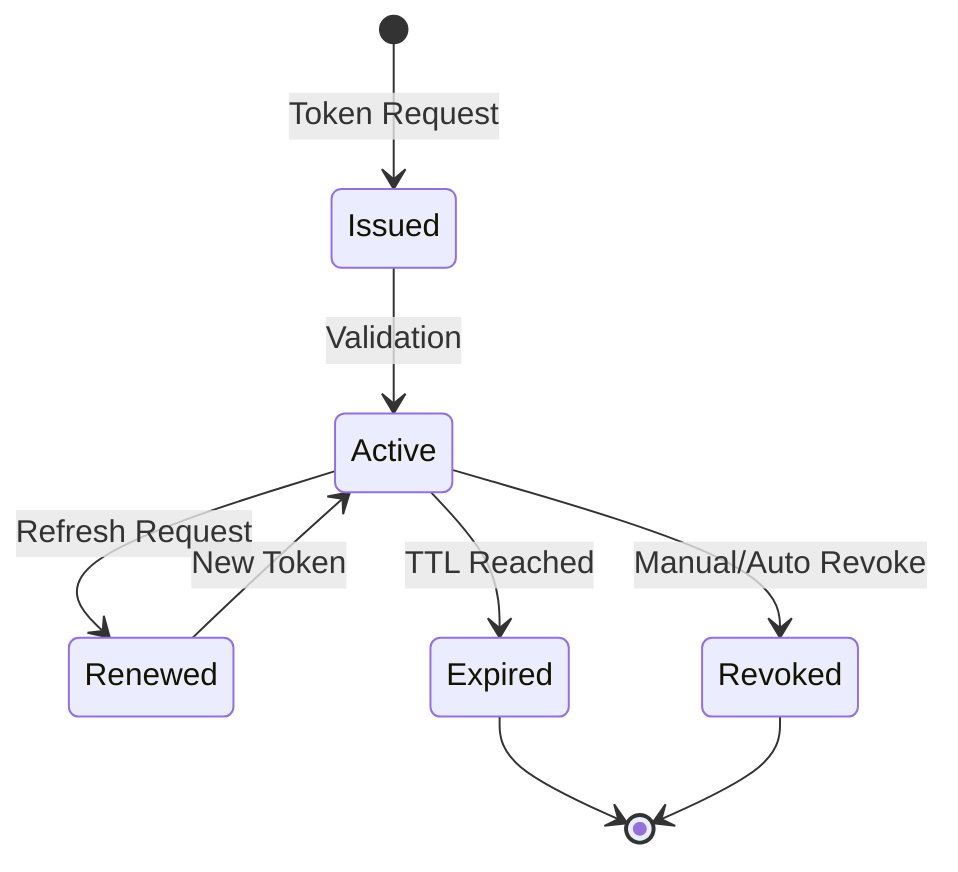
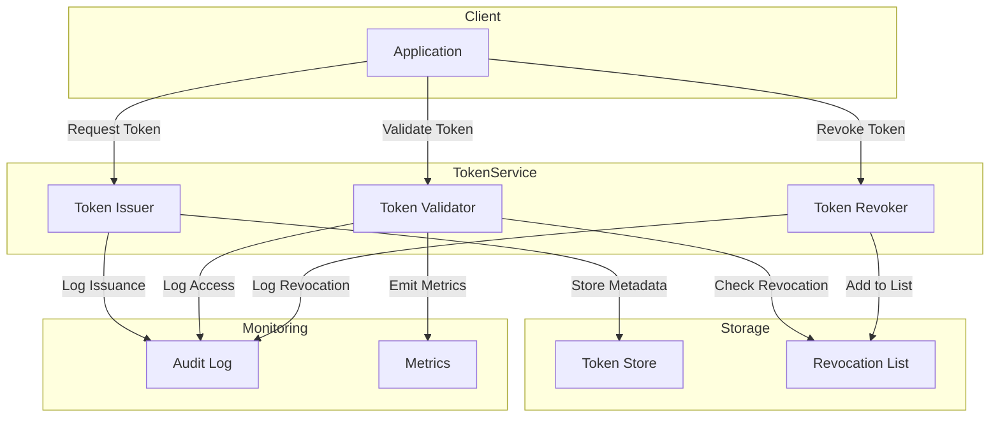
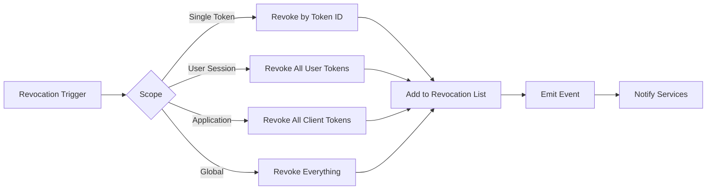

# How to Create Token Lifecycle Management

Author: [nawazdhandala](https://github.com/nawazdhandala)

Tags: Security, Tokens, Lifecycle, OAuth

Description: Learn to create token lifecycle management for token issuance, renewal, and revocation.

---

Tokens power modern authentication. API keys, JWTs, refresh tokens, and OAuth access tokens all serve as credentials that grant access to systems and data. But tokens without proper lifecycle management become security liabilities. Leaked tokens with no expiration, orphaned credentials from departed employees, and tokens that cannot be revoked during a breach all create risk.

This guide covers how to build a complete token lifecycle management system that handles issuance, renewal, and revocation. We will walk through the architecture, implementation patterns, and operational practices that keep your token infrastructure secure.

---

## Why token lifecycle management matters

Every token your system issues is a potential attack vector. Consider what happens when:

- A developer accidentally commits an API key to a public repository
- An employee leaves the company with active tokens on personal devices
- A security incident requires immediate invalidation of all active sessions
- Token sprawl makes it impossible to audit who has access to what

Without lifecycle management, each of these scenarios requires manual intervention, custom scripts, and hope. With proper lifecycle controls, you can respond in seconds.

---

## The token lifecycle

Tokens move through distinct phases from creation to destruction. Understanding this flow is the foundation for building management systems.



Each state transition represents an opportunity for logging, policy enforcement, and security checks.

---

## Architecture overview

A token lifecycle system needs several components working together. The following diagram shows how these pieces interact.



The token store holds metadata about issued tokens. The revocation list enables fast lookups during validation. Every operation flows through the audit log for compliance and debugging.

---

## Implementing token issuance

Token issuance is where lifecycle management begins. Every token you create should include metadata that supports later management operations.

The following code shows a token issuer that captures the information needed for lifecycle management.

```typescript
// token-issuer.ts
import { randomBytes, createHash } from 'crypto';
import { v4 as uuidv4 } from 'uuid';

interface TokenMetadata {
  tokenId: string;
  userId: string;
  clientId: string;
  scopes: string[];
  issuedAt: Date;
  expiresAt: Date;
  tokenHash: string;      // Store hash, never the raw token
  deviceFingerprint?: string;
  ipAddress?: string;
}

interface IssuedToken {
  accessToken: string;
  refreshToken: string;
  expiresIn: number;
  tokenType: string;
}

class TokenIssuer {
  private readonly accessTokenTTL = 15 * 60 * 1000;  // 15 minutes
  private readonly refreshTokenTTL = 7 * 24 * 60 * 60 * 1000;  // 7 days

  async issueTokenPair(
    userId: string,
    clientId: string,
    scopes: string[],
    context: { ip: string; deviceFingerprint?: string }
  ): Promise<IssuedToken> {

    // Generate cryptographically secure tokens
    const accessToken = this.generateToken();
    const refreshToken = this.generateToken();

    const now = new Date();

    // Create metadata for the access token
    const accessMeta: TokenMetadata = {
      tokenId: uuidv4(),
      userId,
      clientId,
      scopes,
      issuedAt: now,
      expiresAt: new Date(now.getTime() + this.accessTokenTTL),
      tokenHash: this.hashToken(accessToken),
      deviceFingerprint: context.deviceFingerprint,
      ipAddress: context.ip
    };

    // Create metadata for the refresh token
    const refreshMeta: TokenMetadata = {
      tokenId: uuidv4(),
      userId,
      clientId,
      scopes,
      issuedAt: now,
      expiresAt: new Date(now.getTime() + this.refreshTokenTTL),
      tokenHash: this.hashToken(refreshToken),
      deviceFingerprint: context.deviceFingerprint,
      ipAddress: context.ip
    };

    // Persist metadata for lifecycle tracking
    await this.tokenStore.save(accessMeta);
    await this.tokenStore.save(refreshMeta);

    // Log issuance for audit trail
    await this.auditLog.record({
      event: 'token_issued',
      tokenId: accessMeta.tokenId,
      userId,
      clientId,
      scopes,
      ip: context.ip,
      timestamp: now
    });

    return {
      accessToken,
      refreshToken,
      expiresIn: this.accessTokenTTL / 1000,
      tokenType: 'Bearer'
    };
  }

  private generateToken(): string {
    // 32 bytes = 256 bits of entropy
    return randomBytes(32).toString('base64url');
  }

  private hashToken(token: string): string {
    // Store only the hash for validation
    return createHash('sha256').update(token).digest('hex');
  }
}
```

Key points in this implementation: we store token hashes rather than raw tokens, capture context like IP and device fingerprint for anomaly detection, and log every issuance for audit purposes.

---

## Building the validation layer

Token validation must check more than just signatures. A complete validator verifies the token exists, has not expired, and has not been revoked.

```typescript
// token-validator.ts
interface ValidationResult {
  valid: boolean;
  reason?: string;
  metadata?: TokenMetadata;
}

class TokenValidator {
  async validate(token: string, requiredScopes: string[]): Promise<ValidationResult> {
    const tokenHash = this.hashToken(token);

    // Look up token metadata by hash
    const metadata = await this.tokenStore.findByHash(tokenHash);

    if (!metadata) {
      return { valid: false, reason: 'token_not_found' };
    }

    // Check expiration
    if (new Date() > metadata.expiresAt) {
      return { valid: false, reason: 'token_expired' };
    }

    // Check revocation list
    const isRevoked = await this.revocationList.contains(metadata.tokenId);
    if (isRevoked) {
      return { valid: false, reason: 'token_revoked' };
    }

    // Verify scopes
    const hasRequiredScopes = requiredScopes.every(
      scope => metadata.scopes.includes(scope)
    );
    if (!hasRequiredScopes) {
      return { valid: false, reason: 'insufficient_scope' };
    }

    // Record successful validation for metrics
    await this.metrics.increment('token_validations', {
      status: 'success',
      clientId: metadata.clientId
    });

    return { valid: true, metadata };
  }

  private hashToken(token: string): string {
    return createHash('sha256').update(token).digest('hex');
  }
}
```

The revocation check is critical. Without it, revoked tokens remain usable until they naturally expire.

---

## Implementing token renewal

Token renewal extends access without requiring users to re-authenticate. The refresh flow should rotate tokens to limit the window of exposure if a token is compromised.

```typescript
// token-renewal.ts
class TokenRenewal {
  async refresh(refreshToken: string, context: { ip: string }): Promise<IssuedToken | null> {
    const tokenHash = this.hashToken(refreshToken);
    const metadata = await this.tokenStore.findByHash(tokenHash);

    // Validate the refresh token
    if (!metadata || new Date() > metadata.expiresAt) {
      return null;
    }

    const isRevoked = await this.revocationList.contains(metadata.tokenId);
    if (isRevoked) {
      return null;
    }

    // Detect anomalies before issuing new tokens
    const anomaly = await this.detectAnomaly(metadata, context);
    if (anomaly) {
      // Revoke the entire token family on suspicious activity
      await this.revokeTokenFamily(metadata.userId, metadata.clientId);

      await this.auditLog.record({
        event: 'refresh_blocked_anomaly',
        tokenId: metadata.tokenId,
        userId: metadata.userId,
        reason: anomaly,
        ip: context.ip
      });

      return null;
    }

    // Revoke the old refresh token (rotation)
    await this.revocationList.add(metadata.tokenId);

    // Issue new token pair
    return this.tokenIssuer.issueTokenPair(
      metadata.userId,
      metadata.clientId,
      metadata.scopes,
      context
    );
  }

  private async detectAnomaly(
    metadata: TokenMetadata,
    context: { ip: string }
  ): Promise<string | null> {
    // Check for impossible travel
    const lastAccess = await this.getLastAccess(metadata.userId);
    if (lastAccess && this.isImpossibleTravel(lastAccess.ip, context.ip, lastAccess.timestamp)) {
      return 'impossible_travel';
    }

    // Check for device mismatch
    if (metadata.deviceFingerprint && context.deviceFingerprint !== metadata.deviceFingerprint) {
      return 'device_mismatch';
    }

    return null;
  }
}
```

Token rotation during refresh limits the damage from stolen refresh tokens. If someone captures a refresh token, it becomes invalid after one use.

---

## Revocation strategies

Revocation is the kill switch for compromised credentials. Your system needs multiple revocation scopes to handle different scenarios.



Here is how to implement these different revocation scopes.

```typescript
// token-revoker.ts
class TokenRevoker {
  // Revoke a single token
  async revokeToken(tokenId: string, reason: string): Promise<void> {
    await this.revocationList.add(tokenId);

    await this.auditLog.record({
      event: 'token_revoked',
      tokenId,
      reason,
      timestamp: new Date()
    });
  }

  // Revoke all tokens for a user
  async revokeUserTokens(userId: string, reason: string): Promise<number> {
    const tokens = await this.tokenStore.findByUser(userId);

    for (const token of tokens) {
      await this.revocationList.add(token.tokenId);
    }

    await this.auditLog.record({
      event: 'user_tokens_revoked',
      userId,
      tokenCount: tokens.length,
      reason,
      timestamp: new Date()
    });

    // Emit event for real-time session termination
    await this.eventBus.publish('user_sessions_revoked', { userId });

    return tokens.length;
  }

  // Revoke all tokens for a specific client application
  async revokeClientTokens(clientId: string, reason: string): Promise<number> {
    const tokens = await this.tokenStore.findByClient(clientId);

    for (const token of tokens) {
      await this.revocationList.add(token.tokenId);
    }

    await this.auditLog.record({
      event: 'client_tokens_revoked',
      clientId,
      tokenCount: tokens.length,
      reason,
      timestamp: new Date()
    });

    return tokens.length;
  }

  // Emergency: revoke everything
  async revokeAll(reason: string): Promise<void> {
    const globalRevocationTimestamp = new Date();

    // Set a global cutoff - all tokens issued before this are invalid
    await this.config.set('global_revocation_timestamp', globalRevocationTimestamp);

    await this.auditLog.record({
      event: 'global_revocation',
      reason,
      timestamp: globalRevocationTimestamp
    });

    // Force all connected clients to re-authenticate
    await this.eventBus.publish('global_revocation', { timestamp: globalRevocationTimestamp });
  }
}
```

The global revocation uses a timestamp cutoff rather than adding millions of tokens to the revocation list. Any token issued before the cutoff is automatically invalid.

---

## Cleanup and maintenance

Tokens accumulate over time. Expired tokens, revoked tokens, and orphaned metadata all consume storage and slow queries. Regular cleanup keeps your token infrastructure healthy.

```typescript
// token-cleanup.ts
class TokenCleanup {
  async runCleanup(): Promise<CleanupReport> {
    const now = new Date();
    const report = { expired: 0, orphaned: 0 };

    // Remove tokens expired more than 24 hours ago
    const expiredCutoff = new Date(now.getTime() - 24 * 60 * 60 * 1000);
    report.expired = await this.tokenStore.deleteExpiredBefore(expiredCutoff);

    // Remove revocation entries for tokens that no longer exist
    report.orphaned = await this.revocationList.cleanupOrphaned();

    await this.auditLog.record({
      event: 'token_cleanup',
      expiredRemoved: report.expired,
      orphanedRemoved: report.orphaned,
      timestamp: now
    });

    return report;
  }
}
```

Schedule this cleanup to run during low-traffic periods. Most systems benefit from daily cleanup with weekly deep scans.

---

## Operational best practices

Building the system is only half the work. Operating it securely requires ongoing attention.

**Set appropriate TTLs.** Access tokens should be short-lived (15-60 minutes). Refresh tokens can last longer but should still expire (7-30 days). API keys for service accounts might live longer but need regular rotation policies.

**Monitor for anomalies.** Track token usage patterns and alert on deviations. A user who normally makes 100 API calls per day suddenly making 10,000 deserves investigation.

**Plan for incidents.** Document your revocation procedures before you need them. When a breach happens, you want to execute a runbook, not improvise.

**Audit regularly.** Review who has active tokens, what scopes they hold, and when they were last used. Dormant tokens with broad permissions are risks waiting to happen.

**Test your revocation.** Periodically verify that revocation actually works. Issue a test token, revoke it, and confirm it can no longer be used.

---

## Conclusion

Token lifecycle management transforms authentication from a point-in-time check into a continuous security control. By implementing proper issuance, renewal, and revocation, you gain the ability to respond to security events in real time rather than waiting for tokens to expire.

Start with the basics: store token metadata, maintain a revocation list, and log everything. Then layer on anomaly detection, automated cleanup, and operational monitoring. Each addition reduces your exposure window and improves your security posture.

The investment pays off the first time you need to revoke access across your entire system and can do it in seconds instead of hours.
