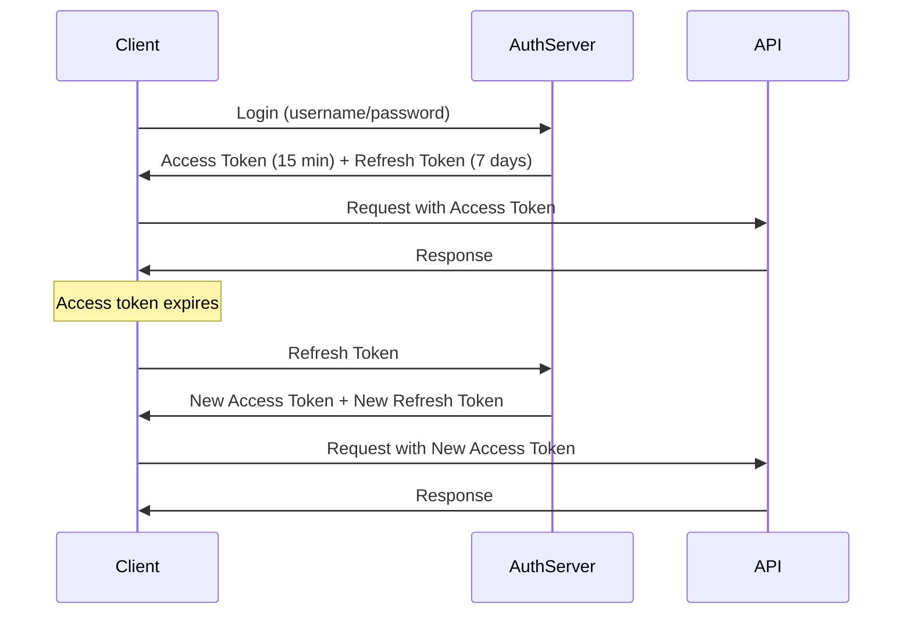
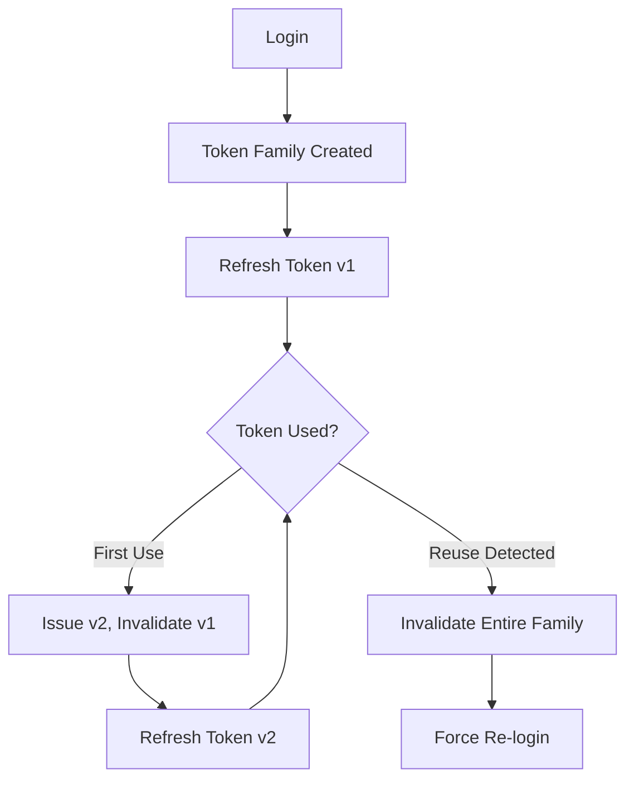

# How to Build Token Rotation Strategies

Author: [nawazdhandala](https://github.com/nawazdhandala)

Tags: Security, Tokens, JWT, Refresh Tokens

Description: Learn to build token rotation strategies for secure session management with refresh tokens.

---

Token-based authentication is everywhere. JWTs power APIs, mobile apps, and microservices. But a token that never expires or rotates is a ticking time bomb. If an attacker captures it, they have indefinite access until someone notices.

Token rotation solves this by cycling credentials automatically. Short-lived access tokens handle day-to-day requests while longer-lived refresh tokens generate new access tokens when needed. When done right, stolen tokens become useless within minutes rather than days.

This guide walks through practical token rotation patterns, from basic refresh flows to advanced rotation with reuse detection.

---

## Why tokens need rotation

Static tokens create several problems:

- **Extended attack windows.** A leaked token grants access until it expires or is manually revoked.
- **No visibility into compromise.** Without rotation, you cannot detect if someone else is using stolen credentials.
- **Compliance gaps.** PCI-DSS, SOC 2, and HIPAA all expect credential rotation policies.
- **Session sprawl.** Long-lived tokens accumulate, making it harder to track active sessions.

Rotation shrinks the window of opportunity. Even if an attacker grabs a token, it becomes invalid at the next rotation cycle.

---

## The token lifecycle

Before diving into implementation, here is how access and refresh tokens work together in a typical system.



The access token is short-lived and used for API calls. The refresh token is longer-lived but only used to obtain new access tokens. This separation limits exposure since the refresh token rarely travels over the network.

---

## Basic refresh token rotation

The simplest rotation strategy issues a new refresh token every time the client uses the old one. This is called refresh token rotation.

Here is a Node.js implementation using Express and JWT.

```javascript
// Token configuration with short access and longer refresh lifetimes
const ACCESS_TOKEN_EXPIRY = '15m';
const REFRESH_TOKEN_EXPIRY = '7d';

// Store for tracking valid refresh tokens
// In production, use Redis or a database
const refreshTokenStore = new Map();

// Generate both tokens during login
async function login(req, res) {
  const { username, password } = req.body;

  // Validate credentials (simplified for example)
  const user = await validateCredentials(username, password);
  if (!user) {
    return res.status(401).json({ error: 'Invalid credentials' });
  }

  // Create token pair
  const accessToken = jwt.sign(
    { userId: user.id, type: 'access' },
    process.env.JWT_SECRET,
    { expiresIn: ACCESS_TOKEN_EXPIRY }
  );

  const refreshToken = jwt.sign(
    { userId: user.id, type: 'refresh', tokenId: crypto.randomUUID() },
    process.env.JWT_SECRET,
    { expiresIn: REFRESH_TOKEN_EXPIRY }
  );

  // Store the refresh token for later validation
  refreshTokenStore.set(refreshToken, {
    userId: user.id,
    createdAt: Date.now()
  });

  res.json({ accessToken, refreshToken });
}
```

The refresh endpoint invalidates the old token and issues a fresh pair.

```javascript
// Rotate tokens when client requests new access token
async function refresh(req, res) {
  const { refreshToken } = req.body;

  // Verify the token signature and expiry
  let payload;
  try {
    payload = jwt.verify(refreshToken, process.env.JWT_SECRET);
  } catch (err) {
    return res.status(401).json({ error: 'Invalid refresh token' });
  }

  // Check if this refresh token is still valid in our store
  if (!refreshTokenStore.has(refreshToken)) {
    // Token was already used or revoked
    return res.status(401).json({ error: 'Refresh token not found' });
  }

  // Invalidate the old refresh token immediately
  refreshTokenStore.delete(refreshToken);

  // Issue new token pair
  const newAccessToken = jwt.sign(
    { userId: payload.userId, type: 'access' },
    process.env.JWT_SECRET,
    { expiresIn: ACCESS_TOKEN_EXPIRY }
  );

  const newRefreshToken = jwt.sign(
    { userId: payload.userId, type: 'refresh', tokenId: crypto.randomUUID() },
    process.env.JWT_SECRET,
    { expiresIn: REFRESH_TOKEN_EXPIRY }
  );

  // Store the new refresh token
  refreshTokenStore.set(newRefreshToken, {
    userId: payload.userId,
    createdAt: Date.now()
  });

  res.json({ accessToken: newAccessToken, refreshToken: newRefreshToken });
}
```

This pattern ensures each refresh token can only be used once. The moment it is exchanged for new tokens, it becomes invalid.

---

## Detecting token reuse attacks

Basic rotation has a weakness: if an attacker steals a refresh token before the legitimate user refreshes, they can use it first. The real user then fails on their next refresh attempt.

Token family tracking solves this. Every refresh token belongs to a family. If a token from the same family is used twice, the entire family is invalidated.



Here is how to implement family tracking.

```javascript
// Track token families for reuse detection
// Key: familyId, Value: { userId, currentTokenId, revoked }
const tokenFamilies = new Map();

// Create a new token family on login
async function loginWithFamily(req, res) {
  const { username, password } = req.body;
  const user = await validateCredentials(username, password);

  if (!user) {
    return res.status(401).json({ error: 'Invalid credentials' });
  }

  // Each login creates a new token family
  const familyId = crypto.randomUUID();
  const tokenId = crypto.randomUUID();

  const accessToken = jwt.sign(
    { userId: user.id, type: 'access' },
    process.env.JWT_SECRET,
    { expiresIn: '15m' }
  );

  const refreshToken = jwt.sign(
    { userId: user.id, type: 'refresh', familyId, tokenId },
    process.env.JWT_SECRET,
    { expiresIn: '7d' }
  );

  // Initialize the token family
  tokenFamilies.set(familyId, {
    userId: user.id,
    currentTokenId: tokenId,
    revoked: false
  });

  res.json({ accessToken, refreshToken });
}
```

The refresh endpoint now checks for reuse and revokes the family if detected.

```javascript
// Refresh with reuse detection
async function refreshWithReuseDetection(req, res) {
  const { refreshToken } = req.body;

  let payload;
  try {
    payload = jwt.verify(refreshToken, process.env.JWT_SECRET);
  } catch (err) {
    return res.status(401).json({ error: 'Invalid refresh token' });
  }

  const { userId, familyId, tokenId } = payload;
  const family = tokenFamilies.get(familyId);

  // Family does not exist or was revoked
  if (!family || family.revoked) {
    return res.status(401).json({ error: 'Session invalidated' });
  }

  // Reuse detected: token ID does not match current
  if (family.currentTokenId !== tokenId) {
    // Revoke entire family to kick out attacker
    family.revoked = true;
    console.warn(`Token reuse detected for user ${userId}, family ${familyId}`);
    return res.status(401).json({ error: 'Token reuse detected, session revoked' });
  }

  // Generate new tokens in the same family
  const newTokenId = crypto.randomUUID();

  const newAccessToken = jwt.sign(
    { userId, type: 'access' },
    process.env.JWT_SECRET,
    { expiresIn: '15m' }
  );

  const newRefreshToken = jwt.sign(
    { userId, type: 'refresh', familyId, tokenId: newTokenId },
    process.env.JWT_SECRET,
    { expiresIn: '7d' }
  );

  // Update family with new current token
  family.currentTokenId = newTokenId;

  res.json({ accessToken: newAccessToken, refreshToken: newRefreshToken });
}
```

When reuse is detected, the entire session is killed. Both the attacker and the legitimate user must re-authenticate, but at least the attacker loses access immediately.

---

## Client-side rotation handling

Clients need to handle token rotation gracefully. Here is a pattern using Axios interceptors that automatically refreshes tokens and retries failed requests.

```javascript
// Axios interceptor for automatic token refresh
let isRefreshing = false;
let failedQueue = [];

// Process queued requests after refresh completes
const processQueue = (error, token = null) => {
  failedQueue.forEach(promise => {
    if (error) {
      promise.reject(error);
    } else {
      promise.resolve(token);
    }
  });
  failedQueue = [];
};

// Add interceptor to handle 401 responses
axios.interceptors.response.use(
  response => response,
  async error => {
    const originalRequest = error.config;

    // Skip if not a 401 or already retried
    if (error.response?.status !== 401 || originalRequest._retry) {
      return Promise.reject(error);
    }

    // Queue requests while refresh is in progress
    if (isRefreshing) {
      return new Promise((resolve, reject) => {
        failedQueue.push({ resolve, reject });
      }).then(token => {
        originalRequest.headers.Authorization = `Bearer ${token}`;
        return axios(originalRequest);
      });
    }

    originalRequest._retry = true;
    isRefreshing = true;

    try {
      // Call refresh endpoint
      const { data } = await axios.post('/auth/refresh', {
        refreshToken: localStorage.getItem('refreshToken')
      });

      // Store new tokens
      localStorage.setItem('accessToken', data.accessToken);
      localStorage.setItem('refreshToken', data.refreshToken);

      // Update authorization header and retry
      originalRequest.headers.Authorization = `Bearer ${data.accessToken}`;
      processQueue(null, data.accessToken);

      return axios(originalRequest);
    } catch (refreshError) {
      processQueue(refreshError, null);
      // Redirect to login on refresh failure
      window.location.href = '/login';
      return Promise.reject(refreshError);
    } finally {
      isRefreshing = false;
    }
  }
);
```

This interceptor queues concurrent requests during refresh to avoid race conditions where multiple requests try to refresh simultaneously.

---

## Best practices for production

These guidelines keep rotation strategies robust in real deployments:

- **Store refresh tokens server-side.** Use Redis or a database rather than in-memory storage. This survives restarts and scales across instances.
- **Set appropriate expiry times.** Access tokens between 5 and 15 minutes, refresh tokens between 1 and 7 days depending on security requirements.
- **Implement absolute session limits.** Even with rotation, force re-authentication after 30 days to limit long-running sessions.
- **Log rotation events.** Track when tokens are refreshed and from which IPs. Unusual patterns indicate compromise.
- **Use secure cookie storage.** For web apps, store refresh tokens in HttpOnly cookies rather than localStorage to prevent XSS attacks.
- **Add device fingerprinting.** Bind refresh tokens to device characteristics so stolen tokens fail from different environments.

---

## Monitoring rotation health

Track these metrics to catch problems early:

- **Refresh success rate.** A sudden drop indicates client bugs or token theft.
- **Reuse detection events.** Spikes suggest active attacks or client-side race conditions.
- **Token family lifetimes.** Unusually long families may indicate stale sessions that should be cleaned up.
- **Refresh latency.** Slow refreshes degrade user experience and may cause timeouts.

Wire these metrics into your observability stack. Anomalies in token rotation often precede larger security incidents.

---

## Wrapping up

Token rotation transforms static credentials into moving targets. Basic rotation with single-use refresh tokens handles most scenarios. For high-security environments, add family tracking to detect and respond to token theft automatically.

The patterns here work with any token format, not just JWTs. The core idea remains the same: short-lived credentials, automatic renewal, and immediate invalidation when something looks wrong.

Start with basic rotation, add reuse detection when you have the infrastructure, and always monitor the health of your token lifecycle.
