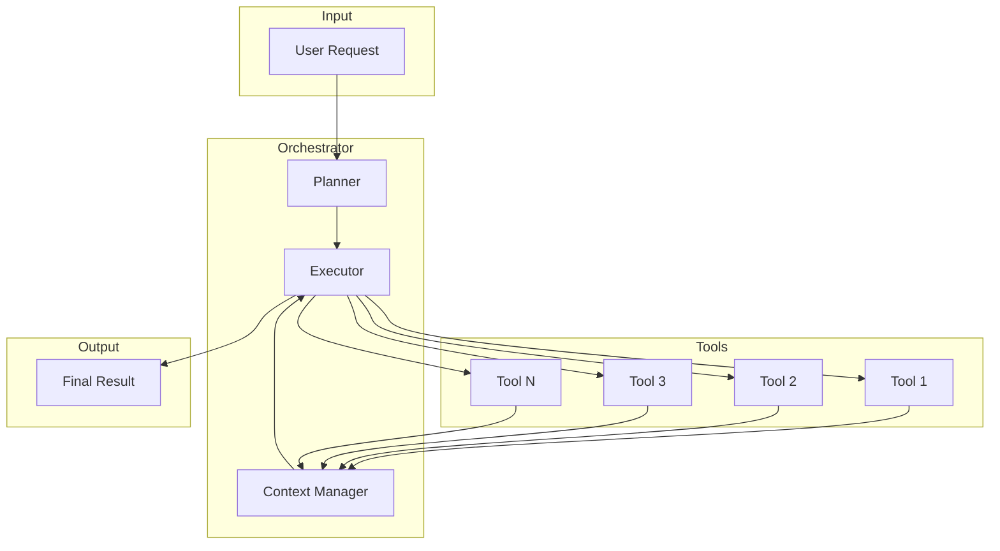
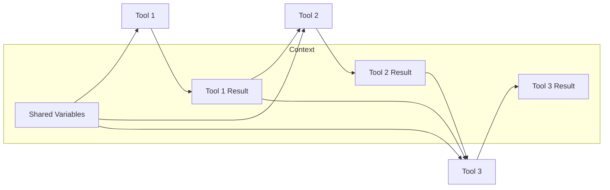
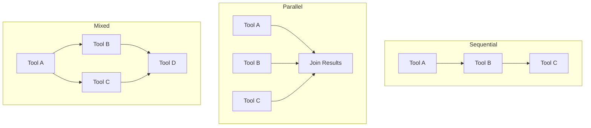

# How to Build Tool Chaining

Author: [nawazdhandala](https://github.com/nawazdhandala)

Tags: AI Agents, LLM, Tools, AI

Description: A practical guide to building tool chaining systems that enable AI agents to accomplish complex multi-step tasks by connecting and orchestrating multiple tools together.

---

> Single tools are useful. Chained tools are powerful. The difference between a helpful AI assistant and a capable AI agent often comes down to how well it can orchestrate multiple tools to accomplish complex goals.

Tool chaining is the practice of connecting multiple tools together so that the output of one tool becomes the input of another. This enables AI agents to break down complex tasks into manageable steps and execute them in sequence or parallel. In this guide, we will explore how to design, implement, and optimize tool chaining systems for AI agents.

---

## Table of Contents

1. What is Tool Chaining?
2. Architecture Overview
3. Designing Chainable Tools
4. Building the Orchestration Layer
5. Context Management
6. Error Handling and Recovery
7. Parallel vs Sequential Execution
8. Real-World Examples
9. Performance Optimization
10. Testing Tool Chains
11. Common Pitfalls
12. Summary

---

## 1. What is Tool Chaining?

Tool chaining is a pattern where multiple tools are executed in a coordinated sequence, with each tool potentially using the results from previous tools. Think of it like a Unix pipeline where you can combine simple commands to perform complex operations.

| Concept | Description |
|---------|-------------|
| Tool | A discrete function that performs a specific action (API call, database query, file operation) |
| Chain | A sequence of tools connected by their inputs and outputs |
| Orchestrator | The component that decides which tools to call and in what order |
| Context | Shared state that flows through the chain, accumulating results |
| Planner | Optional component that breaks down high-level goals into tool sequences |

Simple example: An AI agent asked to "find all production incidents from last week and create a summary report" might chain together:

1. **Query Tool**: Fetch incidents from the monitoring API
2. **Filter Tool**: Filter for production environment only
3. **Analyze Tool**: Extract patterns and common causes
4. **Format Tool**: Generate a markdown report

---

## 2. Architecture Overview

A well-designed tool chaining system has several key components working together.



### Core Components

**Planner**: Takes the user request and breaks it down into a sequence of tool calls. This can be rule-based, LLM-driven, or a hybrid approach.

**Executor**: Runs tools in the correct order, manages dependencies, and handles parallel execution when possible.

**Context Manager**: Maintains shared state across tool executions, storing results that subsequent tools might need.

**Tools**: Individual units of functionality with well-defined inputs and outputs.

---

## 3. Designing Chainable Tools

The key to effective tool chaining is designing tools that work well together. Each tool should be:

- **Single-purpose**: Do one thing well
- **Composable**: Easy to combine with other tools
- **Predictable**: Consistent input/output schemas
- **Stateless**: No hidden side effects that break chains

Here is a TypeScript interface for a chainable tool.

```typescript
// Define the base interface that all chainable tools must implement
// This ensures consistency across your tool ecosystem

interface ToolInput {
  // Tool-specific parameters
  params: Record<string, unknown>;
  // Results from previous tools in the chain
  context: ChainContext;
}

interface ToolOutput {
  // The primary result of this tool
  result: unknown;
  // Metadata about the execution
  metadata: {
    toolName: string;
    executionTime: number;
    success: boolean;
  };
  // Optional data to pass to the next tool
  nextInput?: Record<string, unknown>;
}

interface ChainContext {
  // Accumulated results from previous tools
  results: Map<string, ToolOutput>;
  // Shared variables across the chain
  variables: Record<string, unknown>;
  // The original user request
  originalRequest: string;
}

interface ChainableTool {
  name: string;
  description: string;
  // JSON Schema for input validation
  inputSchema: object;
  // JSON Schema for output validation
  outputSchema: object;
  // The actual execution function
  execute: (input: ToolInput) => Promise<ToolOutput>;
  // Optional: declare dependencies on other tools' outputs
  dependencies?: string[];
}
```

Here is an example of a concrete tool implementation.

```typescript
// A tool that fetches incidents from a monitoring API
// Notice how it reads from context and provides structured output

const fetchIncidentsTool: ChainableTool = {
  name: 'fetch_incidents',
  description: 'Fetches incidents from the monitoring system within a date range',
  inputSchema: {
    type: 'object',
    properties: {
      startDate: { type: 'string', format: 'date-time' },
      endDate: { type: 'string', format: 'date-time' },
      severity: { type: 'string', enum: ['critical', 'high', 'medium', 'low'] }
    },
    required: ['startDate', 'endDate']
  },
  outputSchema: {
    type: 'object',
    properties: {
      incidents: {
        type: 'array',
        items: {
          type: 'object',
          properties: {
            id: { type: 'string' },
            title: { type: 'string' },
            severity: { type: 'string' },
            createdAt: { type: 'string' },
            resolvedAt: { type: 'string' }
          }
        }
      },
      totalCount: { type: 'number' }
    }
  },

  async execute(input: ToolInput): Promise<ToolOutput> {
    const startTime = Date.now();
    const { startDate, endDate, severity } = input.params;

    try {
      // Call your monitoring API
      const response = await monitoringApi.getIncidents({
        startDate,
        endDate,
        severity
      });

      return {
        result: {
          incidents: response.incidents,
          totalCount: response.incidents.length
        },
        metadata: {
          toolName: 'fetch_incidents',
          executionTime: Date.now() - startTime,
          success: true
        },
        // Provide hints for the next tool
        nextInput: {
          incidentIds: response.incidents.map(i => i.id)
        }
      };
    } catch (error) {
      return {
        result: { incidents: [], totalCount: 0 },
        metadata: {
          toolName: 'fetch_incidents',
          executionTime: Date.now() - startTime,
          success: false
        }
      };
    }
  }
};
```

---

## 4. Building the Orchestration Layer

The orchestrator is the brain of your tool chaining system. It decides which tools to call, in what order, and how to handle the flow of data between them.

```typescript
// The orchestrator manages the execution of tool chains
// It handles planning, execution, and context management

class ToolChainOrchestrator {
  private tools: Map<string, ChainableTool>;
  private context: ChainContext;

  constructor() {
    this.tools = new Map();
    this.context = {
      results: new Map(),
      variables: {},
      originalRequest: ''
    };
  }

  // Register a tool with the orchestrator
  registerTool(tool: ChainableTool): void {
    this.tools.set(tool.name, tool);
  }

  // Execute a chain of tools based on a plan
  async executeChain(plan: ExecutionPlan): Promise<ChainResult> {
    const results: ToolOutput[] = [];

    for (const step of plan.steps) {
      const tool = this.tools.get(step.toolName);

      if (!tool) {
        throw new Error(`Tool not found: ${step.toolName}`);
      }

      // Check if dependencies are satisfied
      if (tool.dependencies) {
        for (const dep of tool.dependencies) {
          if (!this.context.results.has(dep)) {
            throw new Error(`Dependency not satisfied: ${dep}`);
          }
        }
      }

      // Build the input from step params and context
      const input: ToolInput = {
        params: this.resolveParams(step.params),
        context: this.context
      };

      // Execute the tool
      const output = await tool.execute(input);

      // Store the result in context for subsequent tools
      this.context.results.set(tool.name, output);
      results.push(output);

      // Update shared variables if the tool provided nextInput
      if (output.nextInput) {
        this.context.variables = {
          ...this.context.variables,
          ...output.nextInput
        };
      }

      // Stop the chain if a tool fails and stopOnFailure is set
      if (!output.metadata.success && step.stopOnFailure) {
        break;
      }
    }

    return {
      success: results.every(r => r.metadata.success),
      results,
      context: this.context
    };
  }

  // Resolve parameter references like ${previousTool.result.field}
  private resolveParams(params: Record<string, unknown>): Record<string, unknown> {
    const resolved: Record<string, unknown> = {};

    for (const [key, value] of Object.entries(params)) {
      if (typeof value === 'string' && value.startsWith('${')) {
        resolved[key] = this.resolveReference(value);
      } else {
        resolved[key] = value;
      }
    }

    return resolved;
  }

  // Parse and resolve references to previous tool outputs
  private resolveReference(ref: string): unknown {
    // Format: ${toolName.result.path.to.value}
    const match = ref.match(/\$\{(\w+)\.result\.(.+)\}/);

    if (!match) {
      return ref;
    }

    const [, toolName, path] = match;
    const toolOutput = this.context.results.get(toolName);

    if (!toolOutput) {
      throw new Error(`Cannot resolve reference: tool ${toolName} not in context`);
    }

    // Navigate the path to get the value
    return this.getNestedValue(toolOutput.result, path);
  }

  private getNestedValue(obj: unknown, path: string): unknown {
    return path.split('.').reduce((current, key) => {
      return (current as Record<string, unknown>)?.[key];
    }, obj);
  }
}
```

---

## 5. Context Management

Context is the glue that holds tool chains together. It stores results from previous tools and makes them available to subsequent ones.



Here is a more sophisticated context manager.

```typescript
// The context manager handles data flow between tools
// It supports scoped access, transformations, and cleanup

class ChainContextManager {
  private store: Map<string, unknown>;
  private history: Array<{ timestamp: number; toolName: string; action: string }>;

  constructor() {
    this.store = new Map();
    this.history = [];
  }

  // Store a tool's output with a namespaced key
  set(toolName: string, key: string, value: unknown): void {
    const fullKey = `${toolName}:${key}`;
    this.store.set(fullKey, value);
    this.history.push({
      timestamp: Date.now(),
      toolName,
      action: `set:${key}`
    });
  }

  // Get a value from a specific tool's namespace
  get<T>(toolName: string, key: string): T | undefined {
    const fullKey = `${toolName}:${key}`;
    return this.store.get(fullKey) as T | undefined;
  }

  // Get all outputs from a specific tool
  getToolOutputs(toolName: string): Record<string, unknown> {
    const outputs: Record<string, unknown> = {};

    for (const [key, value] of this.store.entries()) {
      if (key.startsWith(`${toolName}:`)) {
        const shortKey = key.replace(`${toolName}:`, '');
        outputs[shortKey] = value;
      }
    }

    return outputs;
  }

  // Apply a transformation to a stored value
  transform<T, R>(
    toolName: string,
    key: string,
    transformer: (value: T) => R
  ): R | undefined {
    const value = this.get<T>(toolName, key);

    if (value === undefined) {
      return undefined;
    }

    return transformer(value);
  }

  // Create a snapshot for rollback purposes
  snapshot(): Map<string, unknown> {
    return new Map(this.store);
  }

  // Restore from a snapshot
  restore(snapshot: Map<string, unknown>): void {
    this.store = new Map(snapshot);
  }

  // Clear context for a fresh chain execution
  clear(): void {
    this.store.clear();
    this.history = [];
  }
}
```

---

## 6. Error Handling and Recovery

Robust error handling is critical for tool chains. When one tool fails, you need strategies to recover gracefully.

```typescript
// Error handling strategies for tool chains
// These patterns help build resilient multi-tool workflows

interface RetryConfig {
  maxAttempts: number;
  backoffMs: number;
  backoffMultiplier: number;
}

interface FallbackConfig {
  fallbackToolName: string;
  fallbackParams: Record<string, unknown>;
}

class ResilientToolExecutor {
  private orchestrator: ToolChainOrchestrator;

  constructor(orchestrator: ToolChainOrchestrator) {
    this.orchestrator = orchestrator;
  }

  // Execute a tool with automatic retry on failure
  async executeWithRetry(
    tool: ChainableTool,
    input: ToolInput,
    config: RetryConfig
  ): Promise<ToolOutput> {
    let lastError: Error | null = null;
    let backoffMs = config.backoffMs;

    for (let attempt = 1; attempt <= config.maxAttempts; attempt++) {
      try {
        const output = await tool.execute(input);

        if (output.metadata.success) {
          return output;
        }

        // Tool returned failure, treat as retryable
        lastError = new Error(`Tool ${tool.name} returned failure`);
      } catch (error) {
        lastError = error as Error;
      }

      // Don't wait after the last attempt
      if (attempt < config.maxAttempts) {
        await this.sleep(backoffMs);
        backoffMs *= config.backoffMultiplier;
      }
    }

    throw new Error(
      `Tool ${tool.name} failed after ${config.maxAttempts} attempts: ${lastError?.message}`
    );
  }

  // Execute with a fallback tool if the primary fails
  async executeWithFallback(
    primaryTool: ChainableTool,
    input: ToolInput,
    fallback: FallbackConfig
  ): Promise<ToolOutput> {
    try {
      const output = await primaryTool.execute(input);

      if (output.metadata.success) {
        return output;
      }
    } catch (error) {
      // Primary tool threw, try fallback
    }

    // Execute fallback tool
    const fallbackTool = this.orchestrator.tools.get(fallback.fallbackToolName);

    if (!fallbackTool) {
      throw new Error(`Fallback tool not found: ${fallback.fallbackToolName}`);
    }

    return fallbackTool.execute({
      params: fallback.fallbackParams,
      context: input.context
    });
  }

  // Execute a chain with checkpointing for recovery
  async executeWithCheckpoints(
    plan: ExecutionPlan,
    checkpointCallback: (step: number, context: ChainContext) => Promise<void>
  ): Promise<ChainResult> {
    const contextManager = new ChainContextManager();

    for (let i = 0; i < plan.steps.length; i++) {
      const step = plan.steps[i];

      // Save checkpoint before each step
      await checkpointCallback(i, {
        results: contextManager.snapshot() as any,
        variables: {},
        originalRequest: plan.originalRequest
      });

      // Execute the step
      // ... execution logic
    }

    return { success: true, results: [], context: null as any };
  }

  private sleep(ms: number): Promise<void> {
    return new Promise(resolve => setTimeout(resolve, ms));
  }
}
```

Here is a pattern for handling partial failures in chains.

```typescript
// Handle partial failures gracefully
// Continue the chain with degraded functionality when possible

interface PartialResult {
  completedSteps: string[];
  failedSteps: Array<{ name: string; error: string }>;
  partialOutput: unknown;
}

async function executeWithPartialFailureHandling(
  plan: ExecutionPlan,
  orchestrator: ToolChainOrchestrator
): Promise<PartialResult> {
  const completedSteps: string[] = [];
  const failedSteps: Array<{ name: string; error: string }> = [];
  let partialOutput: unknown = null;

  for (const step of plan.steps) {
    try {
      const result = await orchestrator.executeSingleStep(step);

      if (result.metadata.success) {
        completedSteps.push(step.toolName);
        partialOutput = result.result;
      } else {
        // Tool executed but returned failure status
        if (step.optional) {
          // Optional step - continue without it
          failedSteps.push({
            name: step.toolName,
            error: 'Tool returned failure (optional step skipped)'
          });
        } else {
          // Required step - stop the chain
          failedSteps.push({
            name: step.toolName,
            error: 'Required tool failed'
          });
          break;
        }
      }
    } catch (error) {
      failedSteps.push({
        name: step.toolName,
        error: (error as Error).message
      });

      if (!step.optional) {
        break;
      }
    }
  }

  return { completedSteps, failedSteps, partialOutput };
}
```

---

## 7. Parallel vs Sequential Execution

Not all tool chains need to be sequential. When tools are independent, running them in parallel can significantly improve performance.



Here is how to build a dependency-aware executor.

```typescript
// Execute tools based on their dependencies
// Independent tools run in parallel, dependent ones wait

interface DependencyGraph {
  nodes: Map<string, { tool: ChainableTool; dependencies: string[] }>;
}

class ParallelToolExecutor {
  private orchestrator: ToolChainOrchestrator;

  constructor(orchestrator: ToolChainOrchestrator) {
    this.orchestrator = orchestrator;
  }

  // Build a dependency graph from the execution plan
  buildDependencyGraph(plan: ExecutionPlan): DependencyGraph {
    const graph: DependencyGraph = { nodes: new Map() };

    for (const step of plan.steps) {
      const tool = this.orchestrator.tools.get(step.toolName);

      if (tool) {
        graph.nodes.set(step.toolName, {
          tool,
          dependencies: tool.dependencies || []
        });
      }
    }

    return graph;
  }

  // Execute the graph with maximum parallelism
  async executeGraph(graph: DependencyGraph): Promise<Map<string, ToolOutput>> {
    const results = new Map<string, ToolOutput>();
    const pending = new Set(graph.nodes.keys());
    const inProgress = new Set<string>();

    while (pending.size > 0) {
      // Find all tools whose dependencies are satisfied
      const ready: string[] = [];

      for (const toolName of pending) {
        const node = graph.nodes.get(toolName)!;
        const dependenciesMet = node.dependencies.every(
          dep => results.has(dep)
        );

        if (dependenciesMet && !inProgress.has(toolName)) {
          ready.push(toolName);
        }
      }

      if (ready.length === 0 && inProgress.size === 0) {
        // No progress possible - circular dependency or missing tool
        throw new Error(
          `Cannot resolve dependencies for: ${Array.from(pending).join(', ')}`
        );
      }

      // Execute all ready tools in parallel
      const executions = ready.map(async toolName => {
        inProgress.add(toolName);
        pending.delete(toolName);

        const node = graph.nodes.get(toolName)!;
        const input = this.buildInputFromResults(node, results);

        try {
          const output = await node.tool.execute(input);
          results.set(toolName, output);
        } finally {
          inProgress.delete(toolName);
        }
      });

      // Wait for at least one to complete before checking for more ready tools
      if (executions.length > 0) {
        await Promise.race(executions);
      }

      // Also wait for all current executions to avoid race conditions
      await Promise.all(executions);
    }

    return results;
  }

  private buildInputFromResults(
    node: { tool: ChainableTool; dependencies: string[] },
    results: Map<string, ToolOutput>
  ): ToolInput {
    const context: ChainContext = {
      results,
      variables: {},
      originalRequest: ''
    };

    // Gather outputs from dependencies into params
    const params: Record<string, unknown> = {};

    for (const dep of node.dependencies) {
      const depResult = results.get(dep);
      if (depResult) {
        params[`${dep}_result`] = depResult.result;
      }
    }

    return { params, context };
  }
}
```

---

## 8. Real-World Examples

Let us look at some practical tool chaining scenarios.

### Example 1: Incident Analysis Pipeline

This chain analyzes recent incidents to identify patterns.

```typescript
// A complete incident analysis chain
// Demonstrates data flow from collection through analysis to reporting

const incidentAnalysisPlan: ExecutionPlan = {
  originalRequest: 'Analyze production incidents from last week',
  steps: [
    {
      toolName: 'fetch_incidents',
      params: {
        startDate: '${date.weekAgo}',
        endDate: '${date.now}',
        environment: 'production'
      },
      stopOnFailure: true
    },
    {
      toolName: 'categorize_incidents',
      params: {
        incidents: '${fetch_incidents.result.incidents}'
      },
      stopOnFailure: false
    },
    {
      toolName: 'extract_patterns',
      params: {
        categorizedIncidents: '${categorize_incidents.result.categories}'
      }
    },
    {
      toolName: 'generate_report',
      params: {
        patterns: '${extract_patterns.result.patterns}',
        incidents: '${fetch_incidents.result.incidents}',
        format: 'markdown'
      }
    }
  ]
};

// Individual tool implementations

const categorizeIncidentsTool: ChainableTool = {
  name: 'categorize_incidents',
  description: 'Groups incidents by type, severity, and affected service',
  inputSchema: { /* ... */ },
  outputSchema: { /* ... */ },
  dependencies: ['fetch_incidents'],

  async execute(input: ToolInput): Promise<ToolOutput> {
    const incidents = input.params.incidents as Incident[];

    const categories = {
      byType: new Map<string, Incident[]>(),
      bySeverity: new Map<string, Incident[]>(),
      byService: new Map<string, Incident[]>()
    };

    for (const incident of incidents) {
      // Group by type
      const typeList = categories.byType.get(incident.type) || [];
      typeList.push(incident);
      categories.byType.set(incident.type, typeList);

      // Group by severity
      const severityList = categories.bySeverity.get(incident.severity) || [];
      severityList.push(incident);
      categories.bySeverity.set(incident.severity, severityList);

      // Group by service
      const serviceList = categories.byService.get(incident.service) || [];
      serviceList.push(incident);
      categories.byService.set(incident.service, serviceList);
    }

    return {
      result: { categories },
      metadata: {
        toolName: 'categorize_incidents',
        executionTime: 0,
        success: true
      }
    };
  }
};
```

### Example 2: Automated Deployment Verification

This chain verifies a deployment is healthy.

```typescript
// Deployment verification chain
// Runs multiple checks in parallel after a deployment

const deploymentVerificationPlan: ExecutionPlan = {
  originalRequest: 'Verify deployment to production',
  steps: [
    // These three can run in parallel - no dependencies between them
    {
      toolName: 'check_health_endpoints',
      params: {
        services: ['api', 'web', 'worker'],
        environment: 'production'
      }
    },
    {
      toolName: 'check_error_rates',
      params: {
        threshold: 0.01,
        windowMinutes: 5
      }
    },
    {
      toolName: 'check_latency',
      params: {
        p99ThresholdMs: 500,
        windowMinutes: 5
      }
    },
    // This depends on the above three
    {
      toolName: 'aggregate_verification',
      params: {
        healthResults: '${check_health_endpoints.result}',
        errorResults: '${check_error_rates.result}',
        latencyResults: '${check_latency.result}'
      },
      dependencies: ['check_health_endpoints', 'check_error_rates', 'check_latency']
    },
    // Conditional rollback based on verification
    {
      toolName: 'decide_rollback',
      params: {
        verificationPassed: '${aggregate_verification.result.passed}'
      }
    }
  ]
};
```

### Example 3: Customer Support Automation

This chain handles customer support tickets.

```typescript
// Support ticket processing chain
// Demonstrates LLM integration for classification and response drafting

const supportTicketPlan: ExecutionPlan = {
  originalRequest: 'Process incoming support ticket',
  steps: [
    {
      toolName: 'parse_ticket',
      params: {
        rawText: '${input.ticketBody}',
        attachments: '${input.attachments}'
      }
    },
    {
      toolName: 'classify_intent',
      params: {
        parsedContent: '${parse_ticket.result.content}',
        categories: ['billing', 'technical', 'feature_request', 'complaint']
      }
    },
    {
      toolName: 'search_knowledge_base',
      params: {
        query: '${parse_ticket.result.content}',
        category: '${classify_intent.result.category}'
      }
    },
    {
      toolName: 'draft_response',
      params: {
        ticketContent: '${parse_ticket.result.content}',
        category: '${classify_intent.result.category}',
        relevantArticles: '${search_knowledge_base.result.articles}'
      }
    },
    {
      toolName: 'route_ticket',
      params: {
        category: '${classify_intent.result.category}',
        priority: '${classify_intent.result.priority}',
        draftResponse: '${draft_response.result.response}'
      }
    }
  ]
};
```

---

## 9. Performance Optimization

Optimizing tool chains involves several strategies.

### Caching Tool Results

```typescript
// Cache tool results to avoid redundant executions
// Useful when the same tool is called with identical parameters

class CachingToolExecutor {
  private cache: Map<string, { result: ToolOutput; expiry: number }>;
  private defaultTtlMs: number;

  constructor(defaultTtlMs: number = 60000) {
    this.cache = new Map();
    this.defaultTtlMs = defaultTtlMs;
  }

  // Generate a cache key from tool name and parameters
  private generateCacheKey(toolName: string, params: Record<string, unknown>): string {
    const paramsHash = JSON.stringify(params, Object.keys(params).sort());
    return `${toolName}:${paramsHash}`;
  }

  async executeWithCache(
    tool: ChainableTool,
    input: ToolInput,
    ttlMs?: number
  ): Promise<ToolOutput> {
    const cacheKey = this.generateCacheKey(tool.name, input.params);
    const cached = this.cache.get(cacheKey);

    // Return cached result if valid
    if (cached && cached.expiry > Date.now()) {
      return {
        ...cached.result,
        metadata: {
          ...cached.result.metadata,
          cached: true
        }
      };
    }

    // Execute and cache
    const result = await tool.execute(input);

    if (result.metadata.success) {
      this.cache.set(cacheKey, {
        result,
        expiry: Date.now() + (ttlMs || this.defaultTtlMs)
      });
    }

    return result;
  }

  // Invalidate cache for a specific tool
  invalidate(toolName: string): void {
    for (const key of this.cache.keys()) {
      if (key.startsWith(`${toolName}:`)) {
        this.cache.delete(key);
      }
    }
  }
}
```

### Lazy Evaluation

```typescript
// Only execute tools when their results are actually needed
// Useful for conditional chains where some branches may not be taken

class LazyToolChain {
  private pendingExecutions: Map<string, () => Promise<ToolOutput>>;
  private results: Map<string, ToolOutput>;

  constructor() {
    this.pendingExecutions = new Map();
    this.results = new Map();
  }

  // Register a tool for lazy execution
  register(toolName: string, executor: () => Promise<ToolOutput>): void {
    this.pendingExecutions.set(toolName, executor);
  }

  // Get a result, executing only if not already done
  async get(toolName: string): Promise<ToolOutput> {
    // Return cached result if available
    if (this.results.has(toolName)) {
      return this.results.get(toolName)!;
    }

    // Execute if we have a pending execution
    const executor = this.pendingExecutions.get(toolName);

    if (!executor) {
      throw new Error(`No executor registered for tool: ${toolName}`);
    }

    const result = await executor();
    this.results.set(toolName, result);
    this.pendingExecutions.delete(toolName);

    return result;
  }
}
```

---

## 10. Testing Tool Chains

Testing tool chains requires testing individual tools and their interactions.

```typescript
// Testing utilities for tool chains
// Includes mocking, verification, and integration test helpers

class ToolChainTestHarness {
  private mocks: Map<string, ToolOutput>;
  private callLog: Array<{ toolName: string; input: ToolInput }>;

  constructor() {
    this.mocks = new Map();
    this.callLog = [];
  }

  // Register a mock response for a tool
  mockTool(toolName: string, response: ToolOutput): void {
    this.mocks.set(toolName, response);
  }

  // Create a mock tool that returns the registered response
  createMockTool(toolName: string): ChainableTool {
    return {
      name: toolName,
      description: `Mock tool: ${toolName}`,
      inputSchema: {},
      outputSchema: {},
      execute: async (input: ToolInput) => {
        this.callLog.push({ toolName, input });

        const mockResponse = this.mocks.get(toolName);

        if (!mockResponse) {
          throw new Error(`No mock registered for tool: ${toolName}`);
        }

        return mockResponse;
      }
    };
  }

  // Verify that tools were called in the expected order
  verifyCallOrder(expectedOrder: string[]): boolean {
    if (this.callLog.length !== expectedOrder.length) {
      return false;
    }

    return expectedOrder.every(
      (toolName, index) => this.callLog[index].toolName === toolName
    );
  }

  // Get the input that was passed to a specific tool call
  getCallInput(toolName: string, callIndex: number = 0): ToolInput | undefined {
    const calls = this.callLog.filter(c => c.toolName === toolName);
    return calls[callIndex]?.input;
  }

  // Reset the test harness
  reset(): void {
    this.mocks.clear();
    this.callLog = [];
  }
}

// Example test using the harness
async function testIncidentAnalysisChain(): Promise<void> {
  const harness = new ToolChainTestHarness();

  // Set up mocks
  harness.mockTool('fetch_incidents', {
    result: {
      incidents: [
        { id: '1', title: 'DB Timeout', severity: 'high' },
        { id: '2', title: 'API Error', severity: 'medium' }
      ]
    },
    metadata: { toolName: 'fetch_incidents', executionTime: 100, success: true }
  });

  harness.mockTool('categorize_incidents', {
    result: {
      categories: {
        bySeverity: { high: 1, medium: 1 }
      }
    },
    metadata: { toolName: 'categorize_incidents', executionTime: 50, success: true }
  });

  // Create orchestrator with mock tools
  const orchestrator = new ToolChainOrchestrator();
  orchestrator.registerTool(harness.createMockTool('fetch_incidents'));
  orchestrator.registerTool(harness.createMockTool('categorize_incidents'));

  // Execute chain
  const result = await orchestrator.executeChain(incidentAnalysisPlan);

  // Verify
  console.assert(result.success, 'Chain should succeed');
  console.assert(
    harness.verifyCallOrder(['fetch_incidents', 'categorize_incidents']),
    'Tools should be called in correct order'
  );
}
```

---

## 11. Common Pitfalls

Here are mistakes to avoid when building tool chains.

| Pitfall | Problem | Solution |
|---------|---------|----------|
| Tight coupling | Tools depend on implementation details of other tools | Use well-defined interfaces and schemas |
| Missing error handling | One tool failure crashes the entire chain | Implement retry, fallback, and partial failure handling |
| Circular dependencies | Tool A needs B, B needs A | Validate dependency graph before execution |
| Context bloat | Storing too much data in context | Clean up intermediate results, use references |
| Sequential everything | Running independent tools one at a time | Build dependency graph and parallelize |
| No observability | Cannot debug failed chains | Add logging, tracing, and metrics to each tool |
| Hardcoded parameters | Cannot reuse chains for different inputs | Use parameter resolution and templates |

### Anti-pattern: Monolithic Tool

```typescript
// BAD: One tool that does everything
const badTool: ChainableTool = {
  name: 'do_everything',
  async execute(input) {
    // Fetches data, processes it, formats it, and sends notifications
    // Hard to test, reuse, or compose
  }
};

// GOOD: Separate tools that chain together
const fetchTool: ChainableTool = { /* fetches data */ };
const processTool: ChainableTool = { /* processes data */ };
const formatTool: ChainableTool = { /* formats output */ };
const notifyTool: ChainableTool = { /* sends notifications */ };
```

### Anti-pattern: Implicit Dependencies

```typescript
// BAD: Tool reads from global state
let globalIncidents: Incident[] = [];

const badProcessTool: ChainableTool = {
  async execute(input) {
    // Where does globalIncidents come from? When is it set?
    return processIncidents(globalIncidents);
  }
};

// GOOD: Explicit input from context
const goodProcessTool: ChainableTool = {
  dependencies: ['fetch_incidents'],
  async execute(input) {
    const incidents = input.context.results.get('fetch_incidents')?.result;
    return processIncidents(incidents);
  }
};
```

---

## 12. Summary

Tool chaining is a powerful pattern for building capable AI agents. The key principles are:

| Principle | Description |
|-----------|-------------|
| Single responsibility | Each tool does one thing well |
| Explicit dependencies | Tools declare what they need from other tools |
| Structured data flow | Well-defined schemas for inputs and outputs |
| Graceful degradation | Handle failures without crashing the entire chain |
| Observability | Log, trace, and monitor every tool execution |
| Testability | Mock tools and verify interactions in isolation |

When building tool chains:

1. Start with clear tool boundaries and interfaces
2. Build the orchestration layer to manage execution flow
3. Implement robust context management for data sharing
4. Add error handling with retry and fallback strategies
5. Optimize with caching and parallel execution where possible
6. Test both individual tools and their interactions

Tool chaining transforms simple AI assistants into powerful agents capable of tackling complex, multi-step problems. The investment in good architecture pays dividends as your tool ecosystem grows.

---

*Ready to build AI agents that chain tools for complex automation? Check out [OneUptime's MCP Server](https://github.com/oneuptime/oneuptime/tree/master/MCP) for production-ready tool implementations you can use as building blocks.*

---

### Related Reading

- [Introducing OneUptime MCP Server: Bringing AI-Native Observability to Your Workflow](https://oneuptime.com/blog/post/2025-07-01-oneuptime-mcp-server-ai-observability/view)
- [What are Traces and Spans in OpenTelemetry: A Practical Guide](https://oneuptime.com/blog/post/2025-08-27-traces-and-spans-in-opentelemetry/view)
