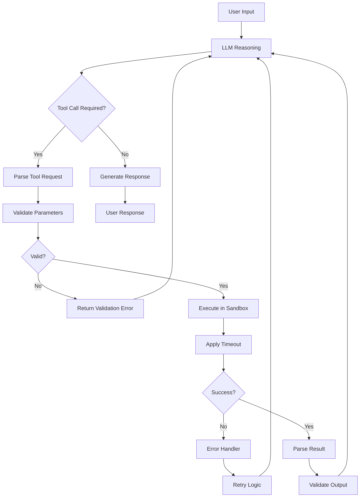
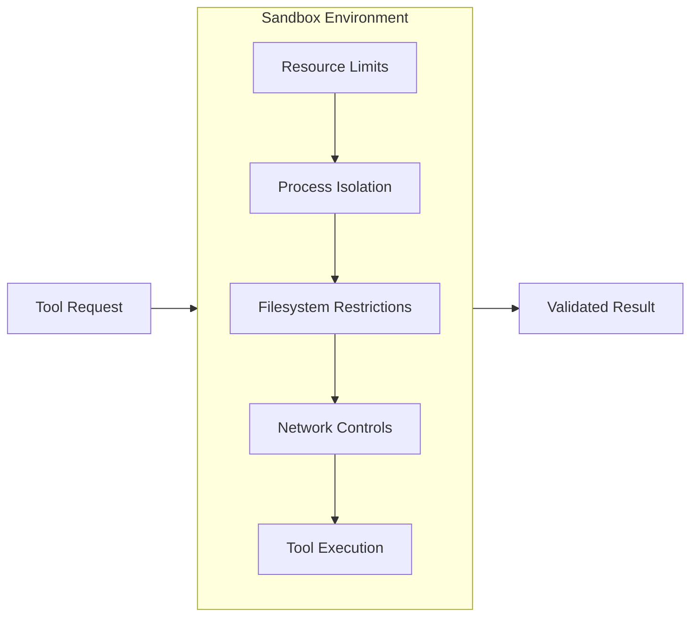
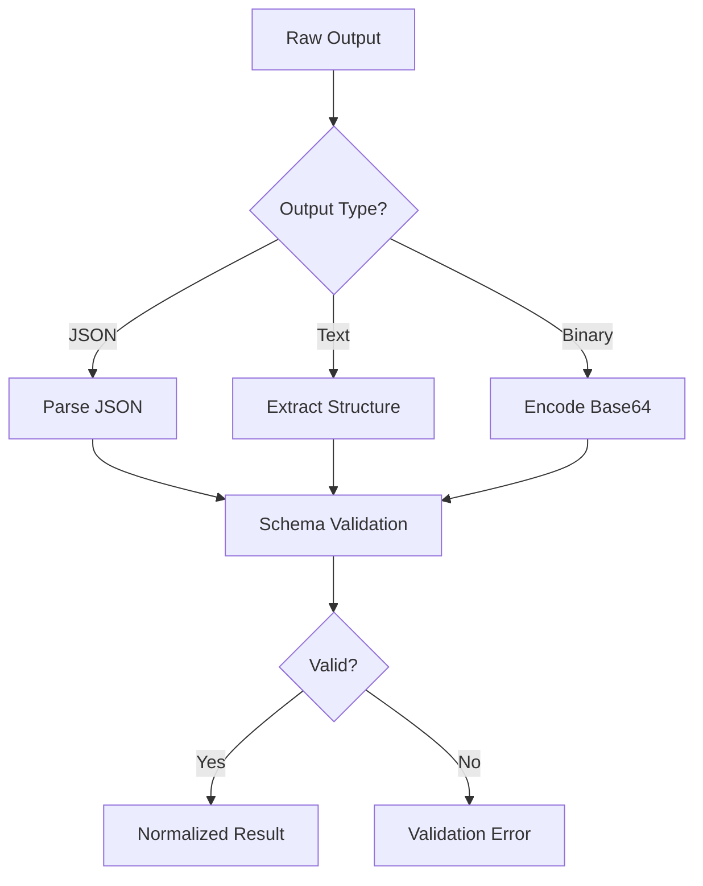
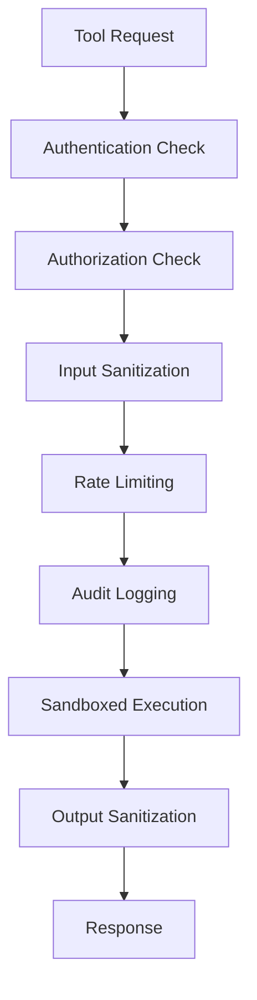

# How to Implement Tool Execution

Author: [nawazdhandala](https://github.com/nawazdhandala)

Tags: AI Agents, Tool Execution, LLM, API Integration

Description: Learn to implement secure tool execution for AI agents with sandboxing, timeout handling, result validation, and error recovery strategies.

---

Tool execution is the bridge between an AI agent's reasoning capabilities and real-world actions. While Large Language Models (LLMs) excel at understanding and generating text, they need a robust execution layer to interact with external systems, run code, query databases, and perform meaningful tasks. This guide walks you through building a production-ready tool execution system for AI agents.

## Understanding the Tool Execution Pipeline

Before diving into implementation, let's understand how tool execution fits into an AI agent's architecture.



The pipeline consists of several key stages:

1. **Request Parsing** - Extract tool name and parameters from the LLM output
2. **Validation** - Ensure parameters match the expected schema
3. **Sandboxed Execution** - Run the tool in an isolated environment
4. **Timeout Management** - Prevent runaway processes
5. **Result Parsing** - Transform raw output into structured data
6. **Error Handling** - Gracefully manage failures and retries

## Defining Tool Schemas

A well-defined schema is the foundation of reliable tool execution. Here's how to define tools using JSON Schema:

```python
from typing import Any, Callable, Dict, List, Optional
from dataclasses import dataclass, field
from enum import Enum
import json

class ParameterType(Enum):
    STRING = "string"
    INTEGER = "integer"
    NUMBER = "number"
    BOOLEAN = "boolean"
    ARRAY = "array"
    OBJECT = "object"

@dataclass
class ToolParameter:
    name: str
    param_type: ParameterType
    description: str
    required: bool = True
    default: Any = None
    enum_values: Optional[List[Any]] = None

@dataclass
class Tool:
    name: str
    description: str
    parameters: List[ToolParameter]
    handler: Callable
    timeout_seconds: int = 30
    requires_confirmation: bool = False

    def to_schema(self) -> Dict[str, Any]:
        """Convert tool definition to JSON Schema format."""
        properties = {}
        required = []

        for param in self.parameters:
            prop = {
                "type": param.param_type.value,
                "description": param.description
            }
            if param.enum_values:
                prop["enum"] = param.enum_values
            if param.default is not None:
                prop["default"] = param.default

            properties[param.name] = prop
            if param.required:
                required.append(param.name)

        return {
            "type": "function",
            "function": {
                "name": self.name,
                "description": self.description,
                "parameters": {
                    "type": "object",
                    "properties": properties,
                    "required": required
                }
            }
        }
```

This schema definition allows you to:
- Define parameter types with validation constraints
- Specify required vs optional parameters with defaults
- Include human-readable descriptions for the LLM
- Mark dangerous tools that need user confirmation

## Building the Tool Registry

The tool registry manages all available tools and provides lookup capabilities:

```python
from typing import Dict, List, Optional
import logging

logger = logging.getLogger(__name__)

class ToolRegistry:
    def __init__(self):
        self._tools: Dict[str, Tool] = {}
        self._categories: Dict[str, List[str]] = {}

    def register(self, tool: Tool, category: str = "general") -> None:
        """Register a tool with the registry."""
        if tool.name in self._tools:
            logger.warning(f"Overwriting existing tool: {tool.name}")

        self._tools[tool.name] = tool

        if category not in self._categories:
            self._categories[category] = []
        self._categories[category].append(tool.name)

        logger.info(f"Registered tool: {tool.name} in category: {category}")

    def get(self, name: str) -> Optional[Tool]:
        """Retrieve a tool by name."""
        return self._tools.get(name)

    def get_by_category(self, category: str) -> List[Tool]:
        """Get all tools in a category."""
        tool_names = self._categories.get(category, [])
        return [self._tools[name] for name in tool_names]

    def get_all_schemas(self) -> List[Dict[str, Any]]:
        """Get schemas for all registered tools."""
        return [tool.to_schema() for tool in self._tools.values()]

    def list_tools(self) -> List[str]:
        """List all registered tool names."""
        return list(self._tools.keys())
```

## Implementing the Execution Engine

The execution engine is the core component that handles tool invocation:

```python
import asyncio
import traceback
from dataclasses import dataclass
from typing import Any, Dict, Optional
from datetime import datetime
from enum import Enum

class ExecutionStatus(Enum):
    SUCCESS = "success"
    ERROR = "error"
    TIMEOUT = "timeout"
    VALIDATION_ERROR = "validation_error"
    PERMISSION_DENIED = "permission_denied"

@dataclass
class ExecutionResult:
    status: ExecutionStatus
    output: Any
    error_message: Optional[str] = None
    execution_time_ms: float = 0
    tool_name: str = ""
    timestamp: datetime = field(default_factory=datetime.now)

    def to_dict(self) -> Dict[str, Any]:
        return {
            "status": self.status.value,
            "output": self.output,
            "error_message": self.error_message,
            "execution_time_ms": self.execution_time_ms,
            "tool_name": self.tool_name,
            "timestamp": self.timestamp.isoformat()
        }

class ToolExecutor:
    def __init__(self, registry: ToolRegistry):
        self.registry = registry
        self.execution_history: List[ExecutionResult] = []

    async def execute(
        self,
        tool_name: str,
        parameters: Dict[str, Any],
        timeout_override: Optional[int] = None
    ) -> ExecutionResult:
        """Execute a tool with the given parameters."""
        start_time = datetime.now()

        # Retrieve the tool
        tool = self.registry.get(tool_name)
        if not tool:
            return ExecutionResult(
                status=ExecutionStatus.ERROR,
                output=None,
                error_message=f"Unknown tool: {tool_name}",
                tool_name=tool_name
            )

        # Validate parameters
        validation_error = self._validate_parameters(tool, parameters)
        if validation_error:
            return ExecutionResult(
                status=ExecutionStatus.VALIDATION_ERROR,
                output=None,
                error_message=validation_error,
                tool_name=tool_name
            )

        # Determine timeout
        timeout = timeout_override or tool.timeout_seconds

        try:
            # Execute with timeout
            result = await asyncio.wait_for(
                self._execute_handler(tool, parameters),
                timeout=timeout
            )

            execution_time = (datetime.now() - start_time).total_seconds() * 1000

            exec_result = ExecutionResult(
                status=ExecutionStatus.SUCCESS,
                output=result,
                execution_time_ms=execution_time,
                tool_name=tool_name
            )

        except asyncio.TimeoutError:
            exec_result = ExecutionResult(
                status=ExecutionStatus.TIMEOUT,
                output=None,
                error_message=f"Tool execution timed out after {timeout} seconds",
                tool_name=tool_name
            )

        except Exception as e:
            exec_result = ExecutionResult(
                status=ExecutionStatus.ERROR,
                output=None,
                error_message=f"{type(e).__name__}: {str(e)}\n{traceback.format_exc()}",
                tool_name=tool_name
            )

        self.execution_history.append(exec_result)
        return exec_result

    def _validate_parameters(
        self,
        tool: Tool,
        parameters: Dict[str, Any]
    ) -> Optional[str]:
        """Validate parameters against tool schema."""
        for param in tool.parameters:
            if param.required and param.name not in parameters:
                return f"Missing required parameter: {param.name}"

            if param.name in parameters:
                value = parameters[param.name]
                if not self._check_type(value, param.param_type):
                    return f"Invalid type for {param.name}: expected {param.param_type.value}"

                if param.enum_values and value not in param.enum_values:
                    return f"Invalid value for {param.name}: must be one of {param.enum_values}"

        return None

    def _check_type(self, value: Any, expected_type: ParameterType) -> bool:
        """Check if value matches expected type."""
        type_mapping = {
            ParameterType.STRING: str,
            ParameterType.INTEGER: int,
            ParameterType.NUMBER: (int, float),
            ParameterType.BOOLEAN: bool,
            ParameterType.ARRAY: list,
            ParameterType.OBJECT: dict,
        }
        return isinstance(value, type_mapping[expected_type])

    async def _execute_handler(
        self,
        tool: Tool,
        parameters: Dict[str, Any]
    ) -> Any:
        """Execute the tool handler."""
        if asyncio.iscoroutinefunction(tool.handler):
            return await tool.handler(**parameters)
        else:
            # Run sync handlers in thread pool
            loop = asyncio.get_event_loop()
            return await loop.run_in_executor(
                None,
                lambda: tool.handler(**parameters)
            )
```

## Implementing Sandboxing

Sandboxing isolates tool execution to prevent security breaches and resource exhaustion. Here's a multi-layered approach:



```python
import subprocess
import resource
import os
import tempfile
from typing import Any, Dict, Optional, List
from contextlib import contextmanager

@dataclass
class SandboxConfig:
    max_memory_mb: int = 512
    max_cpu_seconds: int = 30
    max_file_size_mb: int = 10
    allowed_paths: List[str] = field(default_factory=list)
    network_enabled: bool = False
    max_processes: int = 10

class SandboxedExecutor:
    def __init__(self, config: SandboxConfig):
        self.config = config

    @contextmanager
    def create_sandbox(self):
        """Create an isolated execution environment."""
        # Create temporary directory for sandbox
        sandbox_dir = tempfile.mkdtemp(prefix="tool_sandbox_")

        try:
            # Set resource limits
            self._set_resource_limits()

            # Change to sandbox directory
            original_dir = os.getcwd()
            os.chdir(sandbox_dir)

            yield sandbox_dir

        finally:
            # Restore original directory
            os.chdir(original_dir)

            # Clean up sandbox directory
            self._cleanup_sandbox(sandbox_dir)

    def _set_resource_limits(self) -> None:
        """Set resource limits for the current process."""
        # Memory limit
        memory_bytes = self.config.max_memory_mb * 1024 * 1024
        resource.setrlimit(resource.RLIMIT_AS, (memory_bytes, memory_bytes))

        # CPU time limit
        resource.setrlimit(
            resource.RLIMIT_CPU,
            (self.config.max_cpu_seconds, self.config.max_cpu_seconds)
        )

        # File size limit
        file_bytes = self.config.max_file_size_mb * 1024 * 1024
        resource.setrlimit(resource.RLIMIT_FSIZE, (file_bytes, file_bytes))

        # Process limit
        resource.setrlimit(
            resource.RLIMIT_NPROC,
            (self.config.max_processes, self.config.max_processes)
        )

    def _cleanup_sandbox(self, sandbox_dir: str) -> None:
        """Clean up the sandbox directory."""
        import shutil
        try:
            shutil.rmtree(sandbox_dir)
        except Exception as e:
            logger.error(f"Failed to clean up sandbox: {e}")

    def execute_code(
        self,
        code: str,
        language: str = "python"
    ) -> ExecutionResult:
        """Execute code in a sandboxed environment."""
        with self.create_sandbox() as sandbox_dir:
            if language == "python":
                return self._execute_python(code, sandbox_dir)
            elif language == "bash":
                return self._execute_bash(code, sandbox_dir)
            else:
                return ExecutionResult(
                    status=ExecutionStatus.ERROR,
                    output=None,
                    error_message=f"Unsupported language: {language}"
                )

    def _execute_python(
        self,
        code: str,
        sandbox_dir: str
    ) -> ExecutionResult:
        """Execute Python code in sandbox."""
        script_path = os.path.join(sandbox_dir, "script.py")

        with open(script_path, "w") as f:
            f.write(code)

        try:
            result = subprocess.run(
                ["python", script_path],
                capture_output=True,
                text=True,
                timeout=self.config.max_cpu_seconds,
                cwd=sandbox_dir,
                env=self._get_restricted_env()
            )

            if result.returncode == 0:
                return ExecutionResult(
                    status=ExecutionStatus.SUCCESS,
                    output=result.stdout
                )
            else:
                return ExecutionResult(
                    status=ExecutionStatus.ERROR,
                    output=result.stdout,
                    error_message=result.stderr
                )

        except subprocess.TimeoutExpired:
            return ExecutionResult(
                status=ExecutionStatus.TIMEOUT,
                output=None,
                error_message="Code execution timed out"
            )

    def _execute_bash(
        self,
        code: str,
        sandbox_dir: str
    ) -> ExecutionResult:
        """Execute Bash code in sandbox."""
        try:
            result = subprocess.run(
                ["bash", "-c", code],
                capture_output=True,
                text=True,
                timeout=self.config.max_cpu_seconds,
                cwd=sandbox_dir,
                env=self._get_restricted_env()
            )

            if result.returncode == 0:
                return ExecutionResult(
                    status=ExecutionStatus.SUCCESS,
                    output=result.stdout
                )
            else:
                return ExecutionResult(
                    status=ExecutionStatus.ERROR,
                    output=result.stdout,
                    error_message=result.stderr
                )

        except subprocess.TimeoutExpired:
            return ExecutionResult(
                status=ExecutionStatus.TIMEOUT,
                output=None,
                error_message="Code execution timed out"
            )

    def _get_restricted_env(self) -> Dict[str, str]:
        """Get a restricted environment for subprocess execution."""
        # Start with minimal environment
        env = {
            "PATH": "/usr/bin:/bin",
            "HOME": "/tmp",
            "LANG": "en_US.UTF-8",
        }

        # Remove potentially dangerous variables
        dangerous_vars = [
            "AWS_ACCESS_KEY_ID",
            "AWS_SECRET_ACCESS_KEY",
            "DATABASE_URL",
            "API_KEY",
            "SECRET_KEY",
        ]

        return env
```

## Handling Timeouts Gracefully

Timeout handling prevents runaway processes and ensures system responsiveness:

```python
import signal
from typing import Any, Callable, TypeVar
from functools import wraps

T = TypeVar('T')

class TimeoutError(Exception):
    """Raised when a function call times out."""
    pass

def with_timeout(seconds: int):
    """Decorator to add timeout to synchronous functions."""
    def decorator(func: Callable[..., T]) -> Callable[..., T]:
        @wraps(func)
        def wrapper(*args, **kwargs) -> T:
            def handler(signum, frame):
                raise TimeoutError(
                    f"Function {func.__name__} timed out after {seconds} seconds"
                )

            # Set the signal handler
            old_handler = signal.signal(signal.SIGALRM, handler)
            signal.alarm(seconds)

            try:
                result = func(*args, **kwargs)
            finally:
                # Restore the old handler and cancel the alarm
                signal.alarm(0)
                signal.signal(signal.SIGALRM, old_handler)

            return result
        return wrapper
    return decorator

class TimeoutManager:
    """Manages timeouts with different strategies."""

    def __init__(self, default_timeout: int = 30):
        self.default_timeout = default_timeout
        self.tool_timeouts: Dict[str, int] = {}

    def set_tool_timeout(self, tool_name: str, timeout: int) -> None:
        """Set a custom timeout for a specific tool."""
        self.tool_timeouts[tool_name] = timeout

    def get_timeout(self, tool_name: str) -> int:
        """Get the timeout for a tool."""
        return self.tool_timeouts.get(tool_name, self.default_timeout)

    async def execute_with_timeout(
        self,
        coro: Any,
        tool_name: str,
        timeout_override: Optional[int] = None
    ) -> Any:
        """Execute a coroutine with appropriate timeout."""
        timeout = timeout_override or self.get_timeout(tool_name)

        try:
            return await asyncio.wait_for(coro, timeout=timeout)
        except asyncio.TimeoutError:
            raise TimeoutError(
                f"Tool {tool_name} execution timed out after {timeout} seconds"
            )

    async def execute_with_progressive_timeout(
        self,
        coro_factory: Callable[[], Any],
        tool_name: str,
        max_retries: int = 3,
        initial_timeout: int = 10,
        timeout_multiplier: float = 2.0
    ) -> Any:
        """Execute with progressively longer timeouts on retry."""
        timeout = initial_timeout
        last_error = None

        for attempt in range(max_retries):
            try:
                return await asyncio.wait_for(
                    coro_factory(),
                    timeout=timeout
                )
            except asyncio.TimeoutError as e:
                last_error = e
                timeout = int(timeout * timeout_multiplier)
                logger.warning(
                    f"Attempt {attempt + 1} timed out, "
                    f"retrying with {timeout}s timeout"
                )

        raise TimeoutError(
            f"Tool {tool_name} failed after {max_retries} attempts"
        ) from last_error
```

## Result Parsing and Validation

Transform raw tool outputs into structured, validated data:



```python
import json
import re
from typing import Any, Dict, List, Optional, Type, Union
from pydantic import BaseModel, ValidationError

class ResultParser:
    """Parse and validate tool execution results."""

    def __init__(self):
        self.parsers: Dict[str, Callable] = {
            "json": self._parse_json,
            "text": self._parse_text,
            "number": self._parse_number,
            "boolean": self._parse_boolean,
            "list": self._parse_list,
        }

    def parse(
        self,
        raw_output: Any,
        expected_type: str = "json",
        schema: Optional[Type[BaseModel]] = None
    ) -> Dict[str, Any]:
        """Parse raw output into structured format."""
        parser = self.parsers.get(expected_type)
        if not parser:
            raise ValueError(f"Unknown output type: {expected_type}")

        parsed = parser(raw_output)

        # Validate against schema if provided
        if schema and expected_type == "json":
            try:
                validated = schema(**parsed)
                return validated.dict()
            except ValidationError as e:
                raise ValueError(f"Schema validation failed: {e}")

        return {"value": parsed, "type": expected_type}

    def _parse_json(self, output: Any) -> Dict[str, Any]:
        """Parse JSON output."""
        if isinstance(output, dict):
            return output

        if isinstance(output, str):
            # Try to extract JSON from text
            try:
                return json.loads(output)
            except json.JSONDecodeError:
                # Try to find JSON in the text
                json_match = re.search(r'\{[\s\S]*\}', output)
                if json_match:
                    return json.loads(json_match.group())
                raise ValueError("Could not parse JSON from output")

        raise ValueError(f"Cannot parse JSON from {type(output)}")

    def _parse_text(self, output: Any) -> str:
        """Parse text output."""
        if isinstance(output, str):
            return output.strip()
        return str(output).strip()

    def _parse_number(self, output: Any) -> Union[int, float]:
        """Parse numeric output."""
        if isinstance(output, (int, float)):
            return output

        if isinstance(output, str):
            # Extract number from text
            number_match = re.search(r'-?\d+\.?\d*', output)
            if number_match:
                num_str = number_match.group()
                return float(num_str) if '.' in num_str else int(num_str)

        raise ValueError(f"Cannot parse number from: {output}")

    def _parse_boolean(self, output: Any) -> bool:
        """Parse boolean output."""
        if isinstance(output, bool):
            return output

        if isinstance(output, str):
            lower = output.lower().strip()
            if lower in ('true', 'yes', '1', 'on'):
                return True
            if lower in ('false', 'no', '0', 'off'):
                return False

        raise ValueError(f"Cannot parse boolean from: {output}")

    def _parse_list(self, output: Any) -> List[Any]:
        """Parse list output."""
        if isinstance(output, list):
            return output

        if isinstance(output, str):
            # Try JSON array
            try:
                parsed = json.loads(output)
                if isinstance(parsed, list):
                    return parsed
            except json.JSONDecodeError:
                pass

            # Try line-separated values
            lines = [l.strip() for l in output.strip().split('\n') if l.strip()]
            if lines:
                return lines

        raise ValueError(f"Cannot parse list from: {output}")


class OutputValidator:
    """Validate tool outputs against expected schemas."""

    def __init__(self):
        self.validators: Dict[str, Callable] = {}

    def register_validator(
        self,
        tool_name: str,
        validator: Callable[[Any], bool]
    ) -> None:
        """Register a custom validator for a tool."""
        self.validators[tool_name] = validator

    def validate(
        self,
        tool_name: str,
        output: Any,
        schema: Optional[Dict[str, Any]] = None
    ) -> tuple[bool, Optional[str]]:
        """Validate output against registered validator or schema."""
        # Check custom validator first
        if tool_name in self.validators:
            try:
                is_valid = self.validators[tool_name](output)
                if not is_valid:
                    return False, "Custom validation failed"
                return True, None
            except Exception as e:
                return False, f"Validation error: {str(e)}"

        # Check against schema
        if schema:
            return self._validate_against_schema(output, schema)

        # No validation required
        return True, None

    def _validate_against_schema(
        self,
        output: Any,
        schema: Dict[str, Any]
    ) -> tuple[bool, Optional[str]]:
        """Validate output against JSON schema."""
        try:
            import jsonschema
            jsonschema.validate(output, schema)
            return True, None
        except jsonschema.ValidationError as e:
            return False, f"Schema validation failed: {e.message}"
        except Exception as e:
            return False, f"Validation error: {str(e)}"
```

## Error Handling and Recovery

Implement robust error handling with retry logic and graceful degradation:

```python
import random
from typing import Any, Callable, List, Optional, Type
from enum import Enum
from dataclasses import dataclass

class ErrorSeverity(Enum):
    LOW = "low"           # Retry immediately
    MEDIUM = "medium"     # Retry with backoff
    HIGH = "high"         # Requires intervention
    CRITICAL = "critical" # Stop execution

@dataclass
class ErrorContext:
    tool_name: str
    error_type: Type[Exception]
    error_message: str
    severity: ErrorSeverity
    retry_count: int
    parameters: Dict[str, Any]

class RetryStrategy:
    """Implements various retry strategies."""

    @staticmethod
    def constant_delay(
        base_delay: float = 1.0
    ) -> Callable[[int], float]:
        """Return constant delay between retries."""
        def strategy(attempt: int) -> float:
            return base_delay
        return strategy

    @staticmethod
    def exponential_backoff(
        base_delay: float = 1.0,
        max_delay: float = 60.0,
        multiplier: float = 2.0
    ) -> Callable[[int], float]:
        """Return exponentially increasing delay."""
        def strategy(attempt: int) -> float:
            delay = base_delay * (multiplier ** attempt)
            return min(delay, max_delay)
        return strategy

    @staticmethod
    def exponential_backoff_with_jitter(
        base_delay: float = 1.0,
        max_delay: float = 60.0,
        multiplier: float = 2.0
    ) -> Callable[[int], float]:
        """Return exponential delay with random jitter."""
        def strategy(attempt: int) -> float:
            delay = base_delay * (multiplier ** attempt)
            jitter = random.uniform(0, delay * 0.1)
            return min(delay + jitter, max_delay)
        return strategy


class ErrorHandler:
    """Handles errors during tool execution."""

    def __init__(self):
        self.error_handlers: Dict[Type[Exception], Callable] = {}
        self.recovery_strategies: Dict[str, Callable] = {}
        self.max_retries = 3
        self.retry_strategy = RetryStrategy.exponential_backoff_with_jitter()

    def register_handler(
        self,
        error_type: Type[Exception],
        handler: Callable[[ErrorContext], ExecutionResult]
    ) -> None:
        """Register a handler for a specific error type."""
        self.error_handlers[error_type] = handler

    def register_recovery(
        self,
        tool_name: str,
        recovery: Callable[[ErrorContext], Optional[Dict[str, Any]]]
    ) -> None:
        """Register a recovery strategy for a tool."""
        self.recovery_strategies[tool_name] = recovery

    async def handle_error(
        self,
        context: ErrorContext,
        executor: ToolExecutor
    ) -> ExecutionResult:
        """Handle an error and attempt recovery."""
        # Check for specific error handler
        handler = self.error_handlers.get(context.error_type)
        if handler:
            return handler(context)

        # Determine severity
        severity = self._classify_error(context)
        context.severity = severity

        if severity == ErrorSeverity.CRITICAL:
            return ExecutionResult(
                status=ExecutionStatus.ERROR,
                output=None,
                error_message=f"Critical error - {context.error_message}",
                tool_name=context.tool_name
            )

        # Attempt retry based on severity
        if context.retry_count < self.max_retries:
            return await self._retry_execution(context, executor)

        # All retries exhausted
        return ExecutionResult(
            status=ExecutionStatus.ERROR,
            output=None,
            error_message=f"Failed after {self.max_retries} retries: {context.error_message}",
            tool_name=context.tool_name
        )

    def _classify_error(self, context: ErrorContext) -> ErrorSeverity:
        """Classify error severity based on type and message."""
        error_classifications = {
            TimeoutError: ErrorSeverity.MEDIUM,
            ConnectionError: ErrorSeverity.MEDIUM,
            PermissionError: ErrorSeverity.CRITICAL,
            MemoryError: ErrorSeverity.HIGH,
            ValueError: ErrorSeverity.LOW,
        }

        return error_classifications.get(
            context.error_type,
            ErrorSeverity.MEDIUM
        )

    async def _retry_execution(
        self,
        context: ErrorContext,
        executor: ToolExecutor
    ) -> ExecutionResult:
        """Retry tool execution with backoff."""
        delay = self.retry_strategy(context.retry_count)
        await asyncio.sleep(delay)

        # Check for recovery strategy
        modified_params = context.parameters
        if context.tool_name in self.recovery_strategies:
            recovery = self.recovery_strategies[context.tool_name]
            new_params = recovery(context)
            if new_params:
                modified_params = new_params

        logger.info(
            f"Retrying {context.tool_name} "
            f"(attempt {context.retry_count + 1}/{self.max_retries})"
        )

        return await executor.execute(
            context.tool_name,
            modified_params
        )
```

## Security Best Practices

Security is paramount when executing arbitrary tools. Here are key practices to implement:



```python
import hashlib
import hmac
import re
from typing import Any, Dict, List, Optional, Set
from datetime import datetime, timedelta
from collections import defaultdict

class SecurityManager:
    """Manages security aspects of tool execution."""

    def __init__(self, secret_key: str):
        self.secret_key = secret_key
        self.blocked_patterns: List[re.Pattern] = []
        self.rate_limits: Dict[str, int] = {}
        self.request_counts: Dict[str, List[datetime]] = defaultdict(list)
        self.allowed_tools: Set[str] = set()
        self.audit_log: List[Dict[str, Any]] = []

    def add_blocked_pattern(self, pattern: str) -> None:
        """Add a regex pattern to block from inputs."""
        self.blocked_patterns.append(re.compile(pattern, re.IGNORECASE))

    def set_rate_limit(self, tool_name: str, requests_per_minute: int) -> None:
        """Set rate limit for a tool."""
        self.rate_limits[tool_name] = requests_per_minute

    def allow_tool(self, tool_name: str) -> None:
        """Add a tool to the allowed list."""
        self.allowed_tools.add(tool_name)

    def check_authorization(
        self,
        tool_name: str,
        user_id: str,
        permissions: List[str]
    ) -> tuple[bool, Optional[str]]:
        """Check if user is authorized to use tool."""
        if self.allowed_tools and tool_name not in self.allowed_tools:
            return False, f"Tool {tool_name} is not in allowed list"

        # Check tool-specific permission
        required_permission = f"tool:{tool_name}"
        if required_permission not in permissions:
            return False, f"Missing permission: {required_permission}"

        return True, None

    def check_rate_limit(
        self,
        tool_name: str,
        user_id: str
    ) -> tuple[bool, Optional[str]]:
        """Check if request exceeds rate limit."""
        if tool_name not in self.rate_limits:
            return True, None

        limit = self.rate_limits[tool_name]
        key = f"{user_id}:{tool_name}"
        now = datetime.now()
        window_start = now - timedelta(minutes=1)

        # Clean old requests
        self.request_counts[key] = [
            t for t in self.request_counts[key]
            if t > window_start
        ]

        if len(self.request_counts[key]) >= limit:
            return False, f"Rate limit exceeded: {limit} requests per minute"

        self.request_counts[key].append(now)
        return True, None

    def sanitize_input(
        self,
        parameters: Dict[str, Any]
    ) -> tuple[Dict[str, Any], List[str]]:
        """Sanitize input parameters and return warnings."""
        sanitized = {}
        warnings = []

        for key, value in parameters.items():
            if isinstance(value, str):
                # Check for blocked patterns
                for pattern in self.blocked_patterns:
                    if pattern.search(value):
                        warnings.append(
                            f"Blocked pattern found in parameter '{key}'"
                        )
                        value = pattern.sub("[BLOCKED]", value)

                # Remove potential command injection
                value = self._sanitize_string(value)

            sanitized[key] = value

        return sanitized, warnings

    def _sanitize_string(self, value: str) -> str:
        """Sanitize a string value."""
        # Remove shell metacharacters
        dangerous_chars = ['`', '$', '|', '&', ';', '>', '<', '\\']
        for char in dangerous_chars:
            value = value.replace(char, '')

        return value

    def sanitize_output(self, output: Any) -> Any:
        """Sanitize output before returning to user."""
        if isinstance(output, str):
            # Remove potential sensitive data patterns
            patterns = [
                (r'password["\']?\s*[:=]\s*["\']?[\w!@#$%^&*]+', '[PASSWORD_REDACTED]'),
                (r'api[_-]?key["\']?\s*[:=]\s*["\']?[\w-]+', '[API_KEY_REDACTED]'),
                (r'secret["\']?\s*[:=]\s*["\']?[\w-]+', '[SECRET_REDACTED]'),
                (r'\b[A-Za-z0-9._%+-]+@[A-Za-z0-9.-]+\.[A-Z|a-z]{2,}\b', '[EMAIL_REDACTED]'),
            ]

            for pattern, replacement in patterns:
                output = re.sub(pattern, replacement, output, flags=re.IGNORECASE)

        return output

    def log_execution(
        self,
        tool_name: str,
        user_id: str,
        parameters: Dict[str, Any],
        result: ExecutionResult,
        request_id: str
    ) -> None:
        """Log tool execution for audit purposes."""
        # Remove sensitive data from logged parameters
        safe_params = {
            k: "[REDACTED]" if "password" in k.lower() or "secret" in k.lower() else v
            for k, v in parameters.items()
        }

        log_entry = {
            "timestamp": datetime.now().isoformat(),
            "request_id": request_id,
            "user_id": user_id,
            "tool_name": tool_name,
            "parameters": safe_params,
            "status": result.status.value,
            "execution_time_ms": result.execution_time_ms,
            "error_message": result.error_message,
        }

        self.audit_log.append(log_entry)
        logger.info(f"Audit log: {json.dumps(log_entry)}")

    def generate_request_signature(
        self,
        tool_name: str,
        parameters: Dict[str, Any],
        timestamp: str
    ) -> str:
        """Generate HMAC signature for request verification."""
        message = f"{tool_name}:{json.dumps(parameters, sort_keys=True)}:{timestamp}"
        signature = hmac.new(
            self.secret_key.encode(),
            message.encode(),
            hashlib.sha256
        ).hexdigest()
        return signature
```

## Putting It All Together

Here's how to combine all components into a complete tool execution system:

```python
import uuid
from typing import Any, Dict, List, Optional

class AIToolExecutionSystem:
    """Complete tool execution system for AI agents."""

    def __init__(self, secret_key: str):
        self.registry = ToolRegistry()
        self.executor = ToolExecutor(self.registry)
        self.sandbox = SandboxedExecutor(SandboxConfig())
        self.timeout_manager = TimeoutManager()
        self.result_parser = ResultParser()
        self.output_validator = OutputValidator()
        self.error_handler = ErrorHandler()
        self.security = SecurityManager(secret_key)

        # Configure default blocked patterns
        self.security.add_blocked_pattern(r'rm\s+-rf\s+/')
        self.security.add_blocked_pattern(r'DROP\s+TABLE', )
        self.security.add_blocked_pattern(r'DELETE\s+FROM\s+\w+\s*;')

    def register_tool(
        self,
        tool: Tool,
        category: str = "general",
        rate_limit: Optional[int] = None
    ) -> None:
        """Register a tool with the system."""
        self.registry.register(tool, category)
        self.security.allow_tool(tool.name)

        if rate_limit:
            self.security.set_rate_limit(tool.name, rate_limit)

        if tool.timeout_seconds:
            self.timeout_manager.set_tool_timeout(
                tool.name,
                tool.timeout_seconds
            )

    async def execute_tool(
        self,
        tool_name: str,
        parameters: Dict[str, Any],
        user_id: str,
        permissions: List[str]
    ) -> ExecutionResult:
        """Execute a tool with full security and error handling."""
        request_id = str(uuid.uuid4())
        retry_count = 0

        # Authorization check
        authorized, auth_error = self.security.check_authorization(
            tool_name, user_id, permissions
        )
        if not authorized:
            return ExecutionResult(
                status=ExecutionStatus.PERMISSION_DENIED,
                output=None,
                error_message=auth_error,
                tool_name=tool_name
            )

        # Rate limit check
        within_limit, limit_error = self.security.check_rate_limit(
            tool_name, user_id
        )
        if not within_limit:
            return ExecutionResult(
                status=ExecutionStatus.ERROR,
                output=None,
                error_message=limit_error,
                tool_name=tool_name
            )

        # Sanitize inputs
        sanitized_params, warnings = self.security.sanitize_input(parameters)
        if warnings:
            logger.warning(f"Input sanitization warnings: {warnings}")

        # Execute tool
        try:
            result = await self.executor.execute(
                tool_name,
                sanitized_params
            )

            # Handle errors with retry
            while result.status == ExecutionStatus.ERROR and retry_count < 3:
                error_context = ErrorContext(
                    tool_name=tool_name,
                    error_type=Exception,
                    error_message=result.error_message or "Unknown error",
                    severity=ErrorSeverity.MEDIUM,
                    retry_count=retry_count,
                    parameters=sanitized_params
                )

                result = await self.error_handler.handle_error(
                    error_context,
                    self.executor
                )
                retry_count += 1

            # Sanitize output
            if result.output:
                result.output = self.security.sanitize_output(result.output)

            # Validate output
            tool = self.registry.get(tool_name)
            if tool and result.status == ExecutionStatus.SUCCESS:
                is_valid, validation_error = self.output_validator.validate(
                    tool_name,
                    result.output
                )
                if not is_valid:
                    result = ExecutionResult(
                        status=ExecutionStatus.VALIDATION_ERROR,
                        output=result.output,
                        error_message=validation_error,
                        tool_name=tool_name
                    )

        except Exception as e:
            result = ExecutionResult(
                status=ExecutionStatus.ERROR,
                output=None,
                error_message=str(e),
                tool_name=tool_name
            )

        # Audit logging
        self.security.log_execution(
            tool_name,
            user_id,
            parameters,
            result,
            request_id
        )

        return result

    def get_tool_schemas(self) -> List[Dict[str, Any]]:
        """Get all tool schemas for LLM function calling."""
        return self.registry.get_all_schemas()


# Example usage
async def main():
    # Initialize the system
    system = AIToolExecutionSystem(secret_key="your-secret-key-here")

    # Define a sample tool
    def search_web(query: str, num_results: int = 10) -> Dict[str, Any]:
        # Simulated web search
        return {
            "results": [
                {"title": f"Result {i}", "url": f"https://example.com/{i}"}
                for i in range(num_results)
            ]
        }

    search_tool = Tool(
        name="search_web",
        description="Search the web for information",
        parameters=[
            ToolParameter(
                name="query",
                param_type=ParameterType.STRING,
                description="The search query"
            ),
            ToolParameter(
                name="num_results",
                param_type=ParameterType.INTEGER,
                description="Number of results to return",
                required=False,
                default=10
            )
        ],
        handler=search_web,
        timeout_seconds=30
    )

    # Register the tool
    system.register_tool(search_tool, category="search", rate_limit=60)

    # Execute the tool
    result = await system.execute_tool(
        tool_name="search_web",
        parameters={"query": "AI agent frameworks"},
        user_id="user123",
        permissions=["tool:search_web"]
    )

    print(f"Status: {result.status}")
    print(f"Output: {result.output}")

if __name__ == "__main__":
    asyncio.run(main())
```

## Key Takeaways

Building a robust tool execution system for AI agents requires attention to several critical areas:

1. **Schema-driven design** - Define clear tool schemas that both the LLM and execution engine can understand and validate against.

2. **Defense in depth** - Layer multiple security mechanisms including sandboxing, input sanitization, rate limiting, and output validation.

3. **Graceful degradation** - Implement retry strategies with exponential backoff and clear error classification to handle failures gracefully.

4. **Observability** - Maintain comprehensive audit logs and execution metrics to debug issues and monitor system health.

5. **Timeout management** - Always enforce timeouts to prevent resource exhaustion and maintain system responsiveness.

6. **Output validation** - Validate tool outputs against expected schemas before returning results to the LLM.

By following these patterns, you can build a tool execution system that is secure, reliable, and extensible - enabling your AI agents to safely interact with the real world.

## Further Reading

- OpenAI Function Calling Documentation
- Anthropic Tool Use Guide
- OWASP Security Guidelines for AI Systems
- Python asyncio Documentation
