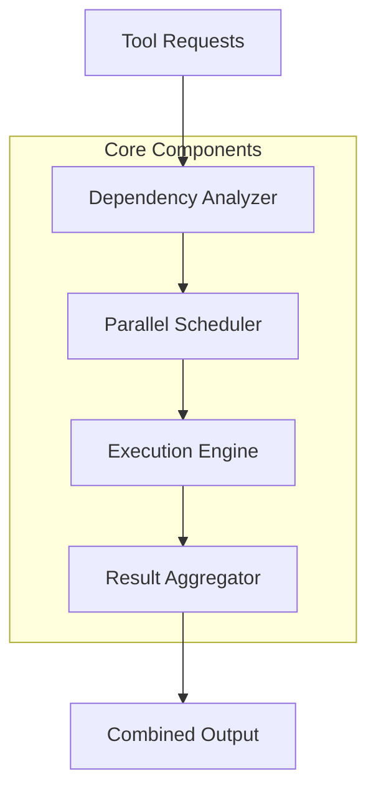
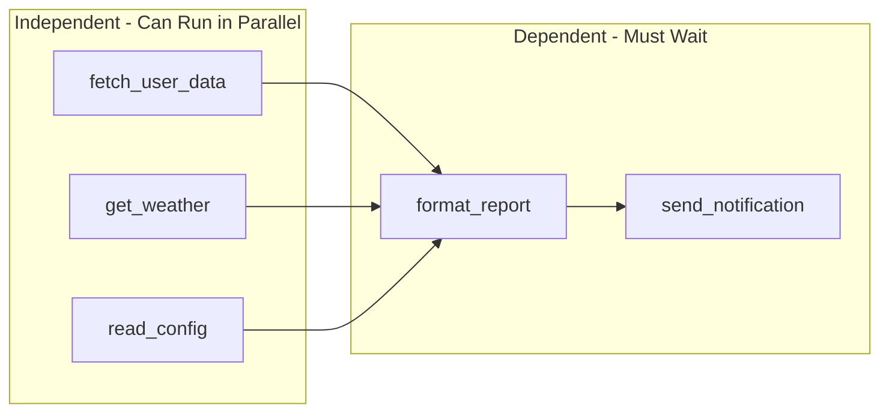
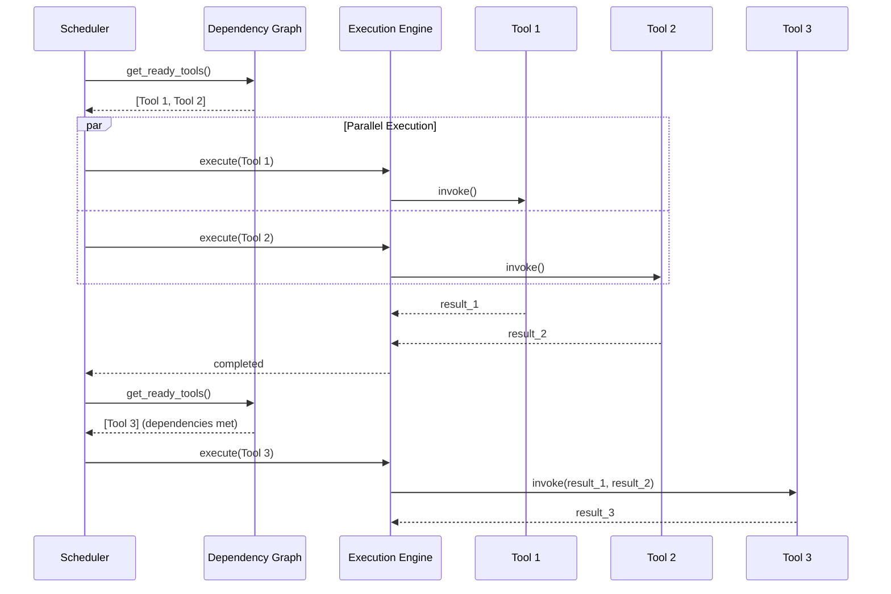
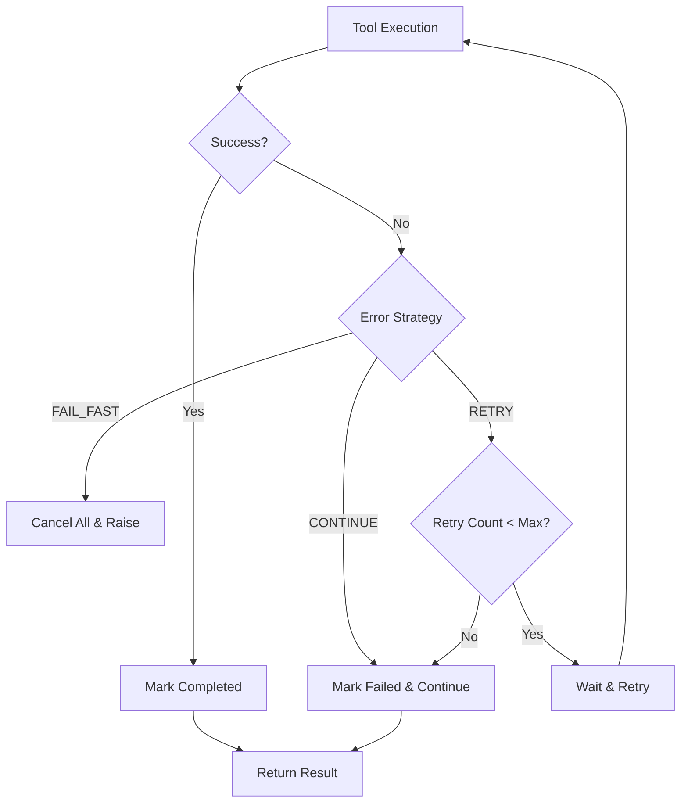

# How to Implement Tool Parallelization

Author: [nawazdhandala](https://github.com/nawazdhandala)

Tags: AI Agents, Parallel Execution, Concurrency, Performance

Description: Learn to implement parallel tool execution for AI agents with dependency analysis, concurrent execution, and result aggregation for faster task completion.

---

When building AI agents that interact with multiple tools, one of the most impactful performance optimizations is tool parallelization. Instead of executing tools sequentially, intelligent agents can identify independent operations and run them concurrently, dramatically reducing overall execution time. This guide walks through implementing a robust tool parallelization system from the ground up.

## Why Tool Parallelization Matters

Consider an AI agent that needs to:
1. Fetch user data from a database
2. Query an external API for weather information
3. Read a configuration file
4. Send a notification

If each operation takes 500ms and runs sequentially, total time is 2 seconds. With parallelization, independent operations run simultaneously, potentially reducing this to just 500ms - a 4x improvement.

## Architecture Overview

A tool parallelization system consists of four key components:



Let us examine each component in detail.

## 1. Dependency Graph Construction

The first step is analyzing tool calls to determine which can run in parallel. Tools may have explicit dependencies (one tool needs output from another) or implicit dependencies (shared resources, rate limits).

### Defining the Data Structures

```python
from dataclasses import dataclass, field
from typing import Any, Callable, Optional
from enum import Enum

class ToolStatus(Enum):
    PENDING = "pending"
    RUNNING = "running"
    COMPLETED = "completed"
    FAILED = "failed"

@dataclass
class ToolCall:
    """Represents a single tool invocation request."""
    id: str
    name: str
    parameters: dict[str, Any]
    dependencies: list[str] = field(default_factory=list)
    status: ToolStatus = ToolStatus.PENDING
    result: Optional[Any] = None
    error: Optional[Exception] = None

@dataclass
class DependencyGraph:
    """Tracks relationships between tool calls."""
    nodes: dict[str, ToolCall] = field(default_factory=dict)
    edges: dict[str, set[str]] = field(default_factory=dict)  # child -> parents

    def add_tool(self, tool: ToolCall) -> None:
        """Add a tool call to the graph."""
        self.nodes[tool.id] = tool
        self.edges[tool.id] = set(tool.dependencies)

    def get_ready_tools(self) -> list[ToolCall]:
        """Return tools whose dependencies are all satisfied."""
        ready = []
        for tool_id, tool in self.nodes.items():
            if tool.status != ToolStatus.PENDING:
                continue

            # Check if all dependencies are completed
            deps_satisfied = all(
                self.nodes[dep_id].status == ToolStatus.COMPLETED
                for dep_id in self.edges[tool_id]
            )

            if deps_satisfied:
                ready.append(tool)

        return ready
```

### Visualizing the Dependency Graph

Here is how dependencies between tools might look:



### Automatic Dependency Detection

For more sophisticated systems, you can automatically detect dependencies by analyzing parameter references:

```python
import re
from typing import Set

def detect_dependencies(
    tool_calls: list[ToolCall]
) -> dict[str, Set[str]]:
    """
    Automatically detect dependencies by finding parameter
    references to other tool outputs.

    Convention: Parameters like "${tool_id.field}" indicate
    a dependency on that tool's output.
    """
    dependencies: dict[str, Set[str]] = {
        tool.id: set() for tool in tool_calls
    }

    # Pattern matches references like ${fetch_user.result.name}
    reference_pattern = re.compile(r'\$\{(\w+)\..*?\}')

    for tool in tool_calls:
        for param_value in tool.parameters.values():
            if isinstance(param_value, str):
                matches = reference_pattern.findall(param_value)
                for referenced_tool_id in matches:
                    if referenced_tool_id in dependencies:
                        dependencies[tool.id].add(referenced_tool_id)

    return dependencies
```

## 2. Parallel Scheduler Implementation

The scheduler determines execution order while respecting dependencies and resource constraints.

```python
import asyncio
from collections import deque
from typing import Callable, Awaitable

class ParallelScheduler:
    """
    Schedules tool execution with dependency awareness
    and concurrency limits.
    """

    def __init__(
        self,
        max_concurrent: int = 10,
        tool_executor: Callable[[ToolCall], Awaitable[Any]] = None
    ):
        self.max_concurrent = max_concurrent
        self.tool_executor = tool_executor
        self.semaphore = asyncio.Semaphore(max_concurrent)
        self.graph: Optional[DependencyGraph] = None

    async def execute_all(
        self,
        graph: DependencyGraph
    ) -> dict[str, Any]:
        """
        Execute all tools in the graph, respecting dependencies
        and concurrency limits.
        """
        self.graph = graph
        results: dict[str, Any] = {}
        pending_tasks: set[asyncio.Task] = set()

        while True:
            # Find tools ready to execute
            ready_tools = graph.get_ready_tools()

            # Create tasks for ready tools
            for tool in ready_tools:
                if len(pending_tasks) >= self.max_concurrent:
                    # Wait for at least one task to complete
                    done, pending_tasks = await asyncio.wait(
                        pending_tasks,
                        return_when=asyncio.FIRST_COMPLETED
                    )
                    # Process completed tasks
                    for task in done:
                        tool_id, result = await task
                        results[tool_id] = result

                # Mark as running and create task
                tool.status = ToolStatus.RUNNING
                task = asyncio.create_task(
                    self._execute_tool(tool)
                )
                pending_tasks.add(task)

            # If no ready tools and no pending tasks, we are done
            if not ready_tools and not pending_tasks:
                break

            # Wait for at least one task if we have pending work
            if pending_tasks and not ready_tools:
                done, pending_tasks = await asyncio.wait(
                    pending_tasks,
                    return_when=asyncio.FIRST_COMPLETED
                )
                for task in done:
                    tool_id, result = await task
                    results[tool_id] = result

        return results

    async def _execute_tool(
        self,
        tool: ToolCall
    ) -> tuple[str, Any]:
        """Execute a single tool with semaphore control."""
        async with self.semaphore:
            try:
                # Resolve any parameter references
                resolved_params = self._resolve_parameters(tool)
                tool.parameters = resolved_params

                # Execute the tool
                result = await self.tool_executor(tool)
                tool.result = result
                tool.status = ToolStatus.COMPLETED
                return (tool.id, result)

            except Exception as e:
                tool.error = e
                tool.status = ToolStatus.FAILED
                raise

    def _resolve_parameters(
        self,
        tool: ToolCall
    ) -> dict[str, Any]:
        """
        Replace parameter references with actual values
        from completed tool results.
        """
        resolved = {}
        reference_pattern = re.compile(r'\$\{(\w+)\.result\.?(\w*)\}')

        for key, value in tool.parameters.items():
            if isinstance(value, str):
                def replacer(match):
                    ref_tool_id = match.group(1)
                    ref_field = match.group(2)
                    ref_tool = self.graph.nodes.get(ref_tool_id)

                    if ref_tool and ref_tool.result is not None:
                        if ref_field and isinstance(ref_tool.result, dict):
                            return str(ref_tool.result.get(ref_field, ""))
                        return str(ref_tool.result)
                    return match.group(0)

                resolved[key] = reference_pattern.sub(replacer, value)
            else:
                resolved[key] = value

        return resolved
```

### Execution Flow Visualization



## 3. Resource Management and Rate Limiting

Real-world systems need to manage resources carefully. Different tools may have different rate limits or resource requirements.

```python
from dataclasses import dataclass
from typing import Optional
import time

@dataclass
class ResourceLimits:
    """Defines resource constraints for a tool type."""
    max_concurrent: int = 5
    requests_per_second: float = 10.0
    timeout_seconds: float = 30.0

class ResourceManager:
    """
    Manages rate limits and concurrency per tool type.
    """

    def __init__(self):
        self.limits: dict[str, ResourceLimits] = {}
        self.semaphores: dict[str, asyncio.Semaphore] = {}
        self.last_request: dict[str, float] = {}
        self.locks: dict[str, asyncio.Lock] = {}

    def configure_tool(
        self,
        tool_name: str,
        limits: ResourceLimits
    ) -> None:
        """Set resource limits for a tool type."""
        self.limits[tool_name] = limits
        self.semaphores[tool_name] = asyncio.Semaphore(
            limits.max_concurrent
        )
        self.last_request[tool_name] = 0
        self.locks[tool_name] = asyncio.Lock()

    async def acquire(self, tool_name: str) -> None:
        """
        Acquire permission to execute a tool,
        respecting concurrency and rate limits.
        """
        limits = self.limits.get(
            tool_name,
            ResourceLimits()
        )

        # Acquire concurrency semaphore
        if tool_name not in self.semaphores:
            self.semaphores[tool_name] = asyncio.Semaphore(
                limits.max_concurrent
            )

        await self.semaphores[tool_name].acquire()

        # Apply rate limiting
        if limits.requests_per_second > 0:
            async with self.locks.setdefault(
                tool_name,
                asyncio.Lock()
            ):
                min_interval = 1.0 / limits.requests_per_second
                elapsed = time.time() - self.last_request.get(
                    tool_name, 0
                )

                if elapsed < min_interval:
                    await asyncio.sleep(min_interval - elapsed)

                self.last_request[tool_name] = time.time()

    def release(self, tool_name: str) -> None:
        """Release the concurrency semaphore."""
        if tool_name in self.semaphores:
            self.semaphores[tool_name].release()
```

### Integrating Resource Management

```python
class ManagedParallelScheduler(ParallelScheduler):
    """
    Extended scheduler with resource management.
    """

    def __init__(
        self,
        resource_manager: ResourceManager,
        **kwargs
    ):
        super().__init__(**kwargs)
        self.resource_manager = resource_manager

    async def _execute_tool(
        self,
        tool: ToolCall
    ) -> tuple[str, Any]:
        """Execute with resource management."""
        await self.resource_manager.acquire(tool.name)
        try:
            return await super()._execute_tool(tool)
        finally:
            self.resource_manager.release(tool.name)
```

## 4. Error Handling and Recovery

Robust error handling is critical when running tools in parallel. A failure in one tool should not necessarily crash the entire execution.

```python
from enum import Enum
from typing import Optional

class ErrorStrategy(Enum):
    """How to handle errors in parallel execution."""
    FAIL_FAST = "fail_fast"      # Cancel all on first error
    CONTINUE = "continue"         # Continue with other tools
    RETRY = "retry"               # Retry failed tools

@dataclass
class ExecutionConfig:
    """Configuration for parallel execution."""
    error_strategy: ErrorStrategy = ErrorStrategy.CONTINUE
    max_retries: int = 3
    retry_delay_seconds: float = 1.0

class ResilientScheduler(ParallelScheduler):
    """
    Scheduler with configurable error handling.
    """

    def __init__(
        self,
        config: ExecutionConfig,
        **kwargs
    ):
        super().__init__(**kwargs)
        self.config = config
        self.retry_counts: dict[str, int] = {}

    async def _execute_tool(
        self,
        tool: ToolCall
    ) -> tuple[str, Any]:
        """Execute with error handling and retry logic."""
        self.retry_counts.setdefault(tool.id, 0)

        while True:
            try:
                return await super()._execute_tool(tool)

            except Exception as e:
                self.retry_counts[tool.id] += 1

                if self.config.error_strategy == ErrorStrategy.FAIL_FAST:
                    # Propagate error immediately
                    raise

                elif self.config.error_strategy == ErrorStrategy.RETRY:
                    if self.retry_counts[tool.id] < self.config.max_retries:
                        # Reset status and retry
                        tool.status = ToolStatus.PENDING
                        await asyncio.sleep(
                            self.config.retry_delay_seconds
                        )
                        continue
                    # Max retries exceeded
                    tool.status = ToolStatus.FAILED
                    tool.error = e
                    return (tool.id, None)

                else:  # CONTINUE
                    # Mark as failed but do not propagate
                    tool.status = ToolStatus.FAILED
                    tool.error = e
                    return (tool.id, None)
```

### Error Handling Flow



## 5. Result Aggregation

After parallel execution, results need to be combined into a coherent output. This is especially important when tools have dependencies.

```python
from typing import Any, Optional

@dataclass
class ExecutionResult:
    """Complete result of parallel tool execution."""
    results: dict[str, Any]
    errors: dict[str, Exception]
    execution_order: list[str]
    total_time_ms: float

    @property
    def success(self) -> bool:
        """True if all tools completed successfully."""
        return len(self.errors) == 0

    @property
    def partial_success(self) -> bool:
        """True if at least one tool succeeded."""
        return len(self.results) > len(self.errors)

class ResultAggregator:
    """
    Collects and organizes results from parallel execution.
    """

    def __init__(self):
        self.results: dict[str, Any] = {}
        self.errors: dict[str, Exception] = {}
        self.execution_order: list[str] = []
        self.start_time: Optional[float] = None

    def start(self) -> None:
        """Mark execution start."""
        self.start_time = time.time()

    def record_result(
        self,
        tool_id: str,
        result: Any
    ) -> None:
        """Record a successful tool result."""
        self.results[tool_id] = result
        self.execution_order.append(tool_id)

    def record_error(
        self,
        tool_id: str,
        error: Exception
    ) -> None:
        """Record a tool failure."""
        self.errors[tool_id] = error
        self.execution_order.append(tool_id)

    def finalize(self) -> ExecutionResult:
        """Create the final execution result."""
        total_time = (time.time() - self.start_time) * 1000

        return ExecutionResult(
            results=self.results.copy(),
            errors=self.errors.copy(),
            execution_order=self.execution_order.copy(),
            total_time_ms=total_time
        )
```

## 6. Putting It All Together

Here is a complete example showing how all components work together:

```python
import asyncio
from typing import Any

# Define available tools
async def fetch_user_data(params: dict) -> dict:
    """Simulate fetching user data."""
    await asyncio.sleep(0.5)  # Simulate network delay
    return {"user_id": params["id"], "name": "Alice"}

async def get_weather(params: dict) -> dict:
    """Simulate weather API call."""
    await asyncio.sleep(0.3)
    return {"city": params["city"], "temp": 72}

async def read_config(params: dict) -> dict:
    """Simulate reading configuration."""
    await asyncio.sleep(0.2)
    return {"theme": "dark", "language": "en"}

async def format_report(params: dict) -> str:
    """Format data into a report."""
    await asyncio.sleep(0.1)
    return f"Report for {params.get('user_name', 'Unknown')}"

# Tool registry
TOOLS = {
    "fetch_user_data": fetch_user_data,
    "get_weather": get_weather,
    "read_config": read_config,
    "format_report": format_report,
}

async def tool_executor(tool: ToolCall) -> Any:
    """Execute a tool by name."""
    executor = TOOLS.get(tool.name)
    if not executor:
        raise ValueError(f"Unknown tool: {tool.name}")
    return await executor(tool.parameters)

async def main():
    # Create tool calls with dependencies
    tools = [
        ToolCall(
            id="user",
            name="fetch_user_data",
            parameters={"id": "123"}
        ),
        ToolCall(
            id="weather",
            name="get_weather",
            parameters={"city": "New York"}
        ),
        ToolCall(
            id="config",
            name="read_config",
            parameters={}
        ),
        ToolCall(
            id="report",
            name="format_report",
            parameters={"user_name": "${user.result.name}"},
            dependencies=["user", "weather", "config"]
        ),
    ]

    # Build dependency graph
    graph = DependencyGraph()
    for tool in tools:
        graph.add_tool(tool)

    # Configure resource limits
    resource_manager = ResourceManager()
    resource_manager.configure_tool(
        "fetch_user_data",
        ResourceLimits(max_concurrent=5, requests_per_second=10)
    )

    # Create and run scheduler
    config = ExecutionConfig(
        error_strategy=ErrorStrategy.RETRY,
        max_retries=3
    )

    scheduler = ResilientScheduler(
        config=config,
        max_concurrent=10,
        tool_executor=tool_executor
    )

    # Execute
    aggregator = ResultAggregator()
    aggregator.start()

    results = await scheduler.execute_all(graph)

    for tool_id, result in results.items():
        tool = graph.nodes[tool_id]
        if tool.status == ToolStatus.COMPLETED:
            aggregator.record_result(tool_id, result)
        else:
            aggregator.record_error(tool_id, tool.error)

    final_result = aggregator.finalize()

    print(f"Execution completed in {final_result.total_time_ms:.2f}ms")
    print(f"Results: {final_result.results}")
    print(f"Errors: {final_result.errors}")

if __name__ == "__main__":
    asyncio.run(main())
```

### Execution Timeline

```mermaid
gantt
    title Tool Parallelization Timeline
    dateFormat X
    axisFormat %L ms

    section Parallel Phase
    fetch_user_data    :a1, 0, 500
    get_weather        :a2, 0, 300
    read_config        :a3, 0, 200

    section Sequential Phase
    format_report      :a4, 500, 100
```



## Performance Considerations

### When to Parallelize

Parallelization is beneficial when:
- Tools have I/O-bound operations (network, disk)
- Tools are independent or have limited dependencies
- The overhead of coordination is less than time saved

### When to Avoid

Sequential execution may be better when:
- Tools are CPU-bound and compete for resources
- All tools depend on each other linearly
- Debugging and tracing are priorities

### Measuring Improvement

```python
import time

async def benchmark_execution(
    tools: list[ToolCall],
    parallel: bool = True
) -> float:
    """Benchmark parallel vs sequential execution."""
    start = time.time()

    if parallel:
        graph = DependencyGraph()
        for tool in tools:
            graph.add_tool(tool)
        scheduler = ParallelScheduler(tool_executor=tool_executor)
        await scheduler.execute_all(graph)
    else:
        for tool in tools:
            await tool_executor(tool)

    return (time.time() - start) * 1000

# Example benchmark
async def run_benchmark():
    tools = create_test_tools()  # Your test tools

    parallel_time = await benchmark_execution(tools, parallel=True)
    sequential_time = await benchmark_execution(tools, parallel=False)

    speedup = sequential_time / parallel_time
    print(f"Sequential: {sequential_time:.2f}ms")
    print(f"Parallel: {parallel_time:.2f}ms")
    print(f"Speedup: {speedup:.2f}x")
```

## Summary

Implementing tool parallelization for AI agents involves:

1. **Dependency Analysis** - Build a graph of tool dependencies to identify what can run concurrently
2. **Parallel Scheduling** - Execute independent tools simultaneously while respecting dependency order
3. **Resource Management** - Control concurrency and rate limits per tool type
4. **Error Handling** - Choose between fail-fast, continue, or retry strategies
5. **Result Aggregation** - Combine outputs from parallel executions

The key insight is that not all tool calls need to wait for others. By carefully analyzing dependencies and managing resources, you can achieve significant performance improvements while maintaining correctness.

Start with simple parallelization of independent tools, then gradually add sophistication like automatic dependency detection, retry logic, and resource limits as your agent system grows.
