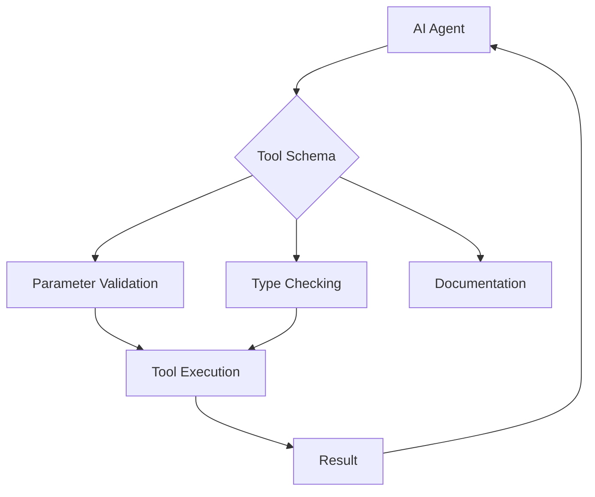
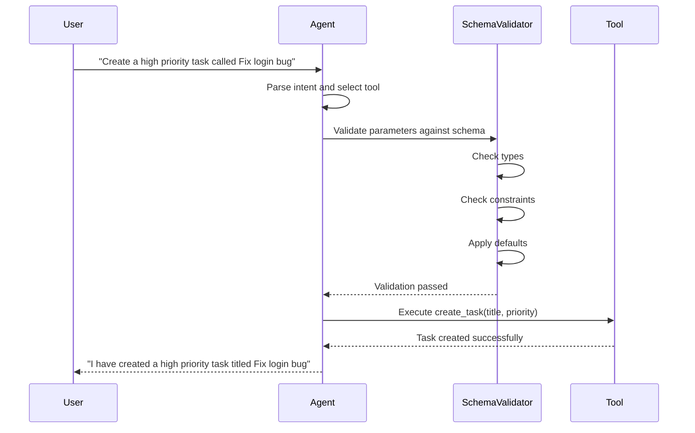
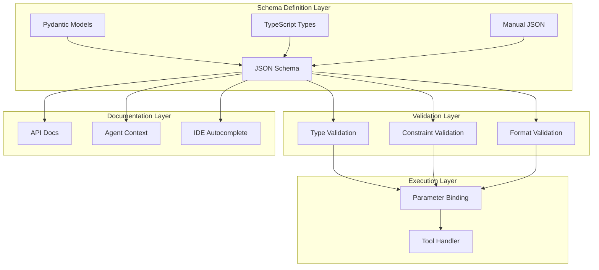

# How to Implement Tool Schemas

Author: [nawazdhandala](https://github.com/nawazdhandala)

Tags: AI Agents, Tool Schema, JSON Schema, API Design

Description: Learn to design tool schemas for AI agents with parameter validation, type inference, and documentation generation for reliable tool execution.

---

AI agents are only as powerful as the tools they can use. When building agents that interact with external systems, databases, or APIs, you need a robust way to define what tools are available and how they should be invoked. This is where tool schemas come in - they serve as the contract between your AI agent and the functions it can call.

In this guide, we will explore how to implement tool schemas that are clear, validated, and self-documenting.

## What is a Tool Schema?

A tool schema is a structured definition that describes:

- What a tool does (its purpose)
- What parameters it accepts
- What types those parameters should be
- Which parameters are required vs optional
- What constraints apply to parameter values



## JSON Schema: The Foundation

JSON Schema is the de facto standard for defining tool schemas. It provides a vocabulary that allows you to annotate and validate JSON documents - perfect for defining tool interfaces.

### Basic Structure

Here is a minimal tool schema:

```json
{
  "name": "search_database",
  "description": "Search for records in the database by query string",
  "parameters": {
    "type": "object",
    "properties": {
      "query": {
        "type": "string",
        "description": "The search query to match against records"
      }
    },
    "required": ["query"]
  }
}
```

Let us break down each component:

- **name**: A unique identifier for the tool (use snake_case for consistency)
- **description**: A clear explanation of what the tool does (the agent reads this to decide when to use it)
- **parameters**: A JSON Schema object defining the input structure

## Parameter Types

JSON Schema supports several primitive types that cover most use cases:

### String Parameters

```json
{
  "type": "string",
  "description": "The user's email address",
  "format": "email",
  "minLength": 5,
  "maxLength": 255
}
```

Common string formats include: `email`, `uri`, `date-time`, `date`, `uuid`, and `regex`.

### Number Parameters

```json
{
  "type": "number",
  "description": "The item price in dollars",
  "minimum": 0,
  "maximum": 10000,
  "multipleOf": 0.01
}
```

Use `integer` when you need whole numbers:

```json
{
  "type": "integer",
  "description": "Number of results to return",
  "minimum": 1,
  "maximum": 100,
  "default": 10
}
```

### Boolean Parameters

```json
{
  "type": "boolean",
  "description": "Whether to include archived items in results",
  "default": false
}
```

### Array Parameters

```json
{
  "type": "array",
  "description": "List of tags to filter by",
  "items": {
    "type": "string"
  },
  "minItems": 1,
  "maxItems": 10,
  "uniqueItems": true
}
```

### Object Parameters

```json
{
  "type": "object",
  "description": "Filter criteria for the search",
  "properties": {
    "status": {
      "type": "string",
      "enum": ["active", "pending", "archived"]
    },
    "created_after": {
      "type": "string",
      "format": "date"
    }
  },
  "additionalProperties": false
}
```

## Complete Tool Schema Example

Here is a comprehensive example that puts it all together:

```json
{
  "name": "create_task",
  "description": "Create a new task in the project management system. Use this when the user wants to add a task, todo item, or work item to a project.",
  "parameters": {
    "$schema": "https://json-schema.org/draft/2020-12/schema",
    "type": "object",
    "properties": {
      "title": {
        "type": "string",
        "description": "The title of the task",
        "minLength": 1,
        "maxLength": 200
      },
      "description": {
        "type": "string",
        "description": "Detailed description of what needs to be done",
        "maxLength": 5000
      },
      "priority": {
        "type": "string",
        "description": "Task priority level",
        "enum": ["low", "medium", "high", "critical"],
        "default": "medium"
      },
      "assignee_id": {
        "type": "string",
        "description": "UUID of the user to assign this task to",
        "format": "uuid"
      },
      "due_date": {
        "type": "string",
        "description": "When the task should be completed",
        "format": "date"
      },
      "tags": {
        "type": "array",
        "description": "Labels to categorize the task",
        "items": {
          "type": "string",
          "maxLength": 50
        },
        "maxItems": 10,
        "uniqueItems": true
      },
      "estimate_hours": {
        "type": "number",
        "description": "Estimated hours to complete the task",
        "minimum": 0.5,
        "maximum": 100
      }
    },
    "required": ["title"],
    "additionalProperties": false
  }
}
```

## Schema Flow: From Definition to Execution



## Validation Rules and Constraints

Proper validation ensures your agent sends well-formed requests. Here are key validation patterns:

### Enum Constraints

When a parameter should only accept specific values:

```json
{
  "status": {
    "type": "string",
    "enum": ["draft", "published", "archived"],
    "description": "The publication status of the article"
  }
}
```

### Pattern Matching

Use regex patterns for custom string validation:

```json
{
  "phone": {
    "type": "string",
    "pattern": "^\\+[1-9]\\d{1,14}$",
    "description": "Phone number in E.164 format (e.g., +14155551234)"
  }
}
```

### Conditional Requirements

Sometimes parameters are only required based on other values:

```json
{
  "type": "object",
  "properties": {
    "notification_type": {
      "type": "string",
      "enum": ["email", "sms", "webhook"]
    },
    "email_address": {
      "type": "string",
      "format": "email"
    },
    "phone_number": {
      "type": "string"
    },
    "webhook_url": {
      "type": "string",
      "format": "uri"
    }
  },
  "required": ["notification_type"],
  "allOf": [
    {
      "if": {
        "properties": { "notification_type": { "const": "email" } }
      },
      "then": {
        "required": ["email_address"]
      }
    },
    {
      "if": {
        "properties": { "notification_type": { "const": "sms" } }
      },
      "then": {
        "required": ["phone_number"]
      }
    }
  ]
}
```

## Implementing Schema Validation in Code

Here is how to implement schema validation in Python using the `jsonschema` library:

```python
from jsonschema import validate, ValidationError, Draft202012Validator
from typing import Any, Dict, Callable
import json

class ToolRegistry:
    def __init__(self):
        self.tools: Dict[str, Dict[str, Any]] = {}
        self.handlers: Dict[str, Callable] = {}

    def register(self, schema: Dict[str, Any], handler: Callable):
        """Register a tool with its schema and handler function."""
        name = schema["name"]

        # Validate the schema itself is well-formed
        Draft202012Validator.check_schema(schema.get("parameters", {}))

        self.tools[name] = schema
        self.handlers[name] = handler

    def execute(self, tool_name: str, parameters: Dict[str, Any]) -> Any:
        """Validate parameters and execute the tool."""
        if tool_name not in self.tools:
            raise ValueError(f"Unknown tool: {tool_name}")

        schema = self.tools[tool_name]

        # Validate parameters against schema
        try:
            validate(
                instance=parameters,
                schema=schema.get("parameters", {}),
            )
        except ValidationError as e:
            raise ValueError(f"Invalid parameters: {e.message}")

        # Execute the handler
        return self.handlers[tool_name](**parameters)

    def get_all_schemas(self) -> list:
        """Return all tool schemas for the agent."""
        return list(self.tools.values())


# Example usage
registry = ToolRegistry()

# Define the schema
search_schema = {
    "name": "search_users",
    "description": "Search for users by name or email",
    "parameters": {
        "type": "object",
        "properties": {
            "query": {
                "type": "string",
                "minLength": 2,
                "description": "Search query"
            },
            "limit": {
                "type": "integer",
                "minimum": 1,
                "maximum": 50,
                "default": 10,
                "description": "Maximum results to return"
            }
        },
        "required": ["query"],
        "additionalProperties": False
    }
}

# Define the handler
def search_users(query: str, limit: int = 10):
    # Implementation here
    return {"results": [], "query": query, "limit": limit}

# Register the tool
registry.register(search_schema, search_users)

# Execute with validation
result = registry.execute("search_users", {"query": "john", "limit": 20})
```

## Automatic Schema Generation

You can generate schemas from type hints using libraries like Pydantic:

```python
from pydantic import BaseModel, Field
from typing import Optional, List
from enum import Enum

class Priority(str, Enum):
    LOW = "low"
    MEDIUM = "medium"
    HIGH = "high"
    CRITICAL = "critical"

class CreateTaskParams(BaseModel):
    """Create a new task in the project management system."""

    title: str = Field(
        ...,
        min_length=1,
        max_length=200,
        description="The title of the task"
    )
    description: Optional[str] = Field(
        None,
        max_length=5000,
        description="Detailed description of what needs to be done"
    )
    priority: Priority = Field(
        Priority.MEDIUM,
        description="Task priority level"
    )
    tags: Optional[List[str]] = Field(
        None,
        max_length=10,
        description="Labels to categorize the task"
    )

# Generate JSON Schema
schema = CreateTaskParams.model_json_schema()
print(json.dumps(schema, indent=2))
```

This generates:

```json
{
  "title": "CreateTaskParams",
  "description": "Create a new task in the project management system.",
  "type": "object",
  "properties": {
    "title": {
      "type": "string",
      "minLength": 1,
      "maxLength": 200,
      "description": "The title of the task"
    },
    "description": {
      "type": "string",
      "maxLength": 5000,
      "description": "Detailed description of what needs to be done"
    },
    "priority": {
      "type": "string",
      "enum": ["low", "medium", "high", "critical"],
      "description": "Task priority level",
      "default": "medium"
    },
    "tags": {
      "type": "array",
      "items": { "type": "string" },
      "maxItems": 10,
      "description": "Labels to categorize the task"
    }
  },
  "required": ["title"]
}
```

## Schema Architecture



## Best Practices for Tool Schemas

### 1. Write Descriptive Descriptions

The description field is what the AI reads to understand when and how to use your tool:

```json
{
  "name": "send_email",
  "description": "Send an email to one or more recipients. Use this tool when the user explicitly asks to send, compose, or draft an email. Do not use this for reading or searching emails."
}
```

### 2. Use Appropriate Constraints

Set realistic limits to prevent misuse:

```json
{
  "message": {
    "type": "string",
    "maxLength": 10000,
    "description": "The email body content"
  },
  "recipients": {
    "type": "array",
    "items": { "type": "string", "format": "email" },
    "minItems": 1,
    "maxItems": 50,
    "description": "Email addresses to send to"
  }
}
```

### 3. Provide Sensible Defaults

Reduce the cognitive load on the agent by providing defaults:

```json
{
  "page_size": {
    "type": "integer",
    "default": 20,
    "minimum": 1,
    "maximum": 100,
    "description": "Number of results per page"
  }
}
```

### 4. Use additionalProperties: false

Prevent the agent from sending unexpected parameters:

```json
{
  "type": "object",
  "properties": {
    "id": { "type": "string" }
  },
  "required": ["id"],
  "additionalProperties": false
}
```

### 5. Document Examples in Descriptions

Help the agent understand expected formats:

```json
{
  "date_range": {
    "type": "string",
    "description": "Date range in ISO format (e.g., '2024-01-01/2024-12-31')",
    "pattern": "^\\d{4}-\\d{2}-\\d{2}/\\d{4}-\\d{2}-\\d{2}$"
  }
}
```

## TypeScript Implementation

For TypeScript projects, you can use Zod for schema definition and validation:

```typescript
import { z } from 'zod';
import { zodToJsonSchema } from 'zod-to-json-schema';

// Define the schema with Zod
const CreateTaskSchema = z.object({
  title: z.string()
    .min(1)
    .max(200)
    .describe('The title of the task'),
  description: z.string()
    .max(5000)
    .optional()
    .describe('Detailed description of what needs to be done'),
  priority: z.enum(['low', 'medium', 'high', 'critical'])
    .default('medium')
    .describe('Task priority level'),
  tags: z.array(z.string().max(50))
    .max(10)
    .optional()
    .describe('Labels to categorize the task'),
});

// Generate JSON Schema
const jsonSchema = zodToJsonSchema(CreateTaskSchema, 'CreateTask');

// Tool definition
const createTaskTool = {
  name: 'create_task',
  description: 'Create a new task in the project management system',
  parameters: jsonSchema.definitions?.CreateTask ?? jsonSchema,
};

// Type-safe handler
type CreateTaskParams = z.infer<typeof CreateTaskSchema>;

async function handleCreateTask(params: CreateTaskParams) {
  const validated = CreateTaskSchema.parse(params);
  // Implementation here
  return { success: true, taskId: 'task-123' };
}
```

## Documentation Generation

Use your schemas to generate documentation automatically:

```python
def generate_tool_docs(schemas: list) -> str:
    """Generate markdown documentation from tool schemas."""
    docs = ["# Available Tools\n"]

    for schema in schemas:
        docs.append(f"## {schema['name']}\n")
        docs.append(f"{schema['description']}\n")
        docs.append("### Parameters\n")

        params = schema.get("parameters", {}).get("properties", {})
        required = schema.get("parameters", {}).get("required", [])

        for param_name, param_def in params.items():
            req_marker = "*" if param_name in required else ""
            param_type = param_def.get("type", "any")
            param_desc = param_def.get("description", "No description")

            docs.append(f"- **{param_name}**{req_marker} ({param_type}): {param_desc}")

            if "enum" in param_def:
                docs.append(f"  - Allowed values: {', '.join(param_def['enum'])}")
            if "default" in param_def:
                docs.append(f"  - Default: `{param_def['default']}`")

        docs.append("\n")

    return "\n".join(docs)
```

## Summary

Tool schemas are the backbone of reliable AI agent interactions. By following JSON Schema standards and implementing proper validation, you ensure that:

1. **Agents understand tools** - Clear descriptions guide tool selection
2. **Parameters are validated** - Type checking and constraints prevent errors
3. **Documentation stays current** - Schemas serve as the source of truth
4. **Integration is simplified** - Standard format works across platforms

Start with simple schemas and add complexity as needed. Remember that the goal is to make your tools easy for AI agents to use correctly - not to create the most complex schema possible.

The patterns and code examples in this guide give you a solid foundation for building tool schemas that are robust, maintainable, and agent-friendly.
