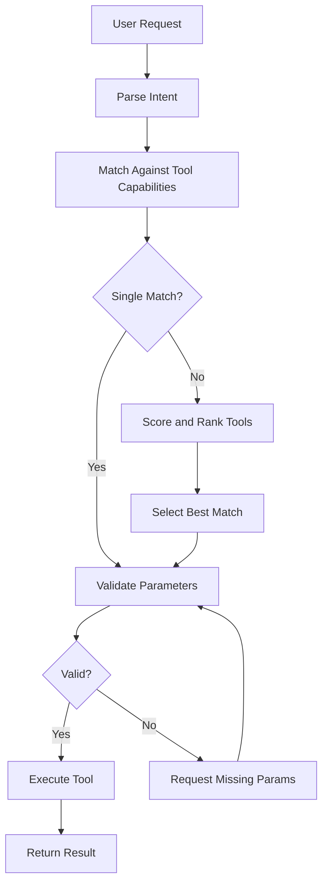
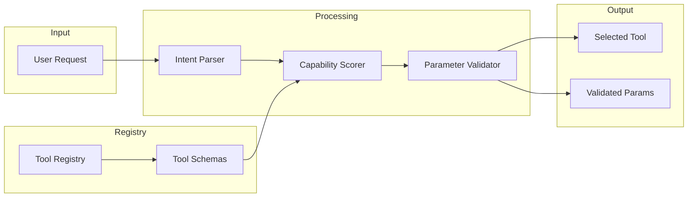
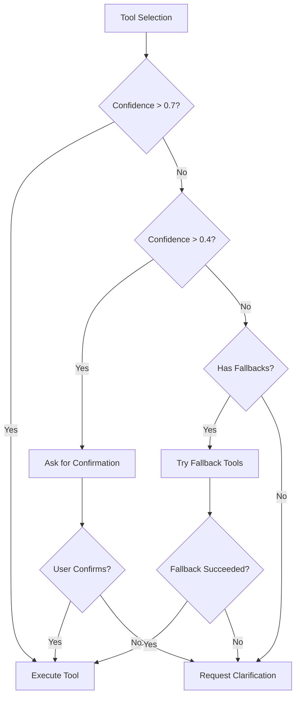

# How to Build Tool Selection

Author: [nawazdhandala](https://github.com/nawazdhandala)

Tags: AI Agents, Tool Use, LLM, Automation

Description: Learn to implement intelligent tool selection for AI agents with capability matching, parameter validation, and dynamic tool routing for complex tasks.

---

AI agents are becoming increasingly powerful, but their true potential lies in their ability to use external tools effectively. Whether it is reading files, querying databases, calling APIs, or executing code - the ability to select the right tool for a given task is what separates a basic chatbot from a capable autonomous agent.

In this post, we will explore how to build a robust tool selection system for AI agents, covering everything from tool schemas to selection algorithms and fallback strategies.

## Understanding Tool Selection

Tool selection is the process by which an AI agent decides which tool (or set of tools) to use when responding to a user request. This decision must consider:

- What tools are available
- What each tool can do
- What the user is asking for
- What parameters each tool requires
- How confident we are in each potential match



## Defining Tool Schemas

The foundation of any tool selection system is a well-defined schema for each tool. A good schema should describe:

1. **Name** - A unique identifier for the tool
2. **Description** - What the tool does (this is crucial for LLM-based selection)
3. **Parameters** - What inputs the tool accepts
4. **Required vs Optional** - Which parameters are mandatory
5. **Return Type** - What the tool outputs

Here is a TypeScript interface for defining tool schemas:

```typescript
interface ToolParameter {
  name: string;
  type: 'string' | 'number' | 'boolean' | 'array' | 'object';
  description: string;
  required: boolean;
  default?: any;
  enum?: string[];  // For constrained values
  pattern?: string; // Regex pattern for validation
}

interface ToolSchema {
  name: string;
  description: string;
  category: string;
  parameters: ToolParameter[];
  returns: {
    type: string;
    description: string;
  };
  examples: {
    input: Record<string, any>;
    description: string;
  }[];
  capabilities: string[];  // Tags for capability matching
}
```

Let us look at a concrete example of a tool schema for a file reading tool:

```typescript
const readFileTool: ToolSchema = {
  name: 'read_file',
  description: 'Reads the contents of a file from the filesystem. Supports text files and returns the content as a string.',
  category: 'filesystem',
  parameters: [
    {
      name: 'file_path',
      type: 'string',
      description: 'The absolute path to the file to read',
      required: true,
      pattern: '^/.*'
    },
    {
      name: 'encoding',
      type: 'string',
      description: 'The character encoding to use',
      required: false,
      default: 'utf-8',
      enum: ['utf-8', 'ascii', 'latin1']
    },
    {
      name: 'max_lines',
      type: 'number',
      description: 'Maximum number of lines to read',
      required: false
    }
  ],
  returns: {
    type: 'string',
    description: 'The contents of the file'
  },
  examples: [
    {
      input: { file_path: '/home/user/document.txt' },
      description: 'Read a text file'
    }
  ],
  capabilities: ['read', 'file', 'filesystem', 'text']
};
```

## Building the Tool Registry

A tool registry manages all available tools and provides lookup functionality. Here is an implementation:

```typescript
class ToolRegistry {
  private tools: Map<string, ToolSchema> = new Map();
  private capabilityIndex: Map<string, Set<string>> = new Map();

  register(tool: ToolSchema): void {
    this.tools.set(tool.name, tool);

    // Index by capabilities for fast lookup
    for (const capability of tool.capabilities) {
      if (!this.capabilityIndex.has(capability)) {
        this.capabilityIndex.set(capability, new Set());
      }
      this.capabilityIndex.get(capability)!.add(tool.name);
    }
  }

  getTool(name: string): ToolSchema | undefined {
    return this.tools.get(name);
  }

  findByCapability(capability: string): ToolSchema[] {
    const toolNames = this.capabilityIndex.get(capability) || new Set();
    return Array.from(toolNames)
      .map(name => this.tools.get(name)!)
      .filter(Boolean);
  }

  getAllTools(): ToolSchema[] {
    return Array.from(this.tools.values());
  }

  searchTools(query: string): ToolSchema[] {
    const queryLower = query.toLowerCase();
    return this.getAllTools().filter(tool =>
      tool.name.toLowerCase().includes(queryLower) ||
      tool.description.toLowerCase().includes(queryLower) ||
      tool.capabilities.some(cap => cap.toLowerCase().includes(queryLower))
    );
  }
}
```

## Capability Scoring Algorithm

When multiple tools could potentially handle a request, we need a way to score and rank them. Here is a capability scoring system:

```typescript
interface ToolScore {
  tool: ToolSchema;
  score: number;
  matchedCapabilities: string[];
  confidence: number;
}

class CapabilityScorer {
  private weights: Record<string, number> = {
    exactMatch: 1.0,
    partialMatch: 0.5,
    categoryMatch: 0.3,
    descriptionMatch: 0.2
  };

  score(tools: ToolSchema[], intent: ParsedIntent): ToolScore[] {
    const scores: ToolScore[] = [];

    for (const tool of tools) {
      const matchedCapabilities: string[] = [];
      let totalScore = 0;

      // Check for exact capability matches
      for (const keyword of intent.keywords) {
        if (tool.capabilities.includes(keyword)) {
          totalScore += this.weights.exactMatch;
          matchedCapabilities.push(keyword);
        } else if (tool.capabilities.some(cap => cap.includes(keyword))) {
          totalScore += this.weights.partialMatch;
          matchedCapabilities.push(keyword + ' (partial)');
        }
      }

      // Category match bonus
      if (intent.category && tool.category === intent.category) {
        totalScore += this.weights.categoryMatch;
      }

      // Description relevance (simple keyword overlap)
      const descWords = tool.description.toLowerCase().split(/\s+/);
      const intentWords = intent.rawText.toLowerCase().split(/\s+/);
      const overlap = intentWords.filter(w => descWords.includes(w)).length;
      totalScore += (overlap / intentWords.length) * this.weights.descriptionMatch;

      // Normalize confidence to 0-1 range
      const maxPossibleScore =
        intent.keywords.length * this.weights.exactMatch +
        this.weights.categoryMatch +
        this.weights.descriptionMatch;

      const confidence = Math.min(totalScore / maxPossibleScore, 1.0);

      scores.push({
        tool,
        score: totalScore,
        matchedCapabilities,
        confidence
      });
    }

    // Sort by score descending
    return scores.sort((a, b) => b.score - a.score);
  }
}
```

## Intent Parsing

Before we can select tools, we need to understand what the user wants. Here is a simple intent parser:

```typescript
interface ParsedIntent {
  rawText: string;
  action: string;           // e.g., 'read', 'write', 'search'
  target: string;           // e.g., 'file', 'database', 'api'
  keywords: string[];       // Extracted keywords
  category?: string;        // Inferred category
  parameters: Record<string, any>;  // Extracted parameter values
}

class IntentParser {
  private actionPatterns: Record<string, RegExp[]> = {
    read: [/read/i, /get/i, /fetch/i, /load/i, /open/i, /view/i],
    write: [/write/i, /save/i, /create/i, /store/i, /put/i],
    search: [/search/i, /find/i, /look for/i, /query/i],
    delete: [/delete/i, /remove/i, /erase/i],
    execute: [/run/i, /execute/i, /invoke/i, /call/i]
  };

  private targetPatterns: Record<string, RegExp[]> = {
    file: [/file/i, /document/i, /\.txt/i, /\.json/i, /\.md/i],
    database: [/database/i, /db/i, /table/i, /record/i],
    api: [/api/i, /endpoint/i, /http/i, /url/i],
    code: [/code/i, /script/i, /function/i, /program/i]
  };

  parse(text: string): ParsedIntent {
    const intent: ParsedIntent = {
      rawText: text,
      action: this.detectAction(text),
      target: this.detectTarget(text),
      keywords: this.extractKeywords(text),
      parameters: this.extractParameters(text)
    };

    // Infer category from action and target
    intent.category = this.inferCategory(intent);

    return intent;
  }

  private detectAction(text: string): string {
    for (const [action, patterns] of Object.entries(this.actionPatterns)) {
      if (patterns.some(pattern => pattern.test(text))) {
        return action;
      }
    }
    return 'unknown';
  }

  private detectTarget(text: string): string {
    for (const [target, patterns] of Object.entries(this.targetPatterns)) {
      if (patterns.some(pattern => pattern.test(text))) {
        return target;
      }
    }
    return 'unknown';
  }

  private extractKeywords(text: string): string[] {
    // Remove common stop words and extract meaningful terms
    const stopWords = new Set(['the', 'a', 'an', 'to', 'from', 'in', 'on', 'at', 'for', 'of', 'and', 'or', 'is', 'it']);
    return text
      .toLowerCase()
      .split(/\s+/)
      .filter(word => word.length > 2 && !stopWords.has(word));
  }

  private extractParameters(text: string): Record<string, any> {
    const params: Record<string, any> = {};

    // Extract file paths
    const pathMatch = text.match(/["']?([\/\w\-\.]+\.\w+)["']?/);
    if (pathMatch) {
      params.file_path = pathMatch[1];
    }

    // Extract URLs
    const urlMatch = text.match(/(https?:\/\/[^\s]+)/);
    if (urlMatch) {
      params.url = urlMatch[1];
    }

    // Extract numbers
    const numberMatch = text.match(/\b(\d+)\b/);
    if (numberMatch) {
      params.number = parseInt(numberMatch[1], 10);
    }

    return params;
  }

  private inferCategory(intent: ParsedIntent): string {
    const categoryMap: Record<string, string> = {
      'file': 'filesystem',
      'database': 'data',
      'api': 'network',
      'code': 'execution'
    };
    return categoryMap[intent.target] || 'general';
  }
}
```

## The Tool Selector

Now we can combine everything into a tool selector:



```typescript
interface SelectionResult {
  tool: ToolSchema;
  confidence: number;
  validatedParams: Record<string, any>;
  missingParams: string[];
  warnings: string[];
}

class ToolSelector {
  constructor(
    private registry: ToolRegistry,
    private parser: IntentParser,
    private scorer: CapabilityScorer,
    private validator: ParameterValidator
  ) {}

  async select(userRequest: string): Promise<SelectionResult | null> {
    // Step 1: Parse the intent
    const intent = this.parser.parse(userRequest);

    // Step 2: Get candidate tools
    const candidates = this.getCandidates(intent);

    if (candidates.length === 0) {
      return null;
    }

    // Step 3: Score and rank tools
    const scored = this.scorer.score(candidates, intent);

    // Step 4: Select the best match
    const bestMatch = scored[0];

    // Step 5: Validate parameters
    const validation = this.validator.validate(
      bestMatch.tool,
      intent.parameters
    );

    return {
      tool: bestMatch.tool,
      confidence: bestMatch.confidence,
      validatedParams: validation.validatedParams,
      missingParams: validation.missingRequired,
      warnings: validation.warnings
    };
  }

  private getCandidates(intent: ParsedIntent): ToolSchema[] {
    const candidates = new Set<ToolSchema>();

    // Add tools matching the category
    if (intent.category) {
      for (const tool of this.registry.getAllTools()) {
        if (tool.category === intent.category) {
          candidates.add(tool);
        }
      }
    }

    // Add tools matching keywords
    for (const keyword of intent.keywords) {
      for (const tool of this.registry.findByCapability(keyword)) {
        candidates.add(tool);
      }
    }

    // If no matches, return all tools for scoring
    if (candidates.size === 0) {
      return this.registry.getAllTools();
    }

    return Array.from(candidates);
  }
}
```

## Parameter Validation

Robust parameter validation ensures tools receive correct inputs:

```typescript
interface ValidationResult {
  isValid: boolean;
  validatedParams: Record<string, any>;
  missingRequired: string[];
  invalidParams: Array<{
    name: string;
    reason: string;
  }>;
  warnings: string[];
}

class ParameterValidator {
  validate(tool: ToolSchema, params: Record<string, any>): ValidationResult {
    const result: ValidationResult = {
      isValid: true,
      validatedParams: {},
      missingRequired: [],
      invalidParams: [],
      warnings: []
    };

    for (const paramDef of tool.parameters) {
      const value = params[paramDef.name];

      // Check required parameters
      if (paramDef.required && value === undefined) {
        result.missingRequired.push(paramDef.name);
        result.isValid = false;
        continue;
      }

      // Apply default values
      if (value === undefined && paramDef.default !== undefined) {
        result.validatedParams[paramDef.name] = paramDef.default;
        continue;
      }

      // Skip undefined optional params
      if (value === undefined) {
        continue;
      }

      // Type validation
      const typeValid = this.validateType(value, paramDef.type);
      if (!typeValid) {
        result.invalidParams.push({
          name: paramDef.name,
          reason: `Expected ${paramDef.type}, got ${typeof value}`
        });
        result.isValid = false;
        continue;
      }

      // Enum validation
      if (paramDef.enum && !paramDef.enum.includes(value)) {
        result.invalidParams.push({
          name: paramDef.name,
          reason: `Value must be one of: ${paramDef.enum.join(', ')}`
        });
        result.isValid = false;
        continue;
      }

      // Pattern validation
      if (paramDef.pattern && typeof value === 'string') {
        const regex = new RegExp(paramDef.pattern);
        if (!regex.test(value)) {
          result.invalidParams.push({
            name: paramDef.name,
            reason: `Value does not match pattern: ${paramDef.pattern}`
          });
          result.isValid = false;
          continue;
        }
      }

      result.validatedParams[paramDef.name] = value;
    }

    // Check for extra parameters (warnings only)
    const definedParams = new Set(tool.parameters.map(p => p.name));
    for (const key of Object.keys(params)) {
      if (!definedParams.has(key)) {
        result.warnings.push(`Unknown parameter: ${key}`);
      }
    }

    return result;
  }

  private validateType(value: any, expectedType: string): boolean {
    switch (expectedType) {
      case 'string':
        return typeof value === 'string';
      case 'number':
        return typeof value === 'number' && !isNaN(value);
      case 'boolean':
        return typeof value === 'boolean';
      case 'array':
        return Array.isArray(value);
      case 'object':
        return typeof value === 'object' && value !== null && !Array.isArray(value);
      default:
        return true;
    }
  }
}
```

## Fallback Strategies

When the primary tool selection fails or returns low confidence, fallback strategies can help:



```typescript
interface FallbackConfig {
  minConfidenceThreshold: number;
  confirmationThreshold: number;
  maxFallbackAttempts: number;
  fallbackOrder: string[];  // Tool names in fallback priority
}

class FallbackHandler {
  private config: FallbackConfig = {
    minConfidenceThreshold: 0.4,
    confirmationThreshold: 0.7,
    maxFallbackAttempts: 3,
    fallbackOrder: []
  };

  constructor(
    private selector: ToolSelector,
    private registry: ToolRegistry,
    config?: Partial<FallbackConfig>
  ) {
    this.config = { ...this.config, ...config };
  }

  async selectWithFallback(request: string): Promise<FallbackResult> {
    const primary = await this.selector.select(request);

    // Case 1: No tool found
    if (!primary) {
      return this.handleNoMatch(request);
    }

    // Case 2: High confidence - proceed
    if (primary.confidence >= this.config.confirmationThreshold) {
      return {
        status: 'success',
        tool: primary.tool,
        params: primary.validatedParams,
        requiresConfirmation: false
      };
    }

    // Case 3: Medium confidence - ask for confirmation
    if (primary.confidence >= this.config.minConfidenceThreshold) {
      return {
        status: 'needs_confirmation',
        tool: primary.tool,
        params: primary.validatedParams,
        requiresConfirmation: true,
        message: `I'm ${Math.round(primary.confidence * 100)}% confident you want to use ${primary.tool.name}. Is this correct?`
      };
    }

    // Case 4: Low confidence - try fallbacks
    return this.tryFallbacks(request, primary);
  }

  private handleNoMatch(request: string): FallbackResult {
    // Suggest similar tools based on description search
    const suggestions = this.registry.searchTools(request).slice(0, 3);

    return {
      status: 'no_match',
      requiresConfirmation: false,
      message: 'I could not find a suitable tool for this request.',
      suggestions: suggestions.map(t => ({
        name: t.name,
        description: t.description
      }))
    };
  }

  private async tryFallbacks(
    request: string,
    primary: SelectionResult
  ): Promise<FallbackResult> {
    const attempts: string[] = [primary.tool.name];

    for (const fallbackName of this.config.fallbackOrder) {
      if (attempts.length >= this.config.maxFallbackAttempts) {
        break;
      }

      if (attempts.includes(fallbackName)) {
        continue;
      }

      const fallbackTool = this.registry.getTool(fallbackName);
      if (!fallbackTool) {
        continue;
      }

      // Check if fallback tool could handle the request
      const parser = new IntentParser();
      const intent = parser.parse(request);
      const scorer = new CapabilityScorer();
      const scores = scorer.score([fallbackTool], intent);

      if (scores[0].confidence >= this.config.minConfidenceThreshold) {
        return {
          status: 'fallback_success',
          tool: fallbackTool,
          params: {},
          requiresConfirmation: true,
          message: `Primary tool had low confidence. Suggesting ${fallbackTool.name} instead.`
        };
      }

      attempts.push(fallbackName);
    }

    return {
      status: 'clarification_needed',
      requiresConfirmation: false,
      message: 'I need more information to select the right tool.',
      questions: [
        'What type of operation do you want to perform?',
        'What data or resource are you working with?'
      ]
    };
  }
}

interface FallbackResult {
  status: 'success' | 'needs_confirmation' | 'no_match' | 'fallback_success' | 'clarification_needed';
  tool?: ToolSchema;
  params?: Record<string, any>;
  requiresConfirmation: boolean;
  message?: string;
  suggestions?: Array<{ name: string; description: string }>;
  questions?: string[];
}
```

## Dynamic Tool Routing

For complex requests that may require multiple tools, implement dynamic routing:

```typescript
interface RoutingPlan {
  steps: RoutingStep[];
  dependencies: Map<number, number[]>;  // step index -> dependent step indices
}

interface RoutingStep {
  tool: ToolSchema;
  params: Record<string, any>;
  outputMapping?: Record<string, string>;  // Maps output to next step's input
}

class DynamicRouter {
  constructor(
    private selector: ToolSelector,
    private registry: ToolRegistry
  ) {}

  async planRoute(complexRequest: string): Promise<RoutingPlan> {
    // Decompose the request into sub-tasks
    const subTasks = this.decomposeRequest(complexRequest);

    const steps: RoutingStep[] = [];
    const dependencies = new Map<number, number[]>();

    for (let i = 0; i < subTasks.length; i++) {
      const task = subTasks[i];
      const selection = await this.selector.select(task.description);

      if (selection) {
        steps.push({
          tool: selection.tool,
          params: selection.validatedParams,
          outputMapping: task.outputMapping
        });

        // Track dependencies
        if (task.dependsOn.length > 0) {
          dependencies.set(i, task.dependsOn);
        }
      }
    }

    return { steps, dependencies };
  }

  private decomposeRequest(request: string): SubTask[] {
    // This would ideally use an LLM for complex decomposition
    // Here's a simple keyword-based approach
    const subTasks: SubTask[] = [];

    // Look for sequential indicators
    const parts = request.split(/\s+(?:then|and then|after that|next)\s+/i);

    for (let i = 0; i < parts.length; i++) {
      subTasks.push({
        description: parts[i].trim(),
        dependsOn: i > 0 ? [i - 1] : [],
        outputMapping: {}
      });
    }

    return subTasks;
  }

  async executeRoute(plan: RoutingPlan): Promise<RouteExecutionResult[]> {
    const results: RouteExecutionResult[] = [];
    const completedSteps = new Set<number>();
    const stepOutputs = new Map<number, any>();

    while (completedSteps.size < plan.steps.length) {
      // Find steps that can be executed (all dependencies met)
      const readySteps = plan.steps
        .map((step, index) => ({ step, index }))
        .filter(({ index }) => {
          if (completedSteps.has(index)) return false;
          const deps = plan.dependencies.get(index) || [];
          return deps.every(d => completedSteps.has(d));
        });

      // Execute ready steps in parallel
      const executions = readySteps.map(async ({ step, index }) => {
        // Inject outputs from dependencies
        const params = { ...step.params };
        const deps = plan.dependencies.get(index) || [];

        for (const depIndex of deps) {
          const depOutput = stepOutputs.get(depIndex);
          if (depOutput && step.outputMapping) {
            for (const [outputKey, inputKey] of Object.entries(step.outputMapping)) {
              if (depOutput[outputKey] !== undefined) {
                params[inputKey] = depOutput[outputKey];
              }
            }
          }
        }

        // Execute the tool (placeholder - actual implementation depends on tool execution system)
        const result = await this.executeTool(step.tool, params);

        return { index, result };
      });

      const stepResults = await Promise.all(executions);

      for (const { index, result } of stepResults) {
        completedSteps.add(index);
        stepOutputs.set(index, result.output);
        results.push(result);
      }
    }

    return results;
  }

  private async executeTool(tool: ToolSchema, params: Record<string, any>): Promise<RouteExecutionResult> {
    // Placeholder for actual tool execution
    return {
      toolName: tool.name,
      params,
      output: {},
      success: true
    };
  }
}

interface SubTask {
  description: string;
  dependsOn: number[];
  outputMapping: Record<string, string>;
}

interface RouteExecutionResult {
  toolName: string;
  params: Record<string, any>;
  output: any;
  success: boolean;
  error?: string;
}
```

## Putting It All Together

Here is a complete example showing how all components work together:

```typescript
// Initialize the system
const registry = new ToolRegistry();
const parser = new IntentParser();
const scorer = new CapabilityScorer();
const validator = new ParameterValidator();

// Register tools
registry.register(readFileTool);
registry.register({
  name: 'write_file',
  description: 'Writes content to a file on the filesystem',
  category: 'filesystem',
  parameters: [
    { name: 'file_path', type: 'string', description: 'Path to write to', required: true },
    { name: 'content', type: 'string', description: 'Content to write', required: true },
    { name: 'append', type: 'boolean', description: 'Append instead of overwrite', required: false, default: false }
  ],
  returns: { type: 'boolean', description: 'Success status' },
  examples: [],
  capabilities: ['write', 'file', 'filesystem', 'save', 'create']
});

registry.register({
  name: 'search_files',
  description: 'Searches for files matching a pattern in a directory',
  category: 'filesystem',
  parameters: [
    { name: 'pattern', type: 'string', description: 'Glob pattern to match', required: true },
    { name: 'directory', type: 'string', description: 'Directory to search in', required: false, default: '.' }
  ],
  returns: { type: 'array', description: 'List of matching file paths' },
  examples: [],
  capabilities: ['search', 'find', 'file', 'filesystem', 'glob']
});

// Create selector with fallback support
const selector = new ToolSelector(registry, parser, scorer, validator);
const fallbackHandler = new FallbackHandler(selector, registry, {
  fallbackOrder: ['search_files', 'read_file']
});

// Example usage
async function handleUserRequest(request: string) {
  console.log(`Processing: "${request}"`);

  const result = await fallbackHandler.selectWithFallback(request);

  switch (result.status) {
    case 'success':
      console.log(`Selected tool: ${result.tool!.name}`);
      console.log(`Parameters: ${JSON.stringify(result.params)}`);
      break;

    case 'needs_confirmation':
      console.log(result.message);
      // Wait for user confirmation before proceeding
      break;

    case 'no_match':
      console.log(result.message);
      if (result.suggestions) {
        console.log('Did you mean one of these?');
        result.suggestions.forEach(s => console.log(`  - ${s.name}: ${s.description}`));
      }
      break;

    case 'clarification_needed':
      console.log(result.message);
      result.questions?.forEach(q => console.log(`  - ${q}`));
      break;
  }
}

// Test with different requests
handleUserRequest('Read the contents of /home/user/config.json');
handleUserRequest('Find all JavaScript files in the project');
handleUserRequest('Save this text to output.txt');
```

## Best Practices

### 1. Write Clear Tool Descriptions

The description is often the most important field for LLM-based selection. Make it clear and specific:

```typescript
// Good
description: 'Reads the contents of a text file and returns it as a UTF-8 string. Supports files up to 10MB.'

// Bad
description: 'Reads files'
```

### 2. Use Meaningful Capability Tags

Choose capability tags that align with how users naturally describe tasks:

```typescript
// Good
capabilities: ['read', 'file', 'text', 'content', 'load', 'open']

// Bad
capabilities: ['fs', 'io', 'r']
```

### 3. Provide Examples

Examples help both LLMs and rule-based systems understand when to use a tool:

```typescript
examples: [
  { input: { file_path: '/etc/hosts' }, description: 'Read system hosts file' },
  { input: { file_path: './package.json' }, description: 'Read project configuration' }
]
```

### 4. Handle Partial Matches Gracefully

Not every request will perfectly match a tool. Design your system to work with partial information and ask for clarification when needed.

### 5. Log Selection Decisions

Keep track of why tools were selected to debug issues and improve the system over time:

```typescript
interface SelectionLog {
  request: string;
  intent: ParsedIntent;
  candidates: string[];
  scores: ToolScore[];
  selected: string;
  confidence: number;
  timestamp: Date;
}
```

## Conclusion

Building a robust tool selection system for AI agents requires careful attention to several key components:

1. **Well-defined tool schemas** that clearly describe capabilities and parameters
2. **Intelligent intent parsing** to understand what users are asking for
3. **Capability scoring algorithms** to rank potential tool matches
4. **Thorough parameter validation** to ensure tools receive correct inputs
5. **Fallback strategies** to handle low-confidence matches gracefully
6. **Dynamic routing** for complex multi-tool workflows

By implementing these components thoughtfully, you can create AI agents that reliably select the right tools for any task, leading to more capable and trustworthy autonomous systems.

The code examples in this post provide a solid foundation, but remember that production systems may need additional features like caching, rate limiting, authentication, and more sophisticated LLM-based intent parsing. Start simple, measure performance, and iterate based on real-world usage patterns.

Happy building!
