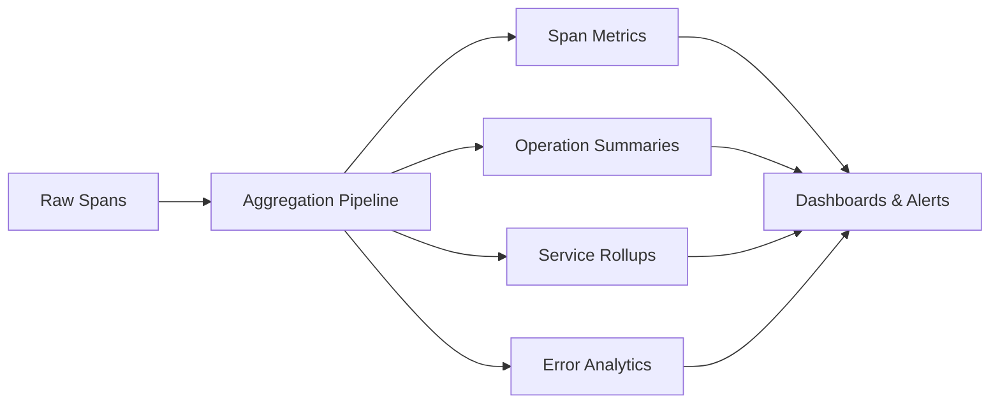
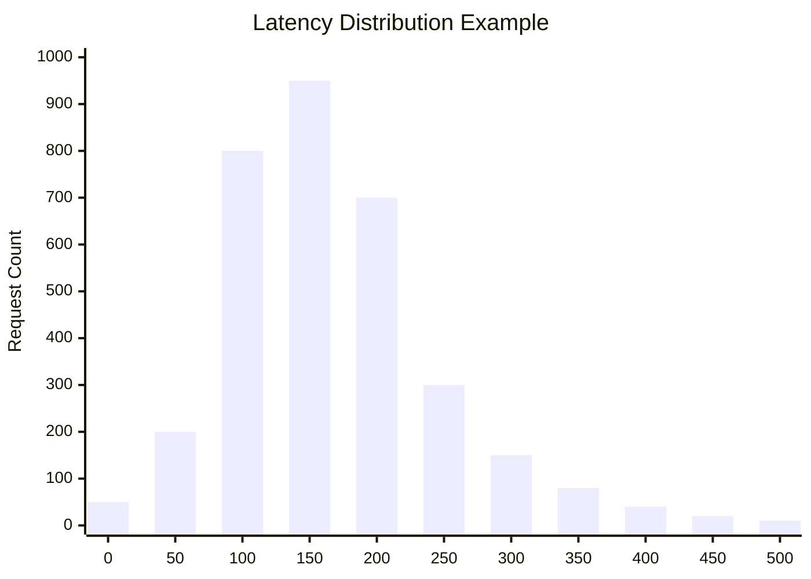
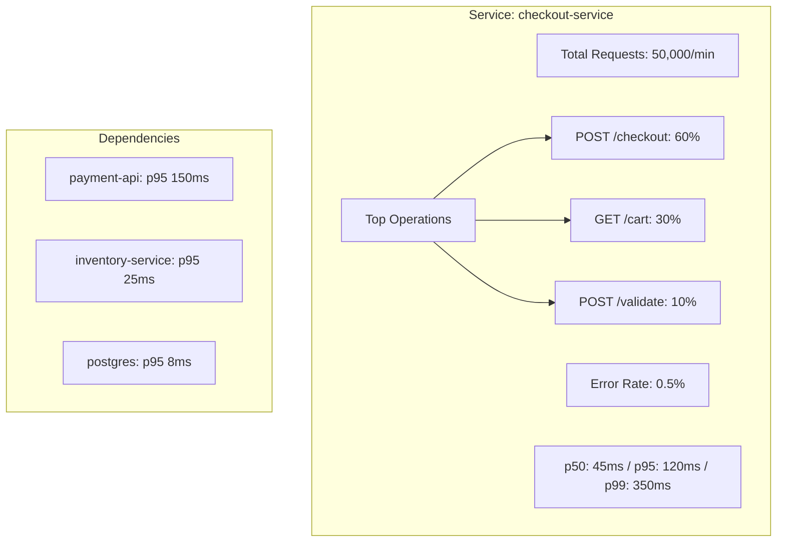
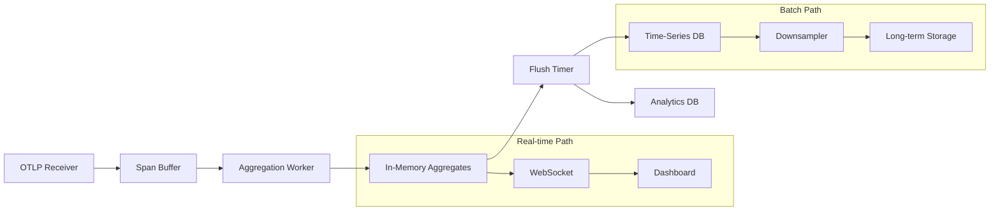

# How to Build Trace Aggregation

Author: [nawazdhandala](https://github.com/nawazdhandala)

Tags: Observability, Tracing, Analytics, Monitoring

Description: Learn how to aggregate trace data for performance analysis and trend identification.

---

> Individual traces show you what happened in a single request. **Trace aggregation shows you patterns across thousands of requests**, revealing trends, outliers, and systemic issues that individual traces can never surface.

Trace aggregation is the process of combining and summarizing distributed trace data to derive meaningful insights about system behavior over time. Instead of looking at traces one by one, aggregation lets you answer questions like:

- What is the p95 latency for the checkout service this week?
- Which operations are contributing most to overall system latency?
- How has the error rate for payment processing changed after the last deployment?

This guide walks through practical strategies for building trace aggregation pipelines, from span-level aggregation to service-level rollups.

---

## Table of Contents

1. Why Trace Aggregation Matters
2. Span Aggregation Strategies
3. Trace Grouping by Operation
4. Statistical Aggregation (p50, p95, p99)
5. Time-Based Aggregation
6. Service-Level Aggregation
7. Error Rate Aggregation from Traces
8. Building an Aggregation Pipeline
9. Storage Considerations
10. Query Patterns and Dashboards
11. Best Practices
12. Common Pitfalls

---

## 1. Why Trace Aggregation Matters

Raw traces are invaluable for debugging individual requests, but they become overwhelming at scale. A typical production system generates millions of spans per hour. Without aggregation, you face:

| Challenge | Impact |
|-----------|--------|
| Data overload | Cannot manually inspect millions of traces |
| Storage costs | Raw trace data is expensive to store long-term |
| Missing patterns | Individual traces hide systemic trends |
| Slow queries | Querying raw spans for analytics is slow |

Aggregation solves these problems by pre-computing summaries that answer common questions instantly.



---

## 2. Span Aggregation Strategies

Span aggregation transforms individual span records into statistical summaries. The key is choosing the right dimensions for grouping.

### Core Dimensions for Span Aggregation

| Dimension | Description | Example Values |
|-----------|-------------|----------------|
| Service Name | The service that produced the span | `checkout-service`, `payment-api` |
| Operation Name | The span name/operation | `db.query`, `http.request`, `cache.get` |
| Span Kind | SERVER, CLIENT, INTERNAL, PRODUCER, CONSUMER | Used for filtering entry points vs dependencies |
| Status Code | OK, ERROR, UNSET | Critical for error rate calculations |
| Time Bucket | Aggregation window | 1 minute, 5 minutes, 1 hour |

### Basic Span Aggregation in TypeScript

```typescript
// span-aggregator.ts
interface SpanRecord {
  traceId: string;
  spanId: string;
  serviceName: string;
  operationName: string;
  startTime: number;
  endTime: number;
  status: 'OK' | 'ERROR' | 'UNSET';
  attributes: Record<string, any>;
}

interface AggregatedMetrics {
  count: number;
  errorCount: number;
  durations: number[];
  minDuration: number;
  maxDuration: number;
  sumDuration: number;
}

interface AggregationKey {
  serviceName: string;
  operationName: string;
  timeBucket: number;
}

class SpanAggregator {
  private aggregations: Map<string, AggregatedMetrics> = new Map();
  private bucketSizeMs: number;

  constructor(bucketSizeMs: number = 60000) { // 1 minute default
    this.bucketSizeMs = bucketSizeMs;
  }

  private getTimeBucket(timestamp: number): number {
    return Math.floor(timestamp / this.bucketSizeMs) * this.bucketSizeMs;
  }

  private getKey(span: SpanRecord): string {
    const bucket = this.getTimeBucket(span.startTime);
    return `${span.serviceName}|${span.operationName}|${bucket}`;
  }

  aggregate(span: SpanRecord): void {
    const key = this.getKey(span);
    const duration = span.endTime - span.startTime;

    let metrics = this.aggregations.get(key);
    if (!metrics) {
      metrics = {
        count: 0,
        errorCount: 0,
        durations: [],
        minDuration: Infinity,
        maxDuration: -Infinity,
        sumDuration: 0,
      };
      this.aggregations.set(key, metrics);
    }

    metrics.count++;
    metrics.durations.push(duration);
    metrics.sumDuration += duration;
    metrics.minDuration = Math.min(metrics.minDuration, duration);
    metrics.maxDuration = Math.max(metrics.maxDuration, duration);

    if (span.status === 'ERROR') {
      metrics.errorCount++;
    }
  }

  getAggregations(): Map<string, AggregatedMetrics> {
    return this.aggregations;
  }

  flush(): Map<string, AggregatedMetrics> {
    const result = this.aggregations;
    this.aggregations = new Map();
    return result;
  }
}
```

### Memory-Efficient Aggregation with t-digest

For high-volume systems, storing all durations for percentile calculation is impractical. Use approximate algorithms like t-digest:

```typescript
// Using tdigest library for memory-efficient percentiles
import TDigest from 'tdigest';

interface StreamingMetrics {
  count: number;
  errorCount: number;
  digest: TDigest;
  minDuration: number;
  maxDuration: number;
  sumDuration: number;
}

class StreamingSpanAggregator {
  private aggregations: Map<string, StreamingMetrics> = new Map();
  private bucketSizeMs: number;

  constructor(bucketSizeMs: number = 60000) {
    this.bucketSizeMs = bucketSizeMs;
  }

  private getKey(serviceName: string, operationName: string, timestamp: number): string {
    const bucket = Math.floor(timestamp / this.bucketSizeMs) * this.bucketSizeMs;
    return `${serviceName}|${operationName}|${bucket}`;
  }

  aggregate(span: SpanRecord): void {
    const key = this.getKey(span.serviceName, span.operationName, span.startTime);
    const duration = span.endTime - span.startTime;

    let metrics = this.aggregations.get(key);
    if (!metrics) {
      metrics = {
        count: 0,
        errorCount: 0,
        digest: new TDigest(),
        minDuration: Infinity,
        maxDuration: -Infinity,
        sumDuration: 0,
      };
      this.aggregations.set(key, metrics);
    }

    metrics.count++;
    metrics.digest.push(duration);
    metrics.sumDuration += duration;
    metrics.minDuration = Math.min(metrics.minDuration, duration);
    metrics.maxDuration = Math.max(metrics.maxDuration, duration);

    if (span.status === 'ERROR') {
      metrics.errorCount++;
    }
  }

  getPercentile(key: string, percentile: number): number | null {
    const metrics = this.aggregations.get(key);
    if (!metrics) return null;
    return metrics.digest.percentile(percentile);
  }
}
```

---

## 3. Trace Grouping by Operation

Grouping traces by operation allows you to compare the same logical workflow across many executions. This reveals whether specific operations consistently underperform.

### Operation-Based Trace Grouping

```mermaid
flowchart TD
    subgraph "Trace 1: /checkout"
        A1[HTTP POST /checkout] --> B1[validate.cart]
        B1 --> C1[inventory.reserve]
        C1 --> D1[payment.process]
    end

    subgraph "Trace 2: /checkout"
        A2[HTTP POST /checkout] --> B2[validate.cart]
        B2 --> C2[inventory.reserve]
        C2 --> D2[payment.process]
    end

    subgraph "Aggregated View"
        E[/checkout endpoint]
        E --> F["validate.cart: avg 5ms"]
        E --> G["inventory.reserve: avg 25ms"]
        E --> H["payment.process: avg 150ms"]
    end
```

### Implementation: Operation Trace Grouper

```typescript
// operation-grouper.ts
interface TraceSpan {
  traceId: string;
  spanId: string;
  parentSpanId?: string;
  operationName: string;
  serviceName: string;
  startTime: number;
  endTime: number;
  status: 'OK' | 'ERROR' | 'UNSET';
}

interface OperationStats {
  operationName: string;
  serviceName: string;
  avgDuration: number;
  p50Duration: number;
  p95Duration: number;
  p99Duration: number;
  callCount: number;
  errorRate: number;
  children: Map<string, OperationStats>;
}

interface TraceTemplate {
  rootOperation: string;
  operationSequence: string[];
}

class OperationGrouper {
  private operationDurations: Map<string, number[]> = new Map();
  private operationErrors: Map<string, number> = new Map();
  private operationCounts: Map<string, number> = new Map();
  private traceTemplates: Map<string, TraceTemplate[]> = new Map();

  // Extract a normalized "template" from a trace for grouping similar traces
  extractTemplate(spans: TraceSpan[]): TraceTemplate {
    // Find root span
    const rootSpan = spans.find(s => !s.parentSpanId);
    if (!rootSpan) {
      throw new Error('No root span found');
    }

    // Build operation sequence (breadth-first)
    const sequence: string[] = [];
    const spanMap = new Map(spans.map(s => [s.spanId, s]));
    const childrenMap = new Map<string, TraceSpan[]>();

    for (const span of spans) {
      if (span.parentSpanId) {
        const children = childrenMap.get(span.parentSpanId) || [];
        children.push(span);
        childrenMap.set(span.parentSpanId, children);
      }
    }

    // BFS to get operation sequence
    const queue = [rootSpan];
    while (queue.length > 0) {
      const current = queue.shift()!;
      sequence.push(`${current.serviceName}:${current.operationName}`);
      const children = childrenMap.get(current.spanId) || [];
      // Sort children by start time for consistent ordering
      children.sort((a, b) => a.startTime - b.startTime);
      queue.push(...children);
    }

    return {
      rootOperation: `${rootSpan.serviceName}:${rootSpan.operationName}`,
      operationSequence: sequence,
    };
  }

  // Generate a hash for grouping similar trace structures
  getTemplateHash(template: TraceTemplate): string {
    return template.operationSequence.join(' -> ');
  }

  processTrace(spans: TraceSpan[]): void {
    // Aggregate per-operation stats
    for (const span of spans) {
      const key = `${span.serviceName}:${span.operationName}`;
      const duration = span.endTime - span.startTime;

      // Track durations
      const durations = this.operationDurations.get(key) || [];
      durations.push(duration);
      this.operationDurations.set(key, durations);

      // Track counts
      this.operationCounts.set(key, (this.operationCounts.get(key) || 0) + 1);

      // Track errors
      if (span.status === 'ERROR') {
        this.operationErrors.set(key, (this.operationErrors.get(key) || 0) + 1);
      }
    }

    // Track trace templates for pattern analysis
    const template = this.extractTemplate(spans);
    const hash = this.getTemplateHash(template);
    const templates = this.traceTemplates.get(hash) || [];
    templates.push(template);
    this.traceTemplates.set(hash, templates);
  }

  getOperationStats(operationKey: string): OperationStats | null {
    const durations = this.operationDurations.get(operationKey);
    if (!durations || durations.length === 0) return null;

    const sorted = [...durations].sort((a, b) => a - b);
    const count = this.operationCounts.get(operationKey) || 0;
    const errors = this.operationErrors.get(operationKey) || 0;

    const [serviceName, operationName] = operationKey.split(':');

    return {
      operationName,
      serviceName,
      avgDuration: durations.reduce((a, b) => a + b, 0) / durations.length,
      p50Duration: this.percentile(sorted, 0.5),
      p95Duration: this.percentile(sorted, 0.95),
      p99Duration: this.percentile(sorted, 0.99),
      callCount: count,
      errorRate: count > 0 ? errors / count : 0,
      children: new Map(), // Populated separately if needed
    };
  }

  private percentile(sortedArray: number[], p: number): number {
    const index = Math.ceil(p * sortedArray.length) - 1;
    return sortedArray[Math.max(0, index)];
  }

  // Find the most common trace patterns
  getCommonPatterns(topN: number = 10): Array<{ pattern: string; count: number }> {
    const patterns = Array.from(this.traceTemplates.entries())
      .map(([pattern, templates]) => ({ pattern, count: templates.length }))
      .sort((a, b) => b.count - a.count)
      .slice(0, topN);

    return patterns;
  }
}
```

---

## 4. Statistical Aggregation (p50, p95, p99)

Percentile metrics are essential for understanding latency distribution. The mean hides outliers; percentiles expose them.

### Why Percentiles Matter

| Metric | What It Tells You |
|--------|-------------------|
| p50 (median) | The typical user experience - 50% of requests are faster |
| p95 | The experience for most users - only 5% are slower |
| p99 | The worst-case for almost everyone - only 1% are slower |
| p99.9 | Edge cases that might indicate serious issues |



### Computing Percentiles Efficiently

```typescript
// percentile-calculator.ts
interface PercentileResult {
  p50: number;
  p75: number;
  p90: number;
  p95: number;
  p99: number;
  p999: number;
  min: number;
  max: number;
  avg: number;
  count: number;
}

class PercentileCalculator {
  // Exact calculation for small datasets
  static calculateExact(values: number[]): PercentileResult {
    if (values.length === 0) {
      return {
        p50: 0, p75: 0, p90: 0, p95: 0, p99: 0, p999: 0,
        min: 0, max: 0, avg: 0, count: 0
      };
    }

    const sorted = [...values].sort((a, b) => a - b);
    const sum = sorted.reduce((a, b) => a + b, 0);

    const getPercentile = (p: number): number => {
      const index = Math.ceil(p * sorted.length) - 1;
      return sorted[Math.max(0, index)];
    };

    return {
      p50: getPercentile(0.50),
      p75: getPercentile(0.75),
      p90: getPercentile(0.90),
      p95: getPercentile(0.95),
      p99: getPercentile(0.99),
      p999: getPercentile(0.999),
      min: sorted[0],
      max: sorted[sorted.length - 1],
      avg: sum / sorted.length,
      count: sorted.length,
    };
  }

  // Histogram-based approximation for large datasets
  static calculateFromHistogram(
    buckets: { le: number; count: number }[]
  ): PercentileResult {
    // Buckets should be cumulative counts with upper bounds
    // Example: [{le: 10, count: 100}, {le: 50, count: 500}, ...]

    const totalCount = buckets[buckets.length - 1]?.count || 0;
    if (totalCount === 0) {
      return {
        p50: 0, p75: 0, p90: 0, p95: 0, p99: 0, p999: 0,
        min: 0, max: 0, avg: 0, count: 0
      };
    }

    const getPercentileFromHistogram = (p: number): number => {
      const targetCount = p * totalCount;
      let prevBound = 0;
      let prevCount = 0;

      for (const bucket of buckets) {
        if (bucket.count >= targetCount) {
          // Linear interpolation within bucket
          const bucketRange = bucket.le - prevBound;
          const countInBucket = bucket.count - prevCount;
          const targetInBucket = targetCount - prevCount;
          const fraction = countInBucket > 0 ? targetInBucket / countInBucket : 0;
          return prevBound + (fraction * bucketRange);
        }
        prevBound = bucket.le;
        prevCount = bucket.count;
      }

      return buckets[buckets.length - 1]?.le || 0;
    };

    // Estimate min/max/avg from histogram (approximations)
    const minBucket = buckets.find(b => b.count > 0);
    const maxBucket = buckets[buckets.length - 1];

    return {
      p50: getPercentileFromHistogram(0.50),
      p75: getPercentileFromHistogram(0.75),
      p90: getPercentileFromHistogram(0.90),
      p95: getPercentileFromHistogram(0.95),
      p99: getPercentileFromHistogram(0.99),
      p999: getPercentileFromHistogram(0.999),
      min: minBucket ? buckets[0].le / 2 : 0, // Approximation
      max: maxBucket?.le || 0,
      avg: 0, // Would need bucket midpoints for estimate
      count: totalCount,
    };
  }
}

// Usage with OpenTelemetry histogram buckets
const histogramBuckets = [
  { le: 5, count: 100 },
  { le: 10, count: 350 },
  { le: 25, count: 800 },
  { le: 50, count: 950 },
  { le: 100, count: 990 },
  { le: 250, count: 998 },
  { le: 500, count: 1000 },
];

const percentiles = PercentileCalculator.calculateFromHistogram(histogramBuckets);
console.log(`p95 latency: ${percentiles.p95}ms`);
```

### Rolling Percentiles for Time Windows

```typescript
// rolling-percentiles.ts
interface TimeWindow {
  startTime: number;
  endTime: number;
  values: number[];
}

class RollingPercentileTracker {
  private windows: TimeWindow[] = [];
  private windowSizeMs: number;
  private retentionMs: number;

  constructor(windowSizeMs: number = 60000, retentionMs: number = 3600000) {
    this.windowSizeMs = windowSizeMs;
    this.retentionMs = retentionMs;
  }

  private getCurrentWindow(timestamp: number): TimeWindow {
    const windowStart = Math.floor(timestamp / this.windowSizeMs) * this.windowSizeMs;

    let window = this.windows.find(w => w.startTime === windowStart);
    if (!window) {
      window = {
        startTime: windowStart,
        endTime: windowStart + this.windowSizeMs,
        values: [],
      };
      this.windows.push(window);
      this.cleanup(timestamp);
    }

    return window;
  }

  private cleanup(currentTime: number): void {
    const cutoff = currentTime - this.retentionMs;
    this.windows = this.windows.filter(w => w.endTime > cutoff);
  }

  record(value: number, timestamp: number = Date.now()): void {
    const window = this.getCurrentWindow(timestamp);
    window.values.push(value);
  }

  getPercentilesForRange(
    startTime: number,
    endTime: number
  ): PercentileResult {
    const relevantWindows = this.windows.filter(
      w => w.startTime >= startTime && w.endTime <= endTime
    );

    const allValues = relevantWindows.flatMap(w => w.values);
    return PercentileCalculator.calculateExact(allValues);
  }

  // Get percentiles for the last N minutes
  getRecentPercentiles(minutes: number): PercentileResult {
    const now = Date.now();
    const startTime = now - (minutes * 60000);
    return this.getPercentilesForRange(startTime, now);
  }
}
```

---

## 5. Time-Based Aggregation

Time-based aggregation groups metrics into consistent time buckets, enabling trend analysis and anomaly detection.

### Time Bucket Strategies

| Bucket Size | Use Case | Retention |
|-------------|----------|-----------|
| 1 second | Real-time dashboards | Hours |
| 1 minute | Alerting, detailed analysis | Days |
| 5 minutes | Standard monitoring | Weeks |
| 1 hour | Trend analysis | Months |
| 1 day | Capacity planning | Years |

### Multi-Resolution Time Series Aggregation

```typescript
// time-series-aggregator.ts
interface TimeSeriesPoint {
  timestamp: number;
  value: number;
}

interface AggregatedBucket {
  timestamp: number;
  count: number;
  sum: number;
  min: number;
  max: number;
  avg: number;
}

interface MultiResolutionConfig {
  resolution: number; // milliseconds
  retention: number;  // milliseconds
}

class MultiResolutionAggregator {
  private resolutions: Map<number, Map<string, AggregatedBucket[]>> = new Map();
  private configs: MultiResolutionConfig[];

  constructor(configs: MultiResolutionConfig[]) {
    this.configs = configs.sort((a, b) => a.resolution - b.resolution);
    for (const config of this.configs) {
      this.resolutions.set(config.resolution, new Map());
    }
  }

  private getBucketTimestamp(timestamp: number, resolution: number): number {
    return Math.floor(timestamp / resolution) * resolution;
  }

  record(metricKey: string, value: number, timestamp: number = Date.now()): void {
    for (const config of this.configs) {
      const bucketTs = this.getBucketTimestamp(timestamp, config.resolution);
      const buckets = this.resolutions.get(config.resolution)!;

      let metricBuckets = buckets.get(metricKey);
      if (!metricBuckets) {
        metricBuckets = [];
        buckets.set(metricKey, metricBuckets);
      }

      // Find or create bucket
      let bucket = metricBuckets.find(b => b.timestamp === bucketTs);
      if (!bucket) {
        bucket = {
          timestamp: bucketTs,
          count: 0,
          sum: 0,
          min: Infinity,
          max: -Infinity,
          avg: 0,
        };
        metricBuckets.push(bucket);

        // Cleanup old buckets
        const cutoff = timestamp - config.retention;
        const filtered = metricBuckets.filter(b => b.timestamp >= cutoff);
        buckets.set(metricKey, filtered);
      }

      // Update bucket
      bucket.count++;
      bucket.sum += value;
      bucket.min = Math.min(bucket.min, value);
      bucket.max = Math.max(bucket.max, value);
      bucket.avg = bucket.sum / bucket.count;
    }
  }

  query(
    metricKey: string,
    startTime: number,
    endTime: number,
    resolution?: number
  ): AggregatedBucket[] {
    // Auto-select resolution based on time range
    const range = endTime - startTime;
    const selectedResolution = resolution || this.selectResolution(range);

    const buckets = this.resolutions.get(selectedResolution);
    if (!buckets) return [];

    const metricBuckets = buckets.get(metricKey) || [];
    return metricBuckets
      .filter(b => b.timestamp >= startTime && b.timestamp <= endTime)
      .sort((a, b) => a.timestamp - b.timestamp);
  }

  private selectResolution(rangeMs: number): number {
    // Target ~100-200 data points
    const targetPoints = 150;
    const idealResolution = rangeMs / targetPoints;

    // Find closest available resolution
    for (const config of this.configs) {
      if (config.resolution >= idealResolution) {
        return config.resolution;
      }
    }

    return this.configs[this.configs.length - 1].resolution;
  }
}

// Example configuration
const aggregator = new MultiResolutionAggregator([
  { resolution: 1000, retention: 3600000 },      // 1s buckets, 1h retention
  { resolution: 60000, retention: 86400000 },    // 1m buckets, 24h retention
  { resolution: 300000, retention: 604800000 },  // 5m buckets, 7d retention
  { resolution: 3600000, retention: 2592000000 },// 1h buckets, 30d retention
]);

// Record span durations
aggregator.record('checkout-service:http.request', 125);
aggregator.record('checkout-service:http.request', 142);
aggregator.record('checkout-service:db.query', 15);
```

### Downsampling for Long-Term Storage

```typescript
// downsampler.ts
interface DownsampleConfig {
  sourceResolution: number;
  targetResolution: number;
  aggregationMethod: 'avg' | 'sum' | 'min' | 'max' | 'last';
}

class Downsampler {
  static downsample(
    buckets: AggregatedBucket[],
    config: DownsampleConfig
  ): AggregatedBucket[] {
    const ratio = config.targetResolution / config.sourceResolution;
    const grouped = new Map<number, AggregatedBucket[]>();

    // Group source buckets into target buckets
    for (const bucket of buckets) {
      const targetTs = Math.floor(bucket.timestamp / config.targetResolution)
                       * config.targetResolution;
      const group = grouped.get(targetTs) || [];
      group.push(bucket);
      grouped.set(targetTs, group);
    }

    // Aggregate each group
    const result: AggregatedBucket[] = [];
    for (const [timestamp, group] of grouped) {
      const aggregated: AggregatedBucket = {
        timestamp,
        count: group.reduce((sum, b) => sum + b.count, 0),
        sum: group.reduce((sum, b) => sum + b.sum, 0),
        min: Math.min(...group.map(b => b.min)),
        max: Math.max(...group.map(b => b.max)),
        avg: 0,
      };

      switch (config.aggregationMethod) {
        case 'avg':
          aggregated.avg = aggregated.sum / aggregated.count;
          break;
        case 'sum':
          aggregated.avg = aggregated.sum;
          break;
        case 'min':
          aggregated.avg = aggregated.min;
          break;
        case 'max':
          aggregated.avg = aggregated.max;
          break;
        case 'last':
          aggregated.avg = group[group.length - 1].avg;
          break;
      }

      result.push(aggregated);
    }

    return result.sort((a, b) => a.timestamp - b.timestamp);
  }
}
```

---

## 6. Service-Level Aggregation

Service-level aggregation provides a high-level view of each service's health and performance, rolling up all operations within a service.

### Service Health Dashboard Data Model



### Service Aggregation Implementation

```typescript
// service-aggregator.ts
interface ServiceMetrics {
  serviceName: string;
  timestamp: number;

  // Request metrics
  requestCount: number;
  errorCount: number;
  errorRate: number;

  // Latency metrics
  latencyP50: number;
  latencyP95: number;
  latencyP99: number;
  latencyAvg: number;

  // Throughput
  requestsPerSecond: number;

  // Operation breakdown
  operationBreakdown: Map<string, {
    count: number;
    errorRate: number;
    avgLatency: number;
  }>;

  // Dependency metrics (outbound calls)
  dependencies: Map<string, {
    callCount: number;
    errorRate: number;
    latencyP95: number;
  }>;
}

class ServiceAggregator {
  private serviceData: Map<string, {
    spans: TraceSpan[];
    inboundSpans: TraceSpan[];
    outboundSpans: TraceSpan[];
  }> = new Map();

  processSpan(span: TraceSpan & { spanKind: string }): void {
    let data = this.serviceData.get(span.serviceName);
    if (!data) {
      data = { spans: [], inboundSpans: [], outboundSpans: [] };
      this.serviceData.set(span.serviceName, data);
    }

    data.spans.push(span);

    // Categorize by span kind for dependency analysis
    if (span.spanKind === 'SERVER' || span.spanKind === 'CONSUMER') {
      data.inboundSpans.push(span);
    } else if (span.spanKind === 'CLIENT' || span.spanKind === 'PRODUCER') {
      data.outboundSpans.push(span);
    }
  }

  computeServiceMetrics(
    serviceName: string,
    windowStart: number,
    windowEnd: number
  ): ServiceMetrics | null {
    const data = this.serviceData.get(serviceName);
    if (!data) return null;

    const windowMs = windowEnd - windowStart;

    // Filter spans within window
    const inWindow = data.inboundSpans.filter(
      s => s.startTime >= windowStart && s.startTime < windowEnd
    );

    if (inWindow.length === 0) {
      return null;
    }

    // Calculate latencies
    const durations = inWindow.map(s => s.endTime - s.startTime);
    const sorted = [...durations].sort((a, b) => a - b);
    const errors = inWindow.filter(s => s.status === 'ERROR').length;

    // Operation breakdown
    const operationBreakdown = new Map<string, {
      count: number;
      errorRate: number;
      avgLatency: number;
    }>();

    const byOperation = new Map<string, TraceSpan[]>();
    for (const span of inWindow) {
      const ops = byOperation.get(span.operationName) || [];
      ops.push(span);
      byOperation.set(span.operationName, ops);
    }

    for (const [opName, spans] of byOperation) {
      const opErrors = spans.filter(s => s.status === 'ERROR').length;
      const opDurations = spans.map(s => s.endTime - s.startTime);
      operationBreakdown.set(opName, {
        count: spans.length,
        errorRate: opErrors / spans.length,
        avgLatency: opDurations.reduce((a, b) => a + b, 0) / spans.length,
      });
    }

    // Dependency analysis from outbound spans
    const outboundInWindow = data.outboundSpans.filter(
      s => s.startTime >= windowStart && s.startTime < windowEnd
    );

    const dependencies = new Map<string, {
      callCount: number;
      errorRate: number;
      latencyP95: number;
    }>();

    // Group outbound calls by target service (from span attributes)
    const byDependency = new Map<string, TraceSpan[]>();
    for (const span of outboundInWindow) {
      // Dependency name could come from attributes like peer.service
      // Using operation name as fallback
      const depName = span.operationName.split('.')[0]; // Simplified
      const deps = byDependency.get(depName) || [];
      deps.push(span);
      byDependency.set(depName, deps);
    }

    for (const [depName, spans] of byDependency) {
      const depErrors = spans.filter(s => s.status === 'ERROR').length;
      const depDurations = spans.map(s => s.endTime - s.startTime).sort((a, b) => a - b);
      const p95Index = Math.ceil(0.95 * depDurations.length) - 1;

      dependencies.set(depName, {
        callCount: spans.length,
        errorRate: depErrors / spans.length,
        latencyP95: depDurations[Math.max(0, p95Index)] || 0,
      });
    }

    return {
      serviceName,
      timestamp: windowStart,
      requestCount: inWindow.length,
      errorCount: errors,
      errorRate: errors / inWindow.length,
      latencyP50: sorted[Math.floor(sorted.length * 0.5)] || 0,
      latencyP95: sorted[Math.floor(sorted.length * 0.95)] || 0,
      latencyP99: sorted[Math.floor(sorted.length * 0.99)] || 0,
      latencyAvg: durations.reduce((a, b) => a + b, 0) / durations.length,
      requestsPerSecond: inWindow.length / (windowMs / 1000),
      operationBreakdown,
      dependencies,
    };
  }
}
```

### Service Topology from Traces

```typescript
// service-topology.ts
interface ServiceEdge {
  source: string;
  target: string;
  callCount: number;
  errorRate: number;
  avgLatency: number;
}

interface ServiceNode {
  name: string;
  requestCount: number;
  errorRate: number;
}

class ServiceTopologyBuilder {
  private edges: Map<string, ServiceEdge> = new Map();
  private nodes: Map<string, ServiceNode> = new Map();

  processTrace(spans: (TraceSpan & { spanKind: string })[]): void {
    const spanMap = new Map(spans.map(s => [s.spanId, s]));

    for (const span of spans) {
      // Track nodes
      let node = this.nodes.get(span.serviceName);
      if (!node) {
        node = { name: span.serviceName, requestCount: 0, errorRate: 0 };
        this.nodes.set(span.serviceName, node);
      }

      // Only count inbound requests for node metrics
      if (span.spanKind === 'SERVER') {
        node.requestCount++;
      }

      // Track edges (parent -> child relationships across services)
      if (span.parentSpanId) {
        const parentSpan = spanMap.get(span.parentSpanId);
        if (parentSpan && parentSpan.serviceName !== span.serviceName) {
          const edgeKey = `${parentSpan.serviceName}->${span.serviceName}`;

          let edge = this.edges.get(edgeKey);
          if (!edge) {
            edge = {
              source: parentSpan.serviceName,
              target: span.serviceName,
              callCount: 0,
              errorRate: 0,
              avgLatency: 0,
            };
            this.edges.set(edgeKey, edge);
          }

          const duration = span.endTime - span.startTime;
          edge.avgLatency = (edge.avgLatency * edge.callCount + duration) / (edge.callCount + 1);
          edge.callCount++;
        }
      }
    }
  }

  getTopology(): { nodes: ServiceNode[]; edges: ServiceEdge[] } {
    return {
      nodes: Array.from(this.nodes.values()),
      edges: Array.from(this.edges.values()),
    };
  }

  // Export as DOT format for visualization
  toDotFormat(): string {
    let dot = 'digraph ServiceTopology {\n';
    dot += '  rankdir=LR;\n';
    dot += '  node [shape=box];\n\n';

    for (const node of this.nodes.values()) {
      const color = node.errorRate > 0.05 ? 'red' : 'green';
      dot += `  "${node.name}" [label="${node.name}\\n${node.requestCount} req", color=${color}];\n`;
    }

    dot += '\n';

    for (const edge of this.edges.values()) {
      dot += `  "${edge.source}" -> "${edge.target}" [label="${edge.callCount} calls\\n${edge.avgLatency.toFixed(1)}ms"];\n`;
    }

    dot += '}\n';
    return dot;
  }
}
```

---

## 7. Error Rate Aggregation from Traces

Error rate tracking from traces provides richer context than simple error counters because you can correlate errors with specific operations, services, and request patterns.

### Error Classification and Aggregation

```typescript
// error-aggregator.ts
interface ErrorClassification {
  category: string;      // e.g., 'http_4xx', 'http_5xx', 'timeout', 'connection'
  subcategory?: string;  // e.g., '404', '500', 'ETIMEDOUT'
  message: string;
}

interface ErrorAggregation {
  serviceName: string;
  operationName: string;
  timeBucket: number;

  totalRequests: number;
  totalErrors: number;
  errorRate: number;

  // Breakdown by error type
  errorsByCategory: Map<string, {
    count: number;
    percentage: number;
    examples: string[];  // Sample error messages
  }>;

  // Affected trace IDs for investigation
  sampleTraceIds: string[];
}

class ErrorAggregator {
  private aggregations: Map<string, ErrorAggregation> = new Map();
  private bucketSizeMs: number;
  private maxExamples: number;

  constructor(bucketSizeMs: number = 60000, maxExamples: number = 5) {
    this.bucketSizeMs = bucketSizeMs;
    this.maxExamples = maxExamples;
  }

  private classifyError(span: TraceSpan & { attributes?: Record<string, any> }): ErrorClassification {
    const attrs = span.attributes || {};

    // HTTP errors
    const httpStatus = attrs['http.status_code'];
    if (httpStatus) {
      if (httpStatus >= 400 && httpStatus < 500) {
        return {
          category: 'http_4xx',
          subcategory: String(httpStatus),
          message: attrs['http.error_message'] || `HTTP ${httpStatus}`,
        };
      }
      if (httpStatus >= 500) {
        return {
          category: 'http_5xx',
          subcategory: String(httpStatus),
          message: attrs['http.error_message'] || `HTTP ${httpStatus}`,
        };
      }
    }

    // Database errors
    const dbError = attrs['db.error'];
    if (dbError) {
      return {
        category: 'database',
        subcategory: attrs['db.error_code'],
        message: dbError,
      };
    }

    // Timeout errors
    const errorMessage = attrs['error.message'] || attrs['exception.message'] || '';
    if (errorMessage.toLowerCase().includes('timeout') ||
        errorMessage.includes('ETIMEDOUT')) {
      return {
        category: 'timeout',
        message: errorMessage,
      };
    }

    // Connection errors
    if (errorMessage.includes('ECONNREFUSED') ||
        errorMessage.includes('ECONNRESET') ||
        errorMessage.toLowerCase().includes('connection')) {
      return {
        category: 'connection',
        message: errorMessage,
      };
    }

    // Generic/unknown errors
    return {
      category: 'unknown',
      message: errorMessage || 'Unknown error',
    };
  }

  processSpan(span: TraceSpan & { attributes?: Record<string, any> }): void {
    const bucket = Math.floor(span.startTime / this.bucketSizeMs) * this.bucketSizeMs;
    const key = `${span.serviceName}|${span.operationName}|${bucket}`;

    let agg = this.aggregations.get(key);
    if (!agg) {
      agg = {
        serviceName: span.serviceName,
        operationName: span.operationName,
        timeBucket: bucket,
        totalRequests: 0,
        totalErrors: 0,
        errorRate: 0,
        errorsByCategory: new Map(),
        sampleTraceIds: [],
      };
      this.aggregations.set(key, agg);
    }

    agg.totalRequests++;

    if (span.status === 'ERROR') {
      agg.totalErrors++;

      // Classify and track error
      const classification = this.classifyError(span);
      let categoryData = agg.errorsByCategory.get(classification.category);
      if (!categoryData) {
        categoryData = { count: 0, percentage: 0, examples: [] };
        agg.errorsByCategory.set(classification.category, categoryData);
      }

      categoryData.count++;
      if (categoryData.examples.length < this.maxExamples) {
        categoryData.examples.push(classification.message);
      }

      // Track sample trace IDs
      if (agg.sampleTraceIds.length < this.maxExamples) {
        agg.sampleTraceIds.push(span.traceId);
      }
    }

    // Update rates
    agg.errorRate = agg.totalErrors / agg.totalRequests;
    for (const [, data] of agg.errorsByCategory) {
      data.percentage = data.count / agg.totalErrors;
    }
  }

  // Get error rates across all operations for a service
  getServiceErrorSummary(
    serviceName: string,
    startTime: number,
    endTime: number
  ): {
    overallErrorRate: number;
    errorsByOperation: Map<string, number>;
    topErrors: Array<{ category: string; count: number }>;
  } {
    let totalRequests = 0;
    let totalErrors = 0;
    const errorsByOperation = new Map<string, number>();
    const errorCategories = new Map<string, number>();

    for (const [, agg] of this.aggregations) {
      if (agg.serviceName !== serviceName) continue;
      if (agg.timeBucket < startTime || agg.timeBucket >= endTime) continue;

      totalRequests += agg.totalRequests;
      totalErrors += agg.totalErrors;

      const currentOpErrors = errorsByOperation.get(agg.operationName) || 0;
      errorsByOperation.set(agg.operationName, currentOpErrors + agg.totalErrors);

      for (const [category, data] of agg.errorsByCategory) {
        const currentCount = errorCategories.get(category) || 0;
        errorCategories.set(category, currentCount + data.count);
      }
    }

    const topErrors = Array.from(errorCategories.entries())
      .map(([category, count]) => ({ category, count }))
      .sort((a, b) => b.count - a.count)
      .slice(0, 10);

    return {
      overallErrorRate: totalRequests > 0 ? totalErrors / totalRequests : 0,
      errorsByOperation,
      topErrors,
    };
  }
}
```

### Error Rate Alerting

```typescript
// error-alerter.ts
interface AlertRule {
  serviceName: string;
  operationName?: string;
  threshold: number;        // Error rate threshold (0-1)
  windowMinutes: number;    // Evaluation window
  minRequests: number;      // Minimum requests to trigger
}

interface Alert {
  rule: AlertRule;
  currentErrorRate: number;
  requestCount: number;
  timestamp: number;
  sampleTraceIds: string[];
}

class ErrorRateAlerter {
  private rules: AlertRule[] = [];
  private activeAlerts: Map<string, Alert> = new Map();
  private errorAggregator: ErrorAggregator;

  constructor(errorAggregator: ErrorAggregator) {
    this.errorAggregator = errorAggregator;
  }

  addRule(rule: AlertRule): void {
    this.rules.push(rule);
  }

  evaluate(currentTime: number = Date.now()): Alert[] {
    const newAlerts: Alert[] = [];

    for (const rule of this.rules) {
      const startTime = currentTime - (rule.windowMinutes * 60000);
      const summary = this.errorAggregator.getServiceErrorSummary(
        rule.serviceName,
        startTime,
        currentTime
      );

      // Check operation-specific or service-wide
      let errorRate: number;
      let requestCount: number;

      if (rule.operationName) {
        const opErrors = summary.errorsByOperation.get(rule.operationName) || 0;
        // Would need request count per operation - simplified here
        errorRate = summary.overallErrorRate;
        requestCount = opErrors;
      } else {
        errorRate = summary.overallErrorRate;
        requestCount = 0; // Would need to track this
      }

      // Check if threshold exceeded
      if (errorRate > rule.threshold && requestCount >= rule.minRequests) {
        const alertKey = `${rule.serviceName}:${rule.operationName || '*'}`;

        if (!this.activeAlerts.has(alertKey)) {
          const alert: Alert = {
            rule,
            currentErrorRate: errorRate,
            requestCount,
            timestamp: currentTime,
            sampleTraceIds: [],
          };

          this.activeAlerts.set(alertKey, alert);
          newAlerts.push(alert);
        }
      }
    }

    return newAlerts;
  }
}

// Usage
const errorAggregator = new ErrorAggregator();
const alerter = new ErrorRateAlerter(errorAggregator);

alerter.addRule({
  serviceName: 'checkout-service',
  threshold: 0.01,          // 1% error rate
  windowMinutes: 5,
  minRequests: 100,
});

alerter.addRule({
  serviceName: 'payment-api',
  operationName: 'charge',
  threshold: 0.005,         // 0.5% error rate for payments
  windowMinutes: 5,
  minRequests: 50,
});
```

---

## 8. Building an Aggregation Pipeline

A production-grade aggregation pipeline processes spans in real-time while maintaining multiple aggregation levels.

### Pipeline Architecture



### Complete Pipeline Implementation

```typescript
// aggregation-pipeline.ts
import { EventEmitter } from 'events';

interface PipelineConfig {
  flushIntervalMs: number;
  bufferSize: number;
  aggregationWindows: number[]; // e.g., [60000, 300000, 3600000]
}

interface AggregateOutput {
  timestamp: number;
  windowSize: number;
  serviceName: string;
  operationName: string;
  metrics: {
    count: number;
    errorCount: number;
    latencySum: number;
    latencyMin: number;
    latencyMax: number;
    latencyP50: number;
    latencyP95: number;
    latencyP99: number;
  };
}

class AggregationPipeline extends EventEmitter {
  private config: PipelineConfig;
  private buffer: TraceSpan[] = [];
  private aggregators: Map<number, SpanAggregator> = new Map();
  private flushTimer: NodeJS.Timeout | null = null;

  constructor(config: PipelineConfig) {
    super();
    this.config = config;

    // Initialize aggregators for each window size
    for (const window of config.aggregationWindows) {
      this.aggregators.set(window, new SpanAggregator(window));
    }
  }

  start(): void {
    this.flushTimer = setInterval(() => {
      this.flush();
    }, this.config.flushIntervalMs);
  }

  stop(): void {
    if (this.flushTimer) {
      clearInterval(this.flushTimer);
      this.flushTimer = null;
    }
    this.flush();
  }

  ingest(span: TraceSpan): void {
    // Add to buffer
    this.buffer.push(span);

    // Process immediately for real-time aggregation
    for (const aggregator of this.aggregators.values()) {
      aggregator.aggregate(span);
    }

    // Flush if buffer is full
    if (this.buffer.length >= this.config.bufferSize) {
      this.flush();
    }
  }

  ingestBatch(spans: TraceSpan[]): void {
    for (const span of spans) {
      this.ingest(span);
    }
  }

  private flush(): void {
    const outputs: AggregateOutput[] = [];

    for (const [windowSize, aggregator] of this.aggregators) {
      const aggregations = aggregator.flush();

      for (const [key, metrics] of aggregations) {
        const [serviceName, operationName, timestampStr] = key.split('|');
        const timestamp = parseInt(timestampStr, 10);

        // Calculate percentiles
        const sorted = [...metrics.durations].sort((a, b) => a - b);
        const getP = (p: number) => sorted[Math.ceil(p * sorted.length) - 1] || 0;

        outputs.push({
          timestamp,
          windowSize,
          serviceName,
          operationName,
          metrics: {
            count: metrics.count,
            errorCount: metrics.errorCount,
            latencySum: metrics.sumDuration,
            latencyMin: metrics.minDuration === Infinity ? 0 : metrics.minDuration,
            latencyMax: metrics.maxDuration === -Infinity ? 0 : metrics.maxDuration,
            latencyP50: getP(0.5),
            latencyP95: getP(0.95),
            latencyP99: getP(0.99),
          },
        });
      }
    }

    // Emit for downstream consumers
    if (outputs.length > 0) {
      this.emit('aggregates', outputs);
    }

    // Clear buffer
    this.buffer = [];
  }

  // Subscribe to real-time aggregates
  onAggregates(callback: (outputs: AggregateOutput[]) => void): void {
    this.on('aggregates', callback);
  }
}

// Usage example
const pipeline = new AggregationPipeline({
  flushIntervalMs: 10000,  // Flush every 10 seconds
  bufferSize: 10000,       // Or when buffer hits 10k spans
  aggregationWindows: [
    60000,     // 1 minute
    300000,    // 5 minutes
    3600000,   // 1 hour
  ],
});

pipeline.onAggregates(async (outputs) => {
  // Write to time-series database
  console.log(`Flushing ${outputs.length} aggregates`);

  for (const output of outputs) {
    // Example: write to InfluxDB, TimescaleDB, or Prometheus
    console.log(
      `[${new Date(output.timestamp).toISOString()}] ` +
      `${output.serviceName}:${output.operationName} ` +
      `count=${output.metrics.count} ` +
      `p95=${output.metrics.latencyP95}ms ` +
      `errors=${output.metrics.errorCount}`
    );
  }
});

pipeline.start();

// Simulate incoming spans
const sampleSpan: TraceSpan = {
  traceId: 'abc123',
  spanId: 'span1',
  serviceName: 'checkout-service',
  operationName: 'http.request',
  startTime: Date.now(),
  endTime: Date.now() + 125,
  status: 'OK',
};

pipeline.ingest(sampleSpan);
```

---

## 9. Storage Considerations

### Choosing the Right Storage Backend

| Storage Type | Best For | Examples |
|--------------|----------|----------|
| Time-Series DB | Metrics, percentiles, rates | TimescaleDB, InfluxDB, Prometheus |
| Column Store | High-cardinality analytics | ClickHouse, Druid |
| Document Store | Raw trace storage | Elasticsearch, MongoDB |
| Object Storage | Long-term archival | S3, GCS with Parquet |

### Schema Design for Aggregated Data

```sql
-- TimescaleDB/PostgreSQL schema for aggregated trace metrics
CREATE TABLE trace_aggregates (
    time TIMESTAMPTZ NOT NULL,
    service_name TEXT NOT NULL,
    operation_name TEXT NOT NULL,
    window_seconds INTEGER NOT NULL,

    -- Counts
    request_count BIGINT NOT NULL,
    error_count BIGINT NOT NULL,

    -- Latency statistics
    latency_sum_ms DOUBLE PRECISION NOT NULL,
    latency_min_ms DOUBLE PRECISION NOT NULL,
    latency_max_ms DOUBLE PRECISION NOT NULL,
    latency_p50_ms DOUBLE PRECISION NOT NULL,
    latency_p95_ms DOUBLE PRECISION NOT NULL,
    latency_p99_ms DOUBLE PRECISION NOT NULL,

    PRIMARY KEY (time, service_name, operation_name, window_seconds)
);

-- Convert to hypertable for efficient time-series queries
SELECT create_hypertable('trace_aggregates', 'time');

-- Create indexes for common query patterns
CREATE INDEX idx_trace_agg_service ON trace_aggregates (service_name, time DESC);
CREATE INDEX idx_trace_agg_operation ON trace_aggregates (operation_name, time DESC);

-- Continuous aggregate for hourly rollups
CREATE MATERIALIZED VIEW trace_aggregates_hourly
WITH (timescaledb.continuous) AS
SELECT
    time_bucket('1 hour', time) AS bucket,
    service_name,
    operation_name,
    SUM(request_count) AS request_count,
    SUM(error_count) AS error_count,
    SUM(latency_sum_ms) AS latency_sum_ms,
    MIN(latency_min_ms) AS latency_min_ms,
    MAX(latency_max_ms) AS latency_max_ms,
    -- Note: percentiles require special handling for re-aggregation
    AVG(latency_p95_ms) AS latency_p95_ms_approx
FROM trace_aggregates
WHERE window_seconds = 60
GROUP BY bucket, service_name, operation_name;
```

### ClickHouse Schema for High-Cardinality Data

```sql
-- ClickHouse schema for trace aggregates with high cardinality
CREATE TABLE trace_aggregates
(
    timestamp DateTime,
    service_name LowCardinality(String),
    operation_name String,
    environment LowCardinality(String),

    request_count UInt64,
    error_count UInt64,

    latency_sum Float64,
    latency_min Float64,
    latency_max Float64,

    -- Store histogram buckets for percentile calculation
    latency_histogram Array(Tuple(Float64, UInt64))
)
ENGINE = MergeTree()
PARTITION BY toYYYYMM(timestamp)
ORDER BY (service_name, operation_name, timestamp)
TTL timestamp + INTERVAL 90 DAY;

-- Materialized view for real-time aggregation
CREATE MATERIALIZED VIEW trace_aggregates_mv
ENGINE = SummingMergeTree()
PARTITION BY toYYYYMM(timestamp)
ORDER BY (service_name, operation_name, toStartOfMinute(timestamp))
AS SELECT
    toStartOfMinute(timestamp) AS timestamp,
    service_name,
    operation_name,
    sum(request_count) AS request_count,
    sum(error_count) AS error_count,
    sum(latency_sum) AS latency_sum,
    min(latency_min) AS latency_min,
    max(latency_max) AS latency_max
FROM trace_aggregates
GROUP BY timestamp, service_name, operation_name;
```

---

## 10. Query Patterns and Dashboards

### Common Analytical Queries

```typescript
// query-patterns.ts

interface QueryBuilder {
  // Service overview query
  getServiceOverview(serviceName: string, hours: number): string;

  // Operation comparison
  getOperationComparison(serviceName: string, operations: string[], hours: number): string;

  // Error analysis
  getErrorTrend(serviceName: string, days: number): string;

  // Latency percentiles over time
  getLatencyTrend(serviceName: string, operation: string, hours: number): string;
}

const sqlQueries: QueryBuilder = {
  getServiceOverview(serviceName: string, hours: number): string {
    return `
      SELECT
        time_bucket('5 minutes', time) AS bucket,
        SUM(request_count) AS requests,
        SUM(error_count) AS errors,
        SUM(error_count)::float / NULLIF(SUM(request_count), 0) AS error_rate,
        AVG(latency_p50_ms) AS p50,
        AVG(latency_p95_ms) AS p95,
        AVG(latency_p99_ms) AS p99
      FROM trace_aggregates
      WHERE service_name = '${serviceName}'
        AND time > NOW() - INTERVAL '${hours} hours'
        AND window_seconds = 60
      GROUP BY bucket
      ORDER BY bucket DESC
    `;
  },

  getOperationComparison(serviceName: string, operations: string[], hours: number): string {
    const opList = operations.map(o => `'${o}'`).join(', ');
    return `
      SELECT
        operation_name,
        SUM(request_count) AS total_requests,
        SUM(error_count)::float / NULLIF(SUM(request_count), 0) AS error_rate,
        AVG(latency_p50_ms) AS avg_p50,
        AVG(latency_p95_ms) AS avg_p95,
        PERCENTILE_CONT(0.95) WITHIN GROUP (ORDER BY latency_p95_ms) AS p95_of_p95
      FROM trace_aggregates
      WHERE service_name = '${serviceName}'
        AND operation_name IN (${opList})
        AND time > NOW() - INTERVAL '${hours} hours'
        AND window_seconds = 60
      GROUP BY operation_name
      ORDER BY total_requests DESC
    `;
  },

  getErrorTrend(serviceName: string, days: number): string {
    return `
      SELECT
        time_bucket('1 hour', time) AS bucket,
        SUM(error_count) AS errors,
        SUM(request_count) AS requests,
        SUM(error_count)::float / NULLIF(SUM(request_count), 0) * 100 AS error_rate_pct
      FROM trace_aggregates
      WHERE service_name = '${serviceName}'
        AND time > NOW() - INTERVAL '${days} days'
      GROUP BY bucket
      ORDER BY bucket
    `;
  },

  getLatencyTrend(serviceName: string, operation: string, hours: number): string {
    return `
      SELECT
        time_bucket('1 minute', time) AS bucket,
        AVG(latency_p50_ms) AS p50,
        AVG(latency_p95_ms) AS p95,
        AVG(latency_p99_ms) AS p99,
        MAX(latency_max_ms) AS max_latency
      FROM trace_aggregates
      WHERE service_name = '${serviceName}'
        AND operation_name = '${operation}'
        AND time > NOW() - INTERVAL '${hours} hours'
        AND window_seconds = 60
      GROUP BY bucket
      ORDER BY bucket
    `;
  },
};
```

### Dashboard Data Structure

```typescript
// dashboard-data.ts

interface DashboardPanel {
  id: string;
  title: string;
  type: 'timeseries' | 'stat' | 'table' | 'heatmap';
  query: string;
  refreshInterval: number;
}

interface ServiceDashboard {
  serviceName: string;
  panels: DashboardPanel[];
}

function createServiceDashboard(serviceName: string): ServiceDashboard {
  return {
    serviceName,
    panels: [
      {
        id: 'request-rate',
        title: 'Request Rate',
        type: 'timeseries',
        query: `
          SELECT time_bucket('1 minute', time) AS time,
                 SUM(request_count) / 60.0 AS rps
          FROM trace_aggregates
          WHERE service_name = '${serviceName}'
            AND time > NOW() - INTERVAL '1 hour'
          GROUP BY 1 ORDER BY 1
        `,
        refreshInterval: 10000,
      },
      {
        id: 'error-rate',
        title: 'Error Rate (%)',
        type: 'timeseries',
        query: `
          SELECT time_bucket('1 minute', time) AS time,
                 SUM(error_count)::float / NULLIF(SUM(request_count), 0) * 100 AS error_rate
          FROM trace_aggregates
          WHERE service_name = '${serviceName}'
            AND time > NOW() - INTERVAL '1 hour'
          GROUP BY 1 ORDER BY 1
        `,
        refreshInterval: 10000,
      },
      {
        id: 'latency-percentiles',
        title: 'Latency Percentiles',
        type: 'timeseries',
        query: `
          SELECT time_bucket('1 minute', time) AS time,
                 AVG(latency_p50_ms) AS p50,
                 AVG(latency_p95_ms) AS p95,
                 AVG(latency_p99_ms) AS p99
          FROM trace_aggregates
          WHERE service_name = '${serviceName}'
            AND time > NOW() - INTERVAL '1 hour'
          GROUP BY 1 ORDER BY 1
        `,
        refreshInterval: 10000,
      },
      {
        id: 'top-operations',
        title: 'Top Operations by Request Count',
        type: 'table',
        query: `
          SELECT operation_name,
                 SUM(request_count) AS requests,
                 ROUND(AVG(latency_p95_ms)::numeric, 2) AS p95_ms,
                 ROUND(SUM(error_count)::float / NULLIF(SUM(request_count), 0) * 100, 2) AS error_pct
          FROM trace_aggregates
          WHERE service_name = '${serviceName}'
            AND time > NOW() - INTERVAL '1 hour'
          GROUP BY operation_name
          ORDER BY requests DESC
          LIMIT 10
        `,
        refreshInterval: 30000,
      },
      {
        id: 'latency-heatmap',
        title: 'Latency Distribution',
        type: 'heatmap',
        query: `
          -- Requires histogram data
          SELECT time_bucket('5 minutes', time) AS time,
                 latency_bucket,
                 SUM(count) AS count
          FROM trace_latency_histogram
          WHERE service_name = '${serviceName}'
            AND time > NOW() - INTERVAL '6 hours'
          GROUP BY 1, 2
        `,
        refreshInterval: 60000,
      },
    ],
  };
}
```

---

## 11. Best Practices

### Aggregation Best Practices

| Practice | Rationale |
|----------|-----------|
| Use consistent time buckets | Enables accurate comparisons across time |
| Pre-compute percentiles | Raw percentile queries are expensive |
| Keep high-resolution data short-term | Balance cost vs. resolution |
| Downsample for long-term storage | Reduces storage costs 10-100x |
| Include sample trace IDs | Enables drill-down from aggregates |
| Use approximate algorithms at scale | t-digest, HyperLogLog for memory efficiency |

### Dimension Selection

```typescript
// Choose dimensions wisely to balance granularity vs. cardinality
const goodDimensions = [
  'service_name',      // Low cardinality
  'operation_name',    // Medium cardinality (controlled by you)
  'environment',       // Low cardinality (prod, staging, dev)
  'status_code_class', // Low cardinality (2xx, 4xx, 5xx)
  'http_method',       // Low cardinality
];

const badDimensions = [
  'trace_id',          // Unique per request - explodes cardinality
  'user_id',           // High cardinality
  'request_body',      // Unbounded
  'full_url',          // Use route pattern instead
  'timestamp',         // Use time buckets instead
];
```

### Performance Optimization

```typescript
// performance-tips.ts

// 1. Batch inserts for database writes
async function batchInsertAggregates(
  aggregates: AggregateOutput[],
  batchSize: number = 1000
): Promise<void> {
  for (let i = 0; i < aggregates.length; i += batchSize) {
    const batch = aggregates.slice(i, i + batchSize);
    await insertBatch(batch);
  }
}

// 2. Use bloom filters for high-cardinality lookups
class TraceIdBloomFilter {
  private filter: Set<string>; // Simplified - use actual bloom filter lib

  add(traceId: string): void {
    this.filter.add(traceId.slice(0, 8)); // Hash prefix
  }

  mightContain(traceId: string): boolean {
    return this.filter.has(traceId.slice(0, 8));
  }
}

// 3. Compress before storing
import zlib from 'zlib';

function compressAggregates(data: AggregateOutput[]): Buffer {
  return zlib.gzipSync(JSON.stringify(data));
}

// 4. Use streaming for large exports
async function* streamAggregates(
  query: string
): AsyncGenerator<AggregateOutput> {
  const cursor = await db.query(query).cursor();
  for await (const row of cursor) {
    yield row as AggregateOutput;
  }
}
```

---

## 12. Common Pitfalls

### Pitfall 1: Ignoring Cardinality Explosion

```typescript
// BAD: Including request-specific data in aggregation keys
const badKey = `${serviceName}|${operationName}|${requestId}|${userId}`;
// This creates a unique key per request - defeats the purpose!

// GOOD: Use bounded, meaningful dimensions
const goodKey = `${serviceName}|${operationName}|${environment}`;
```

### Pitfall 2: Incorrect Percentile Re-aggregation

```typescript
// BAD: Averaging percentiles
const wrongP95 = (bucket1.p95 + bucket2.p95) / 2;
// This is mathematically incorrect!

// GOOD: Re-compute from histograms or use approximate merge
// Option 1: Store all values and recompute
// Option 2: Use t-digest merge
// Option 3: Store histograms and interpolate
```

### Pitfall 3: Missing Time Zone Handling

```typescript
// BAD: Assuming all timestamps are in the same timezone
const bucket = Math.floor(timestamp / 60000) * 60000;

// GOOD: Normalize to UTC
const utcTimestamp = new Date(timestamp).getTime();
const bucket = Math.floor(utcTimestamp / 60000) * 60000;
```

### Pitfall 4: Not Handling Late-Arriving Data

```typescript
// Spans may arrive out of order due to network delays
class LateDataHandler {
  private watermark: number = 0;
  private lateBuffer: Map<number, TraceSpan[]> = new Map();
  private allowedLatenessMs: number;

  constructor(allowedLatenessMs: number = 300000) { // 5 minutes
    this.allowedLatenessMs = allowedLatenessMs;
  }

  process(span: TraceSpan): 'on-time' | 'late' | 'too-late' {
    if (span.startTime >= this.watermark) {
      this.watermark = Math.max(this.watermark, span.startTime);
      return 'on-time';
    }

    if (span.startTime >= this.watermark - this.allowedLatenessMs) {
      // Buffer for late reprocessing
      const bucket = Math.floor(span.startTime / 60000) * 60000;
      const buffer = this.lateBuffer.get(bucket) || [];
      buffer.push(span);
      this.lateBuffer.set(bucket, buffer);
      return 'late';
    }

    // Drop very late data
    return 'too-late';
  }
}
```

### Pitfall 5: Forgetting to Handle Zero Values

```typescript
// BAD: Division by zero
const errorRate = errorCount / requestCount;

// GOOD: Handle edge cases
const errorRate = requestCount > 0 ? errorCount / requestCount : 0;
const avgLatency = count > 0 ? sumLatency / count : null; // null vs 0 has different meaning
```

---

## Summary

| Component | Purpose | Key Consideration |
|-----------|---------|-------------------|
| Span Aggregation | Transform raw spans into metrics | Choose meaningful dimensions |
| Operation Grouping | Compare same operation across traces | Normalize operation names |
| Percentile Calculation | Understand latency distribution | Use streaming algorithms at scale |
| Time-Based Aggregation | Enable trend analysis | Multiple resolutions for different use cases |
| Service-Level Rollups | High-level health view | Include dependency metrics |
| Error Rate Tracking | Monitor reliability | Classify errors for actionability |

Trace aggregation transforms overwhelming volumes of distributed tracing data into actionable insights. Start with basic span aggregation, add percentile calculations, and progressively build toward service-level dashboards with real-time alerting.

---

*Ready to aggregate your traces? [OneUptime](https://oneuptime.com) provides built-in trace aggregation with customizable dashboards and alerting on percentile thresholds.*

---

### See Also

- [Traces and Spans in OpenTelemetry](/blog/post/2025-08-27-traces-and-spans-in-opentelemetry/) - Understand the fundamentals before aggregating.
- [How to Reduce Noise in OpenTelemetry](/blog/post/2025-08-25-how-to-reduce-noise-in-opentelemetry/) - Filter and sample before aggregation.
- [Three Pillars of Observability](/blog/post/2025-08-20-three-pillars-of-observability-logs-metrics-traces/) - See how trace aggregation fits into the bigger picture.
