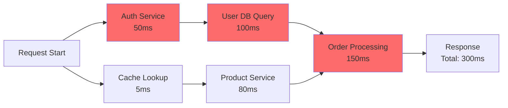
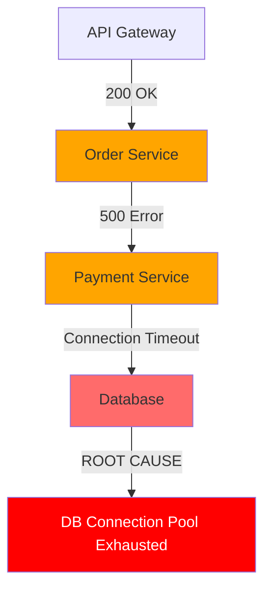
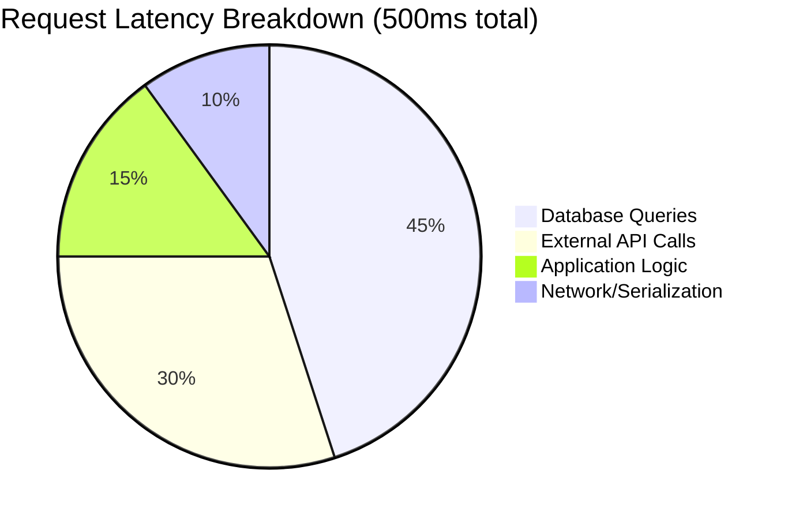
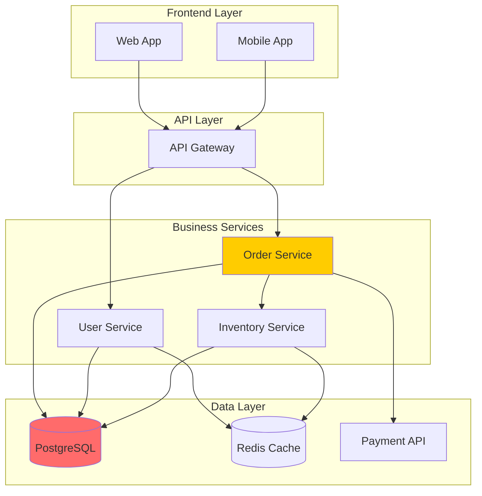
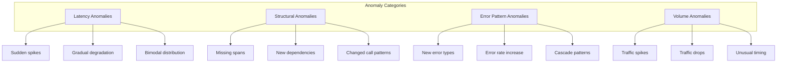
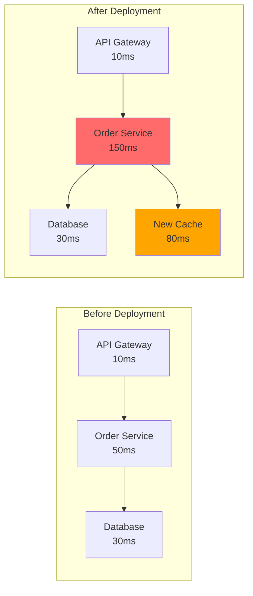

# How to Create Trace Analysis Patterns

Author: [nawazdhandala](https://github.com/nawazdhandala)

Tags: Observability, Tracing, Analysis, Debugging

Description: Learn effective patterns for analyzing distributed traces to identify issues and optimize performance.

---

> Collecting traces is only half the battle. The real value comes from **analyzing** them systematically to find performance bottlenecks, track down errors, and understand system behavior.

Distributed tracing gives you unparalleled visibility into how requests flow through your system. But raw trace data alone is not enough. You need **analysis patterns**: repeatable approaches that turn trace data into actionable insights.

This guide covers six essential trace analysis patterns that every observability practitioner should master.

---

## Table of Contents

1. Critical Path Analysis
2. Error Propagation Tracking
3. Latency Breakdown Analysis
4. Service Dependency Analysis
5. Anomaly Detection in Traces
6. Comparative Trace Analysis
7. Implementing Analysis Patterns
8. Best Practices and Common Pitfalls

---

## 1. Critical Path Analysis

The critical path is the longest chain of sequential operations that determines the minimum possible latency for a request. Identifying it tells you exactly where optimization efforts will have the most impact.

### Understanding Critical Path



In this example, the critical path is: Auth Service (50ms) -> User DB Query (100ms) -> Order Processing (150ms) = 300ms total. The Cache Lookup and Product Service run in parallel and do not affect the total latency because they complete before the critical path finishes.

### Implementation

```typescript
// critical-path-analyzer.ts
import { Span, Trace } from './types';

interface CriticalPathResult {
  path: Span[];
  totalDuration: number;
  bottlenecks: Array<{
    span: Span;
    contribution: number; // percentage of total
  }>;
}

export function findCriticalPath(trace: Trace): CriticalPathResult {
  const spans = trace.spans;
  const spanMap = new Map<string, Span>();
  const childrenMap = new Map<string, Span[]>();

  // Build lookup maps
  for (const span of spans) {
    spanMap.set(span.spanId, span);
    if (span.parentSpanId) {
      const siblings = childrenMap.get(span.parentSpanId) || [];
      siblings.push(span);
      childrenMap.set(span.parentSpanId, siblings);
    }
  }

  // Find root span
  const rootSpan = spans.find(s => !s.parentSpanId);
  if (!rootSpan) throw new Error('No root span found');

  // Recursive function to find longest path
  function findLongestPath(spanId: string): Span[] {
    const span = spanMap.get(spanId)!;
    const children = childrenMap.get(spanId) || [];

    if (children.length === 0) {
      return [span];
    }

    // Find the child path that ends latest
    let longestChildPath: Span[] = [];
    let latestEndTime = 0;

    for (const child of children) {
      const childPath = findLongestPath(child.spanId);
      const childEndTime = child.endTime;

      if (childEndTime > latestEndTime) {
        latestEndTime = childEndTime;
        longestChildPath = childPath;
      }
    }

    return [span, ...longestChildPath];
  }

  const path = findLongestPath(rootSpan.spanId);
  const totalDuration = rootSpan.endTime - rootSpan.startTime;

  // Calculate bottleneck contributions
  const bottlenecks = path.map(span => ({
    span,
    contribution: ((span.endTime - span.startTime) / totalDuration) * 100
  })).sort((a, b) => b.contribution - a.contribution);

  return { path, totalDuration, bottlenecks };
}
```

### Usage Example

```typescript
const trace = await fetchTrace('trace-id-123');
const analysis = findCriticalPath(trace);

console.log('Critical Path:');
for (const span of analysis.path) {
  console.log(`  ${span.name}: ${span.endTime - span.startTime}ms`);
}

console.log('\nTop Bottlenecks:');
for (const b of analysis.bottlenecks.slice(0, 3)) {
  console.log(`  ${b.span.name}: ${b.contribution.toFixed(1)}% of total latency`);
}
```

### When to Use Critical Path Analysis

- **Performance optimization**: Identify which services to optimize first
- **SLA debugging**: Understand why requests exceed latency thresholds
- **Capacity planning**: Determine which services need more resources
- **Architecture decisions**: Find opportunities for parallelization

---

## 2. Error Propagation Tracking

When errors occur in distributed systems, they often cascade through multiple services. Error propagation tracking helps you find the **root cause** rather than just the symptoms.

### Error Cascade Visualization



### Implementation

```typescript
// error-propagation-tracker.ts
interface ErrorChain {
  rootCause: Span;
  propagationPath: Span[];
  affectedServices: string[];
  errorTypes: Map<string, number>;
}

export function trackErrorPropagation(trace: Trace): ErrorChain | null {
  const errorSpans = trace.spans
    .filter(s => s.status?.code === 'ERROR')
    .sort((a, b) => a.startTime - b.startTime);

  if (errorSpans.length === 0) return null;

  // Build parent-child relationships
  const parentMap = new Map<string, string>();
  for (const span of trace.spans) {
    if (span.parentSpanId) {
      parentMap.set(span.spanId, span.parentSpanId);
    }
  }

  // Find the earliest error (potential root cause)
  const rootCause = errorSpans[0];

  // Track propagation path from root cause upward
  const propagationPath: Span[] = [rootCause];
  let currentSpanId = rootCause.spanId;

  while (parentMap.has(currentSpanId)) {
    const parentId = parentMap.get(currentSpanId)!;
    const parentSpan = trace.spans.find(s => s.spanId === parentId);
    if (parentSpan && parentSpan.status?.code === 'ERROR') {
      propagationPath.push(parentSpan);
    }
    currentSpanId = parentId;
  }

  // Collect affected services
  const affectedServices = [...new Set(errorSpans.map(s =>
    s.attributes['service.name'] || s.name.split('.')[0]
  ))];

  // Count error types
  const errorTypes = new Map<string, number>();
  for (const span of errorSpans) {
    const errorType = span.status?.message || 'Unknown Error';
    errorTypes.set(errorType, (errorTypes.get(errorType) || 0) + 1);
  }

  return {
    rootCause,
    propagationPath,
    affectedServices,
    errorTypes
  };
}

// Helper to analyze error patterns across multiple traces
export function analyzeErrorPatterns(traces: Trace[]): Map<string, ErrorPattern> {
  const patterns = new Map<string, ErrorPattern>();

  for (const trace of traces) {
    const errorChain = trackErrorPropagation(trace);
    if (!errorChain) continue;

    const rootCauseService = errorChain.rootCause.attributes['service.name'];
    const errorType = errorChain.rootCause.status?.message || 'Unknown';
    const patternKey = `${rootCauseService}:${errorType}`;

    if (!patterns.has(patternKey)) {
      patterns.set(patternKey, {
        service: rootCauseService,
        errorType,
        occurrences: 0,
        affectedDownstream: new Set(),
        sampleTraceIds: []
      });
    }

    const pattern = patterns.get(patternKey)!;
    pattern.occurrences++;
    errorChain.affectedServices.forEach(s => pattern.affectedDownstream.add(s));
    if (pattern.sampleTraceIds.length < 5) {
      pattern.sampleTraceIds.push(trace.traceId);
    }
  }

  return patterns;
}
```

### Practical Error Analysis

```typescript
// Analyze errors from the last hour
const errorTraces = await queryTraces({
  timeRange: { last: '1h' },
  filter: { status: 'ERROR' }
});

const errorPatterns = analyzeErrorPatterns(errorTraces);

console.log('Error Patterns Detected:');
for (const [key, pattern] of errorPatterns) {
  console.log(`\n${key}:`);
  console.log(`  Occurrences: ${pattern.occurrences}`);
  console.log(`  Affected Services: ${[...pattern.affectedDownstream].join(', ')}`);
  console.log(`  Sample Traces: ${pattern.sampleTraceIds.join(', ')}`);
}
```

---

## 3. Latency Breakdown Analysis

Understanding where time is spent within a trace helps identify optimization opportunities. Latency breakdown analysis categorizes time into meaningful buckets.

### Latency Distribution Diagram



### Implementation

```typescript
// latency-breakdown-analyzer.ts
interface LatencyBreakdown {
  total: number;
  categories: Map<string, CategoryBreakdown>;
  gaps: GapAnalysis[];
}

interface CategoryBreakdown {
  totalTime: number;
  percentage: number;
  spans: SpanSummary[];
}

interface GapAnalysis {
  afterSpan: string;
  beforeSpan: string;
  duration: number;
  possibleCauses: string[];
}

export function analyzeLatencyBreakdown(trace: Trace): LatencyBreakdown {
  const rootSpan = trace.spans.find(s => !s.parentSpanId)!;
  const totalDuration = rootSpan.endTime - rootSpan.startTime;

  // Categorize spans
  const categories = new Map<string, CategoryBreakdown>();

  for (const span of trace.spans) {
    const category = categorizeSpan(span);
    const duration = span.endTime - span.startTime;

    if (!categories.has(category)) {
      categories.set(category, {
        totalTime: 0,
        percentage: 0,
        spans: []
      });
    }

    const cat = categories.get(category)!;
    cat.totalTime += duration;
    cat.spans.push({
      name: span.name,
      duration,
      attributes: span.attributes
    });
  }

  // Calculate percentages
  for (const [_, cat] of categories) {
    cat.percentage = (cat.totalTime / totalDuration) * 100;
  }

  // Analyze gaps (time not accounted for by child spans)
  const gaps = findLatencyGaps(trace);

  return { total: totalDuration, categories, gaps };
}

function categorizeSpan(span: Span): string {
  const name = span.name.toLowerCase();
  const attrs = span.attributes;

  if (attrs['db.system'] || name.includes('db.') || name.includes('query')) {
    return 'Database';
  }
  if (span.kind === 'CLIENT' || name.includes('http.') || attrs['http.url']) {
    return 'External API';
  }
  if (name.includes('cache') || attrs['cache.type']) {
    return 'Cache';
  }
  if (name.includes('queue') || name.includes('kafka') || name.includes('rabbitmq')) {
    return 'Message Queue';
  }
  if (span.kind === 'SERVER') {
    return 'Request Handling';
  }
  return 'Application Logic';
}

function findLatencyGaps(trace: Trace): GapAnalysis[] {
  const gaps: GapAnalysis[] = [];
  const sortedSpans = [...trace.spans].sort((a, b) => a.startTime - b.startTime);

  for (let i = 0; i < sortedSpans.length - 1; i++) {
    const current = sortedSpans[i];
    const next = sortedSpans[i + 1];

    // Check for gaps between sibling spans
    if (current.parentSpanId === next.parentSpanId) {
      const gap = next.startTime - current.endTime;
      if (gap > 10) { // More than 10ms gap
        gaps.push({
          afterSpan: current.name,
          beforeSpan: next.name,
          duration: gap,
          possibleCauses: inferGapCauses(gap, current, next)
        });
      }
    }
  }

  return gaps;
}

function inferGapCauses(gap: number, before: Span, after: Span): string[] {
  const causes: string[] = [];

  if (gap > 100) {
    causes.push('Possible GC pause');
    causes.push('Thread pool exhaustion');
  }
  if (gap > 50) {
    causes.push('CPU contention');
    causes.push('Context switching overhead');
  }
  if (before.name.includes('db') || after.name.includes('db')) {
    causes.push('Connection pool wait time');
  }

  return causes;
}
```

### Visualization Helper

```typescript
// Generate ASCII visualization of latency breakdown
export function visualizeBreakdown(breakdown: LatencyBreakdown): string {
  const lines: string[] = [];
  const barWidth = 50;

  lines.push(`Total Latency: ${breakdown.total}ms\n`);
  lines.push('Category Breakdown:');
  lines.push('-'.repeat(70));

  const sorted = [...breakdown.categories.entries()]
    .sort((a, b) => b[1].percentage - a[1].percentage);

  for (const [category, data] of sorted) {
    const filled = Math.round((data.percentage / 100) * barWidth);
    const bar = '#'.repeat(filled) + '-'.repeat(barWidth - filled);
    lines.push(`${category.padEnd(20)} [${bar}] ${data.percentage.toFixed(1)}%`);
    lines.push(`${''.padEnd(20)} ${data.totalTime}ms across ${data.spans.length} spans`);
  }

  if (breakdown.gaps.length > 0) {
    lines.push('\nUnaccounted Gaps:');
    lines.push('-'.repeat(70));
    for (const gap of breakdown.gaps.slice(0, 5)) {
      lines.push(`${gap.duration}ms between "${gap.afterSpan}" and "${gap.beforeSpan}"`);
      lines.push(`  Possible causes: ${gap.possibleCauses.join(', ')}`);
    }
  }

  return lines.join('\n');
}
```

---

## 4. Service Dependency Analysis

Understanding how services depend on each other helps with architecture decisions, failure impact analysis, and capacity planning.

### Dependency Graph



### Implementation

```typescript
// service-dependency-analyzer.ts
interface DependencyGraph {
  services: Map<string, ServiceNode>;
  edges: DependencyEdge[];
  criticalPaths: string[][];
}

interface ServiceNode {
  name: string;
  spanCount: number;
  avgLatency: number;
  errorRate: number;
  inboundDeps: string[];
  outboundDeps: string[];
}

interface DependencyEdge {
  from: string;
  to: string;
  callCount: number;
  avgLatency: number;
  errorRate: number;
  p99Latency: number;
}

export function buildDependencyGraph(traces: Trace[]): DependencyGraph {
  const services = new Map<string, ServiceNode>();
  const edgeStats = new Map<string, EdgeAccumulator>();

  for (const trace of traces) {
    for (const span of trace.spans) {
      const serviceName = extractServiceName(span);

      // Update service stats
      if (!services.has(serviceName)) {
        services.set(serviceName, {
          name: serviceName,
          spanCount: 0,
          avgLatency: 0,
          errorRate: 0,
          inboundDeps: [],
          outboundDeps: []
        });
      }

      const service = services.get(serviceName)!;
      const duration = span.endTime - span.startTime;
      service.spanCount++;
      service.avgLatency = ((service.avgLatency * (service.spanCount - 1)) + duration) / service.spanCount;
      if (span.status?.code === 'ERROR') {
        service.errorRate = (service.errorRate * (service.spanCount - 1) + 1) / service.spanCount;
      }

      // Track edges (parent-child across services)
      if (span.parentSpanId) {
        const parentSpan = trace.spans.find(s => s.spanId === span.parentSpanId);
        if (parentSpan) {
          const parentService = extractServiceName(parentSpan);
          if (parentService !== serviceName) {
            const edgeKey = `${parentService}->${serviceName}`;
            if (!edgeStats.has(edgeKey)) {
              edgeStats.set(edgeKey, {
                from: parentService,
                to: serviceName,
                latencies: [],
                errors: 0,
                total: 0
              });
            }
            const edge = edgeStats.get(edgeKey)!;
            edge.latencies.push(duration);
            edge.total++;
            if (span.status?.code === 'ERROR') edge.errors++;
          }
        }
      }
    }
  }

  // Build final edges with calculated stats
  const edges: DependencyEdge[] = [];
  for (const [_, acc] of edgeStats) {
    const sorted = acc.latencies.sort((a, b) => a - b);
    edges.push({
      from: acc.from,
      to: acc.to,
      callCount: acc.total,
      avgLatency: sorted.reduce((a, b) => a + b, 0) / sorted.length,
      errorRate: acc.errors / acc.total,
      p99Latency: sorted[Math.floor(sorted.length * 0.99)] || sorted[sorted.length - 1]
    });

    // Update service dependencies
    services.get(acc.from)!.outboundDeps.push(acc.to);
    services.get(acc.to)!.inboundDeps.push(acc.from);
  }

  // Find critical paths (services with most dependencies)
  const criticalPaths = findCriticalServicePaths(services, edges);

  return { services, edges, criticalPaths };
}

function findCriticalServicePaths(
  services: Map<string, ServiceNode>,
  edges: DependencyEdge[]
): string[][] {
  const paths: string[][] = [];

  // Find entry points (services with no inbound deps)
  const entryPoints = [...services.values()]
    .filter(s => s.inboundDeps.length === 0)
    .map(s => s.name);

  // DFS to find all paths
  function dfs(current: string, path: string[], visited: Set<string>) {
    if (visited.has(current)) return;

    visited.add(current);
    path.push(current);

    const service = services.get(current)!;
    if (service.outboundDeps.length === 0) {
      paths.push([...path]);
    } else {
      for (const dep of service.outboundDeps) {
        dfs(dep, path, visited);
      }
    }

    path.pop();
    visited.delete(current);
  }

  for (const entry of entryPoints) {
    dfs(entry, [], new Set());
  }

  // Return longest paths first
  return paths.sort((a, b) => b.length - a.length);
}

function extractServiceName(span: Span): string {
  return span.attributes['service.name'] ||
         span.resource?.['service.name'] ||
         span.name.split('.')[0];
}
```

### Impact Analysis

```typescript
// Analyze the impact if a service goes down
export function analyzeFailureImpact(
  graph: DependencyGraph,
  failedService: string
): ImpactAnalysis {
  const impacted = new Set<string>();
  const queue = [failedService];

  // Find all services that depend on the failed service
  while (queue.length > 0) {
    const current = queue.shift()!;
    for (const [name, service] of graph.services) {
      if (service.outboundDeps.includes(current) && !impacted.has(name)) {
        impacted.add(name);
        queue.push(name);
      }
    }
  }

  // Calculate business impact
  const totalTraffic = [...graph.services.values()]
    .reduce((sum, s) => sum + s.spanCount, 0);
  const impactedTraffic = [...impacted]
    .map(name => graph.services.get(name)!.spanCount)
    .reduce((sum, count) => sum + count, 0);

  return {
    failedService,
    directlyImpacted: graph.services.get(failedService)?.inboundDeps || [],
    transitivelyImpacted: [...impacted],
    trafficImpactPercentage: (impactedTraffic / totalTraffic) * 100,
    criticalPathsAffected: graph.criticalPaths.filter(p => p.includes(failedService))
  };
}
```

---

## 5. Anomaly Detection in Traces

Detecting unusual patterns in traces helps identify issues before they become critical. This involves statistical analysis of latency distributions, error patterns, and structural anomalies.

### Anomaly Types



### Implementation

```typescript
// anomaly-detector.ts
interface AnomalyReport {
  timestamp: Date;
  anomalies: Anomaly[];
  severity: 'low' | 'medium' | 'high' | 'critical';
}

interface Anomaly {
  type: AnomalyType;
  service: string;
  description: string;
  evidence: AnomalyEvidence;
  suggestedActions: string[];
}

type AnomalyType = 'latency_spike' | 'error_burst' | 'structural_change' |
                   'missing_span' | 'new_dependency' | 'volume_anomaly';

export class TraceAnomalyDetector {
  private baselineStats: Map<string, BaselineStats> = new Map();
  private recentTraces: Trace[] = [];
  private readonly windowSize = 1000; // traces to keep

  // Update baseline with new trace data
  updateBaseline(traces: Trace[]): void {
    for (const trace of traces) {
      for (const span of trace.spans) {
        const key = `${extractServiceName(span)}:${span.name}`;
        const duration = span.endTime - span.startTime;

        if (!this.baselineStats.has(key)) {
          this.baselineStats.set(key, {
            count: 0,
            mean: 0,
            m2: 0, // For Welford's algorithm
            min: Infinity,
            max: -Infinity,
            errorCount: 0
          });
        }

        const stats = this.baselineStats.get(key)!;
        stats.count++;

        // Welford's online algorithm for mean and variance
        const delta = duration - stats.mean;
        stats.mean += delta / stats.count;
        stats.m2 += delta * (duration - stats.mean);

        stats.min = Math.min(stats.min, duration);
        stats.max = Math.max(stats.max, duration);
        if (span.status?.code === 'ERROR') stats.errorCount++;
      }
    }

    // Maintain sliding window
    this.recentTraces.push(...traces);
    while (this.recentTraces.length > this.windowSize) {
      this.recentTraces.shift();
    }
  }

  // Detect anomalies in new traces
  detectAnomalies(traces: Trace[]): AnomalyReport {
    const anomalies: Anomaly[] = [];

    for (const trace of traces) {
      // Check for latency anomalies
      anomalies.push(...this.detectLatencyAnomalies(trace));

      // Check for structural anomalies
      anomalies.push(...this.detectStructuralAnomalies(trace));

      // Check for error pattern anomalies
      anomalies.push(...this.detectErrorAnomalies(trace));
    }

    // Check for volume anomalies across all traces
    anomalies.push(...this.detectVolumeAnomalies(traces));

    const severity = this.calculateOverallSeverity(anomalies);

    return {
      timestamp: new Date(),
      anomalies,
      severity
    };
  }

  private detectLatencyAnomalies(trace: Trace): Anomaly[] {
    const anomalies: Anomaly[] = [];

    for (const span of trace.spans) {
      const key = `${extractServiceName(span)}:${span.name}`;
      const stats = this.baselineStats.get(key);

      if (!stats || stats.count < 100) continue; // Need baseline data

      const duration = span.endTime - span.startTime;
      const stdDev = Math.sqrt(stats.m2 / stats.count);
      const zScore = (duration - stats.mean) / stdDev;

      // Flag if more than 3 standard deviations from mean
      if (zScore > 3) {
        anomalies.push({
          type: 'latency_spike',
          service: extractServiceName(span),
          description: `Span "${span.name}" took ${duration}ms (${zScore.toFixed(1)} std devs above mean of ${stats.mean.toFixed(0)}ms)`,
          evidence: {
            observed: duration,
            expected: stats.mean,
            threshold: stats.mean + (3 * stdDev),
            zScore
          },
          suggestedActions: [
            'Check for resource contention',
            'Review recent deployments',
            'Examine downstream dependencies'
          ]
        });
      }
    }

    return anomalies;
  }

  private detectStructuralAnomalies(trace: Trace): Anomaly[] {
    const anomalies: Anomaly[] = [];
    const expectedSpans = this.getExpectedSpanStructure(trace);
    const actualSpans = new Set(trace.spans.map(s => s.name));

    // Check for missing expected spans
    for (const expected of expectedSpans) {
      if (!actualSpans.has(expected)) {
        anomalies.push({
          type: 'missing_span',
          service: expected.split('.')[0],
          description: `Expected span "${expected}" is missing from trace`,
          evidence: {
            expectedSpans: [...expectedSpans],
            actualSpans: [...actualSpans]
          },
          suggestedActions: [
            'Check if service is healthy',
            'Verify instrumentation is active',
            'Look for circuit breaker activation'
          ]
        });
      }
    }

    // Check for new unexpected spans
    for (const span of trace.spans) {
      if (!this.isKnownSpan(span.name)) {
        anomalies.push({
          type: 'new_dependency',
          service: extractServiceName(span),
          description: `New span "${span.name}" detected (not in baseline)`,
          evidence: {
            newSpan: span.name,
            attributes: span.attributes
          },
          suggestedActions: [
            'Verify this is expected from recent deployment',
            'Update monitoring dashboards',
            'Review performance impact'
          ]
        });
      }
    }

    return anomalies;
  }

  private detectErrorAnomalies(trace: Trace): Anomaly[] {
    const anomalies: Anomaly[] = [];
    const errorSpans = trace.spans.filter(s => s.status?.code === 'ERROR');

    for (const span of errorSpans) {
      const key = `${extractServiceName(span)}:${span.name}`;
      const stats = this.baselineStats.get(key);

      if (!stats) continue;

      const historicalErrorRate = stats.errorCount / stats.count;

      // Flag if this span rarely errors
      if (historicalErrorRate < 0.01) { // Less than 1% historical error rate
        anomalies.push({
          type: 'error_burst',
          service: extractServiceName(span),
          description: `Rare error in "${span.name}" (historical error rate: ${(historicalErrorRate * 100).toFixed(2)}%)`,
          evidence: {
            errorMessage: span.status?.message,
            historicalErrorRate,
            spanAttributes: span.attributes
          },
          suggestedActions: [
            'Check error logs for details',
            'Review recent changes to this service',
            'Monitor for error rate increase'
          ]
        });
      }
    }

    return anomalies;
  }

  private detectVolumeAnomalies(traces: Trace[]): Anomaly[] {
    // Implementation for detecting unusual traffic patterns
    // Compare current volume against historical baselines
    return [];
  }

  private getExpectedSpanStructure(trace: Trace): Set<string> {
    // Return commonly seen spans for this trace type
    const rootSpan = trace.spans.find(s => !s.parentSpanId);
    const traceType = rootSpan?.name || 'unknown';

    // Build from historical data
    const expectedSpans = new Set<string>();
    for (const [key, stats] of this.baselineStats) {
      if (stats.count > 50) { // Span appears frequently
        expectedSpans.add(key.split(':')[1]);
      }
    }
    return expectedSpans;
  }

  private isKnownSpan(spanName: string): boolean {
    for (const key of this.baselineStats.keys()) {
      if (key.endsWith(`:${spanName}`)) return true;
    }
    return false;
  }

  private calculateOverallSeverity(anomalies: Anomaly[]): 'low' | 'medium' | 'high' | 'critical' {
    if (anomalies.length === 0) return 'low';

    const hasLatencySpike = anomalies.some(a => a.type === 'latency_spike');
    const hasErrorBurst = anomalies.some(a => a.type === 'error_burst');
    const hasMissingSpan = anomalies.some(a => a.type === 'missing_span');

    if (hasErrorBurst && hasMissingSpan) return 'critical';
    if (hasErrorBurst || (hasLatencySpike && anomalies.length > 3)) return 'high';
    if (hasLatencySpike || hasMissingSpan) return 'medium';
    return 'low';
  }
}
```

---

## 6. Comparative Trace Analysis

Comparing traces helps identify what changed between good and bad requests, different time periods, or before and after deployments.

### Comparison Visualization



### Implementation

```typescript
// comparative-trace-analyzer.ts
interface TraceComparison {
  baseline: TraceGroup;
  comparison: TraceGroup;
  differences: TraceDifference[];
  summary: ComparisonSummary;
}

interface TraceGroup {
  label: string;
  traceCount: number;
  avgDuration: number;
  p50Duration: number;
  p95Duration: number;
  p99Duration: number;
  errorRate: number;
  spanBreakdown: Map<string, SpanStats>;
}

interface TraceDifference {
  spanName: string;
  changeType: 'added' | 'removed' | 'slower' | 'faster' | 'more_errors' | 'fewer_errors';
  baselineValue: number;
  comparisonValue: number;
  percentChange: number;
  significance: 'low' | 'medium' | 'high';
}

export function compareTraceGroups(
  baselineTraces: Trace[],
  comparisonTraces: Trace[],
  baselineLabel: string = 'Baseline',
  comparisonLabel: string = 'Comparison'
): TraceComparison {
  const baseline = aggregateTraceGroup(baselineTraces, baselineLabel);
  const comparison = aggregateTraceGroup(comparisonTraces, comparisonLabel);

  const differences = findDifferences(baseline, comparison);
  const summary = generateSummary(baseline, comparison, differences);

  return { baseline, comparison, differences, summary };
}

function aggregateTraceGroup(traces: Trace[], label: string): TraceGroup {
  const durations: number[] = [];
  const spanStats = new Map<string, { durations: number[]; errors: number }>();

  for (const trace of traces) {
    const rootSpan = trace.spans.find(s => !s.parentSpanId);
    if (rootSpan) {
      durations.push(rootSpan.endTime - rootSpan.startTime);
    }

    for (const span of trace.spans) {
      if (!spanStats.has(span.name)) {
        spanStats.set(span.name, { durations: [], errors: 0 });
      }
      const stats = spanStats.get(span.name)!;
      stats.durations.push(span.endTime - span.startTime);
      if (span.status?.code === 'ERROR') stats.errors++;
    }
  }

  const sortedDurations = durations.sort((a, b) => a - b);
  const errorCount = traces.filter(t =>
    t.spans.some(s => s.status?.code === 'ERROR')
  ).length;

  const spanBreakdown = new Map<string, SpanStats>();
  for (const [name, stats] of spanStats) {
    const sorted = stats.durations.sort((a, b) => a - b);
    spanBreakdown.set(name, {
      count: stats.durations.length,
      avgDuration: sorted.reduce((a, b) => a + b, 0) / sorted.length,
      p50Duration: percentile(sorted, 50),
      p95Duration: percentile(sorted, 95),
      errorRate: stats.errors / stats.durations.length
    });
  }

  return {
    label,
    traceCount: traces.length,
    avgDuration: sortedDurations.reduce((a, b) => a + b, 0) / sortedDurations.length,
    p50Duration: percentile(sortedDurations, 50),
    p95Duration: percentile(sortedDurations, 95),
    p99Duration: percentile(sortedDurations, 99),
    errorRate: errorCount / traces.length,
    spanBreakdown
  };
}

function findDifferences(baseline: TraceGroup, comparison: TraceGroup): TraceDifference[] {
  const differences: TraceDifference[] = [];
  const allSpans = new Set([
    ...baseline.spanBreakdown.keys(),
    ...comparison.spanBreakdown.keys()
  ]);

  for (const spanName of allSpans) {
    const baselineStats = baseline.spanBreakdown.get(spanName);
    const comparisonStats = comparison.spanBreakdown.get(spanName);

    if (!baselineStats && comparisonStats) {
      differences.push({
        spanName,
        changeType: 'added',
        baselineValue: 0,
        comparisonValue: comparisonStats.avgDuration,
        percentChange: 100,
        significance: 'high'
      });
      continue;
    }

    if (baselineStats && !comparisonStats) {
      differences.push({
        spanName,
        changeType: 'removed',
        baselineValue: baselineStats.avgDuration,
        comparisonValue: 0,
        percentChange: -100,
        significance: 'high'
      });
      continue;
    }

    if (baselineStats && comparisonStats) {
      const latencyChange = ((comparisonStats.avgDuration - baselineStats.avgDuration) / baselineStats.avgDuration) * 100;

      if (Math.abs(latencyChange) > 10) { // More than 10% change
        differences.push({
          spanName,
          changeType: latencyChange > 0 ? 'slower' : 'faster',
          baselineValue: baselineStats.avgDuration,
          comparisonValue: comparisonStats.avgDuration,
          percentChange: latencyChange,
          significance: Math.abs(latencyChange) > 50 ? 'high' :
                       Math.abs(latencyChange) > 25 ? 'medium' : 'low'
        });
      }

      const errorChange = comparisonStats.errorRate - baselineStats.errorRate;
      if (Math.abs(errorChange) > 0.01) { // More than 1% error rate change
        differences.push({
          spanName,
          changeType: errorChange > 0 ? 'more_errors' : 'fewer_errors',
          baselineValue: baselineStats.errorRate * 100,
          comparisonValue: comparisonStats.errorRate * 100,
          percentChange: (errorChange / (baselineStats.errorRate || 0.001)) * 100,
          significance: Math.abs(errorChange) > 0.05 ? 'high' : 'medium'
        });
      }
    }
  }

  return differences.sort((a, b) => {
    const severityOrder = { high: 0, medium: 1, low: 2 };
    return severityOrder[a.significance] - severityOrder[b.significance];
  });
}

function generateSummary(
  baseline: TraceGroup,
  comparison: TraceGroup,
  differences: TraceDifference[]
): ComparisonSummary {
  const overallLatencyChange = ((comparison.avgDuration - baseline.avgDuration) / baseline.avgDuration) * 100;
  const overallErrorChange = comparison.errorRate - baseline.errorRate;

  return {
    overallLatencyChange,
    overallErrorChange,
    newSpans: differences.filter(d => d.changeType === 'added').map(d => d.spanName),
    removedSpans: differences.filter(d => d.changeType === 'removed').map(d => d.spanName),
    significantRegressions: differences
      .filter(d => d.changeType === 'slower' && d.significance === 'high')
      .map(d => d.spanName),
    significantImprovements: differences
      .filter(d => d.changeType === 'faster' && d.significance === 'high')
      .map(d => d.spanName),
    verdict: overallLatencyChange > 20 || overallErrorChange > 0.05 ? 'regression' :
             overallLatencyChange < -10 && overallErrorChange <= 0 ? 'improvement' :
             'neutral'
  };
}

function percentile(sorted: number[], p: number): number {
  const index = Math.ceil((p / 100) * sorted.length) - 1;
  return sorted[Math.max(0, index)];
}
```

### Practical Use Case: Deployment Comparison

```typescript
// Compare performance before and after a deployment
async function analyzeDeploymentImpact(
  deploymentTime: Date,
  serviceName: string
): Promise<void> {
  const beforeTraces = await queryTraces({
    service: serviceName,
    timeRange: {
      start: new Date(deploymentTime.getTime() - 3600000), // 1 hour before
      end: deploymentTime
    }
  });

  const afterTraces = await queryTraces({
    service: serviceName,
    timeRange: {
      start: deploymentTime,
      end: new Date(deploymentTime.getTime() + 3600000) // 1 hour after
    }
  });

  const comparison = compareTraceGroups(
    beforeTraces,
    afterTraces,
    'Pre-deployment',
    'Post-deployment'
  );

  console.log('Deployment Impact Analysis');
  console.log('='.repeat(50));
  console.log(`Overall latency change: ${comparison.summary.overallLatencyChange.toFixed(1)}%`);
  console.log(`Overall error rate change: ${(comparison.summary.overallErrorChange * 100).toFixed(2)}%`);
  console.log(`Verdict: ${comparison.summary.verdict.toUpperCase()}`);

  if (comparison.summary.significantRegressions.length > 0) {
    console.log('\nSignificant Regressions:');
    for (const span of comparison.summary.significantRegressions) {
      const diff = comparison.differences.find(d => d.spanName === span)!;
      console.log(`  - ${span}: ${diff.baselineValue.toFixed(0)}ms -> ${diff.comparisonValue.toFixed(0)}ms (+${diff.percentChange.toFixed(0)}%)`);
    }
  }

  if (comparison.summary.newSpans.length > 0) {
    console.log('\nNew Spans Detected:');
    for (const span of comparison.summary.newSpans) {
      console.log(`  - ${span}`);
    }
  }
}
```

---

## 7. Implementing Analysis Patterns

Here is a unified analyzer that combines all patterns into a cohesive tool.

```typescript
// unified-trace-analyzer.ts
import { TraceAnomalyDetector } from './anomaly-detector';

export class UnifiedTraceAnalyzer {
  private anomalyDetector = new TraceAnomalyDetector();

  async analyzeTrace(trace: Trace): Promise<FullAnalysis> {
    const criticalPath = findCriticalPath(trace);
    const errorChain = trackErrorPropagation(trace);
    const latencyBreakdown = analyzeLatencyBreakdown(trace);

    // Update baseline for anomaly detection
    this.anomalyDetector.updateBaseline([trace]);
    const anomalies = this.anomalyDetector.detectAnomalies([trace]);

    return {
      traceId: trace.traceId,
      timestamp: new Date(),
      criticalPath,
      errorChain,
      latencyBreakdown,
      anomalies,
      recommendations: this.generateRecommendations({
        criticalPath,
        errorChain,
        latencyBreakdown,
        anomalies
      })
    };
  }

  async analyzeTraceGroup(traces: Trace[]): Promise<GroupAnalysis> {
    const dependencyGraph = buildDependencyGraph(traces);

    this.anomalyDetector.updateBaseline(traces);
    const anomalies = this.anomalyDetector.detectAnomalies(traces);

    // Aggregate individual analyses
    const traceAnalyses = await Promise.all(
      traces.slice(0, 100).map(t => this.analyzeTrace(t)) // Sample for performance
    );

    return {
      traceCount: traces.length,
      timeRange: this.extractTimeRange(traces),
      dependencyGraph,
      anomalies,
      aggregatedMetrics: this.aggregateMetrics(traceAnalyses),
      topIssues: this.identifyTopIssues(traceAnalyses)
    };
  }

  private generateRecommendations(analysis: any): Recommendation[] {
    const recommendations: Recommendation[] = [];

    // Based on critical path
    if (analysis.criticalPath.bottlenecks.length > 0) {
      const topBottleneck = analysis.criticalPath.bottlenecks[0];
      if (topBottleneck.contribution > 50) {
        recommendations.push({
          priority: 'high',
          category: 'performance',
          title: `Optimize ${topBottleneck.span.name}`,
          description: `This span accounts for ${topBottleneck.contribution.toFixed(0)}% of total latency`,
          actions: [
            'Add caching if applicable',
            'Review database query efficiency',
            'Consider async processing'
          ]
        });
      }
    }

    // Based on error chain
    if (analysis.errorChain) {
      recommendations.push({
        priority: 'critical',
        category: 'reliability',
        title: `Fix root cause in ${analysis.errorChain.rootCause.name}`,
        description: `Error propagated to ${analysis.errorChain.affectedServices.length} services`,
        actions: [
          'Review error handling',
          'Add circuit breakers',
          'Implement retry logic'
        ]
      });
    }

    // Based on latency gaps
    if (analysis.latencyBreakdown.gaps.length > 0) {
      const significantGaps = analysis.latencyBreakdown.gaps.filter(g => g.duration > 50);
      if (significantGaps.length > 0) {
        recommendations.push({
          priority: 'medium',
          category: 'performance',
          title: 'Investigate latency gaps',
          description: `Found ${significantGaps.length} gaps totaling ${significantGaps.reduce((s, g) => s + g.duration, 0)}ms`,
          actions: significantGaps[0].possibleCauses
        });
      }
    }

    return recommendations.sort((a, b) => {
      const priorityOrder = { critical: 0, high: 1, medium: 2, low: 3 };
      return priorityOrder[a.priority] - priorityOrder[b.priority];
    });
  }

  private extractTimeRange(traces: Trace[]): { start: Date; end: Date } {
    let min = Infinity;
    let max = -Infinity;

    for (const trace of traces) {
      for (const span of trace.spans) {
        min = Math.min(min, span.startTime);
        max = Math.max(max, span.endTime);
      }
    }

    return { start: new Date(min), end: new Date(max) };
  }

  private aggregateMetrics(analyses: FullAnalysis[]): AggregatedMetrics {
    // Calculate aggregate statistics from individual analyses
    return {
      avgLatency: analyses.reduce((sum, a) => sum + a.criticalPath.totalDuration, 0) / analyses.length,
      errorRate: analyses.filter(a => a.errorChain !== null).length / analyses.length,
      anomalyRate: analyses.filter(a => a.anomalies.anomalies.length > 0).length / analyses.length
    };
  }

  private identifyTopIssues(analyses: FullAnalysis[]): Issue[] {
    const issueMap = new Map<string, Issue>();

    for (const analysis of analyses) {
      for (const rec of analysis.recommendations) {
        const key = rec.title;
        if (!issueMap.has(key)) {
          issueMap.set(key, {
            ...rec,
            occurrences: 0,
            sampleTraceIds: []
          });
        }
        const issue = issueMap.get(key)!;
        issue.occurrences++;
        if (issue.sampleTraceIds.length < 5) {
          issue.sampleTraceIds.push(analysis.traceId);
        }
      }
    }

    return [...issueMap.values()]
      .sort((a, b) => b.occurrences - a.occurrences)
      .slice(0, 10);
  }
}
```

---

## 8. Best Practices and Common Pitfalls

### Best Practices

1. **Establish baselines first**: Analysis patterns are most effective when you have historical data to compare against. Collect at least a week of trace data before setting up anomaly detection.

2. **Use sampling wisely**: Analyze 100% of error traces but sample successful traces to manage costs while maintaining analytical power.

3. **Correlate with other signals**: Combine trace analysis with metrics and logs for complete context.

4. **Automate pattern detection**: Set up continuous analysis that alerts on significant changes.

5. **Version your analysis**: Track how patterns change over time as your system evolves.

### Common Pitfalls

| Pitfall | Problem | Solution |
|---------|---------|----------|
| Analyzing single traces | One trace may be an outlier | Always analyze groups of traces |
| Ignoring sampling bias | Sampled traces may not represent failures | Implement tail sampling for errors |
| Static thresholds | Systems change; thresholds become stale | Use adaptive, percentile-based thresholds |
| Over-alerting | Too many anomaly alerts cause fatigue | Correlate anomalies before alerting |
| Missing context | Traces alone lack business context | Add custom attributes for business metrics |

### Analysis Checklist

```markdown
## Pre-Analysis
- [ ] Define the question you're trying to answer
- [ ] Identify the relevant time range
- [ ] Ensure sufficient trace volume for statistical significance
- [ ] Check for known issues that might skew results

## During Analysis
- [ ] Start with high-level patterns, then drill down
- [ ] Compare against baselines
- [ ] Look for correlations across services
- [ ] Validate findings with multiple traces

## Post-Analysis
- [ ] Document findings with specific trace IDs
- [ ] Create actionable recommendations
- [ ] Set up monitoring for identified patterns
- [ ] Schedule follow-up analysis after changes
```

---

## Summary

Trace analysis patterns transform raw observability data into actionable insights:

| Pattern | Primary Use Case | Key Output |
|---------|------------------|------------|
| Critical Path Analysis | Performance optimization | Bottleneck identification |
| Error Propagation Tracking | Root cause analysis | Error origin and impact |
| Latency Breakdown | Resource allocation | Time distribution by category |
| Service Dependency | Architecture decisions | Dependency graph and impact |
| Anomaly Detection | Proactive monitoring | Unusual pattern alerts |
| Comparative Analysis | Change validation | Before/after differences |

Master these patterns and you will move from reactive firefighting to proactive system optimization.

---

*Ready to put these patterns into practice? [OneUptime](https://oneuptime.com) provides built-in trace analysis with support for all these patterns. Send your OpenTelemetry traces and start analyzing in minutes.*

---

### See Also

- [What are Traces and Spans in OpenTelemetry](/blog/post/2025-08-27-traces-and-spans-in-opentelemetry/) - Understand the fundamentals before diving into analysis
- [How to Reduce Noise in OpenTelemetry](/blog/post/2025-08-25-how-to-reduce-noise-in-opentelemetry/) - Clean up your trace data for better analysis
- [Three Pillars of Observability](/blog/post/2025-08-20-three-pillars-of-observability-logs-metrics-traces/) - See how traces fit into the bigger picture
