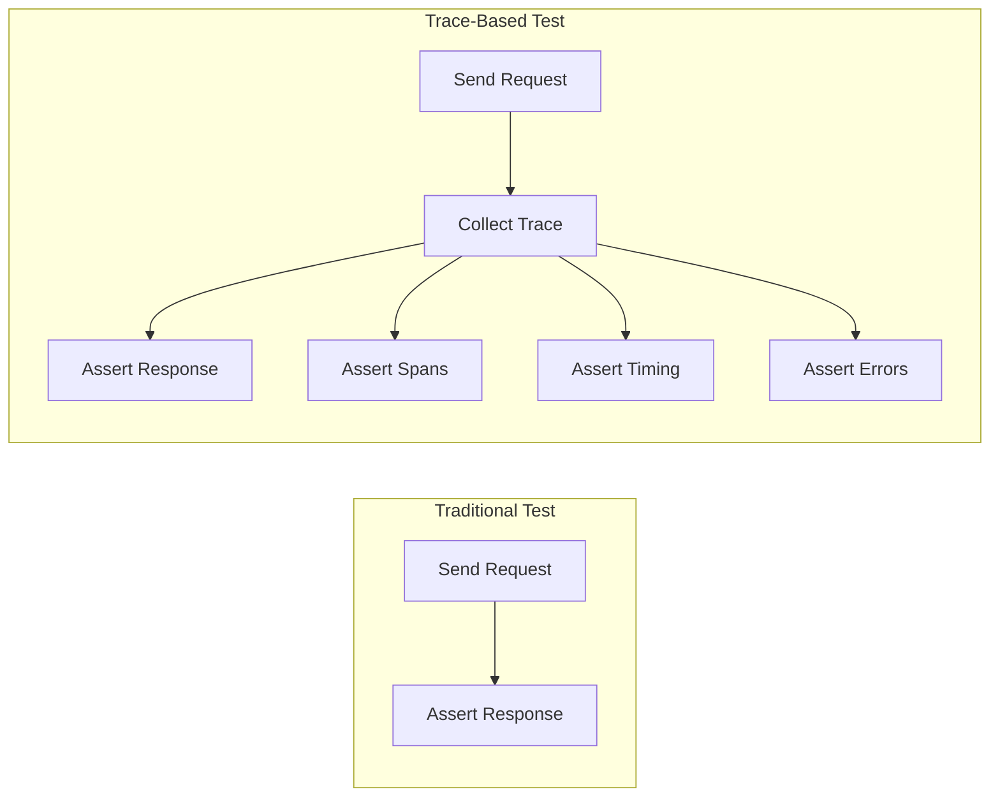
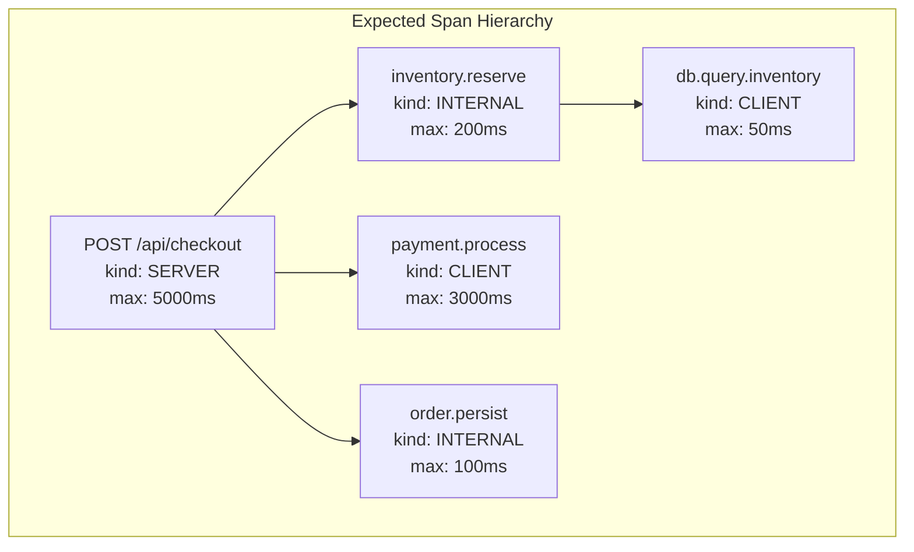
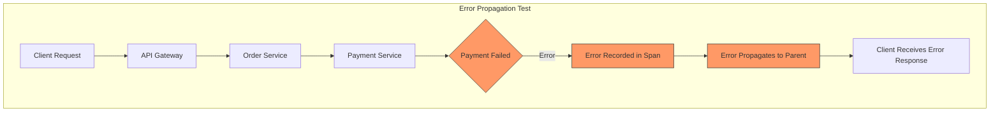
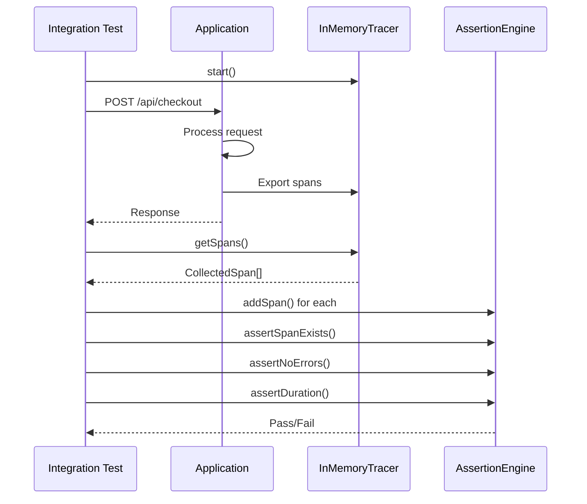
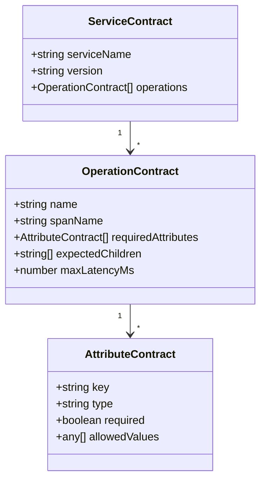
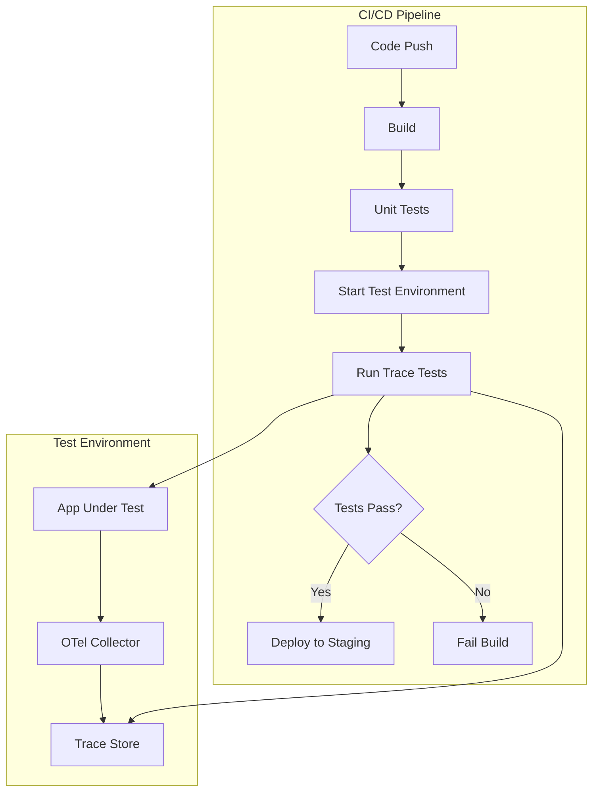

# How to Create Trace-Based Testing Details

Author: [nawazdhandala](https://github.com/nawazdhandala)

Tags: Testing, Tracing, Observability, QA

Description: Learn how to use distributed traces for end-to-end testing and validation.

---

> Traditional testing tells you **if** something works. Trace-based testing tells you **how** it works, **where** it spent time, and **whether** it behaved correctly across services.

Trace-based testing leverages distributed tracing infrastructure to validate not just outcomes, but the entire execution path of your requests. Instead of treating your system as a black box, you gain visibility into every service hop, database call, and external API interaction.

This guide covers practical patterns for implementing trace-based testing, from simple span assertions to complex contract validation across microservices.

---

## Table of Contents

1. What is Trace-Based Testing?
2. Trace Assertion Frameworks
3. Expected Span Validation
4. Latency Threshold Testing
5. Error Propagation Validation
6. Integration Test Traces
7. Contract Testing with Traces
8. Setting Up a Trace Testing Pipeline
9. Common Patterns and Anti-Patterns
10. Putting It All Together

---

## 1. What is Trace-Based Testing?

Trace-based testing combines traditional test assertions with distributed trace analysis. Rather than only checking the final response, you validate:

| Aspect | Traditional Testing | Trace-Based Testing |
|--------|---------------------|---------------------|
| Output | Final response body/status | Response + all intermediate operations |
| Latency | Total request time | Per-span breakdown |
| Dependencies | Mocked or assumed | Verified through actual spans |
| Error handling | Exception caught or not | Full error propagation path |
| Service interactions | Implicit | Explicit span relationships |



The key insight: **your traces are a contract**. If a trace changes unexpectedly, something in your system behavior changed, even if the final output looks the same.

---

## 2. Trace Assertion Frameworks

Several tools enable trace-based testing. Here is a comparison and practical setup for each approach.

### Tracetest (Open Source)

Tracetest is purpose-built for trace-based testing. It captures traces and lets you define assertions against spans.

```yaml
# tracetest.yaml - Test definition
type: Test
spec:
  name: Checkout Flow Validation
  trigger:
    type: http
    httpRequest:
      url: http://checkout-service:3000/api/checkout
      method: POST
      headers:
        - key: Content-Type
          value: application/json
      body: '{"userId": "user-123", "items": [{"sku": "PROD-001", "qty": 2}]}'
  specs:
    - selector: span[name="POST /api/checkout"]
      assertions:
        - attr:http.status_code = 200
    - selector: span[name="inventory.reserve"]
      assertions:
        - attr:tracetest.span.duration < 100ms
    - selector: span[name="payment.process"]
      assertions:
        - attr:payment.approved = true
    - selector: span[tracetest.span.type="database"]
      assertions:
        - attr:db.system = "postgresql"
```

### Custom TypeScript Framework

For more control, build assertions directly into your test suite:

```typescript
// trace-test-utils.ts
import { SpanContext, Span } from '@opentelemetry/api';

export interface TraceAssertion {
  spanName: string;
  assertions: SpanAssertion[];
}

export interface SpanAssertion {
  attribute?: { key: string; value: any; operator?: 'eq' | 'gt' | 'lt' | 'contains' };
  duration?: { maxMs?: number; minMs?: number };
  status?: 'OK' | 'ERROR' | 'UNSET';
  childCount?: { min?: number; max?: number };
  events?: { name: string; required: boolean }[];
}

export interface CollectedSpan {
  name: string;
  traceId: string;
  spanId: string;
  parentSpanId?: string;
  startTime: number;
  endTime: number;
  attributes: Record<string, any>;
  status: { code: number; message?: string };
  events: { name: string; time: number; attributes?: Record<string, any> }[];
}

export class TraceAssertionEngine {
  private spans: CollectedSpan[] = [];

  addSpan(span: CollectedSpan): void {
    this.spans.push(span);
  }

  findSpans(name: string): CollectedSpan[] {
    return this.spans.filter(s => s.name === name || s.name.includes(name));
  }

  assertSpanExists(name: string): CollectedSpan {
    const spans = this.findSpans(name);
    if (spans.length === 0) {
      throw new Error(`Expected span "${name}" not found in trace`);
    }
    return spans[0];
  }

  assertSpanCount(name: string, expected: number): void {
    const spans = this.findSpans(name);
    if (spans.length !== expected) {
      throw new Error(`Expected ${expected} spans named "${name}", found ${spans.length}`);
    }
  }

  assertAttribute(spanName: string, key: string, expectedValue: any): void {
    const span = this.assertSpanExists(spanName);
    const actualValue = span.attributes[key];
    if (actualValue !== expectedValue) {
      throw new Error(
        `Span "${spanName}" attribute "${key}": expected ${expectedValue}, got ${actualValue}`
      );
    }
  }

  assertDuration(spanName: string, maxMs: number): void {
    const span = this.assertSpanExists(spanName);
    const durationMs = span.endTime - span.startTime;
    if (durationMs > maxMs) {
      throw new Error(
        `Span "${spanName}" duration ${durationMs}ms exceeds threshold ${maxMs}ms`
      );
    }
  }

  assertNoErrors(): void {
    const errorSpans = this.spans.filter(s => s.status.code === 2); // ERROR status
    if (errorSpans.length > 0) {
      const names = errorSpans.map(s => s.name).join(', ');
      throw new Error(`Found error spans: ${names}`);
    }
  }

  assertParentChild(parentName: string, childName: string): void {
    const parent = this.assertSpanExists(parentName);
    const child = this.assertSpanExists(childName);
    if (child.parentSpanId !== parent.spanId) {
      throw new Error(
        `Expected "${childName}" to be child of "${parentName}", but parent was different`
      );
    }
  }

  getTraceTree(): Map<string, CollectedSpan[]> {
    const tree = new Map<string, CollectedSpan[]>();
    for (const span of this.spans) {
      const parentId = span.parentSpanId || 'root';
      if (!tree.has(parentId)) {
        tree.set(parentId, []);
      }
      tree.get(parentId)!.push(span);
    }
    return tree;
  }
}
```

### Jest Integration Example

```typescript
// checkout.trace.test.ts
import { TraceAssertionEngine } from './trace-test-utils';
import { TraceCollector } from './trace-collector';
import request from 'supertest';
import { app } from '../src/app';

describe('Checkout Flow - Trace Validation', () => {
  let traceEngine: TraceAssertionEngine;
  let collector: TraceCollector;

  beforeEach(async () => {
    traceEngine = new TraceAssertionEngine();
    collector = new TraceCollector();
    await collector.start();
  });

  afterEach(async () => {
    await collector.stop();
  });

  it('should complete checkout with correct span hierarchy', async () => {
    // Trigger the request
    const response = await request(app)
      .post('/api/checkout')
      .send({ userId: 'test-user', items: [{ sku: 'ITEM-1', qty: 1 }] })
      .expect(200);

    // Collect the trace (wait for spans to flush)
    await new Promise(resolve => setTimeout(resolve, 1000));
    const spans = await collector.getSpansForTrace(response.body.traceId);
    spans.forEach(span => traceEngine.addSpan(span));

    // Assert span structure
    traceEngine.assertSpanExists('POST /api/checkout');
    traceEngine.assertSpanExists('inventory.reserve');
    traceEngine.assertSpanExists('payment.process');
    traceEngine.assertSpanExists('order.persist');

    // Assert parent-child relationships
    traceEngine.assertParentChild('POST /api/checkout', 'inventory.reserve');
    traceEngine.assertParentChild('POST /api/checkout', 'payment.process');
    traceEngine.assertParentChild('POST /api/checkout', 'order.persist');

    // Assert no errors occurred
    traceEngine.assertNoErrors();
  });
});
```

---

## 3. Expected Span Validation

Span validation ensures your system creates the expected operations in the correct order with proper attributes.

### Defining Span Expectations

```typescript
// span-expectations.ts
export interface SpanExpectation {
  name: string;
  kind: 'SERVER' | 'CLIENT' | 'INTERNAL' | 'PRODUCER' | 'CONSUMER';
  requiredAttributes: Record<string, any>;
  optionalAttributes?: string[];
  parent?: string;
  minDurationMs?: number;
  maxDurationMs?: number;
}

export const checkoutFlowExpectations: SpanExpectation[] = [
  {
    name: 'POST /api/checkout',
    kind: 'SERVER',
    requiredAttributes: {
      'http.method': 'POST',
      'http.route': '/api/checkout',
    },
    maxDurationMs: 5000,
  },
  {
    name: 'inventory.reserve',
    kind: 'INTERNAL',
    requiredAttributes: {
      'inventory.operation': 'reserve',
    },
    parent: 'POST /api/checkout',
    maxDurationMs: 200,
  },
  {
    name: 'db.query.inventory',
    kind: 'CLIENT',
    requiredAttributes: {
      'db.system': 'postgresql',
      'db.operation': 'SELECT',
    },
    parent: 'inventory.reserve',
    maxDurationMs: 50,
  },
  {
    name: 'payment.process',
    kind: 'CLIENT',
    requiredAttributes: {
      'payment.provider': 'stripe',
    },
    parent: 'POST /api/checkout',
    maxDurationMs: 3000,
  },
  {
    name: 'order.persist',
    kind: 'INTERNAL',
    requiredAttributes: {
      'order.operation': 'create',
    },
    parent: 'POST /api/checkout',
    maxDurationMs: 100,
  },
];
```

### Validation Engine

```typescript
// span-validator.ts
import { SpanExpectation, CollectedSpan } from './types';

export class SpanValidator {
  validate(spans: CollectedSpan[], expectations: SpanExpectation[]): ValidationResult {
    const errors: string[] = [];
    const warnings: string[] = [];

    for (const expectation of expectations) {
      const matchingSpans = spans.filter(s => s.name === expectation.name);

      if (matchingSpans.length === 0) {
        errors.push(`Missing expected span: ${expectation.name}`);
        continue;
      }

      const span = matchingSpans[0];

      // Validate required attributes
      for (const [key, expectedValue] of Object.entries(expectation.requiredAttributes)) {
        const actualValue = span.attributes[key];
        if (actualValue === undefined) {
          errors.push(`Span "${span.name}" missing required attribute: ${key}`);
        } else if (actualValue !== expectedValue) {
          errors.push(
            `Span "${span.name}" attribute "${key}": expected "${expectedValue}", got "${actualValue}"`
          );
        }
      }

      // Validate duration
      const durationMs = span.endTime - span.startTime;
      if (expectation.maxDurationMs && durationMs > expectation.maxDurationMs) {
        warnings.push(
          `Span "${span.name}" duration ${durationMs}ms exceeds threshold ${expectation.maxDurationMs}ms`
        );
      }

      // Validate parent relationship
      if (expectation.parent) {
        const parentSpan = spans.find(s => s.name === expectation.parent);
        if (parentSpan && span.parentSpanId !== parentSpan.spanId) {
          errors.push(
            `Span "${span.name}" should be child of "${expectation.parent}"`
          );
        }
      }
    }

    // Check for unexpected spans (optional strictness)
    const expectedNames = new Set(expectations.map(e => e.name));
    const unexpectedSpans = spans.filter(s => !expectedNames.has(s.name));
    if (unexpectedSpans.length > 0) {
      warnings.push(
        `Found ${unexpectedSpans.length} unexpected spans: ${unexpectedSpans.map(s => s.name).join(', ')}`
      );
    }

    return {
      valid: errors.length === 0,
      errors,
      warnings,
    };
  }
}

export interface ValidationResult {
  valid: boolean;
  errors: string[];
  warnings: string[];
}
```

### Visual Representation of Expected Spans



---

## 4. Latency Threshold Testing

Latency thresholds ensure your system meets performance SLAs at the span level.

### Defining Latency Budgets

```typescript
// latency-budgets.ts
export interface LatencyBudget {
  spanPattern: string | RegExp;
  p50Ms: number;
  p95Ms: number;
  p99Ms: number;
  absoluteMaxMs: number;
}

export const serviceBudgets: Record<string, LatencyBudget[]> = {
  'checkout-service': [
    {
      spanPattern: 'POST /api/checkout',
      p50Ms: 500,
      p95Ms: 2000,
      p99Ms: 4000,
      absoluteMaxMs: 10000,
    },
    {
      spanPattern: /^db\./,
      p50Ms: 10,
      p95Ms: 50,
      p99Ms: 100,
      absoluteMaxMs: 500,
    },
    {
      spanPattern: 'payment.process',
      p50Ms: 200,
      p95Ms: 1000,
      p99Ms: 2000,
      absoluteMaxMs: 5000,
    },
  ],
};
```

### Latency Assertion Class

```typescript
// latency-assertions.ts
import { CollectedSpan, LatencyBudget } from './types';

export class LatencyAssertions {
  private measurements: Map<string, number[]> = new Map();

  recordSpan(span: CollectedSpan): void {
    const durationMs = span.endTime - span.startTime;
    const existing = this.measurements.get(span.name) || [];
    existing.push(durationMs);
    this.measurements.set(span.name, existing);
  }

  calculatePercentile(values: number[], percentile: number): number {
    const sorted = [...values].sort((a, b) => a - b);
    const index = Math.ceil((percentile / 100) * sorted.length) - 1;
    return sorted[Math.max(0, index)];
  }

  assertBudget(spanName: string, budget: LatencyBudget): LatencyResult {
    const durations = this.measurements.get(spanName);
    if (!durations || durations.length === 0) {
      return { passed: false, reason: `No measurements for span: ${spanName}` };
    }

    const p50 = this.calculatePercentile(durations, 50);
    const p95 = this.calculatePercentile(durations, 95);
    const p99 = this.calculatePercentile(durations, 99);
    const max = Math.max(...durations);

    const violations: string[] = [];

    if (p50 > budget.p50Ms) {
      violations.push(`p50 ${p50}ms exceeds budget ${budget.p50Ms}ms`);
    }
    if (p95 > budget.p95Ms) {
      violations.push(`p95 ${p95}ms exceeds budget ${budget.p95Ms}ms`);
    }
    if (p99 > budget.p99Ms) {
      violations.push(`p99 ${p99}ms exceeds budget ${budget.p99Ms}ms`);
    }
    if (max > budget.absoluteMaxMs) {
      violations.push(`max ${max}ms exceeds absolute limit ${budget.absoluteMaxMs}ms`);
    }

    return {
      passed: violations.length === 0,
      metrics: { p50, p95, p99, max, count: durations.length },
      violations,
    };
  }

  assertSingleSpanLatency(span: CollectedSpan, maxMs: number): void {
    const durationMs = span.endTime - span.startTime;
    if (durationMs > maxMs) {
      throw new Error(
        `Span "${span.name}" latency ${durationMs}ms exceeds threshold ${maxMs}ms`
      );
    }
  }
}

export interface LatencyResult {
  passed: boolean;
  reason?: string;
  metrics?: { p50: number; p95: number; p99: number; max: number; count: number };
  violations?: string[];
}
```

### Integration Test with Latency Checks

```typescript
// latency.trace.test.ts
import { LatencyAssertions } from './latency-assertions';
import { serviceBudgets } from './latency-budgets';

describe('Checkout Latency SLAs', () => {
  it('should meet latency budgets under load', async () => {
    const latencyChecker = new LatencyAssertions();
    const iterations = 100;

    // Run multiple requests to gather statistical data
    for (let i = 0; i < iterations; i++) {
      const response = await fetch('http://localhost:3000/api/checkout', {
        method: 'POST',
        headers: { 'Content-Type': 'application/json' },
        body: JSON.stringify({ userId: `user-${i}`, items: [{ sku: 'ITEM-1', qty: 1 }] }),
      });

      const traceId = response.headers.get('x-trace-id');
      const spans = await collectTraceSpans(traceId);
      spans.forEach(span => latencyChecker.recordSpan(span));
    }

    // Assert against budgets
    for (const budget of serviceBudgets['checkout-service']) {
      const spanName = typeof budget.spanPattern === 'string'
        ? budget.spanPattern
        : budget.spanPattern.source;

      const result = latencyChecker.assertBudget(spanName, budget);

      if (!result.passed) {
        console.error(`Latency budget violation for ${spanName}:`, result.violations);
      }

      expect(result.passed).toBe(true);
    }
  });
});
```

### Latency Budget Visualization

```mermaid
gantt
    title Checkout Flow Latency Budgets
    dateFormat X
    axisFormat %L ms

    section Request
    POST /api/checkout (p95: 2000ms) :0, 2000

    section Database
    db.query (p95: 50ms) :0, 50

    section Payment
    payment.process (p95: 1000ms) :50, 1050

    section Persistence
    order.persist (p95: 100ms) :1050, 1150
```

---

## 5. Error Propagation Validation

Trace-based testing excels at validating how errors propagate through your system.

### Error Propagation Patterns



### Error Validation Implementation

```typescript
// error-validation.ts
import { CollectedSpan } from './types';

export interface ErrorExpectation {
  triggerSpan: string;
  expectedErrorMessage?: string | RegExp;
  expectedStatusCode?: number;
  shouldPropagate: boolean;
  propagationPath?: string[];
}

export class ErrorValidator {
  validateErrorPropagation(
    spans: CollectedSpan[],
    expectation: ErrorExpectation
  ): ErrorValidationResult {
    const errors: string[] = [];

    // Find the trigger span
    const triggerSpan = spans.find(s => s.name === expectation.triggerSpan);
    if (!triggerSpan) {
      return { valid: false, errors: [`Trigger span "${expectation.triggerSpan}" not found`] };
    }

    // Validate error exists on trigger span
    if (triggerSpan.status.code !== 2) {
      errors.push(`Expected error status on span "${expectation.triggerSpan}"`);
    }

    // Validate error message
    if (expectation.expectedErrorMessage) {
      const hasMatchingEvent = triggerSpan.events.some(e => {
        if (e.name !== 'exception') return false;
        const message = e.attributes?.['exception.message'] || '';
        if (typeof expectation.expectedErrorMessage === 'string') {
          return message.includes(expectation.expectedErrorMessage);
        }
        return expectation.expectedErrorMessage.test(message);
      });

      if (!hasMatchingEvent) {
        errors.push(
          `Expected error message matching "${expectation.expectedErrorMessage}" not found`
        );
      }
    }

    // Validate propagation path
    if (expectation.shouldPropagate && expectation.propagationPath) {
      for (const spanName of expectation.propagationPath) {
        const span = spans.find(s => s.name === spanName);
        if (!span) {
          errors.push(`Propagation path span "${spanName}" not found`);
          continue;
        }
        if (span.status.code !== 2) {
          errors.push(`Error should have propagated to span "${spanName}"`);
        }
      }
    }

    return {
      valid: errors.length === 0,
      errors,
      triggerSpan,
      propagatedSpans: expectation.propagationPath?.map(name =>
        spans.find(s => s.name === name)
      ).filter(Boolean) as CollectedSpan[],
    };
  }

  assertErrorContained(spans: CollectedSpan[], containingSpan: string): void {
    // Error should exist in the specified span but NOT propagate to its parent
    const span = spans.find(s => s.name === containingSpan);
    if (!span) {
      throw new Error(`Span "${containingSpan}" not found`);
    }

    if (span.status.code !== 2) {
      throw new Error(`Expected error in span "${containingSpan}"`);
    }

    // Find parent span
    const parent = spans.find(s => s.spanId === span.parentSpanId);
    if (parent && parent.status.code === 2) {
      throw new Error(
        `Error in "${containingSpan}" should not have propagated to parent "${parent.name}"`
      );
    }
  }

  assertRetryBehavior(
    spans: CollectedSpan[],
    operationName: string,
    expectedRetries: number
  ): void {
    const operationSpans = spans.filter(s => s.name === operationName);

    if (operationSpans.length !== expectedRetries + 1) {
      throw new Error(
        `Expected ${expectedRetries} retries (${expectedRetries + 1} total attempts) ` +
        `for "${operationName}", found ${operationSpans.length} attempts`
      );
    }

    // All but last should have error status
    for (let i = 0; i < operationSpans.length - 1; i++) {
      if (operationSpans[i].status.code !== 2) {
        throw new Error(`Retry attempt ${i + 1} should have error status`);
      }
    }
  }
}

export interface ErrorValidationResult {
  valid: boolean;
  errors: string[];
  triggerSpan?: CollectedSpan;
  propagatedSpans?: CollectedSpan[];
}
```

### Test Example: Payment Failure Propagation

```typescript
// error-propagation.trace.test.ts
import { ErrorValidator } from './error-validation';

describe('Error Propagation Tests', () => {
  const errorValidator = new ErrorValidator();

  it('should propagate payment failure to checkout span', async () => {
    // Trigger a request that will fail at payment
    const response = await fetch('http://localhost:3000/api/checkout', {
      method: 'POST',
      headers: { 'Content-Type': 'application/json' },
      body: JSON.stringify({
        userId: 'test-user',
        items: [{ sku: 'ITEM-1', qty: 1 }],
        paymentToken: 'INVALID_TOKEN', // This will cause payment failure
      }),
    });

    expect(response.status).toBe(402); // Payment Required

    const traceId = response.headers.get('x-trace-id');
    const spans = await collectTraceSpans(traceId);

    const result = errorValidator.validateErrorPropagation(spans, {
      triggerSpan: 'payment.process',
      expectedErrorMessage: /payment declined|insufficient funds/i,
      shouldPropagate: true,
      propagationPath: ['POST /api/checkout'],
    });

    expect(result.valid).toBe(true);
    expect(result.errors).toHaveLength(0);
  });

  it('should contain inventory check error without propagating', async () => {
    // Trigger a request with out-of-stock item (handled gracefully)
    const response = await fetch('http://localhost:3000/api/checkout', {
      method: 'POST',
      headers: { 'Content-Type': 'application/json' },
      body: JSON.stringify({
        userId: 'test-user',
        items: [{ sku: 'OUT-OF-STOCK-ITEM', qty: 100 }],
      }),
    });

    expect(response.status).toBe(200); // Request succeeds with backorder

    const traceId = response.headers.get('x-trace-id');
    const spans = await collectTraceSpans(traceId);

    // Error in inventory check should be contained (logged but not propagated)
    errorValidator.assertErrorContained(spans, 'inventory.check');
  });

  it('should retry failed database connections', async () => {
    // Simulate flaky database scenario
    const response = await fetch('http://localhost:3000/api/checkout', {
      method: 'POST',
      headers: {
        'Content-Type': 'application/json',
        'x-test-db-flaky': 'true', // Test header to enable flaky mode
      },
      body: JSON.stringify({ userId: 'test-user', items: [{ sku: 'ITEM-1', qty: 1 }] }),
    });

    const traceId = response.headers.get('x-trace-id');
    const spans = await collectTraceSpans(traceId);

    // Should see retry attempts
    errorValidator.assertRetryBehavior(spans, 'db.connect', 2); // 2 retries = 3 total attempts
  });
});
```

---

## 6. Integration Test Traces

Integration tests benefit enormously from trace visibility. Instead of debugging failures with print statements, you get a complete execution timeline.

### Setting Up Trace Collection for Integration Tests

```typescript
// integration-test-setup.ts
import { NodeSDK } from '@opentelemetry/sdk-node';
import { InMemorySpanExporter } from '@opentelemetry/sdk-trace-base';
import { getNodeAutoInstrumentations } from '@opentelemetry/auto-instrumentations-node';
import { Resource } from '@opentelemetry/resources';

export class IntegrationTestTracer {
  private sdk: NodeSDK;
  private exporter: InMemorySpanExporter;

  constructor(serviceName: string) {
    this.exporter = new InMemorySpanExporter();

    this.sdk = new NodeSDK({
      resource: new Resource({ 'service.name': serviceName }),
      traceExporter: this.exporter,
      instrumentations: [getNodeAutoInstrumentations()],
    });
  }

  async start(): Promise<void> {
    await this.sdk.start();
  }

  async stop(): Promise<void> {
    await this.sdk.shutdown();
  }

  getSpans(): CollectedSpan[] {
    return this.exporter.getFinishedSpans().map(span => ({
      name: span.name,
      traceId: span.spanContext().traceId,
      spanId: span.spanContext().spanId,
      parentSpanId: span.parentSpanId,
      startTime: span.startTime[0] * 1000 + span.startTime[1] / 1000000,
      endTime: span.endTime[0] * 1000 + span.endTime[1] / 1000000,
      attributes: span.attributes as Record<string, any>,
      status: { code: span.status.code, message: span.status.message },
      events: span.events.map(e => ({
        name: e.name,
        time: e.time[0] * 1000 + e.time[1] / 1000000,
        attributes: e.attributes as Record<string, any>,
      })),
    }));
  }

  clearSpans(): void {
    this.exporter.reset();
  }

  getTraceById(traceId: string): CollectedSpan[] {
    return this.getSpans().filter(s => s.traceId === traceId);
  }

  printTrace(traceId?: string): void {
    const spans = traceId ? this.getTraceById(traceId) : this.getSpans();
    console.log('\n=== Trace Debug Output ===');

    const rootSpans = spans.filter(s => !s.parentSpanId);
    for (const root of rootSpans) {
      this.printSpanTree(root, spans, 0);
    }
  }

  private printSpanTree(span: CollectedSpan, allSpans: CollectedSpan[], depth: number): void {
    const indent = '  '.repeat(depth);
    const duration = (span.endTime - span.startTime).toFixed(2);
    const status = span.status.code === 2 ? 'ERROR' : 'OK';

    console.log(`${indent}[${status}] ${span.name} (${duration}ms)`);

    if (Object.keys(span.attributes).length > 0) {
      console.log(`${indent}  attrs: ${JSON.stringify(span.attributes)}`);
    }

    const children = allSpans.filter(s => s.parentSpanId === span.spanId);
    for (const child of children) {
      this.printSpanTree(child, allSpans, depth + 1);
    }
  }
}
```

### Integration Test Example

```typescript
// checkout.integration.test.ts
import { IntegrationTestTracer } from './integration-test-setup';
import { TraceAssertionEngine } from './trace-test-utils';
import { app, startApp, stopApp } from '../src/app';
import request from 'supertest';

describe('Checkout Integration Tests', () => {
  let tracer: IntegrationTestTracer;
  let assertionEngine: TraceAssertionEngine;

  beforeAll(async () => {
    tracer = new IntegrationTestTracer('checkout-integration-test');
    await tracer.start();
    await startApp();
  });

  afterAll(async () => {
    await stopApp();
    await tracer.stop();
  });

  beforeEach(() => {
    tracer.clearSpans();
    assertionEngine = new TraceAssertionEngine();
  });

  afterEach(function() {
    // On test failure, print the trace for debugging
    if (this.currentTest?.state === 'failed') {
      console.log('\nTrace for failed test:');
      tracer.printTrace();
    }
  });

  it('should process checkout end-to-end', async () => {
    const response = await request(app)
      .post('/api/checkout')
      .send({
        userId: 'integration-test-user',
        items: [
          { sku: 'ITEM-001', qty: 2, price: 29.99 },
          { sku: 'ITEM-002', qty: 1, price: 49.99 },
        ],
        paymentMethod: 'card',
        shippingAddress: { country: 'US', zip: '94105' },
      });

    expect(response.status).toBe(200);
    expect(response.body.orderId).toBeDefined();

    // Allow spans to flush
    await new Promise(resolve => setTimeout(resolve, 100));

    // Load spans into assertion engine
    const spans = tracer.getSpans();
    spans.forEach(span => assertionEngine.addSpan(span));

    // Validate complete flow
    assertionEngine.assertSpanExists('POST /api/checkout');
    assertionEngine.assertSpanExists('cart.validate');
    assertionEngine.assertSpanExists('inventory.reserve');
    assertionEngine.assertSpanExists('pricing.calculate');
    assertionEngine.assertSpanExists('tax.calculate');
    assertionEngine.assertSpanExists('payment.authorize');
    assertionEngine.assertSpanExists('order.create');
    assertionEngine.assertSpanExists('notification.send');

    // Validate database interactions
    assertionEngine.assertAttribute('db.query.orders', 'db.operation', 'INSERT');

    // Validate no errors
    assertionEngine.assertNoErrors();

    // Validate latency
    assertionEngine.assertDuration('POST /api/checkout', 5000);
    assertionEngine.assertDuration('payment.authorize', 3000);
  });

  it('should handle concurrent checkout requests', async () => {
    const requests = Array(5).fill(null).map((_, i) =>
      request(app)
        .post('/api/checkout')
        .send({
          userId: `concurrent-user-${i}`,
          items: [{ sku: 'ITEM-001', qty: 1 }],
        })
    );

    const responses = await Promise.all(requests);

    // All should succeed
    responses.forEach(res => {
      expect(res.status).toBe(200);
    });

    await new Promise(resolve => setTimeout(resolve, 100));

    const spans = tracer.getSpans();

    // Should have 5 separate traces
    const traceIds = new Set(spans.map(s => s.traceId));
    expect(traceIds.size).toBe(5);

    // Each trace should have complete span hierarchy
    for (const traceId of traceIds) {
      const traceSpans = spans.filter(s => s.traceId === traceId);
      const hasCheckout = traceSpans.some(s => s.name === 'POST /api/checkout');
      const hasPayment = traceSpans.some(s => s.name === 'payment.authorize');

      expect(hasCheckout).toBe(true);
      expect(hasPayment).toBe(true);
    }
  });
});
```

### Trace Flow Diagram



---

## 7. Contract Testing with Traces

Trace-based contract testing validates that services interact correctly by examining the spans they produce.

### Defining Service Contracts

```typescript
// service-contracts.ts
export interface ServiceContract {
  serviceName: string;
  version: string;
  operations: OperationContract[];
}

export interface OperationContract {
  name: string;
  spanName: string;
  requiredAttributes: AttributeContract[];
  expectedChildren?: string[];
  maxLatencyMs: number;
  errorCodes?: ErrorContract[];
}

export interface AttributeContract {
  key: string;
  type: 'string' | 'number' | 'boolean';
  required: boolean;
  allowedValues?: any[];
}

export interface ErrorContract {
  code: string;
  propagates: boolean;
}

// Example contract definition
export const paymentServiceContract: ServiceContract = {
  serviceName: 'payment-service',
  version: '2.0.0',
  operations: [
    {
      name: 'authorize',
      spanName: 'payment.authorize',
      requiredAttributes: [
        { key: 'payment.amount', type: 'number', required: true },
        { key: 'payment.currency', type: 'string', required: true, allowedValues: ['USD', 'EUR', 'GBP'] },
        { key: 'payment.provider', type: 'string', required: true },
        { key: 'payment.authorized', type: 'boolean', required: true },
      ],
      expectedChildren: ['payment.fraud_check', 'payment.gateway_call'],
      maxLatencyMs: 3000,
      errorCodes: [
        { code: 'PAYMENT_DECLINED', propagates: true },
        { code: 'FRAUD_DETECTED', propagates: true },
        { code: 'GATEWAY_TIMEOUT', propagates: false }, // Retried internally
      ],
    },
    {
      name: 'capture',
      spanName: 'payment.capture',
      requiredAttributes: [
        { key: 'payment.authorization_id', type: 'string', required: true },
        { key: 'payment.captured', type: 'boolean', required: true },
      ],
      maxLatencyMs: 2000,
    },
    {
      name: 'refund',
      spanName: 'payment.refund',
      requiredAttributes: [
        { key: 'payment.refund_amount', type: 'number', required: true },
        { key: 'payment.original_transaction_id', type: 'string', required: true },
      ],
      maxLatencyMs: 2000,
    },
  ],
};
```

### Contract Validator

```typescript
// contract-validator.ts
import { ServiceContract, OperationContract, CollectedSpan } from './types';

export class ContractValidator {
  validateContract(
    spans: CollectedSpan[],
    contract: ServiceContract
  ): ContractValidationResult {
    const results: OperationValidationResult[] = [];

    for (const operation of contract.operations) {
      const operationSpans = spans.filter(s => s.name === operation.spanName);

      if (operationSpans.length === 0) {
        // Operation not invoked in this trace - might be OK depending on test
        continue;
      }

      for (const span of operationSpans) {
        results.push(this.validateOperation(span, operation, spans));
      }
    }

    const allValid = results.every(r => r.valid);
    return {
      valid: allValid,
      serviceName: contract.serviceName,
      version: contract.version,
      operations: results,
    };
  }

  private validateOperation(
    span: CollectedSpan,
    contract: OperationContract,
    allSpans: CollectedSpan[]
  ): OperationValidationResult {
    const errors: string[] = [];
    const warnings: string[] = [];

    // Validate required attributes
    for (const attrContract of contract.requiredAttributes) {
      const value = span.attributes[attrContract.key];

      if (attrContract.required && value === undefined) {
        errors.push(`Missing required attribute: ${attrContract.key}`);
        continue;
      }

      if (value !== undefined) {
        // Type check
        const actualType = typeof value;
        if (actualType !== attrContract.type) {
          errors.push(
            `Attribute "${attrContract.key}" type mismatch: expected ${attrContract.type}, got ${actualType}`
          );
        }

        // Allowed values check
        if (attrContract.allowedValues && !attrContract.allowedValues.includes(value)) {
          errors.push(
            `Attribute "${attrContract.key}" value "${value}" not in allowed values: ${attrContract.allowedValues.join(', ')}`
          );
        }
      }
    }

    // Validate expected children
    if (contract.expectedChildren) {
      const children = allSpans.filter(s => s.parentSpanId === span.spanId);
      const childNames = new Set(children.map(c => c.name));

      for (const expectedChild of contract.expectedChildren) {
        if (!childNames.has(expectedChild)) {
          warnings.push(`Expected child span "${expectedChild}" not found`);
        }
      }
    }

    // Validate latency
    const durationMs = span.endTime - span.startTime;
    if (durationMs > contract.maxLatencyMs) {
      warnings.push(
        `Latency ${durationMs}ms exceeds contract maximum ${contract.maxLatencyMs}ms`
      );
    }

    return {
      valid: errors.length === 0,
      operationName: contract.name,
      spanName: span.name,
      errors,
      warnings,
      durationMs,
    };
  }
}

export interface ContractValidationResult {
  valid: boolean;
  serviceName: string;
  version: string;
  operations: OperationValidationResult[];
}

export interface OperationValidationResult {
  valid: boolean;
  operationName: string;
  spanName: string;
  errors: string[];
  warnings: string[];
  durationMs: number;
}
```

### Contract Test Example

```typescript
// payment.contract.test.ts
import { ContractValidator } from './contract-validator';
import { paymentServiceContract } from './service-contracts';

describe('Payment Service Contract Tests', () => {
  const validator = new ContractValidator();

  it('should conform to payment authorization contract', async () => {
    const response = await fetch('http://payment-service:3000/authorize', {
      method: 'POST',
      headers: { 'Content-Type': 'application/json' },
      body: JSON.stringify({
        amount: 99.99,
        currency: 'USD',
        cardToken: 'tok_test_123',
      }),
    });

    const traceId = response.headers.get('x-trace-id');
    const spans = await collectTraceSpans(traceId);

    const result = validator.validateContract(spans, paymentServiceContract);

    if (!result.valid) {
      console.error('Contract validation failed:', JSON.stringify(result, null, 2));
    }

    expect(result.valid).toBe(true);
    expect(result.operations.length).toBeGreaterThan(0);
  });

  it('should have required attributes on all payment spans', async () => {
    // Generate multiple transactions to ensure consistency
    const transactions = [
      { amount: 10.00, currency: 'USD' },
      { amount: 50.00, currency: 'EUR' },
      { amount: 100.00, currency: 'GBP' },
    ];

    for (const tx of transactions) {
      const response = await fetch('http://payment-service:3000/authorize', {
        method: 'POST',
        headers: { 'Content-Type': 'application/json' },
        body: JSON.stringify(tx),
      });

      const traceId = response.headers.get('x-trace-id');
      const spans = await collectTraceSpans(traceId);
      const result = validator.validateContract(spans, paymentServiceContract);

      expect(result.valid).toBe(true);
    }
  });
});
```

### Contract Visualization



---

## 8. Setting Up a Trace Testing Pipeline

A complete trace testing pipeline integrates with your CI/CD workflow.

### Pipeline Architecture



### Docker Compose for Test Environment

```yaml
# docker-compose.test.yml
version: '3.8'

services:
  app:
    build: .
    environment:
      - OTEL_EXPORTER_OTLP_ENDPOINT=http://collector:4318
      - OTEL_SERVICE_NAME=checkout-service
      - NODE_ENV=test
    ports:
      - "3000:3000"
    depends_on:
      - collector
      - postgres

  collector:
    image: otel/opentelemetry-collector-contrib:latest
    command: ["--config=/etc/otel-config.yaml"]
    volumes:
      - ./otel-config.test.yaml:/etc/otel-config.yaml
    ports:
      - "4317:4317"  # gRPC
      - "4318:4318"  # HTTP
      - "8888:8888"  # Metrics

  jaeger:
    image: jaegertracing/all-in-one:latest
    ports:
      - "16686:16686"  # UI
      - "14250:14250"  # gRPC

  postgres:
    image: postgres:15
    environment:
      POSTGRES_DB: testdb
      POSTGRES_USER: test
      POSTGRES_PASSWORD: test

  trace-test-runner:
    build:
      context: .
      dockerfile: Dockerfile.test
    environment:
      - APP_URL=http://app:3000
      - JAEGER_QUERY_URL=http://jaeger:16686
    depends_on:
      - app
      - jaeger
    command: npm run test:traces
```

### OpenTelemetry Collector Config for Testing

```yaml
# otel-config.test.yaml
receivers:
  otlp:
    protocols:
      grpc:
        endpoint: 0.0.0.0:4317
      http:
        endpoint: 0.0.0.0:4318

processors:
  batch:
    send_batch_size: 100
    timeout: 1s

exporters:
  jaeger:
    endpoint: jaeger:14250
    tls:
      insecure: true

  logging:
    verbosity: detailed

service:
  pipelines:
    traces:
      receivers: [otlp]
      processors: [batch]
      exporters: [jaeger, logging]
```

### GitHub Actions Workflow

```yaml
# .github/workflows/trace-tests.yml
name: Trace-Based Tests

on:
  push:
    branches: [main]
  pull_request:
    branches: [main]

jobs:
  trace-tests:
    runs-on: ubuntu-latest

    steps:
      - uses: actions/checkout@v4

      - name: Set up Docker Buildx
        uses: docker/setup-buildx-action@v3

      - name: Start test environment
        run: |
          docker compose -f docker-compose.test.yml up -d
          sleep 10  # Wait for services to be ready

      - name: Wait for app health
        run: |
          for i in {1..30}; do
            if curl -s http://localhost:3000/health | grep -q 'ok'; then
              echo "App is healthy"
              break
            fi
            echo "Waiting for app..."
            sleep 2
          done

      - name: Run trace-based tests
        run: |
          docker compose -f docker-compose.test.yml run trace-test-runner

      - name: Collect test results
        if: always()
        run: |
          docker compose -f docker-compose.test.yml logs app > app.log
          docker compose -f docker-compose.test.yml logs collector > collector.log

      - name: Upload logs
        if: failure()
        uses: actions/upload-artifact@v4
        with:
          name: test-logs
          path: |
            app.log
            collector.log

      - name: Cleanup
        if: always()
        run: docker compose -f docker-compose.test.yml down -v
```

### Test Runner Script

```typescript
// scripts/run-trace-tests.ts
import { spawn } from 'child_process';
import { TraceAssertionEngine } from '../src/trace-test-utils';

async function waitForJaeger(url: string, maxRetries = 30): Promise<void> {
  for (let i = 0; i < maxRetries; i++) {
    try {
      const response = await fetch(`${url}/api/services`);
      if (response.ok) {
        console.log('Jaeger is ready');
        return;
      }
    } catch (e) {
      // Ignore errors during startup
    }
    await new Promise(resolve => setTimeout(resolve, 1000));
  }
  throw new Error('Jaeger did not become ready in time');
}

async function collectTracesFromJaeger(
  jaegerUrl: string,
  service: string,
  operation: string,
  lookbackMs: number = 60000
): Promise<any[]> {
  const endTime = Date.now() * 1000; // microseconds
  const startTime = endTime - lookbackMs * 1000;

  const url = `${jaegerUrl}/api/traces?service=${service}&operation=${operation}&start=${startTime}&end=${endTime}&limit=100`;
  const response = await fetch(url);
  const data = await response.json();

  return data.data || [];
}

async function main() {
  const appUrl = process.env.APP_URL || 'http://localhost:3000';
  const jaegerUrl = process.env.JAEGER_QUERY_URL || 'http://localhost:16686';

  console.log('Waiting for Jaeger...');
  await waitForJaeger(jaegerUrl);

  console.log('Running trace tests...');

  // Run Jest tests
  const jest = spawn('npx', ['jest', '--testPathPattern=trace\\.test\\.ts$', '--runInBand'], {
    stdio: 'inherit',
    env: {
      ...process.env,
      APP_URL: appUrl,
      JAEGER_QUERY_URL: jaegerUrl,
    },
  });

  jest.on('close', (code) => {
    process.exit(code || 0);
  });
}

main().catch((err) => {
  console.error(err);
  process.exit(1);
});
```

---

## 9. Common Patterns and Anti-Patterns

### Patterns to Follow

| Pattern | Description | Benefit |
|---------|-------------|---------|
| Trace ID Propagation | Return trace ID in response headers | Easy correlation between test and trace |
| Span Expectations as Code | Define expected spans in version-controlled files | Catch regressions, document behavior |
| Latency Budgets | Define per-span latency thresholds | Prevent performance regressions |
| Error Contracts | Define which errors propagate and which are contained | Validate error handling |
| Snapshot Testing | Compare trace structure against baseline | Detect unexpected changes |

### Anti-Patterns to Avoid

| Anti-Pattern | Problem | Solution |
|--------------|---------|----------|
| Testing Exact Timing | Flaky due to system variance | Use thresholds, not exact values |
| Over-Specification | Brittle tests that break on minor changes | Test important spans only |
| Ignoring Sampling | Tests may miss spans if sampling is on | Disable sampling in test environment |
| Sequential Waits | Slow tests waiting for spans | Use proper flush mechanisms |
| No Trace Context | Cannot correlate test with trace | Always propagate and expose trace ID |

### Example: Snapshot Testing for Traces

```typescript
// trace-snapshot.test.ts
import { TraceSnapshot } from './trace-snapshot';

describe('Trace Snapshot Tests', () => {
  it('should match checkout flow snapshot', async () => {
    const response = await request(app)
      .post('/api/checkout')
      .send({ userId: 'test', items: [{ sku: 'ITEM-1', qty: 1 }] });

    const spans = await collectTraceSpans(response.body.traceId);

    // Create normalized snapshot (removes timing, IDs)
    const snapshot = TraceSnapshot.create(spans, {
      ignoreAttributes: ['trace_id', 'span_id', 'parent_span_id'],
      normalizeTimings: true,
    });

    expect(snapshot).toMatchSnapshot();
  });
});
```

```typescript
// trace-snapshot.ts
export class TraceSnapshot {
  static create(spans: CollectedSpan[], options: SnapshotOptions = {}): NormalizedTrace {
    const normalized = spans.map(span => ({
      name: span.name,
      attributes: this.filterAttributes(span.attributes, options.ignoreAttributes || []),
      status: span.status.code === 0 ? 'OK' : 'ERROR',
      children: [], // Will be populated by tree builder
      hasEvents: span.events.length > 0,
    }));

    // Build tree structure
    return this.buildTree(normalized, spans);
  }

  private static filterAttributes(
    attrs: Record<string, any>,
    ignore: string[]
  ): Record<string, any> {
    return Object.fromEntries(
      Object.entries(attrs).filter(([key]) => !ignore.includes(key))
    );
  }

  private static buildTree(normalized: any[], original: CollectedSpan[]): NormalizedTrace {
    // Implementation to build hierarchical structure
    const roots = normalized.filter((_, i) => !original[i].parentSpanId);
    // ... tree building logic
    return { roots, spanCount: normalized.length };
  }
}
```

---

## 10. Putting It All Together

Here is a complete example combining all the concepts.

### Complete Test Suite

```typescript
// checkout.complete.trace.test.ts
import {
  TraceAssertionEngine,
  SpanValidator,
  LatencyAssertions,
  ErrorValidator,
  ContractValidator
} from './trace-testing';
import { checkoutFlowExpectations } from './span-expectations';
import { serviceBudgets } from './latency-budgets';
import { checkoutServiceContract } from './service-contracts';
import request from 'supertest';
import { app } from '../src/app';

describe('Checkout Flow - Complete Trace Validation', () => {
  let traceEngine: TraceAssertionEngine;
  let spanValidator: SpanValidator;
  let latencyChecker: LatencyAssertions;
  let errorValidator: ErrorValidator;
  let contractValidator: ContractValidator;

  beforeAll(async () => {
    // Ensure telemetry is configured for testing
    process.env.OTEL_TRACES_SAMPLER = 'always_on';
  });

  beforeEach(() => {
    traceEngine = new TraceAssertionEngine();
    spanValidator = new SpanValidator();
    latencyChecker = new LatencyAssertions();
    errorValidator = new ErrorValidator();
    contractValidator = new ContractValidator();
  });

  describe('Happy Path', () => {
    it('should complete checkout with valid span structure', async () => {
      const response = await request(app)
        .post('/api/checkout')
        .send({
          userId: 'test-user-001',
          items: [
            { sku: 'PROD-001', qty: 2, price: 29.99 },
            { sku: 'PROD-002', qty: 1, price: 49.99 },
          ],
          paymentMethod: 'card',
          paymentToken: 'tok_valid_test',
        })
        .expect(200);

      expect(response.body.orderId).toBeDefined();
      expect(response.body.traceId).toBeDefined();

      // Collect trace
      await new Promise(resolve => setTimeout(resolve, 500));
      const spans = await collectTraceSpans(response.body.traceId);
      spans.forEach(span => {
        traceEngine.addSpan(span);
        latencyChecker.recordSpan(span);
      });

      // 1. Span Structure Validation
      const structureResult = spanValidator.validate(spans, checkoutFlowExpectations);
      expect(structureResult.valid).toBe(true);
      if (structureResult.errors.length > 0) {
        console.error('Structure errors:', structureResult.errors);
      }

      // 2. Latency Validation
      for (const budget of serviceBudgets['checkout-service']) {
        const latencyResult = latencyChecker.assertBudget(
          budget.spanPattern as string,
          budget
        );
        if (!latencyResult.passed) {
          console.warn(`Latency warning for ${budget.spanPattern}:`, latencyResult.violations);
        }
      }

      // 3. Contract Validation
      const contractResult = contractValidator.validateContract(
        spans,
        checkoutServiceContract
      );
      expect(contractResult.valid).toBe(true);

      // 4. No Errors
      traceEngine.assertNoErrors();
    });
  });

  describe('Error Scenarios', () => {
    it('should properly propagate payment failures', async () => {
      const response = await request(app)
        .post('/api/checkout')
        .send({
          userId: 'test-user-002',
          items: [{ sku: 'PROD-001', qty: 1 }],
          paymentToken: 'tok_declined',
        })
        .expect(402);

      const spans = await collectTraceSpans(response.body.traceId);

      const result = errorValidator.validateErrorPropagation(spans, {
        triggerSpan: 'payment.authorize',
        expectedErrorMessage: /declined/i,
        shouldPropagate: true,
        propagationPath: ['POST /api/checkout'],
      });

      expect(result.valid).toBe(true);
    });

    it('should handle inventory shortage gracefully', async () => {
      const response = await request(app)
        .post('/api/checkout')
        .send({
          userId: 'test-user-003',
          items: [{ sku: 'LOW-STOCK-ITEM', qty: 1000 }],
        })
        .expect(409);

      const spans = await collectTraceSpans(response.body.traceId);

      // Inventory error should be present
      traceEngine.addSpan(...spans);
      const inventorySpan = traceEngine.assertSpanExists('inventory.reserve');
      expect(inventorySpan.status.code).toBe(2);
    });
  });

  describe('Performance', () => {
    it('should meet latency SLAs under normal load', async () => {
      const iterations = 20;
      const results: { success: boolean; duration: number }[] = [];

      for (let i = 0; i < iterations; i++) {
        const start = Date.now();
        const response = await request(app)
          .post('/api/checkout')
          .send({
            userId: `perf-test-user-${i}`,
            items: [{ sku: 'PROD-001', qty: 1 }],
          });

        results.push({
          success: response.status === 200,
          duration: Date.now() - start,
        });

        if (response.status === 200) {
          const spans = await collectTraceSpans(response.body.traceId);
          spans.forEach(span => latencyChecker.recordSpan(span));
        }
      }

      // Overall success rate
      const successRate = results.filter(r => r.success).length / iterations;
      expect(successRate).toBeGreaterThanOrEqual(0.95);

      // P95 latency check
      const durations = results.map(r => r.duration).sort((a, b) => a - b);
      const p95Index = Math.floor(durations.length * 0.95);
      const p95Latency = durations[p95Index];

      expect(p95Latency).toBeLessThan(3000);
    });
  });
});
```

### Summary

Trace-based testing transforms how you validate distributed systems:

| Capability | Benefit |
|------------|---------|
| Span Assertions | Verify exact execution paths |
| Latency Thresholds | Catch performance regressions early |
| Error Propagation | Validate fault tolerance behavior |
| Contract Testing | Ensure service compatibility |
| Integration Visibility | Debug failures with full context |

The key insight is that **traces are behavioral contracts**. By testing against them, you validate not just what your system outputs, but how it behaves internally. This catches regressions that traditional black-box testing misses.

---

## Next Steps

1. **Start Simple**: Add trace ID to response headers and write basic span existence tests.
2. **Define Budgets**: Establish latency thresholds for critical paths.
3. **Build Contracts**: Document expected span structures for key operations.
4. **Integrate CI**: Add trace tests to your pipeline with proper infrastructure.
5. **Monitor Trends**: Track test results over time to catch gradual degradation.

---

*Ready to implement trace-based testing? [OneUptime](https://oneuptime.com) provides the observability infrastructure to collect, store, and query traces for your testing pipeline.*

---

### Related Reading

- [What are Traces and Spans in OpenTelemetry: A Practical Guide](https://oneuptime.com/blog/post/2025-08-27-traces-and-spans-in-opentelemetry/view)
- [How to reduce noise in OpenTelemetry](https://oneuptime.com/blog/post/2025-08-25-how-to-reduce-noise-in-opentelemetry/view)
- [How to name spans in OpenTelemetry](https://oneuptime.com/blog/post/2024-11-04-how-to-name-spans-in-opentelemetry/view)
