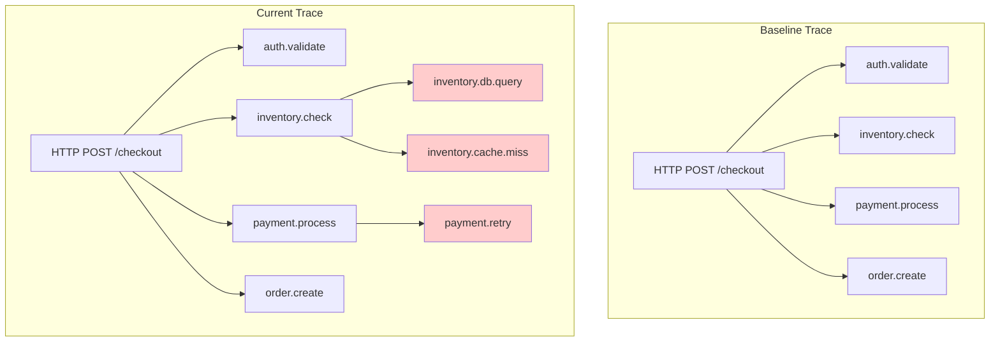
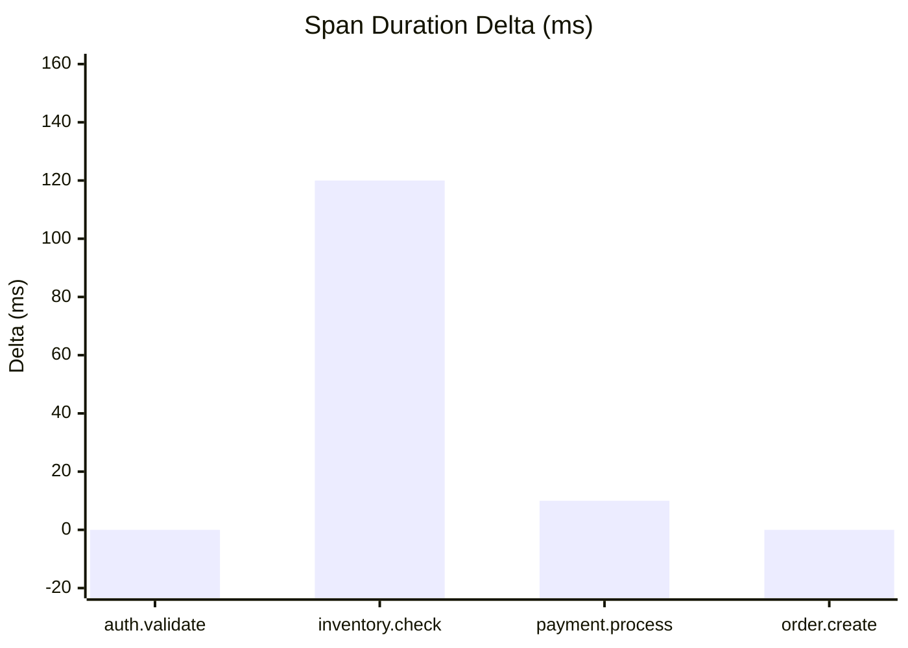
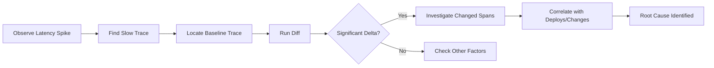

# How to Create Trace Comparison

Author: [nawazdhandala](https://github.com/nawazdhandala)

Tags: Tracing, Comparison, Performance, Debugging

Description: Learn how to compare distributed traces to detect performance regressions, identify bottlenecks, and debug production issues faster.

---

> When a single trace tells you what happened, comparing two traces tells you what changed.

Debugging distributed systems gets complicated fast. You know something slowed down, but without context, finding the culprit feels like searching in the dark. Trace comparison changes that. By putting two traces side by side, you can see exactly which spans grew, shrank, or failed differently. This guide covers the fundamentals of trace comparison: establishing baselines, detecting regressions, and building diff views that surface real problems.

---

## Table of Contents

1. Why Compare Traces?
2. Baseline Traces: Your Reference Point
3. Trace Diff Fundamentals
4. Visual Comparison with Mermaid Diagrams
5. Detecting Performance Regressions
6. Building a Comparison Workflow
7. Common Patterns and Anti-Patterns
8. Practical Examples
9. Automating Trace Comparison
10. Summary

---

## 1. Why Compare Traces?

A single trace shows the journey of one request through your system. Useful, but limited. When latency spikes or errors appear, you need to answer: "What changed?"

Trace comparison helps you:

| Goal | How Comparison Helps |
|------|----------------------|
| Find regressions | Compare pre/post deploy traces to spot new slowdowns |
| Debug intermittent issues | Diff a slow trace against a fast one for the same endpoint |
| Validate fixes | Confirm a change actually improved performance |
| Understand behavior changes | See how code paths differ between environments |
| Capacity planning | Compare traces under different load levels |

Without comparison, you rely on memory, intuition, or grep. With it, you get structured answers.

---

## 2. Baseline Traces: Your Reference Point

A baseline trace is a known-good example that represents expected behavior. Think of it as a snapshot of "normal" that you measure against.

### Characteristics of a Good Baseline

- **Representative**: Captures a typical request, not an edge case
- **Recent**: Reflects current code and infrastructure
- **Stable**: Recorded during steady-state, not during traffic spikes
- **Complete**: Includes all expected spans without sampling gaps

### How to Capture Baselines

1. **Tag baseline traces explicitly**: Add an attribute like `trace.baseline=true` during collection
2. **Store reference trace IDs**: Keep a lookup of baseline trace IDs per endpoint/operation
3. **Automate capture post-deploy**: After a stable release, save one healthy trace per critical path
4. **Version your baselines**: Associate baselines with git commits or release tags

Example attribute setup in OpenTelemetry:

```typescript
const span = tracer.startSpan('checkout.process', {
  attributes: {
    'trace.baseline': process.env.CAPTURE_BASELINE === 'true',
    'app.version': process.env.APP_VERSION,
    'deploy.id': process.env.DEPLOY_ID,
  },
});
```

### Baseline Storage Strategies

| Approach | Pros | Cons |
|----------|------|------|
| Store trace JSON in git | Version controlled, reviewable | Gets stale quickly |
| Database with trace IDs | Query by endpoint/version | Requires tooling |
| Observability backend tags | Integrated with existing workflow | May lack export features |

Pick based on your team's workflow. The important part is having something to compare against.

---

## 3. Trace Diff Fundamentals

A trace diff shows what changed between two traces. At its core, it aligns spans by operation name and highlights differences in timing, attributes, and structure.

### What to Compare

| Element | Comparison Type | Significance |
|---------|-----------------|--------------|
| Span duration | Numeric diff | Identifies slowdowns |
| Span count | Count diff | Detects missing or extra operations |
| Span order | Sequence diff | Reveals changed execution paths |
| Attributes | Key-value diff | Shows changed inputs/configs |
| Status codes | Categorical diff | Surfaces new errors |
| Child span structure | Tree diff | Exposes structural changes |

### Basic Diff Algorithm

1. **Match spans by name**: Pair spans from both traces with identical operation names
2. **Handle duplicates**: If multiple spans share a name, match by order or parent context
3. **Compute deltas**: For each matched pair, calculate duration difference
4. **Flag anomalies**: Mark spans with significant changes (threshold-based)
5. **Report orphans**: List spans that appear in only one trace

Pseudo-code:

```typescript
interface SpanSummary {
  name: string;
  duration: number;
  parentName?: string;
  attributes: Record<string, any>;
}

function diffTraces(baseline: SpanSummary[], current: SpanSummary[]): DiffResult {
  const matched: MatchedSpan[] = [];
  const added: SpanSummary[] = [];
  const removed: SpanSummary[] = [];

  const baselineMap = new Map(baseline.map(s => [s.name, s]));
  const currentMap = new Map(current.map(s => [s.name, s]));

  for (const span of current) {
    const base = baselineMap.get(span.name);
    if (base) {
      matched.push({
        name: span.name,
        baselineDuration: base.duration,
        currentDuration: span.duration,
        delta: span.duration - base.duration,
        deltaPercent: ((span.duration - base.duration) / base.duration) * 100,
      });
    } else {
      added.push(span);
    }
  }

  for (const span of baseline) {
    if (!currentMap.has(span.name)) {
      removed.push(span);
    }
  }

  return { matched, added, removed };
}
```

---

## 4. Visual Comparison with Mermaid Diagrams

Visualizing trace differences makes patterns obvious at a glance. Here are common comparison views.

### Side-by-Side Timeline Comparison

This shows two traces with aligned timelines. Longer bars indicate slower operations.

```mermaid
gantt
    title Trace Comparison: Checkout Endpoint
    dateFormat X
    axisFormat %L ms

    section Baseline (v1.2.0)
    HTTP POST /checkout       :baseline1, 0, 150
    auth.validate             :baseline2, 5, 25
    inventory.check           :baseline3, 30, 60
    payment.process           :baseline4, 95, 45
    order.create              :baseline5, 145, 5

    section Current (v1.3.0)
    HTTP POST /checkout       :current1, 0, 280
    auth.validate             :current2, 5, 25
    inventory.check           :current3, 30, 180
    payment.process           :current4, 215, 55
    order.create              :current5, 275, 5
```



Reading this diagram: The current trace takes 280ms vs 150ms baseline. The `inventory.check` span grew from 30ms to 150ms. That is your regression.

### Structural Diff View

When spans are added or removed, a tree diff helps visualize the change.



The red-highlighted spans (`inventory.db.query`, `inventory.cache.miss`, `payment.retry`) are new in the current trace. They explain the latency increase.

### Duration Delta Chart

For quick scanning across many spans:



Positive bars show slowdowns. `inventory.check` stands out with a +120ms increase.

---

## 5. Detecting Performance Regressions

Regression detection answers: "Did this deploy make things worse?"

### Threshold-Based Detection

Set thresholds for acceptable variance:

```typescript
interface RegressionRule {
  spanNamePattern: RegExp;
  maxDurationIncreaseMs: number;
  maxDurationIncreasePercent: number;
}

const rules: RegressionRule[] = [
  { spanNamePattern: /^HTTP/, maxDurationIncreaseMs: 50, maxDurationIncreasePercent: 20 },
  { spanNamePattern: /^db\./, maxDurationIncreaseMs: 10, maxDurationIncreasePercent: 30 },
  { spanNamePattern: /^payment\./, maxDurationIncreaseMs: 100, maxDurationIncreasePercent: 25 },
];

function detectRegressions(diff: DiffResult, rules: RegressionRule[]): Regression[] {
  const regressions: Regression[] = [];

  for (const match of diff.matched) {
    for (const rule of rules) {
      if (rule.spanNamePattern.test(match.name)) {
        const exceededMs = match.delta > rule.maxDurationIncreaseMs;
        const exceededPercent = match.deltaPercent > rule.maxDurationIncreasePercent;

        if (exceededMs && exceededPercent) {
          regressions.push({
            spanName: match.name,
            baselineDuration: match.baselineDuration,
            currentDuration: match.currentDuration,
            delta: match.delta,
            rule: rule,
          });
        }
        break;
      }
    }
  }

  return regressions;
}
```

### Statistical Comparison

For more robust detection, compare against multiple baseline samples:

```typescript
interface SpanStats {
  name: string;
  mean: number;
  stdDev: number;
  p50: number;
  p95: number;
  p99: number;
  sampleCount: number;
}

function isRegression(current: number, baseline: SpanStats, sigmaThreshold = 2): boolean {
  const zScore = (current - baseline.mean) / baseline.stdDev;
  return zScore > sigmaThreshold;
}
```

A z-score above 2 means the current value is more than 2 standard deviations from the baseline mean. That is statistically significant.

### Regression Report Structure

```typescript
interface RegressionReport {
  traceId: string;
  baselineTraceId: string;
  timestamp: string;
  endpoint: string;
  totalDurationDelta: number;
  regressions: Array<{
    spanName: string;
    delta: number;
    severity: 'low' | 'medium' | 'high' | 'critical';
    possibleCauses: string[];
  }>;
  newSpans: string[];
  missingSpans: string[];
}
```

---

## 6. Building a Comparison Workflow

A practical trace comparison workflow integrates into your existing debugging and deployment process.

### Manual Comparison Flow



### Automated CI/CD Integration

Run trace comparison as part of your deployment pipeline:

```yaml
# .github/workflows/trace-comparison.yml
name: Trace Comparison Check

on:
  deployment_status:
    types: [success]

jobs:
  compare-traces:
    if: github.event.deployment_status.state == 'success'
    runs-on: ubuntu-latest
    steps:
      - name: Wait for traffic
        run: sleep 300  # Wait 5 minutes for traces to accumulate

      - name: Fetch current traces
        run: |
          curl -H "Authorization: Bearer ${{ secrets.ONEUPTIME_TOKEN }}" \
            "https://oneuptime.com/api/traces?service=checkout&limit=10" \
            -o current-traces.json

      - name: Fetch baseline traces
        run: |
          curl -H "Authorization: Bearer ${{ secrets.ONEUPTIME_TOKEN }}" \
            "https://oneuptime.com/api/traces?service=checkout&tag=baseline&limit=10" \
            -o baseline-traces.json

      - name: Run comparison
        run: |
          npx trace-diff --baseline baseline-traces.json \
            --current current-traces.json \
            --threshold-ms 50 \
            --threshold-percent 20 \
            --output report.json

      - name: Check for regressions
        run: |
          if jq -e '.regressions | length > 0' report.json; then
            echo "Performance regression detected!"
            jq '.regressions' report.json
            exit 1
          fi
```

### Comparison Dashboard Components

Build a dashboard that shows:

1. **Trace selector**: Pick baseline and current traces by ID, time range, or endpoint
2. **Timeline overlay**: Aligned Gantt view of both traces
3. **Delta table**: Sortable list of span changes with severity indicators
4. **Structural diff**: Tree view showing added/removed spans
5. **Attribute diff**: Side-by-side key-value comparison

---

## 7. Common Patterns and Anti-Patterns

### Patterns That Work

| Pattern | Description |
|---------|-------------|
| Compare same endpoint | Only diff traces from identical routes/operations |
| Normalize for load | Account for concurrent request counts |
| Use representative traces | Avoid comparing edge cases against happy paths |
| Version your baselines | Associate baselines with specific releases |
| Automate on deploy | Run comparison automatically after each deploy |

### Anti-Patterns to Avoid

| Anti-Pattern | Problem | Fix |
|--------------|---------|-----|
| Comparing different endpoints | Apples to oranges | Filter traces by operation name |
| Stale baselines | Miss gradual regressions | Refresh baselines regularly |
| Single sample comparison | Noise from variance | Compare against statistical baseline |
| Ignoring structural changes | Miss added spans | Include tree diff in analysis |
| Manual-only workflow | Inconsistent coverage | Automate in CI/CD |

---

## 8. Practical Examples

### Example 1: Post-Deploy Regression Hunt

Scenario: After deploying v2.1.0, p95 latency for `/api/orders` jumped from 200ms to 450ms.

**Step 1: Capture traces**

```bash
# Get a slow trace from current version
curl "https://oneuptime.com/api/traces?service=orders&minDuration=400ms&limit=1" \
  -H "Authorization: Bearer $TOKEN" -o slow-trace.json

# Get baseline trace from before deploy
curl "https://oneuptime.com/api/traces?service=orders&version=2.0.0&limit=1" \
  -H "Authorization: Bearer $TOKEN" -o baseline-trace.json
```

**Step 2: Run diff**

```typescript
const baseline = parseTrace(baselineJson);
const current = parseTrace(slowTraceJson);
const diff = diffTraces(baseline, current);

console.table(diff.matched.filter(m => m.delta > 10).map(m => ({
  span: m.name,
  baseline: `${m.baselineDuration}ms`,
  current: `${m.currentDuration}ms`,
  delta: `+${m.delta}ms`,
})));
```

Output:

```
| span              | baseline | current | delta   |
|-------------------|----------|---------|---------|
| db.query.orders   | 45ms     | 180ms   | +135ms  |
| cache.lookup      | 5ms      | 85ms    | +80ms   |
```

**Step 3: Investigate**

The database query and cache lookup both regressed. Check recent changes to those components.

### Example 2: Intermittent Slowdown Analysis

Scenario: The same endpoint sometimes responds in 100ms, sometimes in 800ms.

**Approach**: Compare a fast trace against a slow one for the same endpoint.

```mermaid
gantt
    title Fast vs Slow Trace: GET /api/users/:id
    dateFormat X
    axisFormat %L ms

    section Fast Trace (105ms)
    HTTP GET /api/users/:id    :fast1, 0, 105
    cache.get                  :fast2, 5, 8
    serialize.response         :fast3, 15, 90

    section Slow Trace (820ms)
    HTTP GET /api/users/:id    :slow1, 0, 820
    cache.get                  :slow2, 5, 15
    db.query.users             :slow3, 25, 680
    serialize.response         :slow4, 710, 110
```



The slow trace has an extra `db.query.users` span that takes 680ms. This only appears on cache misses. The fix: warm the cache or optimize the database query.

### Example 3: A/B Comparison Between Environments

Scenario: Staging is fast, production is slow for the same request.

Compare traces from both environments to find infrastructure differences:

```typescript
const stagingTrace = await fetchTrace({ env: 'staging', endpoint: '/checkout' });
const prodTrace = await fetchTrace({ env: 'production', endpoint: '/checkout' });

const diff = diffTraces(stagingTrace, prodTrace);

// Look for environment-specific differences
const attrDiffs = compareAttributes(stagingTrace, prodTrace);
console.log('Attribute differences:', attrDiffs);
// Output might show: { 'db.host': ['staging-db', 'prod-db-replica-3'] }
```

---

## 9. Automating Trace Comparison

### Scheduled Baseline Refresh

```typescript
// Run daily to update baselines
async function refreshBaselines() {
  const criticalEndpoints = ['/checkout', '/api/orders', '/api/users'];

  for (const endpoint of criticalEndpoints) {
    const traces = await fetchTraces({
      endpoint,
      status: 'ok',
      durationPercentile: 'p50',  // Get a median-duration trace
      limit: 1,
    });

    if (traces.length > 0) {
      await storeBaseline({
        endpoint,
        traceId: traces[0].traceId,
        version: getCurrentAppVersion(),
        timestamp: new Date().toISOString(),
      });
    }
  }
}
```

### Alerting on Regressions

```typescript
async function checkForRegressions() {
  const endpoints = await getMonitoredEndpoints();

  for (const endpoint of endpoints) {
    const baseline = await getBaseline(endpoint);
    const recent = await fetchRecentTraces(endpoint, { limit: 10 });

    for (const trace of recent) {
      const diff = diffTraces(baseline, trace);
      const regressions = detectRegressions(diff, getRules());

      if (regressions.length > 0) {
        await sendAlert({
          type: 'trace-regression',
          endpoint,
          traceId: trace.traceId,
          baselineTraceId: baseline.traceId,
          regressions,
        });
      }
    }
  }
}
```

### Integration with Observability Platforms

Most observability platforms support trace comparison through their APIs or UIs:

1. **Query API**: Fetch traces by ID, time range, or attributes
2. **Export format**: Get traces as JSON (OTLP format or vendor-specific)
3. **Comparison views**: Some platforms offer built-in diff views
4. **Alerting hooks**: Trigger alerts based on trace characteristics

---

## 10. Summary

| Concept | Key Point |
|---------|-----------|
| Baseline traces | Establish known-good reference points for comparison |
| Trace diff | Align spans by name and compute duration deltas |
| Visual comparison | Use Gantt charts and tree diffs to spot changes fast |
| Regression detection | Set thresholds and automate checks in CI/CD |
| Statistical baselines | Compare against mean and standard deviation, not single samples |
| Structural analysis | Watch for added or missing spans, not just timing changes |

Trace comparison transforms debugging from guesswork into analysis. Start by capturing baselines for your critical paths. Build diff tooling that surfaces the biggest deltas. Automate comparison in your deployment pipeline. When something breaks, you will know exactly what changed.

---

*Want to compare traces visually and detect regressions automatically? Send your OpenTelemetry traces to [OneUptime](https://oneuptime.com) and get side-by-side trace analysis out of the box.*

---

**Related Reading:**

- [What are Traces and Spans in OpenTelemetry: A Practical Guide](https://oneuptime.com/blog/post/2025-08-27-traces-and-spans-in-opentelemetry/view)
- [Basics of Profiling: Turning CPU and Memory Hotspots into Action](https://oneuptime.com/blog/post/2025-09-09-basics-of-profiling/view)
- [How to Reduce Noise in OpenTelemetry](https://oneuptime.com/blog/post/2025-08-25-how-to-reduce-noise-in-opentelemetry/view)
