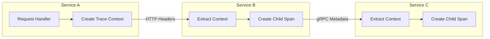
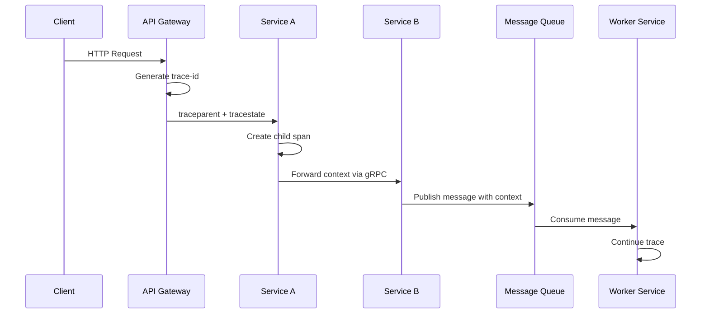
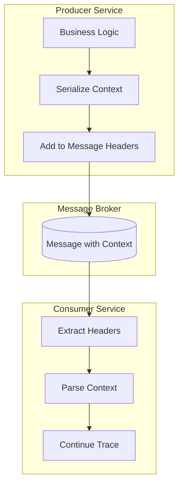
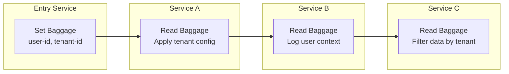

# How to Build Trace Context Design

Author: [nawazdhandala](https://github.com/nawazdhandala)

Tags: Observability, Tracing, OpenTelemetry, Distributed Systems

Description: Learn how to design trace context propagation for distributed systems with W3C Trace Context and baggage.

---

Distributed tracing is essential for understanding how requests flow through microservices architectures. At its core lies trace context, the mechanism that ties together spans across service boundaries. In this post, we will explore how to design and implement trace context propagation following W3C standards and best practices.

## What is Trace Context?

Trace context is metadata that identifies a distributed trace and the current span within that trace. It travels with requests as they move through your system, enabling correlation of logs, metrics, and traces across service boundaries.



## W3C Trace Context Standard

The W3C Trace Context specification defines two HTTP headers for propagating trace context:

1. **traceparent**: Required header containing trace identification
2. **tracestate**: Optional header for vendor-specific trace data

### The traceparent Header

The `traceparent` header follows a specific format:

```
traceparent: {version}-{trace-id}-{parent-id}-{trace-flags}
```

Let's break down each component:

| Field | Length | Description |
|-------|--------|-------------|
| version | 2 hex chars | Format version (currently "00") |
| trace-id | 32 hex chars | Unique identifier for the entire trace |
| parent-id | 16 hex chars | Identifier of the parent span |
| trace-flags | 2 hex chars | Flags such as sampling decisions |

Here is an example:

```
traceparent: 00-4bf92f3577b34da6a3ce929d0e0e4736-00f067aa0ba902b7-01
```

### The tracestate Header

The `tracestate` header carries vendor-specific trace data as key-value pairs:

```
tracestate: vendor1=value1,vendor2=value2
```

This allows multiple tracing systems to coexist without losing their specific context data.

## Implementing Trace Context in Code

### Core Data Structures

First, let's define the core data structures for trace context:

```typescript
// trace-context.ts
// Represents the W3C Trace Context specification

// Version of the trace context format
const TRACE_CONTEXT_VERSION = "00";

// Interface representing the parsed traceparent header
interface TraceParent {
    // Format version (2 hex characters)
    version: string;

    // Unique identifier for the entire distributed trace (32 hex characters)
    traceId: string;

    // Identifier of the parent span (16 hex characters)
    parentId: string;

    // Trace flags controlling behavior like sampling (2 hex characters)
    traceFlags: string;
}

// Interface for vendor-specific trace state
interface TraceState {
    // Key-value pairs for vendor-specific data
    entries: Map<string, string>;
}

// Complete trace context combining traceparent and tracestate
interface TraceContext {
    traceParent: TraceParent;
    traceState: TraceState;
}
```

### Parsing the traceparent Header

```typescript
// traceparent-parser.ts
// Parser for W3C traceparent header format

// Regular expression to validate and parse traceparent header
// Format: version-traceid-parentid-traceflags
const TRACEPARENT_REGEX = /^([0-9a-f]{2})-([0-9a-f]{32})-([0-9a-f]{16})-([0-9a-f]{2})$/;

// Invalid trace ID (all zeros) that should be rejected
const INVALID_TRACE_ID = "00000000000000000000000000000000";

// Invalid parent ID (all zeros) that should be rejected
const INVALID_PARENT_ID = "0000000000000000";

/**
 * Parses a traceparent header string into a structured TraceParent object.
 * Returns null if the header is invalid or malformed.
 *
 * @param header - The raw traceparent header value
 * @returns Parsed TraceParent object or null if invalid
 */
function parseTraceParent(header: string): TraceParent | null {
    // Normalize to lowercase for case-insensitive matching
    const normalized = header.trim().toLowerCase();

    // Attempt to match against the expected format
    const match = normalized.match(TRACEPARENT_REGEX);

    if (!match) {
        // Header does not match expected format
        console.warn("Invalid traceparent format:", header);
        return null;
    }

    const [, version, traceId, parentId, traceFlags] = match;

    // Validate that trace ID is not all zeros
    if (traceId === INVALID_TRACE_ID) {
        console.warn("Invalid trace ID (all zeros)");
        return null;
    }

    // Validate that parent ID is not all zeros
    if (parentId === INVALID_PARENT_ID) {
        console.warn("Invalid parent ID (all zeros)");
        return null;
    }

    // Return the parsed trace parent
    return {
        version,
        traceId,
        parentId,
        traceFlags
    };
}

/**
 * Serializes a TraceParent object back to header string format.
 *
 * @param traceParent - The TraceParent object to serialize
 * @returns Formatted traceparent header string
 */
function serializeTraceParent(traceParent: TraceParent): string {
    return `${traceParent.version}-${traceParent.traceId}-${traceParent.parentId}-${traceParent.traceFlags}`;
}
```

### Parsing the tracestate Header

```typescript
// tracestate-parser.ts
// Parser for W3C tracestate header format

// Maximum number of list members allowed in tracestate
const MAX_TRACESTATE_MEMBERS = 32;

// Regular expression for validating tracestate keys
const KEY_REGEX = /^[a-z][a-z0-9_\-*/]{0,255}$/;

// Regular expression for validating vendor keys with tenant
const VENDOR_KEY_REGEX = /^[a-z0-9][a-z0-9_\-*/]{0,240}@[a-z][a-z0-9_\-*/]{0,13}$/;

/**
 * Parses a tracestate header into a structured TraceState object.
 * The tracestate header contains vendor-specific key-value pairs.
 *
 * @param header - The raw tracestate header value
 * @returns Parsed TraceState object
 */
function parseTraceState(header: string): TraceState {
    const entries = new Map<string, string>();

    // Handle empty or missing header
    if (!header || header.trim() === "") {
        return { entries };
    }

    // Split by comma to get individual key-value pairs
    const pairs = header.split(",");

    // Process each pair, respecting the maximum member limit
    for (let i = 0; i < Math.min(pairs.length, MAX_TRACESTATE_MEMBERS); i++) {
        const pair = pairs[i].trim();

        // Find the first equals sign to split key and value
        const separatorIndex = pair.indexOf("=");

        if (separatorIndex === -1) {
            // Skip malformed entries without key-value separator
            continue;
        }

        const key = pair.substring(0, separatorIndex);
        const value = pair.substring(separatorIndex + 1);

        // Validate the key format
        if (!isValidKey(key)) {
            console.warn("Invalid tracestate key:", key);
            continue;
        }

        // Add to entries map (first occurrence wins)
        if (!entries.has(key)) {
            entries.set(key, value);
        }
    }

    return { entries };
}

/**
 * Validates a tracestate key against W3C specification.
 *
 * @param key - The key to validate
 * @returns True if the key is valid
 */
function isValidKey(key: string): boolean {
    return KEY_REGEX.test(key) || VENDOR_KEY_REGEX.test(key);
}

/**
 * Serializes a TraceState object back to header string format.
 *
 * @param traceState - The TraceState object to serialize
 * @returns Formatted tracestate header string
 */
function serializeTraceState(traceState: TraceState): string {
    const pairs: string[] = [];

    traceState.entries.forEach((value, key) => {
        pairs.push(`${key}=${value}`);
    });

    return pairs.join(",");
}
```

## Context Propagation Architecture

The following diagram shows how trace context flows through a distributed system:



## HTTP Context Propagation

Here is how to implement context propagation for HTTP requests:

```typescript
// http-propagator.ts
// HTTP-based trace context propagation

// Standard header names as defined by W3C
const TRACEPARENT_HEADER = "traceparent";
const TRACESTATE_HEADER = "tracestate";

/**
 * Injects trace context into outgoing HTTP headers.
 * Call this before making HTTP requests to downstream services.
 *
 * @param context - The current trace context
 * @param headers - Headers object to inject into
 */
function injectHttpContext(
    context: TraceContext,
    headers: Record<string, string>
): void {
    // Always inject traceparent header
    headers[TRACEPARENT_HEADER] = serializeTraceParent(context.traceParent);

    // Only inject tracestate if it has entries
    if (context.traceState.entries.size > 0) {
        headers[TRACESTATE_HEADER] = serializeTraceState(context.traceState);
    }
}

/**
 * Extracts trace context from incoming HTTP headers.
 * Call this when receiving HTTP requests from upstream services.
 *
 * @param headers - Incoming request headers
 * @returns Extracted trace context or null if not present
 */
function extractHttpContext(
    headers: Record<string, string | string[] | undefined>
): TraceContext | null {
    // Get traceparent header value
    const traceparentHeader = getHeaderValue(headers, TRACEPARENT_HEADER);

    if (!traceparentHeader) {
        // No trace context in request
        return null;
    }

    // Parse the traceparent header
    const traceParent = parseTraceParent(traceparentHeader);

    if (!traceParent) {
        // Invalid traceparent header
        return null;
    }

    // Parse tracestate header if present
    const tracestateHeader = getHeaderValue(headers, TRACESTATE_HEADER);
    const traceState = tracestateHeader
        ? parseTraceState(tracestateHeader)
        : { entries: new Map() };

    return { traceParent, traceState };
}

/**
 * Helper to get a header value, handling arrays and case sensitivity.
 *
 * @param headers - Headers object
 * @param name - Header name to retrieve
 * @returns Header value as string or undefined
 */
function getHeaderValue(
    headers: Record<string, string | string[] | undefined>,
    name: string
): string | undefined {
    // Try exact case first
    let value = headers[name];

    // Try lowercase
    if (value === undefined) {
        value = headers[name.toLowerCase()];
    }

    // Handle array values (take first)
    if (Array.isArray(value)) {
        return value[0];
    }

    return value;
}
```

### Express.js Middleware Example

```typescript
// express-tracing-middleware.ts
// Express middleware for automatic trace context handling

import { Request, Response, NextFunction } from "express";
import { randomBytes } from "crypto";

/**
 * Express middleware that handles trace context propagation.
 * Extracts context from incoming requests and creates new traces when needed.
 */
function tracingMiddleware(
    req: Request,
    res: Response,
    next: NextFunction
): void {
    // Try to extract existing trace context from headers
    let context = extractHttpContext(req.headers as Record<string, string>);

    if (!context) {
        // No incoming context, create a new root trace
        context = createRootContext();
    } else {
        // Create a child span for this service
        context = createChildContext(context);
    }

    // Attach context to request for use in handlers
    (req as any).traceContext = context;

    // Add trace headers to response for debugging
    res.setHeader("x-trace-id", context.traceParent.traceId);

    next();
}

/**
 * Creates a new root trace context when no parent exists.
 *
 * @returns New trace context with generated IDs
 */
function createRootContext(): TraceContext {
    return {
        traceParent: {
            version: "00",
            traceId: generateTraceId(),
            parentId: generateSpanId(),
            traceFlags: "01" // Sampled
        },
        traceState: { entries: new Map() }
    };
}

/**
 * Creates a child context from an existing parent context.
 * Preserves trace ID but generates new span ID.
 *
 * @param parent - Parent trace context
 * @returns Child trace context
 */
function createChildContext(parent: TraceContext): TraceContext {
    return {
        traceParent: {
            version: parent.traceParent.version,
            traceId: parent.traceParent.traceId,
            parentId: generateSpanId(), // New span ID becomes the parent for downstream
            traceFlags: parent.traceParent.traceFlags
        },
        traceState: parent.traceState
    };
}

/**
 * Generates a random 32-character trace ID.
 *
 * @returns Hex string trace ID
 */
function generateTraceId(): string {
    return randomBytes(16).toString("hex");
}

/**
 * Generates a random 16-character span ID.
 *
 * @returns Hex string span ID
 */
function generateSpanId(): string {
    return randomBytes(8).toString("hex");
}
```

## gRPC Context Propagation

For gRPC services, trace context is propagated via metadata:

```typescript
// grpc-propagator.ts
// gRPC-based trace context propagation using metadata

import * as grpc from "@grpc/grpc-js";

// gRPC metadata keys (lowercase by convention)
const GRPC_TRACEPARENT_KEY = "traceparent";
const GRPC_TRACESTATE_KEY = "tracestate";

/**
 * Injects trace context into gRPC metadata for outgoing calls.
 *
 * @param context - Current trace context
 * @param metadata - gRPC metadata object to inject into
 */
function injectGrpcContext(
    context: TraceContext,
    metadata: grpc.Metadata
): void {
    // Add traceparent to metadata
    metadata.set(
        GRPC_TRACEPARENT_KEY,
        serializeTraceParent(context.traceParent)
    );

    // Add tracestate if present
    if (context.traceState.entries.size > 0) {
        metadata.set(
            GRPC_TRACESTATE_KEY,
            serializeTraceState(context.traceState)
        );
    }
}

/**
 * Extracts trace context from incoming gRPC metadata.
 *
 * @param metadata - Incoming gRPC metadata
 * @returns Extracted trace context or null if not present
 */
function extractGrpcContext(metadata: grpc.Metadata): TraceContext | null {
    // Get traceparent from metadata
    const traceparentValues = metadata.get(GRPC_TRACEPARENT_KEY);

    if (traceparentValues.length === 0) {
        return null;
    }

    // Parse traceparent (take first value)
    const traceparentHeader = traceparentValues[0].toString();
    const traceParent = parseTraceParent(traceparentHeader);

    if (!traceParent) {
        return null;
    }

    // Parse tracestate if present
    const tracestateValues = metadata.get(GRPC_TRACESTATE_KEY);
    const traceState = tracestateValues.length > 0
        ? parseTraceState(tracestateValues[0].toString())
        : { entries: new Map() };

    return { traceParent, traceState };
}

/**
 * gRPC interceptor that automatically propagates trace context.
 * Use this for all outgoing gRPC calls to maintain trace continuity.
 */
function createTracingInterceptor(
    getCurrentContext: () => TraceContext | null
): grpc.Interceptor {
    return (options, nextCall) => {
        return new grpc.InterceptingCall(nextCall(options), {
            start: (metadata, listener, next) => {
                // Get current trace context
                const context = getCurrentContext();

                if (context) {
                    // Inject context into outgoing metadata
                    injectGrpcContext(context, metadata);
                }

                next(metadata, listener);
            }
        });
    };
}
```

## Message Queue Context Propagation

For asynchronous messaging systems, trace context must be embedded in message headers or properties:



### RabbitMQ Example

```typescript
// rabbitmq-propagator.ts
// RabbitMQ trace context propagation

import * as amqp from "amqplib";

// Header names for trace context in AMQP messages
const AMQP_TRACEPARENT_HEADER = "traceparent";
const AMQP_TRACESTATE_HEADER = "tracestate";

/**
 * Publishes a message with trace context included in headers.
 *
 * @param channel - AMQP channel
 * @param exchange - Exchange name
 * @param routingKey - Routing key
 * @param content - Message content
 * @param context - Current trace context
 */
async function publishWithContext(
    channel: amqp.Channel,
    exchange: string,
    routingKey: string,
    content: Buffer,
    context: TraceContext
): Promise<void> {
    // Build message headers with trace context
    const headers: Record<string, string> = {
        [AMQP_TRACEPARENT_HEADER]: serializeTraceParent(context.traceParent)
    };

    // Include tracestate if present
    if (context.traceState.entries.size > 0) {
        headers[AMQP_TRACESTATE_HEADER] = serializeTraceState(context.traceState);
    }

    // Publish message with headers
    channel.publish(exchange, routingKey, content, {
        headers,
        // Ensure message is persistent
        persistent: true
    });
}

/**
 * Extracts trace context from an incoming AMQP message.
 *
 * @param message - Incoming AMQP message
 * @returns Extracted trace context or null if not present
 */
function extractMessageContext(
    message: amqp.ConsumeMessage
): TraceContext | null {
    const headers = message.properties.headers || {};

    // Get traceparent header
    const traceparentHeader = headers[AMQP_TRACEPARENT_HEADER];

    if (!traceparentHeader) {
        return null;
    }

    // Parse traceparent
    const traceParent = parseTraceParent(traceparentHeader.toString());

    if (!traceParent) {
        return null;
    }

    // Parse tracestate if present
    const tracestateHeader = headers[AMQP_TRACESTATE_HEADER];
    const traceState = tracestateHeader
        ? parseTraceState(tracestateHeader.toString())
        : { entries: new Map() };

    return { traceParent, traceState };
}

/**
 * Creates a consumer that automatically extracts and uses trace context.
 *
 * @param channel - AMQP channel
 * @param queue - Queue name
 * @param handler - Message handler function
 */
async function consumeWithTracing(
    channel: amqp.Channel,
    queue: string,
    handler: (
        content: Buffer,
        context: TraceContext | null
    ) => Promise<void>
): Promise<void> {
    await channel.consume(queue, async (message) => {
        if (!message) {
            return;
        }

        // Extract trace context from message
        let context = extractMessageContext(message);

        // Create child context if parent exists
        if (context) {
            context = createChildContext(context);
        }

        try {
            // Process message with trace context
            await handler(message.content, context);

            // Acknowledge successful processing
            channel.ack(message);
        } catch (error) {
            // Reject and requeue on failure
            channel.nack(message, false, true);
        }
    });
}
```

### Kafka Example

```typescript
// kafka-propagator.ts
// Kafka trace context propagation

import { Kafka, Producer, Consumer, Message, EachMessagePayload } from "kafkajs";

/**
 * Sends a Kafka message with trace context in headers.
 *
 * @param producer - Kafka producer instance
 * @param topic - Topic name
 * @param key - Message key
 * @param value - Message value
 * @param context - Current trace context
 */
async function sendWithContext(
    producer: Producer,
    topic: string,
    key: string,
    value: Buffer,
    context: TraceContext
): Promise<void> {
    // Build Kafka headers with trace context
    const headers: Record<string, string> = {
        traceparent: serializeTraceParent(context.traceParent)
    };

    if (context.traceState.entries.size > 0) {
        headers.tracestate = serializeTraceState(context.traceState);
    }

    // Send message to Kafka
    await producer.send({
        topic,
        messages: [
            {
                key,
                value,
                headers
            }
        ]
    });
}

/**
 * Extracts trace context from Kafka message headers.
 *
 * @param message - Kafka message
 * @returns Extracted trace context or null
 */
function extractKafkaContext(message: Message): TraceContext | null {
    const headers = message.headers || {};

    // Get traceparent header (Buffer or string)
    const traceparentHeader = headers.traceparent;

    if (!traceparentHeader) {
        return null;
    }

    // Convert Buffer to string if needed
    const traceparentString = Buffer.isBuffer(traceparentHeader)
        ? traceparentHeader.toString()
        : traceparentHeader;

    // Parse traceparent
    const traceParent = parseTraceParent(traceparentString);

    if (!traceParent) {
        return null;
    }

    // Parse tracestate if present
    const tracestateHeader = headers.tracestate;
    let traceState: TraceState = { entries: new Map() };

    if (tracestateHeader) {
        const tracestateString = Buffer.isBuffer(tracestateHeader)
            ? tracestateHeader.toString()
            : tracestateHeader;
        traceState = parseTraceState(tracestateString);
    }

    return { traceParent, traceState };
}
```

## Context Storage and Thread Safety

In multi-threaded environments, trace context must be stored safely. Here is a design pattern using async local storage:

```typescript
// context-storage.ts
// Thread-safe trace context storage using AsyncLocalStorage

import { AsyncLocalStorage } from "async_hooks";

// Global storage for trace context
const traceContextStorage = new AsyncLocalStorage<TraceContext>();

/**
 * Runs a function with the given trace context.
 * Context is available to all async operations within the callback.
 *
 * @param context - Trace context to set
 * @param fn - Function to run with context
 * @returns Return value of the function
 */
function runWithContext<T>(
    context: TraceContext,
    fn: () => T
): T {
    return traceContextStorage.run(context, fn);
}

/**
 * Gets the current trace context from async local storage.
 *
 * @returns Current trace context or undefined if not set
 */
function getCurrentContext(): TraceContext | undefined {
    return traceContextStorage.getStore();
}

/**
 * Higher-order function that wraps async functions with context propagation.
 * Ensures context is preserved across async boundaries.
 *
 * @param fn - Async function to wrap
 * @returns Wrapped function with context preservation
 */
function withContextPropagation<T extends (...args: any[]) => Promise<any>>(
    fn: T
): T {
    return (async (...args: Parameters<T>): Promise<ReturnType<T>> => {
        const context = getCurrentContext();

        if (context) {
            return runWithContext(context, () => fn(...args));
        }

        return fn(...args);
    }) as T;
}
```

## Baggage Propagation

Beyond trace context, W3C Baggage allows propagating arbitrary key-value pairs:



```typescript
// baggage.ts
// W3C Baggage implementation for cross-cutting concerns

// Baggage header name
const BAGGAGE_HEADER = "baggage";

// Maximum total size of baggage header (8KB recommended)
const MAX_BAGGAGE_SIZE = 8192;

// Interface for baggage entry with optional metadata
interface BaggageEntry {
    value: string;
    metadata?: string;
}

// Baggage container
interface Baggage {
    entries: Map<string, BaggageEntry>;
}

/**
 * Parses a baggage header string into a Baggage object.
 * Format: key1=value1;metadata,key2=value2
 *
 * @param header - Raw baggage header value
 * @returns Parsed Baggage object
 */
function parseBaggage(header: string): Baggage {
    const entries = new Map<string, BaggageEntry>();

    if (!header || header.trim() === "") {
        return { entries };
    }

    // Split by comma to get individual entries
    const parts = header.split(",");

    for (const part of parts) {
        const trimmed = part.trim();

        // Split by semicolon to separate value from metadata
        const segments = trimmed.split(";");

        if (segments.length === 0) {
            continue;
        }

        // First segment is key=value
        const keyValue = segments[0];
        const equalsIndex = keyValue.indexOf("=");

        if (equalsIndex === -1) {
            continue;
        }

        const key = decodeURIComponent(keyValue.substring(0, equalsIndex).trim());
        const value = decodeURIComponent(keyValue.substring(equalsIndex + 1).trim());

        // Remaining segments are metadata
        const metadata = segments.slice(1).join(";");

        entries.set(key, {
            value,
            metadata: metadata || undefined
        });
    }

    return { entries };
}

/**
 * Serializes a Baggage object to header string format.
 *
 * @param baggage - Baggage object to serialize
 * @returns Formatted baggage header string
 */
function serializeBaggage(baggage: Baggage): string {
    const parts: string[] = [];

    baggage.entries.forEach((entry, key) => {
        let part = `${encodeURIComponent(key)}=${encodeURIComponent(entry.value)}`;

        if (entry.metadata) {
            part += `;${entry.metadata}`;
        }

        parts.push(part);
    });

    const result = parts.join(",");

    // Warn if baggage exceeds recommended size
    if (result.length > MAX_BAGGAGE_SIZE) {
        console.warn(
            `Baggage size (${result.length}) exceeds recommended limit (${MAX_BAGGAGE_SIZE})`
        );
    }

    return result;
}

/**
 * Creates a new baggage with an additional entry.
 * Returns a new Baggage object (immutable operation).
 *
 * @param baggage - Existing baggage
 * @param key - Key to add
 * @param value - Value to add
 * @param metadata - Optional metadata
 * @returns New baggage with added entry
 */
function setBaggageEntry(
    baggage: Baggage,
    key: string,
    value: string,
    metadata?: string
): Baggage {
    // Create new map with existing entries
    const newEntries = new Map(baggage.entries);

    // Add or update the entry
    newEntries.set(key, { value, metadata });

    return { entries: newEntries };
}
```

## OpenTelemetry Integration

Here is how to integrate with OpenTelemetry for production-grade tracing:

```typescript
// otel-integration.ts
// OpenTelemetry SDK integration

import { NodeSDK } from "@opentelemetry/sdk-node";
import { getNodeAutoInstrumentations } from "@opentelemetry/auto-instrumentations-node";
import { OTLPTraceExporter } from "@opentelemetry/exporter-trace-otlp-http";
import { Resource } from "@opentelemetry/resources";
import { SemanticResourceAttributes } from "@opentelemetry/semantic-conventions";
import {
    W3CTraceContextPropagator,
    W3CBaggagePropagator,
    CompositePropagator
} from "@opentelemetry/core";

/**
 * Initializes OpenTelemetry SDK with W3C context propagation.
 * Call this at application startup before any other code runs.
 *
 * @param serviceName - Name of your service
 * @param exporterEndpoint - OTLP collector endpoint
 */
function initializeTracing(
    serviceName: string,
    exporterEndpoint: string
): NodeSDK {
    // Configure trace exporter
    const traceExporter = new OTLPTraceExporter({
        url: `${exporterEndpoint}/v1/traces`
    });

    // Create composite propagator for W3C standards
    const propagator = new CompositePropagator({
        propagators: [
            // W3C Trace Context propagation
            new W3CTraceContextPropagator(),
            // W3C Baggage propagation
            new W3CBaggagePropagator()
        ]
    });

    // Initialize the SDK
    const sdk = new NodeSDK({
        // Service identification
        resource: new Resource({
            [SemanticResourceAttributes.SERVICE_NAME]: serviceName,
            [SemanticResourceAttributes.SERVICE_VERSION]: "1.0.0"
        }),

        // Trace exporter configuration
        traceExporter,

        // Context propagation
        textMapPropagator: propagator,

        // Auto-instrumentation for common libraries
        instrumentations: [
            getNodeAutoInstrumentations({
                // Configure HTTP instrumentation
                "@opentelemetry/instrumentation-http": {
                    // Propagate context on outgoing requests
                    requestHook: (span, request) => {
                        span.setAttribute("http.request.id", generateRequestId());
                    }
                },
                // Configure gRPC instrumentation
                "@opentelemetry/instrumentation-grpc": {
                    // Include metadata in traces
                    ignoreGrpcMethods: ["healthCheck"]
                }
            })
        ]
    });

    // Start the SDK
    sdk.start();

    // Graceful shutdown handling
    process.on("SIGTERM", () => {
        sdk.shutdown()
            .then(() => console.log("Tracing terminated"))
            .catch((error) => console.error("Error terminating tracing", error))
            .finally(() => process.exit(0));
    });

    return sdk;
}

/**
 * Helper to generate unique request IDs.
 */
function generateRequestId(): string {
    return `req-${Date.now()}-${Math.random().toString(36).substr(2, 9)}`;
}
```

## Best Practices

### 1. Always Propagate Context

Ensure every outgoing request includes trace context:

```typescript
// best-practices.ts
// Best practices for trace context propagation

import axios, { AxiosInstance } from "axios";

/**
 * Creates an axios instance that automatically propagates trace context.
 * Use this instead of raw axios for all HTTP calls.
 */
function createTracedHttpClient(): AxiosInstance {
    const client = axios.create();

    // Add request interceptor for context injection
    client.interceptors.request.use((config) => {
        const context = getCurrentContext();

        if (context) {
            // Inject trace context into headers
            config.headers = config.headers || {};
            injectHttpContext(context, config.headers as Record<string, string>);
        }

        return config;
    });

    return client;
}
```

### 2. Handle Missing Context Gracefully

```typescript
/**
 * Gets or creates trace context, never returns null.
 * Use this when you need guaranteed context availability.
 */
function getOrCreateContext(): TraceContext {
    const existing = getCurrentContext();

    if (existing) {
        return existing;
    }

    // Create new root context
    console.debug("No existing trace context, creating new root trace");

    return createRootContext();
}
```

### 3. Sampling Decisions

Respect and propagate sampling flags:

```typescript
// Trace flag constants
const SAMPLED_FLAG = 0x01;

/**
 * Checks if the current trace is sampled.
 *
 * @param context - Trace context to check
 * @returns True if the trace should be recorded
 */
function isSampled(context: TraceContext): boolean {
    const flags = parseInt(context.traceParent.traceFlags, 16);
    return (flags & SAMPLED_FLAG) === SAMPLED_FLAG;
}

/**
 * Sets the sampled flag on a trace context.
 *
 * @param context - Trace context to modify
 * @param sampled - Whether to sample this trace
 * @returns New trace context with updated flags
 */
function setSampled(context: TraceContext, sampled: boolean): TraceContext {
    let flags = parseInt(context.traceParent.traceFlags, 16);

    if (sampled) {
        flags |= SAMPLED_FLAG;
    } else {
        flags &= ~SAMPLED_FLAG;
    }

    return {
        ...context,
        traceParent: {
            ...context.traceParent,
            traceFlags: flags.toString(16).padStart(2, "0")
        }
    };
}
```

## Testing Trace Context

Here is how to test your trace context implementation:

```typescript
// trace-context.test.ts
// Unit tests for trace context implementation

import { describe, it, expect } from "vitest";

describe("TraceParent Parser", () => {
    it("should parse valid traceparent header", () => {
        // Arrange
        const header = "00-4bf92f3577b34da6a3ce929d0e0e4736-00f067aa0ba902b7-01";

        // Act
        const result = parseTraceParent(header);

        // Assert
        expect(result).not.toBeNull();
        expect(result?.version).toBe("00");
        expect(result?.traceId).toBe("4bf92f3577b34da6a3ce929d0e0e4736");
        expect(result?.parentId).toBe("00f067aa0ba902b7");
        expect(result?.traceFlags).toBe("01");
    });

    it("should reject all-zero trace ID", () => {
        // Arrange
        const header = "00-00000000000000000000000000000000-00f067aa0ba902b7-01";

        // Act
        const result = parseTraceParent(header);

        // Assert
        expect(result).toBeNull();
    });

    it("should handle case-insensitive input", () => {
        // Arrange
        const header = "00-4BF92F3577B34DA6A3CE929D0E0E4736-00F067AA0BA902B7-01";

        // Act
        const result = parseTraceParent(header);

        // Assert
        expect(result).not.toBeNull();
        expect(result?.traceId).toBe("4bf92f3577b34da6a3ce929d0e0e4736");
    });
});

describe("TraceState Parser", () => {
    it("should parse multiple vendor entries", () => {
        // Arrange
        const header = "vendor1=value1,vendor2=value2,vendor3=value3";

        // Act
        const result = parseTraceState(header);

        // Assert
        expect(result.entries.size).toBe(3);
        expect(result.entries.get("vendor1")).toBe("value1");
        expect(result.entries.get("vendor2")).toBe("value2");
        expect(result.entries.get("vendor3")).toBe("value3");
    });

    it("should handle empty header", () => {
        // Act
        const result = parseTraceState("");

        // Assert
        expect(result.entries.size).toBe(0);
    });
});

describe("Context Propagation", () => {
    it("should inject and extract HTTP context correctly", () => {
        // Arrange
        const originalContext: TraceContext = {
            traceParent: {
                version: "00",
                traceId: "4bf92f3577b34da6a3ce929d0e0e4736",
                parentId: "00f067aa0ba902b7",
                traceFlags: "01"
            },
            traceState: {
                entries: new Map([["vendor", "test"]])
            }
        };

        const headers: Record<string, string> = {};

        // Act
        injectHttpContext(originalContext, headers);
        const extractedContext = extractHttpContext(headers);

        // Assert
        expect(extractedContext).not.toBeNull();
        expect(extractedContext?.traceParent.traceId)
            .toBe(originalContext.traceParent.traceId);
        expect(extractedContext?.traceState.entries.get("vendor"))
            .toBe("test");
    });
});
```

## Conclusion

Building robust trace context propagation is fundamental to effective distributed tracing. By following the W3C Trace Context standard and implementing consistent propagation across HTTP, gRPC, and messaging systems, you can achieve end-to-end visibility into your distributed applications.

Key takeaways:

1. **Use W3C standards**: The traceparent and tracestate headers provide interoperability across different tracing systems
2. **Propagate consistently**: Every service boundary must extract, use, and forward trace context
3. **Support multiple transports**: HTTP headers, gRPC metadata, and message headers all need context propagation
4. **Leverage OpenTelemetry**: The OTEL SDK provides battle-tested implementations of these patterns
5. **Test thoroughly**: Unit test your parsing and propagation logic to catch edge cases

With these patterns in place, you can correlate logs, traces, and metrics across your entire distributed system, making debugging and performance analysis significantly more effective.
