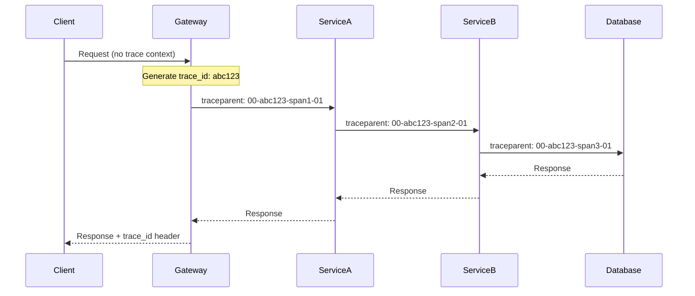
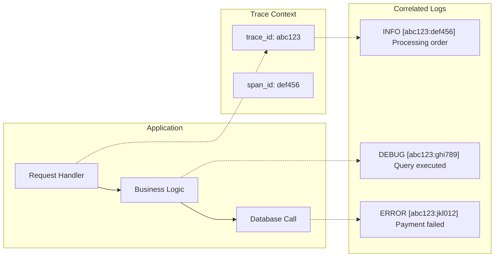
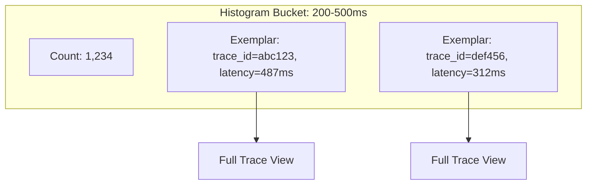
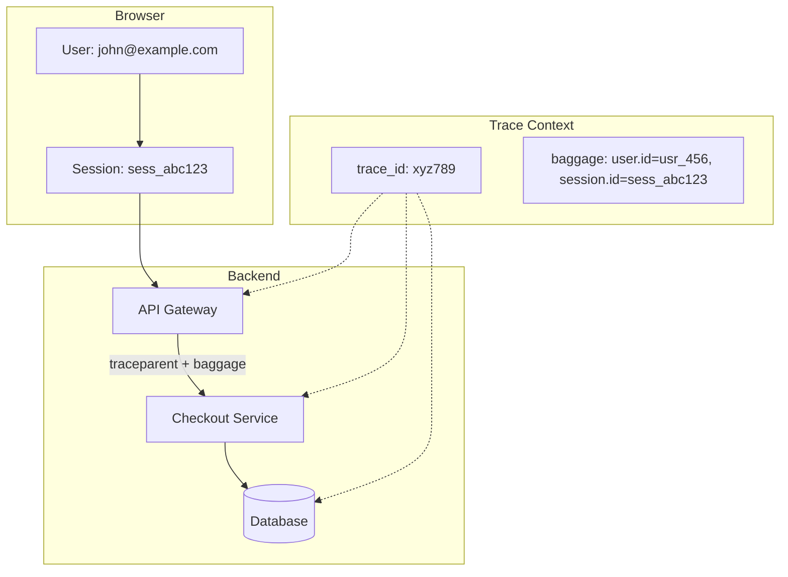
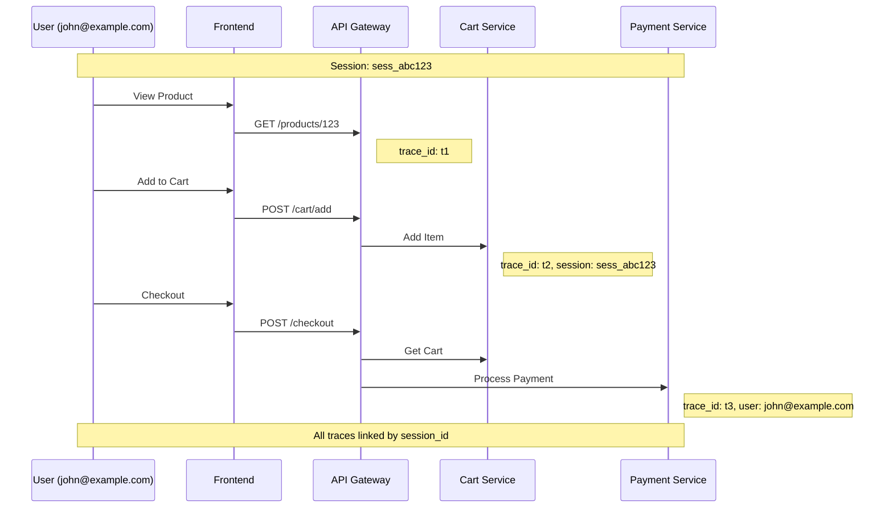
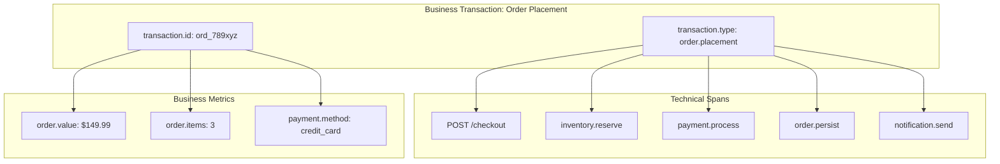
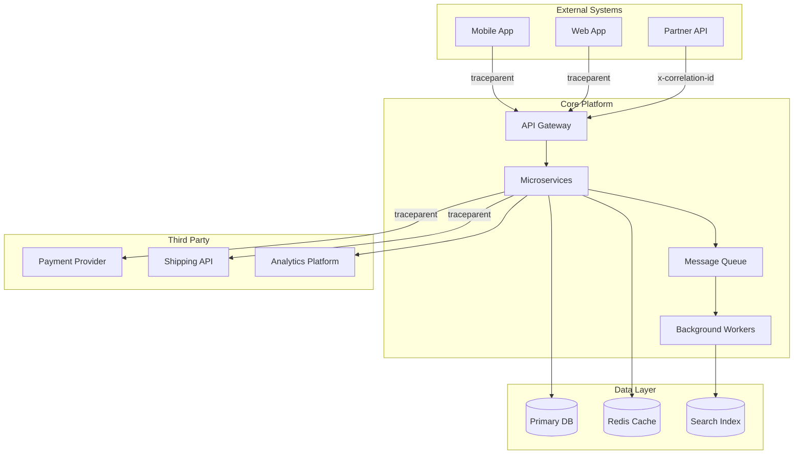
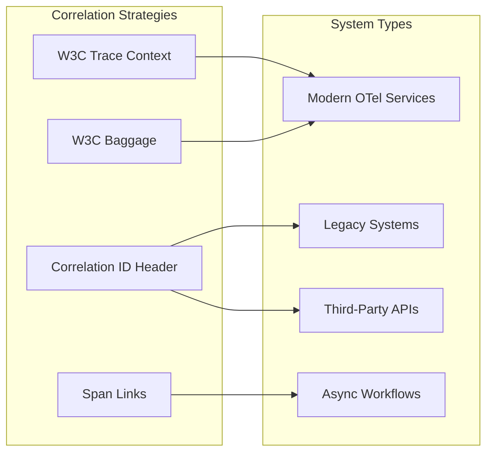

# How to Build Trace Correlation Strategies

Author: [nawazdhandala](https://github.com/nawazdhandala)

Tags: Observability, Tracing, Correlation, Monitoring

Description: Learn how to correlate traces with logs, metrics, and user sessions for comprehensive observability.

---

It's 3 AM. Your latency dashboard screams red. You have traces, logs, and metrics - all in separate tabs, all telling fragments of a story. The traces show a slow database span. The logs mention a connection timeout. The metrics reveal a memory spike. But which user was affected? What transaction failed? How do these pieces connect?

This is the correlation problem. And solving it is the difference between spending 5 minutes or 50 minutes debugging an incident.

Trace correlation is the art of connecting your distributed traces to every other signal in your system: logs, metrics, user sessions, and business transactions. When done right, you can click from an alert to the exact trace, see the related logs inline, understand the metric anomaly in context, and know exactly which customer was impacted.

This guide walks you through six correlation strategies that transform isolated telemetry into a unified observability story.

---

## Table of Contents

1. Trace ID Propagation Patterns
2. Log Correlation Injection
3. Metric Exemplars
4. User Session Correlation
5. Business Transaction Correlation
6. Cross-System Correlation

---

## 1. Trace ID Propagation Patterns

Trace ID propagation is the foundation of all correlation. Without it, your spans are isolated islands. With it, every operation in a request shares a common identity that travels across service boundaries.

### The W3C Trace Context Standard

The industry has standardized on W3C Trace Context, which defines two HTTP headers:

```
traceparent: 00-{trace-id}-{parent-span-id}-{trace-flags}
tracestate: vendor1=value1,vendor2=value2
```

Example traceparent:
```
traceparent: 00-4bf92f3577b34da6a3ce929d0e0e4736-00f067aa0ba902b7-01
```

Breaking it down:
- `00` - version
- `4bf92f3577b34da6a3ce929d0e0e4736` - 32-character trace ID
- `00f067aa0ba902b7` - 16-character parent span ID
- `01` - trace flags (01 = sampled)

### Propagation Flow Architecture



### Implementation in Node.js/TypeScript

```typescript
// propagation.ts
import { context, propagation, trace, SpanKind } from '@opentelemetry/api';

const tracer = trace.getTracer('correlation-example');

// Extracting context from incoming request
export function extractTraceContext(headers: Record<string, string>) {
    return propagation.extract(context.active(), headers);
}

// Injecting context into outgoing request
export function injectTraceContext(headers: Record<string, string>) {
    propagation.inject(context.active(), headers);
    return headers;
}

// Express middleware for automatic extraction
export function traceContextMiddleware(req: any, res: any, next: any) {
    const extractedContext = extractTraceContext(req.headers);

    context.with(extractedContext, () => {
        const span = tracer.startSpan(`${req.method} ${req.path}`, {
            kind: SpanKind.SERVER,
            attributes: {
                'http.method': req.method,
                'http.url': req.url,
                'http.route': req.path,
            },
        });

        // Attach trace ID to response headers for client correlation
        const activeSpan = trace.getSpan(context.active());
        if (activeSpan) {
            const spanContext = activeSpan.spanContext();
            res.setHeader('x-trace-id', spanContext.traceId);
        }

        res.on('finish', () => {
            span.setAttribute('http.status_code', res.statusCode);
            span.end();
        });

        context.with(trace.setSpan(context.active(), span), next);
    });
}
```

### Outbound HTTP Client with Propagation

```typescript
// http-client.ts
import { context, propagation, trace, SpanKind } from '@opentelemetry/api';

const tracer = trace.getTracer('http-client');

export async function fetchWithTracing(url: string, options: RequestInit = {}) {
    const span = tracer.startSpan(`HTTP ${options.method || 'GET'} ${new URL(url).pathname}`, {
        kind: SpanKind.CLIENT,
        attributes: {
            'http.url': url,
            'http.method': options.method || 'GET',
        },
    });

    return context.with(trace.setSpan(context.active(), span), async () => {
        const headers: Record<string, string> = {
            ...(options.headers as Record<string, string>),
        };

        // Inject trace context into outgoing headers
        propagation.inject(context.active(), headers);

        try {
            const response = await fetch(url, { ...options, headers });
            span.setAttribute('http.status_code', response.status);
            return response;
        } catch (error: any) {
            span.recordException(error);
            span.setStatus({ code: 2, message: error.message });
            throw error;
        } finally {
            span.end();
        }
    });
}
```

### Queue/Message Propagation

For asynchronous message passing, embed trace context in message headers or payload:

```typescript
// kafka-producer.ts
import { context, propagation, trace, SpanKind } from '@opentelemetry/api';

const tracer = trace.getTracer('kafka-producer');

interface KafkaMessage {
    key: string;
    value: any;
    headers: Record<string, string>;
}

export function produceWithTracing(topic: string, message: KafkaMessage) {
    const span = tracer.startSpan(`kafka.produce.${topic}`, {
        kind: SpanKind.PRODUCER,
        attributes: {
            'messaging.system': 'kafka',
            'messaging.destination': topic,
            'messaging.operation': 'publish',
        },
    });

    return context.with(trace.setSpan(context.active(), span), () => {
        // Inject trace context into message headers
        const headers: Record<string, string> = { ...message.headers };
        propagation.inject(context.active(), headers);

        const enrichedMessage = {
            ...message,
            headers,
        };

        // Send to Kafka (pseudo-code)
        // await kafkaProducer.send({ topic, messages: [enrichedMessage] });

        span.end();
        return enrichedMessage;
    });
}

// kafka-consumer.ts
export async function consumeWithTracing(
    topic: string,
    message: KafkaMessage,
    handler: (msg: KafkaMessage) => Promise<void>
) {
    // Extract trace context from message headers
    const extractedContext = propagation.extract(context.active(), message.headers);

    return context.with(extractedContext, async () => {
        const span = tracer.startSpan(`kafka.consume.${topic}`, {
            kind: SpanKind.CONSUMER,
            attributes: {
                'messaging.system': 'kafka',
                'messaging.destination': topic,
                'messaging.operation': 'process',
            },
        });

        try {
            await context.with(trace.setSpan(context.active(), span), () => handler(message));
        } catch (error: any) {
            span.recordException(error);
            span.setStatus({ code: 2, message: error.message });
            throw error;
        } finally {
            span.end();
        }
    });
}
```

### Propagation Patterns Summary

| Pattern | Use Case | Implementation |
|---------|----------|----------------|
| HTTP Headers | Synchronous service calls | W3C traceparent/tracestate |
| Message Headers | Async queues (Kafka, RabbitMQ) | Inject into message metadata |
| Baggage | Cross-cutting concerns | W3C baggage header |
| Custom Headers | Legacy systems | x-trace-id, x-span-id |

---

## 2. Log Correlation Injection

Logs without trace context are like breadcrumbs scattered in the wind. With trace correlation, every log line becomes a clickable link back to the exact moment in the distributed trace.

### The Correlation Flow



### Structured Logging with Trace Context

```typescript
// logger.ts
import { context, trace } from '@opentelemetry/api';

interface LogContext {
    trace_id?: string;
    span_id?: string;
    [key: string]: any;
}

function getTraceContext(): LogContext {
    const span = trace.getSpan(context.active());
    if (!span) return {};

    const spanContext = span.spanContext();
    return {
        trace_id: spanContext.traceId,
        span_id: spanContext.spanId,
        trace_flags: spanContext.traceFlags,
    };
}

export const logger = {
    info(message: string, data: Record<string, any> = {}) {
        const logEntry = {
            timestamp: new Date().toISOString(),
            level: 'INFO',
            message,
            ...getTraceContext(),
            ...data,
        };
        console.log(JSON.stringify(logEntry));
    },

    error(message: string, error?: Error, data: Record<string, any> = {}) {
        const logEntry = {
            timestamp: new Date().toISOString(),
            level: 'ERROR',
            message,
            ...getTraceContext(),
            error: error ? {
                name: error.name,
                message: error.message,
                stack: error.stack,
            } : undefined,
            ...data,
        };
        console.error(JSON.stringify(logEntry));
    },

    debug(message: string, data: Record<string, any> = {}) {
        const logEntry = {
            timestamp: new Date().toISOString(),
            level: 'DEBUG',
            message,
            ...getTraceContext(),
            ...data,
        };
        console.log(JSON.stringify(logEntry));
    },
};
```

### Example Output

```json
{
    "timestamp": "2026-01-30T14:23:45.123Z",
    "level": "INFO",
    "message": "Processing checkout for user",
    "trace_id": "4bf92f3577b34da6a3ce929d0e0e4736",
    "span_id": "00f067aa0ba902b7",
    "trace_flags": 1,
    "user_id": "usr_12345",
    "cart_items": 3,
    "total_amount": 149.99
}
```

### Winston Integration

```typescript
// winston-logger.ts
import winston from 'winston';
import { context, trace } from '@opentelemetry/api';

const traceFormat = winston.format((info) => {
    const span = trace.getSpan(context.active());
    if (span) {
        const spanContext = span.spanContext();
        info.trace_id = spanContext.traceId;
        info.span_id = spanContext.spanId;
    }
    return info;
});

export const winstonLogger = winston.createLogger({
    level: 'info',
    format: winston.format.combine(
        traceFormat(),
        winston.format.timestamp(),
        winston.format.json()
    ),
    transports: [
        new winston.transports.Console(),
        // Add OTLP log exporter for OneUptime
    ],
});
```

### Pino Integration

```typescript
// pino-logger.ts
import pino from 'pino';
import { context, trace } from '@opentelemetry/api';

export const pinoLogger = pino({
    mixin() {
        const span = trace.getSpan(context.active());
        if (!span) return {};

        const spanContext = span.spanContext();
        return {
            trace_id: spanContext.traceId,
            span_id: spanContext.spanId,
        };
    },
    formatters: {
        level: (label) => ({ level: label }),
    },
});
```

### Query Patterns for Correlated Logs

Once your logs contain trace IDs, you can:

1. **Trace to Logs**: Click a span in trace view -> see all logs from that span
2. **Log to Trace**: Click a log line -> jump to the full trace
3. **Error Investigation**: Filter logs by `level=ERROR` -> click trace_id -> see full request context

```sql
-- Find all logs for a specific trace
SELECT * FROM logs
WHERE trace_id = '4bf92f3577b34da6a3ce929d0e0e4736'
ORDER BY timestamp;

-- Find traces with errors
SELECT DISTINCT trace_id FROM logs
WHERE level = 'ERROR'
AND timestamp > NOW() - INTERVAL '1 hour';
```

---

## 3. Metric Exemplars

Metrics tell you *what* is happening (latency is high). Exemplars tell you *which specific request* experienced that latency, linking directly to a trace.

### What Are Exemplars?

An exemplar is a sample data point attached to a metric that includes:
- The trace ID of the request that generated this measurement
- The timestamp of the measurement
- Optional labels/attributes



### Implementing Exemplars in OpenTelemetry

```typescript
// metrics-with-exemplars.ts
import {
    MeterProvider,
    PeriodicExportingMetricReader
} from '@opentelemetry/sdk-metrics';
import { OTLPMetricExporter } from '@opentelemetry/exporter-otlp-http';
import { context, trace } from '@opentelemetry/api';

// Configure meter provider with exemplar support
const meterProvider = new MeterProvider({
    readers: [
        new PeriodicExportingMetricReader({
            exporter: new OTLPMetricExporter({
                url: process.env.ONEUPTIME_OTLP_METRICS_ENDPOINT,
                headers: { 'x-oneuptime-token': process.env.ONEUPTIME_TOKEN || '' },
            }),
            exportIntervalMillis: 10000,
        }),
    ],
});

const meter = meterProvider.getMeter('checkout-service');

// Create histogram for request latency
const requestLatency = meter.createHistogram('http.request.duration', {
    description: 'HTTP request latency in milliseconds',
    unit: 'ms',
});

// Record with automatic exemplar attachment
export function recordRequestLatency(
    method: string,
    route: string,
    statusCode: number,
    durationMs: number
) {
    // OpenTelemetry SDK automatically attaches trace context as exemplar
    // when there's an active span
    requestLatency.record(durationMs, {
        'http.method': method,
        'http.route': route,
        'http.status_code': statusCode,
    });
}
```

### Middleware for Automatic Exemplar Recording

```typescript
// metrics-middleware.ts
import { context, trace } from '@opentelemetry/api';

export function metricsMiddleware(req: any, res: any, next: any) {
    const startTime = Date.now();

    res.on('finish', () => {
        const duration = Date.now() - startTime;

        recordRequestLatency(
            req.method,
            req.route?.path || req.path,
            res.statusCode,
            duration
        );

        // For percentile alerting, also record slow requests explicitly
        if (duration > 500) {
            const span = trace.getSpan(context.active());
            if (span) {
                span.addEvent('slow_request', {
                    'duration_ms': duration,
                    'threshold_ms': 500,
                });
            }
        }
    });

    next();
}
```

### Using Exemplars for Investigation

The power of exemplars becomes clear during incident investigation:

1. **Alert fires**: p99 latency > 500ms
2. **View histogram**: See the distribution of latencies
3. **Click exemplar**: Jump directly to a trace that experienced 487ms latency
4. **Analyze trace**: See exactly where time was spent

```typescript
// Example: Recording business metrics with exemplars
const orderValue = meter.createHistogram('order.value', {
    description: 'Order value in dollars',
    unit: 'USD',
});

const checkoutDuration = meter.createHistogram('checkout.duration', {
    description: 'Time to complete checkout',
    unit: 'ms',
});

export async function processCheckout(order: Order) {
    const startTime = Date.now();

    // ... checkout logic ...

    const duration = Date.now() - startTime;

    // These recordings will automatically include trace exemplars
    orderValue.record(order.total, {
        'payment.method': order.paymentMethod,
        'customer.tier': order.customerTier,
    });

    checkoutDuration.record(duration, {
        'items.count': order.items.length,
        'has.promo': order.promoCode ? 'true' : 'false',
    });
}
```

### Exemplar Best Practices

| Practice | Rationale |
|----------|-----------|
| Keep exemplars on histograms | Most useful for latency investigation |
| Limit exemplar retention | Storage efficiency - keep recent exemplars |
| Include on error metrics | Direct link to error traces |
| Sample exemplars for high-volume metrics | Avoid overwhelming storage |

---

## 4. User Session Correlation

Connecting traces to real users transforms debugging from "something is slow" to "user X experienced a 3-second delay on their checkout."

### Session Context Architecture



### Frontend Session Tracking

```typescript
// frontend/session-tracking.ts
import { trace, context, propagation } from '@opentelemetry/api';
import { W3CTraceContextPropagator } from '@opentelemetry/core';
import { WebTracerProvider } from '@opentelemetry/sdk-trace-web';

// Initialize session on page load
const sessionId = sessionStorage.getItem('session_id') || crypto.randomUUID();
sessionStorage.setItem('session_id', sessionId);

// Get user ID from auth state
const userId = getCurrentUserId(); // From your auth system

// Configure baggage propagator
const baggageHeader = `user.id=${userId},session.id=${sessionId}`;

// Instrumented fetch wrapper
export async function fetchWithSession(url: string, options: RequestInit = {}) {
    const tracer = trace.getTracer('frontend');

    return tracer.startActiveSpan(`fetch ${url}`, async (span) => {
        const headers: Record<string, string> = {
            ...(options.headers as Record<string, string>),
            'baggage': baggageHeader,
        };

        // Inject trace context
        propagation.inject(context.active(), headers);

        span.setAttribute('user.id', userId);
        span.setAttribute('session.id', sessionId);

        try {
            const response = await fetch(url, { ...options, headers });
            span.setAttribute('http.status_code', response.status);
            return response;
        } catch (error: any) {
            span.recordException(error);
            throw error;
        } finally {
            span.end();
        }
    });
}
```

### Backend Session Extraction

```typescript
// backend/session-middleware.ts
import { context, trace, propagation, ROOT_CONTEXT } from '@opentelemetry/api';

interface SessionContext {
    userId?: string;
    sessionId?: string;
    customerTier?: string;
}

export function extractSessionContext(headers: Record<string, string>): SessionContext {
    const baggage = propagation.getBaggage(
        propagation.extract(ROOT_CONTEXT, headers)
    );

    if (!baggage) return {};

    return {
        userId: baggage.getEntry('user.id')?.value,
        sessionId: baggage.getEntry('session.id')?.value,
        customerTier: baggage.getEntry('customer.tier')?.value,
    };
}

export function sessionCorrelationMiddleware(req: any, res: any, next: any) {
    const session = extractSessionContext(req.headers);

    // Attach to current span
    const span = trace.getSpan(context.active());
    if (span && session.userId) {
        span.setAttribute('user.id', session.userId);
        span.setAttribute('session.id', session.sessionId || 'unknown');
        span.setAttribute('customer.tier', session.customerTier || 'standard');
    }

    // Make available to handlers
    req.session = session;

    // Also inject into logs
    req.log = {
        ...logger,
        info: (msg: string, data: any = {}) =>
            logger.info(msg, { ...data, ...session }),
        error: (msg: string, err?: Error, data: any = {}) =>
            logger.error(msg, err, { ...data, ...session }),
    };

    next();
}
```

### Session-Aware Alerting

With session correlation, you can create powerful alerts:

```typescript
// alerts/session-alerts.ts
interface AlertConfig {
    name: string;
    condition: string;
    groupBy: string[];
}

const sessionAlerts: AlertConfig[] = [
    {
        name: 'High-value customer experiencing errors',
        condition: 'error_rate > 0.01 AND customer.tier = "enterprise"',
        groupBy: ['user.id', 'session.id'],
    },
    {
        name: 'Single user multiple failures',
        condition: 'error_count > 5 within 5m grouped by user.id',
        groupBy: ['user.id'],
    },
    {
        name: 'Session with high latency',
        condition: 'p95_latency > 2000ms grouped by session.id',
        groupBy: ['session.id'],
    },
];
```

### User Journey Visualization



### Querying User Sessions

```sql
-- Find all traces for a specific user's session
SELECT
    trace_id,
    MIN(timestamp) as start_time,
    MAX(timestamp) as end_time,
    COUNT(DISTINCT span_id) as span_count,
    MAX(CASE WHEN status = 'ERROR' THEN 1 ELSE 0 END) as has_error
FROM spans
WHERE
    attributes->>'session.id' = 'sess_abc123'
    AND timestamp > NOW() - INTERVAL '24 hours'
GROUP BY trace_id
ORDER BY start_time;

-- Find users with degraded experience
SELECT
    attributes->>'user.id' as user_id,
    COUNT(DISTINCT trace_id) as request_count,
    AVG(duration_ms) as avg_latency,
    SUM(CASE WHEN status = 'ERROR' THEN 1 ELSE 0 END) as error_count
FROM spans
WHERE
    span_kind = 'SERVER'
    AND timestamp > NOW() - INTERVAL '1 hour'
GROUP BY attributes->>'user.id'
HAVING AVG(duration_ms) > 1000 OR SUM(CASE WHEN status = 'ERROR' THEN 1 ELSE 0 END) > 0
ORDER BY avg_latency DESC;
```

---

## 5. Business Transaction Correlation

Technical traces show HTTP calls and database queries. Business transaction correlation adds meaning: "This is an order placement" or "This is a subscription renewal."

### Business Context Model



### Business Transaction Wrapper

```typescript
// business-transaction.ts
import { context, trace, SpanKind } from '@opentelemetry/api';
import { logger } from './logger';

interface BusinessTransaction {
    type: string;
    id: string;
    attributes: Record<string, any>;
}

const tracer = trace.getTracer('business-transactions');

export async function withBusinessTransaction<T>(
    transaction: BusinessTransaction,
    fn: () => Promise<T>
): Promise<T> {
    const span = tracer.startSpan(`business.${transaction.type}`, {
        kind: SpanKind.INTERNAL,
        attributes: {
            'transaction.type': transaction.type,
            'transaction.id': transaction.id,
            ...Object.entries(transaction.attributes).reduce((acc, [k, v]) => {
                acc[`transaction.${k}`] = v;
                return acc;
            }, {} as Record<string, any>),
        },
    });

    logger.info(`Starting business transaction`, {
        transaction_type: transaction.type,
        transaction_id: transaction.id,
        ...transaction.attributes,
    });

    const startTime = Date.now();

    try {
        const result = await context.with(
            trace.setSpan(context.active(), span),
            fn
        );

        span.setAttribute('transaction.status', 'completed');
        span.setAttribute('transaction.duration_ms', Date.now() - startTime);

        logger.info(`Completed business transaction`, {
            transaction_type: transaction.type,
            transaction_id: transaction.id,
            duration_ms: Date.now() - startTime,
        });

        return result;
    } catch (error: any) {
        span.setAttribute('transaction.status', 'failed');
        span.setAttribute('transaction.error', error.message);
        span.recordException(error);
        span.setStatus({ code: 2, message: error.message });

        logger.error(`Failed business transaction`, error, {
            transaction_type: transaction.type,
            transaction_id: transaction.id,
            duration_ms: Date.now() - startTime,
        });

        throw error;
    } finally {
        span.end();
    }
}
```

### Usage in Order Processing

```typescript
// order-service.ts
import { withBusinessTransaction } from './business-transaction';
import { withSpan } from './tracing-utils';

interface Order {
    id: string;
    userId: string;
    items: Array<{ sku: string; quantity: number; price: number }>;
    total: number;
    paymentMethod: string;
}

export async function processOrder(order: Order) {
    return withBusinessTransaction(
        {
            type: 'order.placement',
            id: order.id,
            attributes: {
                user_id: order.userId,
                item_count: order.items.length,
                order_value: order.total,
                payment_method: order.paymentMethod,
            },
        },
        async () => {
            // Inventory reservation
            await withSpan('inventory.reserve', async (span) => {
                for (const item of order.items) {
                    span.addEvent('item.reserved', {
                        sku: item.sku,
                        quantity: item.quantity,
                    });
                    await reserveInventory(item.sku, item.quantity);
                }
            });

            // Payment processing
            const paymentResult = await withSpan('payment.process', async (span) => {
                span.setAttribute('payment.amount', order.total);
                span.setAttribute('payment.method', order.paymentMethod);
                return processPayment(order);
            });

            // Order persistence
            await withSpan('order.persist', async () => {
                await saveOrder(order, paymentResult);
            });

            // Notifications
            await withSpan('notification.send', async (span) => {
                span.setAttribute('notification.channels', ['email', 'sms']);
                await sendOrderConfirmation(order);
            });

            return { orderId: order.id, status: 'completed' };
        }
    );
}
```

### Business Transaction Types

```typescript
// transaction-types.ts
export const BusinessTransactionTypes = {
    // E-commerce
    ORDER_PLACEMENT: 'order.placement',
    ORDER_CANCELLATION: 'order.cancellation',
    REFUND_PROCESSING: 'refund.processing',

    // Subscriptions
    SUBSCRIPTION_START: 'subscription.start',
    SUBSCRIPTION_RENEWAL: 'subscription.renewal',
    SUBSCRIPTION_CANCELLATION: 'subscription.cancellation',

    // User lifecycle
    USER_REGISTRATION: 'user.registration',
    USER_LOGIN: 'user.login',
    PASSWORD_RESET: 'user.password_reset',

    // Inventory
    INVENTORY_REPLENISHMENT: 'inventory.replenishment',
    INVENTORY_ADJUSTMENT: 'inventory.adjustment',

    // Reporting
    REPORT_GENERATION: 'report.generation',
    DATA_EXPORT: 'data.export',
} as const;
```

### Business Transaction Dashboard Queries

```sql
-- Business transaction success rate by type
SELECT
    attributes->>'transaction.type' as transaction_type,
    COUNT(*) as total,
    SUM(CASE WHEN attributes->>'transaction.status' = 'completed' THEN 1 ELSE 0 END) as succeeded,
    ROUND(100.0 * SUM(CASE WHEN attributes->>'transaction.status' = 'completed' THEN 1 ELSE 0 END) / COUNT(*), 2) as success_rate
FROM spans
WHERE
    name LIKE 'business.%'
    AND timestamp > NOW() - INTERVAL '24 hours'
GROUP BY attributes->>'transaction.type'
ORDER BY total DESC;

-- Average order value trend
SELECT
    date_trunc('hour', timestamp) as hour,
    AVG((attributes->>'transaction.order_value')::numeric) as avg_order_value,
    COUNT(*) as order_count
FROM spans
WHERE
    attributes->>'transaction.type' = 'order.placement'
    AND attributes->>'transaction.status' = 'completed'
    AND timestamp > NOW() - INTERVAL '7 days'
GROUP BY date_trunc('hour', timestamp)
ORDER BY hour;
```

---

## 6. Cross-System Correlation

Real-world systems span multiple domains: web applications, mobile apps, third-party APIs, batch jobs, and legacy systems. Cross-system correlation ties them all together.

### Cross-System Architecture



### Correlation ID Gateway

```typescript
// gateway/correlation-middleware.ts
import { context, trace, propagation, ROOT_CONTEXT } from '@opentelemetry/api';
import { v4 as uuidv4 } from 'uuid';

const tracer = trace.getTracer('api-gateway');

interface CorrelationContext {
    traceId: string;
    correlationId: string;
    source: string;
    sourceTraceId?: string;
}

export function correlationGatewayMiddleware(req: any, res: any, next: any) {
    // Try to extract existing trace context
    let extractedContext = propagation.extract(ROOT_CONTEXT, req.headers);
    let existingSpan = trace.getSpan(extractedContext);

    // Generate or extract correlation ID
    const correlationId =
        req.headers['x-correlation-id'] ||
        req.headers['x-request-id'] ||
        uuidv4();

    // Determine source system
    const source = detectSource(req);

    // If no trace context, create new trace with correlation
    const span = tracer.startSpan('gateway.request', {
        kind: trace.SpanKind.SERVER,
        attributes: {
            'correlation.id': correlationId,
            'correlation.source': source,
            'http.method': req.method,
            'http.url': req.url,
        },
    });

    // If incoming request had a different trace ID (from external system)
    if (req.headers['x-external-trace-id']) {
        span.setAttribute('correlation.external_trace_id', req.headers['x-external-trace-id']);
        span.addLink({
            context: {
                traceId: req.headers['x-external-trace-id'],
                spanId: req.headers['x-external-span-id'] || '0000000000000000',
                traceFlags: 0,
            },
            attributes: { 'link.type': 'external_system' },
        });
    }

    // Set correlation ID in response headers
    res.setHeader('x-correlation-id', correlationId);
    res.setHeader('x-trace-id', span.spanContext().traceId);

    // Continue with enriched context
    context.with(trace.setSpan(context.active(), span), () => {
        req.correlation = {
            traceId: span.spanContext().traceId,
            correlationId,
            source,
        };

        res.on('finish', () => {
            span.setAttribute('http.status_code', res.statusCode);
            span.end();
        });

        next();
    });
}

function detectSource(req: any): string {
    const userAgent = req.headers['user-agent'] || '';

    if (userAgent.includes('iOS') || userAgent.includes('Android')) {
        return 'mobile_app';
    }
    if (req.headers['x-partner-id']) {
        return `partner:${req.headers['x-partner-id']}`;
    }
    if (req.headers['x-api-key']) {
        return 'api_client';
    }
    return 'web_app';
}
```

### Third-Party API Integration

```typescript
// integrations/third-party-client.ts
import { context, trace, propagation, SpanKind } from '@opentelemetry/api';

const tracer = trace.getTracer('third-party-integrations');

interface ThirdPartyConfig {
    name: string;
    baseUrl: string;
    supportsTracing: boolean;
    correlationHeader?: string;
}

export function createThirdPartyClient(config: ThirdPartyConfig) {
    return {
        async request(method: string, path: string, body?: any) {
            const span = tracer.startSpan(`${config.name}.${method}`, {
                kind: SpanKind.CLIENT,
                attributes: {
                    'peer.service': config.name,
                    'http.method': method,
                    'http.url': `${config.baseUrl}${path}`,
                },
            });

            return context.with(trace.setSpan(context.active(), span), async () => {
                const headers: Record<string, string> = {
                    'Content-Type': 'application/json',
                };

                // Inject trace context if supported
                if (config.supportsTracing) {
                    propagation.inject(context.active(), headers);
                }

                // Always send correlation ID
                const correlationHeader = config.correlationHeader || 'x-correlation-id';
                headers[correlationHeader] = span.spanContext().traceId;

                try {
                    const response = await fetch(`${config.baseUrl}${path}`, {
                        method,
                        headers,
                        body: body ? JSON.stringify(body) : undefined,
                    });

                    span.setAttribute('http.status_code', response.status);

                    // Capture external trace ID if returned
                    const externalTraceId = response.headers.get('x-trace-id');
                    if (externalTraceId) {
                        span.setAttribute('peer.trace_id', externalTraceId);
                    }

                    return response;
                } catch (error: any) {
                    span.recordException(error);
                    span.setStatus({ code: 2, message: error.message });
                    throw error;
                } finally {
                    span.end();
                }
            });
        },
    };
}

// Usage
const stripeClient = createThirdPartyClient({
    name: 'stripe',
    baseUrl: 'https://api.stripe.com/v1',
    supportsTracing: false,
    correlationHeader: 'idempotency-key',
});

const internalServiceClient = createThirdPartyClient({
    name: 'inventory-service',
    baseUrl: 'http://inventory.internal:8080',
    supportsTracing: true,
});
```

### Legacy System Bridge

```typescript
// integrations/legacy-bridge.ts
import { context, trace, SpanKind } from '@opentelemetry/api';

const tracer = trace.getTracer('legacy-bridge');

interface LegacyRequest {
    correlationId: string;
    timestamp: string;
    operation: string;
    payload: any;
}

interface LegacyResponse {
    correlationId: string;
    status: string;
    data: any;
}

export class LegacySystemBridge {
    private pendingCorrelations = new Map<string, {
        spanContext: any;
        startTime: number;
    }>();

    async sendToLegacy(operation: string, payload: any): Promise<string> {
        const span = tracer.startSpan(`legacy.${operation}`, {
            kind: SpanKind.PRODUCER,
            attributes: {
                'legacy.operation': operation,
                'legacy.system': 'mainframe',
            },
        });

        const correlationId = span.spanContext().traceId;

        // Store context for response correlation
        this.pendingCorrelations.set(correlationId, {
            spanContext: span.spanContext(),
            startTime: Date.now(),
        });

        const legacyRequest: LegacyRequest = {
            correlationId,
            timestamp: new Date().toISOString(),
            operation,
            payload,
        };

        // Send to legacy system (e.g., via MQ, file drop, etc.)
        await this.sendToQueue(legacyRequest);

        // Don't end span here - we'll end it when response arrives
        return correlationId;
    }

    async handleLegacyResponse(response: LegacyResponse) {
        const pending = this.pendingCorrelations.get(response.correlationId);

        if (!pending) {
            // Create orphan span for unmatched response
            const orphanSpan = tracer.startSpan('legacy.response.unmatched', {
                attributes: {
                    'legacy.correlation_id': response.correlationId,
                    'legacy.status': response.status,
                },
            });
            orphanSpan.end();
            return;
        }

        this.pendingCorrelations.delete(response.correlationId);

        // Create response span linked to original
        const responseSpan = tracer.startSpan('legacy.response', {
            kind: SpanKind.CONSUMER,
            links: [{ context: pending.spanContext }],
            attributes: {
                'legacy.correlation_id': response.correlationId,
                'legacy.status': response.status,
                'legacy.round_trip_ms': Date.now() - pending.startTime,
            },
        });

        responseSpan.end();
    }

    private async sendToQueue(request: LegacyRequest) {
        // Implementation depends on legacy integration method
    }
}
```

### Cross-System Correlation Summary



---

## Putting It All Together

Here's a complete example that combines all six correlation strategies:

```typescript
// complete-correlation-example.ts
import { context, trace, propagation, SpanKind } from '@opentelemetry/api';
import { logger } from './logger';
import { withBusinessTransaction } from './business-transaction';
import { recordRequestLatency } from './metrics-with-exemplars';

const tracer = trace.getTracer('checkout-service');

interface CheckoutRequest {
    userId: string;
    sessionId: string;
    orderId: string;
    items: Array<{ sku: string; quantity: number; price: number }>;
    paymentMethod: string;
}

export async function handleCheckout(req: any, res: any) {
    const startTime = Date.now();

    // 1. Extract trace context from incoming request
    const extractedContext = propagation.extract(context.active(), req.headers);

    // 2. Extract session context (User Session Correlation)
    const sessionContext = {
        userId: req.headers['x-user-id'] || 'anonymous',
        sessionId: req.headers['x-session-id'] || 'unknown',
    };

    return context.with(extractedContext, async () => {
        const rootSpan = tracer.startSpan('checkout.handle', {
            kind: SpanKind.SERVER,
            attributes: {
                // 4. User Session Correlation
                'user.id': sessionContext.userId,
                'session.id': sessionContext.sessionId,
                'http.method': req.method,
                'http.route': '/checkout',
            },
        });

        // Return trace ID to client for frontend correlation
        res.setHeader('x-trace-id', rootSpan.spanContext().traceId);

        return context.with(trace.setSpan(context.active(), rootSpan), async () => {
            try {
                const checkoutData: CheckoutRequest = {
                    ...req.body,
                    userId: sessionContext.userId,
                    sessionId: sessionContext.sessionId,
                };

                // 5. Business Transaction Correlation
                const result = await withBusinessTransaction(
                    {
                        type: 'order.placement',
                        id: checkoutData.orderId,
                        attributes: {
                            user_id: checkoutData.userId,
                            item_count: checkoutData.items.length,
                            order_value: calculateTotal(checkoutData.items),
                        },
                    },
                    async () => {
                        // 2. Log Correlation - all logs include trace context
                        logger.info('Processing checkout', {
                            order_id: checkoutData.orderId,
                            items: checkoutData.items.length,
                        });

                        // Reserve inventory
                        await reserveInventory(checkoutData.items);

                        // 6. Cross-System Correlation - call payment provider
                        const paymentResult = await processPaymentWithCorrelation(
                            checkoutData
                        );

                        // Persist order
                        await persistOrder(checkoutData, paymentResult);

                        return { orderId: checkoutData.orderId, status: 'completed' };
                    }
                );

                rootSpan.setStatus({ code: 0 });
                res.json(result);
            } catch (error: any) {
                rootSpan.recordException(error);
                rootSpan.setStatus({ code: 2, message: error.message });

                logger.error('Checkout failed', error, {
                    order_id: req.body.orderId,
                });

                res.status(500).json({ error: error.message });
            } finally {
                rootSpan.end();

                // 3. Metric Exemplars - record with automatic trace linking
                recordRequestLatency(
                    req.method,
                    '/checkout',
                    res.statusCode,
                    Date.now() - startTime
                );
            }
        });
    });
}

async function processPaymentWithCorrelation(checkout: CheckoutRequest) {
    const span = tracer.startSpan('payment.process', {
        kind: SpanKind.CLIENT,
        attributes: {
            'peer.service': 'stripe',
            'payment.method': checkout.paymentMethod,
            'payment.amount': calculateTotal(checkout.items),
        },
    });

    return context.with(trace.setSpan(context.active(), span), async () => {
        const headers: Record<string, string> = {
            'Content-Type': 'application/json',
            // Pass correlation ID even if Stripe doesn't support OTel
            'Idempotency-Key': span.spanContext().traceId,
        };

        // Inject trace context for OTel-aware services
        propagation.inject(context.active(), headers);

        try {
            const response = await fetch('https://api.stripe.com/v1/charges', {
                method: 'POST',
                headers,
                body: JSON.stringify({
                    amount: calculateTotal(checkout.items) * 100,
                    currency: 'usd',
                }),
            });

            span.setAttribute('http.status_code', response.status);

            // Log with full correlation context
            logger.info('Payment processed', {
                payment_status: response.status,
                idempotency_key: span.spanContext().traceId,
            });

            return response.json();
        } catch (error: any) {
            span.recordException(error);
            throw error;
        } finally {
            span.end();
        }
    });
}

function calculateTotal(items: Array<{ price: number; quantity: number }>): number {
    return items.reduce((sum, item) => sum + item.price * item.quantity, 0);
}

async function reserveInventory(items: any[]) {
    // Implementation with tracing
}

async function persistOrder(checkout: CheckoutRequest, payment: any) {
    // Implementation with tracing
}
```

---

## Summary: Correlation Strategy Matrix

| Strategy | Connects | Primary Use Case | Implementation |
|----------|----------|------------------|----------------|
| Trace ID Propagation | Services in a request | Distributed tracing | W3C traceparent header |
| Log Correlation | Traces and logs | Debugging and forensics | Inject trace_id/span_id |
| Metric Exemplars | Metrics and traces | Alert investigation | Record exemplars on histograms |
| User Session | Traces and users | Customer experience | Baggage header + span attributes |
| Business Transaction | Technical spans and business context | Business analytics | Transaction wrapper spans |
| Cross-System | Internal and external systems | End-to-end visibility | Correlation IDs + span links |

---

## Next Steps

1. **Start with Trace ID Propagation**: Ensure all services pass W3C trace context headers.

2. **Add Log Correlation**: Inject trace_id and span_id into every log line.

3. **Enable Metric Exemplars**: Attach trace context to your latency histograms.

4. **Implement Session Tracking**: Add user and session IDs to span attributes.

5. **Define Business Transactions**: Wrap key user journeys with business context.

6. **Bridge External Systems**: Use correlation IDs for third-party integrations.

With these strategies in place, your next 3 AM incident will be a 5-minute investigation instead of a 50-minute scavenger hunt.

---

*Ready to see your correlated traces in action? Send them via OTLP to [OneUptime](https://oneuptime.com) and experience the power of unified observability - traces, logs, metrics, and incidents in one place.*

---

**Related Reading:**

- [What are Traces and Spans in OpenTelemetry: A Practical Guide](https://oneuptime.com/blog/post/2025-08-27-traces-and-spans-in-opentelemetry/view)
- [Logs, Metrics & Traces: Turning Three Noisy Streams into One Story](https://oneuptime.com/blog/post/2025-08-20-three-pillars-of-observability-logs-metrics-traces/view)
- [How to Structure Logs Properly in OpenTelemetry: A Complete Guide](https://oneuptime.com/blog/post/2025-08-28-how-to-structure-logs-properly-in-opentelemetry/view)
