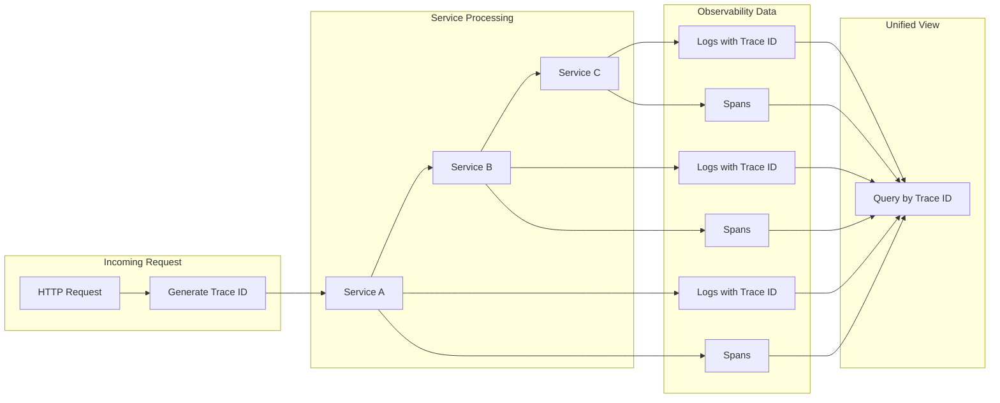
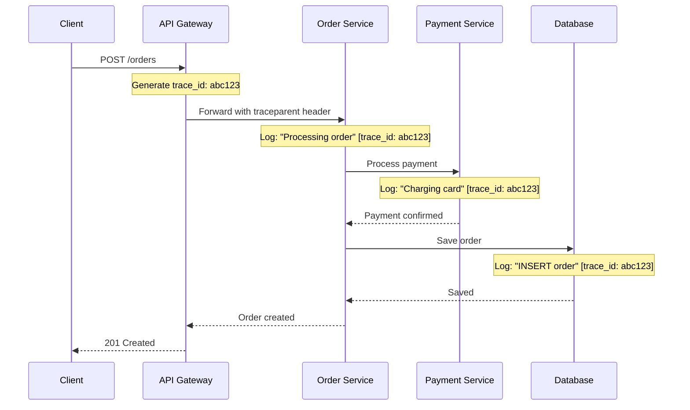
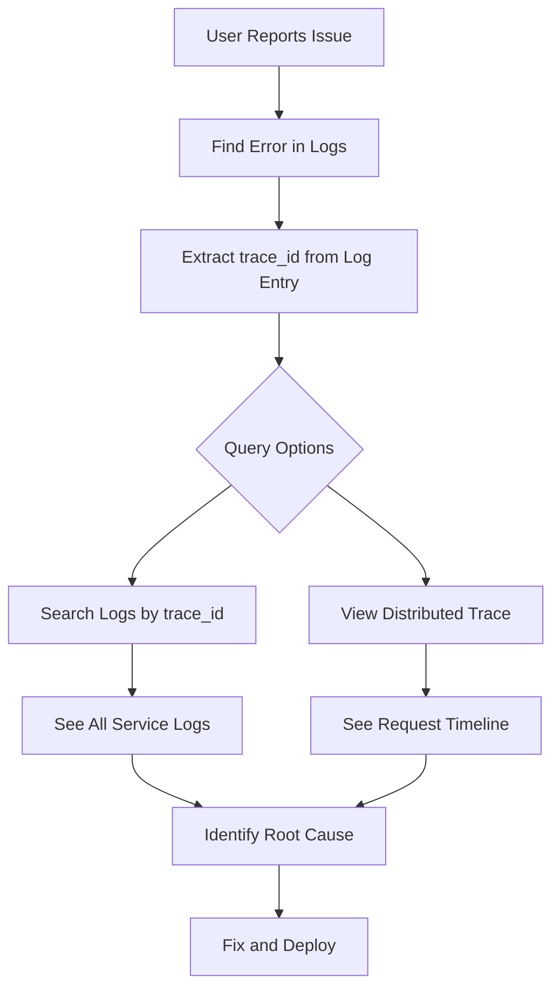

# How to Implement Trace ID Integration

Author: [nawazdhandala](https://github.com/nawazdhandala)

Tags: Logging, Tracing, OpenTelemetry, Observability

Description: Learn to implement trace ID integration for linking logs to distributed traces.

---

When debugging production issues in distributed systems, the ability to connect a log entry to its full request journey is invaluable. Trace ID integration bridges the gap between isolated log statements and complete distributed traces, giving you the context needed to understand what actually happened during a request.

This guide walks through implementing trace ID integration in Node.js applications using OpenTelemetry, with practical patterns you can apply immediately.

---

## Why Trace ID Integration Matters

Without trace IDs in your logs, you face a common scenario: an error appears in your logging system, but you have no way to see the full picture. Which service did the request start from? What database queries ran? Where did time get spent?

The following diagram illustrates how trace ID integration connects your observability data.



With trace IDs embedded in every log entry, you can query all logs for a specific request across all services with a single identifier.

---

## Core Concepts

Before diving into implementation, here are the key identifiers you will work with.

| Identifier | Purpose | Format |
|------------|---------|--------|
| Trace ID | Unique identifier for the entire request journey | 32 hex characters |
| Span ID | Unique identifier for a single operation within a trace | 16 hex characters |
| Parent Span ID | Links child spans to their parent | 16 hex characters |

A trace ID stays constant as a request moves between services. Each service creates its own spans, but they all share the same trace ID, enabling correlation.

---

## Setting Up the Foundation

Start by installing the necessary OpenTelemetry packages. These provide the instrumentation and context propagation mechanisms needed for trace ID integration.

```bash
npm install @opentelemetry/api \
            @opentelemetry/sdk-node \
            @opentelemetry/auto-instrumentations-node \
            @opentelemetry/exporter-otlp-http \
            winston
```

The telemetry initialization must happen before any other imports to ensure automatic instrumentation wraps the necessary modules correctly.

```typescript
// telemetry.ts
import { NodeSDK } from '@opentelemetry/sdk-node';
import { getNodeAutoInstrumentations } from '@opentelemetry/auto-instrumentations-node';
import { OTLPTraceExporter } from '@opentelemetry/exporter-otlp-http';
import { Resource } from '@opentelemetry/resources';
import { SemanticResourceAttributes } from '@opentelemetry/semantic-conventions';

// Configure the OTLP exporter to send traces to your backend
const traceExporter = new OTLPTraceExporter({
  url: process.env.OTLP_ENDPOINT || 'https://oneuptime.com/otlp/v1/traces',
  headers: {
    'x-oneuptime-token': process.env.ONEUPTIME_TOKEN || '',
  },
});

// Initialize the SDK with service identification
const sdk = new NodeSDK({
  traceExporter,
  resource: new Resource({
    [SemanticResourceAttributes.SERVICE_NAME]: 'order-service',
    [SemanticResourceAttributes.SERVICE_VERSION]: '1.0.0',
  }),
  instrumentations: [getNodeAutoInstrumentations()],
});

sdk.start();
console.log('OpenTelemetry initialized');
```

---

## Extracting Trace Context in Logs

The key to trace ID integration is extracting the current trace context whenever you write a log entry. OpenTelemetry provides APIs to access the active span and its context.

This logger wrapper automatically injects trace IDs into every log statement without requiring manual intervention at each call site.

```typescript
// logger.ts
import winston from 'winston';
import { trace, context } from '@opentelemetry/api';

// Custom format that extracts trace context from the active span
const traceFormat = winston.format((info) => {
  const activeSpan = trace.getActiveSpan();

  if (activeSpan) {
    const spanContext = activeSpan.spanContext();
    // Inject trace identifiers for correlation
    info.trace_id = spanContext.traceId;
    info.span_id = spanContext.spanId;
    info.trace_flags = spanContext.traceFlags;
  }

  return info;
});

// Create the logger with trace correlation enabled
export const logger = winston.createLogger({
  level: process.env.LOG_LEVEL || 'info',
  format: winston.format.combine(
    winston.format.timestamp(),
    traceFormat(),
    winston.format.json()
  ),
  transports: [
    new winston.transports.Console(),
  ],
});
```

---

## Request Flow with Trace Propagation

The following diagram shows how trace context flows through a typical request, with each component adding its trace ID to logs.



Every log entry across all services shares the same trace ID, making it possible to reconstruct the full request flow.

---

## Implementing in Express Middleware

For Express applications, middleware provides a clean way to ensure trace context is available throughout request handling. The auto-instrumentation creates spans automatically, but you can enhance them with custom attributes.

```typescript
// middleware/tracing.ts
import { Request, Response, NextFunction } from 'express';
import { trace, context, SpanStatusCode } from '@opentelemetry/api';
import { logger } from '../logger';

export function tracingMiddleware(req: Request, res: Response, next: NextFunction) {
  const activeSpan = trace.getActiveSpan();

  if (activeSpan) {
    // Add request attributes to the span for richer trace data
    activeSpan.setAttributes({
      'http.method': req.method,
      'http.route': req.path,
      'http.user_agent': req.get('user-agent') || 'unknown',
    });

    // Log request start with automatic trace ID injection
    logger.info('Request received', {
      method: req.method,
      path: req.path,
      query: req.query,
    });
  }

  // Capture response for logging
  const originalEnd = res.end;
  const startTime = Date.now();

  res.end = function(chunk?: any, encoding?: any) {
    const duration = Date.now() - startTime;

    logger.info('Request completed', {
      method: req.method,
      path: req.path,
      status_code: res.statusCode,
      duration_ms: duration,
    });

    return originalEnd.call(this, chunk, encoding);
  };

  next();
}
```

---

## Cross-Service Trace Propagation

When making HTTP calls to other services, the trace context must be propagated in headers. OpenTelemetry uses the W3C Trace Context format by default, which includes the `traceparent` header.

The propagation API handles header injection automatically when you use it correctly.

```typescript
// services/payment-client.ts
import { propagation, context, trace } from '@opentelemetry/api';
import { logger } from '../logger';

export async function processPayment(orderId: string, amount: number): Promise<boolean> {
  const tracer = trace.getTracer('payment-client');

  // Create a span for this outbound call
  return tracer.startActiveSpan('payment.process', async (span) => {
    try {
      // Prepare headers with trace context
      const headers: Record<string, string> = {
        'Content-Type': 'application/json',
      };

      // Inject trace context into headers for propagation
      propagation.inject(context.active(), headers);

      logger.info('Calling payment service', {
        order_id: orderId,
        amount: amount,
      });

      const response = await fetch('https://payments.example.com/charge', {
        method: 'POST',
        headers,
        body: JSON.stringify({ orderId, amount }),
      });

      span.setAttribute('http.status_code', response.status);

      if (!response.ok) {
        span.setStatus({ code: SpanStatusCode.ERROR });
        logger.error('Payment failed', {
          order_id: orderId,
          status: response.status,
        });
        return false;
      }

      logger.info('Payment successful', {
        order_id: orderId,
        amount: amount,
      });

      return true;
    } catch (error) {
      span.recordException(error as Error);
      span.setStatus({ code: SpanStatusCode.ERROR });

      logger.error('Payment service error', {
        order_id: orderId,
        error: (error as Error).message,
      });

      throw error;
    } finally {
      span.end();
    }
  });
}
```

---

## Database Query Correlation

Database queries often represent significant time in request processing. Correlating database logs with traces helps identify slow queries affecting specific requests.

```typescript
// db/query-logger.ts
import { trace, SpanStatusCode } from '@opentelemetry/api';
import { logger } from '../logger';

export async function executeQuery<T>(
  operation: string,
  table: string,
  queryFn: () => Promise<T>
): Promise<T> {
  const tracer = trace.getTracer('database');
  const spanName = `db.${operation}.${table}`;

  return tracer.startActiveSpan(spanName, async (span) => {
    const startTime = Date.now();

    span.setAttributes({
      'db.system': 'postgresql',
      'db.operation': operation,
      'db.sql.table': table,
    });

    try {
      const result = await queryFn();
      const duration = Date.now() - startTime;

      span.setAttribute('db.duration_ms', duration);

      // Log with trace context automatically included
      logger.debug('Database query executed', {
        operation,
        table,
        duration_ms: duration,
      });

      return result;
    } catch (error) {
      span.recordException(error as Error);
      span.setStatus({ code: SpanStatusCode.ERROR });

      logger.error('Database query failed', {
        operation,
        table,
        error: (error as Error).message,
      });

      throw error;
    } finally {
      span.end();
    }
  });
}
```

---

## Querying by Trace ID

Once trace IDs are embedded in your logs, you can query your observability platform to retrieve all logs for a specific request. The typical workflow looks like this.



In OneUptime, you can search logs using the trace ID directly, or click through from a trace view to see all associated logs.

---

## Error Handling with Trace Context

When errors occur, having the trace ID in exception logs enables quick investigation. The pattern below ensures exceptions are properly recorded in both logs and traces.

```typescript
// utils/error-handler.ts
import { trace, SpanStatusCode } from '@opentelemetry/api';
import { logger } from '../logger';

export function handleError(error: Error, context: Record<string, any> = {}) {
  const activeSpan = trace.getActiveSpan();

  if (activeSpan) {
    // Record exception in the trace
    activeSpan.recordException(error);
    activeSpan.setStatus({
      code: SpanStatusCode.ERROR,
      message: error.message,
    });
  }

  // Log with full context and automatic trace ID
  logger.error('Error occurred', {
    error_type: error.constructor.name,
    error_message: error.message,
    error_stack: error.stack,
    ...context,
  });
}
```

---

## Testing Trace ID Integration

Verify your integration by checking that trace IDs appear consistently in logs. A simple test sends a request and confirms the trace ID matches across all log entries.

```typescript
// test/trace-integration.test.ts
import { trace } from '@opentelemetry/api';

describe('Trace ID Integration', () => {
  it('should include trace_id in all logs for a request', async () => {
    const tracer = trace.getTracer('test');
    const logs: any[] = [];

    // Mock logger to capture output
    const originalLog = logger.info;
    logger.info = (msg: string, meta: any) => {
      logs.push({ message: msg, ...meta });
    };

    await tracer.startActiveSpan('test-span', async (span) => {
      const expectedTraceId = span.spanContext().traceId;

      logger.info('First log');
      logger.info('Second log');
      logger.info('Third log');

      span.end();

      // Verify all logs have the same trace_id
      logs.forEach(log => {
        expect(log.trace_id).toBe(expectedTraceId);
      });
    });

    logger.info = originalLog;
  });
});
```

---

## Summary

Trace ID integration transforms your logs from isolated statements into connected observability data. The key implementation steps are:

1. Initialize OpenTelemetry before other imports
2. Create a logger that extracts trace context from active spans
3. Use context propagation for cross-service calls
4. Wrap database operations with spans for query correlation
5. Include trace IDs in error handling

With trace IDs in your logs, debugging distributed systems becomes dramatically easier. Instead of searching through multiple services hoping to find related entries, you query by trace ID and see the complete picture instantly.

---

**Related Reading:**

- [What are Traces and Spans in OpenTelemetry: A Practical Guide](https://oneuptime.com/blog/post/2025-08-27-traces-and-spans-in-opentelemetry/view)
- [How to Structure Logs Properly in OpenTelemetry](https://oneuptime.com/blog/post/2025-08-28-how-to-structure-logs-properly-in-opentelemetry/view)
- [Logs, Metrics and Traces: The Three Pillars of Observability](https://oneuptime.com/blog/post/2025-08-20-three-pillars-of-observability-logs-metrics-traces/view)
