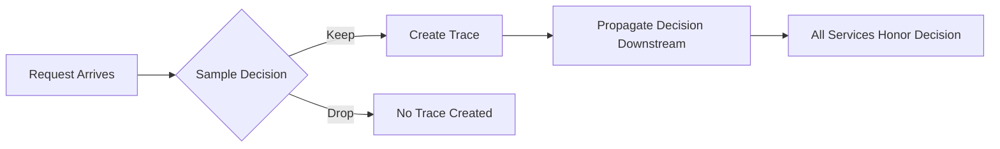
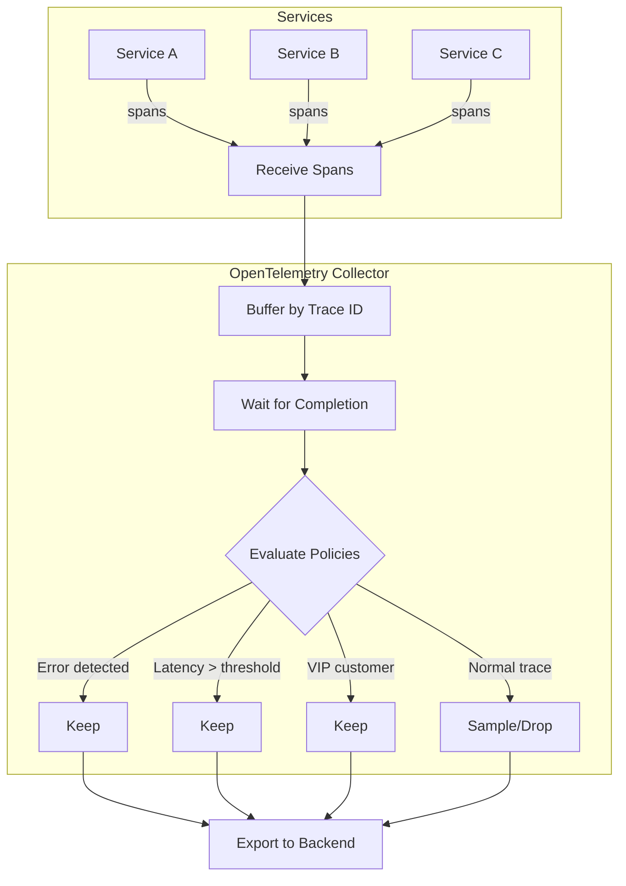
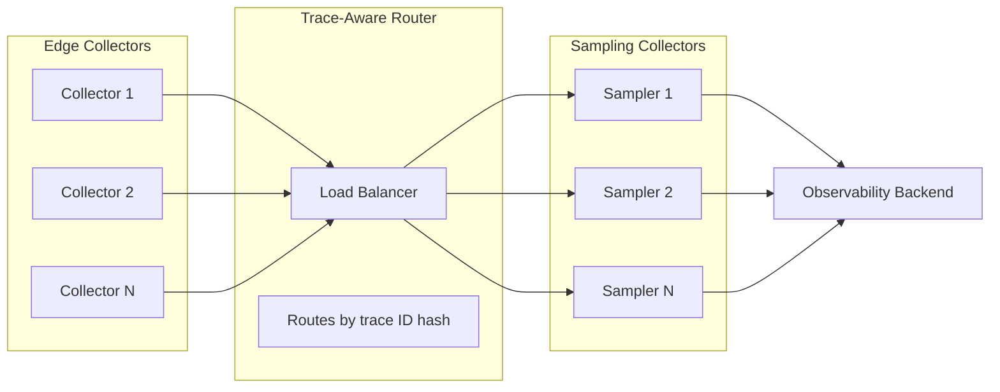
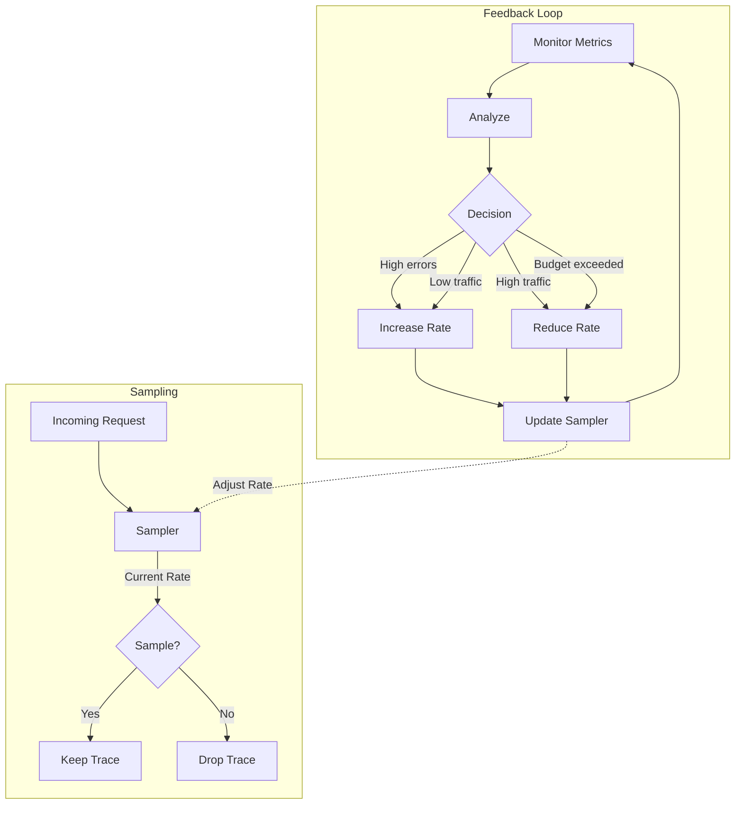
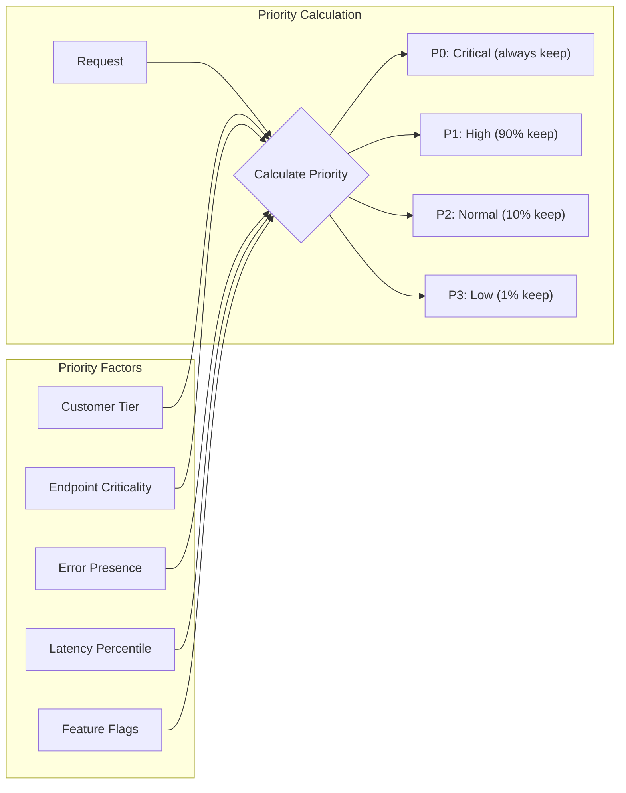
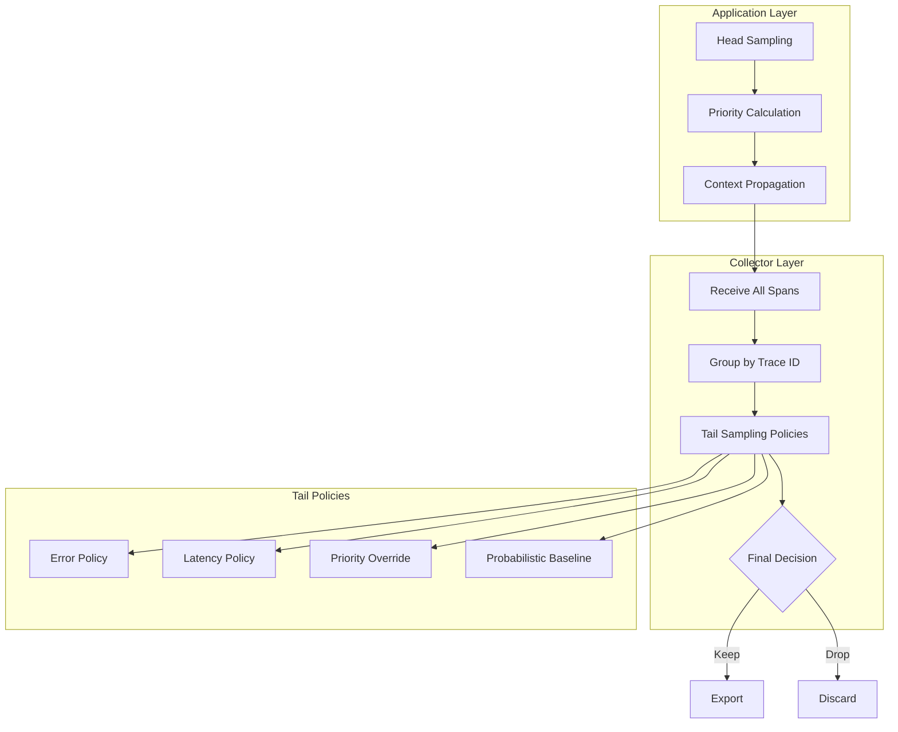
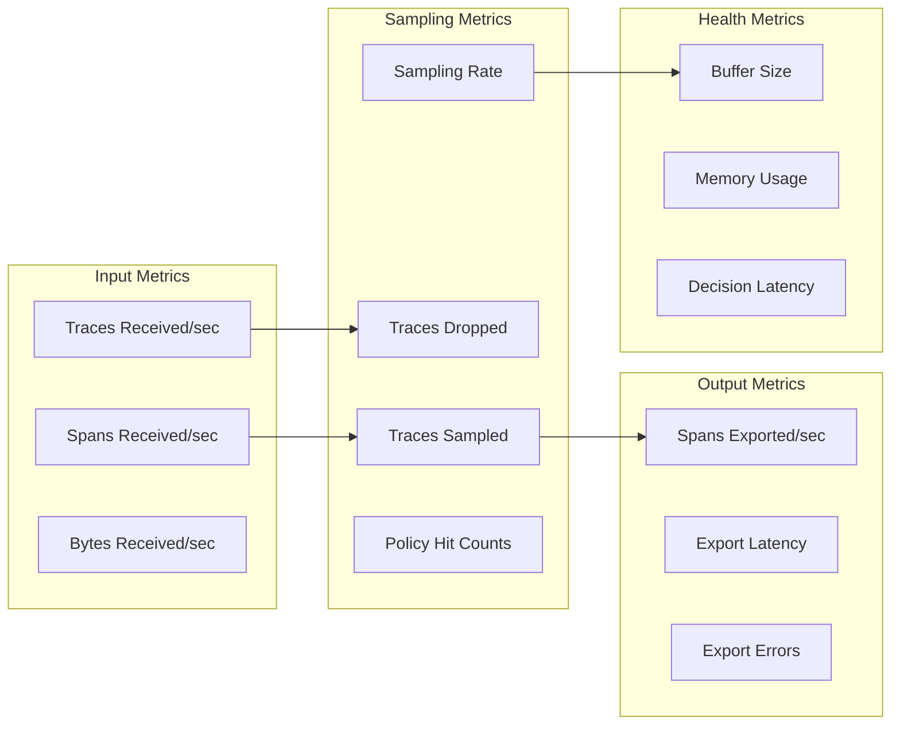
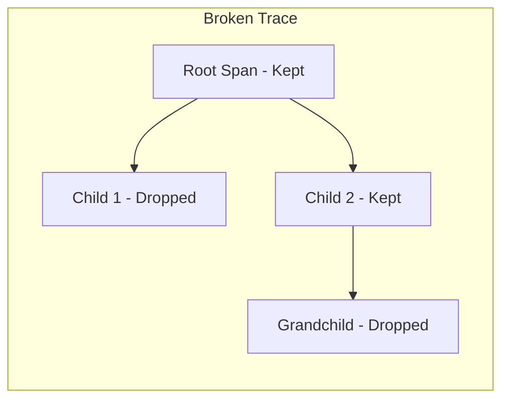
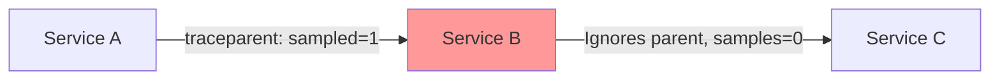
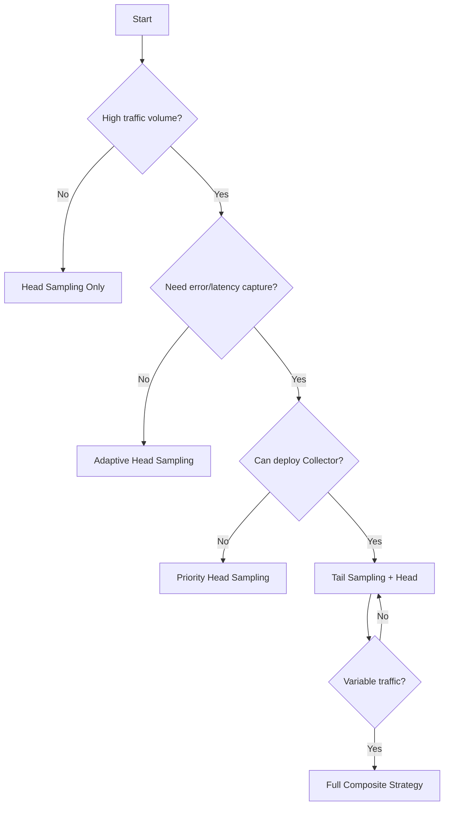

# How to Build Trace Sampling Design

Author: [nawazdhandala](https://github.com/nawazdhandala)

Tags: Observability, Tracing, OpenTelemetry, Performance

Description: Learn how to design sampling strategies for balancing trace visibility with performance and cost.

---

> Collecting every trace is like recording every conversation in your office. You will drown in noise, burn through storage, and still miss the moments that matter.

Trace sampling is the art of deciding which traces to keep and which to discard. Done well, it preserves visibility into errors, slowness, and critical paths while keeping costs manageable. Done poorly, it creates blind spots that surface only during incidents.

This guide walks through the core sampling strategies, their trade-offs, and practical implementations you can deploy today.

---

## Table of Contents

1. Why Sampling Matters
2. Head-Based Sampling
3. Tail-Based Sampling
4. Adaptive Sampling
5. Priority Sampling
6. Combining Strategies
7. Implementation Examples
8. Collector Configuration
9. Monitoring Your Sampling
10. Common Pitfalls

---

## 1. Why Sampling Matters

At scale, tracing without sampling is unsustainable:

| Traffic Level | Traces per Day | Storage (uncompressed) | Monthly Cost (estimated) |
|---------------|----------------|------------------------|--------------------------|
| 1K RPS | 86.4M | ~86 GB | $500+ |
| 10K RPS | 864M | ~864 GB | $5,000+ |
| 100K RPS | 8.64B | ~8.6 TB | $50,000+ |

But you do not need every trace. You need:

- 100% of errors
- 100% of slow requests
- 100% of critical business flows
- A representative sample of normal traffic

Sampling gives you this without breaking the bank.

---

## 2. Head-Based Sampling

Head-based sampling makes the keep/drop decision at trace creation, before any spans execute.

### How It Works



The decision propagates via context (W3C `traceparent` header). All downstream services respect the original decision, ensuring complete traces.

### Pros and Cons

| Pros | Cons |
|------|------|
| Low overhead | Blind to trace outcome |
| Simple implementation | May miss rare errors |
| Predictable resource usage | No latency-based filtering |
| No buffering required | Fixed rate ignores traffic patterns |

### Implementation: Probabilistic Head Sampling

```typescript
// head-sampler.ts
// Probabilistic head sampler that decides at trace root

import {
  Sampler,
  SamplingDecision,
  SamplingResult,
  Context,
  SpanKind,
  Attributes,
  Link
} from '@opentelemetry/api';

export class ProbabilisticHeadSampler implements Sampler {
  // Sampling rate between 0.0 (drop all) and 1.0 (keep all)
  private readonly rate: number;

  // Precomputed threshold for fast comparison
  // TraceId is 128 bits, we use lower 64 bits as unsigned int
  private readonly threshold: bigint;

  constructor(rate: number) {
    // Clamp rate to valid range
    this.rate = Math.max(0, Math.min(1, rate));

    // Convert rate to threshold for trace ID comparison
    // Max unsigned 64-bit value * rate gives us the threshold
    this.threshold = BigInt(Math.floor(this.rate * Number.MAX_SAFE_INTEGER));
  }

  shouldSample(
    context: Context,
    traceId: string,
    spanName: string,
    spanKind: SpanKind,
    attributes: Attributes,
    links: Link[]
  ): SamplingResult {
    // Convert last 16 hex chars of traceId to number for comparison
    // This gives us consistent sampling for the same trace ID
    const traceIdSuffix = traceId.slice(-16);
    const traceIdValue = BigInt(`0x${traceIdSuffix}`);

    // Deterministic decision based on trace ID
    // Same trace ID always produces same decision
    const shouldKeep = traceIdValue <= this.threshold;

    return {
      decision: shouldKeep
        ? SamplingDecision.RECORD_AND_SAMPLED
        : SamplingDecision.NOT_RECORD,
      // Pass along sampling metadata for debugging
      attributes: {
        'sampling.rate': this.rate,
        'sampling.strategy': 'probabilistic_head'
      }
    };
  }

  toString(): string {
    return `ProbabilisticHeadSampler(rate=${this.rate})`;
  }
}

// Usage with OpenTelemetry SDK
import { NodeSDK } from '@opentelemetry/sdk-node';
import { OTLPTraceExporter } from '@opentelemetry/exporter-trace-otlp-http';

const sdk = new NodeSDK({
  traceExporter: new OTLPTraceExporter({
    url: process.env.OTLP_ENDPOINT || 'http://localhost:4318/v1/traces'
  }),
  // Sample 10% of traces
  sampler: new ProbabilisticHeadSampler(0.10)
});

sdk.start();
```

### Rate-Limited Head Sampling

When you want a fixed number of traces per time window rather than a percentage:

```typescript
// rate-limited-sampler.ts
// Keeps at most N traces per second using token bucket algorithm

import {
  Sampler,
  SamplingDecision,
  SamplingResult,
  Context,
  SpanKind,
  Attributes,
  Link
} from '@opentelemetry/api';

export class RateLimitedSampler implements Sampler {
  private readonly maxTracesPerSecond: number;
  private tokens: number;
  private lastRefill: number;

  constructor(maxTracesPerSecond: number) {
    this.maxTracesPerSecond = maxTracesPerSecond;
    this.tokens = maxTracesPerSecond;
    this.lastRefill = Date.now();
  }

  shouldSample(
    context: Context,
    traceId: string,
    spanName: string,
    spanKind: SpanKind,
    attributes: Attributes,
    links: Link[]
  ): SamplingResult {
    // Refill tokens based on elapsed time
    const now = Date.now();
    const elapsed = (now - this.lastRefill) / 1000;

    // Add tokens proportional to elapsed time, cap at max
    this.tokens = Math.min(
      this.maxTracesPerSecond,
      this.tokens + elapsed * this.maxTracesPerSecond
    );
    this.lastRefill = now;

    // Try to consume a token
    if (this.tokens >= 1) {
      this.tokens -= 1;
      return {
        decision: SamplingDecision.RECORD_AND_SAMPLED,
        attributes: {
          'sampling.strategy': 'rate_limited',
          'sampling.max_per_second': this.maxTracesPerSecond
        }
      };
    }

    return {
      decision: SamplingDecision.NOT_RECORD
    };
  }

  toString(): string {
    return `RateLimitedSampler(max=${this.maxTracesPerSecond}/s)`;
  }
}
```

---

## 3. Tail-Based Sampling

Tail-based sampling makes the decision after the trace completes, with full knowledge of what happened.

### How It Works



### Pros and Cons

| Pros | Cons |
|------|------|
| Captures all errors | Requires buffering |
| Latency-aware decisions | Higher memory usage |
| Context-rich policies | Added latency before export |
| Flexible rule composition | More complex infrastructure |

### Architecture: Tail Sampling Pipeline



The trace-aware load balancer ensures all spans from the same trace reach the same sampling collector. Without this, you would have incomplete traces.

### Collector Configuration

```yaml
# otel-collector-config.yaml
# Tail sampling configuration for OpenTelemetry Collector

receivers:
  otlp:
    protocols:
      grpc:
        endpoint: 0.0.0.0:4317
      http:
        endpoint: 0.0.0.0:4318

processors:
  # Memory protection to prevent OOM during traffic spikes
  memory_limiter:
    check_interval: 1s
    limit_mib: 2048
    spike_limit_mib: 512

  # Batch spans before processing for efficiency
  batch:
    send_batch_size: 1024
    timeout: 1s

  # Tail sampling processor with multiple policies
  tail_sampling:
    # How long to wait for a trace to complete
    # Longer waits capture more spans but use more memory
    decision_wait: 10s

    # Maximum traces to hold in memory
    # Size based on your traffic and memory budget
    num_traces: 100000

    # Expected new traces per second (for memory allocation)
    expected_new_traces_per_sec: 1000

    # Sampling policies evaluated in order
    policies:
      # Policy 1: Always keep traces with errors
      # This ensures you never miss failed requests
      - name: errors-policy
        type: status_code
        status_code:
          status_codes:
            - ERROR

      # Policy 2: Keep slow traces above latency threshold
      # Adjust threshold based on your service SLOs
      - name: latency-policy
        type: latency
        latency:
          threshold_ms: 500

      # Policy 3: Always keep traces from critical endpoints
      # Add your most important routes here
      - name: critical-endpoints
        type: string_attribute
        string_attribute:
          key: http.route
          values:
            - /api/checkout
            - /api/payment
            - /api/auth/login
          enabled_regex_matching: false

      # Policy 4: Keep traces from VIP customers
      # Requires your services to set this attribute
      - name: vip-customers
        type: string_attribute
        string_attribute:
          key: customer.tier
          values:
            - enterprise
            - premium

      # Policy 5: Keep traces with many database calls
      # Helps identify N+1 query problems
      - name: high-db-spans
        type: span_count
        span_count:
          min_spans: 20

      # Policy 6: Probabilistic sampling for remaining traces
      # Provides baseline coverage of normal traffic
      - name: probabilistic-baseline
        type: probabilistic
        probabilistic:
          sampling_percentage: 5

exporters:
  otlp:
    endpoint: "https://your-backend.com:4317"
    headers:
      authorization: "Bearer ${OTLP_TOKEN}"

service:
  pipelines:
    traces:
      receivers: [otlp]
      processors: [memory_limiter, batch, tail_sampling]
      exporters: [otlp]
```

---

## 4. Adaptive Sampling

Adaptive sampling adjusts rates dynamically based on traffic patterns, error rates, or resource constraints.

### How It Works



### Implementation: Error-Rate Adaptive Sampler

```typescript
// adaptive-sampler.ts
// Increases sampling rate when errors spike, reduces when stable

import {
  Sampler,
  SamplingDecision,
  SamplingResult,
  Context,
  SpanKind,
  Attributes,
  Link
} from '@opentelemetry/api';

interface AdaptiveConfig {
  // Minimum sampling rate (floor)
  minRate: number;
  // Maximum sampling rate (ceiling)
  maxRate: number;
  // Starting sampling rate
  baseRate: number;
  // Error rate threshold to trigger increase
  errorThreshold: number;
  // How much to adjust rate per interval
  adjustmentStep: number;
  // How often to recalculate (ms)
  adjustmentIntervalMs: number;
}

export class AdaptiveSampler implements Sampler {
  private config: AdaptiveConfig;
  private currentRate: number;

  // Sliding window counters
  private totalRequests: number = 0;
  private errorRequests: number = 0;
  private windowStart: number = Date.now();

  constructor(config: Partial<AdaptiveConfig> = {}) {
    this.config = {
      minRate: config.minRate ?? 0.01,      // 1% minimum
      maxRate: config.maxRate ?? 1.0,        // 100% maximum
      baseRate: config.baseRate ?? 0.10,     // 10% baseline
      errorThreshold: config.errorThreshold ?? 0.05,  // 5% error rate
      adjustmentStep: config.adjustmentStep ?? 0.05,  // 5% adjustment
      adjustmentIntervalMs: config.adjustmentIntervalMs ?? 60000  // 1 minute
    };

    this.currentRate = this.config.baseRate;
  }

  shouldSample(
    context: Context,
    traceId: string,
    spanName: string,
    spanKind: SpanKind,
    attributes: Attributes,
    links: Link[]
  ): SamplingResult {
    // Check if we need to adjust the rate
    this.maybeAdjustRate();

    // Track request for error rate calculation
    this.totalRequests++;

    // Check if this request has error indicators
    // Note: At head sampling time, we may not know the outcome yet
    // This works better with a feedback mechanism from completed traces
    const hasErrorHint = attributes['error.hint'] === true;
    if (hasErrorHint) {
      this.errorRequests++;
    }

    // Probabilistic decision based on current rate
    const shouldKeep = Math.random() < this.currentRate;

    return {
      decision: shouldKeep
        ? SamplingDecision.RECORD_AND_SAMPLED
        : SamplingDecision.NOT_RECORD,
      attributes: {
        'sampling.strategy': 'adaptive',
        'sampling.rate': this.currentRate,
        'sampling.error_rate': this.getErrorRate()
      }
    };
  }

  private maybeAdjustRate(): void {
    const now = Date.now();
    const elapsed = now - this.windowStart;

    // Check if adjustment interval has passed
    if (elapsed < this.config.adjustmentIntervalMs) {
      return;
    }

    const errorRate = this.getErrorRate();

    // Adjust rate based on error rate
    if (errorRate > this.config.errorThreshold) {
      // Errors are high, increase sampling to capture more
      this.currentRate = Math.min(
        this.config.maxRate,
        this.currentRate + this.config.adjustmentStep
      );
      console.log(`[AdaptiveSampler] Error rate ${(errorRate * 100).toFixed(1)}% > threshold, increasing sampling to ${(this.currentRate * 100).toFixed(1)}%`);
    } else if (this.currentRate > this.config.baseRate) {
      // Errors are normal, gradually return to baseline
      this.currentRate = Math.max(
        this.config.baseRate,
        this.currentRate - this.config.adjustmentStep
      );
      console.log(`[AdaptiveSampler] Error rate stable, reducing sampling to ${(this.currentRate * 100).toFixed(1)}%`);
    }

    // Reset window
    this.totalRequests = 0;
    this.errorRequests = 0;
    this.windowStart = now;
  }

  private getErrorRate(): number {
    if (this.totalRequests === 0) return 0;
    return this.errorRequests / this.totalRequests;
  }

  // Allow external feedback from completed traces
  recordOutcome(isError: boolean): void {
    if (isError) {
      this.errorRequests++;
    }
  }

  toString(): string {
    return `AdaptiveSampler(rate=${this.currentRate}, base=${this.config.baseRate})`;
  }
}
```

### Traffic-Based Adaptive Sampling

```typescript
// traffic-adaptive-sampler.ts
// Adjusts sampling based on traffic volume to maintain consistent trace count

import {
  Sampler,
  SamplingDecision,
  SamplingResult,
  Context,
  SpanKind,
  Attributes,
  Link
} from '@opentelemetry/api';

interface TrafficAdaptiveConfig {
  // Target traces per minute to keep
  targetTracesPerMinute: number;
  // How often to recalculate rate (ms)
  recalculateIntervalMs: number;
  // Minimum sampling rate
  minRate: number;
  // Maximum sampling rate
  maxRate: number;
}

export class TrafficAdaptiveSampler implements Sampler {
  private config: TrafficAdaptiveConfig;
  private currentRate: number = 0.10;

  // Traffic measurement
  private requestCount: number = 0;
  private windowStart: number = Date.now();

  constructor(config: Partial<TrafficAdaptiveConfig> = {}) {
    this.config = {
      targetTracesPerMinute: config.targetTracesPerMinute ?? 1000,
      recalculateIntervalMs: config.recalculateIntervalMs ?? 10000,
      minRate: config.minRate ?? 0.001,
      maxRate: config.maxRate ?? 1.0
    };
  }

  shouldSample(
    context: Context,
    traceId: string,
    spanName: string,
    spanKind: SpanKind,
    attributes: Attributes,
    links: Link[]
  ): SamplingResult {
    this.requestCount++;
    this.maybeRecalculate();

    const shouldKeep = Math.random() < this.currentRate;

    return {
      decision: shouldKeep
        ? SamplingDecision.RECORD_AND_SAMPLED
        : SamplingDecision.NOT_RECORD,
      attributes: {
        'sampling.strategy': 'traffic_adaptive',
        'sampling.rate': this.currentRate,
        'sampling.target_per_min': this.config.targetTracesPerMinute
      }
    };
  }

  private maybeRecalculate(): void {
    const now = Date.now();
    const elapsedMs = now - this.windowStart;

    if (elapsedMs < this.config.recalculateIntervalMs) {
      return;
    }

    // Calculate current requests per minute
    const elapsedMinutes = elapsedMs / 60000;
    const requestsPerMinute = this.requestCount / elapsedMinutes;

    // Calculate rate needed to hit target
    if (requestsPerMinute > 0) {
      const idealRate = this.config.targetTracesPerMinute / requestsPerMinute;

      // Clamp to configured bounds
      this.currentRate = Math.max(
        this.config.minRate,
        Math.min(this.config.maxRate, idealRate)
      );

      console.log(`[TrafficAdaptiveSampler] Traffic: ${Math.round(requestsPerMinute)}/min, adjusted rate to ${(this.currentRate * 100).toFixed(2)}%`);
    }

    // Reset window
    this.requestCount = 0;
    this.windowStart = now;
  }

  toString(): string {
    return `TrafficAdaptiveSampler(target=${this.config.targetTracesPerMinute}/min)`;
  }
}
```

---

## 5. Priority Sampling

Priority sampling assigns importance scores to traces and samples based on priority thresholds.

### How It Works



### Implementation: Multi-Factor Priority Sampler

```typescript
// priority-sampler.ts
// Calculates priority score from multiple factors and samples accordingly

import {
  Sampler,
  SamplingDecision,
  SamplingResult,
  Context,
  SpanKind,
  Attributes,
  Link
} from '@opentelemetry/api';

// Priority levels with their sampling rates
enum Priority {
  CRITICAL = 0,  // Always sample
  HIGH = 1,      // 90% sample
  NORMAL = 2,    // 10% sample
  LOW = 3        // 1% sample
}

const PRIORITY_RATES: Record<Priority, number> = {
  [Priority.CRITICAL]: 1.0,
  [Priority.HIGH]: 0.9,
  [Priority.NORMAL]: 0.1,
  [Priority.LOW]: 0.01
};

interface PriorityRule {
  // Rule name for debugging
  name: string;
  // Function to check if rule matches
  matches: (attributes: Attributes, spanName: string) => boolean;
  // Priority to assign if rule matches
  priority: Priority;
}

export class PrioritySampler implements Sampler {
  private rules: PriorityRule[];
  private defaultPriority: Priority;

  constructor(rules: PriorityRule[], defaultPriority: Priority = Priority.NORMAL) {
    // Sort rules by priority (lower number = higher priority = checked first)
    this.rules = [...rules].sort((a, b) => a.priority - b.priority);
    this.defaultPriority = defaultPriority;
  }

  shouldSample(
    context: Context,
    traceId: string,
    spanName: string,
    spanKind: SpanKind,
    attributes: Attributes,
    links: Link[]
  ): SamplingResult {
    // Calculate priority based on rules
    const priority = this.calculatePriority(attributes, spanName);
    const samplingRate = PRIORITY_RATES[priority];

    // Deterministic sampling based on trace ID for consistency
    const traceIdSuffix = traceId.slice(-8);
    const traceIdNum = parseInt(traceIdSuffix, 16);
    const threshold = samplingRate * 0xFFFFFFFF;
    const shouldKeep = traceIdNum <= threshold;

    return {
      decision: shouldKeep
        ? SamplingDecision.RECORD_AND_SAMPLED
        : SamplingDecision.NOT_RECORD,
      attributes: {
        'sampling.strategy': 'priority',
        'sampling.priority': Priority[priority],
        'sampling.rate': samplingRate
      }
    };
  }

  private calculatePriority(attributes: Attributes, spanName: string): Priority {
    // Check rules in priority order (highest priority rules first)
    for (const rule of this.rules) {
      if (rule.matches(attributes, spanName)) {
        return rule.priority;
      }
    }
    return this.defaultPriority;
  }

  toString(): string {
    return `PrioritySampler(rules=${this.rules.length})`;
  }
}

// Factory function to create a fully configured priority sampler
export function createPrioritySampler(): PrioritySampler {
  const rules: PriorityRule[] = [
    // Rule 1: Error indicators are always critical
    {
      name: 'errors',
      matches: (attrs) => attrs['error'] === true || attrs['http.status_code'] as number >= 500,
      priority: Priority.CRITICAL
    },

    // Rule 2: Payment and checkout endpoints are critical
    {
      name: 'payment-endpoints',
      matches: (attrs, spanName) => {
        const route = attrs['http.route'] as string || spanName;
        return route?.includes('payment') || route?.includes('checkout');
      },
      priority: Priority.CRITICAL
    },

    // Rule 3: Enterprise customers are high priority
    {
      name: 'enterprise-customers',
      matches: (attrs) => attrs['customer.tier'] === 'enterprise',
      priority: Priority.HIGH
    },

    // Rule 4: Authentication endpoints are high priority
    {
      name: 'auth-endpoints',
      matches: (attrs, spanName) => {
        const route = attrs['http.route'] as string || spanName;
        return route?.includes('auth') || route?.includes('login');
      },
      priority: Priority.HIGH
    },

    // Rule 5: Health checks are low priority
    {
      name: 'health-checks',
      matches: (attrs, spanName) => {
        const route = attrs['http.route'] as string || spanName;
        return route?.includes('health') || route?.includes('ready') || route?.includes('live');
      },
      priority: Priority.LOW
    },

    // Rule 6: Static assets are low priority
    {
      name: 'static-assets',
      matches: (attrs) => {
        const route = attrs['http.route'] as string || '';
        return route.includes('/static/') || route.includes('/assets/');
      },
      priority: Priority.LOW
    }
  ];

  return new PrioritySampler(rules, Priority.NORMAL);
}
```

### Priority Propagation Across Services

```typescript
// priority-propagator.ts
// Propagates sampling priority across service boundaries

import {
  Context,
  TextMapGetter,
  TextMapSetter,
  TextMapPropagator,
  trace,
  createContextKey
} from '@opentelemetry/api';

// Context key for storing priority
const PRIORITY_KEY = createContextKey('sampling-priority');

// Header name for priority propagation
const PRIORITY_HEADER = 'x-sampling-priority';

export class PriorityPropagator implements TextMapPropagator {

  inject(context: Context, carrier: unknown, setter: TextMapSetter): void {
    const priority = context.getValue(PRIORITY_KEY);
    if (priority !== undefined) {
      setter.set(carrier, PRIORITY_HEADER, String(priority));
    }
  }

  extract(context: Context, carrier: unknown, getter: TextMapGetter): Context {
    const priorityHeader = getter.get(carrier, PRIORITY_HEADER);
    if (priorityHeader) {
      const priority = parseInt(priorityHeader, 10);
      if (!isNaN(priority)) {
        return context.setValue(PRIORITY_KEY, priority);
      }
    }
    return context;
  }

  fields(): string[] {
    return [PRIORITY_HEADER];
  }
}

// Helper to set priority in context
export function withPriority(context: Context, priority: number): Context {
  return context.setValue(PRIORITY_KEY, priority);
}

// Helper to get priority from context
export function getPriority(context: Context): number | undefined {
  return context.getValue(PRIORITY_KEY) as number | undefined;
}
```

---

## 6. Combining Strategies

Real-world sampling combines multiple strategies in a layered approach.

### Recommended Architecture



### Composite Sampler Implementation

```typescript
// composite-sampler.ts
// Combines multiple sampling strategies with configurable logic

import {
  Sampler,
  SamplingDecision,
  SamplingResult,
  Context,
  SpanKind,
  Attributes,
  Link
} from '@opentelemetry/api';

type CompositeMode = 'any' | 'all' | 'priority';

interface CompositeConfig {
  // How to combine sampler decisions
  // 'any': Keep if any sampler says keep
  // 'all': Keep only if all samplers say keep
  // 'priority': Use first sampler that has an opinion
  mode: CompositeMode;
  samplers: Sampler[];
}

export class CompositeSampler implements Sampler {
  private config: CompositeConfig;

  constructor(config: CompositeConfig) {
    this.config = config;
  }

  shouldSample(
    context: Context,
    traceId: string,
    spanName: string,
    spanKind: SpanKind,
    attributes: Attributes,
    links: Link[]
  ): SamplingResult {
    const results = this.config.samplers.map(sampler =>
      sampler.shouldSample(context, traceId, spanName, spanKind, attributes, links)
    );

    const decision = this.combineDecisions(results);
    const combinedAttributes = this.combineAttributes(results);

    return {
      decision,
      attributes: {
        ...combinedAttributes,
        'sampling.strategy': 'composite',
        'sampling.mode': this.config.mode
      }
    };
  }

  private combineDecisions(results: SamplingResult[]): SamplingDecision {
    const decisions = results.map(r => r.decision);

    switch (this.config.mode) {
      case 'any':
        // Keep if any sampler wants to keep
        return decisions.some(d => d === SamplingDecision.RECORD_AND_SAMPLED)
          ? SamplingDecision.RECORD_AND_SAMPLED
          : SamplingDecision.NOT_RECORD;

      case 'all':
        // Keep only if all samplers want to keep
        return decisions.every(d => d === SamplingDecision.RECORD_AND_SAMPLED)
          ? SamplingDecision.RECORD_AND_SAMPLED
          : SamplingDecision.NOT_RECORD;

      case 'priority':
        // Use first non-abstaining decision
        for (const decision of decisions) {
          if (decision !== SamplingDecision.NOT_RECORD) {
            return decision;
          }
        }
        return SamplingDecision.NOT_RECORD;

      default:
        return SamplingDecision.NOT_RECORD;
    }
  }

  private combineAttributes(results: SamplingResult[]): Attributes {
    const combined: Attributes = {};
    for (const result of results) {
      if (result.attributes) {
        Object.assign(combined, result.attributes);
      }
    }
    return combined;
  }

  toString(): string {
    return `CompositeSampler(mode=${this.config.mode}, samplers=${this.config.samplers.length})`;
  }
}

// Example: Create a production sampler combining strategies
export function createProductionSampler(): Sampler {
  const prioritySampler = createPrioritySampler();
  const adaptiveSampler = new AdaptiveSampler({
    baseRate: 0.05,
    errorThreshold: 0.02
  });
  const rateLimitedSampler = new RateLimitedSampler(100); // Max 100 traces/sec

  // Use 'any' mode: keep trace if priority OR adaptive says keep
  // Then apply rate limiting as a cap
  return new CompositeSampler({
    mode: 'all',
    samplers: [
      // First check: does priority or adaptive want to keep it?
      new CompositeSampler({
        mode: 'any',
        samplers: [prioritySampler, adaptiveSampler]
      }),
      // Second check: are we within rate limits?
      rateLimitedSampler
    ]
  });
}
```

---

## 7. Implementation Examples

### Full Application Setup

```typescript
// telemetry-setup.ts
// Complete OpenTelemetry setup with sampling

import { NodeSDK } from '@opentelemetry/sdk-node';
import { getNodeAutoInstrumentations } from '@opentelemetry/auto-instrumentations-node';
import { OTLPTraceExporter } from '@opentelemetry/exporter-trace-otlp-http';
import { Resource } from '@opentelemetry/resources';
import {
  SEMRESATTRS_SERVICE_NAME,
  SEMRESATTRS_SERVICE_VERSION,
  SEMRESATTRS_DEPLOYMENT_ENVIRONMENT
} from '@opentelemetry/semantic-conventions';
import { ParentBasedSampler } from '@opentelemetry/sdk-trace-base';

// Import our custom samplers
import { createProductionSampler } from './composite-sampler';
import { PriorityPropagator } from './priority-propagator';
import { CompositePropagator, W3CTraceContextPropagator } from '@opentelemetry/core';

// Determine environment
const isDevelopment = process.env.NODE_ENV === 'development';

// Create appropriate sampler for environment
function createSampler() {
  if (isDevelopment) {
    // In development, sample everything for debugging
    return new ParentBasedSampler({
      root: { shouldSample: () => ({ decision: 1 }) } as any
    });
  }

  // In production, use our composite sampler
  return new ParentBasedSampler({
    root: createProductionSampler()
  });
}

// Configure exporter
const traceExporter = new OTLPTraceExporter({
  url: process.env.OTLP_ENDPOINT || 'https://oneuptime.com/otlp/v1/traces',
  headers: {
    'x-oneuptime-token': process.env.ONEUPTIME_TOKEN || ''
  }
});

// Create SDK
const sdk = new NodeSDK({
  resource: new Resource({
    [SEMRESATTRS_SERVICE_NAME]: process.env.SERVICE_NAME || 'my-service',
    [SEMRESATTRS_SERVICE_VERSION]: process.env.SERVICE_VERSION || '1.0.0',
    [SEMRESATTRS_DEPLOYMENT_ENVIRONMENT]: process.env.NODE_ENV || 'development'
  }),
  traceExporter,
  sampler: createSampler(),
  instrumentations: [
    getNodeAutoInstrumentations({
      // Skip instrumentation for noisy internal calls
      '@opentelemetry/instrumentation-fs': { enabled: false },
      '@opentelemetry/instrumentation-dns': { enabled: false }
    })
  ],
  // Use both W3C trace context and our priority propagator
  textMapPropagator: new CompositePropagator({
    propagators: [
      new W3CTraceContextPropagator(),
      new PriorityPropagator()
    ]
  })
});

// Graceful shutdown
process.on('SIGTERM', () => {
  sdk.shutdown()
    .then(() => console.log('Telemetry shut down'))
    .catch((err) => console.error('Error shutting down telemetry', err))
    .finally(() => process.exit(0));
});

// Start SDK
sdk.start();
console.log('Telemetry initialized');

export { sdk };
```

### Express Middleware for Priority Assignment

```typescript
// priority-middleware.ts
// Middleware that assigns sampling priority based on request characteristics

import { Request, Response, NextFunction } from 'express';
import { context, trace } from '@opentelemetry/api';
import { withPriority } from './priority-propagator';

// Priority levels
const PRIORITY = {
  CRITICAL: 0,
  HIGH: 1,
  NORMAL: 2,
  LOW: 3
} as const;

// Configuration for priority assignment
interface PriorityConfig {
  criticalPaths: RegExp[];
  highPriorityPaths: RegExp[];
  lowPriorityPaths: RegExp[];
  vipCustomerHeader: string;
  vipCustomerValues: string[];
}

const defaultConfig: PriorityConfig = {
  criticalPaths: [
    /^\/api\/payment/,
    /^\/api\/checkout/,
    /^\/api\/order/
  ],
  highPriorityPaths: [
    /^\/api\/auth/,
    /^\/api\/user/
  ],
  lowPriorityPaths: [
    /^\/health/,
    /^\/ready/,
    /^\/metrics/,
    /^\/static\//
  ],
  vipCustomerHeader: 'x-customer-tier',
  vipCustomerValues: ['enterprise', 'premium']
};

export function priorityMiddleware(config: Partial<PriorityConfig> = {}) {
  const cfg = { ...defaultConfig, ...config };

  return (req: Request, res: Response, next: NextFunction) => {
    // Calculate priority based on request
    let priority = PRIORITY.NORMAL;
    const path = req.path;

    // Check path-based priorities
    if (cfg.lowPriorityPaths.some(re => re.test(path))) {
      priority = PRIORITY.LOW;
    } else if (cfg.highPriorityPaths.some(re => re.test(path))) {
      priority = PRIORITY.HIGH;
    } else if (cfg.criticalPaths.some(re => re.test(path))) {
      priority = PRIORITY.CRITICAL;
    }

    // VIP customers override to at least HIGH
    const customerTier = req.headers[cfg.vipCustomerHeader] as string;
    if (customerTier && cfg.vipCustomerValues.includes(customerTier)) {
      priority = Math.min(priority, PRIORITY.HIGH);
    }

    // Set priority in context for sampler and propagation
    const currentContext = context.active();
    const newContext = withPriority(currentContext, priority);

    // Add priority as span attribute for visibility
    const span = trace.getSpan(currentContext);
    if (span) {
      span.setAttribute('sampling.priority', priority);
      span.setAttribute('sampling.priority_name', Object.keys(PRIORITY)[priority]);
    }

    // Continue with updated context
    context.with(newContext, () => next());
  };
}
```

---

## 8. Collector Configuration

### Production-Ready Collector Config

```yaml
# otel-collector-production.yaml
# Full production configuration with multiple sampling strategies

receivers:
  otlp:
    protocols:
      grpc:
        endpoint: 0.0.0.0:4317
        max_recv_msg_size_mib: 16
      http:
        endpoint: 0.0.0.0:4318
        cors:
          allowed_origins:
            - "https://*.yourcompany.com"

processors:
  # Memory protection
  memory_limiter:
    check_interval: 1s
    limit_mib: 4096
    spike_limit_mib: 1024

  # Batching for efficiency
  batch:
    send_batch_size: 2048
    send_batch_max_size: 4096
    timeout: 2s

  # Add deployment metadata
  resource:
    attributes:
      - key: deployment.environment
        value: ${DEPLOY_ENV}
        action: upsert
      - key: deployment.version
        value: ${DEPLOY_VERSION}
        action: upsert

  # Filter out noise before sampling
  filter/pre:
    traces:
      span:
        # Drop health check spans before they consume sampling budget
        - 'attributes["http.route"] == "/health"'
        - 'attributes["http.route"] == "/ready"'
        - 'attributes["http.route"] == "/metrics"'

  # Main tail sampling processor
  tail_sampling:
    decision_wait: 15s
    num_traces: 200000
    expected_new_traces_per_sec: 5000

    policies:
      # Policy group 1: Always keep (critical signals)
      - name: errors-always
        type: status_code
        status_code:
          status_codes: [ERROR]

      - name: critical-priority
        type: numeric_attribute
        numeric_attribute:
          key: sampling.priority
          min_value: 0
          max_value: 0

      # Policy group 2: Keep most (high priority)
      - name: high-latency
        type: latency
        latency:
          threshold_ms: 1000

      - name: high-priority
        type: and
        and:
          and_sub_policy:
            - name: priority-check
              type: numeric_attribute
              numeric_attribute:
                key: sampling.priority
                min_value: 1
                max_value: 1
            - name: sample-90
              type: probabilistic
              probabilistic:
                sampling_percentage: 90

      # Policy group 3: Sample normally
      - name: normal-priority
        type: and
        and:
          and_sub_policy:
            - name: priority-check
              type: numeric_attribute
              numeric_attribute:
                key: sampling.priority
                min_value: 2
                max_value: 2
            - name: sample-10
              type: probabilistic
              probabilistic:
                sampling_percentage: 10

      # Policy group 4: Minimal sampling (low priority)
      - name: low-priority
        type: and
        and:
          and_sub_policy:
            - name: priority-check
              type: numeric_attribute
              numeric_attribute:
                key: sampling.priority
                min_value: 3
                max_value: 3
            - name: sample-1
              type: probabilistic
              probabilistic:
                sampling_percentage: 1

      # Policy group 5: Baseline for ungrouped traces
      - name: baseline
        type: probabilistic
        probabilistic:
          sampling_percentage: 5

  # Transform sensitive data
  transform:
    trace_statements:
      - context: span
        statements:
          # Redact potential PII from span names
          - replace_pattern(name, "user/[0-9]+", "user/{id}")
          - replace_pattern(name, "order/[a-zA-Z0-9-]+", "order/{id}")

exporters:
  otlp/primary:
    endpoint: "https://oneuptime.com:4317"
    headers:
      x-oneuptime-token: ${ONEUPTIME_TOKEN}
    retry_on_failure:
      enabled: true
      initial_interval: 5s
      max_interval: 30s
      max_elapsed_time: 300s

  # Debug exporter for troubleshooting
  logging:
    verbosity: basic
    sampling_initial: 10
    sampling_thereafter: 100

extensions:
  health_check:
    endpoint: 0.0.0.0:13133

  zpages:
    endpoint: 0.0.0.0:55679

service:
  extensions: [health_check, zpages]

  pipelines:
    traces:
      receivers: [otlp]
      processors:
        - memory_limiter
        - filter/pre
        - batch
        - tail_sampling
        - transform
        - resource
      exporters: [otlp/primary, logging]

  telemetry:
    logs:
      level: info
    metrics:
      address: 0.0.0.0:8888
```

### Kubernetes Deployment

```yaml
# collector-deployment.yaml
apiVersion: apps/v1
kind: Deployment
metadata:
  name: otel-collector
  namespace: observability
spec:
  replicas: 3
  selector:
    matchLabels:
      app: otel-collector
  template:
    metadata:
      labels:
        app: otel-collector
    spec:
      containers:
        - name: collector
          image: otel/opentelemetry-collector-contrib:latest
          args:
            - "--config=/conf/otel-collector-config.yaml"
          ports:
            - containerPort: 4317  # OTLP gRPC
            - containerPort: 4318  # OTLP HTTP
            - containerPort: 8888  # Metrics
            - containerPort: 13133 # Health check
          resources:
            requests:
              memory: "2Gi"
              cpu: "500m"
            limits:
              memory: "4Gi"
              cpu: "2000m"
          env:
            - name: DEPLOY_ENV
              valueFrom:
                fieldRef:
                  fieldPath: metadata.namespace
            - name: DEPLOY_VERSION
              value: "1.0.0"
            - name: ONEUPTIME_TOKEN
              valueFrom:
                secretKeyRef:
                  name: oneuptime-credentials
                  key: token
          volumeMounts:
            - name: config
              mountPath: /conf
          livenessProbe:
            httpGet:
              path: /
              port: 13133
            initialDelaySeconds: 5
            periodSeconds: 10
          readinessProbe:
            httpGet:
              path: /
              port: 13133
            initialDelaySeconds: 5
            periodSeconds: 10
      volumes:
        - name: config
          configMap:
            name: otel-collector-config
---
apiVersion: v1
kind: Service
metadata:
  name: otel-collector
  namespace: observability
spec:
  selector:
    app: otel-collector
  ports:
    - name: otlp-grpc
      port: 4317
      targetPort: 4317
    - name: otlp-http
      port: 4318
      targetPort: 4318
```

---

## 9. Monitoring Your Sampling

### Key Metrics to Track



### Prometheus Metrics for Sampling

```typescript
// sampling-metrics.ts
// Expose sampling metrics for monitoring

import { Counter, Gauge, Histogram, Registry } from 'prom-client';

// Create a dedicated registry for sampling metrics
const samplingRegistry = new Registry();

// Total traces evaluated
export const tracesEvaluated = new Counter({
  name: 'sampling_traces_evaluated_total',
  help: 'Total number of traces evaluated for sampling',
  labelNames: ['service'],
  registers: [samplingRegistry]
});

// Traces kept by policy
export const tracesKept = new Counter({
  name: 'sampling_traces_kept_total',
  help: 'Total number of traces kept after sampling',
  labelNames: ['service', 'policy', 'priority'],
  registers: [samplingRegistry]
});

// Traces dropped
export const tracesDropped = new Counter({
  name: 'sampling_traces_dropped_total',
  help: 'Total number of traces dropped by sampling',
  labelNames: ['service'],
  registers: [samplingRegistry]
});

// Current sampling rate
export const currentSamplingRate = new Gauge({
  name: 'sampling_current_rate',
  help: 'Current sampling rate (0.0 to 1.0)',
  labelNames: ['service', 'sampler_type'],
  registers: [samplingRegistry]
});

// Sampling decision latency
export const samplingLatency = new Histogram({
  name: 'sampling_decision_latency_seconds',
  help: 'Time taken to make sampling decisions',
  labelNames: ['service'],
  buckets: [0.0001, 0.0005, 0.001, 0.005, 0.01, 0.05],
  registers: [samplingRegistry]
});

// Buffer size for tail sampling
export const tailSamplingBuffer = new Gauge({
  name: 'sampling_tail_buffer_size',
  help: 'Number of traces currently buffered for tail sampling',
  labelNames: ['collector'],
  registers: [samplingRegistry]
});

// Policy evaluation counts
export const policyEvaluations = new Counter({
  name: 'sampling_policy_evaluations_total',
  help: 'Number of times each sampling policy was evaluated',
  labelNames: ['policy', 'result'],
  registers: [samplingRegistry]
});

export { samplingRegistry };
```

### Dashboard Queries (PromQL)

```yaml
# Sampling effectiveness queries

# Overall sampling rate
- record: sampling:rate:5m
  expr: |
    sum(rate(sampling_traces_kept_total[5m]))
    /
    sum(rate(sampling_traces_evaluated_total[5m]))

# Sampling rate by priority
- record: sampling:rate_by_priority:5m
  expr: |
    sum by (priority) (rate(sampling_traces_kept_total[5m]))
    /
    sum by (priority) (rate(sampling_traces_evaluated_total[5m]))

# Policy hit distribution
- record: sampling:policy_distribution:5m
  expr: |
    sum by (policy) (rate(sampling_traces_kept_total[5m]))
    /
    ignoring(policy) group_left
    sum(rate(sampling_traces_kept_total[5m]))

# Error capture rate (are we catching errors?)
- alert: SamplingMissingErrors
  expr: |
    (
      sum(rate(http_server_errors_total[5m]))
      -
      sum(rate(sampling_traces_kept_total{policy="errors-always"}[5m]))
    ) / sum(rate(http_server_errors_total[5m])) > 0.1
  for: 10m
  labels:
    severity: warning
  annotations:
    summary: "Sampling may be missing errors"
    description: "More than 10% of errors are not being captured by sampling"

# Tail sampling buffer pressure
- alert: TailSamplingBufferHigh
  expr: sampling_tail_buffer_size > 150000
  for: 5m
  labels:
    severity: warning
  annotations:
    summary: "Tail sampling buffer is filling up"
    description: "Buffer at {{ $value }} traces, may start dropping"
```

---

## 10. Common Pitfalls

### Pitfall 1: Sampling After the Root Span

**Problem:** Applying different sampling decisions to child spans than the root.



**Solution:** Always use `ParentBasedSampler` to respect the root decision.

```typescript
// Always wrap your sampler with ParentBasedSampler
import { ParentBasedSampler } from '@opentelemetry/sdk-trace-base';

const sampler = new ParentBasedSampler({
  // Your custom sampler only runs for root spans
  root: new PrioritySampler(rules),
  // Child spans inherit parent decision automatically
});
```

### Pitfall 2: High Cardinality in Sampling Attributes

**Problem:** Using unique identifiers in sampling decisions creates memory bloat.

```typescript
// BAD: Creates unbounded cardinality
span.setAttribute('user.id', userId);  // Millions of unique values
span.setAttribute('request.id', requestId);  // Unique per request

// GOOD: Use bounded categories
span.setAttribute('user.tier', 'premium');  // Few distinct values
span.setAttribute('request.type', 'checkout');  // Known set of types
```

### Pitfall 3: Ignoring Propagation Across Services

**Problem:** Service B makes independent sampling decision, breaking trace continuity.



**Solution:** Extract and honor incoming trace context.

```typescript
// Ensure propagation is configured
import { W3CTraceContextPropagator } from '@opentelemetry/core';

const sdk = new NodeSDK({
  textMapPropagator: new W3CTraceContextPropagator(),
  sampler: new ParentBasedSampler({
    root: yourSampler,
    // These ensure child spans follow parent
    remoteParentSampled: new AlwaysOnSampler(),
    remoteParentNotSampled: new AlwaysOffSampler()
  })
});
```

### Pitfall 4: Tail Sampling Without Trace-Aware Routing

**Problem:** Spans from the same trace hit different collector instances.

**Solution:** Use consistent hashing on trace ID for routing.

```yaml
# Using OpenTelemetry Collector's load balancing exporter
exporters:
  loadbalancing:
    protocol:
      otlp:
        endpoint: "sampling-collectors:4317"
    resolver:
      static:
        hostnames:
          - collector-0.sampling:4317
          - collector-1.sampling:4317
          - collector-2.sampling:4317
    routing_key: "traceID"  # Route by trace ID
```

### Pitfall 5: Not Testing Sampling in Development

**Problem:** Sampling bugs only surface in production.

**Solution:** Make sampling observable and testable.

```typescript
// sampling-test-utils.ts
// Utilities for testing sampling behavior

import { Sampler, SamplingDecision } from '@opentelemetry/api';

export function testSampler(
  sampler: Sampler,
  testCases: Array<{
    name: string;
    traceId: string;
    spanName: string;
    attributes: Record<string, any>;
    expectedDecision: SamplingDecision;
  }>
) {
  for (const tc of testCases) {
    const result = sampler.shouldSample(
      {} as any,  // context
      tc.traceId,
      tc.spanName,
      0,  // spanKind
      tc.attributes,
      []  // links
    );

    if (result.decision !== tc.expectedDecision) {
      throw new Error(
        `Test "${tc.name}" failed: expected ${tc.expectedDecision}, got ${result.decision}`
      );
    }
    console.log(`Test "${tc.name}" passed`);
  }
}

// Example test
testSampler(createPrioritySampler(), [
  {
    name: 'errors are always sampled',
    traceId: '00000000000000000000000000000001',
    spanName: 'http.request',
    attributes: { error: true },
    expectedDecision: SamplingDecision.RECORD_AND_SAMPLED
  },
  {
    name: 'health checks are low priority',
    traceId: '00000000000000000000000000000002',
    spanName: 'http.request',
    attributes: { 'http.route': '/health' },
    expectedDecision: SamplingDecision.NOT_RECORD  // At 1% rate, this specific traceId may not be sampled
  }
]);
```

---

## Summary

| Strategy | Best For | Overhead | Coverage |
|----------|----------|----------|----------|
| Head-Based | Simple, predictable sampling | Very Low | Random sample |
| Tail-Based | Error/latency capture | Medium | Targeted signals |
| Adaptive | Variable traffic patterns | Low | Self-adjusting |
| Priority | Business-critical flows | Low | Value-based |
| Composite | Production systems | Medium | Comprehensive |

### Decision Flowchart



### Quick Start Recommendations

1. **Start simple:** Begin with 10% head sampling
2. **Add tail sampling:** When you have collector infrastructure
3. **Implement priority:** When you have clear business-critical paths
4. **Add adaptive:** When traffic patterns are unpredictable
5. **Monitor always:** Track what you are keeping and missing

---

**Related Reading:**

- [What are Traces and Spans in OpenTelemetry](https://oneuptime.com/blog/post/2025-08-27-traces-and-spans-in-opentelemetry/view)
- [How to Reduce Noise in OpenTelemetry](https://oneuptime.com/blog/post/2025-08-25-how-to-reduce-noise-in-opentelemetry/view)
- [What is OpenTelemetry Collector and Why Use One](https://oneuptime.com/blog/post/2025-09-18-what-is-opentelemetry-collector-and-why-use-one/view)
