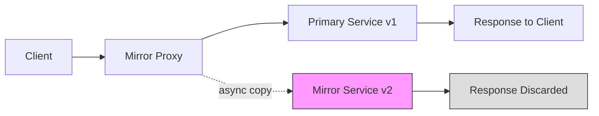
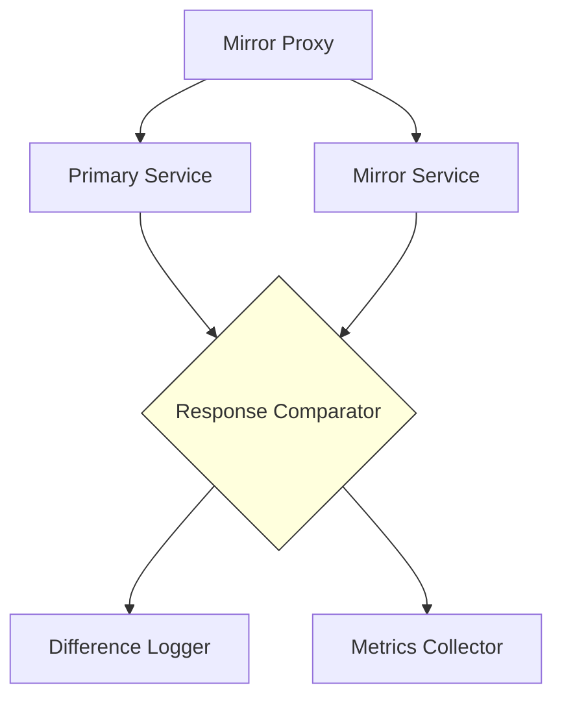
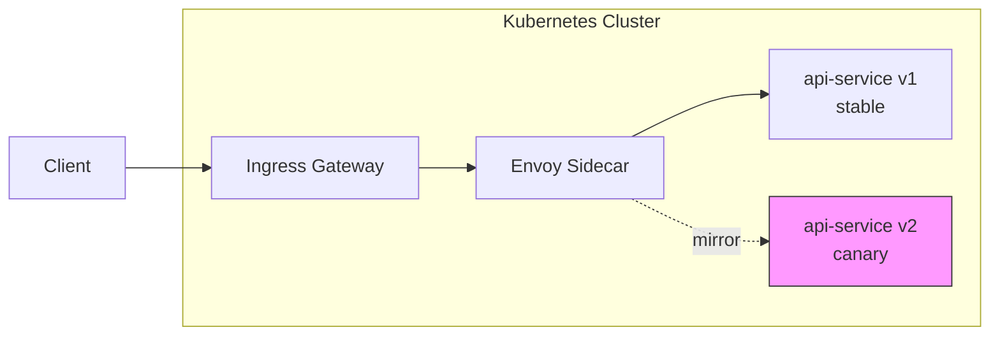
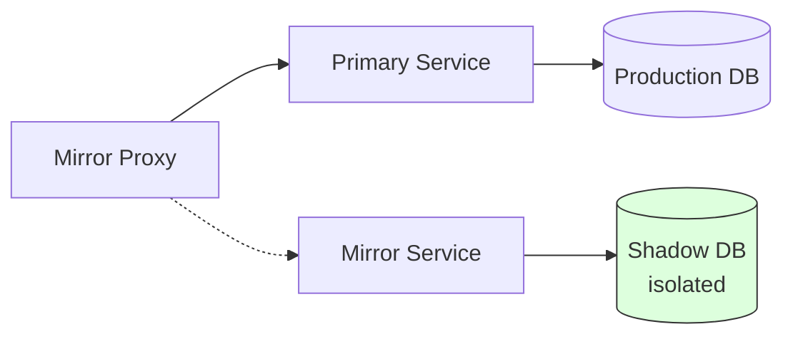

# How to Build Traffic Mirroring Details

Author: [nawazdhandala](https://github.com/nawazdhandala)

Tags: DevOps, Traffic Mirroring, Shadow Traffic, Testing

Description: Learn to build traffic mirroring for production traffic testing without risk.

---

Testing in production has always been risky. You deploy code, hold your breath, and hope nothing breaks. But what if you could test with real production traffic without affecting actual users? Traffic mirroring makes this possible by copying live requests to a shadow environment where you can safely validate new code, measure performance, and catch bugs before they reach customers.

This guide walks through building a production-grade traffic mirroring system from scratch, covering architecture patterns, implementation details, and operational considerations.

---

## Table of Contents

1. What is Traffic Mirroring?
2. Architecture Overview
3. Building the Mirror Proxy
4. Handling Mirrored Responses
5. Infrastructure with NGINX
6. Kubernetes-Native Mirroring with Istio
7. Monitoring and Observability
8. Common Pitfalls and Solutions

---

## 1. What is Traffic Mirroring?

Traffic mirroring (also called shadow traffic or dark launching) duplicates incoming production requests and sends copies to a secondary service. The primary service handles the real user request while the mirror receives an identical copy for testing purposes.

Key characteristics of traffic mirroring:

- **Non-blocking**: The mirror path never affects the primary response
- **Asynchronous**: Mirrored requests fire and forget
- **Identical payloads**: Both services receive the same request data
- **Response isolation**: Mirror responses are discarded or logged separately

This technique is valuable for validating refactored services, load testing with real traffic patterns, and comparing behavior between service versions.

---

## 2. Architecture Overview

A traffic mirroring setup involves three core components working together. The following diagram illustrates the request flow.



The proxy sits between clients and your services. It forwards the original request to the primary service and simultaneously copies it to the mirror. The primary response goes back to the client while the mirror response gets logged or discarded.

---

## 3. Building the Mirror Proxy

Here is a Node.js implementation of a traffic mirroring proxy. This proxy handles incoming requests, forwards them to the primary service, and asynchronously mirrors them to a secondary service.

```typescript
// mirror-proxy.ts
import http from 'http';
import https from 'https';
import { URL } from 'url';

interface ProxyConfig {
    primaryHost: string;      // Where real traffic goes
    mirrorHost: string;       // Where copied traffic goes
    mirrorPercentage: number; // Percentage of traffic to mirror (0-100)
    timeout: number;          // Mirror request timeout in ms
}

const config: ProxyConfig = {
    primaryHost: process.env.PRIMARY_HOST || 'http://primary-service:8080',
    mirrorHost: process.env.MIRROR_HOST || 'http://mirror-service:8080',
    mirrorPercentage: parseInt(process.env.MIRROR_PERCENTAGE || '100'),
    timeout: parseInt(process.env.MIRROR_TIMEOUT || '5000'),
};

// Determines whether to mirror based on configured percentage
function shouldMirror(): boolean {
    return Math.random() * 100 < config.mirrorPercentage;
}

// Sends mirrored request without blocking or throwing errors
function sendMirrorRequest(
    method: string,
    path: string,
    headers: http.IncomingHttpHeaders,
    body: Buffer
): void {
    const mirrorUrl = new URL(path, config.mirrorHost);
    const client = mirrorUrl.protocol === 'https:' ? https : http;

    // Clone headers and add mirror identifier
    const mirrorHeaders = { ...headers };
    mirrorHeaders['x-mirror-request'] = 'true';
    delete mirrorHeaders['host']; // Remove original host header

    const req = client.request({
        hostname: mirrorUrl.hostname,
        port: mirrorUrl.port,
        path: mirrorUrl.pathname + mirrorUrl.search,
        method: method,
        headers: mirrorHeaders,
        timeout: config.timeout,
    });

    // Fire and forget: log errors but never block
    req.on('error', (err) => {
        console.error(`Mirror request failed: ${err.message}`);
    });

    req.on('timeout', () => {
        req.destroy();
        console.warn('Mirror request timed out');
    });

    // Send body and end request
    if (body.length > 0) {
        req.write(body);
    }
    req.end();
}

// Forwards request to primary service and returns response
async function forwardToPrimary(
    method: string,
    path: string,
    headers: http.IncomingHttpHeaders,
    body: Buffer
): Promise<{ statusCode: number; headers: http.IncomingHttpHeaders; body: Buffer }> {
    return new Promise((resolve, reject) => {
        const primaryUrl = new URL(path, config.primaryHost);
        const client = primaryUrl.protocol === 'https:' ? https : http;

        const primaryHeaders = { ...headers };
        delete primaryHeaders['host'];

        const req = client.request({
            hostname: primaryUrl.hostname,
            port: primaryUrl.port,
            path: primaryUrl.pathname + primaryUrl.search,
            method: method,
            headers: primaryHeaders,
        });

        req.on('response', (res) => {
            const chunks: Buffer[] = [];
            res.on('data', (chunk) => chunks.push(chunk));
            res.on('end', () => {
                resolve({
                    statusCode: res.statusCode || 500,
                    headers: res.headers,
                    body: Buffer.concat(chunks),
                });
            });
        });

        req.on('error', reject);

        if (body.length > 0) {
            req.write(body);
        }
        req.end();
    });
}

// Main proxy server
const server = http.createServer(async (req, res) => {
    const chunks: Buffer[] = [];

    // Collect request body
    req.on('data', (chunk) => chunks.push(chunk));

    req.on('end', async () => {
        const body = Buffer.concat(chunks);
        const method = req.method || 'GET';
        const path = req.url || '/';

        // Mirror request asynchronously if selected
        if (shouldMirror()) {
            setImmediate(() => {
                sendMirrorRequest(method, path, req.headers, body);
            });
        }

        try {
            // Forward to primary and wait for response
            const primaryResponse = await forwardToPrimary(
                method,
                path,
                req.headers,
                body
            );

            // Send primary response back to client
            res.writeHead(primaryResponse.statusCode, primaryResponse.headers);
            res.end(primaryResponse.body);
        } catch (err) {
            console.error(`Primary request failed: ${err}`);
            res.writeHead(502);
            res.end('Bad Gateway');
        }
    });
});

server.listen(3000, () => {
    console.log('Mirror proxy listening on port 3000');
    console.log(`Primary: ${config.primaryHost}`);
    console.log(`Mirror: ${config.mirrorHost} (${config.mirrorPercentage}%)`);
});
```

This proxy implementation buffers the request body so it can be sent to both destinations. The mirror request uses `setImmediate` to ensure it runs outside the critical path.

---

## 4. Handling Mirrored Responses

While mirror responses are typically discarded, capturing them for comparison provides valuable insights. The following diagram shows how to process and compare responses from both services.



Here is a response comparator that logs differences between primary and mirror responses.

```typescript
// response-comparator.ts
import crypto from 'crypto';

interface ResponseData {
    statusCode: number;
    headers: Record<string, string>;
    body: string;
    latencyMs: number;
}

interface ComparisonResult {
    requestId: string;
    match: boolean;
    statusMatch: boolean;
    bodyMatch: boolean;
    latencyDiff: number;
    differences: string[];
}

// Compares two responses and returns detailed differences
function compareResponses(
    requestId: string,
    primary: ResponseData,
    mirror: ResponseData
): ComparisonResult {
    const differences: string[] = [];

    // Compare status codes
    const statusMatch = primary.statusCode === mirror.statusCode;
    if (!statusMatch) {
        differences.push(
            `Status: primary=${primary.statusCode}, mirror=${mirror.statusCode}`
        );
    }

    // Compare body hashes for large responses
    const primaryHash = crypto.createHash('md5').update(primary.body).digest('hex');
    const mirrorHash = crypto.createHash('md5').update(mirror.body).digest('hex');
    const bodyMatch = primaryHash === mirrorHash;

    if (!bodyMatch) {
        differences.push(`Body hash mismatch: primary=${primaryHash}, mirror=${mirrorHash}`);

        // For JSON responses, try to find specific field differences
        try {
            const primaryJson = JSON.parse(primary.body);
            const mirrorJson = JSON.parse(mirror.body);
            const fieldDiffs = findJsonDifferences(primaryJson, mirrorJson);
            differences.push(...fieldDiffs);
        } catch {
            // Not JSON, just note the mismatch
        }
    }

    // Calculate latency difference
    const latencyDiff = mirror.latencyMs - primary.latencyMs;
    if (Math.abs(latencyDiff) > 100) {
        differences.push(`Latency diff: ${latencyDiff}ms`);
    }

    return {
        requestId,
        match: statusMatch && bodyMatch,
        statusMatch,
        bodyMatch,
        latencyDiff,
        differences,
    };
}

// Recursively finds differences between two JSON objects
function findJsonDifferences(
    primary: any,
    mirror: any,
    path: string = ''
): string[] {
    const diffs: string[] = [];

    if (typeof primary !== typeof mirror) {
        diffs.push(`${path}: type mismatch`);
        return diffs;
    }

    if (typeof primary !== 'object' || primary === null) {
        if (primary !== mirror) {
            diffs.push(`${path}: ${JSON.stringify(primary)} vs ${JSON.stringify(mirror)}`);
        }
        return diffs;
    }

    const allKeys = new Set([...Object.keys(primary), ...Object.keys(mirror)]);
    for (const key of allKeys) {
        const newPath = path ? `${path}.${key}` : key;
        if (!(key in primary)) {
            diffs.push(`${newPath}: missing in primary`);
        } else if (!(key in mirror)) {
            diffs.push(`${newPath}: missing in mirror`);
        } else {
            diffs.push(...findJsonDifferences(primary[key], mirror[key], newPath));
        }
    }

    return diffs;
}

export { compareResponses, ComparisonResult };
```

---

## 5. Infrastructure with NGINX

For production deployments, NGINX provides built-in mirroring support with minimal configuration. This approach offloads the mirroring logic from your application.

```nginx
# nginx.conf - Traffic mirroring configuration
upstream primary_backend {
    server primary-service:8080;
    keepalive 32;
}

upstream mirror_backend {
    server mirror-service:8080;
    keepalive 16;
}

server {
    listen 80;
    server_name api.example.com;

    location / {
        # Forward to primary backend
        proxy_pass http://primary_backend;
        proxy_set_header Host $host;
        proxy_set_header X-Real-IP $remote_addr;
        proxy_set_header X-Request-ID $request_id;

        # Enable mirroring to shadow backend
        mirror /mirror;
        mirror_request_body on;
    }

    # Internal location for mirrored traffic
    location = /mirror {
        internal;

        # Fire and forget to mirror backend
        proxy_pass http://mirror_backend$request_uri;
        proxy_set_header Host $host;
        proxy_set_header X-Real-IP $remote_addr;
        proxy_set_header X-Request-ID $request_id;
        proxy_set_header X-Mirrored-Request "true";

        # Timeouts for mirror requests
        proxy_connect_timeout 100ms;
        proxy_read_timeout 1s;
    }
}
```

The `mirror` directive copies requests to the internal `/mirror` location. NGINX handles the mirrored request asynchronously and discards the response.

---

## 6. Kubernetes-Native Mirroring with Istio

Istio provides traffic mirroring at the service mesh level, requiring no application changes. This is the cleanest approach for Kubernetes environments.

```yaml
# istio-virtual-service.yaml
apiVersion: networking.istio.io/v1beta1
kind: VirtualService
metadata:
  name: api-service
  namespace: production
spec:
  hosts:
    - api-service
  http:
    - route:
        # Primary destination receives all traffic
        - destination:
            host: api-service
            subset: stable
          weight: 100
      # Mirror configuration sends copy to canary
      mirror:
        host: api-service
        subset: canary
      # Mirror percentage controls traffic copied
      mirrorPercentage:
        value: 100.0

---
# Destination rules define service subsets
apiVersion: networking.istio.io/v1beta1
kind: DestinationRule
metadata:
  name: api-service
  namespace: production
spec:
  host: api-service
  subsets:
    - name: stable
      labels:
        version: v1
    - name: canary
      labels:
        version: v2
```

The following diagram shows the Istio traffic flow.



Istio handles all the complexity of request duplication, header manipulation, and response handling at the proxy layer.

---

## 7. Monitoring and Observability

Tracking mirrored traffic requires dedicated metrics. Here is a Prometheus metrics setup for monitoring mirror health.

```typescript
// mirror-metrics.ts
import { Counter, Histogram, Gauge, Registry } from 'prom-client';

const register = new Registry();

// Track total mirrored requests by status
const mirrorRequestsTotal = new Counter({
    name: 'mirror_requests_total',
    help: 'Total mirrored requests',
    labelNames: ['status', 'endpoint'],
    registers: [register],
});

// Track latency difference between primary and mirror
const latencyDiffHistogram = new Histogram({
    name: 'mirror_latency_diff_seconds',
    help: 'Latency difference between primary and mirror',
    buckets: [-1, -0.5, -0.1, 0, 0.1, 0.5, 1, 2, 5],
    registers: [register],
});

// Track response match rate
const responseMismatchTotal = new Counter({
    name: 'mirror_response_mismatch_total',
    help: 'Responses that differed between primary and mirror',
    labelNames: ['mismatch_type', 'endpoint'],
    registers: [register],
});

// Track mirror queue depth
const mirrorQueueDepth = new Gauge({
    name: 'mirror_queue_depth',
    help: 'Number of pending mirror requests',
    registers: [register],
});

// Record metrics for a completed mirror comparison
function recordMirrorComparison(
    endpoint: string,
    primaryLatencyMs: number,
    mirrorLatencyMs: number,
    statusMatch: boolean,
    bodyMatch: boolean
): void {
    const status = statusMatch && bodyMatch ? 'match' : 'mismatch';
    mirrorRequestsTotal.labels(status, endpoint).inc();

    const latencyDiffSeconds = (mirrorLatencyMs - primaryLatencyMs) / 1000;
    latencyDiffHistogram.observe(latencyDiffSeconds);

    if (!statusMatch) {
        responseMismatchTotal.labels('status_code', endpoint).inc();
    }
    if (!bodyMatch) {
        responseMismatchTotal.labels('body', endpoint).inc();
    }
}

export { register, recordMirrorComparison, mirrorQueueDepth };
```

---

## 8. Common Pitfalls and Solutions

Traffic mirroring introduces several challenges that require careful handling.

**State mutations**: Mirrored POST/PUT/DELETE requests can modify shared state like databases. Solution: Point mirrors at isolated data stores or use read-only replicas.



**Resource contention**: Mirroring doubles your request volume. Ensure mirror infrastructure is sized appropriately and set aggressive timeouts to prevent resource exhaustion.

**Header leakage**: Authentication tokens and session cookies in mirrored requests can cause security issues. Strip sensitive headers before mirroring.

```typescript
// Headers to remove before mirroring
const sensitiveHeaders = [
    'authorization',
    'cookie',
    'x-api-key',
    'x-auth-token',
];

function sanitizeHeaders(headers: Record<string, string>): Record<string, string> {
    const sanitized = { ...headers };
    for (const header of sensitiveHeaders) {
        delete sanitized[header];
    }
    return sanitized;
}
```

**Timing dependencies**: Some requests depend on previous responses. Mirrored traffic may arrive out of order or without context. Consider mirroring only stateless endpoints initially.

---

## Summary

Traffic mirroring provides a safe way to validate changes with real production traffic. Whether you build a custom proxy, use NGINX directives, or leverage Istio, the core principles remain the same: copy requests asynchronously, isolate mirror responses, and monitor for discrepancies.

Start with a small percentage of traffic on non-critical endpoints. As you build confidence, gradually increase coverage. The insights from comparing production behavior across service versions will transform how you deploy and validate changes.

---

*Need to monitor your mirrored services? [OneUptime](https://oneuptime.com) provides unified observability for both your primary and shadow environments, helping you catch issues before they reach production.*

---

### See Also

- [The Five Stages of SRE Maturity](/blog/post/2025-09-01-the-five-stages-of-sre-maturity/) - Understand where traffic mirroring fits in your reliability journey.
- [SRE Best Practices](/blog/post/2025-11-28-sre-best-practices/) - Learn more deployment strategies for safe production changes.
